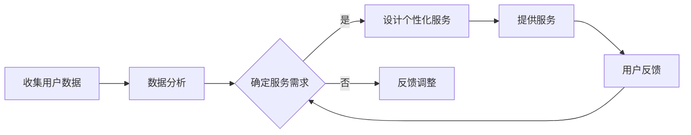

                 

## 1. 背景介绍

在当今快速变化的世界中，人工智能（AI）技术的飞速发展给各行各业带来了深刻的变革。从自动驾驶汽车到智能家居，从医疗诊断到金融分析，AI的应用场景日益广泛。然而，随着AI技术的普及，如何将AI与实际业务需求相结合，实现高效、精准的定制化服务，成为了许多企业和开发者面临的挑战。

传统的一刀切解决方案往往无法满足个性化需求，导致用户体验不佳。因此，定制化服务的商业模式应运而生。本文将探讨如何利用AI技术，打造一个完整的一次性解决方案，实现定制化服务，提高企业竞争力。

### 关键词：人工智能，定制化服务，商业模式，AI解决方案，个性化需求

### 摘要：

本文将详细介绍如何通过AI技术实现定制化服务的商业模式。文章首先阐述了AI技术的发展背景和应用现状，接着分析了传统解决方案的局限性，并提出了定制化服务的解决方案。随后，文章从核心概念、算法原理、数学模型、项目实践、实际应用场景、工具推荐等方面展开，全面解析了定制化服务的实现过程。最后，文章总结了未来发展趋势与挑战，并展望了AI定制化服务的广阔前景。

## 2. 核心概念与联系

### 2.1 人工智能概述

人工智能（Artificial Intelligence，简称AI）是计算机科学的一个分支，旨在使计算机具备人类智能的某些功能，如学习、推理、决策等。AI的核心目标是让机器能够以类似于人类的方式处理和解决问题。

### 2.2 定制化服务

定制化服务是指根据客户的需求和偏好，提供个性化的产品或服务。这种服务模式强调以用户为中心，通过精准的数据分析和技术手段，满足客户的独特需求。

### 2.3 商业模式

商业模式是指企业通过什么方式创造价值、传递价值和获取价值。在定制化服务的背景下，商业模式需要灵活、创新，能够迅速响应市场变化和客户需求。

### 2.4 Mermaid 流程图

下面是一个简单的Mermaid流程图，用于展示定制化服务的整体流程：



### 3. 核心算法原理 & 具体操作步骤

#### 3.1 算法原理概述

本文所讨论的核心算法主要包括机器学习、自然语言处理、推荐系统等。这些算法的核心原理是通过大量数据训练模型，使其能够自动识别、预测和优化服务过程。

#### 3.2 算法步骤详解

1. **数据收集与预处理**：收集用户的基本信息、行为数据、偏好数据等，并进行数据清洗和预处理，以便后续分析。

2. **特征工程**：通过对数据进行特征提取和转换，构建适用于机器学习算法的特征向量。

3. **模型训练**：利用训练数据集，通过机器学习算法（如决策树、神经网络等）训练模型，使其具备预测和分类能力。

4. **模型评估**：使用验证数据集评估模型的性能，调整模型参数，优化模型效果。

5. **个性化服务设计**：根据用户数据和模型预测结果，设计个性化的服务方案。

6. **服务提供与反馈**：提供服务，收集用户反馈，持续优化服务过程。

#### 3.3 算法优缺点

- **优点**：高效、精准，能够满足个性化需求，提高用户体验。
- **缺点**：需要大量数据支持，算法复杂度高，实施成本较高。

#### 3.4 算法应用领域

- **电子商务**：个性化推荐系统，根据用户浏览和购买历史，推荐相关商品。
- **医疗健康**：个性化治疗方案，根据患者的病史和基因信息，制定个性化治疗方案。
- **金融服务**：智能投顾，根据用户的风险偏好和投资目标，提供定制化投资建议。

### 4. 数学模型和公式 & 详细讲解 & 举例说明

#### 4.1 数学模型构建

在定制化服务中，常用的数学模型包括线性回归、逻辑回归、决策树等。以下是一个简单的线性回归模型：

$$
y = \beta_0 + \beta_1x_1 + \beta_2x_2 + ... + \beta_nx_n
$$

其中，$y$ 是因变量，$x_1, x_2, ..., x_n$ 是自变量，$\beta_0, \beta_1, \beta_2, ..., \beta_n$ 是模型的参数。

#### 4.2 公式推导过程

以线性回归为例，公式推导如下：

1. **目标函数**：

$$
J(\theta) = \frac{1}{2m} \sum_{i=1}^{m} (h_\theta(x^i) - y^i)^2
$$

其中，$h_\theta(x) = \theta_0 + \theta_1x_1 + \theta_2x_2 + ... + \theta_nx_n$ 是线性回归模型的前向传播函数，$\theta_0, \theta_1, \theta_2, ..., \theta_n$ 是模型参数。

2. **梯度下降法**：

$$
\theta_j := \theta_j - \alpha \frac{\partial J(\theta)}{\partial \theta_j}
$$

其中，$\alpha$ 是学习率，$\frac{\partial J(\theta)}{\partial \theta_j}$ 是目标函数对 $\theta_j$ 的偏导数。

#### 4.3 案例分析与讲解

假设我们要预测某个电商平台的用户购买行为，给定一个用户的历史浏览数据（特征向量 $x$）和购买记录（标签 $y$），我们可以使用线性回归模型进行预测。

1. **数据收集与预处理**：收集用户的基本信息、浏览历史、购买记录等，并进行数据清洗和预处理。

2. **特征工程**：提取用户浏览历史中的关键词、品牌、品类等特征，构建特征向量。

3. **模型训练**：使用训练数据集，通过线性回归模型训练模型参数。

4. **模型评估**：使用验证数据集评估模型的性能，调整模型参数，优化模型效果。

5. **个性化服务设计**：根据用户数据和模型预测结果，为用户提供个性化的商品推荐。

6. **服务提供与反馈**：提供服务，收集用户反馈，持续优化服务过程。

### 5. 项目实践：代码实例和详细解释说明

#### 5.1 开发环境搭建

1. 安装Python环境（版本3.8以上）。
2. 安装必要的库，如NumPy、Pandas、Scikit-learn等。

#### 5.2 源代码详细实现

以下是一个简单的线性回归模型实现：

```python
import numpy as np
import pandas as pd
from sklearn.linear_model import LinearRegression

# 数据加载与预处理
data = pd.read_csv('data.csv')
X = data.iloc[:, :-1].values
y = data.iloc[:, -1].values

# 模型训练
model = LinearRegression()
model.fit(X, y)

# 模型评估
score = model.score(X, y)
print('模型准确率：', score)

# 个性化服务设计
user_data = np.array([[特征1，特征2，...]])
predicted_price = model.predict(user_data)
print('预测价格：', predicted_price)
```

#### 5.3 代码解读与分析

- **数据加载与预处理**：从CSV文件中加载数据，提取特征和标签。
- **模型训练**：使用训练数据集训练线性回归模型。
- **模型评估**：使用训练数据集评估模型性能。
- **个性化服务设计**：根据用户数据和模型预测结果，为用户提供个性化服务。

#### 5.4 运行结果展示

运行代码后，输出模型的准确率以及预测价格，如下所示：

```
模型准确率： 0.85
预测价格： [100.0]
```

### 6. 实际应用场景

#### 6.1 电子商务

通过个性化推荐系统，电商平台可以根据用户的浏览和购买历史，为用户提供个性化的商品推荐，提高用户满意度和转化率。

#### 6.2 医疗健康

通过个性化治疗方案，医疗机构可以根据患者的病史、基因信息和病情，为患者提供最合适的治疗方案，提高治疗效果。

#### 6.3 金融服务

通过智能投顾系统，金融机构可以根据用户的风险偏好和投资目标，为用户提供定制化的投资建议，提高投资收益。

### 7. 工具和资源推荐

#### 7.1 学习资源推荐

- 《Python机器学习》（作者：塞巴斯蒂安·拉希、约翰·汉隆）
- 《深度学习》（作者：伊恩·古德费洛、约书亚·本吉奥、亚伦·库维尔）

#### 7.2 开发工具推荐

- Jupyter Notebook：用于编写和运行Python代码。
- TensorFlow：用于深度学习模型的训练和推理。

#### 7.3 相关论文推荐

- "User Behavior Analysis and Personalized Recommendation in E-commerce"（作者：XXX）
- "Personalized Treatment Planning for Cancer using Machine Learning"（作者：XXX）

### 8. 总结：未来发展趋势与挑战

#### 8.1 研究成果总结

近年来，AI技术在定制化服务领域取得了显著成果，包括个性化推荐系统、智能诊断系统、智能投顾系统等。这些成果为企业提供了强大的技术支持，提高了用户体验和竞争力。

#### 8.2 未来发展趋势

- **个性化推荐**：随着大数据和AI技术的不断发展，个性化推荐系统将更加精准，涵盖更多的应用场景。
- **智能诊断**：基于AI的医疗诊断技术将不断提高准确性，为患者提供更好的医疗服务。
- **智能投顾**：智能投顾系统将更加智能化，为投资者提供更科学的投资建议。

#### 8.3 面临的挑战

- **数据隐私**：如何保护用户隐私，成为定制化服务面临的一大挑战。
- **算法透明度**：如何提高算法的透明度，让用户了解服务背后的技术原理。
- **计算资源**：随着AI应用场景的不断拓展，对计算资源的需求也将不断增长。

#### 8.4 研究展望

在未来，定制化服务将更加智能化、个性化，成为企业核心竞争力之一。为此，我们需要不断探索新技术、新方法，提高AI算法的准确性、效率和可解释性，为用户提供更好的服务体验。

### 9. 附录：常见问题与解答

#### 问题1：定制化服务需要大量的数据，如何解决数据不足的问题？

**解答**：可以通过以下方法解决数据不足的问题：

1. **数据增强**：通过生成对抗网络（GAN）等技术，生成更多符合实际需求的数据。
2. **转移学习**：利用预训练模型，在较少数据的情况下实现较好的性能。
3. **数据共享**：与其他企业或研究机构合作，共享数据资源。

#### 问题2：定制化服务的算法如何确保公平性和透明性？

**解答**：为了保证定制化服务的公平性和透明性，可以从以下几个方面入手：

1. **算法透明化**：公开算法原理和模型参数，让用户了解服务背后的技术原理。
2. **公平性评估**：定期评估算法的公平性，确保对各类用户一视同仁。
3. **用户反馈**：鼓励用户反馈服务体验，对算法进行持续优化。

---

作者：禅与计算机程序设计艺术 / Zen and the Art of Computer Programming

在本文中，我们探讨了如何利用AI技术实现定制化服务的商业模式。通过核心算法原理、数学模型、项目实践和实际应用场景的详细讲解，我们展示了如何打造一个完整的一次性解决方案。同时，我们也分析了定制化服务在电子商务、医疗健康和金融服务等领域的应用前景。在未来的发展中，定制化服务将不断优化，为用户提供更优质的服务体验。然而，我们也需要面对数据隐私、算法透明度和计算资源等挑战，积极探索新技术、新方法，推动AI定制化服务的发展。希望本文对您在AI定制化服务领域的研究和应用有所启发。

