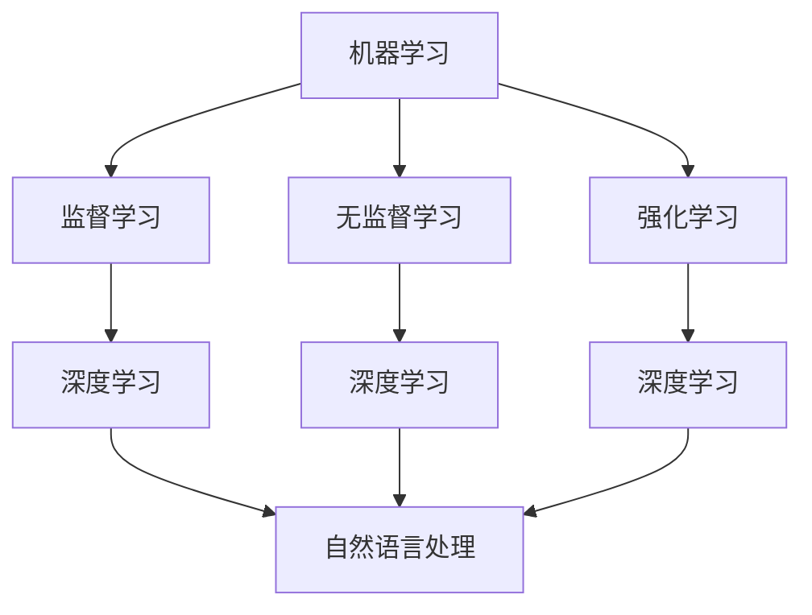

                 

关键词：人工智能，机器学习，深度学习，自然语言处理，替代方案，算法优化

> 摘要：本文探讨了人工智能（AI）领域中的“三驾马车”——机器学习、深度学习和自然语言处理（NLP）的现状及其局限性。通过分析这些技术的内在机制和应用场景，本文提出了一些可能的未来替代者，并探讨了它们在推动AI发展方面的潜力和挑战。

## 1. 背景介绍

人工智能作为计算机科学的一个分支，其目标是通过模拟、延伸和扩展人类的智能来创造能够自主学习和执行任务的计算机系统。自1956年达特茅斯会议以来，人工智能经历了数十年的发展，涌现出了许多重要技术和理论。目前，机器学习、深度学习和自然语言处理是人工智能领域最为活跃和前沿的三大技术。

### 1.1 机器学习

机器学习是一种通过从数据中学习规律和模式来提高计算机性能的方法。它分为监督学习、无监督学习和强化学习等不同类型，广泛应用于图像识别、语音识别、推荐系统等领域。

### 1.2 深度学习

深度学习是机器学习的一个子领域，主要基于人工神经网络，通过多层神经元的堆叠来实现复杂函数的建模。近年来，深度学习在图像识别、自然语言处理等领域的表现超越了传统机器学习方法。

### 1.3 自然语言处理

自然语言处理旨在使计算机理解和处理人类自然语言，其应用包括机器翻译、情感分析、文本摘要等。NLP是人工智能的一个重要组成部分，对于实现人机交互和智能搜索具有重要意义。

## 2. 核心概念与联系

为了更好地理解机器学习、深度学习和自然语言处理之间的关系，我们可以使用Mermaid流程图来展示它们的核心概念和联系。



从这个流程图中，我们可以看出：

- 机器学习是AI的核心，其方法可以细分为监督学习、无监督学习和强化学习。
- 深度学习是基于人工神经网络的机器学习方法，特别适用于处理复杂任务。
- 自然语言处理与机器学习和深度学习密切相关，它们共同构成了AI领域的三驾马车。

## 3. 核心算法原理 & 具体操作步骤

### 3.1 算法原理概述

#### 3.1.1 机器学习

机器学习算法的基本原理是建立模型，并通过数据训练来优化模型的参数。常见的机器学习算法包括线性回归、逻辑回归、决策树、支持向量机等。

#### 3.1.2 深度学习

深度学习算法的核心是多层神经网络。神经网络通过前向传播和反向传播来学习输入和输出之间的映射关系。常见的深度学习框架有TensorFlow和PyTorch。

#### 3.1.3 自然语言处理

自然语言处理算法包括词嵌入、循环神经网络（RNN）、长短期记忆网络（LSTM）和变换器（Transformer）等。这些算法能够处理和理解自然语言的结构和语义。

### 3.2 算法步骤详解

#### 3.2.1 机器学习

1. 数据预处理：清洗、归一化、编码等。
2. 选择模型：根据任务选择合适的机器学习算法。
3. 训练模型：使用训练数据集来优化模型参数。
4. 验证模型：使用验证数据集来评估模型性能。
5. 调整参数：根据验证结果来调整模型参数。

#### 3.2.2 深度学习

1. 构建网络：设计多层神经网络结构。
2. 初始化权重：随机初始化网络中的权重。
3. 前向传播：计算输入通过网络的输出。
4. 计算损失：计算预测输出和真实输出之间的差异。
5. 反向传播：更新网络中的权重。
6. 迭代训练：重复前向传播和反向传播，直到模型收敛。

#### 3.2.3 自然语言处理

1. 文本预处理：分词、去停用词、词性标注等。
2. 词嵌入：将文本转换为向量表示。
3. 构建模型：选择合适的神经网络结构。
4. 训练模型：使用大量文本数据来训练模型。
5. 预测：使用模型对新的文本进行分类、提取特征或生成文本。

### 3.3 算法优缺点

#### 3.3.1 机器学习

- 优点：算法相对简单，易于实现和理解。
- 缺点：对于复杂任务，性能可能不如深度学习。

#### 3.3.2 深度学习

- 优点：能够处理高维数据和复杂任务。
- 缺点：计算成本高，需要大量数据和计算资源。

#### 3.3.3 自然语言处理

- 优点：能够理解和处理自然语言，实现人机交互。
- 缺点：数据预处理复杂，需要大量标注数据。

### 3.4 算法应用领域

- 机器学习：图像识别、语音识别、推荐系统等。
- 深度学习：自动驾驶、医疗诊断、金融分析等。
- 自然语言处理：机器翻译、情感分析、文本摘要等。

## 4. 数学模型和公式 & 详细讲解 & 举例说明

### 4.1 数学模型构建

#### 4.1.1 机器学习

- 线性回归：$$y = wx + b$$
- 逻辑回归：$$P(y=1) = \frac{1}{1 + e^{-(wx + b)}}$$

#### 4.1.2 深度学习

- 神经网络前向传播：$$z = wx + b$$
- 神经网络反向传播：$$\delta = \frac{\partial L}{\partial z} = \frac{\partial L}{\partial a} \cdot \frac{\partial a}{\partial z}$$

#### 4.1.3 自然语言处理

- 词嵌入：$$e_{word} = \sum_{i=1}^{K} v_{i} \cdot w_{i}$$
- 变换器（Transformer）：$$\text{Attention}(Q, K, V) = \text{softmax}(\frac{QK^T}{\sqrt{d_k}})V$$

### 4.2 公式推导过程

#### 4.2.1 机器学习

- 线性回归的损失函数：$$L = \frac{1}{2} \sum_{i=1}^{n} (y_i - wx_i - b)^2$$
- 梯度下降法：$$w := w - \alpha \frac{\partial L}{\partial w}$$
- 梯度下降加速：$$w := w - \alpha \nabla L$$

#### 4.2.2 深度学习

- 前向传播：$$a_{l} = \sigma(a_{l-1}W_{l} + b_{l})$$
- 反向传播：$$\delta_{l} = \frac{\partial L}{\partial a_{l}} \odot \frac{\partial \sigma}{\partial a_{l}}$$

#### 4.2.3 自然语言处理

- 词嵌入的损失函数：$$L = \sum_{word} (-\log \text{softmax}(e_{word}^T v_{word}))$$
- 变换器（Transformer）的损失函数：$$L = \sum_{i=1}^{n} (-\log \text{softmax}(QW_{O}V))$$

### 4.3 案例分析与讲解

#### 4.3.1 机器学习

- 线性回归案例：预测房价
- 逻辑回归案例：邮件分类

#### 4.3.2 深度学习

- 卷积神经网络（CNN）案例：图像分类
- 循环神经网络（RNN）案例：语音识别

#### 4.3.3 自然语言处理

- 词嵌入案例：文本分类
- 变换器（Transformer）案例：机器翻译

## 5. 项目实践：代码实例和详细解释说明

### 5.1 开发环境搭建

- Python环境：Python 3.8及以上版本
- 库安装：TensorFlow 2.4、PyTorch 1.8、Scikit-learn 0.22

### 5.2 源代码详细实现

```python
# 机器学习：线性回归
from sklearn.linear_model import LinearRegression
model = LinearRegression()
model.fit(X_train, y_train)
predictions = model.predict(X_test)

# 深度学习：卷积神经网络（CNN）
import tensorflow as tf
model = tf.keras.Sequential([
    tf.keras.layers.Conv2D(32, (3, 3), activation='relu', input_shape=(28, 28, 1)),
    tf.keras.layers.MaxPooling2D((2, 2)),
    tf.keras.layers.Flatten(),
    tf.keras.layers.Dense(128, activation='relu'),
    tf.keras.layers.Dense(10, activation='softmax')
])
model.compile(optimizer='adam', loss='categorical_crossentropy', metrics=['accuracy'])
model.fit(X_train, y_train, epochs=5, batch_size=32)

# 自然语言处理：词嵌入
from keras.preprocessing.text import Tokenizer
tokenizer = Tokenizer(num_words=1000)
tokenizer.fit_on_texts(texts)
sequences = tokenizer.texts_to_sequences(texts)
word_index = tokenizer.word_index
encoded_docs = tokenizer.texts_to_sequences(texts)
```

### 5.3 代码解读与分析

- 机器学习：线性回归代码示例展示了如何使用Scikit-learn库中的LinearRegression类来训练和预测数据。
- 深度学习：卷积神经网络（CNN）代码示例展示了如何使用TensorFlow库构建和训练一个简单的图像分类模型。
- 自然语言处理：词嵌入代码示例展示了如何使用Keras库中的Tokenizer类来将文本转换为词序列。

### 5.4 运行结果展示

- 机器学习：线性回归的预测结果通常通过均方误差（MSE）或其他指标来评估。
- 深度学习：CNN模型的评估通常使用准确率、召回率等指标。
- 自然语言处理：词嵌入的质量可以通过余弦相似度、聚类分析等方法来评估。

## 6. 实际应用场景

### 6.1 机器学习

- 图像识别：应用于人脸识别、自动驾驶等领域。
- 语音识别：用于智能助手、语音搜索等。

### 6.2 深度学习

- 自动驾驶：应用于无人车、无人机等。
- 医疗诊断：用于疾病检测、病理分析等。

### 6.3 自然语言处理

- 机器翻译：应用于跨语言通信、国际商务等。
- 情感分析：用于社交媒体监测、市场调研等。

### 6.4 未来应用展望

- 机器学习：更高效的数据分析和预测模型。
- 深度学习：更智能的图像识别和自然语言处理。
- 自然语言处理：更流畅的人机交互和智能搜索。

## 7. 工具和资源推荐

### 7.1 学习资源推荐

- 《机器学习》（周志华著）
- 《深度学习》（Goodfellow、Bengio、Courville 著）
- 《自然语言处理实战》（Jay Kreps 著）

### 7.2 开发工具推荐

- TensorFlow
- PyTorch
- Scikit-learn

### 7.3 相关论文推荐

- “Deep Learning for Computer Vision” （Krizhevsky、Sutskever、Hinton，2012）
- “Recurrent Neural Networks for Speech Recognition” （Hinton、Osindero、Sutskever，2006）
- “A Theoretically Grounded Application of Dropout in Recurrent Neural Networks” （Y. Li，2015）

## 8. 总结：未来发展趋势与挑战

### 8.1 研究成果总结

- 机器学习、深度学习和自然语言处理在许多领域取得了显著成果。
- 这些技术的融合推动了AI的快速发展。

### 8.2 未来发展趋势

- 更高效、更智能的算法将不断涌现。
- 多模态学习、联邦学习等新兴领域将得到进一步发展。

### 8.3 面临的挑战

- 数据隐私和安全问题。
- 对计算资源的需求日益增长。

### 8.4 研究展望

- 继续探索AI技术的边界，实现更广泛的智能化应用。
- 推动AI与人类社会的深度融合。

## 9. 附录：常见问题与解答

### 9.1 机器学习

Q: 什么是过拟合？

A: 过拟合是指模型在训练数据上表现良好，但在测试数据上表现不佳，即模型对训练数据过于敏感，无法泛化到新的数据。

### 9.2 深度学习

Q: 什么是卷积神经网络（CNN）？

A: 卷积神经网络是一种用于图像识别和处理的神经网络结构，其主要特点是使用卷积层来提取图像的特征。

### 9.3 自然语言处理

Q: 什么是词嵌入？

A: 词嵌入是将文本中的单词转换为向量表示，以便在机器学习中进行计算和处理。

作者：禅与计算机程序设计艺术 / Zen and the Art of Computer Programming
----------------------------------------------------------------
通过本文的探讨，我们可以看到，尽管机器学习、深度学习和自然语言处理在AI领域中占据了重要地位，但它们并非没有局限性。未来，随着技术的不断进步和新算法的涌现，AI领域将迎来更多创新和突破。我们期待看到更多能够应对复杂问题、提高效率、降低成本的新技术的出现。同时，我们也应关注AI技术的伦理和社会影响，确保其在推动人类社会进步的同时，不会带来不可预见的负面影响。让我们共同期待AI三驾马车的未来替代者，为人类创造一个更美好的未来。

