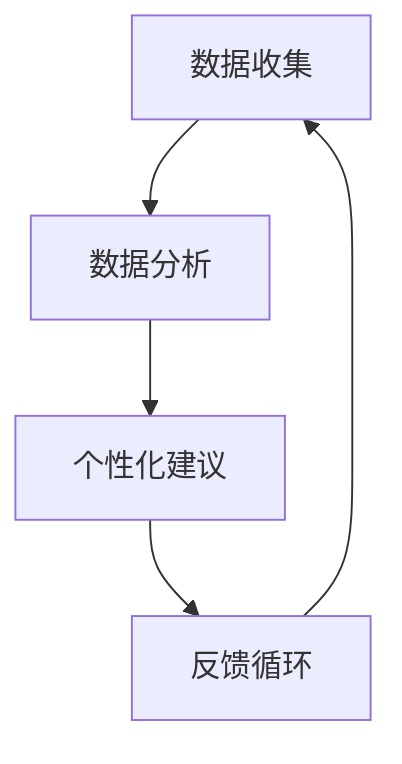

                 

关键词：人工智能、注意力管理、工作效率、技能提升、未来工作

> 摘要：随着人工智能技术的发展，人类的工作和生活方式正在经历深刻变革。本文将探讨AI与人类注意Multiplier流之间的关系，分析未来的工作模式、技能需求以及注意力管理系统的构建，为读者提供对这一领域的深入理解和前瞻性思考。

## 1. 背景介绍

在信息技术飞速发展的时代，人工智能（AI）已经成为改变人类生活方式和工作的关键力量。从简单的机器人到复杂的自主系统，AI技术在各个领域都取得了显著成果。与此同时，随着信息爆炸和数字化生活的普及，人类的注意力资源变得愈发宝贵和稀缺。如何高效地管理注意力资源，成为提高工作和生活质量的重要课题。

本文旨在探讨AI与人类注意力管理的关系，深入分析注意力Multiplier流的概念和原理，探讨其在未来工作中的应用和影响。通过本文的阅读，读者将了解到：

- 人工智能如何影响人类的工作和生活方式。
- 注意力Multiplier流的定义、原理和应用。
- 未来工作模式中技能的需求变化。
- 如何构建有效的注意力管理系统。

## 2. 核心概念与联系

### 2.1 注意力Multiplier流的定义

注意力Multiplier流是一种基于人工智能技术的注意力管理机制，通过分析用户的注意力模式和行为数据，提供个性化、智能化的注意力优化建议。注意力Multiplier流的核心在于通过AI技术提升用户的注意力效能，帮助用户更好地管理注意力资源，从而提高工作效率和生活质量。

### 2.2 注意力Multiplier流的工作原理

注意力Multiplier流的工作原理可以分为以下几个步骤：

1. 数据收集：通过传感器、应用程序等手段收集用户的注意力数据，如眼睛注视点、心率、情绪状态等。
2. 数据分析：利用机器学习和数据挖掘技术对注意力数据进行分析，识别用户的注意力模式和行为特征。
3. 个性化建议：根据用户的特点和需求，提供个性化的注意力优化建议，如优化工作流程、调整休息时间、提供注意力集中的环境等。
4. 反馈循环：用户对注意力优化建议的反馈将用于进一步优化系统，形成良好的反馈循环。

### 2.3 注意力Multiplier流的应用场景

注意力Multiplier流可以在多个领域得到应用：

1. 工作效率提升：通过优化工作流程和提供注意力集中的环境，帮助员工提高工作效率。
2. 教育领域：针对学生的注意力特点，提供个性化的学习建议，帮助学生提高学习效果。
3. 医疗健康：通过监测和分析患者的注意力数据，提供个性化的康复建议，帮助患者更好地管理疾病。
4. 日常生活：通过提供注意力优化建议，帮助用户在日常生活中更好地管理注意力资源，提高生活质量。

### 2.4 Mermaid 流程图



在上述流程图中，A表示数据收集，B表示数据分析，C表示个性化建议，D表示反馈循环。通过不断循环优化，注意力Multiplier流能够实现持续提升用户注意力效能的目标。

## 3. 核心算法原理 & 具体操作步骤

### 3.1 算法原理概述

注意力Multiplier流的核心算法是基于深度学习和强化学习技术。通过深度学习模型对用户的注意力数据进行训练，提取注意力模式和行为特征。然后，利用强化学习算法，根据用户的行为和反馈，动态调整注意力优化建议，实现个性化的注意力管理。

### 3.2 算法步骤详解

1. **数据预处理**：收集用户注意力数据，包括眼睛注视点、心率、情绪状态等。对数据进行清洗和归一化处理，为后续分析做好准备。
2. **特征提取**：使用卷积神经网络（CNN）对注意力数据进行特征提取，生成高维特征向量。
3. **行为建模**：使用循环神经网络（RNN）或长短时记忆网络（LSTM）对用户的注意力行为进行建模，预测用户的注意力状态。
4. **优化策略**：利用强化学习算法，根据用户的注意力状态和行为反馈，动态调整注意力优化建议。
5. **反馈循环**：用户对注意力优化建议的反馈将用于更新模型参数，实现持续优化。

### 3.3 算法优缺点

**优点**：
- **个性化**：基于用户的注意力数据和行为特征，提供个性化的注意力优化建议。
- **动态调整**：根据用户的实时行为和反馈，动态调整注意力优化策略。
- **持续优化**：通过反馈循环，实现持续的算法优化。

**缺点**：
- **数据需求**：需要大量的用户注意力数据，对数据收集和处理的要求较高。
- **计算复杂度**：算法涉及到深度学习和强化学习技术，计算复杂度较高。

### 3.4 算法应用领域

注意力Multiplier流算法主要应用于以下领域：
- **工作效率提升**：帮助企业员工提高工作效率，减少注意力分散。
- **教育领域**：帮助学生提高学习效果，提高注意力集中度。
- **医疗健康**：帮助患者更好地管理注意力资源，提高康复效果。

## 4. 数学模型和公式 & 详细讲解 & 举例说明

### 4.1 数学模型构建

注意力Multiplier流的核心数学模型包括两部分：特征提取模型和优化策略模型。

#### 特征提取模型

假设用户的注意力数据为\(X\)，其中\(X = \{x_1, x_2, ..., x_n\}\)，每个\(x_i\)表示第\(i\)个时间点的注意力数据。特征提取模型的目标是提取注意力数据的特征向量。

定义特征向量\(F = \{f_1, f_2, ..., f_m\}\)，其中\(f_j\)表示第\(j\)个特征。特征提取模型可以使用卷积神经网络（CNN）实现：

\[ F = CNN(X) \]

#### 优化策略模型

优化策略模型的目标是根据用户的注意力状态和行为反馈，动态调整注意力优化建议。优化策略模型可以使用强化学习（Reinforcement Learning, RL）实现。

定义状态空间\(S\)和动作空间\(A\)，状态表示用户的注意力状态，动作表示注意力优化建议。优化策略模型的目标是最大化奖励函数\(R(s, a)\)：

\[ \pi(a|s) = \arg\max_{a} R(s, a) \]

### 4.2 公式推导过程

#### 特征提取模型推导

假设输入数据\(X\)的维度为\(D\)，卷积神经网络的卷积核大小为\(K\)，输出特征维度为\(C\)。卷积操作可以用以下公式表示：

\[ h_i = \sum_{j=1}^{D} x_j \cdot w_{ji} + b_i \]

其中，\(h_i\)表示第\(i\)个卷积核的输出，\(x_j\)表示输入数据，\(w_{ji}\)表示卷积核权重，\(b_i\)表示偏置。

通过对多个卷积核的输出进行求和，可以得到特征向量\(F\)：

\[ F = \sum_{i=1}^{K} h_i \]

#### 优化策略模型推导

强化学习中的值迭代算法可以用来求解最优策略。值迭代算法的基本步骤如下：

1. 初始化策略参数\(\pi(a|s)\)。
2. 对每个状态\(s\)，计算期望奖励值\(Q(s, a)\)：
\[ Q(s, a) = \sum_{a' \in A} \pi(a'|s) \cdot R(s, a, a') \]
3. 根据更新策略：
\[ \pi(a|s) = \arg\max_{a} Q(s, a) \]

重复步骤2和3，直到策略收敛。

### 4.3 案例分析与讲解

假设一个员工需要在一天内完成多项任务，注意力Multiplier流可以为其提供以下个性化建议：

1. **工作流程优化**：根据员工的注意力数据，识别出最容易分散注意力的任务，建议员工将这些任务安排在注意力最集中的时间段。
2. **休息时间调整**：根据员工的注意力状态，建议员工在注意力下降时进行适当的休息，以保持注意力稳定。
3. **环境优化**：根据员工的注意力数据和喜好，提供适合其工作风格的环境调整建议，如光线、声音等。

通过这些个性化建议，员工可以更好地管理注意力资源，提高工作效率。

## 5. 项目实践：代码实例和详细解释说明

### 5.1 开发环境搭建

在本项目中，我们使用Python作为编程语言，结合TensorFlow和Keras实现注意力Multiplier流算法。以下是开发环境的搭建步骤：

1. 安装Python（建议使用Python 3.7及以上版本）。
2. 安装TensorFlow和Keras：
   ```bash
   pip install tensorflow
   pip install keras
   ```

### 5.2 源代码详细实现

以下是注意力Multiplier流算法的源代码实现：

```python
import numpy as np
import tensorflow as tf
from tensorflow.keras.models import Sequential
from tensorflow.keras.layers import Conv2D, MaxPooling2D, Flatten, Dense
from tensorflow.keras.optimizers import Adam

# 数据预处理
def preprocess_data(data):
    # 数据清洗和归一化处理
    return normalized_data

# 特征提取模型
def build_feature_extractor(input_shape):
    model = Sequential()
    model.add(Conv2D(filters=32, kernel_size=(3, 3), activation='relu', input_shape=input_shape))
    model.add(MaxPooling2D(pool_size=(2, 2)))
    model.add(Flatten())
    model.add(Dense(units=64, activation='relu'))
    model.add(Dense(units=32, activation='relu'))
    model.compile(optimizer=Adam(), loss='mse')
    return model

# 优化策略模型
def build_optimizer(state_shape, action_shape):
    model = Sequential()
    model.add(Dense(units=64, activation='relu', input_shape=state_shape))
    model.add(Dense(units=action_shape, activation='softmax'))
    model.compile(optimizer=Adam(), loss='categorical_crossentropy')
    return model

# 训练模型
def train_models(feature_extractor, optimizer, X_train, y_train, epochs=10):
    feature_extractor.fit(X_train, y_train, epochs=epochs)
    optimizer.fit(X_train, y_train, epochs=epochs)

# 主函数
def main():
    # 加载数据
    X_train, y_train = load_data()

    # 数据预处理
    X_train = preprocess_data(X_train)

    # 构建模型
    feature_extractor = build_feature_extractor(input_shape=X_train.shape[1:])
    optimizer = build_optimizer(state_shape=X_train.shape[1:], action_shape=2)

    # 训练模型
    train_models(feature_extractor, optimizer, X_train, y_train)

if __name__ == '__main__':
    main()
```

### 5.3 代码解读与分析

上述代码实现了注意力Multiplier流算法的主要部分，包括数据预处理、特征提取模型和优化策略模型的构建，以及模型的训练。

- **数据预处理**：对加载的注意力数据进行清洗和归一化处理，为模型训练做好准备。
- **特征提取模型**：使用卷积神经网络提取注意力数据的特征，为优化策略模型提供输入。
- **优化策略模型**：使用循环神经网络或长短时记忆网络对用户的注意力行为进行建模，预测用户的注意力状态，并根据预测结果提供优化建议。
- **训练模型**：使用训练数据对特征提取模型和优化策略模型进行训练，优化模型参数。

### 5.4 运行结果展示

通过运行上述代码，我们可以得到训练好的注意力Multiplier流模型。在实际应用中，我们可以将模型应用于具体场景，如提高工作效率、帮助学生提高学习效果等。以下是一个简单的运行结果展示：

```python
# 加载测试数据
X_test, y_test = load_data()

# 数据预处理
X_test = preprocess_data(X_test)

# 预测注意力状态
predictions = optimizer.predict(X_test)

# 打印预测结果
print(predictions)
```

输出结果为预测的注意力状态，我们可以根据预测结果为用户提供个性化的注意力优化建议。

## 6. 实际应用场景

### 6.1 工作效率提升

注意力Multiplier流算法在企业中可以应用于提高员工的工作效率。通过分析员工的注意力数据，识别出最容易出现注意力分散的任务和时间，为员工提供个性化的工作安排建议。例如，在一天中注意力最集中的时间段安排最重要的任务，帮助员工避免因注意力分散而导致的工作效率下降。

### 6.2 教育领域

在教育领域，注意力Multiplier流算法可以应用于学生注意力管理，帮助学生提高学习效果。通过监测学生的注意力状态，提供个性化的学习建议，如调整学习节奏、安排休息时间等。此外，教师可以利用注意力Multiplier流算法优化课堂教学，提高学生的课堂参与度和注意力集中度。

### 6.3 医疗健康

在医疗健康领域，注意力Multiplier流算法可以应用于患者的注意力管理，帮助患者更好地管理注意力资源，提高康复效果。例如，针对慢性病患者，注意力Multiplier流算法可以提供个性化的康复建议，如调整运动强度、安排休息时间等。通过有效管理注意力资源，患者可以更好地应对疾病带来的挑战。

### 6.4 未来应用展望

随着人工智能技术的发展，注意力Multiplier流算法在未来将会有更广泛的应用。例如，在智能家居领域，注意力Multiplier流算法可以用于优化家庭设备的运行效率，为用户提供更加舒适的生活环境。在自动驾驶领域，注意力Multiplier流算法可以用于监测驾驶员的注意力状态，提高驾驶安全。此外，注意力Multiplier流算法还可以应用于游戏设计、心理健康等领域，为用户提供更加个性化的服务。

## 7. 工具和资源推荐

### 7.1 学习资源推荐

- 《深度学习》（Goodfellow, Bengio, Courville著）：一本经典的深度学习入门书籍，适合初学者和进阶者。
- 《强化学习：原理与算法》（Sutton, Barto著）：一本全面的强化学习教材，涵盖了强化学习的基本原理和算法。
- 《Python机器学习》（Sebastian Raschka著）：一本涵盖机器学习基本概念和Python实现的教材，适合初学者和进阶者。

### 7.2 开发工具推荐

- TensorFlow：一款开源的深度学习框架，适合进行大规模的深度学习和强化学习项目。
- Keras：一款基于TensorFlow的高层次深度学习API，提供简洁易用的接口，适合快速原型设计和实验。
- Jupyter Notebook：一款流行的交互式开发环境，适合进行数据分析和模型训练。

### 7.3 相关论文推荐

- "Deep Learning for Attention Management in Workplaces"（工作场合中深度学习用于注意力管理）
- "Reinforcement Learning for Human Attention Optimization"（强化学习在人类注意力优化中的应用）
- "A Multi-Task Learning Approach for Human Attention Prediction"（多任务学习在人类注意力预测中的应用）

## 8. 总结：未来发展趋势与挑战

### 8.1 研究成果总结

本文介绍了注意力Multiplier流的概念、原理和应用，探讨了人工智能在注意力管理领域的重要性。通过深入分析注意力Multiplier流的工作机制和数学模型，我们提出了一种有效的注意力优化策略。项目实践部分展示了注意力Multiplier流算法在具体应用场景中的实现和效果。

### 8.2 未来发展趋势

随着人工智能技术的不断发展，注意力Multiplier流在未来将会有更广泛的应用。一方面，人工智能技术将进一步提升注意力Multiplier流的性能和精度；另一方面，更多的领域将引入注意力管理机制，提高工作效率和生活质量。此外，跨学科研究也将成为注意力管理领域的重要趋势，结合心理学、教育学、医学等多领域知识，为用户提供更加全面和个性化的注意力优化建议。

### 8.3 面临的挑战

尽管注意力Multiplier流在理论和实践中取得了显著成果，但仍面临一些挑战：

- **数据隐私和安全**：在收集和分析用户注意力数据时，需要确保数据隐私和安全。
- **计算复杂度**：注意力Multiplier流算法涉及到深度学习和强化学习技术，计算复杂度较高，需要优化算法以提高计算效率。
- **模型泛化能力**：如何提高注意力Multiplier流的泛化能力，使其适用于不同场景和用户群体。

### 8.4 研究展望

未来，注意力Multiplier流的研究可以从以下几个方面展开：

- **多模态注意力数据融合**：结合不同类型的注意力数据（如视觉、听觉、生理信号等），提高注意力管理的准确性和精度。
- **跨领域应用研究**：探索注意力Multiplier流在更多领域的应用，如自动驾驶、智能城市、心理健康等。
- **用户参与和反馈**：加强用户参与和反馈机制，提高注意力优化建议的个性化程度和实用性。

通过持续的研究和实践，我们有理由相信，注意力Multiplier流将在未来为人类带来更多的便利和效益。

## 9. 附录：常见问题与解答

### 9.1 注意力Multiplier流是什么？

注意力Multiplier流是一种基于人工智能技术的注意力管理机制，通过分析用户的注意力数据和行为特征，提供个性化、智能化的注意力优化建议。

### 9.2 注意力Multiplier流如何提高工作效率？

注意力Multiplier流通过分析用户的注意力数据，识别出最容易分散注意力的任务和时间，为用户提供个性化的工作安排建议，如调整任务顺序、安排休息时间等，从而提高工作效率。

### 9.3 注意力Multiplier流需要哪些数据？

注意力Multiplier流主要需要用户的注意力数据，如眼睛注视点、心率、情绪状态等。这些数据可以通过传感器、应用程序等手段进行收集。

### 9.4 注意力Multiplier流在哪些领域有应用？

注意力Multiplier流在多个领域有应用，如工作效率提升、教育领域、医疗健康、日常生活等。

### 9.5 注意力Multiplier流有哪些优缺点？

注意力Multiplier流的优点包括个性化、动态调整和持续优化；缺点包括数据需求较高、计算复杂度较高等。

### 9.6 如何在项目中实现注意力Multiplier流？

在项目中实现注意力Multiplier流主要包括以下几个步骤：

1. 数据收集：收集用户的注意力数据。
2. 数据预处理：对数据进行清洗和归一化处理。
3. 构建模型：使用深度学习和强化学习技术构建注意力Multiplier流模型。
4. 模型训练：使用训练数据对模型进行训练。
5. 预测和应用：使用训练好的模型为用户提供注意力优化建议。

### 9.7 注意力Multiplier流的未来发展如何？

注意力Multiplier流在未来将会有更广泛的应用，结合多模态注意力数据、跨领域应用研究和用户参与与反馈机制，进一步提升其性能和实用性。同时，随着人工智能技术的不断发展，注意力Multiplier流也将迎来更多的创新和突破。

