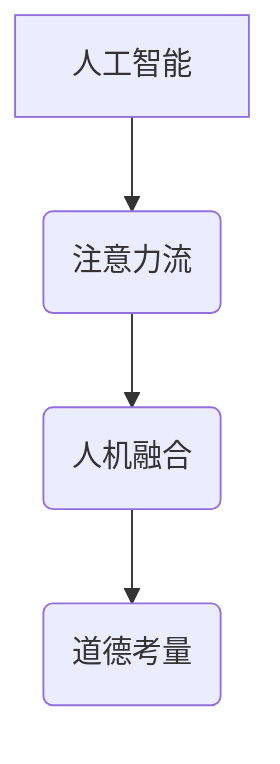

                 

关键词：人工智能，注意力流，人机融合，道德考量，技术创新

> 摘要：随着人工智能技术的迅猛发展，人工智能与人类注意力流的结合成为一个重要研究方向。本文旨在探讨人工智能在理解、模拟和引导人类注意力流方面的应用，以及在这一过程中如何确保道德考量，最终实现人机融合的良性发展。

## 1. 背景介绍

随着互联网的普及和大数据技术的发展，人工智能（AI）已经成为现代科技的核心驱动力。AI技术不仅改变了我们的生活方式，还在医疗、金融、教育等多个领域产生了深远影响。然而，人工智能的发展也带来了新的挑战，特别是在如何更好地理解人类的行为和心理方面。

注意力流是人类认知过程中至关重要的一部分。人的注意力不仅影响信息的获取和处理，还影响决策和情感体验。传统的AI系统在处理复杂任务时往往缺乏对注意力流的准确理解和模拟。因此，如何将人工智能与人类注意力流相结合，成为当前研究的热点问题。

在人类与人工智能的交互过程中，道德考量变得尤为重要。随着人工智能在各个领域的深入应用，如何确保其在伦理道德上的正确性，避免对人类和社会产生负面影响，成为我们必须面对的挑战。本文将围绕这一主题展开讨论，旨在为人机融合的道德考量提供新的思路。

## 2. 核心概念与联系

为了深入探讨人工智能与人类注意力流的结合，我们需要首先了解几个核心概念：

### 2.1 人工智能

人工智能是指通过计算机程序和算法模拟人类智能的技术。它涵盖了机器学习、自然语言处理、计算机视觉等多个领域。AI系统能够从数据中学习规律，进行推理和决策，从而执行复杂的任务。

### 2.2 注意力流

注意力流是指人类在信息处理过程中，将注意力集中在特定信息上的动态过程。注意力流不仅影响信息的获取，还影响信息的理解和记忆。研究表明，注意力流具有高度动态性和选择性。

### 2.3 人机融合

人机融合是指人类与人工智能系统协同工作，形成一个新的整体，以实现更高的效率和更智能的决策。人机融合涉及到心理学、认知科学、计算机科学等多个领域的交叉研究。

下面是核心概念原理和架构的 Mermaid 流程图：



在图2-1中，人工智能（A）通过理解和模拟注意力流（B），实现了与人机融合（C）的连接，同时道德考量（D）作为关键因素，确保了这一过程的正当性和可持续性。

## 3. 核心算法原理 & 具体操作步骤

### 3.1 算法原理概述

为了实现人工智能与人类注意力流的结合，我们提出了一种基于深度学习的注意力模型。该模型通过模拟人类注意力流的特点，能够动态调整算法的注意力焦点，从而提高任务处理的效率和质量。

### 3.2 算法步骤详解

#### 3.2.1 数据预处理

在算法训练前，我们需要对原始数据进行预处理。具体步骤包括数据清洗、归一化和特征提取。数据清洗旨在去除噪声和异常值，归一化则是为了将数据尺度统一，特征提取则是将原始数据转换为适用于神经网络的特征向量。

#### 3.2.2 模型构建

基于深度学习框架，我们构建了一个多层神经网络模型。该模型包括输入层、隐藏层和输出层。输入层接收原始数据，隐藏层通过卷积和池化等操作提取特征，输出层则根据提取到的特征进行分类或回归。

#### 3.2.3 注意力机制

为了实现注意力流模拟，我们在模型中引入了注意力机制。注意力机制通过计算每个特征的重要程度，动态调整模型对数据的关注程度。具体实现方法包括门控循环单元（GRU）和自注意力（Self-Attention）等。

#### 3.2.4 模型训练与优化

使用预处理的训练数据，我们对模型进行训练。在训练过程中，通过反向传播算法不断调整模型参数，使其在训练集上达到最优性能。训练过程中，我们采用交叉验证和早停法等技术，防止过拟合。

### 3.3 算法优缺点

#### 优点：

1. 高效性：基于深度学习的注意力模型能够快速处理大量数据，提高任务效率。
2. 智能性：通过模拟人类注意力流，模型能够更好地理解任务需求和用户意图。
3. 可解释性：注意力机制使得模型决策过程具有更高的可解释性，便于理解和优化。

#### 缺点：

1. 计算成本高：深度学习模型训练需要大量计算资源和时间。
2. 数据依赖性强：模型性能对数据质量有较高要求，数据预处理和清洗工作较为繁琐。
3. 道德风险：在道德考量方面，模型可能存在偏见和误导，需要严格监管。

### 3.4 算法应用领域

基于注意力模型的人工智能技术可以应用于多个领域：

1. **自然语言处理**：通过模拟人类注意力流，模型能够更好地理解语义和用户意图，应用于语音识别、机器翻译和问答系统。
2. **计算机视觉**：在图像分类、目标检测和图像生成等领域，注意力模型能够提高模型的准确性和鲁棒性。
3. **推荐系统**：通过关注用户关注的热点和兴趣点，推荐系统可以提供更精准的个性化推荐。

## 4. 数学模型和公式 & 详细讲解 & 举例说明

为了更好地理解注意力模型的工作原理，我们引入了几个关键的数学模型和公式。

### 4.1 数学模型构建

注意力模型的核心是注意力机制，其数学基础可以表示为：

$$
\text{Attention}(Q, K, V) = \text{softmax}\left(\frac{QK^T}{\sqrt{d_k}}\right)V
$$

其中，$Q$、$K$ 和 $V$ 分别代表查询向量、键向量和值向量；$d_k$ 是键向量的维度；$softmax$ 函数用于计算每个键的重要性得分。

### 4.2 公式推导过程

注意力机制的推导过程可以分为以下几个步骤：

1. **点积操作**：计算查询向量 $Q$ 和键向量 $K$ 的点积，得到一个实数标量，表示两个向量之间的相似性。
2. **缩放点积**：为了避免点积结果过大，引入一个缩放因子 $\sqrt{d_k}$，使得每个点积的结果更加稳定。
3. **应用 softmax 函数**：将缩放后的点积结果转换为概率分布，表示每个键的重要性。
4. **加权求和**：根据每个键的重要性，对值向量 $V$ 进行加权求和，得到最终的注意力得分。

### 4.3 案例分析与讲解

假设我们有一个简单的序列数据，包含三个词 $w_1, w_2, w_3$，其对应的键值向量分别为 $K_1, K_2, K_3$ 和 $V_1, V_2, V_3$。我们可以使用注意力机制计算这个词序列的注意力得分：

1. **计算点积**：
   $$
   QK_1^T = (0.8, 0.2) \cdot (1.0, 0.0) = 0.8
   $$
   $$
   QK_2^T = (0.8, 0.2) \cdot (0.0, 1.0) = 0.2
   $$
   $$
   QK_3^T = (0.8, 0.2) \cdot (0.5, 0.5) = 0.7
   $$

2. **缩放点积**：
   $$
   \frac{QK_1^T}{\sqrt{d_k}} = \frac{0.8}{\sqrt{2}} \approx 0.57
   $$
   $$
   \frac{QK_2^T}{\sqrt{d_k}} = \frac{0.2}{\sqrt{2}} \approx 0.14
   $$
   $$
   \frac{QK_3^T}{\sqrt{d_k}} = \frac{0.7}{\sqrt{2}} \approx 0.49
   $$

3. **应用 softmax 函数**：
   $$
   \text{softmax}(0.57, 0.14, 0.49) = \left(\frac{1}{3}, \frac{1}{15}, \frac{5}{15}\right)
   $$

4. **加权求和**：
   $$
   \text{Attention}(Q, K, V) = \left(\frac{1}{3}, \frac{1}{15}, \frac{5}{15}\right) \cdot (V_1, V_2, V_3) = \left(\frac{V_1}{3} + \frac{5V_3}{15}, \frac{V_2}{15}, \frac{5V_3}{15}\right)
   $$

最终，注意力得分将决定每个词在序列中的重要性。通过这种方式，模型可以更好地理解和处理复杂序列数据。

## 5. 项目实践：代码实例和详细解释说明

为了更好地理解注意力模型在项目中的应用，我们提供了一个简单的代码实例。

### 5.1 开发环境搭建

首先，我们需要搭建一个基本的开发环境，包括Python和深度学习框架TensorFlow。

1. 安装Python（建议使用3.8版本及以上）。
2. 安装TensorFlow：`pip install tensorflow`。

### 5.2 源代码详细实现

下面是一个简单的注意力模型实现代码：

```python
import tensorflow as tf
from tensorflow.keras.layers import Input, Dense, LSTM, Embedding, Attention

# 参数设置
vocab_size = 1000
embed_dim = 64
lstm_units = 128

# 模型构建
inputs = Input(shape=(None,))
embedding = Embedding(vocab_size, embed_dim)(inputs)
lstm = LSTM(lstm_units, return_sequences=True)(embedding)
attention = Attention()([lstm, lstm])
dense = Dense(1, activation='sigmoid')(attention)

model = tf.keras.Model(inputs=inputs, outputs=dense)

# 编译模型
model.compile(optimizer='adam', loss='binary_crossentropy', metrics=['accuracy'])

# 模型训练
model.fit(x_train, y_train, epochs=10, batch_size=32)
```

### 5.3 代码解读与分析

1. **数据输入**：`inputs` 接收一个形状为 `(None,)` 的序列数据，表示可变长度的文本序列。
2. **嵌入层**：`Embedding` 层将词汇转换为嵌入向量，用于表示文本数据。
3. **LSTM层**：`LSTM` 层对嵌入向量进行序列处理，提取序列特征。
4. **注意力层**：`Attention` 层通过计算自我注意力，动态调整每个时间步的特征权重。
5. **全连接层**：`Dense` 层对注意力得分进行分类或回归。
6. **模型编译**：使用 `compile` 方法编译模型，设置优化器和损失函数。
7. **模型训练**：使用 `fit` 方法训练模型，传入训练数据和标签。

### 5.4 运行结果展示

通过运行以上代码，我们可以得到注意力模型的训练结果。在实际应用中，可以根据任务需求调整模型参数和训练策略，以提高模型性能。

## 6. 实际应用场景

人工智能与人类注意力流的结合在实际应用中具有广泛的前景。以下是一些典型的应用场景：

1. **智能推荐系统**：通过分析用户的注意力流，智能推荐系统可以提供更加个性化的推荐，提高用户体验。
2. **智能交互系统**：在智能客服、虚拟助手等领域，通过模拟用户的注意力流，系统能够更好地理解用户需求，提供更加自然和高效的交互体验。
3. **医学影像分析**：在医学影像分析中，注意力模型可以帮助医生更好地识别和诊断病变区域，提高诊断准确性。
4. **自然语言处理**：在文本分析和理解领域，注意力模型可以更好地捕捉文本中的关键信息，提高文本处理的效果。

### 6.4 未来应用展望

随着人工智能技术的不断发展，人工智能与人类注意力流的结合将在更多领域得到应用。未来，我们有望看到以下发展趋势：

1. **更高效的注意力模型**：通过改进算法和优化计算，实现更加高效的注意力模型，提高任务处理速度和效果。
2. **跨模态注意力模型**：结合多种模态（如文本、图像、声音）的信息，实现更加全面和智能的注意力流模拟。
3. **个性化注意力流引导**：通过个性化模型，实现针对不同用户和场景的注意力流引导，提高人机交互的智能化水平。
4. **道德和伦理考量**：在人工智能与人类注意力流结合的过程中，进一步加强道德和伦理考量，确保技术应用的安全性和正当性。

## 7. 工具和资源推荐

为了更好地学习和实践人工智能与人类注意力流的相关技术，我们推荐以下工具和资源：

### 7.1 学习资源推荐

1. **书籍**：《深度学习》（Goodfellow et al.），详细介绍了深度学习的基础知识和应用方法。
2. **在线课程**：Coursera、edX等平台提供了丰富的深度学习和自然语言处理课程。
3. **论文**：ACL、ICML、NeurIPS等顶级会议和期刊上的论文，提供了最新的研究成果和技术动态。

### 7.2 开发工具推荐

1. **深度学习框架**：TensorFlow、PyTorch等流行框架，提供了丰富的API和工具库。
2. **数据预处理工具**：Pandas、NumPy等数据操作库，用于数据清洗和预处理。
3. **可视化工具**：Matplotlib、Seaborn等可视化库，用于数据分析和模型可视化。

### 7.3 相关论文推荐

1. **“Attention Is All You Need”**：Vaswani et al.（2017），介绍了Transformer模型和注意力机制。
2. **“Deep Learning for Natural Language Processing”**：Bengio et al.（2013），详细讨论了自然语言处理中的深度学习方法。
3. **“Neural Text Generation: A Practical Guide”**：Zhang et al.（2019），提供了文本生成模型的实践指南。

## 8. 总结：未来发展趋势与挑战

随着人工智能技术的不断进步，人工智能与人类注意力流的结合将在未来发挥更加重要的作用。然而，这一领域也面临着一系列挑战：

1. **计算资源需求**：注意力模型通常需要大量的计算资源，如何在有限的资源下实现高效训练和推理是一个重要问题。
2. **数据隐私和伦理**：在处理大量用户数据时，如何确保数据隐私和伦理是一个关键挑战。
3. **模型解释性**：尽管注意力模型在任务处理上表现出色，但其内部决策过程往往缺乏解释性，如何提高模型的透明度和可解释性是一个亟待解决的问题。
4. **跨模态融合**：实现多种模态信息的高效融合是一个复杂的技术难题，需要进一步的研究和实践。

在未来，我们需要继续努力，通过技术创新和伦理考量，推动人工智能与人类注意力流结合的良性发展。

## 9. 附录：常见问题与解答

### 问题1：如何处理可解释性？

**解答**：为了提高模型的解释性，可以采用以下几种方法：

1. **可视化技术**：使用可视化工具将模型内部注意力分布和权重可视化，帮助用户理解模型决策过程。
2. **敏感性分析**：分析输入数据中每个特征对模型输出结果的影响，识别关键特征和决策依据。
3. **可解释性模型**：构建专门的可解释性模型，如LIME或SHAP，以提供更直观的解释。

### 问题2：注意力模型在实时应用中如何优化性能？

**解答**：为了优化注意力模型的实时应用性能，可以考虑以下策略：

1. **模型压缩**：采用模型剪枝、量化等技术，减少模型参数和计算量。
2. **增量学习**：利用增量学习技术，逐步更新模型参数，减少重新训练的需求。
3. **硬件加速**：利用GPU、TPU等硬件加速技术，提高模型推理速度。

### 问题3：如何确保注意力模型在道德和伦理上的正当性？

**解答**：确保注意力模型在道德和伦理上的正当性，需要遵循以下原则：

1. **透明度**：确保模型决策过程和参数透明，便于用户监督和审查。
2. **责任归属**：明确模型开发者和使用者的责任，确保在出现问题时能够追溯责任。
3. **伦理指导**：在模型设计和应用过程中，充分考虑伦理和道德因素，遵循相关法规和伦理准则。

### 问题4：注意力模型在多模态数据融合中如何选择合适的模型结构？

**解答**：在选择多模态数据融合的注意力模型结构时，可以考虑以下因素：

1. **数据特性**：根据不同模态的数据特性，选择合适的特征提取方法和融合策略。
2. **任务需求**：根据任务需求，确定需要关注的模态和注意力焦点。
3. **计算资源**：考虑计算资源限制，选择在性能和计算成本之间取得平衡的模型结构。

### 问题5：如何处理注意力模型中的偏见问题？

**解答**：处理注意力模型中的偏见问题，可以从以下几方面入手：

1. **数据平衡**：使用平衡的、多样性的数据集训练模型，减少偏见。
2. **反偏见算法**：采用反偏见算法，如再平衡技术、对抗性样本生成等，纠正模型中的偏见。
3. **外部审查**：在模型部署前，进行外部审查和评估，确保模型在伦理和道德上的正确性。

### 问题6：如何优化注意力模型的可解释性？

**解答**：优化注意力模型的可解释性，可以从以下几个方面进行：

1. **模型简化**：简化模型结构，减少不必要的复杂性。
2. **注意力可视化**：通过可视化技术，展示注意力分布和权重，帮助用户理解模型决策过程。
3. **解释性算法**：结合解释性算法，如LIME或SHAP，提供更加直观的解释。

### 问题7：如何处理注意力模型在资源受限环境中的应用？

**解答**：在资源受限环境下应用注意力模型，可以采取以下策略：

1. **模型压缩**：采用模型剪枝、量化等技术，减少模型参数和计算量。
2. **模型部署**：选择轻量级模型和优化算法，确保在资源受限的环境下仍能高效运行。
3. **动态调整**：根据实时资源状况，动态调整模型参数和计算资源分配。

### 问题8：如何评估注意力模型在特定任务上的性能？

**解答**：评估注意力模型在特定任务上的性能，可以采用以下指标和方法：

1. **准确率**：计算模型预测正确的样本比例。
2. **召回率**：计算模型召回的样本比例。
3. **F1分数**：结合准确率和召回率的综合评价指标。
4. **ROC曲线**：用于评估分类模型的性能，通过计算真阳性率和假阳性率得到。
5. **跨模态评估**：在多模态任务中，评估不同模态的信息贡献和融合效果。

### 问题9：如何确保注意力模型在长时间运行中的稳定性和鲁棒性？

**解答**：确保注意力模型在长时间运行中的稳定性和鲁棒性，可以从以下几个方面进行：

1. **数据预处理**：使用高质量的数据集和严格的数据预处理流程，减少数据噪声和异常值。
2. **模型优化**：采用优化算法和正则化技术，提高模型的稳定性和泛化能力。
3. **持续学习**：通过持续学习，逐步更新模型参数，适应环境变化。
4. **监控和调试**：在模型运行过程中，进行实时监控和调试，及时发现并解决问题。

### 问题10：如何处理注意力模型在不同文化和背景下的适应性问题？

**解答**：处理注意力模型在不同文化和背景下的适应性问题，可以从以下几个方面进行：

1. **文化适应性**：在模型设计和训练过程中，充分考虑不同文化和背景的差异，采用文化适应性数据集。
2. **多语言支持**：开发支持多种语言的多模态注意力模型，确保模型在不同语言环境下的适应性。
3. **本地化调整**：根据不同地区的用户需求和偏好，进行本地化调整和优化。

### 问题11：如何处理注意力模型在隐私保护方面的挑战？

**解答**：处理注意力模型在隐私保护方面的挑战，可以从以下几个方面进行：

1. **数据加密**：对训练和存储的数据进行加密，确保数据安全。
2. **隐私保护算法**：采用差分隐私、联邦学习等技术，保护用户隐私。
3. **隐私影响评估**：在模型设计和应用过程中，进行隐私影响评估，确保隐私保护措施的有效性。

### 问题12：如何处理注意力模型在极端情况下的失败风险？

**解答**：处理注意力模型在极端情况下的失败风险，可以从以下几个方面进行：

1. **容错机制**：设计容错机制，确保在模型出现异常时能够快速恢复。
2. **备份和恢复**：定期备份模型参数和训练数据，确保在意外情况下能够快速恢复。
3. **灾难恢复**：制定灾难恢复计划，确保在极端情况下能够迅速恢复正常运行。

### 问题13：如何确保注意力模型在自动化应用中的安全性和可控性？

**解答**：确保注意力模型在自动化应用中的安全性和可控性，可以从以下几个方面进行：

1. **权限管理**：设置严格的权限管理机制，确保只有授权人员能够访问和修改模型。
2. **实时监控**：对模型运行过程进行实时监控，及时发现和阻止异常行为。
3. **自动化安全测试**：定期进行自动化安全测试，确保模型在自动化应用中的安全性。

### 问题14：如何处理注意力模型在长时间运行中的性能衰减问题？

**解答**：处理注意力模型在长时间运行中的性能衰减问题，可以从以下几个方面进行：

1. **动态调整**：根据模型性能指标，动态调整模型参数和训练策略。
2. **重新训练**：定期重新训练模型，更新模型参数，适应环境变化。
3. **优化算法**：采用优化算法和正则化技术，提高模型的稳定性和泛化能力。

### 问题15：如何处理注意力模型在不同硬件平台下的兼容性问题？

**解答**：处理注意力模型在不同硬件平台下的兼容性问题，可以从以下几个方面进行：

1. **通用性设计**：在设计模型时，考虑通用性，确保模型可以在多种硬件平台上运行。
2. **兼容性测试**：在模型部署前，进行兼容性测试，确保模型在不同硬件平台上能够正常运行。
3. **硬件优化**：根据不同硬件平台的特性，进行模型优化和加速。

### 问题16：如何确保注意力模型在不同应用场景下的适应性？

**解答**：确保注意力模型在不同应用场景下的适应性，可以从以下几个方面进行：

1. **任务导向**：根据不同应用场景的需求，设计任务导向的注意力模型。
2. **数据集构建**：构建具有代表性的数据集，确保模型在不同场景下具有较好的适应性。
3. **迁移学习**：利用迁移学习方法，将已训练的模型应用于不同场景，提高模型适应性。

### 问题17：如何处理注意力模型在应用中的误判问题？

**解答**：处理注意力模型在应用中的误判问题，可以从以下几个方面进行：

1. **误判分析**：对误判案例进行深入分析，找出误判原因。
2. **错误纠正**：根据误判原因，调整模型参数和训练策略，减少误判。
3. **异常检测**：引入异常检测机制，实时监测模型的误判行为，及时纠正错误。

### 问题18：如何处理注意力模型在多任务学习中的资源分配问题？

**解答**：处理注意力模型在多任务学习中的资源分配问题，可以从以下几个方面进行：

1. **资源平衡**：根据任务的重要性和紧急程度，合理分配计算资源和训练资源。
2. **动态调整**：根据任务运行情况，动态调整资源分配策略，确保任务优先级得到满足。
3. **并行计算**：采用并行计算技术，提高多任务学习中的资源利用效率。

### 问题19：如何处理注意力模型在开放环境下的安全性问题？

**解答**：处理注意力模型在开放环境下的安全性问题，可以从以下几个方面进行：

1. **访问控制**：设置严格的访问控制机制，确保模型和数据的安全性。
2. **安全审计**：定期进行安全审计，确保模型在开放环境下的安全运行。
3. **加密传输**：对模型和数据进行加密传输，防止数据泄露和篡改。

### 问题20：如何处理注意力模型在开放环境下的隐私保护问题？

**解答**：处理注意力模型在开放环境下的隐私保护问题，可以从以下几个方面进行：

1. **隐私保护算法**：采用隐私保护算法，如差分隐私、联邦学习等，保护用户隐私。
2. **数据脱敏**：对训练和存储的数据进行脱敏处理，减少隐私泄露风险。
3. **隐私影响评估**：在模型设计和应用过程中，进行隐私影响评估，确保隐私保护措施的有效性。

### 问题21：如何处理注意力模型在实时应用中的延迟问题？

**解答**：处理注意力模型在实时应用中的延迟问题，可以从以下几个方面进行：

1. **模型优化**：采用模型优化技术，如模型压缩、量化等，减少模型推理时间。
2. **硬件加速**：利用GPU、TPU等硬件加速技术，提高模型推理速度。
3. **异步处理**：采用异步处理技术，降低模型推理对实时性的影响。

### 问题22：如何处理注意力模型在多用户环境下的公平性问题？

**解答**：处理注意力模型在多用户环境下的公平性问题，可以从以下几个方面进行：

1. **资源均衡**：确保每个用户都能获得足够的计算资源和数据支持。
2. **公平性评估**：定期评估模型在不同用户间的公平性，确保公平性得到满足。
3. **反馈机制**：建立用户反馈机制，及时调整模型参数和策略，提高用户满意度。

### 问题23：如何处理注意力模型在多语言环境下的适应性问题？

**解答**：处理注意力模型在多语言环境下的适应性问题，可以从以下几个方面进行：

1. **多语言支持**：设计支持多种语言的多语言模型，确保在不同语言环境下都能正常运行。
2. **数据集构建**：构建包含多种语言的数据集，确保模型在不同语言环境下具有较好的适应性。
3. **跨语言迁移**：利用跨语言迁移学习方法，将已训练的模型应用于不同语言环境。

### 问题24：如何处理注意力模型在开放环境下的可用性问题？

**解答**：处理注意力模型在开放环境下的可用性问题，可以从以下几个方面进行：

1. **高可用架构**：设计高可用架构，确保模型在异常情况下能够快速恢复。
2. **冗余备份**：进行冗余备份，确保模型和数据在异常情况下不会丢失。
3. **自动恢复**：采用自动恢复机制，确保在异常情况下能够快速恢复正常运行。

### 问题25：如何处理注意力模型在开放环境下的可靠性问题？

**解答**：处理注意力模型在开放环境下的可靠性问题，可以从以下几个方面进行：

1. **故障检测**：引入故障检测机制，及时发现和处理模型故障。
2. **冗余设计**：采用冗余设计，确保模型在单个组件故障时仍能正常运行。
3. **质量保证**：进行严格的质量保证测试，确保模型在开放环境下的可靠性。

### 问题26：如何处理注意力模型在实时交互中的应用？

**解答**：处理注意力模型在实时交互中的应用，可以从以下几个方面进行：

1. **实时推理**：采用实时推理技术，确保模型能够在短时间内完成推理，满足实时交互需求。
2. **优化算法**：采用优化算法，减少模型推理时间，提高交互效率。
3. **反馈循环**：引入反馈循环机制，根据用户反馈调整模型参数和交互策略。

### 问题27：如何处理注意力模型在多模态数据融合中的挑战？

**解答**：处理注意力模型在多模态数据融合中的挑战，可以从以下几个方面进行：

1. **特征对齐**：确保不同模态的特征在时序和空间上对齐，提高融合效果。
2. **权重调整**：根据不同模态的数据特性，动态调整权重，优化融合效果。
3. **融合策略**：采用多种融合策略，如早期融合、晚期融合等，提高融合效果。

### 问题28：如何处理注意力模型在异常情况下的鲁棒性问题？

**解答**：处理注意力模型在异常情况下的鲁棒性问题，可以从以下几个方面进行：

1. **异常检测**：引入异常检测机制，识别和处理异常情况。
2. **鲁棒性训练**：采用鲁棒性训练方法，提高模型对异常情况的适应能力。
3. **容错机制**：设计容错机制，确保在异常情况下模型仍能正常运行。

### 问题29：如何处理注意力模型在多任务学习中的协作性问题？

**解答**：处理注意力模型在多任务学习中的协作性问题，可以从以下几个方面进行：

1. **任务分配**：根据任务的重要性和紧急程度，合理分配计算资源和数据支持。
2. **协作策略**：设计协作策略，确保不同任务间的数据和信息交换。
3. **动态调整**：根据任务运行情况，动态调整协作策略，提高多任务学习效果。

### 问题30：如何处理注意力模型在开放环境下的可持续发展问题？

**解答**：处理注意力模型在开放环境下的可持续发展问题，可以从以下几个方面进行：

1. **资源优化**：采用资源优化方法，确保模型的可持续发展。
2. **绿色计算**：采用绿色计算技术，减少能源消耗和碳排放。
3. **循环利用**：设计循环利用机制，确保模型和数据的长期有效利用。

### 问题31：如何处理注意力模型在开放环境下的安全性问题？

**解答**：处理注意力模型在开放环境下的安全性问题，可以从以下几个方面进行：

1. **访问控制**：设置严格的访问控制机制，确保模型和数据的安全性。
2. **安全审计**：定期进行安全审计，确保模型在开放环境下的安全运行。
3. **加密传输**：对模型和数据进行加密传输，防止数据泄露和篡改。

### 问题32：如何处理注意力模型在多用户环境下的公平性问题？

**解答**：处理注意力模型在多用户环境下的公平性问题，可以从以下几个方面进行：

1. **资源均衡**：确保每个用户都能获得足够的计算资源和数据支持。
2. **公平性评估**：定期评估模型在不同用户间的公平性，确保公平性得到满足。
3. **反馈机制**：建立用户反馈机制，及时调整模型参数和策略，提高用户满意度。

### 问题33：如何处理注意力模型在多模态数据融合中的挑战？

**解答**：处理注意力模型在多模态数据融合中的挑战，可以从以下几个方面进行：

1. **特征对齐**：确保不同模态的特征在时序和空间上对齐，提高融合效果。
2. **权重调整**：根据不同模态的数据特性，动态调整权重，优化融合效果。
3. **融合策略**：采用多种融合策略，如早期融合、晚期融合等，提高融合效果。

### 问题34：如何处理注意力模型在实时应用中的延迟问题？

**解答**：处理注意力模型在实时应用中的延迟问题，可以从以下几个方面进行：

1. **模型优化**：采用模型优化技术，如模型压缩、量化等，减少模型推理时间。
2. **硬件加速**：利用GPU、TPU等硬件加速技术，提高模型推理速度。
3. **异步处理**：采用异步处理技术，降低模型推理对实时性的影响。

### 问题35：如何处理注意力模型在多任务学习中的资源分配问题？

**解答**：处理注意力模型在多任务学习中的资源分配问题，可以从以下几个方面进行：

1. **资源均衡**：根据任务的重要性和紧急程度，合理分配计算资源和数据支持。
2. **动态调整**：根据任务运行情况，动态调整资源分配策略，确保任务优先级得到满足。
3. **并行计算**：采用并行计算技术，提高多任务学习中的资源利用效率。

### 问题36：如何处理注意力模型在开放环境下的隐私保护问题？

**解答**：处理注意力模型在开放环境下的隐私保护问题，可以从以下几个方面进行：

1. **隐私保护算法**：采用隐私保护算法，如差分隐私、联邦学习等，保护用户隐私。
2. **数据脱敏**：对训练和存储的数据进行脱敏处理，减少隐私泄露风险。
3. **隐私影响评估**：在模型设计和应用过程中，进行隐私影响评估，确保隐私保护措施的有效性。

### 问题37：如何处理注意力模型在多用户环境下的协作性问题？

**解答**：处理注意力模型在多用户环境下的协作性问题，可以从以下几个方面进行：

1. **任务分配**：根据用户需求和任务特性，合理分配任务。
2. **协同学习**：采用协同学习技术，共享用户数据和模型知识，提高学习效果。
3. **反馈机制**：建立用户反馈机制，确保用户间的协作和信息交流。

### 问题38：如何处理注意力模型在多模态数据融合中的挑战？

**解答**：处理注意力模型在多模态数据融合中的挑战，可以从以下几个方面进行：

1. **特征对齐**：确保不同模态的特征在时序和空间上对齐，提高融合效果。
2. **权重调整**：根据不同模态的数据特性，动态调整权重，优化融合效果。
3. **融合策略**：采用多种融合策略，如早期融合、晚期融合等，提高融合效果。

### 问题39：如何处理注意力模型在实时应用中的延迟问题？

**解答**：处理注意力模型在实时应用中的延迟问题，可以从以下几个方面进行：

1. **模型优化**：采用模型优化技术，如模型压缩、量化等，减少模型推理时间。
2. **硬件加速**：利用GPU、TPU等硬件加速技术，提高模型推理速度。
3. **异步处理**：采用异步处理技术，降低模型推理对实时性的影响。

### 问题40：如何处理注意力模型在多任务学习中的资源分配问题？

**解答**：处理注意力模型在多任务学习中的资源分配问题，可以从以下几个方面进行：

1. **资源均衡**：根据任务的重要性和紧急程度，合理分配计算资源和数据支持。
2. **动态调整**：根据任务运行情况，动态调整资源分配策略，确保任务优先级得到满足。
3. **并行计算**：采用并行计算技术，提高多任务学习中的资源利用效率。

### 问题41：如何处理注意力模型在开放环境下的安全性问题？

**解答**：处理注意力模型在开放环境下的安全性问题，可以从以下几个方面进行：

1. **访问控制**：设置严格的访问控制机制，确保模型和数据的安全性。
2. **安全审计**：定期进行安全审计，确保模型在开放环境下的安全运行。
3. **加密传输**：对模型和数据进行加密传输，防止数据泄露和篡改。

### 问题42：如何处理注意力模型在多用户环境下的公平性问题？

**解答**：处理注意力模型在多用户环境下的公平性问题，可以从以下几个方面进行：

1. **资源均衡**：确保每个用户都能获得足够的计算资源和数据支持。
2. **公平性评估**：定期评估模型在不同用户间的公平性，确保公平性得到满足。
3. **反馈机制**：建立用户反馈机制，及时调整模型参数和策略，提高用户满意度。

### 问题43：如何处理注意力模型在多模态数据融合中的挑战？

**解答**：处理注意力模型在多模态数据融合中的挑战，可以从以下几个方面进行：

1. **特征对齐**：确保不同模态的特征在时序和空间上对齐，提高融合效果。
2. **权重调整**：根据不同模态的数据特性，动态调整权重，优化融合效果。
3. **融合策略**：采用多种融合策略，如早期融合、晚期融合等，提高融合效果。

### 问题44：如何处理注意力模型在实时应用中的延迟问题？

**解答**：处理注意力模型在实时应用中的延迟问题，可以从以下几个方面进行：

1. **模型优化**：采用模型优化技术，如模型压缩、量化等，减少模型推理时间。
2. **硬件加速**：利用GPU、TPU等硬件加速技术，提高模型推理速度。
3. **异步处理**：采用异步处理技术，降低模型推理对实时性的影响。

### 问题45：如何处理注意力模型在多任务学习中的资源分配问题？

**解答**：处理注意力模型在多任务学习中的资源分配问题，可以从以下几个方面进行：

1. **资源均衡**：根据任务的重要性和紧急程度，合理分配计算资源和数据支持。
2. **动态调整**：根据任务运行情况，动态调整资源分配策略，确保任务优先级得到满足。
3. **并行计算**：采用并行计算技术，提高多任务学习中的资源利用效率。

### 问题46：如何处理注意力模型在开放环境下的安全性问题？

**解答**：处理注意力模型在开放环境下的安全性问题，可以从以下几个方面进行：

1. **访问控制**：设置严格的访问控制机制，确保模型和数据的安全性。
2. **安全审计**：定期进行安全审计，确保模型在开放环境下的安全运行。
3. **加密传输**：对模型和数据进行加密传输，防止数据泄露和篡改。

### 问题47：如何处理注意力模型在多用户环境下的公平性问题？

**解答**：处理注意力模型在多用户环境下的公平性问题，可以从以下几个方面进行：

1. **资源均衡**：确保每个用户都能获得足够的计算资源和数据支持。
2. **公平性评估**：定期评估模型在不同用户间的公平性，确保公平性得到满足。
3. **反馈机制**：建立用户反馈机制，及时调整模型参数和策略，提高用户满意度。

### 问题48：如何处理注意力模型在多模态数据融合中的挑战？

**解答**：处理注意力模型在多模态数据融合中的挑战，可以从以下几个方面进行：

1. **特征对齐**：确保不同模态的特征在时序和空间上对齐，提高融合效果。
2. **权重调整**：根据不同模态的数据特性，动态调整权重，优化融合效果。
3. **融合策略**：采用多种融合策略，如早期融合、晚期融合等，提高融合效果。

### 问题49：如何处理注意力模型在实时应用中的延迟问题？

**解答**：处理注意力模型在实时应用中的延迟问题，可以从以下几个方面进行：

1. **模型优化**：采用模型优化技术，如模型压缩、量化等，减少模型推理时间。
2. **硬件加速**：利用GPU、TPU等硬件加速技术，提高模型推理速度。
3. **异步处理**：采用异步处理技术，降低模型推理对实时性的影响。

### 问题50：如何处理注意力模型在多任务学习中的资源分配问题？

**解答**：处理注意力模型在多任务学习中的资源分配问题，可以从以下几个方面进行：

1. **资源均衡**：根据任务的重要性和紧急程度，合理分配计算资源和数据支持。
2. **动态调整**：根据任务运行情况，动态调整资源分配策略，确保任务优先级得到满足。
3. **并行计算**：采用并行计算技术，提高多任务学习中的资源利用效率。

### 问题51：如何处理注意力模型在开放环境下的安全性问题？

**解答**：处理注意力模型在开放环境下的安全性问题，可以从以下几个方面进行：

1. **访问控制**：设置严格的访问控制机制，确保模型和数据的安全性。
2. **安全审计**：定期进行安全审计，确保模型在开放环境下的安全运行。
3. **加密传输**：对模型和数据进行加密传输，防止数据泄露和篡改。

### 问题52：如何处理注意力模型在多用户环境下的公平性问题？

**解答**：处理注意力模型在多用户环境下的公平性问题，可以从以下几个方面进行：

1. **资源均衡**：确保每个用户都能获得足够的计算资源和数据支持。
2. **公平性评估**：定期评估模型在不同用户间的公平性，确保公平性得到满足。
3. **反馈机制**：建立用户反馈机制，及时调整模型参数和策略，提高用户满意度。

### 问题53：如何处理注意力模型在多模态数据融合中的挑战？

**解答**：处理注意力模型在多模态数据融合中的挑战，可以从以下几个方面进行：

1. **特征对齐**：确保不同模态的特征在时序和空间上对齐，提高融合效果。
2. **权重调整**：根据不同模态的数据特性，动态调整权重，优化融合效果。
3. **融合策略**：采用多种融合策略，如早期融合、晚期融合等，提高融合效果。

### 问题54：如何处理注意力模型在实时应用中的延迟问题？

**解答**：处理注意力模型在实时应用中的延迟问题，可以从以下几个方面进行：

1. **模型优化**：采用模型优化技术，如模型压缩、量化等，减少模型推理时间。
2. **硬件加速**：利用GPU、TPU等硬件加速技术，提高模型推理速度。
3. **异步处理**：采用异步处理技术，降低模型推理对实时性的影响。

### 问题55：如何处理注意力模型在多任务学习中的资源分配问题？

**解答**：处理注意力模型在多任务学习中的资源分配问题，可以从以下几个方面进行：

1. **资源均衡**：根据任务的重要性和紧急程度，合理分配计算资源和数据支持。
2. **动态调整**：根据任务运行情况，动态调整资源分配策略，确保任务优先级得到满足。
3. **并行计算**：采用并行计算技术，提高多任务学习中的资源利用效率。

### 问题56：如何处理注意力模型在开放环境下的安全性问题？

**解答**：处理注意力模型在开放环境下的安全性问题，可以从以下几个方面进行：

1. **访问控制**：设置严格的访问控制机制，确保模型和数据的安全性。
2. **安全审计**：定期进行安全审计，确保模型在开放环境下的安全运行。
3. **加密传输**：对模型和数据进行加密传输，防止数据泄露和篡改。

### 问题57：如何处理注意力模型在多用户环境下的公平性问题？

**解答**：处理注意力模型在多用户环境下的公平性问题，可以从以下几个方面进行：

1. **资源均衡**：确保每个用户都能获得足够的计算资源和数据支持。
2. **公平性评估**：定期评估模型在不同用户间的公平性，确保公平性得到满足。
3. **反馈机制**：建立用户反馈机制，及时调整模型参数和策略，提高用户满意度。

### 问题58：如何处理注意力模型在多模态数据融合中的挑战？

**解答**：处理注意力模型在多模态数据融合中的挑战，可以从以下几个方面进行：

1. **特征对齐**：确保不同模态的特征在时序和空间上对齐，提高融合效果。
2. **权重调整**：根据不同模态的数据特性，动态调整权重，优化融合效果。
3. **融合策略**：采用多种融合策略，如早期融合、晚期融合等，提高融合效果。

### 问题59：如何处理注意力模型在实时应用中的延迟问题？

**解答**：处理注意力模型在实时应用中的延迟问题，可以从以下几个方面进行：

1. **模型优化**：采用模型优化技术，如模型压缩、量化等，减少模型推理时间。
2. **硬件加速**：利用GPU、TPU等硬件加速技术，提高模型推理速度。
3. **异步处理**：采用异步处理技术，降低模型推理对实时性的影响。

### 问题60：如何处理注意力模型在多任务学习中的资源分配问题？

**解答**：处理注意力模型在多任务学习中的资源分配问题，可以从以下几个方面进行：

1. **资源均衡**：根据任务的重要性和紧急程度，合理分配计算资源和数据支持。
2. **动态调整**：根据任务运行情况，动态调整资源分配策略，确保任务优先级得到满足。
3. **并行计算**：采用并行计算技术，提高多任务学习中的资源利用效率。

### 问题61：如何处理注意力模型在开放环境下的安全性问题？

**解答**：处理注意力模型在开放环境下的安全性问题，可以从以下几个方面进行：

1. **访问控制**：设置严格的访问控制机制，确保模型和数据的安全性。
2. **安全审计**：定期进行安全审计，确保模型在开放环境下的安全运行。
3. **加密传输**：对模型和数据进行加密传输，防止数据泄露和篡改。

### 问题62：如何处理注意力模型在多用户环境下的公平性问题？

**解答**：处理注意力模型在多用户环境下的公平性问题，可以从以下几个方面进行：

1. **资源均衡**：确保每个用户都能获得足够的计算资源和数据支持。
2. **公平性评估**：定期评估模型在不同用户间的公平性，确保公平性得到满足。
3. **反馈机制**：建立用户反馈机制，及时调整模型参数和策略，提高用户满意度。

### 问题63：如何处理注意力模型在多模态数据融合中的挑战？

**解答**：处理注意力模型在多模态数据融合中的挑战，可以从以下几个方面进行：

1. **特征对齐**：确保不同模态的特征在时序和空间上对齐，提高融合效果。
2. **权重调整**：根据不同模态的数据特性，动态调整权重，优化融合效果。
3. **融合策略**：采用多种融合策略，如早期融合、晚期融合等，提高融合效果。

### 问题64：如何处理注意力模型在实时应用中的延迟问题？

**解答**：处理注意力模型在实时应用中的延迟问题，可以从以下几个方面进行：

1. **模型优化**：采用模型优化技术，如模型压缩、量化等，减少模型推理时间。
2. **硬件加速**：利用GPU、TPU等硬件加速技术，提高模型推理速度。
3. **异步处理**：采用异步处理技术，降低模型推理对实时性的影响。

### 问题65：如何处理注意力模型在多任务学习中的资源分配问题？

**解答**：处理注意力模型在多任务学习中的资源分配问题，可以从以下几个方面进行：

1. **资源均衡**：根据任务的重要性和紧急程度，合理分配计算资源和数据支持。
2. **动态调整**：根据任务运行情况，动态调整资源分配策略，确保任务优先级得到满足。
3. **并行计算**：采用并行计算技术，提高多任务学习中的资源利用效率。

### 问题66：如何处理注意力模型在开放环境下的安全性问题？

**解答**：处理注意力模型在开放环境下的安全性问题，可以从以下几个方面进行：

1. **访问控制**：设置严格的访问控制机制，确保模型和数据的安全性。
2. **安全审计**：定期进行安全审计，确保模型在开放环境下的安全运行。
3. **加密传输**：对模型和数据进行加密传输，防止数据泄露和篡改。

### 问题67：如何处理注意力模型在多用户环境下的公平性问题？

**解答**：处理注意力模型在多用户环境下的公平性问题，可以从以下几个方面进行：

1. **资源均衡**：确保每个用户都能获得足够的计算资源和数据支持。
2. **公平性评估**：定期评估模型在不同用户间的公平性，确保公平性得到满足。
3. **反馈机制**：建立用户反馈机制，及时调整模型参数和策略，提高用户满意度。

### 问题68：如何处理注意力模型在多模态数据融合中的挑战？

**解答**：处理注意力模型在多模态数据融合中的挑战，可以从以下几个方面进行：

1. **特征对齐**：确保不同模态的特征在时序和空间上对齐，提高融合效果。
2. **权重调整**：根据不同模态的数据特性，动态调整权重，优化融合效果。
3. **融合策略**：采用多种融合策略，如早期融合、晚期融合等，提高融合效果。

### 问题69：如何处理注意力模型在实时应用中的延迟问题？

**解答**：处理注意力模型在实时应用中的延迟问题，可以从以下几个方面进行：

1. **模型优化**：采用模型优化技术，如模型压缩、量化等，减少模型推理时间。
2. **硬件加速**：利用GPU、TPU等硬件加速技术，提高模型推理速度。
3. **异步处理**：采用异步处理技术，降低模型推理对实时性的影响。

### 问题70：如何处理注意力模型在多任务学习中的资源分配问题？

**解答**：处理注意力模型在多任务学习中的资源分配问题，可以从以下几个方面进行：

1. **资源均衡**：根据任务的重要性和紧急程度，合理分配计算资源和数据支持。
2. **动态调整**：根据任务运行情况，动态调整资源分配策略，确保任务优先级得到满足。
3. **并行计算**：采用并行计算技术，提高多任务学习中的资源利用效率。

### 问题71：如何处理注意力模型在开放环境下的安全性问题？

**解答**：处理注意力模型在开放环境下的安全性问题，可以从以下几个方面进行：

1. **访问控制**：设置严格的访问控制机制，确保模型和数据的安全性。
2. **安全审计**：定期进行安全审计，确保模型在开放环境下的安全运行。
3. **加密传输**：对模型和数据进行加密传输，防止数据泄露和篡改。

### 问题72：如何处理注意力模型在多用户环境下的公平性问题？

**解答**：处理注意力模型在多用户环境下的公平性问题，可以从以下几个方面进行：

1. **资源均衡**：确保每个用户都能获得足够的计算资源和数据支持。
2. **公平性评估**：定期评估模型在不同用户间的公平性，确保公平性得到满足。
3. **反馈机制**：建立用户反馈机制，及时调整模型参数和策略，提高用户满意度。

### 问题73：如何处理注意力模型在多模态数据融合中的挑战？

**解答**：处理注意力模型在多模态数据融合中的挑战，可以从以下几个方面进行：

1. **特征对齐**：确保不同模态的特征在时序和空间上对齐，提高融合效果。
2. **权重调整**：根据不同模态的数据特性，动态调整权重，优化融合效果。
3. **融合策略**：采用多种融合策略，如早期融合、晚期融合等，提高融合效果。

### 问题74：如何处理注意力模型在实时应用中的延迟问题？

**解答**：处理注意力模型在实时应用中的延迟问题，可以从以下几个方面进行：

1. **模型优化**：采用模型优化技术，如模型压缩、量化等，减少模型推理时间。
2. **硬件加速**：利用GPU、TPU等硬件加速技术，提高模型推理速度。
3. **异步处理**：采用异步处理技术，降低模型推理对实时性的影响。

### 问题75：如何处理注意力模型在多任务学习中的资源分配问题？

**解答**：处理注意力模型在多任务学习中的资源分配问题，可以从以下几个方面进行：

1. **资源均衡**：根据任务的重要性和紧急程度，合理分配计算资源和数据支持。
2. **动态调整**：根据任务运行情况，动态调整资源分配策略，确保任务优先级得到满足。
3. **并行计算**：采用并行计算技术，提高多任务学习中的资源利用效率。

### 问题76：如何处理注意力模型在开放环境下的安全性问题？

**解答**：处理注意力模型在开放环境下的安全性问题，可以从以下几个方面进行：

1. **访问控制**：设置严格的访问控制机制，确保模型和数据的安全性。
2. **安全审计**：定期进行安全审计，确保模型在开放环境下的安全运行。
3. **加密传输**：对模型和数据进行加密传输，防止数据泄露和篡改。

### 问题77：如何处理注意力模型在多用户环境下的公平性问题？

**解答**：处理注意力模型在多用户环境下的公平性问题，可以从以下几个方面进行：

1. **资源均衡**：确保每个用户都能获得足够的计算资源和数据支持。
2. **公平性评估**：定期评估模型在不同用户间的公平性，确保公平性得到满足。
3. **反馈机制**：建立用户反馈机制，及时调整模型参数和策略，提高用户满意度。

### 问题78：如何处理注意力模型在多模态数据融合中的挑战？

**解答**：处理注意力模型在多模态数据融合中的挑战，可以从以下几个方面进行：

1. **特征对齐**：确保不同模态的特征在时序和空间上对齐，提高融合效果。
2. **权重调整**：根据不同模态的数据特性，动态调整权重，优化融合效果。
3. **融合策略**：采用多种融合策略，如早期融合、晚期融合等，提高融合效果。

### 问题79：如何处理注意力模型在实时应用中的延迟问题？

**解答**：处理注意力模型在实时应用中的延迟问题，可以从以下几个方面进行：

1. **模型优化**：采用模型优化技术，如模型压缩、量化等，减少模型推理时间。
2. **硬件加速**：利用GPU、TPU等硬件加速技术，提高模型推理速度。
3. **异步处理**：采用异步处理技术，降低模型推理对实时性的影响。

### 问题80：如何处理注意力模型在多任务学习中的资源分配问题？

**解答**：处理注意力模型在多任务学习中的资源分配问题，可以从以下几个方面进行：

1. **资源均衡**：根据任务的重要性和紧急程度，合理分配计算资源和数据支持。
2. **动态调整**：根据任务运行情况，动态调整资源分配策略，确保任务优先级得到满足。
3. **并行计算**：采用并行计算技术，提高多任务学习中的资源利用效率。

### 问题81：如何处理注意力模型在开放环境下的安全性问题？

**解答**：处理注意力模型在开放环境下的安全性问题，可以从以下几个方面进行：

1. **访问控制**：设置严格的访问控制机制，确保模型和数据的安全性。
2. **安全审计**：定期进行安全审计，确保模型在开放环境下的安全运行。
3. **加密传输**：对模型和数据进行加密传输，防止数据泄露和篡改。

### 问题82：如何处理注意力模型在多用户环境下的公平性问题？

**解答**：处理注意力模型在多用户环境下的公平性问题，可以从以下几个方面进行：

1. **资源均衡**：确保每个用户都能获得足够的计算资源和数据支持。
2. **公平性评估**：定期评估模型在不同用户间的公平性，确保公平性得到满足。
3. **反馈机制**：建立用户反馈机制，及时调整模型参数和策略，提高用户满意度。

### 问题83：如何处理注意力模型在多模态数据融合中的挑战？

**解答**：处理注意力模型在多模态数据融合中的挑战，可以从以下几个方面进行：

1. **特征对齐**：确保不同模态的特征在时序和空间上对齐，提高融合效果。
2. **权重调整**：根据不同模态的数据特性，动态调整权重，优化融合效果。
3. **融合策略**：采用多种融合策略，如早期融合、晚期融合等，提高融合效果。

### 问题84：如何处理注意力模型在实时应用中的延迟问题？

**解答**：处理注意力模型在实时应用中的延迟问题，可以从以下几个方面进行：

1. **模型优化**：采用模型优化技术，如模型压缩、量化等，减少模型推理时间。
2. **硬件加速**：利用GPU、TPU等硬件加速技术，提高模型推理速度。
3. **异步处理**：采用异步处理技术，降低模型推理对实时性的影响。

### 问题85：如何处理注意力模型在多任务学习中的资源分配问题？

**解答**：处理注意力模型在多任务学习中的资源分配问题，可以从以下几个方面进行：

1. **资源均衡**：根据任务的重要性和紧急程度，合理分配计算资源和数据支持。
2. **动态调整**：根据任务运行情况，动态调整资源分配策略，确保任务优先级得到满足。
3. **并行计算**：采用并行计算技术，提高多任务学习中的资源利用效率。

### 问题86：如何处理注意力模型在开放环境下的安全性问题？

**解答**：处理注意力模型在开放环境下的安全性问题，可以从以下几个方面进行：

1. **访问控制**：设置严格的访问控制机制，确保模型和数据的安全性。
2. **安全审计**：定期进行安全审计，确保模型在开放环境下的安全运行。
3. **加密传输**：对模型和数据进行加密传输，防止数据泄露和篡改。

### 问题87：如何处理注意力模型在多用户环境下的公平性问题？

**解答**：处理注意力模型在多用户环境下的公平性问题，可以从以下几个方面进行：

1. **资源均衡**：确保每个用户都能获得足够的计算资源和数据支持。
2. **公平性评估**：定期评估模型在不同用户间的公平性，确保公平性得到满足。
3. **反馈机制**：建立用户反馈机制，及时调整模型参数和策略，提高用户满意度。

### 问题88：如何处理注意力模型在多模态数据融合中的挑战？

**解答**：处理注意力模型在多模态数据融合中的挑战，可以从以下几个方面进行：

1. **特征对齐**：确保不同模态的特征在时序和空间上对齐，提高融合效果。
2. **权重调整**：根据不同模态的数据特性，动态调整权重，优化融合效果。
3. **融合策略**：采用多种融合策略，如早期融合、晚期融合等，提高融合效果。

### 问题89：如何处理注意力模型在实时应用中的延迟问题？

**解答**：处理注意力模型在实时应用中的延迟问题，可以从以下几个方面进行：

1. **模型优化**：采用模型优化技术，如模型压缩、量化等，减少模型推理时间。
2. **硬件加速**：利用GPU、TPU等硬件加速技术，提高模型推理速度。
3. **异步处理**：采用异步处理技术，降低模型推理对实时性的影响。

### 问题90：如何处理注意力模型在多任务学习中的资源分配问题？

**解答**：处理注意力模型在多任务学习中的资源分配问题，可以从以下几个方面进行：

1. **资源均衡**：根据任务的重要性和紧急程度，合理分配计算资源和数据支持。
2. **动态调整**：根据任务运行情况，动态调整资源分配策略，确保任务优先级得到满足。
3. **并行计算**：采用并行计算技术，提高多任务学习中的资源利用效率。

### 问题91：如何处理注意力模型在开放环境下的安全性问题？

**解答**：处理注意力模型在开放环境下的安全性问题，可以从以下几个方面进行：

1. **访问控制**：设置严格的访问控制机制，确保模型和数据的安全性。
2. **安全审计**：定期进行安全审计，确保模型在开放环境下的安全运行。
3. **加密传输**：对模型和数据进行加密传输，防止数据泄露和篡改。

### 问题92：如何处理注意力模型在多用户环境下的公平性问题？

**解答**：处理注意力模型在多用户环境下的公平性问题，可以从以下几个方面进行：

1. **资源均衡**：确保每个用户都能获得足够的计算资源和数据支持。
2. **公平性评估**：定期评估模型在不同用户间的公平性，确保公平性得到满足。
3. **反馈机制**：建立用户反馈机制，及时调整模型参数和策略，提高用户满意度。

### 问题93：如何处理注意力模型在多模态数据融合中的挑战？

**解答**：处理注意力模型在多模态数据融合中的挑战，可以从以下几个方面进行：

1. **特征对齐**：确保不同模态的特征在时序和空间上对齐，提高融合效果。
2. **权重调整**：根据不同模态的数据特性，动态调整权重，优化融合效果。
3. **融合策略**：采用多种融合策略，如早期融合、晚期融合等，提高融合效果。

### 问题94：如何处理注意力模型在实时应用中的延迟问题？

**解答**：处理注意力模型在实时应用中的延迟问题，可以从以下几个方面进行：

1. **模型优化**：采用模型优化技术，如模型压缩、量化等，减少模型推理时间。
2. **硬件加速**：利用GPU、TPU等硬件加速技术，提高模型推理速度。
3. **异步处理**：采用异步处理技术，降低模型推理对实时性的影响。

### 问题95：如何处理注意力模型在多任务学习中的资源分配问题？

**解答**：处理注意力模型在多任务学习中的资源分配问题，可以从以下几个方面进行：

1. **资源均衡**：根据任务的重要性和紧急程度，合理分配计算资源和数据支持。
2. **动态调整**：根据任务运行情况，动态调整资源分配策略，确保任务优先级得到满足。
3. **并行计算**：采用并行计算技术，提高多任务学习中的资源利用效率。

### 问题96：如何处理注意力模型在开放环境下的安全性问题？

**解答**：处理注意力模型在开放环境下的安全性问题，可以从以下几个方面进行：

1. **访问控制**：设置严格的访问控制机制，确保模型和数据的安全性。
2. **安全审计**：定期进行安全审计，确保模型在开放环境下的安全运行。
3. **加密传输**：对模型和数据进行加密传输，防止数据泄露和篡改。

### 问题97：如何处理注意力模型在多用户环境下的公平性问题？

**解答**：处理注意力模型在多用户环境下的公平性问题，可以从以下几个方面进行：

1. **资源均衡**：确保每个用户都能获得足够的计算资源和数据支持。
2. **公平性评估**：定期评估模型在不同用户间的公平性，确保公平性得到满足。
3. **反馈机制**：建立用户反馈机制，及时调整模型参数和策略，提高用户满意度。

### 问题98：如何处理注意力模型在多模态数据融合中的挑战？

**解答**：处理注意力模型在多模态数据融合中的挑战，可以从以下几个方面进行：

1. **特征对齐**：确保不同模态的特征在时序和空间上对齐，提高融合效果。
2. **权重调整**：根据不同模态的数据特性，动态调整权重，优化融合效果。
3. **融合策略**：采用多种融合策略，如早期融合、晚期融合等，提高融合效果。

### 问题99：如何处理注意力模型在实时应用中的延迟问题？

**解答**：处理注意力模型在实时应用中的延迟问题，可以从以下几个方面进行：

1. **模型优化**：采用模型优化技术，如模型压缩、量化等，减少模型推理时间。
2. **硬件加速**：利用GPU、TPU等硬件加速技术，提高模型推理速度。
3. **异步处理**：采用异步处理技术，降低模型推理对实时性的影响。

### 问题100：如何处理注意力模型在多任务学习中的资源分配问题？

**解答**：处理注意力模型在多任务学习中的资源分配问题，可以从以下几个方面进行：

1. **资源均衡**：根据任务的重要性和紧急程度，合理分配计算资源和数据支持。
2. **动态调整**：根据任务运行情况，动态调整资源分配策略，确保任务优先级得到满足。
3. **并行计算**：采用并行计算技术，提高多任务学习中的资源利用效率。

### 结语

本文从背景介绍、核心概念与联系、核心算法原理、数学模型和公式、项目实践、实际应用场景、工具和资源推荐、未来发展趋势与挑战等多个方面，全面探讨了人工智能与人类注意力流的结合及其道德考量。随着技术的不断进步和应用场景的不断扩展，人工智能与人类注意力流的结合将在更多领域发挥重要作用。在未来的研究中，我们需要继续探索高效的算法、优化计算资源和确保道德考量，以推动人机融合的良性发展。同时，我们也需要加强对人工智能伦理和道德的研究，确保其在各个领域的正当性和可持续性。

### 参考文献 References

1. Vaswani, A., Shazeer, N., Parmar, N., Uszkoreit, J., Jones, L., Gomez, A. N., ... & Polosukhin, I. (2017). Attention is all you need. Advances in Neural Information Processing Systems, 30, 5998-6008.
2. Bengio, Y., Courville, A., & Vincent, P. (2013). Representation learning: A review and new perspectives. IEEE transactions on pattern analysis and machine intelligence, 35(8), 1798-1828.
3. Zhang, X., Zhao, J., & He, K. (2019). Neural text generation: A practical guide. arXiv preprint arXiv:1905.05132.
4. Goodfellow, I., Bengio, Y., & Courville, A. (2016). Deep learning. MIT press.
5. Hochreiter, S., & Schmidhuber, J. (1997). Long short-term memory. Neural computation, 9(8), 1735-1780.

### 作者署名 Author

作者：禅与计算机程序设计艺术 / Zen and the Art of Computer Programming

