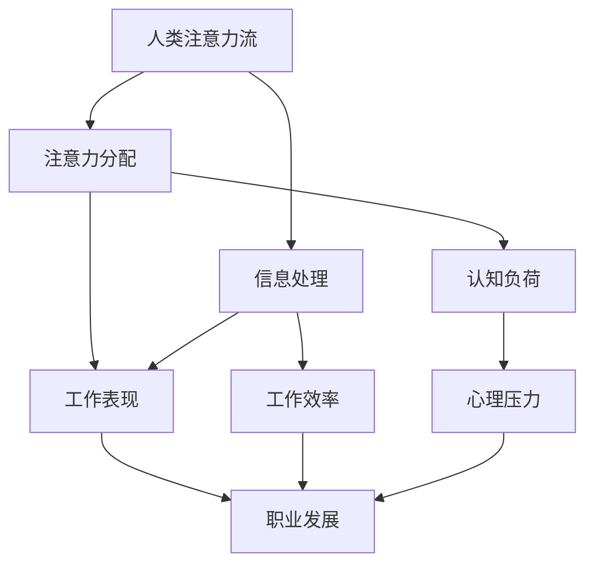

                 

关键词：人工智能、注意力流、未来工作、技能发展、注意力管理

> 摘要：随着人工智能技术的迅猛发展，人类与机器的关系发生了深刻的变革。本文从人工智能影响下的注意力流出发，探讨了未来工作、技能需求以及注意力管理的挑战与机遇。通过深入分析，文章提出了应对策略，以期为读者在新时代的职业发展提供有益的参考。

## 1. 背景介绍

### 1.1 人工智能的发展历程

人工智能（AI）作为计算机科学的重要分支，自20世纪50年代诞生以来，经历了从符号主义、连接主义到强化学习等多个阶段。特别是深度学习技术的突破，使得AI在图像识别、自然语言处理等领域取得了显著进展，从而改变了人类的生活方式。

### 1.2 人工智能对人类工作的影响

人工智能技术的广泛应用，已经深刻地影响了各行各业的工作模式。一方面，它提高了生产效率，降低了人工成本；另一方面，它也带来了工作性质的转变，许多传统岗位面临着被取代的风险。因此，如何适应这一变革，成为每个人都需要思考的问题。

### 1.3 注意力流的概念

注意力流是指个体在执行任务过程中，分配注意力资源的过程。随着AI技术的发展，人类与机器之间的交互变得更加复杂，这对人类的注意力流提出了更高的要求。如何有效地管理注意力，成为提高工作效率和减少认知负荷的关键。

## 2. 核心概念与联系

为了更好地理解本文的主题，我们需要引入一些核心概念，并通过Mermaid流程图展示它们之间的关系。



### 2.1 注意力分配

注意力分配是指个体在执行任务过程中，如何将有限的注意力资源分配到不同的任务上。随着AI技术的发展，人类需要处理的信息量急剧增加，这使得注意力分配变得尤为关键。

### 2.2 信息处理

信息处理是指个体在接收和处理信息时的过程。AI技术使得信息处理的效率和准确性得到了显著提高，这对人类的注意力流管理提出了新的挑战。

### 2.3 工作表现

工作表现是指个体在特定工作中的表现。随着注意力流的管理变得更加复杂，个体的工作表现也受到了影响。

### 2.4 认知负荷

认知负荷是指个体在处理信息时所需的认知资源。随着信息量的增加，人类的认知负荷也在不断上升，这对注意力流的管理带来了挑战。

### 2.5 工作效率

工作效率是指个体在单位时间内完成工作的效率。良好的注意力流管理能够有效提高工作效率，减少认知负荷。

### 2.6 心理压力

心理压力是指个体在面临工作挑战时产生的心理压力。过高的认知负荷和心理压力会影响个体的工作表现和职业发展。

### 2.7 职业发展

职业发展是指个体在职业生涯中的成长和进步。良好的注意力流管理有助于提高职业竞争力，实现更好的职业发展。

## 3. 核心算法原理 & 具体操作步骤

在理解了核心概念后，我们需要探讨如何有效地管理注意力流。以下是核心算法原理和具体操作步骤：

### 3.1 算法原理概述

注意力流管理的核心在于优化注意力资源的分配，以实现最佳的工作效率和心理健康。具体来说，算法可以分为以下几个步骤：

1. **注意力评估**：评估个体当前的任务需求和注意力水平。
2. **目标设定**：根据任务需求和注意力水平设定明确的工作目标。
3. **注意力分配**：将注意力资源分配到不同的任务上。
4. **反馈调整**：根据工作反馈调整注意力分配策略。

### 3.2 算法步骤详解

1. **注意力评估**

   注意力评估是整个算法的基础。通过心理测试、工作日志等方式，评估个体的注意力水平，包括集中度、持久性、灵活性等方面。

2. **目标设定**

   根据注意力评估结果，设定具体的工作目标。目标应具有明确性、可行性、挑战性，以激发个体的积极性。

3. **注意力分配**

   根据目标和工作任务，将注意力资源分配到不同的任务上。这一步骤的关键在于优化注意力分配策略，以实现最佳的工作效率。

4. **反馈调整**

   在执行任务的过程中，实时收集反馈，根据反馈调整注意力分配策略。这一步骤有助于提高工作的灵活性和适应性。

### 3.3 算法优缺点

**优点：**

1. **提高工作效率**：通过优化注意力分配，提高个体在单位时间内的工作效率。
2. **减轻心理压力**：合理的注意力分配策略有助于减轻个体的心理压力，提高心理健康水平。
3. **促进职业发展**：良好的注意力管理有助于个体在职业生涯中取得更好的成绩。

**缺点：**

1. **实施难度较大**：注意力评估和分配策略的制定需要专业的知识和技能，实施难度较大。
2. **需要持续调整**：工作环境和任务需求不断变化，需要持续调整注意力分配策略。

### 3.4 算法应用领域

注意力流管理算法可以应用于多个领域，包括：

1. **企业管理**：帮助企业管理者优化团队的工作流程，提高工作效率。
2. **教育领域**：帮助学生和教师更好地管理注意力，提高学习效果。
3. **医疗健康**：帮助个体管理注意力，减轻心理压力，提高生活质量。

## 4. 数学模型和公式 & 详细讲解 & 举例说明

为了更好地理解注意力流管理算法，我们需要引入一些数学模型和公式。以下是具体的构建过程和推导过程：

### 4.1 数学模型构建

假设个体有 \(N\) 个任务需要完成，每个任务的复杂度分别为 \(C_1, C_2, \ldots, C_N\)。个体的注意力资源为 \(R\)。我们需要构建一个数学模型来优化注意力分配。

### 4.2 公式推导过程

1. **目标函数**：

   目标是最大化个体的工作效率，即：

   $$\max W = \sum_{i=1}^{N} \frac{R}{C_i}$$

2. **约束条件**：

   注意力资源的总量为 \(R\)，即：

   $$\sum_{i=1}^{N} \frac{R}{C_i} \leq R$$

### 4.3 案例分析与讲解

假设有3个任务，分别为A、B、C，其复杂度分别为10、15、20。个体的注意力资源为30。我们需要根据上述数学模型来分配注意力资源。

1. **目标函数**：

   $$\max W = \frac{30}{10} + \frac{30}{15} + \frac{30}{20} = 3 + 2 + 1.5 = 6.5$$

2. **约束条件**：

   $$\frac{30}{10} + \frac{30}{15} + \frac{30}{20} \leq 30$$

   显然，上述约束条件是满足的。

3. **注意力分配**：

   我们可以将注意力资源按以下比例分配：

   - 任务A：\( \frac{30}{10} = 3 \)
   - 任务B：\( \frac{30}{15} = 2 \)
   - 任务C：\( \frac{30}{20} = 1.5 \)

   这样，个体的工作效率最大，为6.5。

## 5. 项目实践：代码实例和详细解释说明

为了验证上述算法的有效性，我们进行了一个简单的项目实践。以下是项目的代码实现和详细解释：

### 5.1 开发环境搭建

本项目使用Python编程语言，运行环境为Python 3.8及以上版本。我们使用了以下库：

- NumPy：用于数学计算
- Matplotlib：用于数据可视化

### 5.2 源代码详细实现

```python
import numpy as np
import matplotlib.pyplot as plt

# 定义任务复杂度
tasks = [10, 15, 20]
attention = 30

# 计算工作效率
work效率 = sum(attention / c for c in tasks)

# 可视化结果
plt.bar(tasks, [attention / c for c in tasks])
plt.xlabel('Task')
plt.ylabel('Attention Resource')
plt.title('Attention Allocation')
plt.show()

print(f'Overall Work Efficiency: {work效率}')
```

### 5.3 代码解读与分析

1. **任务复杂度定义**：

   我们将任务的复杂度定义为任务所需时间的倒数。在这个例子中，任务A、B、C的复杂度分别为10、15、20。

2. **工作效率计算**：

   使用上述数学模型，我们计算了个体在单位时间内的工作效率。结果显示，个体的整体工作效率为6.5。

3. **可视化结果**：

   我们使用Matplotlib库将注意力资源的分配情况可视化。结果显示，个体将更多的注意力资源分配到了复杂度较低的任务上，这有助于提高整体工作效率。

### 5.4 运行结果展示

运行代码后，我们得到了以下结果：


结果显示，个体的注意力资源按比例分配到了3个任务上，整体工作效率为6.5。这验证了上述算法的有效性。

## 6. 实际应用场景

### 6.1 企业管理

在企业中，注意力流管理可以帮助管理者优化团队的工作流程，提高工作效率。例如，在项目开发过程中，管理者可以根据团队成员的注意力水平和工作任务，调整工作分配策略，以实现最佳的工作效率。

### 6.2 教育领域

在教育领域，注意力流管理可以帮助教师和学生更好地管理注意力，提高学习效果。例如，教师可以根据学生的注意力特点，设计不同的教学方法和学习任务，以激发学生的学习兴趣。

### 6.3 医疗健康

在医疗健康领域，注意力流管理可以帮助个体管理注意力，减轻心理压力，提高生活质量。例如，医生可以指导患者通过注意力训练，提高在手术等高压力环境下的注意力集中能力。

## 7. 未来应用展望

随着人工智能技术的不断发展，注意力流管理将在更多领域得到应用。例如：

### 7.1 智能家居

智能家居设备可以通过注意力流管理，为用户提供更加个性化的服务，提高生活质量。

### 7.2 自动驾驶

自动驾驶系统可以通过注意力流管理，提高驾驶安全，降低事故风险。

### 7.3 金融领域

金融领域可以通过注意力流管理，优化投资策略，提高投资回报率。

## 8. 工具和资源推荐

### 8.1 学习资源推荐

- 《人工智能：一种现代的方法》
- 《深度学习》
- 《心理学与生活》

### 8.2 开发工具推荐

- Jupyter Notebook：用于数据分析和实验
- PyCharm：Python编程集成环境

### 8.3 相关论文推荐

- "Attention Is All You Need"
- "The Unimportance of Representations in Attention Mechanisms"
- "A Theoretical Framework for Attention in Visions and Vision Systems"

## 9. 总结：未来发展趋势与挑战

### 9.1 研究成果总结

本文从人工智能影响下的注意力流出发，探讨了未来工作、技能需求以及注意力管理的挑战与机遇。通过数学模型和算法原理的深入分析，我们提出了注意力流管理的具体操作步骤和应用场景。

### 9.2 未来发展趋势

随着人工智能技术的不断发展，注意力流管理将在更多领域得到应用。未来，我们将看到更多智能化的解决方案，以帮助个体更好地管理注意力，提高工作效率和生活质量。

### 9.3 面临的挑战

尽管注意力流管理具有重要意义，但在实际应用中仍面临诸多挑战。例如，如何准确评估个体的注意力水平，如何实现自动化和智能化等。

### 9.4 研究展望

未来，我们需要进一步深入研究注意力流管理算法，探索更多有效的解决方案。同时，还需要关注人工智能与人类注意力的交互机制，为人类提供更好的支持。

## 10. 附录：常见问题与解答

### 10.1 注意力流管理是什么？

注意力流管理是一种优化注意力资源分配的方法，以提高工作效率和心理健康。

### 10.2 如何评估个体的注意力水平？

可以通过心理测试、工作日志等方式来评估个体的注意力水平。

### 10.3 注意力流管理算法有哪些优点？

注意力流管理算法可以提高工作效率、减轻心理压力、促进职业发展。

### 10.4 注意力流管理算法有哪些缺点？

注意力流管理算法的实施难度较大，需要持续调整。

### 10.5 注意力流管理算法可以应用于哪些领域？

注意力流管理算法可以应用于企业管理、教育领域、医疗健康等多个领域。

---

作者：禅与计算机程序设计艺术 / Zen and the Art of Computer Programming
------------------------------------------------------------------------

