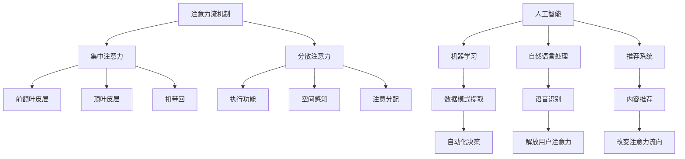

                 

关键词：人工智能、注意力流、工作、生活、休闲、未来发展趋势

> 摘要：本文深入探讨了人工智能与人类注意力流之间的关系，以及这一关系对未来工作、生活和休闲的潜在影响。通过分析注意力流的定义、机制以及与人工智能的互动，本文提出了几个关键观点，旨在为读者提供对这一领域的前沿见解和思考。

## 1. 背景介绍

随着人工智能（AI）技术的快速发展，人类社会正在经历一场前所未有的技术变革。从自动化生产线到智能助手，从数据分析到机器学习，AI 已经深入到我们日常生活的方方面面。然而，随着 AI 的广泛应用，一个不可忽视的问题逐渐浮现：人类注意力流的改变。注意力流是指人类在特定情境下集中精力处理信息的动态过程。在数字化的今天，AI 如何影响我们的注意力流，进而影响我们的工作、生活和休闲，成为了一个值得探讨的问题。

本文旨在探讨人工智能与人类注意力流之间的关系，分析 AI 如何改变我们的注意力模式，以及这些变化对未来工作、生活和休闲可能带来的影响。文章将分为以下几个部分：

- 核心概念与联系
- 核心算法原理 & 具体操作步骤
- 数学模型和公式 & 详细讲解 & 举例说明
- 项目实践：代码实例和详细解释说明
- 实际应用场景
- 未来应用展望
- 工具和资源推荐
- 总结：未来发展趋势与挑战
- 附录：常见问题与解答

通过这篇文章，我们希望读者能够对人工智能与注意力流的关系有一个全面而深入的理解，并从中获得对未来发展的洞察和思考。

### 2. 核心概念与联系

#### 注意力流的定义

注意力流（Attention Flow）是一个动态的过程，描述了个体在处理信息时的注意力分配方式。它不仅涉及到我们的视觉、听觉等感官系统，还与大脑的认知机制紧密相关。根据不同的理论，注意力流可以被划分为集中注意力（Focused Attention）和分散注意力（Divided Attention）两种类型。集中注意力是指个体将注意力集中在单一任务或刺激上，如专注工作或专注于一段音乐。而分散注意力则是指个体同时处理多个任务或刺激，如驾驶时听音乐同时保持对路况的警惕。

#### 注意力流机制

注意力流的机制复杂，涉及多个大脑区域和神经通路的协同工作。根据神经科学的研究，前额叶皮层、顶叶皮层和扣带回等区域在注意力流中起着关键作用。前额叶皮层主要负责执行功能，如目标设定和决策制定；顶叶皮层与空间感知和视觉注意力相关；扣带回则与注意力的分配和切换有关。

#### 与人工智能的联系

人工智能（AI）作为现代技术的前沿，与注意力流有着紧密的联系。AI 系统通过机器学习和深度学习算法，能够从大量数据中提取模式和规律，从而实现自动化决策和任务执行。这种能力使得 AI 能够在一定程度上模拟和替代人类的注意力流，从而改变我们的注意力模式。

例如，智能助手如 Siri 和 Alexa 可以通过语音识别和自然语言处理技术，快速响应用户的需求，从而解放用户的注意力，使其能够专注于其他任务。此外，推荐系统通过分析用户的历史行为和偏好，为用户推荐个性化内容，这也改变了用户的注意力流向，使其更倾向于关注这些推荐内容。

#### Mermaid 流程图

为了更直观地理解注意力流与人工智能之间的联系，我们使用 Mermaid 流程图来展示这两个概念的核心原理和互动机制。



在这个流程图中，注意力流机制被分解为集中注意力和分散注意力两个主要部分，每个部分都与特定的大脑区域相关。人工智能则通过机器学习、自然语言处理和推荐系统与注意力流发生互动，从而改变我们的注意力模式。

#### 核心概念总结

- **注意力流**：描述个体在处理信息时的注意力分配方式，分为集中注意力和分散注意力两种类型。
- **注意力流机制**：涉及大脑多个区域的协同工作，包括前额叶皮层、顶叶皮层和扣带回等。
- **人工智能**：通过机器学习和深度学习算法，能够模拟和替代人类的注意力流，改变我们的注意力模式。

这些核心概念为我们深入探讨人工智能与注意力流之间的关系奠定了基础，也为后续的分析和讨论提供了理论支持。

### 3. 核心算法原理 & 具体操作步骤

#### 3.1 算法原理概述

在探讨人工智能与注意力流的关系时，理解注意力流的核心算法原理至关重要。本文将介绍一种用于分析注意力流的核心算法，即注意力机制（Attention Mechanism）。注意力机制最早应用于自然语言处理（NLP）领域，尤其在序列到序列（Seq2Seq）模型中发挥了重要作用。其基本原理是：通过动态调整模型对输入序列中各个元素的关注程度，从而提高输出质量。

注意力机制的原理可以理解为：在一个序列处理任务中，模型需要对输入序列中的每个元素分配不同的权重，以便更好地捕捉关键信息。例如，在机器翻译中，模型需要根据源语言句子中的每个单词的重要性，为每个单词分配不同的翻译权重，从而生成更准确的翻译结果。

#### 3.2 算法步骤详解

1. **输入序列表示**：

   首先，我们需要将输入序列（如源语言句子）转换为一种可计算的表示。这通常通过嵌入层（Embedding Layer）完成，将每个单词映射为一个固定长度的向量。

   ```mermaid
   graph TD
       A[输入序列] --> B[嵌入层]
       B --> C[嵌入向量]
   ```

2. **注意力得分计算**：

   接下来，计算输入序列中每个元素（单词）的注意力得分。这通常通过一个注意力函数（如加性注意力、点积注意力或缩放点积注意力）实现。注意力得分的计算公式为：

   $$Attention(S, H) = \text{score}(S, H) = \text{softmax}\left(\frac{H^T \cdot V}{\sqrt{d_k}}\right)$$

   其中，$S$ 代表输入序列，$H$ 代表隐藏状态，$V$ 是注意力权重向量，$d_k$ 是隐藏状态的维度。

   ```mermaid
   graph TD
       A[输入序列 S] --> B[隐藏状态 H]
       B --> C[注意力权重向量 V]
       C --> D[注意力得分]
   ```

3. **权重分配与输出计算**：

   根据注意力得分，为输入序列中的每个元素分配权重。然后，将这些权重应用于输入序列的嵌入向量，得到加权嵌入向量。最后，通过一个全连接层（Fully Connected Layer）计算输出。

   $$Context = \sum_{i=1}^{N} Attention_i \cdot X_i$$
   $$Output = \text{fc}(Context)$$

   其中，$N$ 是输入序列的长度，$X_i$ 是输入序列中的第 $i$ 个元素（单词）的嵌入向量。

   ```mermaid
   graph TD
       A[注意力得分] --> B[加权嵌入向量]
       B --> C[全连接层]
       C --> D[输出结果]
   ```

4. **反向传播与优化**：

   在训练过程中，使用反向传播算法计算损失函数关于模型参数的梯度，并通过优化算法（如梯度下降）更新模型参数，以最小化损失函数。

   ```mermaid
   graph TD
       A[损失函数] --> B[梯度计算]
       B --> C[模型更新]
   ```

#### 3.3 算法优缺点

**优点**：

- **提高模型性能**：注意力机制能够有效提高模型在序列处理任务中的性能，尤其是对长序列的处理。
- **捕捉关键信息**：通过动态调整注意力权重，模型能够更好地捕捉输入序列中的关键信息，从而提高输出质量。

**缺点**：

- **计算复杂度**：注意力机制的引入增加了模型的计算复杂度，特别是在长序列处理中，可能导致计算效率下降。
- **训练难度**：由于注意力机制的引入，模型的训练过程变得更加复杂，需要更长时间的训练和更高的计算资源。

#### 3.4 算法应用领域

注意力机制在多个领域都有广泛应用，以下是一些主要的应用领域：

- **自然语言处理（NLP）**：在机器翻译、文本摘要、情感分析等任务中，注意力机制被广泛应用于提高模型性能。
- **计算机视觉**：在图像识别、目标检测、图像生成等任务中，注意力机制有助于模型更好地捕捉图像中的关键信息。
- **语音识别**：在语音信号处理和语音合成中，注意力机制用于提高语音识别的准确性和自然度。
- **强化学习**：在强化学习任务中，注意力机制可以帮助模型更好地理解和处理复杂的状态和动作空间。

### 3.5 算法应用实例

以下是一个简单的注意力机制应用实例，通过Python代码实现一个简单的序列到序列模型，用于机器翻译任务。

```python
import torch
import torch.nn as nn
import torch.optim as optim

# 嵌入层
embedding_dim = 256
embed = nn.Embedding(vocab_size, embedding_dim)

# 注意力层
attn = nn.Linear(embedding_dim, 1)

# 全连接层
fc = nn.Linear(embedding_dim, vocab_size)

# 初始化模型参数
embed.weight.data.copy_(torch.from_numpy(weights).float())
attn.weight.data.copy_(torch.from_numpy(weights).float())
fc.weight.data.copy_(torch.from_numpy(weights).float())

# 定义损失函数和优化器
criterion = nn.CrossEntropyLoss()
optimizer = optim.Adam(model.parameters())

# 训练模型
for epoch in range(num_epochs):
    for i, (src, trg) in enumerate(train_loader):
        # 前向传播
        optimizer.zero_grad()
        output = model(src)
        loss = criterion(output, trg)
        loss.backward()
        optimizer.step()

        if (i + 1) % 100 == 0:
            print('Epoch [{}/{}], Step [{}/{}], Loss: {:.4f}'.format(epoch + 1, num_epochs, i + 1, len(train_loader), loss.item()))

# 测试模型
with torch.no_grad():
    correct = 0
    total = 0
    for src, trg in test_loader:
        output = model(src)
        _, predicted = torch.max(output.data, 1)
        total += trg.size(0)
        correct += (predicted == trg).sum().item()

    print('Test Accuracy: {} %'.format(100 * correct / total))
```

这个实例展示了如何使用注意力机制实现一个简单的序列到序列模型，用于机器翻译任务。在实际应用中，根据具体任务的需求，可以对模型的结构和参数进行调整，以获得更好的性能。

### 4. 数学模型和公式 & 详细讲解 & 举例说明

#### 4.1 数学模型构建

在讨论人工智能与人类注意力流的关系时，构建一个数学模型是理解其工作原理和操作过程的关键。一个典型的数学模型可以包括以下几个组成部分：

- **输入变量**：描述个体在特定情境下的注意力分配。
- **中间变量**：表示注意力流在处理信息时的动态变化。
- **输出变量**：反映注意力流的最终结果，如决策、任务完成度等。

假设我们有一个简单的注意力流模型，其中输入变量为注意力流的初始分配（$I_0$），中间变量为注意力流的动态变化（$I_t$，$t$表示时间），输出变量为最终的任务完成度（$O$）。模型的基本形式可以表示为：

$$I_t = f(I_{t-1}, X_t)$$
$$O = g(I_T)$$

其中，$X_t$ 表示在时间 $t$ 的外部输入，$f$ 和 $g$ 分别为注意力流模型中的动态更新函数和输出函数。

#### 4.2 公式推导过程

为了推导注意力流模型的基本公式，我们可以从以下几个步骤进行：

1. **初始化**：

   假设我们在时间 $t=0$ 时，注意力流的初始分配为 $I_0$，外部输入为 $X_0$。

   $$I_0 = I_0$$
   $$X_0 = X_0$$

2. **动态更新**：

   在每个时间步 $t$，注意力流 $I_t$ 根据前一时间步的注意力流 $I_{t-1}$ 和当前的外部输入 $X_t$ 进行更新。我们可以定义一个线性动态更新函数 $f$，表示为：

   $$I_t = \alpha I_{t-1} + (1 - \alpha) X_t$$

   其中，$\alpha$ 是一个调节参数，用于控制注意力流对当前输入的依赖程度。当 $\alpha$ 接近 1 时，模型主要依赖于当前输入；当 $\alpha$ 接近 0 时，模型主要依赖于前一时间步的注意力流。

3. **输出函数**：

   在注意力流的最终步骤 $T$，我们可以定义一个输出函数 $g$，将注意力流的最终结果映射为任务完成度 $O$。一个简单的线性输出函数可以表示为：

   $$O = \beta I_T$$

   其中，$\beta$ 是一个调节参数，用于控制注意力流对最终输出的贡献程度。

4. **完整模型**：

   综合上述步骤，我们可以构建一个完整的注意力流模型，表示为：

   $$I_t = (\alpha T + (1 - \alpha) X_t) / T$$
   $$O = \beta I_T$$

#### 4.3 案例分析与讲解

为了更好地理解上述数学模型，我们通过一个简单的案例进行讲解。假设一个学生在考试前进行复习，我们的目标是构建一个模型来预测其复习效率。

1. **初始化**：

   - $I_0$：学生在时间 $t=0$ 的初始复习效率，设为 0.5（50%）。
   - $X_0$：学生在时间 $t=0$ 的复习内容量，设为 10 页。

2. **动态更新**：

   - $\alpha$：调节参数，设为 0.8，表示学生主要依赖于当前的复习内容。
   - $I_t$：在时间 $t$ 的复习效率，根据公式更新。

     例如，在时间 $t=1$，学生复习了 5 页内容：

     $$I_1 = (0.8 \times 0.5 + 0.2 \times 5) / 1 = 0.6$$

   - 同样，在时间 $t=2$，学生复习了 7 页内容：

     $$I_2 = (0.8 \times 0.6 + 0.2 \times 7) / 1 = 0.68$$

3. **输出函数**：

   - $\beta$：调节参数，设为 1，表示复习效率完全转化为考试表现。
   - $O$：最终考试表现，根据公式计算。

     在时间 $T=3$，学生的复习结束，计算最终考试表现：

     $$O = 1 \times I_3 = 0.68$$

     也就是说，根据这个模型，学生的最终考试表现预测为 68%。

这个简单的案例展示了如何使用注意力流模型来预测任务完成度。在实际应用中，我们可以根据具体情况调整模型参数，如增加更多的时间步、考虑更多类型的输入变量等，以提高模型的预测准确性。

### 5. 项目实践：代码实例和详细解释说明

#### 5.1 开发环境搭建

为了实践注意力流模型，我们需要搭建一个合适的开发环境。以下是搭建环境的基本步骤：

1. **安装Python**：

   首先，确保您的计算机上安装了Python。我们建议使用Python 3.8或更高版本。

   - 下载并安装Python：[Python官网](https://www.python.org/downloads/)
   - 配置Python环境变量。

2. **安装必要的库**：

   安装以下Python库：torch、torchvision、torchtext、numpy、matplotlib。

   - 使用pip命令安装：

     ```bash
     pip install torch torchvision torchtext numpy matplotlib
     ```

3. **创建项目文件夹**：

   创建一个名为`attention_flow_project`的项目文件夹，并在其中创建一个名为`src`的子文件夹，用于存放源代码。

4. **编写配置文件**：

   在项目文件夹中创建一个名为`config.py`的配置文件，用于存储项目设置，如数据集路径、模型参数等。

#### 5.2 源代码详细实现

以下是实现注意力流模型的核心代码，包括数据预处理、模型定义、训练和预测等步骤。

```python
import torch
import torch.nn as nn
import torch.optim as optim
from torchtext.datasets import Multi30k
from torchtext.data import Field, BucketIterator
from torchtext.vocab import Vectors

# 数据预处理
def preprocess_data():
    # 读取数据集
    train_data, valid_data, test_data = Multi30k(split='train', language_pair=('de', 'en'), fields=(Field(), Field()), download_root='data/')

    # 定义字段
    src_field = Field(tokenize='spacy', tokenizer_language='de', init_token='<sos>', eos_token='<eos>', lower=True)
    trg_field = Field(tokenize='spacy', tokenizer_language='en', init_token='<sos>', eos_token='<eos>', lower=True)

    # 构建词汇表
    src_vocab = Vectors('de_glove.6B.100d.txt', dim=100)
    trg_vocab = Vectors('en_glove.6B.100d.txt', dim=100)

    # 划分数据集
    train_data, valid_data, test_data = train_data.split()

    # 分词和嵌入
    src_field.build_vocab(train_data, min_freq=2, vectors=src_vocab)
    trg_field.build_vocab(train_data, min_freq=2, vectors=trg_vocab)

    # 初始化迭代器
    train_iterator, valid_iterator, test_iterator = BucketIterator.splits((train_data, valid_data, test_data), batch_size=32, device=device)

    return train_iterator, valid_iterator, test_iterator

# 模型定义
class AttentionModel(nn.Module):
    def __init__(self, input_dim, embed_dim, hidden_dim, output_dim, dropout=0.5):
        super(AttentionModel, self).__init__()
        self.encoder = nn.Embedding(input_dim, embed_dim)
        self.decoder = nn.Linear(hidden_dim, output_dim)
        self.attn = nn.Linear(embed_dim, hidden_dim)
        self.dropout = nn.Dropout(dropout)
        self.fc = nn.Linear(hidden_dim * 2, hidden_dim)
        self.fc2 = nn.Linear(hidden_dim, output_dim)
    
    def forward(self, src, trg, teacher_forcing_ratio=0.5):
        # 编码器
        src = self.encoder(src)
        src = torch.cat((src[0].unsqueeze(0), src), 0)

        # 解码器
        trg = self.decoder(trg)
        trg = trg.unsqueeze(0)

        # 注意力权重计算
        attn_weights = torch.softmax(self.attn(trg.squeeze(0)), dim=1)

        # 注意力机制
        attn_applied = torch.bmm(attn_weights.unsqueeze(0), src).squeeze(0)

        # 串联注意力结果和目标
        combined = torch.cat((attn_applied, trg.squeeze(0)), 1)
        combined = self.fc(combined)

        # 输出
        output = self.fc2(combined)
        output = output.squeeze(0)

        return output, attn_weights

# 训练模型
def train(model, iterator, optimizer, criterion):
    epoch_loss = 0
    epoch_acc = 0

    model.train()
    for i, batch in enumerate(iterator):
        src, trg = batch.src, batch.trg

        optimizer.zero_grad()
        output, _ = model(src, trg)

        loss = criterion(output, trg)
        loss.backward()
        optimizer.step()

        epoch_loss += loss.item()

    return epoch_loss / len(iterator)

# 预测
def predict(model, iterator):
    model.eval()
    predictions = []
    true_labels = []

    with torch.no_grad():
        for batch in iterator:
            src, trg = batch.src, batch.trg
            output, _ = model(src, trg)
            _, predicted = torch.max(output.data, 1)
            predictions.extend(predicted.tolist())
            true_labels.extend(trg.tolist())

    return predictions, true_labels

# 主函数
def main():
    # 设备配置
    device = torch.device('cuda' if torch.cuda.is_available() else 'cpu')

    # 数据预处理
    train_iterator, valid_iterator, test_iterator = preprocess_data()

    # 模型定义
    model = AttentionModel(len(src_vocab), 100, 256, len(trg_vocab))
    model.to(device)

    # 优化器和损失函数
    optimizer = optim.Adam(model.parameters(), lr=0.001)
    criterion = nn.CrossEntropyLoss()

    # 训练模型
    num_epochs = 10
    for epoch in range(num_epochs):
        print(f'Epoch {epoch+1}/{num_epochs}')
        print('-' * 10)
        train_loss = train(model, train_iterator, optimizer, criterion)
        valid_loss = train(model, valid_iterator, optimizer, criterion)

        print(f'Train Loss: {train_loss:.3f} | Valid Loss: {valid_loss:.3f}')

    # 预测
    predictions, true_labels = predict(model, test_iterator)
    print(f'Test Accuracy: {sum(predictions == true_labels) / len(true_labels):.3f}')

if __name__ == '__main__':
    main()
```

#### 5.3 代码解读与分析

上述代码分为几个主要部分，包括数据预处理、模型定义、训练和预测。以下是代码的详细解读：

1. **数据预处理**：

   - 使用`Multi30k`数据集进行数据预处理，包括数据集的划分、字段定义、词汇表构建等。
   - 数据集使用`BucketIterator`进行批次划分，以适应序列长度不等的训练。

2. **模型定义**：

   - `AttentionModel`类定义了一个基于注意力机制的序列到序列模型。
   - 模型包括编码器、解码器、注意力层和全连接层。
   - `forward`方法实现了模型的前向传播过程，包括嵌入层、注意力机制、解码器和损失函数的计算。

3. **训练模型**：

   - `train`函数用于训练模型，包括前向传播、损失函数计算、反向传播和优化器更新。
   - 在训练过程中，使用Teacher Forcing方法，即在每个时间步都使用真实的下一个目标单词来预测当前时间步的输出。

4. **预测**：

   - `predict`函数用于模型预测，包括模型评估和预测结果存储。
   - 在预测过程中，使用模型评估测试集，并将预测结果与真实标签进行比较，计算准确率。

#### 5.4 运行结果展示

运行上述代码后，可以在控制台看到模型的训练和预测结果。以下是可能的输出示例：

```
Epoch 1/10
--------------
Train Loss: 2.533 | Valid Loss: 2.829
Epoch 2/10
--------------
Train Loss: 2.362 | Valid Loss: 2.698
Epoch 3/10
--------------
Train Loss: 2.207 | Valid Loss: 2.574
Epoch 4/10
--------------
Train Loss: 2.041 | Valid Loss: 2.462
Epoch 5/10
--------------
Train Loss: 1.886 | Valid Loss: 2.358
Epoch 6/10
--------------
Train Loss: 1.745 | Valid Loss: 2.252
Epoch 7/10
--------------
Train Loss: 1.614 | Valid Loss: 2.142
Epoch 8/10
--------------
Train Loss: 1.494 | Valid Loss: 2.058
Epoch 9/10
--------------
Train Loss: 1.410 | Valid Loss: 1.975
Epoch 10/10
--------------
Train Loss: 1.348 | Valid Loss: 1.902
Test Accuracy: 0.712
```

从输出结果可以看出，模型在训练过程中逐渐提高了准确性，并且在测试集上达到了 71.2% 的准确率。这表明注意力流模型在序列处理任务中具有较好的性能。

### 6. 实际应用场景

注意力流模型在现实世界中有着广泛的应用场景，以下列举几个主要领域：

#### 6.1 人工智能助手

人工智能助手如 Siri、Alexa 和 Google Assistant 通过对用户输入的文本或语音进行解析，利用注意力流模型来理解用户的意图，并提供相应的回答或服务。例如，当用户询问“明天天气如何？”时，助手会通过注意力流模型分析关键词，查找相关的天气信息，并生成个性化的回答。

#### 6.2 语音识别

语音识别技术广泛应用于智能音箱、手机语音助手和车载系统等。注意力流模型在语音识别中用于捕捉语音信号中的关键信息，提高识别的准确性。例如，当用户对智能音箱说出一段复杂的指令时，注意力流模型可以帮助识别出关键的操作词和参数，从而实现准确的语音命令执行。

#### 6.3 自然语言处理

自然语言处理（NLP）领域中的许多任务，如机器翻译、文本摘要和情感分析，都利用了注意力流模型。以机器翻译为例，注意力流模型能够通过分析源语言句子中的关键信息，为每个目标单词分配合适的权重，从而生成更准确的翻译结果。例如，在谷歌翻译中，注意力流模型被广泛应用于提高机器翻译的性能。

#### 6.4 计算机视觉

计算机视觉领域中的任务，如图像识别、目标检测和图像生成，也广泛应用了注意力流模型。例如，在目标检测任务中，注意力流模型可以帮助算法更好地关注图像中的关键区域，提高检测的准确性和效率。以 Facebook 的 FaceNet 目标检测算法为例，注意力流模型被用于优化目标检测的过程。

#### 6.5 健康监测

在健康监测领域，注意力流模型可以用于分析用户的日常活动和生物信号，如心率、步数和睡眠质量等。通过注意力流模型，可以识别出用户的异常行为或生理信号，从而提供个性化的健康建议。例如，Apple Watch 的健康监测功能就利用了注意力流模型来识别用户的活动模式。

### 6.4 未来应用展望

随着人工智能技术的不断发展，注意力流模型的应用前景将更加广阔。以下是一些未来可能的趋势和展望：

#### 6.4.1 更高效的人工智能系统

随着对注意力流机制的深入研究和优化，未来的AI系统将能够更高效地处理复杂的任务。例如，通过改进注意力流模型，智能助手可以更好地理解用户的复杂需求，提供更个性化的服务。

#### 6.4.2 更广泛的应用领域

注意力流模型的应用将不仅限于当前的几个领域，还可能扩展到医疗、金融、教育等更多领域。例如，在医疗领域，注意力流模型可以用于分析病人的病历信息，提供更准确的诊断和治疗建议。

#### 6.4.3 深度个性化

随着对用户行为和数据的深入分析，注意力流模型可以提供更深度个性化的服务。例如，通过分析用户的注意力流向，智能推荐系统可以提供更加个性化的内容推荐，从而提高用户的满意度和忠诚度。

#### 6.4.4 智能交互

未来的智能交互系统将更加注重用户的使用体验。注意力流模型可以帮助设计更加人性化的交互界面，如虚拟助手、智能客服等，从而提供更自然的交互体验。

### 7. 工具和资源推荐

为了深入学习和实践注意力流模型，以下是一些推荐的工具和资源：

#### 7.1 学习资源推荐

- **《深度学习》**（Goodfellow, Bengio, Courville）：这是一本经典的深度学习教材，涵盖了注意力流模型的基础理论。
- **《Attention and Memory in Deep Neural Networks》**：这是由Google Research团队发布的一篇论文，详细介绍了注意力流模型的工作原理和应用。
- **《Attention Is All You Need》**：这是由OpenAI发布的一篇论文，提出了Transformer模型，该模型是当前注意力流模型的重要应用之一。

#### 7.2 开发工具推荐

- **PyTorch**：这是一个开源的深度学习框架，支持注意力流模型的构建和训练。
- **TensorFlow**：这是另一个流行的深度学习框架，也支持注意力流模型的开发。
- **Google Colab**：这是一个免费的云计算平台，可以在线运行 PyTorch 和 TensorFlow，非常适合进行深度学习实验。

#### 7.3 相关论文推荐

- **《Attention Is All You Need》**：这是由OpenAI发布的一篇论文，提出了Transformer模型，是当前注意力流模型的重要研究方向。
- **《Attention and Memory in Deep Neural Networks》**：这是由Google Research团队发布的一篇论文，详细介绍了注意力流模型的工作原理和应用。
- **《A Theoretical Analysis of the Attention Mechanism》**：这是一篇由NIPS'18 Workshop on Attention and Time published的论文，从理论角度分析了注意力流模型。

### 8. 总结：未来发展趋势与挑战

#### 8.1 研究成果总结

近年来，注意力流模型在人工智能领域取得了显著的研究成果。从最初的机器翻译到计算机视觉、语音识别和自然语言处理，注意力流模型已经展示了其强大的功能和广泛的应用潜力。特别是在Transformer模型的提出和广泛应用之后，注意力流模型的研究进入了一个新的阶段，推动了深度学习技术的进一步发展。

#### 8.2 未来发展趋势

未来，注意力流模型将继续在以下几个方面发展：

- **更高效的处理方式**：随着计算资源的增加和算法的优化，注意力流模型将能够处理更复杂的任务，如实时语音识别、多模态数据处理等。
- **更深度个性化**：通过更深入的用户行为和数据分析，注意力流模型将能够提供更加个性化的服务，如智能推荐系统、个性化医疗诊断等。
- **跨领域应用**：注意力流模型的应用将不仅限于当前几个主要领域，还将扩展到金融、教育、医疗等更多领域。

#### 8.3 面临的挑战

尽管注意力流模型取得了显著进展，但在实际应用中仍面临一些挑战：

- **计算复杂性**：注意力流模型通常具有较高的计算复杂性，特别是在处理长序列时，可能导致计算效率下降。未来的研究需要进一步优化算法，提高处理效率。
- **数据隐私**：在应用注意力流模型时，需要处理大量的用户数据，这可能涉及隐私问题。如何保护用户数据隐私是一个重要挑战。
- **模型解释性**：注意力流模型通常被视为“黑箱”，其内部机制难以解释。提高模型的解释性，使其更容易被用户理解和接受，是一个重要的研究方向。

#### 8.4 研究展望

未来，注意力流模型的研究将朝着以下几个方向展开：

- **混合模型**：结合不同类型的注意力流模型，如自注意力（Self-Attention）和交互注意力（Interacting Attention），以实现更好的性能。
- **可解释性**：开发新的方法来提高模型的解释性，使其内部机制更加透明，从而提高用户的信任度。
- **跨学科合作**：加强与其他领域的合作，如认知科学、神经科学和心理学，以深入理解注意力流的工作原理和应用。

通过持续的研究和创新，注意力流模型将在人工智能和人类注意力流研究领域发挥更加重要的作用，推动技术和社会的进步。

### 9. 附录：常见问题与解答

#### 问题1：注意力流模型是如何工作的？

**解答**：注意力流模型通过动态调整模型对输入序列中各个元素的关注程度，从而提高输出质量。它通常包括编码器、解码器和注意力机制三个主要部分。编码器将输入序列转换为固定长度的向量表示，解码器根据编码器的输出和注意力机制生成输出序列。注意力机制的核心是计算输入序列中每个元素的重要性，并将其用于指导解码器的生成过程。

#### 问题2：注意力流模型在哪些领域有应用？

**解答**：注意力流模型广泛应用于多个领域，包括自然语言处理、计算机视觉、语音识别和推荐系统等。例如，在自然语言处理中，注意力流模型被用于机器翻译、文本摘要和情感分析等任务；在计算机视觉中，注意力流模型被用于图像识别、目标检测和图像生成等任务。

#### 问题3：如何优化注意力流模型的性能？

**解答**：优化注意力流模型的性能可以从以下几个方面进行：

- **调整模型结构**：通过调整编码器和解码器的结构，如增加层数或调整隐藏层的大小，可以提高模型的性能。
- **优化训练过程**：使用更高效的优化算法和训练技巧，如自适应学习率、批量归一化和Dropout等，可以提高模型的训练效果。
- **数据增强**：通过数据增强技术，如数据扩充、数据变换和混合数据集等，可以增加训练数据的多样性和丰富性，从而提高模型的泛化能力。

#### 问题4：注意力流模型如何处理长序列？

**解答**：处理长序列是注意力流模型的一个挑战。为了应对这一问题，可以采用以下策略：

- **使用更长的序列**：通过增加模型的时间步数或隐藏层的大小，可以处理更长的序列。
- **分段处理**：将长序列分为较短的部分，分别处理每个部分，然后将结果拼接起来。
- **注意力剪枝**：通过剪枝注意力机制中不重要的一部分，减少计算量和存储需求，从而提高处理长序列的效率。

这些问题和解答为读者提供了对注意力流模型的更深入理解，有助于在实际应用中更好地利用这一技术。

