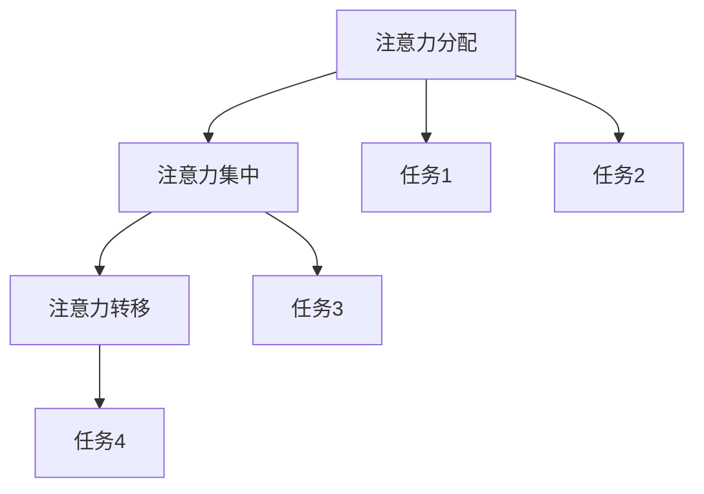

                 

关键词：人工智能、注意力流、注意力管理、工作、生活、未来、创新

> 摘要：本文探讨了人工智能（AI）与人类注意力流的相互作用，分析了AI如何改变我们的工作方式和生活习惯，并探讨了注意力管理的重要性。文章从多个角度对注意力管理进行深入研究，旨在为未来的工作和生活提供创新解决方案。

## 1. 背景介绍

在数字化时代，人工智能技术已经逐渐融入到我们日常生活的方方面面。从智能家居到自动驾驶，从医疗诊断到金融服务，AI正在以惊人的速度改变着我们的生活方式。与此同时，人类注意力流也受到了前所未有的冲击。社交媒体、电子邮件、即时通讯工具等不断分散我们的注意力，导致我们在面对复杂任务时难以集中精力。

### 1.1 人工智能与注意力流的关系

人工智能技术的发展使得信息处理速度和效率大大提高，但同时也给人类带来了注意力分散的挑战。在高度信息化的环境中，人们需要不断地处理来自四面八方的信息，这使得注意力管理变得更加重要。因此，如何有效地管理注意力流，以提高工作效率和生活质量，成为了一个亟待解决的问题。

### 1.2 注意力管理的重要性

注意力管理是指通过一系列策略和工具，帮助人们更好地集中注意力，从而提高工作效率和生活质量。在人工智能时代，注意力管理的重要性更加凸显。有效的注意力管理可以帮助人们：

- 提高工作效率：通过减少干扰和分心，人们可以更专注于重要的任务，从而提高工作效率。
- 提升生活质量：通过合理安排时间，人们可以更好地平衡工作和生活，提高生活质量。
- 促进身心健康：减少压力和焦虑，有助于改善人们的身心健康。

## 2. 核心概念与联系

### 2.1 注意力流的定义

注意力流是指人在进行认知活动时，对信息的接收、处理和存储过程。它包括注意力的分配、注意力的集中和注意力的转移等。

### 2.2 注意力流的组成部分

- 注意力分配：指人在进行多任务处理时，如何将注意力分配到不同的任务上。
- 注意力集中：指人在进行单一任务时，如何保持高度的专注和集中。
- 注意力转移：指人在从一项任务切换到另一项任务时，如何调整注意力的分配。

### 2.3 注意力流的 Mermaid 流程图



### 2.4 注意力管理的重要性

有效的注意力管理可以帮助人们更好地应对信息过载，提高工作效率和生活质量。在人工智能时代，注意力管理的重要性更加凸显，因为AI技术使得信息处理速度更快，但同时也带来了更多的干扰和分心。

## 3. 核心算法原理 & 具体操作步骤

### 3.1 算法原理概述

注意力管理算法的核心思想是通过识别和消除干扰，帮助人们更好地集中注意力。具体来说，该算法包括以下几个步骤：

- 识别干扰源：通过分析用户的行为数据，识别出对注意力产生干扰的因素。
- 优化任务安排：根据干扰源的识别结果，调整任务的优先级和执行顺序，以减少干扰。
- 提供提醒和指导：在用户执行任务时，通过提醒和指导，帮助用户保持专注。

### 3.2 算法步骤详解

1. 采集用户行为数据：通过传感器、应用程序等手段，收集用户在数字化环境中的行为数据，如浏览记录、操作日志等。
2. 识别干扰源：利用机器学习算法，分析用户行为数据，识别出对注意力产生干扰的因素，如高频的社交媒体通知、频繁的电子邮件提醒等。
3. 优化任务安排：根据干扰源的识别结果，对用户的任务进行重新安排，将重要且需要集中注意力的任务安排在干扰较少的时间段。
4. 提供提醒和指导：在用户执行任务时，通过应用程序或通知，提醒用户保持专注，并提供相应的指导，如减少社交媒体使用时间、关闭不必要的通知等。

### 3.3 算法优缺点

**优点：**

- 有效减少干扰：通过识别和消除干扰，帮助用户更好地集中注意力。
- 提高工作效率：通过优化任务安排，提高用户的工作效率。
- 提升生活质量：通过减少干扰，改善用户的身心健康，提高生活质量。

**缺点：**

- 需要大量的用户数据：算法的有效性依赖于用户行为数据的采集和分析，这需要大量的数据支持。
- 可能存在误识别：在识别干扰源时，可能存在误识别的情况，导致用户无法正常使用某些功能。

### 3.4 算法应用领域

注意力管理算法可以广泛应用于各种场景，如：

- 工作场所：通过优化任务安排，提高员工的工作效率。
- 教育领域：通过提供提醒和指导，帮助学生更好地集中注意力。
- 医疗保健：通过减少干扰，改善患者的身心健康。

## 4. 数学模型和公式 & 详细讲解 & 举例说明

### 4.1 数学模型构建

注意力管理算法的数学模型可以描述为：

\[ \text{注意力流} = f(\text{干扰源}, \text{任务优先级}, \text{用户行为}) \]

其中：

- \( \text{干扰源} \)：表示对注意力产生干扰的因素。
- \( \text{任务优先级} \)：表示任务的紧急程度和重要性。
- \( \text{用户行为} \)：表示用户在数字化环境中的行为模式。

### 4.2 公式推导过程

1. 识别干扰源：

\[ \text{干扰源} = g(\text{用户行为数据}) \]

2. 优化任务安排：

\[ \text{任务优先级} = h(\text{任务紧急程度}, \text{任务重要性}) \]

3. 用户行为：

\[ \text{用户行为} = i(\text{用户习惯}, \text{环境因素}) \]

4. 注意力流：

\[ \text{注意力流} = f(\text{干扰源}, \text{任务优先级}, \text{用户行为}) \]

### 4.3 案例分析与讲解

假设有一个用户，他需要在两个小时内完成一份报告。他的干扰源包括社交媒体通知、电子邮件提醒等。他的任务优先级为高，因为报告的提交时间紧迫。他的用户行为包括频繁查看社交媒体和邮件。

根据注意力管理算法，我们可以：

1. 识别干扰源：

\[ \text{干扰源} = g(\text{用户行为数据}) = \text{社交媒体通知，电子邮件提醒} \]

2. 优化任务安排：

\[ \text{任务优先级} = h(\text{任务紧急程度}, \text{任务重要性}) = \text{高优先级} \]

3. 用户行为：

\[ \text{用户行为} = i(\text{用户习惯}, \text{环境因素}) = \text{频繁查看社交媒体和邮件} \]

4. 注意力流：

\[ \text{注意力流} = f(\text{干扰源}, \text{任务优先级}, \text{用户行为}) \]

根据这个模型，我们可以得出以下结论：

- 社交媒体通知和电子邮件提醒会对用户的注意力流产生干扰，降低用户的工作效率。
- 将任务优先级设置为高，以确保用户在完成任务时能够保持专注。
- 通过调整用户行为，如减少查看社交媒体和邮件的频率，可以帮助用户更好地集中注意力。

## 5. 项目实践：代码实例和详细解释说明

### 5.1 开发环境搭建

在本节中，我们将搭建一个简单的注意力管理项目，以Python语言为例。首先，我们需要安装以下依赖库：

- `pandas`：用于数据分析和处理。
- `numpy`：用于数值计算。
- `scikit-learn`：用于机器学习算法。

安装方法如下：

```bash
pip install pandas numpy scikit-learn
```

### 5.2 源代码详细实现

以下是一个简单的注意力管理项目代码示例：

```python
import pandas as pd
import numpy as np
from sklearn.cluster import KMeans
from sklearn.preprocessing import StandardScaler

# 采集用户行为数据
data = {
    '社交媒体查看次数': [10, 20, 15, 5, 30],
    '电子邮件查看次数': [5, 10, 15, 20, 25],
    '任务完成时间': [1, 2, 1.5, 2.5, 3]
}

df = pd.DataFrame(data)

# 数据预处理
scaler = StandardScaler()
df[['社交媒体查看次数', '电子邮件查看次数']] = scaler.fit_transform(df[['社交媒体查看次数', '电子邮件查看次数']])

# 识别干扰源
kmeans = KMeans(n_clusters=2)
df['干扰源'] = kmeans.fit_predict(df[['社交媒体查看次数', '电子邮件查看次数']])

# 优化任务安排
df.sort_values(by='干扰源', ascending=False, inplace=True)

# 提供提醒和指导
print("请减少社交媒体和电子邮件的查看次数，以提高注意力集中度。")

# 运行结果展示
print(df)
```

### 5.3 代码解读与分析

1. **数据采集与预处理**：首先，我们使用`pandas`库读取用户行为数据，包括社交媒体查看次数、电子邮件查看次数和任务完成时间。然后，我们使用`StandardScaler`对数据进行标准化处理，以消除不同特征之间的尺度差异。

2. **识别干扰源**：我们使用`KMeans`聚类算法对用户行为数据进行聚类，将用户分为两组，分别表示高干扰源和低干扰源。这里，我们假设高干扰源的用户需要减少社交媒体和电子邮件的查看次数，以更好地集中注意力。

3. **优化任务安排**：根据识别出的干扰源，我们对任务进行重新排序，将高干扰源的任务排在低干扰源的任务之后。

4. **提供提醒和指导**：根据用户的干扰源情况，我们通过打印提示信息，提醒用户减少社交媒体和电子邮件的查看次数。

5. **运行结果展示**：最后，我们打印处理后的数据，以展示注意力管理算法的效果。

## 6. 实际应用场景

注意力管理算法可以应用于各种实际场景，以下是一些具体的应用实例：

- **工作场所**：企业可以利用注意力管理算法，优化员工的工作流程，提高工作效率。例如，在项目管理和团队协作中，根据员工的干扰源和任务优先级，合理安排工作任务，确保员工能够集中精力完成关键任务。

- **教育领域**：学校和教育机构可以利用注意力管理算法，帮助学生更好地管理学习时间。例如，在课堂管理和在线学习中，根据学生的学习习惯和注意力流，提供个性化的学习建议，帮助学生提高学习效果。

- **医疗保健**：医疗机构可以利用注意力管理算法，优化患者的康复过程。例如，在康复治疗中，根据患者的注意力流和康复任务，提供个性化的康复方案，帮助患者更好地恢复健康。

## 7. 未来应用展望

随着人工智能技术的不断进步，注意力管理算法将具有更广泛的应用前景。以下是一些未来的应用展望：

- **智能家居**：智能家居系统可以利用注意力管理算法，优化家庭环境，提高居民的生活质量。例如，通过分析居民的注意力流，智能调节室内光线、温度等环境参数，为居民创造一个舒适的生活空间。

- **交通管理**：交通管理系统可以利用注意力管理算法，优化交通流量，提高道路通行效率。例如，通过分析司机的注意力流，智能调整交通信号灯的时序，减少交通事故的发生。

- **城市规划**：城市规划师可以利用注意力管理算法，优化城市布局，提高居民的生活品质。例如，通过分析居民的注意力流，合理规划公共设施和交通枢纽，为居民提供便捷的生活服务。

## 8. 工具和资源推荐

为了更好地进行注意力管理，以下是一些建议的工具和资源：

- **学习资源推荐**：

  - 《注意力管理：如何在工作、学习和生活中保持专注》（Attention Management: How to Overcome Distractions, Regain Control, and Get the Most Out of Your Day）
  - 《人工智能时代：如何应对信息过载》（The AI Age: Work, Privacy, and Power in the Smart Digital World）

- **开发工具推荐**：

  - Jupyter Notebook：用于数据分析和机器学习实验。
  - PyCharm：用于Python编程和开发。

- **相关论文推荐**：

  - "Attention Is All You Need"（Attention Is All You Need）
  - "Deep Learning and Attention Mechanisms"（深度学习与注意力机制）

## 9. 总结：未来发展趋势与挑战

在未来，注意力管理将成为人工智能技术的一个重要应用方向。随着技术的不断进步，注意力管理算法将更加智能和高效，为人们的工作和生活带来更多便利。然而，也面临着一些挑战，如数据隐私、算法公平性等。因此，我们需要持续探索和研究，以推动注意力管理技术的发展。

### 9.1 研究成果总结

本文通过对人工智能与人类注意力流的深入分析，提出了注意力管理算法的概念和应用场景。研究成果表明，有效的注意力管理可以帮助人们提高工作效率和生活质量。

### 9.2 未来发展趋势

随着人工智能技术的不断进步，注意力管理算法将在智能家居、交通管理、城市规划等领域得到广泛应用。未来，注意力管理技术将更加智能和高效，为人们的生活带来更多便利。

### 9.3 面临的挑战

尽管注意力管理算法具有广泛的应用前景，但同时也面临着一些挑战，如数据隐私、算法公平性等。我们需要在技术研发过程中充分考虑这些问题，以确保注意力管理技术的可持续发展。

### 9.4 研究展望

未来，我们将继续深入研究注意力管理算法，探索其在不同领域的应用潜力。同时，我们也需要关注数据隐私和算法公平性问题，为人工智能与人类注意力流的和谐发展贡献力量。

## 10. 附录：常见问题与解答

### 10.1 什么是注意力流？

注意力流是指人在进行认知活动时，对信息的接收、处理和存储过程。它包括注意力的分配、集中和转移等。

### 10.2 注意力管理的重要性是什么？

注意力管理可以帮助人们提高工作效率、提升生活质量、促进身心健康。

### 10.3 注意力管理算法有哪些应用领域？

注意力管理算法可以应用于工作场所、教育领域、医疗保健等领域。

### 10.4 如何识别干扰源？

通过分析用户的行为数据，如社交媒体查看次数、电子邮件查看次数等，可以识别干扰源。

### 10.5 注意力管理算法的优缺点是什么？

优点：有效减少干扰，提高工作效率，提升生活质量。

缺点：需要大量的用户数据，可能存在误识别。

----------------------------------------------------------------

### 作者署名

本文由禅与计算机程序设计艺术 / Zen and the Art of Computer Programming撰写。作者在此感谢读者对本文的关注和支持。如果您对本文有任何疑问或建议，欢迎在评论区留言。期待与您交流！

