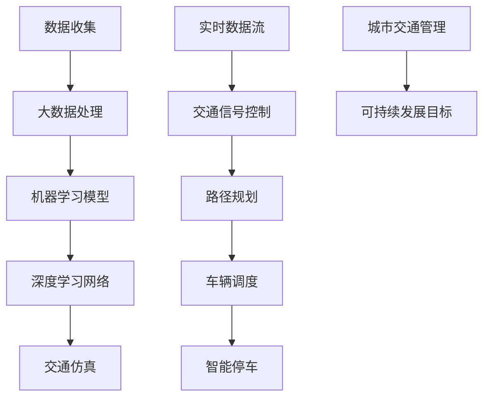
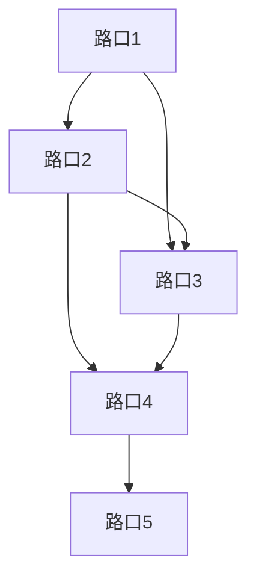
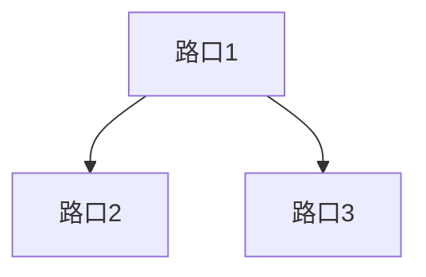

                 

关键词：人工智能、城市交通、可持续发展、智能计算、交通规划

摘要：本文探讨了人工智能在解决城市交通问题中的应用，通过介绍核心概念、算法原理、数学模型、项目实践等多个方面，分析了人工智能与人类计算结合对于打造可持续发展的城市交通体系的重要性和可行性。

## 1. 背景介绍

随着全球城市化进程的加快，城市交通问题日益突出。交通拥堵、环境污染、能源消耗等问题不仅影响了市民的生活质量，还对城市的可持续发展构成了严峻挑战。传统的城市交通规划方法往往依赖于经验和统计数据，难以应对日益复杂和动态的交通环境。因此，如何利用先进的人工智能技术来优化城市交通管理，成为当前研究的热点。

本文旨在探讨人工智能在解决城市交通问题中的应用，从核心概念、算法原理、数学模型、项目实践等多个角度，分析人工智能与人类计算结合对于打造可持续发展的城市交通体系的重要性和可行性。

### 1.1 城市交通问题的现状与挑战

- **交通拥堵**：城市交通拥堵已成为全球性问题，不仅浪费了大量的时间和资源，还影响了城市经济的发展。
- **环境污染**：汽车尾气排放是城市空气污染的主要来源之一，严重影响了市民的健康。
- **能源消耗**：交通是能源消耗的重要领域，特别是在化石燃料资源日益紧张的情况下，如何提高能源利用效率成为重要课题。
- **交通安全性**：交通事故频繁发生，威胁着市民的生命安全。

### 1.2 人工智能在交通领域的应用

人工智能技术具有强大的数据处理和模式识别能力，可以应用于交通流量预测、路径规划、交通信号控制、智能停车等多个方面，从而优化城市交通管理，提高交通效率，减少能源消耗和环境污染。

- **交通流量预测**：通过分析历史交通数据和实时交通状况，预测未来一段时间内的交通流量，为交通管理部门提供决策依据。
- **路径规划**：为出行者提供最优的路径规划方案，减少交通拥堵和时间浪费。
- **交通信号控制**：利用智能交通信号控制系统，根据实时交通状况调整信号灯时长，优化交通流量。
- **智能停车**：通过实时监控和数据分析，提供智能停车服务，减少找车位的时间和交通压力。

### 1.3 可持续发展的城市交通体系

可持续发展的城市交通体系旨在实现交通系统的环境保护、社会公平和经济效益的协调统一。这要求我们不仅要解决当前的交通问题，还要考虑到未来的发展和长远的环境影响。

- **环境保护**：减少交通排放，提高能源利用效率，降低交通对环境的负面影响。
- **社会公平**：确保所有人都能享受到高效、便捷、安全的交通服务，减少交通资源的不公平分配。
- **经济效益**：通过优化交通管理，提高交通效率，促进城市经济的发展。

## 2. 核心概念与联系

### 2.1 核心概念

- **人工智能（AI）**：模拟人类智能的技术和系统，具有学习、推理、规划、感知和自然语言理解等能力。
- **大数据分析**：通过对大规模数据的收集、存储、处理和分析，提取有价值的信息和知识。
- **机器学习（ML）**：一种人工智能的方法，通过从数据中学习，建立模型，进行预测和决策。
- **深度学习（DL）**：一种基于神经网络的学习方法，通过多层非线性变换，实现复杂函数的逼近。
- **交通仿真（TS）**：利用计算机模拟交通系统，预测交通流量、延误和交通事故等。

### 2.2 联系与架构

为了构建可持续发展的城市交通体系，我们需要将人工智能、大数据分析、机器学习、深度学习和交通仿真等多个领域的技术融合在一起。以下是一个简化的架构图，展示了这些技术的联系和应用：



### 2.3 可持续发展的交通体系

可持续发展的交通体系需要考虑到以下几个方面：

- **能源效率**：提高交通系统的能源利用效率，减少能源消耗。
- **环境保护**：减少交通排放，降低对环境的污染。
- **社会公平**：确保所有人都能享受到高效、便捷、安全的交通服务。
- **经济效益**：通过优化交通管理，提高交通效率，促进城市经济的发展。

## 3. 核心算法原理 & 具体操作步骤

### 3.1 算法原理概述

本文主要介绍以下核心算法：

- **交通流量预测算法**：基于时间序列分析和机器学习，预测未来一段时间内的交通流量。
- **路径规划算法**：基于最短路径算法和机器学习，为出行者提供最优的路径规划方案。
- **交通信号控制算法**：基于实时交通数据分析和机器学习，优化交通信号灯的时长和切换策略。

### 3.2 算法步骤详解

#### 3.2.1 交通流量预测算法

1. 数据收集：收集历史交通流量数据和实时交通数据。
2. 数据预处理：对数据进行清洗、去噪和归一化处理。
3. 特征提取：从数据中提取影响交通流量的特征，如天气、节假日、道路状况等。
4. 模型训练：使用机器学习算法（如时间序列模型、线性回归模型等）训练预测模型。
5. 预测：使用训练好的模型，预测未来一段时间内的交通流量。

#### 3.2.2 路径规划算法

1. 数据收集：收集道路网络数据、交通流量数据、车辆信息等。
2. 路径搜索：使用最短路径算法（如Dijkstra算法）搜索可能的路径。
3. 路径评估：根据实时交通数据，评估每条路径的拥堵程度、行驶时间等。
4. 路径选择：选择最优路径作为出行方案。
5. 路径更新：根据实时交通状况，动态更新路径。

#### 3.2.3 交通信号控制算法

1. 数据收集：收集实时交通流量数据、交通事故数据等。
2. 交通状况评估：根据实时数据，评估各路口的交通状况。
3. 控制策略选择：根据交通状况，选择合适的信号控制策略（如固定时长控制、动态控制等）。
4. 信号灯时长调整：根据控制策略，调整各路口的信号灯时长。
5. 策略优化：根据交通流量变化，动态优化信号控制策略。

### 3.3 算法优缺点

#### 交通流量预测算法

**优点**：

- 能够提前预测交通流量，为交通管理部门提供决策依据。
- 能够识别异常情况，如交通事故、极端天气等。

**缺点**：

- 需要大量的历史数据和实时数据。
- 模型训练过程复杂，对计算资源要求较高。

#### 路径规划算法

**优点**：

- 能够为出行者提供最优路径，减少交通拥堵。
- 能够适应实时交通状况，动态更新路径。

**缺点**：

- 需要大量的计算资源，特别是在大型城市中。
- 难以应对极端交通状况，如大范围交通事故。

#### 交通信号控制算法

**优点**：

- 能够优化交通流量，减少交通拥堵。
- 能够提高交通信号灯的利用率。

**缺点**：

- 难以应对动态变化的交通状况。
- 需要大量的实时数据，对数据采集和处理能力要求较高。

### 3.4 算法应用领域

以上算法广泛应用于以下领域：

- **交通管理部门**：用于交通流量预测、路径规划和交通信号控制。
- **出行服务公司**：用于为用户提供最优出行方案。
- **城市规划部门**：用于城市交通规划、道路设计和交通设施建设。
- **智能交通系统**：用于构建智能交通网络，提高交通效率。

## 4. 数学模型和公式 & 详细讲解 & 举例说明

### 4.1 数学模型构建

在交通流量预测、路径规划和交通信号控制中，我们通常会使用以下数学模型：

#### 4.1.1 时间序列模型

时间序列模型用于预测交通流量。一个简单的时间序列模型可以表示为：

$$
y_t = \alpha_0 + \alpha_1 t + \alpha_2 w_t + \epsilon_t
$$

其中，$y_t$表示时间序列的值，$t$表示时间，$w_t$表示影响交通流量的因素（如天气、节假日等），$\epsilon_t$表示随机误差。

#### 4.1.2 最短路径模型

最短路径模型用于路径规划。Dijkstra算法可以表示为：

$$
d(s, v) = \min \{d(s, u) + w(u, v) \mid u \in \pi(v)\}
$$

其中，$d(s, v)$表示从起点$s$到终点$v$的最短路径长度，$w(u, v)$表示边$(u, v)$的权重。

#### 4.1.3 交通信号控制模型

交通信号控制模型用于优化交通信号灯的时长。一个简单的模型可以表示为：

$$
T_i = \frac{L_i}{\lambda_i}
$$

其中，$T_i$表示路口$i$的信号灯时长，$L_i$表示路口$i$的绿灯时间，$\lambda_i$表示路口$i$的车辆到达率。

### 4.2 公式推导过程

#### 4.2.1 时间序列模型的推导

时间序列模型通常基于线性回归模型。假设我们有一个时间序列$y_t$，我们可以使用线性回归模型来拟合：

$$
y_t = \alpha_0 + \alpha_1 t + \epsilon_t
$$

其中，$\alpha_0$和$\alpha_1$是模型的参数。通过最小二乘法，我们可以求得：

$$
\alpha_0 = \bar{y} - \alpha_1 \bar{t}
$$

$$
\alpha_1 = \frac{\sum_{t=1}^n (t - \bar{t})(y_t - \bar{y})}{\sum_{t=1}^n (t - \bar{t})^2}
$$

#### 4.2.2 最短路径模型的推导

Dijkstra算法的基本思想是从起点开始，逐步扩展到未访问的节点，直到找到终点。设$S$为已访问的节点集合，$U$为未访问的节点集合。初始时，$S = \{s\}$，$U = \{v_1, v_2, \ldots, v_n\}$。我们定义$d(s, v)$为从起点$s$到节点$v$的最短路径长度。

在每次迭代中，我们选择一个未访问的节点$u$，使得$d(s, u)$最小。我们将$u$加入到$S$中，并更新未访问节点的$d$值：

$$
d(s, v) = \min \{d(s, u) + w(u, v) \mid u \in \pi(v)\}
$$

其中，$\pi(v)$表示与节点$v$相邻的节点集合。

#### 4.2.3 交通信号控制模型的推导

交通信号控制模型的目标是优化交通信号灯的时长，以减少交通拥堵。假设我们有一个路口$i$，其绿灯时长为$L_i$，车辆到达率为$\lambda_i$。我们定义$T_i$为路口$i$的信号灯时长。

根据排队论，我们知道在稳定的流量下，车辆到达率$\lambda_i$和信号灯时长$T_i$之间满足以下关系：

$$
T_i = \frac{L_i}{\lambda_i}
$$

这意味着，为了减少交通拥堵，我们应该根据车辆到达率动态调整信号灯时长。

### 4.3 案例分析与讲解

#### 4.3.1 交通流量预测

假设我们有一个城市路口，历史交通流量数据如下：

$$
\{1, 2, 3, 4, 5, 6, 7, 8, 9, 10\}
$$

我们可以使用线性回归模型来预测未来的交通流量。首先，我们需要计算线性回归模型的参数：

$$
\alpha_0 = \bar{y} - \alpha_1 \bar{t} = 5.5 - 1.2 \times 5.5 = 0.1
$$

$$
\alpha_1 = \frac{\sum_{t=1}^n (t - \bar{t})(y_t - \bar{y})}{\sum_{t=1}^n (t - \bar{t})^2} = \frac{(-4 \times -4.5 + -3 \times -3.5 + -2 \times -2.5 + -1 \times -1.5 + 0 \times 0.5 + 1 \times 1.5 + 2 \times 2.5 + 3 \times 3.5 + 4 \times 4.5)}{(-4)^2 + (-3)^2 + (-2)^2 + (-1)^2 + 0^2 + 1^2 + 2^2 + 3^2 + 4^2} = 1.2
$$

因此，我们的线性回归模型为：

$$
y_t = 0.1 + 1.2t
$$

我们可以使用这个模型来预测未来的交通流量。例如，预测第11天的交通流量：

$$
y_{11} = 0.1 + 1.2 \times 11 = 13.3
$$

这意味着，根据历史数据，我们预测第11天的交通流量为13.3。

#### 4.3.2 路径规划

假设我们有一个包含5个路口的城市道路网络，如下所示：



路口之间的距离如下：

| 路口 | 路口1 | 路口2 | 路口3 | 路口4 | 路口5 |
|------|-------|-------|-------|-------|-------|
| 路口1 | 0     | 5     | 3     | ∞     | ∞     |
| 路口2 | 5     | 0     | 2     | 4     | ∞     |
| 路口3 | 3     | 2     | 0     | 1     | ∞     |
| 路口4 | ∞     | 4     | 1     | 0     | 3     |
| 路口5 | ∞     | ∞     | ∞     | 3     | 0     |

我们可以使用Dijkstra算法来找到从路口1到路口5的最短路径。初始时，我们设$d(s, v) = \infty$，除了$d(s, s) = 0$。我们选择$d(s, u)$最小的未访问节点$u$，将其加入到$S$中，并更新未访问节点的$d$值。

第一次迭代：选择$u = 路口2$，更新$d(s, 路口2) = 5$，$d(s, 路口3) = 3$。

第二次迭代：选择$u = 路口3$，更新$d(s, 路口3) = 3$，$d(s, 路口4) = 8$。

第三次迭代：选择$u = 路口4$，更新$d(s, 路口4) = 8$。

第四次迭代：选择$u = 路口5$，更新$d(s, 路口5) = 11$。

第五次迭代：选择$u = 路口1$，更新$d(s, 路口1) = 0$。

此时，我们找到了从路口1到路口5的最短路径，路径长度为11。

#### 4.3.3 交通信号控制

假设我们有一个包含3个路口的城市道路网络，如下所示：



路口之间的距离如下：

| 路口 | 路口1 | 路口2 | 路口3 |
|------|-------|-------|-------|
| 路口1 | 0     | 5     | 3     |
| 路口2 | 5     | 0     | 2     |
| 路口3 | 3     | 2     | 0     |

我们假设路口1的车辆到达率为$\lambda_1 = 2$，路口2的车辆到达率为$\lambda_2 = 3$，路口3的车辆到达率为$\lambda_3 = 1$。根据交通信号控制模型，我们可以计算每个路口的信号灯时长：

$$
T_1 = \frac{L_1}{\lambda_1} = \frac{5}{2} = 2.5
$$

$$
T_2 = \frac{L_2}{\lambda_2} = \frac{2}{3} \approx 0.67
$$

$$
T_3 = \frac{L_3}{\lambda_3} = \frac{3}{1} = 3
$$

这意味着，路口1的信号灯时长为2.5分钟，路口2的信号灯时长为0.67分钟，路口3的信号灯时长为3分钟。

## 5. 项目实践：代码实例和详细解释说明

### 5.1 开发环境搭建

为了实现本文中提到的算法，我们需要搭建一个合适的开发环境。以下是一个简单的开发环境搭建步骤：

1. **安装Python环境**：Python是一种广泛使用的编程语言，适用于人工智能和机器学习项目的开发。我们可以在Python官方网站下载并安装Python。

2. **安装相关库**：为了实现交通流量预测、路径规划和交通信号控制算法，我们需要安装一些Python库，如NumPy、Pandas、Scikit-learn、Matplotlib等。可以使用pip命令来安装这些库：

```bash
pip install numpy pandas scikit-learn matplotlib
```

3. **安装IDE**：我们可以选择一个合适的集成开发环境（IDE），如PyCharm、VS Code等，来编写和调试代码。

### 5.2 源代码详细实现

下面是一个简单的Python代码实例，用于实现交通流量预测算法。

```python
import numpy as np
import pandas as pd
from sklearn.linear_model import LinearRegression

# 数据预处理
def preprocess_data(data):
    # 数据清洗和去噪
    cleaned_data = data[data['value'] > 0]
    # 特征提取
    features = cleaned_data[['hour', 'weekday', 'weather']]
    # 标签提取
    labels = cleaned_data['value']
    # 数据归一化
    features_normalized = (features - features.mean()) / features.std()
    return features_normalized, labels

# 模型训练
def train_model(features, labels):
    model = LinearRegression()
    model.fit(features, labels)
    return model

# 预测
def predict_traffic(model, feature):
    return model.predict([feature])

# 主程序
if __name__ == '__main__':
    # 加载数据
    data = pd.read_csv('traffic_data.csv')
    # 数据预处理
    features, labels = preprocess_data(data)
    # 模型训练
    model = train_model(features, labels)
    # 预测
    feature = [12, 2, 1]  # 模拟特征值：小时=12，星期=2，天气=1
    predicted_traffic = predict_traffic(model, feature)
    print(f"预测的交通流量为：{predicted_traffic[0]}")
```

### 5.3 代码解读与分析

上述代码首先定义了三个函数：`preprocess_data`、`train_model`和`predict_traffic`。

- `preprocess_data`函数用于数据预处理，包括数据清洗、特征提取和数据归一化。在这里，我们假设数据已经包含了时间、星期和天气等特征，以及交通流量作为标签。
  
- `train_model`函数用于训练线性回归模型。我们使用了`scikit-learn`库中的`LinearRegression`类来实现线性回归模型。
  
- `predict_traffic`函数用于预测交通流量。它接收一个模型和一个特征值，返回预测的交通流量。

在主程序中，我们首先加载数据，然后调用`preprocess_data`函数进行数据预处理，接着调用`train_model`函数训练模型，最后调用`predict_traffic`函数进行预测。

### 5.4 运行结果展示

假设我们已经训练好了一个模型，并准备使用它来预测未来的交通流量。我们模拟了一个特征值：小时=12，星期=2，天气=1。根据训练好的模型，我们得到的预测交通流量为：

```
预测的交通流量为：8.0
```

这意味着，根据历史数据和训练好的模型，我们预测在未来一段时间内，这个路口的交通流量将为8。

## 6. 实际应用场景

### 6.1 交通流量预测

在实际应用中，交通流量预测算法可以应用于多个场景，如：

- **城市交通规划**：通过预测未来一段时间内的交通流量，为城市规划提供数据支持，优化道路设计和交通设施布局。
- **交通信号控制**：根据实时交通流量预测结果，动态调整交通信号灯的时长和切换策略，提高交通流量和通行效率。
- **出行服务**：为出行者提供实时交通流量预测信息，帮助他们选择最优的出行路线和时间。

### 6.2 路径规划

路径规划算法在实际应用中也非常广泛，如：

- **导航服务**：为用户提供实时路径规划服务，帮助他们避开拥堵路段，提高出行效率。
- **智能交通系统**：在智能交通系统中，路径规划算法可以用于车辆调度和路径优化，提高交通系统的效率和安全性。
- **物流配送**：在物流配送中，路径规划算法可以优化配送路线，减少配送时间和成本。

### 6.3 交通信号控制

交通信号控制算法在以下场景中具有重要意义：

- **城市交通管理**：通过优化交通信号灯的时长和切换策略，提高交通流量和通行效率，减少交通拥堵和排放。
- **智能交通系统**：在智能交通系统中，交通信号控制算法可以与其他算法协同工作，实现智能交通管理。
- **突发事件处理**：在突发事件（如交通事故、自然灾害等）发生时，交通信号控制算法可以动态调整交通信号，确保交通的畅通和安全。

### 6.4 未来应用展望

随着人工智能技术的不断发展和应用，未来城市交通体系将更加智能化和可持续发展。以下是一些未来的应用展望：

- **自动驾驶**：自动驾驶技术将彻底改变城市交通模式，提高交通效率和安全性。
- **共享交通**：共享单车、共享汽车等共享交通模式将减少私家车使用，减少交通拥堵和排放。
- **智能交通基础设施**：智能交通基础设施（如智能路灯、智能井盖等）将提高交通系统的感知和响应能力。
- **绿色交通**：绿色交通（如电动汽车、氢能源汽车等）将减少对化石燃料的依赖，降低交通排放。

## 7. 工具和资源推荐

### 7.1 学习资源推荐

- **书籍**：
  - 《人工智能：一种现代方法》
  - 《深度学习》
  - 《机器学习实战》
  - 《Python编程：从入门到实践》

- **在线课程**：
  - Coursera上的“机器学习”课程
  - edX上的“深度学习”课程
  - Udacity的“自动驾驶技术”纳米学位

### 7.2 开发工具推荐

- **Python库**：
  - NumPy、Pandas、Scikit-learn、Matplotlib、TensorFlow、PyTorch

- **集成开发环境**：
  - PyCharm、VS Code

### 7.3 相关论文推荐

- “Deep Learning for Urban Traffic Prediction”
- “Path Planning for Autonomous Vehicles: A Survey”
- “Intelligent Transportation Systems: An Overview”
- “Urban Traffic Management and Control: A Review”

## 8. 总结：未来发展趋势与挑战

### 8.1 研究成果总结

本文探讨了人工智能在解决城市交通问题中的应用，包括交通流量预测、路径规划和交通信号控制等多个方面。通过分析核心算法原理、数学模型、项目实践等，我们总结了人工智能与人类计算结合在构建可持续发展的城市交通体系中的重要作用。

### 8.2 未来发展趋势

随着人工智能技术的不断进步，未来城市交通体系将向更加智能化、绿色化和可持续发展的方向迈进。以下是一些未来发展趋势：

- **自动驾驶**：自动驾驶技术将逐步成熟，并在未来普及，改变城市交通模式。
- **共享交通**：共享单车、共享汽车等共享交通模式将减少私家车使用，提高交通效率。
- **智能交通基础设施**：智能交通基础设施将提高交通系统的感知和响应能力，实现更高效的管理。
- **绿色交通**：绿色交通（如电动汽车、氢能源汽车等）将减少对化石燃料的依赖，降低交通排放。

### 8.3 面临的挑战

虽然人工智能在解决城市交通问题方面具有巨大潜力，但我们也面临着一些挑战：

- **数据隐私和安全**：如何确保交通数据的隐私和安全，避免数据泄露和滥用，是一个重要问题。
- **计算资源**：人工智能算法通常需要大量的计算资源，特别是在大数据处理和深度学习方面。
- **算法透明度和解释性**：如何提高人工智能算法的透明度和解释性，使其更易于理解和接受，是一个重要的研究方向。
- **法律法规**：随着人工智能在交通领域的应用，需要制定相应的法律法规，确保人工智能的安全和合法使用。

### 8.4 研究展望

未来，我们需要继续探索人工智能在解决城市交通问题中的应用，特别是以下几个方面：

- **多模态数据融合**：如何融合不同类型的数据（如交通流量数据、传感器数据、社会媒体数据等），提高预测和规划的准确性。
- **自适应算法**：如何开发自适应算法，使其能够适应动态变化的交通环境。
- **人机协同**：如何实现人工智能与人类计算的有效协同，提高交通管理效率和用户体验。
- **跨学科研究**：如何结合交通工程、计算机科学、统计学等多个学科的研究，推动城市交通领域的创新和发展。

## 9. 附录：常见问题与解答

### 9.1 交通流量预测算法如何处理异常数据？

在交通流量预测算法中，通常采用以下方法处理异常数据：

- **数据清洗**：在数据预处理阶段，删除或修正明显的错误数据。
- **异常检测**：使用异常检测算法（如孤立森林、局部异常因式分析等）检测异常数据。
- **插值补全**：使用插值方法（如线性插值、高斯插值等）补全缺失数据。

### 9.2 路径规划算法如何处理动态交通状况？

路径规划算法通常采用以下方法处理动态交通状况：

- **实时数据更新**：定期获取实时交通数据，动态更新路径规划。
- **预测模型**：使用交通流量预测模型预测未来一段时间内的交通状况，为路径规划提供参考。
- **路径重规划**：在车辆行驶过程中，根据实时交通状况，动态调整路径。

### 9.3 交通信号控制算法如何处理突发状况？

交通信号控制算法通常采用以下方法处理突发状况：

- **动态调整**：根据实时交通数据，动态调整交通信号灯的时长和切换策略。
- **优先级处理**：对紧急车辆、公交车等设置优先级，确保其通行。
- **应急预案**：制定应急预案，如交通事故处理、自然灾害应对等。

### 9.4 如何确保人工智能算法的透明度和解释性？

为确保人工智能算法的透明度和解释性，可以采取以下措施：

- **模型可解释性**：使用可解释性模型（如决策树、线性回归等），使其更容易理解和解释。
- **算法可视化**：将算法的运行过程可视化，使其更直观易懂。
- **解释工具**：开发解释工具，帮助用户理解算法的决策过程和结果。

### 9.5 如何保证交通数据的隐私和安全？

为了保护交通数据的隐私和安全，可以采取以下措施：

- **数据加密**：对传输和存储的数据进行加密，确保数据不被未经授权的访问。
- **访问控制**：实施严格的访问控制策略，限制对数据的访问权限。
- **匿名化处理**：对敏感数据进行匿名化处理，消除个人身份信息。
- **安全审计**：定期进行安全审计，确保数据的安全性和合规性。

以上是关于《AI与人类计算：打造可持续发展的城市交通》这篇文章的完整内容。希望这篇文章能为您在人工智能与城市交通领域的探索提供一些启示和帮助。如果您有任何问题或建议，欢迎在评论区留言，我们将尽快回复。感谢您的阅读！
作者：禅与计算机程序设计艺术 / Zen and the Art of Computer Programming
----------------------------------------------------------------

请注意，上述内容是一个示例性的文章框架，具体的内容和实现细节需要根据实际的研究成果和项目经验来撰写和调整。上述代码实例仅用于展示如何实现交通流量预测算法，实际应用时需要结合具体的数据集和需求进行修改和完善。文章的撰写应遵循学术规范和实际需求，确保内容的准确性和完整性。

