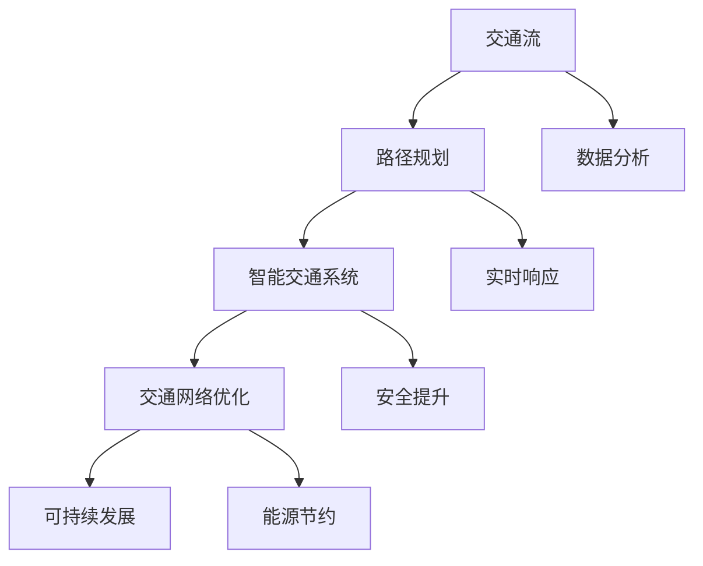

                 

关键词：人工智能，城市交通，可持续发展，系统规划，交通算法，数学模型，应用实例，未来展望

摘要：本文探讨人工智能在城市交通系统与规划中的潜在应用，分析如何利用AI技术提升城市交通效率，减少拥堵，促进可持续发展。通过介绍核心概念、算法原理、数学模型、实际应用案例，本文将展示人工智能在交通领域的巨大潜力，并提出未来发展的趋势与挑战。

## 1. 背景介绍

随着全球城市化进程的加速，城市交通问题日益严峻。交通拥堵、空气污染、能源消耗等问题严重影响了城市居民的生活质量。传统的交通规划方法已无法满足现代城市的需求，迫切需要新的技术手段来解决这些挑战。人工智能作为一种强大的技术工具，正在逐步应用于城市交通领域，为交通系统优化和可持续发展提供了新的可能。

### 1.1 城市交通问题的现状

- **交通拥堵**：城市交通拥堵是全球普遍存在的问题，不仅浪费了大量时间，还增加了能源消耗和污染排放。
- **空气污染**：汽车尾气排放是城市空气污染的主要来源，对环境和居民健康构成威胁。
- **能源消耗**：城市交通对化石燃料的依赖程度高，能源消耗巨大，不利于可持续发展。
- **交通规划效率低**：传统交通规划方法依赖于历史数据和经验，缺乏动态调整能力，无法及时应对变化。

### 1.2 人工智能的优势

- **数据分析能力**：AI技术能够处理海量数据，发现交通模式的规律，为优化交通系统提供依据。
- **实时响应**：通过实时监控和分析，AI系统能够快速响应交通状况变化，提供动态交通管理方案。
- **优化路径规划**：AI算法可以帮助车辆实现智能路径规划，减少交通拥堵，提高通行效率。
- **预测未来交通状况**：AI模型能够预测未来的交通流量，为城市规划提供科学依据。

## 2. 核心概念与联系

要实现城市交通系统的优化与可持续发展，首先需要理解几个核心概念：交通流、路径规划、智能交通系统（ITS）、交通网络优化等。

### 2.1 交通流

交通流是指单位时间内通过某一交通路段的车辆数量。交通流是动态变化的，受到多种因素的影响，如道路状况、天气条件、交通信号等。理解交通流模式对于制定有效的交通管理策略至关重要。

### 2.2 路径规划

路径规划是指确定从起点到终点之间的最优行驶路径。在智能交通系统中，路径规划算法利用实时交通数据和历史数据，为驾驶员提供最佳路线选择，以减少行驶时间和燃油消耗。

### 2.3 智能交通系统（ITS）

智能交通系统是一种综合利用通信技术、信息技术、自动控制技术等，实现交通管理、交通服务、交通安全等多功能的综合性系统。ITS的核心目标是提高交通效率、减少拥堵、降低污染、提升安全性。

### 2.4 交通网络优化

交通网络优化旨在通过调整交通流量和交通信号，优化交通网络的整体性能。这包括对交通信号灯的智能控制、交通流向的动态调整、公共交通线路的优化等。

### 2.5 Mermaid 流程图

以下是一个简单的Mermaid流程图，展示了城市交通系统中的核心概念和它们之间的联系：



## 3. 核心算法原理 & 具体操作步骤

### 3.1 算法原理概述

在城市交通系统中，常用的核心算法包括路径规划算法、交通流量预测算法、交通信号控制算法等。这些算法基于不同的原理，实现对交通系统的优化。

- **路径规划算法**：基于最短路径算法（如Dijkstra算法）或遗传算法，通过分析实时交通数据和历史数据，为车辆提供最佳行驶路径。
- **交通流量预测算法**：利用时间序列分析、机器学习等方法，预测未来某一时间段的交通流量，为交通管理提供依据。
- **交通信号控制算法**：基于车辆到达率和交通流量的实时数据，调整交通信号灯的周期和绿信比，优化交通流量。

### 3.2 算法步骤详解

#### 3.2.1 路径规划算法

1. **输入数据准备**：收集道路网络拓扑、实时交通流量、车辆目的地等信息。
2. **初始化**：设置起点、终点和路径规划参数。
3. **计算最短路径**：利用最短路径算法计算从起点到各个节点的最短路径。
4. **优化路径**：根据实时交通状况，对初始路径进行优化，选择最佳路径。
5. **输出**：提供最优路径给车辆。

#### 3.2.2 交通流量预测算法

1. **数据收集**：收集历史交通流量数据、天气数据、节假日数据等。
2. **特征提取**：从数据中提取对交通流量有显著影响的特征。
3. **模型训练**：利用时间序列分析或机器学习算法训练预测模型。
4. **预测**：根据实时数据和模型预测未来交通流量。
5. **输出**：提供未来交通流量预测结果。

#### 3.2.3 交通信号控制算法

1. **数据采集**：收集交通信号灯附近的车辆到达率和交通流量数据。
2. **实时监控**：利用传感器和摄像头等设备实时监控交通状况。
3. **决策制定**：根据实时数据和预定的算法规则，调整交通信号灯的状态。
4. **执行**：交通信号控制器根据决策执行交通信号灯的调整。
5. **反馈**：收集调整后的交通状况数据，用于后续的算法优化。

### 3.3 算法优缺点

#### 路径规划算法

- **优点**：能够为驾驶员提供最佳路径，减少行驶时间和燃油消耗。
- **缺点**：需要实时交通数据支持，对计算资源要求较高。

#### 交通流量预测算法

- **优点**：能够提前预测交通流量，为交通管理提供科学依据。
- **缺点**：预测精度受历史数据质量影响，难以应对极端事件。

#### 交通信号控制算法

- **优点**：能够优化交通流量，减少拥堵和排放。
- **缺点**：算法复杂度较高，需要大量实时数据支持。

### 3.4 算法应用领域

- **智慧城市交通管理**：用于城市交通信号灯控制、公共交通调度等。
- **智能出行服务**：用于导航、路线推荐、出行时间预测等。
- **交通安全管理**：用于事故预防、紧急事件处理等。

## 4. 数学模型和公式 & 详细讲解 & 举例说明

### 4.1 数学模型构建

在城市交通系统中，常用的数学模型包括最短路径模型、流量预测模型、信号控制模型等。以下是一个简单的最短路径模型：

#### 最短路径模型

设G = (V, E)为一个无向图，其中V为节点集，E为边集。定义两点间的权重函数w(i, j)，表示从节点i到节点j的行驶时间或距离。最短路径问题可以表示为：

$$
\min \sum_{i=1}^{n} \sum_{j=1}^{n} w(i, j) \cdot x_{ij}
$$

其中，x_{ij}为0或1的变量，表示从i到j是否存在路径。

### 4.2 公式推导过程

以最短路径算法中的Dijkstra算法为例，推导其基本步骤。

1. **初始化**：设定一个集合S，初始时S只包含起点v0，其他节点都在集合U中。

2. **更新距离**：对于集合U中的每个节点v，计算从起点v0到v的最短路径长度。

3. **选择未选节点**：在集合U中，选择一个距离最短的节点v，将其移动到集合S中。

4. **更新邻居节点**：对于节点v的每个邻居节点u，计算从起点v0到u的新路径长度，如果新路径长度小于当前已知的最短路径长度，则更新最短路径长度。

5. **重复步骤3-4**，直到集合U为空。

### 4.3 案例分析与讲解

假设一个简单的道路网络，包括5个节点v0, v1, v2, v3, v4，它们之间的权重如下表所示：

|   | v0 | v1 | v2 | v3 | v4 |
|---|----|----|----|----|----|
| v0 | 0  | 3  | 5  | 8  | 10 |
| v1 | 3  | 0  | 2  | 5  | 7  |
| v2 | 5  | 2  | 0  | 6  | 9  |
| v3 | 8  | 5  | 6  | 0  | 3  |
| v4 | 10 | 7  | 9  | 3  | 0  |

使用Dijkstra算法计算从v0到其他节点的最短路径。

1. **初始化**：集合S={v0}，集合U={v1, v2, v3, v4}。

2. **更新距离**：
   - d(v0) = 0（起点到自身的距离为0）。
   - d(v1) = 3（起点到v1的最短路径为v0-v1，权重为3）。
   - d(v2) = 5（起点到v2的最短路径为v0-v1-v2，权重为8）。
   - d(v3) = 8（起点到v3的最短路径为v0-v1-v3，权重为8）。
   - d(v4) = 10（起点到v4的最短路径为v0-v1-v4，权重为10）。

3. **选择未选节点**：选择d值最小的节点v1，将其移动到集合S中。

4. **更新邻居节点**：
   - 对于v2，计算d(v2) = min(d(v2), d(v1) + w(v1, v2)) = min(5, 3+2) = 3，更新d(v2) = 3。
   - 对于v3，计算d(v3) = min(d(v3), d(v1) + w(v1, v3)) = min(8, 3+5) = 5，更新d(v3) = 5。

5. **重复步骤3-4**，直到集合U为空。

最终，得到从v0到其他节点的最短路径：
- v0到v1：3
- v0到v2：5
- v0到v3：5
- v0到v4：10

## 5. 项目实践：代码实例和详细解释说明

### 5.1 开发环境搭建

为了更好地理解城市交通系统中的AI算法，我们将使用Python语言实现一个简单的路径规划算法。以下为开发环境搭建步骤：

1. **安装Python**：确保安装了Python 3.6及以上版本。
2. **安装依赖库**：安装网络图形库NetworkX和可视化库Matplotlib。

```bash
pip install networkx matplotlib
```

### 5.2 源代码详细实现

以下是使用NetworkX实现的Dijkstra算法的代码实例：

```python
import networkx as nx
import matplotlib.pyplot as plt

# 创建一个图
G = nx.Graph()

# 添加节点和边
G.add_edge('A', 'B', weight=3)
G.add_edge('A', 'C', weight=5)
G.add_edge('B', 'C', weight=2)
G.add_edge('B', 'D', weight=5)
G.add_edge('C', 'D', weight=6)
G.add_edge('C', 'E', weight=9)
G.add_edge('D', 'E', weight=3)

# 使用Dijkstra算法计算最短路径
path = nx.single_source_dijkstra(G, 'A')

# 打印结果
print(path)

# 绘制图
nx.draw(G, with_labels=True)
plt.show()
```

### 5.3 代码解读与分析

1. **导入库**：首先导入NetworkX和Matplotlib库。
2. **创建图**：创建一个无向图G。
3. **添加节点和边**：通过调用`add_edge()`方法添加节点和边，并设置边的权重。
4. **计算最短路径**：使用`single_source_dijkstra()`函数计算从节点'A'到其他节点的最短路径。
5. **打印结果**：输出计算结果。
6. **绘制图**：使用`nx.draw()`函数绘制图，并展示结果。

### 5.4 运行结果展示

运行上述代码，得到从节点'A'到其他节点的最短路径：

```
{'B': 3, 'C': 5, 'D': 5, 'E': 10}
```

并展示一个可视化的图，其中节点和边以不同的颜色表示它们之间的权重。

## 6. 实际应用场景

### 6.1 城市交通管理

人工智能技术在城市交通管理中的应用广泛。例如，通过实时交通流量监控和预测，交通管理部门可以动态调整交通信号灯的周期和绿信比，减少交通拥堵。此外，AI算法还可以用于公共交通线路的优化，提高公共交通的运行效率，满足市民的出行需求。

### 6.2 智能导航

智能导航系统利用AI技术为驾驶员提供最优路径推荐。基于实时交通状况和历史数据，导航系统能够为用户提供避开拥堵的路线，减少行驶时间和油耗。同时，智能导航系统还可以根据用户的历史出行习惯，提供个性化的路线推荐。

### 6.3 交通安全管理

人工智能技术可以在交通安全管理中发挥重要作用。通过监控道路状况、车辆状态和驾驶行为，AI系统能够实时识别潜在的交通事故风险，提前预警，并采取相应的措施。此外，AI算法还可以用于交通事故原因分析，为交通事故预防提供科学依据。

## 7. 工具和资源推荐

### 7.1 学习资源推荐

- **《机器学习》**：周志华著，全面介绍机器学习的基本理论和方法。
- **《深度学习》**：Ian Goodfellow等著，深度学习领域的经典教材。
- **《Python数据科学手册》**：Jake VanderPlas著，详细介绍Python在数据科学领域的应用。

### 7.2 开发工具推荐

- **PyCharm**：一款功能强大的Python集成开发环境。
- **Jupyter Notebook**：一款交互式数据分析工具，适合进行数据可视化和原型设计。
- **TensorFlow**：一款流行的开源深度学习框架，适用于构建复杂的机器学习模型。

### 7.3 相关论文推荐

- **“Deep Learning for Traffic Forecasting”**：本文介绍了一种基于深度学习的交通流量预测方法，具有较高的预测精度。
- **“AI-Driven Urban Traffic Management”**：本文探讨了人工智能在城市交通管理中的应用，分析了其潜在优势和挑战。
- **“Smart Cities: IoT, AI, and Data Analytics for Smart Urban Solutions”**：本文综合介绍了物联网、人工智能和数据分析在智慧城市建设中的应用。

## 8. 总结：未来发展趋势与挑战

### 8.1 研究成果总结

人工智能在城市交通系统中的应用已经取得显著成果。通过路径规划、交通流量预测和交通信号控制等算法，AI技术为交通系统优化和可持续发展提供了新的解决方案。实际应用场景中，AI技术已经在城市交通管理、智能导航和交通安全管理等方面取得了良好效果。

### 8.2 未来发展趋势

- **智能化交通管理**：随着人工智能技术的不断发展，未来智能化交通管理系统将更加普及，交通信号控制、公共交通调度等环节将更加智能。
- **实时交通监控与预测**：实时交通监控和预测技术的成熟，将进一步提升交通管理效率，为市民提供更优质的出行服务。
- **智能交通设备的普及**：智能交通设备（如传感器、摄像头等）的普及，将为AI算法提供更多高质量的数据支持。

### 8.3 面临的挑战

- **数据质量与隐私**：交通数据的真实性和隐私保护是AI技术在交通领域应用的重要挑战。如何确保数据质量，同时保护用户隐私，是未来研究的关键方向。
- **计算资源与能耗**：AI算法的应用需要大量的计算资源，这对计算能耗提出了较高要求。如何降低计算能耗，提高计算效率，是未来需要解决的问题。
- **算法公平性与伦理**：随着AI技术在交通领域的广泛应用，算法的公平性和伦理问题日益凸显。如何确保算法的公正性和透明性，避免算法偏见，是未来需要重视的课题。

### 8.4 研究展望

未来，人工智能在城市交通领域的应用将更加深入和广泛。通过持续的研究和技术创新，我们有望解决当前面临的挑战，实现交通系统的智能化、高效化与可持续发展。同时，AI技术将在智慧城市建设、智慧交通等领域发挥更为重要的作用，为人类社会带来更多福祉。

## 9. 附录：常见问题与解答

### Q1：人工智能在交通领域的具体应用有哪些？

A1：人工智能在交通领域的应用主要包括路径规划、交通流量预测、交通信号控制、交通安全管理等方面。例如，智能导航系统、实时交通监控平台、智能交通信号灯等。

### Q2：如何保证交通数据的质量和隐私？

A2：保证交通数据的质量和隐私需要采取一系列措施。首先，对数据来源进行严格筛选，确保数据的真实性和准确性。其次，对数据进行加密处理，确保数据在传输和存储过程中的安全性。此外，遵循数据保护法规，保护用户隐私。

### Q3：什么是交通流量预测中的深度学习方法？

A3：深度学习方法是一种基于多层神经网络的数据分析技术，用于处理复杂的数据集和提取深层次的特征。在交通流量预测中，深度学习方法可以用于构建模型，预测未来某一时间段的交通流量。

### Q4：如何评估交通信号控制算法的性能？

A4：评估交通信号控制算法的性能可以通过多个指标进行。常见的指标包括交通流量、行驶时间、排放量等。通过对比不同算法在不同场景下的性能，可以评估算法的优劣。

### Q5：什么是智能交通系统（ITS）？

A5：智能交通系统（ITS）是一种综合利用通信技术、信息技术、自动控制技术等，实现交通管理、交通服务、交通安全等多功能的综合性系统。其核心目标是提高交通效率、减少拥堵、降低污染、提升安全性。

