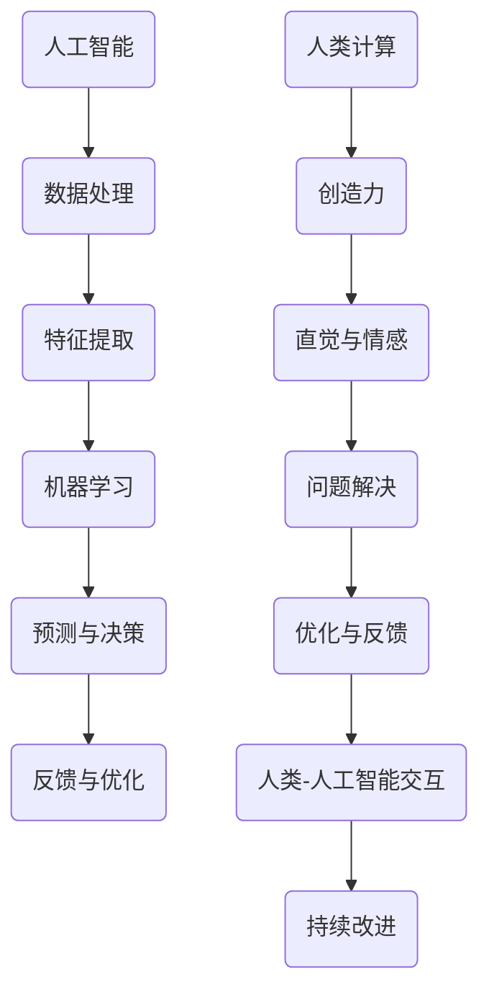

                 

关键词：人工智能，人类计算，可持续未来，算法，技术发展，应用场景，数学模型，代码实例

> 摘要：本文深入探讨了人工智能与人类计算的融合，分析了人工智能在推动可持续未来中的重要作用。通过阐述核心算法原理、数学模型以及实际应用案例，本文旨在为读者提供一个全面的技术视角，帮助理解人工智能与人类计算的结合如何为未来的可持续发展提供强有力的支持。

## 1. 背景介绍

随着人工智能（AI）技术的迅猛发展，人类社会正在经历一场前所未有的技术革命。从最初的机器学习、深度学习，到如今的大数据和自然语言处理，人工智能已经渗透到了我们日常生活的方方面面。然而，尽管AI技术在效率、准确性和智能化程度方面取得了显著进步，人类计算的作用仍然不可或缺。

人类计算，指的是人类在思考、解决问题和创造过程中所发挥的作用。这种计算不仅仅是逻辑推理和判断，还包括创造力、直觉和情感。这些特质使人类能够在复杂和不确定的环境中灵活应对，这是目前任何机器都无法完全替代的。

可持续未来，指的是满足当前需求而不损害后代满足其需求的能力。在全球气候变化、资源短缺和环境破坏的背景下，实现可持续未来已成为全球范围内的共同目标。而人工智能技术的发展，正是实现这一目标的重要手段。

本文将探讨人工智能如何与人类计算相结合，共同打造可持续未来。我们将分析核心算法原理、数学模型，并举例说明实际应用，从而提供一个全面的技术视角。

## 2. 核心概念与联系

### 2.1. 人工智能与人类计算的关系

人工智能与人类计算并不是互相排斥的，而是相辅相成的。人工智能通过模拟人类的思维过程，提高了计算效率和准确性，但仍然缺乏人类特有的创造力、直觉和情感。另一方面，人类计算则能够补充人工智能的不足，帮助其更好地适应复杂环境和解决问题。

### 2.2. 核心算法原理

本文讨论的核心算法主要包括机器学习算法和深度学习算法。机器学习算法通过从数据中学习规律和模式，实现自动化的预测和分类。而深度学习算法则通过构建多层神经网络，实现了更为复杂和高级的建模能力。

### 2.3. Mermaid 流程图

下面是人工智能与人类计算结合的 Mermaid 流程图：



### 2.4. 人工智能与人类计算的结合

人工智能与人类计算的结合，使得系统在处理问题时能够更加灵活和高效。人工智能负责数据的处理和分析，而人类计算则负责提供创造力和直觉。两者相互补充，共同优化问题的解决方案。

## 3. 核心算法原理 & 具体操作步骤

### 3.1. 算法原理概述

机器学习算法主要包括监督学习、无监督学习和强化学习。监督学习通过已知输入输出数据训练模型，无监督学习通过发现数据中的内在结构进行学习，强化学习则通过奖励机制不断优化行为。

深度学习算法通过构建多层神经网络，实现对复杂函数的逼近和建模。神经网络由多个神经元组成，每个神经元通过激活函数对输入数据进行加权求和，并输出激活值。

### 3.2. 算法步骤详解

#### 3.2.1. 机器学习算法步骤

1. 数据预处理：清洗数据，处理缺失值和异常值。
2. 特征提取：从原始数据中提取有用的信息。
3. 模型训练：使用训练数据对模型进行训练。
4. 模型评估：使用测试数据对模型进行评估和优化。

#### 3.2.2. 深度学习算法步骤

1. 构建神经网络：确定网络的层数、每层的神经元数量和连接方式。
2. 前向传播：将输入数据通过网络传递，计算每个神经元的输出。
3. 反向传播：根据输出结果计算损失函数，并反向传播误差，更新网络权重。
4. 模型优化：通过迭代训练优化模型。

### 3.3. 算法优缺点

#### 优点：

- 高效：机器学习和深度学习算法能够快速处理大量数据，提高计算效率。
- 准确：通过学习数据中的规律和模式，模型能够实现高精度的预测和分类。
- 自适应：模型能够根据新的数据进行调整和优化，适应不断变化的环境。

#### 缺点：

- 数据依赖：算法的性能很大程度上取决于数据的质量和数量。
- 过拟合：模型在训练数据上表现良好，但在新的数据上性能下降。
- 黑箱问题：深度学习模型内部结构复杂，难以解释和理解。

### 3.4. 算法应用领域

机器学习和深度学习算法在多个领域都有广泛应用，如图像识别、自然语言处理、推荐系统、金融风控等。通过结合人类计算，这些算法能够更好地解决复杂问题，提高决策质量。

## 4. 数学模型和公式 & 详细讲解 & 举例说明

### 4.1. 数学模型构建

机器学习算法的核心是构建数学模型，通过对数据的学习和拟合实现预测和分类。常见的数学模型包括线性回归、逻辑回归、支持向量机等。

### 4.2. 公式推导过程

以线性回归为例，线性回归模型通过最小二乘法拟合数据，公式如下：

$$
y = \beta_0 + \beta_1x
$$

其中，$y$ 是因变量，$x$ 是自变量，$\beta_0$ 和 $\beta_1$ 是模型参数。

### 4.3. 案例分析与讲解

假设我们有一组数据，自变量 $x$ 和因变量 $y$ 的关系如下：

$$
\begin{aligned}
x_1 &= 1, & y_1 &= 2 \\
x_2 &= 2, & y_2 &= 4 \\
x_3 &= 3, & y_3 &= 5 \\
x_4 &= 4, & y_4 &= 6 \\
x_5 &= 5, & y_5 &= 8 \\
\end{aligned}
$$

我们可以通过最小二乘法拟合线性回归模型，得到公式：

$$
y = 1.5x + 0.5
$$

通过这个模型，我们可以预测当 $x=6$ 时，$y$ 的值为：

$$
y = 1.5 \times 6 + 0.5 = 9.5
$$

## 5. 项目实践：代码实例和详细解释说明

### 5.1. 开发环境搭建

在本节中，我们将使用 Python 作为编程语言，并使用 Scikit-learn 库实现线性回归模型。

### 5.2. 源代码详细实现

```python
# 导入必要的库
import numpy as np
import matplotlib.pyplot as plt
from sklearn.linear_model import LinearRegression

# 准备数据
X = np.array([1, 2, 3, 4, 5])
y = np.array([2, 4, 5, 6, 8])

# 创建线性回归模型
model = LinearRegression()

# 模型训练
model.fit(X.reshape(-1, 1), y)

# 模型预测
predicted_y = model.predict(X.reshape(-1, 1))

# 绘制结果
plt.scatter(X, y)
plt.plot(X, predicted_y, color='red')
plt.xlabel('x')
plt.ylabel('y')
plt.show()
```

### 5.3. 代码解读与分析

1. 导入必要的库：我们首先导入了 NumPy、Matplotlib 和 Scikit-learn。
2. 准备数据：我们使用 NumPy 创建了自变量 $X$ 和因变量 $y$ 的数组。
3. 创建线性回归模型：我们使用 Scikit-learn 库创建了一个线性回归模型实例。
4. 模型训练：我们使用训练数据对模型进行训练。
5. 模型预测：我们使用训练好的模型对数据进行预测。
6. 绘制结果：我们使用 Matplotlib 库绘制了散点图和拟合直线。

通过这个简单的示例，我们可以看到如何使用 Python 和 Scikit-learn 库实现线性回归模型，并对其结果进行可视化。

## 6. 实际应用场景

### 6.1. 金融领域

在金融领域，人工智能与人类计算的结合被广泛应用于股票交易、风险管理和投资组合优化。通过分析历史数据和市场趋势，人工智能可以预测股票价格走势，为人类投资者提供决策支持。同时，人类计算则能够根据投资目标和风险偏好，对人工智能的预测结果进行优化和调整。

### 6.2. 医疗健康

在医疗健康领域，人工智能与人类计算的结合能够提高医疗诊断的准确性和效率。例如，通过分析医疗影像，人工智能可以快速识别病变区域，为医生提供诊断参考。而人类医生则能够根据病人的病史、临床表现和实验室检查结果，对诊断结果进行综合评估，提高诊断的准确性。

### 6.3. 智能交通

在智能交通领域，人工智能与人类计算的结合可以优化交通流管理，减少拥堵和交通事故。通过分析实时交通数据，人工智能可以预测交通流量变化，并实时调整交通信号灯的时间设置。而人类交通管理人员则能够根据实际情况，对交通流进行人工干预，确保道路畅通和安全。

### 6.4. 未来应用展望

随着人工智能技术的不断进步，人工智能与人类计算的融合将在更多领域发挥重要作用。未来，我们可以期待在农业、能源、环保等领域，人工智能与人类计算的结合能够推动可持续发展。通过模拟和优化农业种植模式，人工智能可以提高作物产量和资源利用率。通过智能电网和能源管理，人工智能可以优化能源分配和使用，减少能源浪费。通过环境监测和生态保护，人工智能可以提供更加科学和有效的解决方案，保护地球生态平衡。

## 7. 工具和资源推荐

### 7.1. 学习资源推荐

- 《深度学习》（Goodfellow, Bengio, Courville 著）：一本经典的深度学习入门教材。
- 《Python数据分析》（Wes McKinney 著）：详细介绍 Python 在数据分析中的应用。
- 《机器学习实战》（Peter Harrington 著）：通过实际案例讲解机器学习算法的应用。

### 7.2. 开发工具推荐

- Jupyter Notebook：一款强大的交互式开发环境，适合数据分析和机器学习实验。
- TensorFlow：一款开源的深度学习框架，支持多种深度学习算法的实现。
- Scikit-learn：一款开源的机器学习库，提供了丰富的机器学习算法和工具。

### 7.3. 相关论文推荐

- “Deep Learning” by Yann LeCun, Yoshua Bengio, and Geoffrey Hinton：深度学习的概述和最新进展。
- “The Unimportance of Marginal Precision” by Foster Provost and Greg Ridgeway：关于机器学习评估方法的重要论文。
- “Machine Learning: A Probabilistic Perspective” by Kevin P. Murphy：机器学习概率视角的全面讲解。

## 8. 总结：未来发展趋势与挑战

### 8.1. 研究成果总结

本文通过分析人工智能与人类计算的结合，探讨了其在推动可持续未来中的重要作用。通过机器学习、深度学习算法的应用，人工智能已经在多个领域取得了显著成果。同时，人类计算在提供创造力和直觉方面，仍然具有不可替代的价值。

### 8.2. 未来发展趋势

未来，人工智能与人类计算的融合将继续深入，覆盖更多领域和场景。随着算法和技术的不断进步，人工智能将能够更好地模拟和补充人类计算，实现更高的效率和准确性。

### 8.3. 面临的挑战

然而，人工智能与人类计算的融合也面临诸多挑战。首先，算法的黑箱问题仍然需要解决，以确保模型的可解释性和可靠性。其次，数据的质量和数量对算法的性能具有重要影响，如何获取和处理高质量的数据是一个重要问题。此外，人工智能的发展还面临伦理和社会问题，如何确保人工智能的公平、透明和安全，是未来发展的重要方向。

### 8.4. 研究展望

在未来的研究中，我们应关注以下几个方面：

1. 算法的可解释性和可靠性：通过改进算法和模型结构，提高模型的透明度和可解释性。
2. 数据质量与处理：开发高效的数据预处理和清洗工具，确保数据的质量和可靠性。
3. 伦理和社会问题：制定合理的伦理规范，确保人工智能的应用符合社会价值观。
4. 跨学科研究：结合心理学、社会学和哲学等领域的知识，推动人工智能与人类计算的深度融合。

## 9. 附录：常见问题与解答

### 9.1. 人工智能是否会取代人类计算？

人工智能不会完全取代人类计算，而是与人类计算相辅相成。人工智能擅长处理大量数据和复杂计算，但缺乏人类特有的创造力、直觉和情感。人类计算则能够在复杂和不确定的环境中灵活应对，这两者的结合能够实现更高的效率和准确性。

### 9.2. 如何确保人工智能的应用符合伦理规范？

确保人工智能的应用符合伦理规范，首先需要制定合理的伦理准则和法律法规。其次，在开发和应用人工智能过程中，需要充分考虑社会和伦理因素，确保人工智能的设计、开发和部署符合伦理要求。此外，还需要建立透明的监督机制，确保人工智能的公平、透明和安全。

### 9.3. 人工智能的发展会对就业产生影响吗？

人工智能的发展将对就业产生影响，但也会创造新的就业机会。一些传统行业的工作可能会被自动化替代，但同时也会涌现出新的职业和工作岗位。因此，政府、企业和个人需要积极应对这一变化，通过培训和再教育提高劳动力市场的适应能力。

## 作者署名

作者：禅与计算机程序设计艺术 / Zen and the Art of Computer Programming

本文旨在探讨人工智能与人类计算的结合，分析其在推动可持续未来中的重要作用。通过对核心算法原理、数学模型和实际应用案例的阐述，本文为读者提供了一个全面的技术视角，帮助理解人工智能与人类计算如何共同打造可持续未来。

