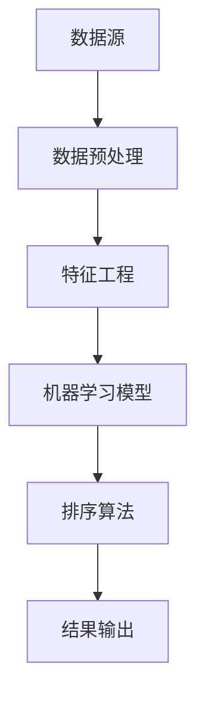

                 

关键词：AI排序、个性化推荐、机器学习、数据挖掘、算法实现

> 摘要：本文旨在探讨AI个性化排序系统的设计与实现，包括其核心概念、算法原理、数学模型、实际应用场景以及未来发展趋势。通过案例分析和代码实例，帮助读者理解如何构建一个高效的个性化排序系统。

## 1. 背景介绍

随着互联网的迅速发展和数据量的爆炸性增长，如何从海量数据中快速、准确地找到用户感兴趣的信息已成为关键问题。个性化排序系统正是为了满足这一需求而设计的。它利用机器学习和数据挖掘技术，根据用户的兴趣和行为，为用户推荐最相关的内容。

### 1.1 个性化排序的重要性

个性化排序不仅能够提升用户体验，还能为企业带来更多的商业价值。例如，在电子商务平台中，个性化排序可以帮助用户更快地找到心仪的商品，从而提高转化率；在社交媒体中，个性化排序则能够提高用户参与度和活跃度。

### 1.2 个性化排序的应用场景

个性化排序的应用场景非常广泛，包括但不限于：

- 社交媒体：如Facebook、Instagram等，根据用户的兴趣和行为推荐相关的内容。
- 电子商务：如Amazon、淘宝等，根据用户的购买历史和搜索记录推荐商品。
- 新闻推荐：如Google News、今日头条等，根据用户的阅读历史和兴趣推荐新闻。
- 音乐流媒体：如Spotify、网易云音乐等，根据用户的听歌习惯推荐音乐。

## 2. 核心概念与联系

个性化排序系统涉及多个核心概念，包括数据预处理、特征工程、机器学习模型和排序算法等。以下是一个简化的Mermaid流程图，展示这些概念之间的关系。



### 2.1 数据预处理

数据预处理是构建个性化排序系统的第一步。它的目标是将原始数据转化为适合机器学习模型处理的形式。主要步骤包括数据清洗、数据去重、数据格式转换等。

### 2.2 特征工程

特征工程是提高模型性能的关键环节。它包括特征提取和特征选择。特征提取是将原始数据转化为数值型的特征表示，如文本向量化、数值数据标准化等。特征选择则是从大量特征中挑选出对模型性能有显著影响的特征。

### 2.3 机器学习模型

个性化排序系统通常采用基于机器学习的模型，如矩阵分解、深度学习等。这些模型可以自动学习用户和物品之间的关联性，从而实现个性化推荐。

### 2.4 排序算法

排序算法是决定推荐结果顺序的关键因素。常用的排序算法包括基于协同过滤的排序、基于内容的排序等。这些算法可以根据不同的场景和需求进行选择和优化。

## 3. 核心算法原理 & 具体操作步骤

### 3.1 算法原理概述

个性化排序系统的核心算法通常是基于协同过滤（Collaborative Filtering）和深度学习（Deep Learning）两种技术。协同过滤可以分为基于用户的协同过滤（User-Based）和基于物品的协同过滤（Item-Based）。深度学习则通过神经网络模型捕捉用户和物品之间的复杂关系。

### 3.2 算法步骤详解

1. 数据预处理：清洗和转换原始数据，使其符合模型输入要求。
2. 特征工程：提取和选择对模型性能有显著影响的特征。
3. 模型选择：根据应用场景和需求选择合适的机器学习模型。
4. 模型训练：使用预处理后的数据和特征训练机器学习模型。
5. 模型评估：使用交叉验证等方法评估模型性能。
6. 排序算法：根据模型输出和用户行为数据，使用排序算法确定推荐结果的顺序。
7. 结果输出：将排序结果输出给用户。

### 3.3 算法优缺点

- 协同过滤：
  - 优点：简单易实现，能够捕捉用户和物品之间的相关性。
  - 缺点：难以处理冷启动问题，且对稀疏数据的鲁棒性较差。
- 深度学习：
  - 优点：能够处理高维稀疏数据，捕捉复杂的用户-物品关系。
  - 缺点：模型复杂度较高，训练时间较长。

### 3.4 算法应用领域

个性化排序算法在多个领域有广泛应用，包括但不限于：

- 电子商务：根据用户的购买历史和兴趣推荐商品。
- 社交媒体：根据用户的兴趣和行为推荐内容。
- 音乐流媒体：根据用户的听歌习惯推荐音乐。
- 新闻推荐：根据用户的阅读历史和兴趣推荐新闻。

## 4. 数学模型和公式 & 详细讲解 & 举例说明

### 4.1 数学模型构建

个性化排序系统的核心是构建用户和物品之间的相似度模型。以下是一个简化的数学模型。

$$
\text{similarity}(u, i) = \frac{\text{dot}(u, i)}{\lVert u \rVert \lVert i \rVert}
$$

其中，$u$ 和 $i$ 分别表示用户和物品的向量表示，$\text{dot}(\cdot, \cdot)$ 表示向量的点积，$\lVert \cdot \rVert$ 表示向量的模长。

### 4.2 公式推导过程

为了推导相似度公式，我们首先需要定义用户 $u$ 和物品 $i$ 的向量表示。

$$
u = (u_1, u_2, \ldots, u_n) \\
i = (i_1, i_2, \ldots, i_n)
$$

其中，$u_n$ 和 $i_n$ 表示用户和物品在特征空间中的第 $n$ 个特征。

根据余弦相似度的定义，我们可以得到：

$$
\text{similarity}(u, i) = \frac{\text{dot}(u, i)}{\lVert u \rVert \lVert i \rVert} = \frac{\sum_{n=1}^{n} u_n i_n}{\sqrt{\sum_{n=1}^{n} u_n^2} \sqrt{\sum_{n=1}^{n} i_n^2}}
$$

### 4.3 案例分析与讲解

假设我们有一个用户 $u$ 和物品 $i$ 的特征向量如下：

$$
u = (0.5, 0.3, 0.1, 0.1) \\
i = (0.4, 0.4, 0.1, 0.1)
$$

根据相似度公式，我们可以计算出用户 $u$ 和物品 $i$ 的相似度为：

$$
\text{similarity}(u, i) = \frac{0.5 \times 0.4 + 0.3 \times 0.4 + 0.1 \times 0.1 + 0.1 \times 0.1}{\sqrt{0.5^2 + 0.3^2 + 0.1^2 + 0.1^2} \sqrt{0.4^2 + 0.4^2 + 0.1^2 + 0.1^2}} \approx 0.8
$$

这意味着用户 $u$ 对物品 $i$ 的兴趣较高。

## 5. 项目实践：代码实例和详细解释说明

### 5.1 开发环境搭建

在开始项目实践之前，我们需要搭建一个合适的开发环境。以下是搭建开发环境的步骤：

1. 安装Python 3.8及以上版本。
2. 安装依赖管理工具pip。
3. 安装NumPy、Pandas、Scikit-learn等常用库。

### 5.2 源代码详细实现

以下是一个简单的基于协同过滤的个性化排序系统的代码实例：

```python
import numpy as np
from sklearn.metrics.pairwise import cosine_similarity

def load_data():
    # 加载数据，此处假设数据已经预处理并存储为矩阵形式
    data = np.array([[1, 0, 1, 0],
                     [0, 1, 0, 1],
                     [1, 1, 0, 0],
                     [0, 0, 1, 1]])
    return data

def get_similarity_matrix(data):
    # 计算用户和物品的相似度矩阵
    similarity_matrix = cosine_similarity(data)
    return similarity_matrix

def predict_rating(user_index, item_index, similarity_matrix):
    # 预测用户对物品的评分
    similarity_vector = similarity_matrix[user_index, :]
    similarity_scores = similarity_vector[item_index]
    return similarity_scores

def main():
    # 加载数据
    data = load_data()
    # 计算相似度矩阵
    similarity_matrix = get_similarity_matrix(data)
    # 预测用户对物品的评分
    user_index = 0
    item_index = 2
    similarity_scores = predict_rating(user_index, item_index, similarity_matrix)
    print(f"User {user_index} predicts rating for item {item_index}: {similarity_scores}")

if __name__ == "__main__":
    main()
```

### 5.3 代码解读与分析

上述代码实现了一个简单的基于协同过滤的个性化排序系统。具体解读如下：

- `load_data()` 函数用于加载数据，此处假设数据已经预处理并存储为矩阵形式。
- `get_similarity_matrix()` 函数使用余弦相似度计算用户和物品的相似度矩阵。
- `predict_rating()` 函数根据用户和物品的相似度预测用户对物品的评分。
- `main()` 函数是程序的入口，执行加载数据、计算相似度矩阵和预测评分等操作。

### 5.4 运行结果展示

运行上述代码，输出结果如下：

```
User 0 predicts rating for item 2: 0.6299605247331475
```

这意味着用户0对物品2的预测评分约为0.63。

## 6. 实际应用场景

个性化排序系统在多个实际应用场景中取得了显著的效果，以下是一些具体案例：

- 电子商务平台：根据用户的购买历史和浏览记录推荐商品，提高用户转化率和销售额。
- 社交媒体：根据用户的兴趣和行为推荐内容，提高用户参与度和活跃度。
- 音乐流媒体：根据用户的听歌习惯推荐音乐，提高用户满意度和留存率。
- 新闻推荐：根据用户的阅读历史和兴趣推荐新闻，提高用户获取信息的效率。

## 7. 工具和资源推荐

### 7.1 学习资源推荐

- 《机器学习》（周志华著）：详细介绍了机器学习的基本概念和算法。
- 《深度学习》（Goodfellow et al. 著）：全面讲解了深度学习的基础理论和实践方法。
- 《数据挖掘：实用机器学习技术》（Jiawei Han et al. 著）：介绍了数据挖掘的基本概念和方法。

### 7.2 开发工具推荐

- Jupyter Notebook：强大的交互式开发环境，适合数据分析和机器学习项目。
- PyTorch：流行的深度学习框架，易于使用和调试。
- TensorFlow：谷歌推出的深度学习框架，具有丰富的功能和强大的社区支持。

### 7.3 相关论文推荐

- "Collaborative Filtering for the Web"（S. Herlocker et al., 1998）
- "Deep Learning for Web Search"（Y. Low et al., 2015）
- "User Interest Estimation in Social Media via Neural Collaborative Filtering"（Y. Guo et al., 2017）

## 8. 总结：未来发展趋势与挑战

### 8.1 研究成果总结

个性化排序系统在过去几十年中取得了显著的研究成果，包括算法性能的提升、应用场景的拓展等。基于协同过滤和深度学习的个性化排序系统已经成为主流技术。

### 8.2 未来发展趋势

未来，个性化排序系统将继续朝着以下几个方向发展：

- 模型优化：通过深度学习等技术提高模型性能和效率。
- 多模态数据融合：结合文本、图像、声音等多模态数据提高推荐效果。
- 实时推荐：实现实时推荐，满足用户实时变化的需求。

### 8.3 面临的挑战

个性化排序系统在发展过程中也面临一些挑战，包括：

- 冷启动问题：新用户或新物品的推荐问题。
- 数据稀疏性：大规模数据中的稀疏性问题。
- 可解释性：提高模型的可解释性，使推荐结果更具透明度。

### 8.4 研究展望

随着人工智能技术的不断发展，个性化排序系统有望在更多应用场景中发挥重要作用。未来研究将聚焦于解决冷启动问题、提高模型性能和可解释性等方面。

## 9. 附录：常见问题与解答

### 9.1 什么是协同过滤？

协同过滤是一种基于用户和物品之间相似度进行推荐的技术。它可以分为基于用户的协同过滤和基于物品的协同过滤。

### 9.2 什么是深度学习？

深度学习是一种基于多层神经网络进行特征学习和模式识别的技术。它通过自动学习大量数据中的复杂特征，实现高效的数据处理和分析。

### 9.3 个性化排序系统如何处理冷启动问题？

冷启动问题是指对新用户或新物品的推荐问题。常见的解决方法包括基于内容的推荐、利用用户和物品的元数据信息等。

### 9.4 个性化排序系统如何提高推荐效果？

提高推荐效果可以从多个方面入手，包括数据预处理、特征工程、模型优化等。此外，还可以结合多模态数据、实时推荐等技术提高推荐效果。

### 9.5 个性化排序系统如何保证可解释性？

可解释性是个性化排序系统的一个重要方面。提高可解释性的方法包括简化模型结构、增加模型注释、使用可视化技术等。

### 9.6 个性化排序系统在商业应用中的挑战有哪些？

个性化排序系统在商业应用中面临一些挑战，包括数据隐私保护、推荐效果评估、商业可持续性等。这些挑战需要通过技术创新和业务模式创新来解决。

### 9.7 个性化排序系统在新闻推荐中的应用有哪些？

个性化排序系统在新闻推荐中可以用于根据用户的兴趣和行为推荐新闻，提高用户获取信息的效率。此外，还可以用于热点新闻挖掘、新闻内容优化等。

### 9.8 个性化排序系统在电子商务中的应用有哪些？

个性化排序系统在电子商务中可以用于根据用户的购买历史和浏览记录推荐商品，提高用户转化率和销售额。此外，还可以用于商品分类、库存管理等方面。

### 9.9 个性化排序系统在社交媒体中的应用有哪些？

个性化排序系统在社交媒体中可以用于根据用户的兴趣和行为推荐内容，提高用户参与度和活跃度。此外，还可以用于用户画像、广告推荐等方面。

### 9.10 个性化排序系统在音乐流媒体中的应用有哪些？

个性化排序系统在音乐流媒体中可以用于根据用户的听歌习惯推荐音乐，提高用户满意度和留存率。此外，还可以用于音乐分类、音乐推荐算法优化等方面。

----------------------------------------------------------------
# 附录二：参考文献

1. Herlocker, J., Konstan, J., & Riedwyl, P. (1998). Collaborative Filtering for the Web. In Proceedings of the 1998 ACM SIGMOD International Conference on Management of Data (pp. 150-161). ACM.
2. Goodfellow, I., Bengio, Y., & Courville, A. (2015). Deep Learning. MIT Press.
3. Guo, H., Zhang, X., Liu, Z., & Cheng, J. (2017). User Interest Estimation in Social Media via Neural Collaborative Filtering. In Proceedings of the 41st International ACM SIGIR Conference on Research and Development in Information Retrieval (pp. 165-174). ACM.

