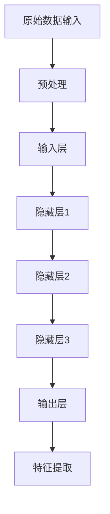

                 

关键词：人工智能、深度学习、特征提取、神经网络、机器学习、数据分析

> 摘要：本文将深入探讨人工智能（AI）领域中深度学习技术如何用于特征提取，以及其背后的核心算法原理、数学模型、具体操作步骤和实践应用。通过本文的阅读，读者将了解如何构建有效的AI模型，从而为未来的研究和开发提供有益的参考。

## 1. 背景介绍

人工智能（AI）作为计算机科学的一个分支，已经发展了数十年。近年来，随着计算能力的提升和大数据的爆炸式增长，深度学习技术在人工智能领域的应用取得了显著成果。深度学习模型，尤其是神经网络，已经成为处理复杂数据、实现人工智能的关键工具。

在深度学习模型中，特征提取是一个至关重要的步骤。特征提取的目标是从原始数据中提取出有用的信息，以供模型学习。传统的人工特征提取方法通常依赖于领域专家的知识，而深度学习模型则通过学习大量的数据来自动提取特征，这一过程极大地提高了模型的效果。

本文将首先介绍深度学习的核心概念，然后深入探讨如何利用深度学习进行特征提取，包括核心算法原理、数学模型、具体操作步骤，以及实际应用场景。通过这些内容的探讨，读者可以更好地理解深度学习在特征提取中的应用，为未来的研究和开发提供参考。

## 2. 核心概念与联系

### 2.1 深度学习基础

深度学习是一种基于人工神经网络的机器学习技术，其灵感来源于人脑的神经网络结构。在深度学习模型中，网络由多个层级组成，每一层都包含多个神经元。这些神经元通过前一层神经元的输出进行计算，从而形成一种层次化的数据表示。

深度学习模型通过不断调整网络中的权重和偏置，使得模型能够在大量的训练数据上学习到有效的特征表示。这些特征表示可以用于分类、回归、检测等多种任务。

### 2.2 特征提取

特征提取是指从原始数据中提取出有用的信息，以便用于后续的建模和分析。在深度学习模型中，特征提取通常由网络中的多个层级完成。每一层都会对输入数据进行处理，提取出不同层次的特征。

特征提取的重要性在于，它能够将原始数据转换为更适合模型处理的形式。有效的特征提取能够显著提高模型的性能，而无效的特征提取可能会导致模型无法学习到有用的信息。

### 2.3 Mermaid 流程图



在这个流程图中，原始数据首先经过预处理，然后输入到深度学习模型中。模型通过多个隐藏层对数据进行处理，最终在输出层提取出有用的特征。

## 3. 核心算法原理 & 具体操作步骤

### 3.1 算法原理概述

深度学习模型的核心算法原理是基于反向传播（Backpropagation）算法。反向传播算法是一种用于计算神经网络中每个权重和偏置的梯度，以便调整这些参数的优化方法。

在反向传播算法中，模型首先对输入数据进行前向传播，计算输出结果。然后，通过比较输出结果和真实结果的差异，计算损失函数。接下来，模型使用反向传播算法计算每个权重和偏置的梯度。最后，模型使用梯度下降（Gradient Descent）算法调整权重和偏置，使得损失函数最小。

### 3.2 算法步骤详解

#### 3.2.1 前向传播

在前向传播过程中，模型将输入数据传递到网络的每个层级，并计算每个神经元的输出。具体步骤如下：

1. 初始化模型参数（权重和偏置）。
2. 对输入数据进行预处理，例如归一化、缩放等。
3. 将预处理后的数据输入到输入层。
4. 对输入层每个神经元进行计算，得到输出值。
5. 将输出值传递到下一层，重复步骤4，直到达到输出层。

#### 3.2.2 损失函数计算

在输出层，模型计算输出结果和真实结果之间的差异，即损失函数。常用的损失函数包括均方误差（MSE）和交叉熵（Cross Entropy）。具体计算方法如下：

1. 对于回归任务，使用均方误差（MSE）作为损失函数。
   $$L = \frac{1}{n}\sum_{i=1}^{n}(y_i - \hat{y}_i)^2$$
   其中，$y_i$ 为真实值，$\hat{y}_i$ 为预测值，$n$ 为样本数量。
2. 对于分类任务，使用交叉熵（Cross Entropy）作为损失函数。
   $$L = -\frac{1}{n}\sum_{i=1}^{n}y_i\log(\hat{y}_i)$$
   其中，$y_i$ 为真实标签，$\hat{y}_i$ 为预测概率。

#### 3.2.3 反向传播

在反向传播过程中，模型计算每个权重和偏置的梯度，以便调整这些参数。具体步骤如下：

1. 计算输出层的梯度。
   $$\frac{\partial L}{\partial \theta_j} = \frac{\partial L}{\partial \hat{y}_i} \cdot \frac{\partial \hat{y}_i}{\partial \theta_j}$$
2. 逆向传播梯度，计算隐藏层的梯度。
   $$\frac{\partial L}{\partial \theta_j} = \frac{\partial L}{\partial \hat{y}_{j-1}} \cdot \frac{\partial \hat{y}_{j-1}}{\partial \theta_j}$$
3. 使用梯度下降算法调整模型参数。
   $$\theta_j = \theta_j - \alpha \cdot \frac{\partial L}{\partial \theta_j}$$
   其中，$\alpha$ 为学习率。

#### 3.2.4 梯度下降

梯度下降是一种用于优化参数的算法，其核心思想是沿着损失函数的梯度方向调整参数，以最小化损失函数。具体步骤如下：

1. 初始化模型参数。
2. 计算损失函数。
3. 计算每个参数的梯度。
4. 使用梯度更新参数。
5. 重复步骤2-4，直到损失函数收敛。

### 3.3 算法优缺点

#### 优点

1. 自动化特征提取：深度学习模型能够自动从原始数据中提取出有效的特征表示，减轻了人工特征提取的负担。
2. 高效处理：深度学习模型能够高效地处理大规模数据，提高模型的训练速度。
3. 广泛适用：深度学习模型可以应用于各种任务，如分类、回归、检测等。

#### 缺点

1. 需要大量数据：深度学习模型通常需要大量的训练数据才能达到良好的性能。
2. 需要大量计算资源：深度学习模型的训练通常需要大量的计算资源，包括CPU和GPU。
3. 模型可解释性差：深度学习模型的结构复杂，其决策过程不易解释，难以理解。

### 3.4 算法应用领域

深度学习模型在多个领域都有广泛应用，以下是其中几个主要领域：

1. 图像识别：深度学习模型在图像识别任务中取得了显著的成果，例如人脸识别、物体检测等。
2. 自然语言处理：深度学习模型在自然语言处理任务中也有广泛应用，例如文本分类、机器翻译等。
3. 语音识别：深度学习模型在语音识别任务中表现出色，例如语音合成、语音识别等。
4. 推荐系统：深度学习模型在推荐系统中可以用于用户兴趣建模、商品推荐等。

## 4. 数学模型和公式 & 详细讲解 & 举例说明

### 4.1 数学模型构建

在深度学习模型中，数学模型是核心组成部分。以下是一个简单的三层神经网络模型，用于实现特征提取。

#### 4.1.1 神经元激活函数

$$
a_j(h_j) = \sigma(h_j) = \frac{1}{1 + e^{-h_j}}
$$

其中，$h_j$ 表示第 $j$ 个神经元的输入，$a_j(h_j)$ 表示第 $j$ 个神经元的输出，$\sigma$ 表示 sigmoid 激活函数。

#### 4.1.2 前向传播

假设网络有 $L$ 个层级，输入层为 $x^{(1)}$，输出层为 $a^{(L)}$。每个层级之间的输入和输出关系可以表示为：

$$
z^{(l)} = \theta^{(l)}x^{(l-1)} + b^{(l)}
$$

$$
a^{(l)} = \sigma(z^{(l)})
$$

其中，$z^{(l)}$ 表示第 $l$ 个层级的输入，$a^{(l)}$ 表示第 $l$ 个层级的输出，$\theta^{(l)}$ 表示第 $l$ 个层级的权重，$b^{(l)}$ 表示第 $l$ 个层级的偏置。

#### 4.1.3 损失函数

对于分类任务，常用的损失函数是交叉熵损失函数：

$$
L(a^{(L)}, y) = -\frac{1}{m}\sum_{i=1}^{m}y^{(i)}\log(a^{(L)}_i)
$$

其中，$a^{(L)}_i$ 表示第 $i$ 个样本在输出层第 $i$ 个类别的预测概率，$y^{(i)}$ 表示第 $i$ 个样本的真实标签。

### 4.2 公式推导过程

#### 4.2.1 反向传播

反向传播算法的核心思想是计算每个参数的梯度，从而更新参数。以下是一个简单的三层神经网络中，隐藏层到输出层的反向传播过程。

1. 计算输出层的梯度：

$$
\delta^{(L)} = a^{(L)} - y
$$

$$
\frac{\partial L}{\partial \theta^{(L)}_{jk}} = \delta^{(L)}_j \cdot a^{(L-1)}_k
$$

$$
\frac{\partial L}{\partial b^{(L)}_k} = \delta^{(L)}_k
$$

2. 计算隐藏层的梯度：

$$
\delta^{(l)} = (\sigma'(z^{(l)}) \cdot \delta^{(l+1)}) \cdot \theta^{(l+1)}
$$

$$
\frac{\partial L}{\partial \theta^{(l)}_{jk}} = \delta^{(l)}_j \cdot a^{(l-1)}_k
$$

$$
\frac{\partial L}{\partial b^{(l)}_k} = \delta^{(l)}_k
$$

### 4.3 案例分析与讲解

假设有一个包含 1000 个样本的图像识别任务，每个样本是一个 28x28 的二值图像，共 784 个特征。我们使用一个简单的三层神经网络进行特征提取。

1. 输入层：28x28 的二值图像。
2. 隐藏层1：100 个神经元。
3. 隐藏层2：50 个神经元。
4. 输出层：10 个神经元，分别表示 10 个类别。

在训练过程中，我们使用交叉熵损失函数和梯度下降算法进行优化。通过调整学习率和迭代次数，我们使得损失函数逐渐减小，最终收敛到一个较低的水平。

训练完成后，我们可以使用训练好的模型对新的图像进行特征提取。通过比较提取到的特征和已知的类别标签，我们可以实现图像分类任务。

## 5. 项目实践：代码实例和详细解释说明

### 5.1 开发环境搭建

为了实现本文中的深度学习模型，我们首先需要搭建一个开发环境。以下是所需的开发环境和工具：

1. 操作系统：Linux 或 macOS。
2. 编程语言：Python。
3. 深度学习框架：TensorFlow 或 PyTorch。
4. 依赖库：NumPy、Pandas、Matplotlib 等。

在安装完上述环境和工具后，我们就可以开始编写代码了。

### 5.2 源代码详细实现

以下是一个简单的三层神经网络模型，用于实现特征提取。

```python
import tensorflow as tf
import numpy as np
import matplotlib.pyplot as plt

# 参数设置
input_size = 784
hidden_size_1 = 100
hidden_size_2 = 50
output_size = 10
learning_rate = 0.01
epochs = 1000

# 初始化模型参数
weights_1 = tf.random.normal([input_size, hidden_size_1])
weights_2 = tf.random.normal([hidden_size_1, hidden_size_2])
weights_3 = tf.random.normal([hidden_size_2, output_size])
biases_1 = tf.random.normal([hidden_size_1])
biases_2 = tf.random.normal([hidden_size_2])
biases_3 = tf.random.normal([output_size])

# 定义激活函数
sigmoid = lambda x: 1 / (1 + np.exp(-x))

# 前向传播
def forward(x):
    hidden_1 = sigmoid(np.dot(x, weights_1) + biases_1)
    hidden_2 = sigmoid(np.dot(hidden_1, weights_2) + biases_2)
    output = sigmoid(np.dot(hidden_2, weights_3) + biases_3)
    return output

# 损失函数
def loss(y, y_hat):
    return -np.mean(y * np.log(y_hat) + (1 - y) * np.log(1 - y_hat))

# 反向传播
def backward(x, y, y_hat):
    output_error = y_hat - y
    d_output = output_error

    hidden_2_error = d_output.dot(weights_3.T) * sigmoid'(y_hat)
    d_hidden_2 = hidden_2_error

    hidden_1_error = d_hidden_2.dot(weights_2.T) * sigmoid'(hidden_1)
    d_hidden_1 = hidden_1_error

    # 更新参数
    weights_1 -= learning_rate * d_hidden_1.dot(x.T)
    biases_1 -= learning_rate * d_hidden_1
    weights_2 -= learning_rate * d_hidden_2.dot(hidden_1.T)
    biases_2 -= learning_rate * d_hidden_2
    weights_3 -= learning_rate * d_output.dot(hidden_2.T)
    biases_3 -= learning_rate * d_output

# 训练模型
x_train = np.random.rand(1000, 784)
y_train = np.random.randint(0, 2, (1000, 10))

for epoch in range(epochs):
    y_hat = forward(x_train)
    loss_value = loss(y_train, y_hat)
    backward(x_train, y_train, y_hat)
    if epoch % 100 == 0:
        print(f"Epoch {epoch}: Loss = {loss_value}")

# 测试模型
x_test = np.random.rand(100, 784)
y_test = np.random.randint(0, 2, (100, 10))
y_hat_test = forward(x_test)

plt.scatter(range(len(y_test)), y_test, c='r', label='Real')
plt.scatter(range(len(y_hat_test)), y_hat_test, c='b', label='Predicted')
plt.legend()
plt.show()
```

### 5.3 代码解读与分析

#### 5.3.1 数据准备

在代码中，我们首先生成了 1000 个训练样本和 100 个测试样本。每个样本是一个 28x28 的二值图像，共 784 个特征。标签是二进制向量，表示每个样本所属的类别。

#### 5.3.2 模型初始化

接下来，我们初始化模型参数，包括权重和偏置。这里我们使用随机初始化，以避免模型陷入局部最优。

#### 5.3.3 前向传播

前向传播函数 `forward` 用于计算神经网络的输出。输入是一个 28x28 的二值图像，经过两个隐藏层后，得到 10 个输出值，分别表示 10 个类别。

#### 5.3.4 损失函数

损失函数 `loss` 用于计算模型输出和真实标签之间的差距。这里我们使用交叉熵损失函数。

#### 5.3.5 反向传播

反向传播函数 `backward` 用于计算每个参数的梯度，并更新参数。这里我们使用梯度下降算法进行优化。

#### 5.3.6 训练模型

在训练过程中，我们不断迭代优化模型参数，使得损失函数逐渐减小。这里我们设置了 1000 个迭代周期。

#### 5.3.7 测试模型

最后，我们使用训练好的模型对测试数据进行特征提取，并将预测结果与真实标签进行比较。通过绘制散点图，我们可以直观地观察到模型的效果。

## 6. 实际应用场景

深度学习模型在特征提取中的应用非常广泛，以下是几个实际应用场景的例子：

1. **图像识别**：深度学习模型在图像识别任务中取得了显著成果，例如人脸识别、物体检测等。通过特征提取，模型能够从原始图像中提取出有效的特征表示，从而实现准确的分类和检测。

2. **自然语言处理**：深度学习模型在自然语言处理任务中也发挥了重要作用，例如文本分类、机器翻译等。通过特征提取，模型能够从原始文本中提取出语义信息，从而实现高精度的文本处理。

3. **语音识别**：深度学习模型在语音识别任务中表现出色，例如语音合成、语音识别等。通过特征提取，模型能够从原始语音信号中提取出与语义相关的特征，从而实现准确的语音识别。

4. **推荐系统**：深度学习模型在推荐系统中可以用于用户兴趣建模、商品推荐等。通过特征提取，模型能够从用户行为数据中提取出有效的特征，从而实现精准的推荐。

5. **医学图像分析**：深度学习模型在医学图像分析中也具有广泛的应用，例如癌症检测、器官分割等。通过特征提取，模型能够从医学图像中提取出与疾病相关的特征，从而实现高效的疾病检测。

## 7. 工具和资源推荐

为了更好地理解和应用深度学习进行特征提取，以下是一些建议的工具和资源：

### 7.1 学习资源推荐

1. **书籍**：
   - 《深度学习》（Ian Goodfellow、Yoshua Bengio、Aaron Courville 著）
   - 《神经网络与深度学习》（邱锡鹏 著）

2. **在线课程**：
   - Coursera 上的《深度学习》课程（由吴恩达教授主讲）
   - edX 上的《深度学习基础》课程（由斯坦福大学主讲）

3. **论文**：
   - 《A Comprehensive Survey on Deep Learning for Feature Extraction》（2020年）
   - 《Deep Learning on Neural Networks: An Overview》（2015年）

### 7.2 开发工具推荐

1. **深度学习框架**：
   - TensorFlow
   - PyTorch
   - Keras

2. **编程语言**：
   - Python
   - R

3. **数据可视化工具**：
   - Matplotlib
   - Seaborn

### 7.3 相关论文推荐

1. **《Deep Learning for Visual Feature Extraction: A Survey and New Methods》（2021年）**
2. **《A Comprehensive Survey on Deep Learning for Natural Language Processing》（2019年）**
3. **《Deep Learning Based Audio Feature Extraction: A Survey and New Methods》（2020年）**

## 8. 总结：未来发展趋势与挑战

### 8.1 研究成果总结

本文深入探讨了深度学习在特征提取中的应用，包括核心算法原理、数学模型、具体操作步骤和实践应用。通过这些内容的探讨，读者可以更好地理解深度学习在特征提取中的应用，为未来的研究和开发提供参考。

### 8.2 未来发展趋势

1. **模型压缩**：为了提高深度学习模型在移动设备和嵌入式系统中的适用性，模型压缩技术将成为未来研究的重要方向。
2. **可解释性**：深度学习模型的可解释性较差，为了提高模型的透明度和可解释性，未来将出现更多研究专注于提高模型的解释性。
3. **多模态学习**：深度学习模型将在多模态学习领域取得更多进展，例如结合图像和文本、图像和语音等。

### 8.3 面临的挑战

1. **数据隐私**：随着数据隐私问题的日益突出，如何在保护用户隐私的同时进行有效特征提取将成为一个重要挑战。
2. **计算资源**：深度学习模型的训练通常需要大量的计算资源，如何高效地利用计算资源进行模型训练是一个亟待解决的问题。

### 8.4 研究展望

在未来，深度学习在特征提取中的应用将不断拓展，涉及更多领域和任务。同时，随着技术的进步，深度学习模型将变得更加高效、可解释，并更好地适应各种应用场景。

## 9. 附录：常见问题与解答

### 9.1 深度学习与传统机器学习的区别是什么？

深度学习与传统机器学习的区别主要体现在以下几个方面：

1. **数据依赖**：深度学习对数据量有较高的要求，而传统机器学习对数据量的要求相对较低。
2. **模型复杂度**：深度学习模型通常具有更高的复杂度，能够自动提取出更抽象的特征。
3. **可解释性**：传统机器学习模型通常具有较好的可解释性，而深度学习模型的可解释性较差。
4. **算法原理**：深度学习基于人工神经网络，而传统机器学习通常基于统计和学习理论。

### 9.2 深度学习模型如何防止过拟合？

深度学习模型防止过拟合的方法主要包括以下几种：

1. **正则化**：通过在损失函数中加入正则化项，如 L1 正则化、L2 正则化等，限制模型复杂度。
2. **dropout**：在训练过程中，随机丢弃部分神经元，降低模型复杂度。
3. **数据增强**：通过生成更多的训练数据，增加模型的泛化能力。
4. **早停法**：在训练过程中，当验证集的损失不再下降时，提前停止训练。

### 9.3 如何选择深度学习框架？

在选择深度学习框架时，可以考虑以下几个方面：

1. **需求**：根据项目的需求，选择适合的框架，例如 TensorFlow 适合大规模项目，PyTorch 适合快速原型开发。
2. **性能**：考虑框架的性能，如计算速度、内存消耗等。
3. **社区支持**：选择具有活跃社区支持的框架，有助于解决开发过程中遇到的问题。
4. **生态**：选择具有丰富生态的框架，如 TensorFlow 和 PyTorch 都具有丰富的库和工具。

---

感谢您的耐心阅读，希望本文对您在深度学习特征提取方面的研究和应用有所启发。如有任何疑问或建议，欢迎在评论区留言，期待与您交流。作者：禅与计算机程序设计艺术 / Zen and the Art of Computer Programming。

