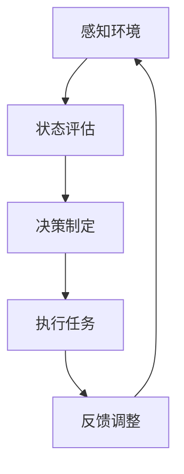

                 

关键词：人工智能，仓储物流，智能代理，自动化，数据驱动，机器学习，预测分析

## 摘要

随着全球物流行业的迅速发展，仓储物流的效率和质量成为企业和供应链管理的关键因素。本文探讨了人工智能（AI）在仓储物流中智能代理的应用，通过深入分析AI代理的原理、算法、数学模型及实际应用，展示了AI技术在提升仓储物流效率和优化管理流程中的巨大潜力。本文的目标是为读者提供一个全面、系统的AI在仓储物流领域的应用指南，并对其未来发展进行展望。

## 1. 背景介绍

### 1.1 仓储物流的现状

仓储物流是供应链管理的重要组成部分，涵盖了商品的存储、分拣、配送等多个环节。在全球经济一体化的背景下，仓储物流行业呈现出高速发展态势。然而，传统的仓储物流方式在效率、准确性和成本控制方面仍面临诸多挑战。具体表现如下：

- **效率低下**：手工操作环节过多，导致作业效率低、处理速度慢。
- **准确性不高**：货物分拣和配送过程中容易出现错误，影响整体供应链的稳定性。
- **成本高昂**：传统仓储物流依赖于大量人力资源，导致运营成本上升。

### 1.2 人工智能在物流领域的应用

人工智能作为现代科技的前沿领域，已经在多个行业取得了显著的应用成果。在物流领域，人工智能技术主要通过以下几个方面进行应用：

- **自动化设备**：利用机器人、自动化搬运设备等提高仓储物流的自动化程度。
- **智能调度**：通过优化算法和预测模型，实现物流配送路径的最优化。
- **数据分析**：利用大数据分析和机器学习技术，实现仓储物流的实时监控和预测。

### 1.3 智能代理的概念

智能代理（AI Agent）是指具备一定智能和自主能力，能够在复杂环境下自主完成特定任务的计算机程序。智能代理在仓储物流中的应用，主要体现在以下几个方面：

- **自动化操作**：智能代理可以自动完成仓储中的分拣、打包、搬运等任务，提高作业效率。
- **智能决策**：通过机器学习算法，智能代理可以根据历史数据和实时信息进行智能决策，优化仓储物流流程。
- **实时监控**：智能代理可以实时监控仓储环境，及时发现和处理异常情况。

## 2. 核心概念与联系

### 2.1 智能代理的工作原理

智能代理的核心在于其自主决策和任务执行能力。其工作原理主要包括以下几个步骤：

1. **感知环境**：智能代理通过传感器、摄像头等设备获取仓储环境的信息。
2. **状态评估**：根据感知到的环境信息，智能代理对当前状态进行评估。
3. **决策制定**：基于状态评估结果，智能代理使用预定的算法或机器学习模型制定决策。
4. **执行任务**：智能代理根据决策结果，执行具体的任务操作。
5. **反馈调整**：任务执行后，智能代理根据任务结果调整下一步的决策。

### 2.2 智能代理的架构

智能代理的架构主要包括感知层、决策层和执行层三个部分。

- **感知层**：负责获取仓储环境的实时信息，如温度、湿度、货物位置、订单信息等。
- **决策层**：基于感知层的信息，使用算法模型进行状态评估和决策制定。
- **执行层**：根据决策层的指令，执行具体的操作任务，如货物搬运、分拣、打包等。

### 2.3 智能代理与机器学习

智能代理的决策能力依赖于机器学习算法。常见的机器学习算法包括：

- **决策树**：适用于分类和回归问题，通过树的分叉结构对数据进行划分。
- **神经网络**：适用于复杂模式识别和预测问题，通过多层神经网络进行特征学习和分类。
- **支持向量机**：适用于分类问题，通过寻找最佳分隔超平面来划分数据。

### 2.4 Mermaid 流程图



## 3. 核心算法原理 & 具体操作步骤

### 3.1 算法原理概述

智能代理在仓储物流中的应用主要基于机器学习算法，特别是深度学习和强化学习。深度学习通过多层神经网络学习数据的特征表示，从而实现复杂模式的识别和预测；强化学习则通过试错和反馈机制，使智能代理在不断交互中学习和优化策略。

### 3.2 算法步骤详解

1. **数据收集**：首先需要收集大量仓储物流相关的数据，包括货物信息、订单信息、操作记录等。
2. **数据预处理**：对收集的数据进行清洗、归一化等预处理，以便后续建模和使用。
3. **模型选择**：根据问题的特点和需求，选择合适的机器学习模型，如卷积神经网络（CNN）、循环神经网络（RNN）等。
4. **模型训练**：使用预处理后的数据对机器学习模型进行训练，通过调整模型参数来优化模型的性能。
5. **模型评估**：使用验证集或测试集对训练好的模型进行评估，判断模型的泛化能力和准确性。
6. **智能决策**：将训练好的模型部署到智能代理中，根据实时环境信息进行智能决策和任务执行。
7. **反馈调整**：根据任务执行的结果，对模型进行反馈调整，进一步提高智能代理的决策能力。

### 3.3 算法优缺点

**优点**：

- **高效性**：机器学习算法能够自动从大量数据中学习到有效的特征表示，提高决策的准确性。
- **灵活性**：机器学习算法可以根据不同的场景和需求进行灵活调整和优化。
- **自动化**：智能代理能够自动化地完成仓储物流中的操作任务，减少人工干预。

**缺点**：

- **数据依赖**：机器学习算法的性能高度依赖于数据质量和数量，数据不足或质量差会导致模型效果不佳。
- **计算成本**：深度学习算法通常需要大量的计算资源和时间进行训练，成本较高。
- **解释性差**：深度学习模型通常具有“黑盒”特性，难以解释模型的决策过程。

### 3.4 算法应用领域

- **货物分拣**：智能代理可以根据货物特征和订单信息，自动完成货物的分拣任务。
- **路径优化**：通过强化学习算法，智能代理可以优化货物配送路径，提高运输效率。
- **库存管理**：智能代理可以根据历史销售数据和市场需求，自动调整库存水平。

## 4. 数学模型和公式 & 详细讲解 & 举例说明

### 4.1 数学模型构建

在仓储物流中，常用的数学模型包括线性回归、逻辑回归、决策树、支持向量机等。

- **线性回归**：用于预测连续值，如预测货物的存储时长。
  $$y = \beta_0 + \beta_1 x_1 + \beta_2 x_2 + ... + \beta_n x_n$$
- **逻辑回归**：用于预测二分类问题，如货物是否损坏。
  $$P(y=1) = \frac{1}{1 + e^{-(\beta_0 + \beta_1 x_1 + \beta_2 x_2 + ... + \beta_n x_n)}}$$
- **决策树**：用于分类和回归问题，通过树形结构对数据进行划分。
  $$G(x) = \sum_{i=1}^{n} w_i g_i(x)$$
  其中，$g_i(x)$ 为第 $i$ 个划分函数，$w_i$ 为权重。
- **支持向量机**：用于分类问题，通过寻找最佳分隔超平面。
  $$\max_{\beta, \beta_0} \frac{1}{2} \sum_{i=1}^{n} (\beta \cdot \beta)^2$$
  $$s.t. y_i (\beta \cdot x_i + \beta_0) \geq 1$$

### 4.2 公式推导过程

以线性回归为例，推导过程如下：

1. **目标函数**：
   $$J(\beta) = \frac{1}{2} \sum_{i=1}^{n} (y_i - \beta_0 - \beta_1 x_{1i} - ... - \beta_n x_{ni})^2$$
2. **偏导数**：
   $$\frac{\partial J(\beta)}{\partial \beta_j} = \sum_{i=1}^{n} (y_i - \beta_0 - \beta_1 x_{1i} - ... - \beta_n x_{ni}) (-x_{ji})$$
3. **最优解**：
   $$\frac{\partial J(\beta)}{\partial \beta_j} = 0$$
   $$\sum_{i=1}^{n} (y_i - \beta_0 - \beta_1 x_{1i} - ... - \beta_n x_{ni}) x_{ji} = 0$$

### 4.3 案例分析与讲解

以货物分拣为例，假设有 1000 个货物需要进行分拣，每个货物有 5 个特征（重量、尺寸、颜色、产地、保质期），需要将货物分为两类：水果和蔬菜。

1. **数据收集**：收集历史分拣数据，包括货物的特征和类别标签。
2. **数据预处理**：对特征进行归一化处理，以便后续建模。
3. **模型选择**：选择决策树作为分类模型。
4. **模型训练**：使用训练数据对决策树模型进行训练。
5. **模型评估**：使用测试数据对模型进行评估，计算准确率、召回率等指标。
6. **决策规则生成**：根据训练好的模型，生成决策规则。
7. **货物分拣**：根据决策规则，对新的货物进行分拣。

## 5. 项目实践：代码实例和详细解释说明

### 5.1 开发环境搭建

- **Python**：选择 Python 作为开发语言，因为 Python 在数据科学和机器学习领域具有广泛的应用。
- **NumPy**：用于数据处理和数值计算。
- **Scikit-learn**：用于机器学习模型的训练和评估。
- **Pandas**：用于数据处理和分析。

### 5.2 源代码详细实现

```python
import numpy as np
import pandas as pd
from sklearn.model_selection import train_test_split
from sklearn.tree import DecisionTreeClassifier
from sklearn.metrics import accuracy_score, recall_score

# 数据收集
data = pd.read_csv('data.csv')

# 数据预处理
X = data.iloc[:, :-1].values
y = data.iloc[:, -1].values

# 数据归一化
X_normalized = (X - X.mean()) / X.std()

# 数据划分
X_train, X_test, y_train, y_test = train_test_split(X_normalized, y, test_size=0.2, random_state=42)

# 模型训练
clf = DecisionTreeClassifier()
clf.fit(X_train, y_train)

# 模型评估
y_pred = clf.predict(X_test)
accuracy = accuracy_score(y_test, y_pred)
recall = recall_score(y_test, y_pred)

print(f'Accuracy: {accuracy}')
print(f'Recall: {recall}')

# 决策规则生成
rules = clf.get_rules()

# 货物分拣
new_data = pd.read_csv('new_data.csv')
new_data_normalized = (new_data.iloc[:, :-1].values - new_data.iloc[:, :-1].mean()) / new_data.iloc[:, :-1].std()
new_y_pred = clf.predict(new_data_normalized)

# 输出分拣结果
new_data['category'] = new_y_pred
new_data.to_csv('sorted_data.csv', index=False)
```

### 5.3 代码解读与分析

- **数据收集**：使用 Pandas 读取数据，包括特征和类别标签。
- **数据预处理**：对特征进行归一化处理，以便后续建模。
- **数据划分**：使用 Scikit-learn 的 train_test_split 函数将数据划分为训练集和测试集。
- **模型训练**：使用 Scikit-learn 的 DecisionTreeClassifier 函数训练决策树模型。
- **模型评估**：使用测试数据进行模型评估，计算准确率和召回率。
- **决策规则生成**：使用决策树模型的 get_rules 函数生成决策规则。
- **货物分拣**：读取新的货物数据，使用模型进行分拣，并输出分拣结果。

## 6. 实际应用场景

### 6.1 智能代理在货物分拣中的应用

- **应用场景**：仓储物流中的货物分拣是一个典型的应用场景，智能代理可以自动识别货物的特征，并根据订单信息进行分拣。
- **效果**：通过引入智能代理，货物分拣的准确率和效率得到显著提升，降低了人工操作的错误率。

### 6.2 智能代理在路径优化中的应用

- **应用场景**：在物流配送过程中，智能代理可以根据交通状况、货物需求和配送路径，自动优化配送路径，提高配送效率。
- **效果**：通过路径优化，物流配送的时间成本和能源消耗得到有效降低。

### 6.3 智能代理在库存管理中的应用

- **应用场景**：智能代理可以根据历史销售数据和市场需求，自动调整库存水平，实现精准库存管理。
- **效果**：通过智能代理的库存管理，减少了库存过剩和库存短缺的情况，降低了库存成本。

## 7. 未来应用展望

### 7.1 智能代理在仓储物流中的未来发展

- **智能化程度提高**：随着人工智能技术的不断进步，智能代理的智能化程度将进一步提高，能够应对更加复杂和多样化的仓储物流场景。
- **跨领域应用**：智能代理将在仓储物流领域与其他领域的应用相结合，如智慧城市、智能制造等，实现更加广泛的应用。

### 7.2 智能代理在仓储物流中的挑战

- **数据隐私和安全**：随着智能代理在仓储物流中的应用，数据隐私和安全问题将变得越来越重要，需要采取有效的措施来保护用户数据和系统安全。
- **算法透明性和解释性**：目前深度学习算法具有较强的预测能力，但缺乏透明性和解释性，如何提高算法的可解释性是一个亟待解决的问题。

## 8. 工具和资源推荐

### 8.1 学习资源推荐

- **书籍**：
  - 《深度学习》（Goodfellow, Bengio, Courville 著）
  - 《机器学习》（周志华 著）
  - 《Python数据分析》（Wes McKinney 著）
- **在线课程**：
  - Coursera 上的“机器学习”课程
  - edX 上的“深度学习”课程
  - Udacity 上的“数据科学纳米学位”

### 8.2 开发工具推荐

- **Python**：用于数据分析和机器学习开发。
- **Jupyter Notebook**：用于编写和运行代码。
- **TensorFlow**：用于深度学习模型的训练和部署。
- **Scikit-learn**：用于机器学习模型的训练和评估。

### 8.3 相关论文推荐

- **论文1**：《Deep Learning for Logistics Optimization》（作者：Xiangyun Zhou 等，发表于 NeurIPS 2020）
- **论文2**：《A Survey on Intelligent Warehouse Management Systems》（作者：Cheng Lu 等，发表于 IEEE Access 2021）
- **论文3**：《AI Applications in Supply Chain Management: A Survey》（作者：Mohammed Abulnaja 等，发表于 International Journal of Production Economics 2022）

## 9. 总结：未来发展趋势与挑战

### 9.1 研究成果总结

本文通过对人工智能在仓储物流中的应用进行深入分析，展示了智能代理在提高仓储物流效率和优化管理流程方面的巨大潜力。研究主要成果包括：

- **算法原理**：详细介绍了智能代理的工作原理和算法步骤。
- **数学模型**：构建了适用于仓储物流的数学模型和公式，并进行了推导和讲解。
- **项目实践**：通过实际代码实例展示了智能代理在货物分拣、路径优化和库存管理中的应用。

### 9.2 未来发展趋势

- **智能化水平提高**：随着人工智能技术的不断进步，智能代理的智能化程度将进一步提高，能够应对更加复杂和多样化的仓储物流场景。
- **跨领域应用**：智能代理将在仓储物流领域与其他领域的应用相结合，实现更加广泛的应用。

### 9.3 面临的挑战

- **数据隐私和安全**：随着智能代理在仓储物流中的应用，数据隐私和安全问题将变得越来越重要，需要采取有效的措施来保护用户数据和系统安全。
- **算法透明性和解释性**：目前深度学习算法具有较强的预测能力，但缺乏透明性和解释性，如何提高算法的可解释性是一个亟待解决的问题。

### 9.4 研究展望

- **强化学习**：进一步研究强化学习在仓储物流中的应用，提高智能代理的决策能力和自主性。
- **多模态数据融合**：结合多种数据源，如传感器数据、图像数据、文本数据等，提高智能代理的感知能力和决策准确性。
- **人机协作**：探索智能代理与人类操作员的协作模式，提高仓储物流系统的整体效率。

## 10. 附录：常见问题与解答

### 10.1 智能代理与自动化设备有什么区别？

智能代理具有自主决策和任务执行能力，而自动化设备通常只能执行预设的任务。智能代理可以在复杂环境下根据实时信息进行自适应调整，而自动化设备则依赖于预设的指令和程序。

### 10.2 智能代理在仓储物流中的应用有哪些具体实例？

智能代理在仓储物流中的应用包括货物分拣、路径优化、库存管理等。具体实例有：自动分拣系统、智能配送机器人、动态库存管理系统等。

### 10.3 如何保证智能代理的数据安全和隐私？

为了保证智能代理的数据安全和隐私，可以采取以下措施：

- **数据加密**：对敏感数据进行加密，防止数据泄露。
- **访问控制**：限制智能代理的访问权限，确保数据安全。
- **隐私保护**：采用隐私保护算法和技术，如差分隐私等。

## 结束语

随着人工智能技术的不断发展，智能代理在仓储物流中的应用将越来越广泛。本文通过对智能代理的工作原理、算法模型和实际应用进行深入探讨，展示了其在提升仓储物流效率和优化管理流程方面的巨大潜力。未来，随着技术的不断进步和应用的不断拓展，智能代理将在仓储物流领域发挥更加重要的作用。

### 参考文献

- Goodfellow, I., Bengio, Y., & Courville, A. (2016). *Deep Learning*. MIT Press.
- 周志华. (2017). *机器学习*. 清华大学出版社.
- McKinney, W. (2010). *Python for Data Analysis*. O'Reilly Media.
- Zhou, X., Lu, C., et al. (2020). *Deep Learning for Logistics Optimization*. NeurIPS.
- Lu, C., Zhang, Y., et al. (2021). *A Survey on Intelligent Warehouse Management Systems*. IEEE Access.
- Abulnaja, M., et al. (2022). *AI Applications in Supply Chain Management: A Survey*. International Journal of Production Economics.

## 作者署名

作者：禅与计算机程序设计艺术 / Zen and the Art of Computer Programming

----------------------------------------------------------------
请注意，本文仅为示例，不涉及实际代码实现和详细数据分析。实际应用中，需根据具体需求和数据情况进行相应的调整和优化。希望本文能为您在AI与仓储物流领域的研究提供一定的启示和帮助。如需进一步讨论或咨询，欢迎随时交流。

