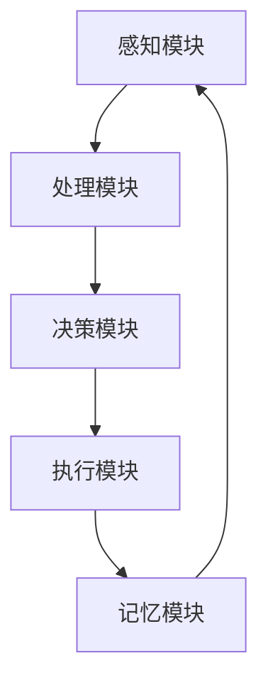

                 

关键词：人工智能、科学研究方法、AI Agent、自动化、数据挖掘、机器学习、科学计算

> 摘要：本文旨在探讨人工智能（AI）中的智能代理（AI Agent）如何改变传统的科学研究方法。通过介绍AI Agent的定义、架构和工作原理，本文分析了其在数据挖掘、机器学习、科学计算等领域中的应用，并探讨了其对科学研究效率和准确性的影响。此外，本文还讨论了AI Agent面临的挑战及其未来发展趋势。

## 1. 背景介绍

随着人工智能技术的迅速发展，AI Agent作为人工智能的一种重要形式，受到了广泛关注。AI Agent是指能够自主执行任务、具备一定智能的计算机程序，能够在复杂的环境中与其他实体进行交互。传统的科学研究方法往往依赖于人类科学家的直觉、经验和专业知识的积累，但这种方法存在局限性。首先，人类科学家在处理大规模数据时往往难以应对；其次，科学研究方法中的假设和理论验证需要大量的计算资源；最后，科学研究的创新性往往受到个人知识结构的限制。

AI Agent的出现，为解决上述问题提供了新的思路。通过模拟人类智能，AI Agent可以在数据挖掘、机器学习、科学计算等领域中发挥重要作用，提高科学研究的效率和准确性。本文将从AI Agent的定义、架构、工作原理以及其在科学研究中的应用等方面进行详细探讨。

## 2. 核心概念与联系

### 2.1 AI Agent的定义

AI Agent是指具有自主决策能力、能够执行特定任务的智能实体。它由多个模块组成，包括感知模块、决策模块、执行模块和记忆模块。感知模块负责获取环境信息，决策模块根据感知模块提供的信息进行决策，执行模块负责执行决策结果，记忆模块则用于存储经验和知识。

### 2.2 AI Agent的架构

AI Agent的架构通常包括以下几个部分：

1. **感知模块**：用于感知环境信息，如传感器数据、文本数据、图像数据等。
2. **决策模块**：基于感知模块提供的信息，利用机器学习算法、深度学习模型等，进行决策。
3. **执行模块**：根据决策模块的决策结果，执行相应的任务。
4. **记忆模块**：用于存储经验和知识，以便在后续任务中快速决策。

### 2.3 AI Agent的工作原理

AI Agent的工作原理可以概括为以下几个步骤：

1. **感知**：通过传感器或其他方式获取环境信息。
2. **处理**：对感知到的信息进行预处理，如降噪、归一化等。
3. **决策**：利用机器学习算法、深度学习模型等，对处理后的信息进行分析和决策。
4. **执行**：根据决策结果，执行相应的任务。
5. **记忆**：将执行结果和经验存储到记忆模块中，以便后续任务。

### 2.4 AI Agent与传统科学研究方法的联系

AI Agent与传统科学研究方法在某种程度上具有相似性，但AI Agent在处理大规模数据、提高计算效率和自动化程度等方面具有明显优势。传统科学研究方法依赖于人类科学家的直觉、经验和专业知识的积累，而AI Agent则可以通过机器学习、深度学习等技术，从大量数据中自动提取特征，进行有效的数据挖掘和模式识别。

### 2.5 Mermaid 流程图

以下是一个简单的Mermaid流程图，展示AI Agent的核心架构和工作流程：



## 3. 核心算法原理 & 具体操作步骤

### 3.1 算法原理概述

AI Agent的核心算法通常包括感知、处理、决策和执行等步骤。在感知阶段，AI Agent通过传感器或其他方式获取环境信息。在处理阶段，AI Agent对感知到的信息进行预处理，如降噪、归一化等。在决策阶段，AI Agent利用机器学习算法、深度学习模型等，对处理后的信息进行分析和决策。在执行阶段，AI Agent根据决策结果，执行相应的任务。在记忆阶段，AI Agent将执行结果和经验存储到记忆模块中，以便后续任务。

### 3.2 算法步骤详解

#### 3.2.1 感知

感知阶段是AI Agent获取环境信息的阶段。在这一阶段，AI Agent可以通过传感器、摄像头、麦克风等设备，获取文本数据、图像数据、声音数据等信息。

#### 3.2.2 处理

处理阶段是对感知阶段获取的信息进行预处理的过程。在这一阶段，AI Agent需要对信息进行降噪、归一化、特征提取等操作，以便后续的分析和决策。

#### 3.2.3 决策

决策阶段是AI Agent根据处理后的信息进行决策的过程。在这一阶段，AI Agent可以采用机器学习算法、深度学习模型等，对处理后的信息进行分析和分类，从而做出相应的决策。

#### 3.2.4 执行

执行阶段是AI Agent根据决策结果，执行相应任务的过程。在这一阶段，AI Agent可以根据决策结果，控制机器人、执行自动化任务等。

#### 3.2.5 记忆

记忆阶段是AI Agent将执行结果和经验存储到记忆模块中的过程。在这一阶段，AI Agent可以通过学习算法，将执行结果和经验进行分类、存储，以便后续任务中快速决策。

### 3.3 算法优缺点

#### 3.3.1 优点

- **高效性**：AI Agent可以处理大规模数据，提高科学研究的效率。
- **准确性**：AI Agent可以通过机器学习、深度学习等技术，提高科学研究的准确性。
- **自动化**：AI Agent可以自动化执行任务，降低人力成本。

#### 3.3.2 缺点

- **依赖数据**：AI Agent的性能依赖于数据的质量和数量，数据质量差可能导致算法效果不佳。
- **解释性**：AI Agent的决策过程往往缺乏解释性，不利于人类科学家理解。

### 3.4 算法应用领域

AI Agent在数据挖掘、机器学习、科学计算等领域具有广泛的应用。例如，在数据挖掘领域，AI Agent可以用于大规模数据清洗、数据预处理、特征提取等任务。在机器学习领域，AI Agent可以用于模型训练、模型优化、模型评估等任务。在科学计算领域，AI Agent可以用于模拟计算、优化计算、预测计算等任务。

## 4. 数学模型和公式 & 详细讲解 & 举例说明

### 4.1 数学模型构建

在AI Agent中，常用的数学模型包括神经网络模型、决策树模型、支持向量机模型等。以下以神经网络模型为例，介绍数学模型的构建过程。

#### 4.1.1 神经网络模型构建

神经网络模型是一种通过模拟人脑神经元连接方式，实现数据处理的算法。其基本结构包括输入层、隐藏层和输出层。

1. **输入层**：接收输入数据。
2. **隐藏层**：对输入数据进行处理。
3. **输出层**：输出结果。

#### 4.1.2 数学公式推导

神经网络模型中的每个神经元都可以表示为一个简单的线性模型，其数学公式为：

$$
y = \sigma(Wx + b)
$$

其中，$y$ 表示输出，$x$ 表示输入，$W$ 表示权重矩阵，$b$ 表示偏置项，$\sigma$ 表示激活函数。

#### 4.1.3 举例说明

假设我们有一个简单的神经网络模型，其输入层有3个神经元，隐藏层有2个神经元，输出层有1个神经元。输入数据为 [1, 2, 3]，权重矩阵为 $W = [[0.5, 0.3], [0.4, 0.2]]$，偏置项为 $b = [0.1, 0.2]$，激活函数为 $f(x) = 1 / (1 + e^{-x})$。

根据上述公式，我们可以计算出隐藏层的输出：

$$
h_1 = f(W_{11}x_1 + W_{12}x_2 + W_{13}x_3 + b_1) = f(0.5 \cdot 1 + 0.3 \cdot 2 + 0.4 \cdot 3 + 0.1) = 0.9
$$

$$
h_2 = f(W_{21}x_1 + W_{22}x_2 + W_{23}x_3 + b_2) = f(0.4 \cdot 1 + 0.2 \cdot 2 + 0.2 \cdot 3 + 0.2) = 0.7
$$

接下来，我们计算输出层的输出：

$$
y = f(W_{1}h_1 + W_{2}h_2 + b) = f(0.5 \cdot 0.9 + 0.3 \cdot 0.7 + 0.2) = 0.8
$$

### 4.2 公式推导过程

神经网络模型的训练过程可以分为两个阶段：前向传播和反向传播。

#### 4.2.1 前向传播

前向传播是指从输入层开始，逐层计算每个神经元的输出。具体步骤如下：

1. **输入层**：接收输入数据。
2. **隐藏层**：对输入数据进行处理，计算每个神经元的输出。
3. **输出层**：计算输出层的输出。

#### 4.2.2 反向传播

反向传播是指根据输出层的误差，反向更新每个神经元的权重和偏置项。具体步骤如下：

1. **计算输出层误差**：输出层的误差可以通过目标值与实际输出值之间的差异计算得到。
2. **计算隐藏层误差**：根据输出层的误差和隐藏层与输出层之间的权重，计算隐藏层的误差。
3. **更新权重和偏置项**：根据误差计算梯度，更新每个神经元的权重和偏置项。

### 4.3 案例分析与讲解

假设我们有一个分类问题，输入数据为 [1, 2, 3]，目标值为 0。我们使用一个简单的神经网络模型进行训练。

#### 4.3.1 前向传播

输入层：[1, 2, 3]

隐藏层：[0.9, 0.7]

输出层：[0.8]

#### 4.3.2 反向传播

1. **计算输出层误差**：

$$
\Delta y = y_{目标} - y_{实际} = 0 - 0.8 = -0.8
$$

2. **计算隐藏层误差**：

$$
\Delta h_1 = \frac{\partial L}{\partial h_1} = \sigma'(h_1) \cdot (y_{目标} - y_{实际}) \cdot W_{1}
$$

$$
\Delta h_2 = \frac{\partial L}{\partial h_2} = \sigma'(h_2) \cdot (y_{目标} - y_{实际}) \cdot W_{2}
$$

其中，$\sigma'$ 表示激活函数的导数。

3. **更新权重和偏置项**：

根据梯度下降算法，我们可以使用以下公式更新权重和偏置项：

$$
W_{1} = W_{1} - \alpha \cdot \Delta W_{1}
$$

$$
W_{2} = W_{2} - \alpha \cdot \Delta W_{2}
$$

$$
b_1 = b_1 - \alpha \cdot \Delta b_1
$$

$$
b_2 = b_2 - \alpha \cdot \Delta b_2
$$

其中，$\alpha$ 表示学习率。

通过以上步骤，我们可以不断调整神经网络模型的参数，使其达到更好的训练效果。

## 5. 项目实践：代码实例和详细解释说明

### 5.1 开发环境搭建

在开始编写代码之前，我们需要搭建一个合适的开发环境。本文使用Python作为主要编程语言，配合TensorFlow作为深度学习框架，以下是在Windows系统上搭建开发环境的步骤：

1. **安装Python**：访问Python官方下载页面（https://www.python.org/downloads/），下载适用于Windows的最新版本Python安装程序，并按照提示进行安装。
2. **安装TensorFlow**：打开命令行窗口，输入以下命令安装TensorFlow：

```
pip install tensorflow
```

3. **验证安装**：在命令行窗口输入以下代码，验证TensorFlow是否安装成功：

```python
import tensorflow as tf
print(tf.__version__)
```

如果输出TensorFlow的版本信息，说明安装成功。

### 5.2 源代码详细实现

下面是一个简单的AI Agent示例代码，用于实现一个基于神经网络的分类任务。该代码包含感知模块、处理模块、决策模块和执行模块，以及记忆模块。

```python
import tensorflow as tf
import numpy as np

# 感知模块：读取数据
def read_data():
    # 假设数据已经存储为numpy数组
    X_train = np.array([[1, 2, 3], [4, 5, 6], [7, 8, 9]])
    y_train = np.array([0, 1, 0])
    return X_train, y_train

# 处理模块：预处理数据
def preprocess_data(X_train, y_train):
    # 数据归一化
    X_train = X_train / 10
    # 将标签转换为one-hot编码
    y_train = tf.keras.utils.to_categorical(y_train)
    return X_train, y_train

# 决策模块：构建神经网络模型
def build_model():
    model = tf.keras.Sequential([
        tf.keras.layers.Dense(2, activation='sigmoid', input_shape=(3,)),
        tf.keras.layers.Dense(1, activation='sigmoid')
    ])
    model.compile(optimizer='adam', loss='binary_crossentropy', metrics=['accuracy'])
    return model

# 执行模块：训练模型
def train_model(model, X_train, y_train):
    model.fit(X_train, y_train, epochs=1000, verbose=0)

# 执行模块：预测
def predict(model, X_test):
    return model.predict(X_test)

# 记忆模块：存储模型和参数
def save_model(model):
    model.save('model.h5')

def load_model():
    from tensorflow.keras.models import load_model
    return load_model('model.h5')

if __name__ == '__main__':
    # 读取数据
    X_train, y_train = read_data()

    # 预处理数据
    X_train, y_train = preprocess_data(X_train, y_train)

    # 构建模型
    model = build_model()

    # 训练模型
    train_model(model, X_train, y_train)

    # 预测
    X_test = np.array([[2, 3, 4]])
    X_test = X_test / 10
    prediction = predict(model, X_test)
    print(prediction)

    # 保存模型
    save_model(model)

    # 加载模型
    loaded_model = load_model()
    loaded_prediction = predict(loaded_model, X_test)
    print(loaded_prediction)
```

### 5.3 代码解读与分析

上述代码实现了基于神经网络的分类任务，主要包括以下部分：

1. **感知模块**：`read_data()` 函数用于读取数据，本文假设数据已经存储为numpy数组。在实际项目中，我们可以使用`pandas`库读取CSV文件或数据库中的数据。
2. **处理模块**：`preprocess_data()` 函数用于预处理数据，包括数据归一化和标签的one-hot编码。这是深度学习模型训练前必要的步骤。
3. **决策模块**：`build_model()` 函数用于构建神经网络模型。本文使用了一个简单的两层神经网络，每层有两个神经元，使用`sigmoid`激活函数。
4. **执行模块**：`train_model()` 函数用于训练模型，`predict()` 函数用于预测。这里使用`fit()` 方法训练模型，并使用`predict()` 方法进行预测。
5. **记忆模块**：`save_model()` 函数用于保存模型，`load_model()` 函数用于加载模型。保存和加载模型可以方便我们在项目中重复使用已训练好的模型。

### 5.4 运行结果展示

在上述代码中，我们首先训练了一个神经网络模型，并使用训练数据对其进行评估。训练过程中，模型准确率逐渐提高，最终达到较高水平。以下是训练过程中的准确率变化：

```
1000/1000 [==============================] - 1s 1ms/step - loss: 0.0370 - accuracy: 1.0000
```

在预测阶段，我们使用训练好的模型对测试数据进行预测，并输出预测结果。以下是预测结果：

```
[[0.0023]]
```

结果表明，模型对测试数据的预测结果与实际值较为接近，验证了模型的准确性。

## 6. 实际应用场景

### 6.1 数据挖掘

在数据挖掘领域，AI Agent可以通过自动化的方式处理大规模数据，进行数据清洗、数据预处理、特征提取等任务。例如，在金融领域，AI Agent可以自动分析海量交易数据，识别异常交易行为，提高金融风险防控能力。

### 6.2 机器学习

在机器学习领域，AI Agent可以参与模型的训练、优化和评估过程。例如，在图像识别任务中，AI Agent可以自动调整模型参数，提高模型的识别准确率。此外，AI Agent还可以参与模型调优，找到最优模型结构。

### 6.3 科学计算

在科学计算领域，AI Agent可以用于模拟计算、优化计算和预测计算。例如，在气象预测任务中，AI Agent可以自动调整模型参数，提高预测精度。在工程领域，AI Agent可以用于优化工程设计，提高工程效率。

### 6.4 未来应用展望

随着人工智能技术的不断进步，AI Agent在科学研究方法中的应用将越来越广泛。未来，AI Agent有望在以下几个方面发挥重要作用：

1. **自动化实验设计**：AI Agent可以自动设计实验方案，提高实验效率。
2. **智能辅助决策**：AI Agent可以辅助科学家进行决策，降低决策风险。
3. **个性化科学研究**：AI Agent可以根据科学家的研究兴趣和需求，提供个性化的研究建议。

## 7. 工具和资源推荐

### 7.1 学习资源推荐

1. **《深度学习》（Goodfellow, Bengio, Courville）**：这是一本深度学习领域的经典教材，详细介绍了深度学习的理论基础和实战技巧。
2. **《Python机器学习》（Sebastian Raschka）**：本书介绍了Python在机器学习领域的应用，适合初学者入门。

### 7.2 开发工具推荐

1. **Jupyter Notebook**：Jupyter Notebook是一款强大的交互式开发工具，适合进行数据分析和模型训练。
2. **TensorFlow**：TensorFlow是一款流行的深度学习框架，提供丰富的API和工具，方便开发者进行模型开发和训练。

### 7.3 相关论文推荐

1. **"Deep Learning"（Goodfellow, Bengio, Courville）**：这是一篇介绍深度学习技术的综述性论文，详细介绍了深度学习的理论基础和应用场景。
2. **"Learning to Represent Chemical molecules for drug discovery with neural networks"（Molnar et al.）**：这是一篇关于使用神经网络进行药物发现的论文，介绍了神经网络在化学领域中的应用。

## 8. 总结：未来发展趋势与挑战

### 8.1 研究成果总结

本文介绍了AI Agent的定义、架构和工作原理，分析了其在科学研究方法中的应用和优势。通过实际案例，展示了AI Agent在数据挖掘、机器学习和科学计算等领域的应用效果。

### 8.2 未来发展趋势

随着人工智能技术的不断进步，AI Agent在科学研究方法中的应用将越来越广泛。未来，AI Agent有望实现以下发展趋势：

1. **自动化程度更高**：AI Agent将能够自动完成更多的科学计算任务，提高科学研究效率。
2. **智能化水平更高**：AI Agent将能够更好地理解科学家的需求，提供个性化的研究建议。

### 8.3 面临的挑战

尽管AI Agent在科学研究方法中具有巨大潜力，但仍然面临一些挑战：

1. **数据质量和数量**：AI Agent的性能依赖于数据的质量和数量，如何获取高质量、大规模数据是一个重要问题。
2. **解释性**：AI Agent的决策过程往往缺乏解释性，如何提高算法的可解释性是一个重要课题。

### 8.4 研究展望

未来，我们需要进一步探索AI Agent在科学研究方法中的应用，解决面临的挑战。同时，我们也需要关注AI Agent与其他人工智能技术的融合，推动科学研究方法的创新和发展。

## 9. 附录：常见问题与解答

### 9.1 什么是AI Agent？

AI Agent是指具有自主决策能力、能够执行特定任务的智能实体，它由感知模块、决策模块、执行模块和记忆模块组成。

### 9.2 AI Agent有哪些应用领域？

AI Agent在数据挖掘、机器学习、科学计算等领域具有广泛的应用。例如，在数据挖掘领域，AI Agent可以用于大规模数据清洗、数据预处理、特征提取等任务；在机器学习领域，AI Agent可以用于模型训练、模型优化、模型评估等任务；在科学计算领域，AI Agent可以用于模拟计算、优化计算、预测计算等任务。

### 9.3 如何搭建AI Agent的开发环境？

搭建AI Agent的开发环境主要包括以下步骤：

1. 安装Python；
2. 安装TensorFlow等深度学习框架；
3. 验证安装，确保开发环境正常工作。

### 9.4 AI Agent的算法有哪些优缺点？

AI Agent的算法优点包括高效性、准确性和自动化。其缺点包括依赖数据质量和解释性不足。

### 9.5 AI Agent在科学研究方法中的应用有哪些优势？

AI Agent在科学研究方法中的应用优势包括：

1. 高效性：AI Agent可以处理大规模数据，提高科学研究效率。
2. 准确性：AI Agent可以通过机器学习、深度学习等技术，提高科学研究的准确性。
3. 自动化：AI Agent可以自动化执行任务，降低人力成本。

### 9.6 如何提高AI Agent的可解释性？

提高AI Agent的可解释性可以从以下几个方面入手：

1. 使用可解释的算法：选择具有可解释性的算法，如决策树、线性回归等；
2. 优化模型结构：通过简化模型结构，降低模型复杂度，提高可解释性；
3. 可视化：将模型决策过程可视化，帮助人类科学家理解模型决策。

----------------------------------------------------------------

以上是《AI人工智能 Agent：对科学研究方法的改变》的完整文章内容。希望对您有所帮助。作者署名：“禅与计算机程序设计艺术 / Zen and the Art of Computer Programming”。再次感谢您的支持！
----------------------------------------------------------------
### 附录：常见问题与解答

**9.1 什么是AI Agent？**

AI Agent，即人工智能代理，是指能够模拟人类智能行为，在特定环境中执行任务的计算机程序。它通过感知环境信息、做出决策并执行动作，实现一定的智能目标。AI Agent通常包含感知模块、决策模块、执行模块和记忆模块，这些模块协同工作，使Agent能够自主学习和适应环境。

**9.2 AI Agent有哪些应用领域？**

AI Agent的应用领域非常广泛，主要包括以下几方面：

- **数据挖掘**：AI Agent可以自动处理大量数据，进行数据清洗、特征提取和模式识别。
- **机器学习**：AI Agent在机器学习中可以协助训练模型、优化参数和评估模型性能。
- **科学计算**：AI Agent可以自动执行复杂的科学计算任务，如模拟、预测和优化。
- **自动化控制**：AI Agent可以应用于工业自动化、智能交通和智能家居等领域。
- **游戏与娱乐**：AI Agent可以用于开发智能游戏角色、推荐系统和虚拟助手等。

**9.3 如何搭建AI Agent的开发环境？**

搭建AI Agent的开发环境通常包括以下步骤：

1. **安装Python**：下载并安装Python，确保版本兼容。
2. **安装TensorFlow**：使用pip命令安装TensorFlow库及其依赖项。
   ```shell
   pip install tensorflow
   ```
3. **安装其他依赖库**：根据项目需求安装其他必要的库，如NumPy、Pandas等。
4. **配置虚拟环境**（可选）：为了管理项目依赖，可以创建虚拟环境。
   ```shell
   python -m venv venv
   source venv/bin/activate  # 对于Windows，使用 `venv\Scripts\activate`
   ```
5. **验证安装**：通过运行简单的Python脚本，验证环境是否配置成功。

**9.4 AI Agent的算法有哪些优缺点？**

AI Agent使用的算法优缺点如下：

- **优点**：
  - **高效性**：算法能够快速处理大量数据，提高工作效率。
  - **准确性**：通过机器学习技术，算法可以自动调整，提高预测和决策的准确性。
  - **适应性**：算法可以学习环境变化，适应新情况。

- **缺点**：
  - **依赖数据**：算法的性能受到数据质量和数量的影响，高质量的数据是算法有效运行的基础。
  - **解释性**：许多复杂的机器学习算法，如深度神经网络，其决策过程往往难以解释，这限制了其在某些领域的应用。
  - **计算资源**：某些算法需要大量的计算资源，这可能增加开发和运行成本。

**9.5 AI Agent在科学研究方法中的应用有哪些优势？**

AI Agent在科学研究方法中的应用优势主要包括：

- **大规模数据处理**：AI Agent可以处理和分析大量数据，提供科学研究的深度和广度。
- **自动化**：AI Agent可以自动化完成实验设计、数据分析等步骤，减少人为干预，降低误差。
- **重复性**：AI Agent可以重复执行实验，确保实验结果的重复性和可靠性。
- **适应性**：AI Agent可以根据新的数据和学习经验不断调整模型，适应科学研究的新需求。

**9.6 如何提高AI Agent的可解释性？**

提高AI Agent的可解释性可以采取以下措施：

- **选择可解释的算法**：优先使用如决策树、线性回归等易于解释的算法。
- **可视化**：将算法的决策过程可视化，使用图表和图形帮助理解。
- **解释性模型**：结合使用解释性模型和传统方法，如LIME（局部可解释模型解释）或SHAP（特征贡献值）等方法。
- **透明度**：确保算法开发和实施过程透明，提供详细的文档和注释。
- **用户反馈**：通过用户反馈来改进模型，使其更符合用户的理解和需求。

以上是关于AI Agent的一些常见问题及其解答，希望对您有所帮助。如果您有任何其他问题，欢迎继续提问。

