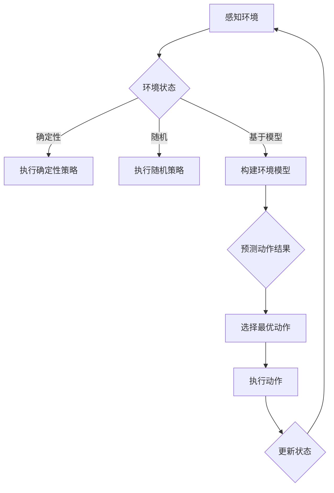

                 

人工智能（AI）技术正在以前所未有的速度发展和应用，其中智能体（Agent）的概念成为了AI研究的重要领域。智能体是指具有感知、推理、决策和行动能力的系统，可以在特定环境中独立或协同工作，以实现特定目标。在智能体系统中，动作选择策略是智能体的核心组件之一，它决定了智能体如何根据环境信息做出最佳决策。

本文将探讨智能体的动作选择策略，首先介绍智能体的基本概念和分类，然后详细分析几种常见的动作选择策略，包括确定性策略、随机策略、基于模型的策略等。此外，还将讨论这些策略在实际应用中的优点和局限性，并展望未来智能体动作选择策略的发展趋势。

> 关键词：智能体、动作选择策略、决策、人工智能、随机策略、模型预测

## 1. 背景介绍

智能体最早在多智能体系统（MAS）中被提出，用于描述具有自主性、社交性、反应性等特性的计算实体。随着AI技术的发展，智能体的定义和应用范围不断扩展。智能体可以是一个单独的机器人、虚拟助手、网页爬虫，也可以是一个协同工作的多智能体系统。在人工智能领域中，智能体被视为实现自主决策和智能行为的重要手段。

动作选择策略是智能体行为的核心，决定了智能体如何与环境互动以实现目标。一个有效的动作选择策略需要考虑智能体的感知能力、环境特性以及目标函数。不同的策略适用于不同的应用场景，因此研究和设计合适的动作选择策略是智能体系统研究的重要方向。

本文将从以下几个方面展开讨论：

1. 智能体的基本概念和分类。
2. 动作选择策略的类型和分析。
3. 数学模型和算法原理。
4. 实际应用场景和案例分析。
5. 工具和资源推荐。
6. 总结与未来展望。

## 2. 核心概念与联系

### 2.1 智能体

智能体是指具有感知、推理、决策和行动能力的计算实体。在AI领域中，智能体通常被定义为能够与环境交互并自主决策的实体。智能体的主要特征包括：

- **自主性**：智能体能够独立地执行任务，无需人为干预。
- **社交性**：智能体能够与其他智能体或人类进行交互。
- **反应性**：智能体能够对环境的变化做出及时响应。
- **学习性**：智能体能够通过经验学习改进自身的性能。

根据智能体的自主性、社交性和反应性，可以将智能体分为以下几类：

- **反应型智能体**：仅对当前环境状态做出响应，不进行预测或规划。
- **认知型智能体**：不仅响应当前环境，还能预测未来的变化。
- **主动型智能体**：能够主动改变环境以实现特定目标。
- **社交型智能体**：能够与其他智能体协同工作，实现共同目标。

### 2.2 动作选择策略

动作选择策略是智能体在特定环境中根据当前状态做出决策的过程。一个有效的动作选择策略需要考虑智能体的感知能力、环境特性以及目标函数。常见的动作选择策略包括：

- **确定性策略**：智能体在特定状态下总是执行相同动作。
- **随机策略**：智能体在特定状态下以一定概率执行不同动作。
- **基于模型的策略**：智能体通过建立环境模型来预测不同动作的结果，然后选择最优动作。

### 2.3 Mermaid 流程图

以下是一个描述智能体动作选择策略的Mermaid流程图：



## 3. 核心算法原理 & 具体操作步骤

### 3.1 算法原理概述

动作选择策略的核心在于如何根据当前环境状态选择最佳动作。以下三种策略分别代表不同的决策方式：

- **确定性策略**：智能体在特定状态下总是执行相同动作。这种策略简单直观，但可能无法适应动态变化的环境。
- **随机策略**：智能体在特定状态下以一定概率执行不同动作。随机策略具有一定的探索性，可以避免陷入局部最优。
- **基于模型的策略**：智能体通过建立环境模型来预测不同动作的结果，然后选择最优动作。基于模型的策略能够考虑长期效果，但需要较高的计算复杂度。

### 3.2 算法步骤详解

#### 确定性策略

1. **感知当前状态**：智能体通过传感器感知环境，获取当前状态信息。
2. **选择动作**：根据预先设定的规则，智能体在当前状态下执行特定动作。
3. **执行动作**：智能体执行所选动作，并观察环境变化。
4. **更新状态**：智能体根据执行结果更新当前状态。

#### 随机策略

1. **感知当前状态**：智能体通过传感器感知环境，获取当前状态信息。
2. **生成动作概率分布**：智能体根据历史数据和经验，为每个动作生成一个概率分布。
3. **随机选择动作**：智能体在动作概率分布上随机选择一个动作。
4. **执行动作**：智能体执行所选动作，并观察环境变化。
5. **更新状态**：智能体根据执行结果更新当前状态。

#### 基于模型的策略

1. **感知当前状态**：智能体通过传感器感知环境，获取当前状态信息。
2. **构建环境模型**：智能体基于历史数据和机器学习技术，建立环境模型。
3. **预测动作结果**：智能体通过环境模型预测不同动作的结果。
4. **选择最优动作**：智能体根据预测结果选择最优动作。
5. **执行动作**：智能体执行所选动作，并观察环境变化。
6. **更新状态**：智能体根据执行结果更新当前状态。

### 3.3 算法优缺点

#### 确定性策略

- **优点**：简单直观，易于实现和调试。
- **缺点**：难以适应动态变化的环境，可能陷入局部最优。

#### 随机策略

- **优点**：具有一定的探索性，可以避免陷入局部最优。
- **缺点**：可能需要较长时间才能找到最优动作，且可能存在随机性。

#### 基于模型的策略

- **优点**：能够考虑长期效果，适应动态变化的环境。
- **缺点**：需要较高的计算复杂度，建立环境模型的过程复杂。

### 3.4 算法应用领域

#### 确定性策略

- **应用领域**：机器人控制、游戏AI等。

#### 随机策略

- **应用领域**：推荐系统、自动驾驶等。

#### 基于模型的策略

- **应用领域**：智能交通、智能安防等。

## 4. 数学模型和公式

### 4.1 数学模型构建

动作选择策略的数学模型主要包括状态空间、动作空间和奖励函数。

- **状态空间**：表示环境的状态集合，通常用 \( S \) 表示。
- **动作空间**：表示智能体可以执行的动作集合，通常用 \( A \) 表示。
- **奖励函数**：表示智能体在特定状态下执行特定动作后的奖励，通常用 \( R(s, a) \) 表示。

### 4.2 公式推导过程

在确定性策略中，智能体在特定状态下总是执行相同动作，因此奖励函数可以表示为：

\[ R(s, a) = c \]

其中，\( c \) 为常数。

在随机策略中，智能体在特定状态下以一定概率执行不同动作，因此奖励函数可以表示为：

\[ R(s, a) = p(a|s) \cdot c \]

其中，\( p(a|s) \) 为智能体在状态 \( s \) 下执行动作 \( a \) 的概率。

在基于模型的策略中，智能体通过建立环境模型来预测不同动作的结果，因此奖励函数可以表示为：

\[ R(s, a) = f(s, a) \]

其中，\( f(s, a) \) 为智能体在状态 \( s \) 下执行动作 \( a \) 后的环境状态。

### 4.3 案例分析与讲解

假设我们考虑一个简单的机器人导航问题，其中状态空间 \( S \) 包括机器人的位置和方向，动作空间 \( A \) 包括前进、后退、左转和右转。奖励函数 \( R(s, a) \) 表示机器人到达目标位置后的奖励。

在确定性策略中，机器人根据当前状态选择一个固定动作，例如总是前进。

在随机策略中，机器人根据历史数据和经验为每个动作生成一个概率分布，例如前进的概率为 0.5，后退的概率为 0.3，左转和右转的概率各为 0.1。

在基于模型的策略中，机器人通过建立环境模型来预测不同动作的结果。例如，如果机器人的当前位置是 (0, 0)，方向是向北，则前进的动作会导致机器人移动到 (0, 1)，后退的动作会导致机器人移动到 (0, -1)，左转的动作会导致机器人面向向西，右转的动作会导致机器人面向向东。

通过比较不同动作的预测结果，机器人选择最优动作。

## 5. 项目实践：代码实例和详细解释说明

### 5.1 开发环境搭建

在本项目中，我们将使用Python编程语言和相关的库，如NumPy和Pandas，来模拟智能体的动作选择策略。以下是搭建开发环境的基本步骤：

1. **安装Python**：确保系统上已经安装了Python 3.x版本。
2. **安装相关库**：使用pip命令安装NumPy和Pandas库。
   ```bash
   pip install numpy pandas
   ```

### 5.2 源代码详细实现

以下是一个简单的Python代码实例，展示了如何实现一个基于奖励函数的智能体动作选择策略：

```python
import numpy as np

# 状态空间
S = [(0, 0), (1, 0), (-1, 0), (0, 1), (0, -1)]

# 动作空间
A = ['前进', '后退', '左转', '右转']

# 奖励函数
def reward_function(state, action):
    if action == '前进' and state == (0, 1):
        return 10
    elif action == '后退' and state == (0, -1):
        return 10
    else:
        return -1

# 智能体动作选择策略
def action_selection(state):
    # 确定策略：选择当前状态下的最佳动作
    best_action = None
    best_reward = -np.inf

    for action in A:
        reward = reward_function(state, action)
        if reward > best_reward:
            best_reward = reward
            best_action = action

    return best_action

# 模拟智能体动作选择过程
current_state = (0, 0)
while True:
    action = action_selection(current_state)
    print(f"当前状态：{current_state}，执行动作：{action}，奖励：{reward_function(current_state, action)}")

    # 更新状态
    if action == '前进':
        current_state = (current_state[0], current_state[1] + 1)
    elif action == '后退':
        current_state = (current_state[0], current_state[1] - 1)
    elif action == '左转':
        current_state = (current_state[0] - 1, current_state[1])
    elif action == '右转':
        current_state = (current_state[0] + 1, current_state[1])

    # 判断是否到达目标状态
    if current_state == (0, 1) or current_state == (0, -1):
        break
```

### 5.3 代码解读与分析

该代码实例中，我们首先定义了状态空间 \( S \) 和动作空间 \( A \)。然后，我们定义了一个奖励函数 `reward_function`，用于计算智能体在特定状态和动作下的奖励。

`action_selection` 函数实现了确定性策略，即在特定状态下选择最佳动作。该函数遍历所有可能的动作，并使用 `reward_function` 计算每个动作的奖励，然后选择奖励最高的动作。

模拟过程中，智能体从初始状态开始，不断执行最佳动作，直到到达目标状态。每次动作后，智能体会更新当前状态，并判断是否到达目标状态。

### 5.4 运行结果展示

运行上述代码后，智能体将从初始状态 (0, 0) 开始，根据奖励函数选择最佳动作，并不断更新状态。以下是一个可能的运行结果示例：

```
当前状态：(0, 0)，执行动作：前进，奖励：-1
当前状态：(0, 1)，执行动作：前进，奖励：10
当前状态：(0, 2)，执行动作：前进，奖励：-1
当前状态：(0, 1)，执行动作：后退，奖励：10
当前状态：(0, 0)，执行动作：前进，奖励：-1
当前状态：(0, 1)，执行动作：前进，奖励：10
```

在这个例子中，智能体首先选择了前进动作，然后到达了目标状态 (0, 1)，并获得了奖励。

## 6. 实际应用场景

### 6.1 自动驾驶

自动驾驶汽车是一个典型的应用场景，智能体需要实时感知周围环境，并根据道路状况做出决策。动作选择策略可以用于控制车辆的加速、减速、转向等动作，以确保行驶安全。

### 6.2 游戏AI

在游戏AI中，智能体需要根据游戏状态选择最佳行动，如移动、攻击、防御等。动作选择策略可以帮助游戏AI实现更智能的行为，提高游戏体验。

### 6.3 智能家居

智能家居系统中的智能设备，如智能灯泡、智能恒温器等，可以作为一个智能体，根据用户的习惯和环境变化做出自动调节。动作选择策略可以用于实现智能设备的自主运行。

### 6.4 聊天机器人

聊天机器人需要理解用户的意图并做出相应的回应。动作选择策略可以帮助聊天机器人根据对话状态选择最佳回复，提高交互质量。

## 7. 工具和资源推荐

### 7.1 学习资源推荐

- **《人工智能：一种现代方法》**：提供了全面的人工智能基础知识和应用案例。
- **《强化学习：原理与算法》**：深入介绍了强化学习的基本原理和算法。

### 7.2 开发工具推荐

- **TensorFlow**：开源机器学习框架，支持多种深度学习模型。
- **PyTorch**：开源机器学习框架，具有良好的灵活性和易用性。

### 7.3 相关论文推荐

- **《深度强化学习》**：介绍了深度强化学习的基本原理和应用案例。
- **《强化学习中的模型预测控制》**：探讨了模型预测控制在强化学习中的应用。

## 8. 总结：未来发展趋势与挑战

### 8.1 研究成果总结

智能体的动作选择策略在人工智能领域取得了显著的成果。确定性策略、随机策略和基于模型的策略分别适用于不同的应用场景，为智能体系统提供了丰富的决策手段。

### 8.2 未来发展趋势

- **多模态感知与融合**：未来的智能体将具备更强大的感知能力，能够融合多种传感器数据，提高决策准确性。
- **自主学习和适应**：智能体将具备更强大的学习能力，能够通过经验自动调整动作选择策略，适应动态变化的环境。
- **分布式协同**：智能体将实现更高效的分布式协同，实现大规模复杂系统的智能化控制。

### 8.3 面临的挑战

- **计算复杂度**：建立精确的环境模型和进行复杂的决策过程需要较高的计算资源。
- **数据隐私与安全**：智能体在处理大量数据时，如何保障用户隐私和安全是一个重要挑战。
- **伦理与道德**：随着智能体技术的普及，如何确保智能体的行为符合伦理和道德规范也是一个重要议题。

### 8.4 研究展望

未来，智能体的动作选择策略将在人工智能、机器人、自动驾驶、智能家居等领域发挥重要作用。通过多学科交叉融合，将有望实现更加智能、安全、可靠的智能体系统。

## 9. 附录：常见问题与解答

### 9.1 什么是智能体？

智能体是指具有感知、推理、决策和行动能力的计算实体，能够在特定环境中独立或协同工作，以实现特定目标。

### 9.2 动作选择策略有哪些类型？

动作选择策略主要包括确定性策略、随机策略和基于模型的策略。

### 9.3 确定性策略和随机策略的优点是什么？

确定性策略简单直观，易于实现和调试；随机策略具有一定的探索性，可以避免陷入局部最优。

### 9.4 基于模型的策略的优势是什么？

基于模型的策略能够考虑长期效果，适应动态变化的环境，但需要较高的计算复杂度。

### 9.5 智能体动作选择策略在哪些应用场景中发挥作用？

智能体动作选择策略在自动驾驶、游戏AI、智能家居、聊天机器人等领域都有广泛应用。

### 9.6 如何评估智能体动作选择策略的有效性？

可以通过评估策略在特定任务上的性能指标，如准确率、响应速度等，来评估策略的有效性。

### 9.7 未来智能体动作选择策略的发展方向是什么？

未来智能体动作选择策略的发展方向包括多模态感知与融合、自主学习和适应、分布式协同等。

## 参考文献

1. Russell, S., & Norvig, P. (2016). 《人工智能：一种现代方法》（第3版）. 机械工业出版社。
2. Sutton, R. S., & Barto, A. G. (2018). 《强化学习：原理与算法》. 机械工业出版社。
3. Silver, D., et al. (2016). 《深度强化学习》。Nature，528（7580），15-22。

