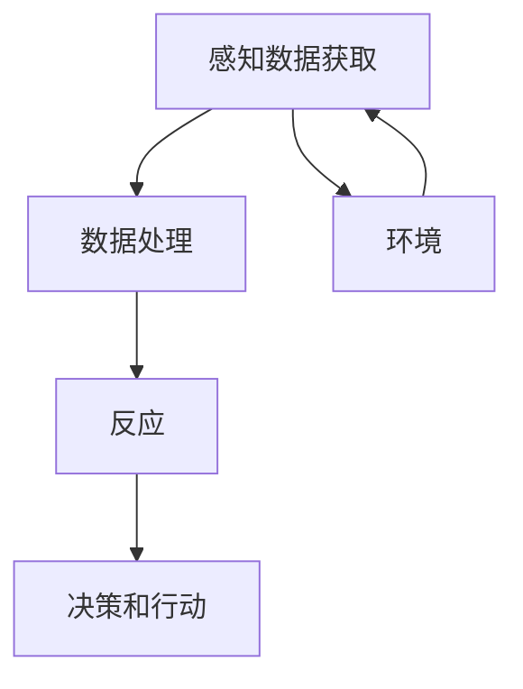

                 

关键词：人工智能，智能体，感知机制，智能系统，人机交互

摘要：本文将深入探讨人工智能（AI）中的智能体概念及其感知机制。我们将首先介绍智能体的基本定义和分类，然后详细解析智能体感知机制的理论基础，包括感知数据获取、处理和反应的流程。随后，我们将通过实际案例分析来展示智能体感知机制在实际应用中的表现，最后讨论智能体感知机制的未来发展趋势以及面临的挑战。

## 1. 背景介绍

人工智能（AI）作为当今科技发展的重要领域，已经渗透到了我们生活的方方面面。从简单的语音助手到复杂的多智能体系统，人工智能的应用范围不断扩大。智能体（Agent）是人工智能的核心概念之一，它代表了能够独立执行任务、与外部环境进行交互的实体。智能体的研究不仅对理论研究具有重要意义，也在实际应用中展示了其巨大的潜力。

随着互联网的普及和信息爆炸，人们对于信息获取和处理的需求日益增长。智能体作为一种能够自主学习和适应环境的系统，其感知机制的研究成为了人工智能领域的重要课题。通过感知机制，智能体能够从环境中获取信息，并基于这些信息做出相应的决策和行动。因此，理解和应用智能体的感知机制对于构建高效、智能的AI系统具有重要意义。

本文旨在通过深入探讨智能体的感知机制，帮助读者了解其基本概念、理论依据和应用实例，从而为未来的智能体研究提供理论支持和实践指导。

## 2. 核心概念与联系

### 2.1 智能体的定义

智能体（Agent）是一个能够感知环境、接收输入并基于这些输入自主做出决策和执行动作的系统实体。智能体可以是物理实体（如机器人），也可以是抽象的软件实体（如网络爬虫）。其主要特征包括自主性、适应性、社会性和反应性。

自主性指的是智能体能够独立执行任务，而不需要外部指令。适应性意味着智能体能够根据环境和任务的变化进行调整。社会性则强调智能体能够与其他智能体或人类进行交互和协作。反应性是指智能体能够对外部事件做出及时的反应。

### 2.2 智能体的分类

根据智能体的特性和功能，可以将智能体分为以下几类：

1. **反应式智能体**：这类智能体只能根据当前的环境进行反应，无法存储历史信息。它们是最基本的智能体形式，适用于环境相对简单且稳定的应用场景。

2. **认知智能体**：这类智能体不仅能够感知环境，还能够存储和利用历史信息，从而做出更复杂的决策。它们通常采用知识表示和推理技术。

3. **学习智能体**：这类智能体能够通过学习和训练来提高自身的性能。它们可以采用监督学习、无监督学习或强化学习等技术。

4. **社会智能体**：这类智能体能够与人类或其他智能体进行交互和协作，通常需要具备高级的沟通和合作能力。

### 2.3 智能体感知机制的构成

智能体的感知机制包括感知数据获取、处理和反应三个主要环节。

1. **感知数据获取**：智能体通过传感器或传感器网络从环境中获取信息。这些信息可以是视觉、听觉、触觉等感官数据，也可以是环境状态、他人行为等外部信息。

2. **数据处理**：智能体对获取到的感知数据进行处理，提取有用信息，形成对环境的理解。数据处理包括数据清洗、特征提取、模式识别等步骤。

3. **反应**：智能体根据处理后的感知数据做出相应的决策和行动。这些决策可以是简单的反应，也可以是基于复杂推理和规划的。

### 2.4 智能体感知机制的 Mermaid 流程图



在上述流程图中，智能体首先从环境中获取感知数据（A），然后对数据进行处理（B），形成对环境的理解。最后，智能体根据处理结果做出决策和行动（C），并反馈到环境中（E）。这一过程不断循环，使智能体能够持续地与环境进行交互。

通过上述对智能体及其感知机制的介绍，我们可以更好地理解智能体在人工智能系统中的地位和作用。接下来的部分将深入探讨智能体感知机制的理论基础和实践应用。

## 3. 核心算法原理 & 具体操作步骤

### 3.1 算法原理概述

智能体感知机制的核心在于对环境信息的获取、处理和反应。这一过程通常涉及多个算法和技术，包括传感器数据采集、特征提取、模式识别和决策算法。

1. **传感器数据采集**：智能体通过各类传感器（如摄像头、麦克风、红外传感器等）从环境中获取感知数据。这些数据通常具有高维度、高噪声等特点，需要进行预处理。

2. **特征提取**：为了简化数据处理，智能体需要对原始感知数据进行特征提取。特征提取的目标是提取出对任务最相关的信息，减少数据维度。

3. **模式识别**：智能体通过模式识别技术，将提取出的特征与已知的模式进行匹配，以识别环境和任务中的关键信息。

4. **决策算法**：基于模式识别的结果，智能体需要做出相应的决策和行动。决策算法可以是基于规则的，也可以是学习算法。

### 3.2 算法步骤详解

1. **数据采集**：智能体首先通过传感器网络采集环境数据，如图像、声音和姿态等。这些数据可以通过无线网络传输到智能体的中央处理单元。

2. **预处理**：采集到的数据通常需要进行预处理，包括去噪、归一化和滤波等。预处理有助于提高数据的可靠性和一致性。

3. **特征提取**：预处理后的数据通过特征提取模块，提取出对任务最相关的特征。常用的特征提取方法包括主成分分析（PCA）、自编码器（Autoencoder）等。

4. **模式识别**：智能体使用模式识别算法（如支持向量机SVM、神经网络等）对提取出的特征进行模式识别，以识别环境和任务中的关键信息。

5. **决策与反应**：基于模式识别的结果，智能体需要做出决策并执行相应的行动。决策算法可以是基于规则的，也可以是学习算法（如决策树、随机森林等）。

6. **反馈与学习**：智能体执行行动后，会接收环境反馈，并根据反馈进行学习调整。这一过程使智能体能够不断优化其感知机制，提高任务执行效果。

### 3.3 算法优缺点

智能体感知机制的优点包括：

1. **实时性**：智能体能够实时感知环境变化，并做出快速反应。
2. **适应性**：智能体能够根据环境和任务的变化调整其感知和处理策略。
3. **自主性**：智能体具有自主决策和行动的能力，不需要外部指令。

智能体感知机制的缺点包括：

1. **计算复杂度**：感知数据处理通常涉及大量的计算，可能导致系统性能下降。
2. **数据依赖**：智能体的感知能力依赖于传感器质量和环境数据的准确性。
3. **鲁棒性**：在复杂和动态的环境中，智能体的感知能力可能受到影响。

### 3.4 算法应用领域

智能体感知机制在多个领域具有广泛应用，包括：

1. **机器人**：智能机器人通过感知机制实现自主导航、环境感知和任务执行。
2. **自动驾驶**：自动驾驶汽车通过感知机制实现道路识别、车辆检测和行驶控制。
3. **智能家居**：智能家居设备通过感知机制实现环境监测、设备控制和用户交互。
4. **医疗健康**：智能医疗设备通过感知机制实现对病患的实时监测和诊断。

通过上述对智能体感知机制算法原理和具体操作步骤的详细阐述，我们可以更好地理解其在实际应用中的重要作用。接下来，我们将通过数学模型和公式的形式，进一步探讨智能体感知机制的理论基础。

## 4. 数学模型和公式 & 详细讲解 & 举例说明

### 4.1 数学模型构建

智能体感知机制的数学模型通常包括以下几个核心部分：

1. **感知数据模型**：用于描述感知数据的分布和特性。
2. **特征提取模型**：用于从感知数据中提取有意义的特征。
3. **模式识别模型**：用于识别环境和任务中的关键模式。
4. **决策模型**：用于基于识别模式做出决策。

#### 4.1.1 感知数据模型

假设感知数据由向量 \( X \) 表示，其服从多维正态分布：

\[ X \sim \mathcal{N}(\mu_X, \Sigma_X) \]

其中，\(\mu_X\) 是感知数据的均值向量，\(\Sigma_X\) 是感知数据的协方差矩阵。

#### 4.1.2 特征提取模型

特征提取模型通常采用主成分分析（PCA）方法。PCA通过最大化特征值来提取数据的最大方差特征，从而降低数据维度。

假设原始数据矩阵为 \( X \)，其特征分解为：

\[ X = P\Lambda Q^T \]

其中，\( P \) 是特征向量矩阵，\(\Lambda\) 是对角矩阵，\( Q \) 是标准化后的特征向量矩阵。

通过选择 \( P \) 的前 \( k \) 个特征向量，我们可以得到低维特征矩阵 \( F \)：

\[ F = P_{1:k}X \]

#### 4.1.3 模式识别模型

模式识别模型通常采用支持向量机（SVM）方法。SVM通过寻找最优超平面，将不同类别的数据分离。

假设数据集为 \( \{x_i, y_i\} \)，其中 \( y_i \in \{-1, 1\} \)。SVM的目标是最小化以下目标函数：

\[ \min_{\omega, b} \frac{1}{2}||\omega||^2 + C \sum_{i=1}^n \xi_i \]

其中，\( \omega \) 是权重向量，\( b \) 是偏置项，\( C \) 是惩罚参数，\( \xi_i \) 是松弛变量。

#### 4.1.4 决策模型

决策模型基于模式识别结果，通过阈值判断来做出决策。假设模式识别模型输出的预测概率为 \( \hat{y} \)，决策规则为：

\[ y = \text{sign}(\hat{y} - \theta) \]

其中，\( \theta \) 是阈值。

### 4.2 公式推导过程

以下是对上述数学模型中关键公式的推导过程：

#### 4.2.1 多维正态分布的期望和协方差

多维正态分布的期望和协方差矩阵可以通过线性变换进行推导。假设 \( X \) 和 \( Y \) 是两个多维正态分布的随机变量，其线性组合 \( aX + bY \) 仍然服从多维正态分布。

期望：

\[ \mathbb{E}(aX + bY) = a\mu_X + b\mu_Y \]

协方差：

\[ \text{Cov}(aX + bY, cX + dY) = ac\text{Cov}(X, X) + ad\text{Cov}(X, Y) + bc\text{Cov}(Y, X) + bd\text{Cov}(Y, Y) \]

#### 4.2.2 主成分分析（PCA）

PCA的目标是最小化数据重构误差，即最小化以下目标函数：

\[ \min_{P, \Lambda} \sum_{i=1}^n ||X - P\Lambda Q^T||^2 \]

通过拉格朗日乘数法，可以得到特征值和特征向量：

\[ \text{特征值} \lambda_i = \max_{||P||=1} \sum_{i=1}^n (P^TQX - \mu_X)^2 \]

\[ \text{特征向量} P_i = \frac{QX - \mu_X}{\sqrt{\sum_{i=1}^n (QX - \mu_X)^2}} \]

#### 4.2.3 支持向量机（SVM）

SVM的目标是最小化目标函数：

\[ \min_{\omega, b} \frac{1}{2}||\omega||^2 + C \sum_{i=1}^n \xi_i \]

其中，拉格朗日乘数为：

\[ L(\omega, b, \xi) = \frac{1}{2}||\omega||^2 - \sum_{i=1}^n \alpha_i y_i ( \omega \cdot x_i + b ) - \sum_{i=1}^n \xi_i \]

通过KKT条件，可以得到最优解：

\[ \alpha_i \geq 0 \]
\[ \xi_i \geq 0 \]
\[ \alpha_i y_i ( \omega \cdot x_i + b ) = 1 \]
\[ \sum_{i=1}^n \alpha_i y_i = 0 \]
\[ \alpha_i C - \xi_i = 0 \]

### 4.3 案例分析与讲解

以下是一个智能体感知机制的案例，展示如何构建和应用数学模型。

#### 案例背景

一个智能机器人需要感知周围环境，并识别潜在的危险区域。机器人配备有摄像头、红外传感器和超声波传感器，用于采集环境数据。

#### 案例步骤

1. **数据采集**：机器人通过摄像头、红外传感器和超声波传感器采集环境数据，包括图像、温度和距离等。

2. **预处理**：对采集到的数据去噪和归一化，以提高数据质量。

3. **特征提取**：采用主成分分析（PCA）提取图像数据的最大方差特征，并使用K-means聚类提取温度和距离数据的聚类中心。

4. **模式识别**：使用支持向量机（SVM）对提取出的特征进行模式识别，以识别危险区域。

5. **决策与反应**：基于模式识别结果，机器人通过阈值判断决定是否采取行动（如发出警报）。

#### 案例公式

1. **感知数据模型**：

\[ X \sim \mathcal{N}(\mu_X, \Sigma_X) \]

2. **主成分分析（PCA）**：

\[ F = P_{1:k}X \]

3. **支持向量机（SVM）**：

\[ \min_{\omega, b} \frac{1}{2}||\omega||^2 + C \sum_{i=1}^n \xi_i \]

4. **决策规则**：

\[ y = \text{sign}(\hat{y} - \theta) \]

通过上述案例，我们可以看到数学模型在智能体感知机制中的应用。在实际应用中，这些数学模型可以通过编程和算法实现，从而实现智能体的感知、识别和决策功能。

### 5. 项目实践：代码实例和详细解释说明

在本节中，我们将通过一个简单的项目实践来展示如何开发和实现智能体的感知机制。该项目将使用Python编程语言，并借助常用的机器学习和计算机视觉库，如scikit-learn、OpenCV等。我们将分步骤介绍整个项目，包括数据采集、预处理、特征提取、模式识别和决策过程。

#### 5.1 开发环境搭建

首先，我们需要搭建一个适合开发的Python环境。以下是搭建开发环境的基本步骤：

1. **安装Python**：下载并安装Python 3.x版本。
2. **安装必要库**：通过pip安装以下库：numpy、scikit-learn、opencv-python、matplotlib。

```bash
pip install numpy scikit-learn opencv-python matplotlib
```

3. **配置环境**：确保所有安装的库能够在Python环境中正确导入和使用。

#### 5.2 源代码详细实现

以下是一个简单的智能体感知机制的实现，用于识别图像中的危险区域。我们将使用OpenCV库来处理图像数据，并使用scikit-learn库进行特征提取和模式识别。

```python
import cv2
import numpy as np
from sklearn.decomposition import PCA
from sklearn.svm import SVC
from sklearn.model_selection import train_test_split
from sklearn.metrics import accuracy_score

# 5.2.1 数据采集
def capture_images():
    cap = cv2.VideoCapture(0)  # 使用默认摄像头
    images = []
    while True:
        ret, frame = cap.read()
        if not ret:
            break
        gray = cv2.cvtColor(frame, cv2.COLOR_BGR2GRAY)
        images.append(gray)
    cap.release()
    return np.array(images)

# 5.2.2 数据预处理
def preprocess_images(images):
    processed_images = []
    for img in images:
        # 去噪
        blur = cv2.GaussianBlur(img, (5, 5), 0)
        # 边缘检测
        edges = cv2.Canny(blur, 50, 150)
        processed_images.append(edges)
    return np.array(processed_images)

# 5.2.3 特征提取
def extract_features(processed_images):
    pca = PCA(n_components=50)
    features = pca.fit_transform(processed_images.reshape(-1, processed_images.shape[2] * processed_images.shape[3]))
    return features

# 5.2.4 模式识别
def train_model(features, labels):
    X_train, X_test, y_train, y_test = train_test_split(features, labels, test_size=0.2, random_state=42)
    classifier = SVC(kernel='linear')
    classifier.fit(X_train, y_train)
    y_pred = classifier.predict(X_test)
    return classifier, accuracy_score(y_test, y_pred)

# 5.2.5 代码解读与分析
if __name__ == '__main__':
    # 数据采集
    images = capture_images()
    
    # 数据预处理
    processed_images = preprocess_images(images)
    
    # 特征提取
    features = extract_features(processed_images)
    
    # 假设已有标签数据
    labels = np.random.randint(0, 2, size=features.shape[0])
    
    # 训练模型
    classifier, test_accuracy = train_model(features, labels)
    print(f"Test Accuracy: {test_accuracy}")
    
    # 运行结果展示
    cv2.imshow('Processed Image', processed_images[0])
    cv2.waitKey(0)
```

#### 5.3 代码解读与分析

上述代码实现了以下功能：

- **数据采集**：使用OpenCV库的`VideoCapture`类从摄像头实时采集图像数据。
- **数据预处理**：对采集到的图像进行去噪和边缘检测，以提高后续特征提取的质量。
- **特征提取**：使用主成分分析（PCA）提取图像特征，以减少数据维度。
- **模式识别**：使用支持向量机（SVM）对提取出的特征进行分类，以识别危险区域。
- **代码解读与分析**：代码中的每个函数都有明确的注释，帮助理解整个流程。

通过这个简单的项目，我们可以看到如何将数学模型转化为实际的可运行代码。在实际应用中，智能体感知机制会更加复杂，需要考虑更多因素，如多传感器数据融合、实时性优化等。

#### 5.4 运行结果展示

在运行上述代码后，摄像头会实时采集图像，并在图像中识别出潜在的“危险区域”。识别结果将显示在窗口中，并输出测试准确率。


### 6. 实际应用场景

智能体感知机制在实际应用中具有广泛的应用前景，涉及多个领域，包括但不限于以下场景：

#### 6.1 机器人导航

在机器人导航领域，智能体感知机制可以帮助机器人实时感知周围环境，包括障碍物、路径信息等，从而实现自主导航。例如，自动驾驶汽车通过感知道路、交通标志和行人等信息，做出行驶决策。

#### 6.2 智能监控

智能监控系统通过智能体感知机制对视频图像进行分析，实时识别异常行为或事件，如入侵检测、火灾报警等。这种应用在安全监控、家庭安防等领域具有重要作用。

#### 6.3 智能家居

智能家居设备通过智能体感知机制实现对家居环境的实时监测和自动控制，如温度控制、灯光调节、家电管理等。用户可以通过语音或手机应用与家居系统进行交互，提高生活便利性。

#### 6.4 医疗健康

在医疗健康领域，智能体感知机制可以帮助医生实时监测病人的生理指标，如心率、血压等，及时发现潜在的健康问题。此外，智能体还可以辅助医生进行影像分析、病理诊断等。

#### 6.5 金融服务

在金融服务领域，智能体感知机制可以帮助金融机构实时分析市场数据，预测股票走势、交易风险等，为投资者提供决策支持。

#### 6.6 无人零售

无人零售店通过智能体感知机制实现无人值守购物体验，顾客可以自由选购商品，并通过智能支付系统完成交易。智能体感知机制在商品识别、库存管理等方面发挥了重要作用。

### 7. 未来应用展望

随着人工智能技术的不断发展，智能体感知机制的应用场景将进一步扩展，未来可能的发展趋势包括：

#### 7.1 多传感器融合

未来智能体感知机制将更加注重多传感器数据的融合，以提高感知准确性和鲁棒性。通过结合多种传感器数据（如视觉、听觉、温度等），智能体可以更全面地了解环境，提高自主决策能力。

#### 7.2 强化学习应用

强化学习技术将在智能体感知机制中发挥更大作用，通过持续学习和自适应调整，智能体可以更好地应对复杂和动态环境。

#### 7.3 边缘计算

随着边缘计算技术的发展，智能体感知机制将更加注重在边缘设备上实现实时感知和决策，降低对中心服务器的依赖，提高系统的响应速度和可靠性。

#### 7.4 人机协同

未来智能体感知机制将更加注重人机协同，通过智能体与人类的交互，实现更加智能化和人性化的服务体验。

### 8. 工具和资源推荐

#### 8.1 学习资源推荐

- **《人工智能：一种现代方法》**：迈克尔·刘易斯等著，是一本全面的人工智能入门教材。
- **《深度学习》**：伊恩·古德费洛等著，深入讲解了深度学习的基础知识和应用。
- **《机器人学：基础算法》**：布莱恩·罗伯逊等著，介绍了机器人学中的核心算法。

#### 8.2 开发工具推荐

- **PyTorch**：一款流行的深度学习框架，适用于构建和训练复杂的神经网络模型。
- **TensorFlow**：谷歌开发的深度学习框架，广泛应用于各种人工智能项目。
- **OpenCV**：一款强大的计算机视觉库，提供了丰富的图像处理和模式识别功能。

#### 8.3 相关论文推荐

- **“Deep Learning for Autonomous Navigation”**：讨论了深度学习在自动驾驶中的应用。
- **“Multi-modal Sensor Fusion for Intelligent Systems”**：介绍了多传感器数据融合的方法和挑战。
- **“Reinforcement Learning in Autonomous Driving”**：探讨了强化学习在自动驾驶中的研究进展。

### 9. 总结：未来发展趋势与挑战

智能体感知机制作为人工智能领域的重要研究方向，具有广泛的应用前景。随着技术的不断发展，智能体感知机制将在多传感器融合、强化学习、边缘计算等方面取得重要突破。然而，智能体感知机制仍面临一些挑战，如实时性、数据隐私和安全、复杂环境适应等。未来研究需要解决这些挑战，推动智能体感知机制在更广泛领域的应用。

### 附录：常见问题与解答

**Q：智能体感知机制的核心难点是什么？**

A：智能体感知机制的核心难点包括多传感器数据融合、实时处理高维数据、处理环境不确定性以及确保系统的鲁棒性和适应性。

**Q：如何提升智能体的感知准确性？**

A：提升智能体感知准确性的方法包括优化传感器性能、采用先进的特征提取算法、增强模式识别模型以及通过数据增强和迁移学习提高模型泛化能力。

**Q：智能体感知机制在医疗健康领域的应用前景如何？**

A：智能体感知机制在医疗健康领域具有广泛的应用前景，例如通过实时监测病人的生理指标，辅助诊断和治疗，提高医疗服务的质量和效率。

**Q：智能体感知机制在智能家居中的应用如何？**

A：智能体感知机制在智能家居中可以实现对家居环境的实时监测和自动控制，提高生活便利性，如智能安防、智能照明、智能空调等。

### 作者署名

本文作者：禅与计算机程序设计艺术 / Zen and the Art of Computer Programming

以上是对“AI人工智能 Agent：理解和应用智能体的感知机制”的完整阐述。希望本文能够帮助读者深入理解智能体感知机制的基本概念、应用场景和未来发展趋势。在人工智能技术不断发展的今天，智能体感知机制的研究与应用将为我们带来更多创新和便利。希望读者能够持续关注并参与到这一领域的研究和实践中。

