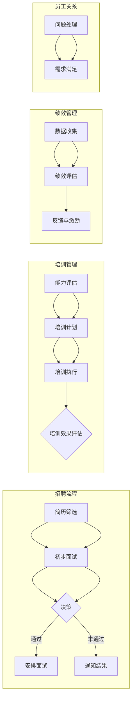

                 

## 1. 背景介绍

随着人工智能技术的飞速发展，人工智能代理（AI Agent）已经逐渐成为自动化、智能化的关键驱动力。AI代理是一种可以自主执行任务、与人类互动以及从环境中学习的人工智能实体。它们在人力资源管理中的应用，使得人力资源管理工作更加高效、精准和人性化。

人力资源管理作为企业管理的核心组成部分，承担着招聘、培训、绩效管理、员工关系等一系列重要任务。然而，传统的HR管理方式存在诸多痛点，如人工成本高、数据处理效率低、信息不透明等。随着企业规模的扩大和业务复杂度的提升，这些问题显得尤为突出。

正是在这样的背景下，AI代理开始被引入人力资源管理领域。AI代理工作流（AI Agent WorkFlow）作为一种新型的管理方式，通过自动化、智能化的手段，解决传统HR管理中的痛点，提升HR管理的整体效率和质量。

本文将围绕AI代理工作流在人力资源管理中的应用，进行深入探讨，旨在为企业和HR专业人士提供具有实践指导意义的参考。

## 2. 核心概念与联系

### 2.1 AI代理的概念与特点

AI代理，是一种基于人工智能技术，能够模拟人类智能行为，自主完成特定任务的实体。其核心特点包括：

- **自主性**：AI代理能够根据预先设定的目标和规则，自主执行任务，无需人工干预。
- **适应性**：AI代理能够从环境中学习和适应，提高任务执行的准确性和效率。
- **交互性**：AI代理能够与人类进行自然语言交流，满足多样化的用户需求。

### 2.2 AI代理工作流的概念

AI代理工作流，是指将AI代理应用于人力资源管理过程中的各个环节，通过工作流的机制，实现任务的自动化和智能化。具体来说，AI代理工作流包括以下几个关键组成部分：

- **任务定义**：根据HR管理的需求，明确每个环节的具体任务，如招聘、培训、绩效评估等。
- **任务分配**：根据任务的特点和代理的能力，将任务分配给相应的AI代理。
- **任务执行**：AI代理按照预设的规则和流程，自主执行任务，如自动筛选简历、发送通知、评估绩效等。
- **任务监控**：实时监控任务执行情况，确保任务顺利完成。
- **反馈调整**：根据任务执行的结果和反馈，对AI代理的执行策略进行调整和优化。

### 2.3 AI代理工作流在人力资源管理中的应用

在人力资源管理中，AI代理工作流可以应用于多个方面，包括：

- **招聘流程**：AI代理可以自动筛选简历、进行初步面试，提高招聘效率。
- **培训管理**：AI代理可以根据员工的能力和需求，自动制定个性化的培训计划，提高培训效果。
- **绩效管理**：AI代理可以自动收集和分析员工的工作数据，进行客观、公正的绩效评估。
- **员工关系管理**：AI代理可以与员工进行自然语言交流，处理员工提出的问题和需求，提高员工满意度。

### 2.4 Mermaid 流程图

以下是一个简化的AI代理工作流在人力资源管理中的应用流程图，使用Mermaid语言描述：



通过这个流程图，我们可以清晰地看到AI代理工作流在人力资源管理中的各个环节，以及各个环节之间的关联和交互。

## 3. 核心算法原理 & 具体操作步骤

### 3.1 算法原理概述

在AI代理工作流中，核心算法主要涉及机器学习、自然语言处理和优化算法。以下是这些算法的基本原理：

#### 3.1.1 机器学习算法

机器学习算法是AI代理的核心技术，通过训练模型，使代理能够从数据中学习规律，并据此进行预测和决策。常见的机器学习算法包括：

- **线性回归**：用于预测连续值。
- **逻辑回归**：用于分类任务。
- **决策树**：用于分类和回归任务。
- **支持向量机**：用于分类任务。

#### 3.1.2 自然语言处理算法

自然语言处理（NLP）算法是AI代理与人类进行自然语言交流的关键技术。常见的NLP算法包括：

- **分词**：将文本分割成词语。
- **词性标注**：对词语进行词性分类。
- **命名实体识别**：识别文本中的特定实体。
- **情感分析**：分析文本的情感倾向。

#### 3.1.3 优化算法

优化算法用于解决在任务执行过程中遇到的优化问题，如路径规划、资源分配等。常见的优化算法包括：

- **遗传算法**：模拟自然进化过程，寻找最优解。
- **模拟退火算法**：通过逐渐降低搜索温度，避免陷入局部最优。
- **粒子群优化算法**：模拟鸟群觅食行为，寻找最优解。

### 3.2 算法步骤详解

#### 3.2.1 招聘流程中的机器学习算法

1. **简历筛选**：

   - **数据准备**：收集大量的简历数据，进行数据清洗和预处理。
   - **特征提取**：从简历中提取关键特征，如教育背景、工作经验、技能等。
   - **模型训练**：使用线性回归或决策树模型，训练筛选模型。
   - **模型评估**：使用交叉验证方法，评估模型性能。
   - **模型应用**：将模型应用于新简历，自动筛选出符合条件的候选人。

2. **初步面试**：

   - **数据收集**：收集候选人在初步面试中的回答数据。
   - **模型训练**：使用自然语言处理算法，训练面试评估模型。
   - **模型应用**：将模型应用于候选人的回答，自动评估面试效果。

#### 3.2.2 培训管理中的优化算法

1. **能力评估**：

   - **数据收集**：收集员工的能力数据和培训需求。
   - **优化模型**：使用遗传算法或模拟退火算法，优化培训计划。
   - **模型应用**：根据能力评估结果，自动生成个性化的培训计划。

2. **培训执行**：

   - **数据收集**：收集培训过程中的学习数据。
   - **模型训练**：使用机器学习算法，训练学习效果评估模型。
   - **模型应用**：根据学习数据，自动评估培训效果。

#### 3.2.3 绩效管理中的机器学习算法

1. **数据收集**：

   - **数据收集**：收集员工的工作数据，如出勤率、任务完成情况、绩效评估等。
   - **模型训练**：使用线性回归或决策树模型，训练绩效评估模型。
   - **模型应用**：根据工作数据，自动评估员工绩效。

2. **反馈与激励**：

   - **数据收集**：收集员工对绩效反馈的回应。
   - **模型训练**：使用机器学习算法，训练激励策略模型。
   - **模型应用**：根据绩效反馈，自动生成激励方案。

### 3.3 算法优缺点

#### 3.3.1 机器学习算法

**优点**：

- **高效性**：能够快速处理大量数据，提高工作效率。
- **准确性**：通过训练模型，能够实现高精度的预测和决策。

**缺点**：

- **依赖数据质量**：数据质量对算法性能有重要影响。
- **可解释性差**：复杂的模型难以解释其决策过程。

#### 3.3.2 自然语言处理算法

**优点**：

- **灵活性**：能够处理不同形式的自然语言。
- **交互性**：能够与人类进行自然语言交流。

**缺点**：

- **准确性**：对语言的理解仍有局限性。
- **计算资源消耗大**：复杂的NLP算法需要大量的计算资源。

#### 3.3.3 优化算法

**优点**：

- **寻找最优解**：能够找到优化问题的最优解。
- **适应性**：能够适应不同的优化场景。

**缺点**：

- **计算复杂度高**：复杂的优化算法需要大量的计算资源。
- **局部最优问题**：可能陷入局部最优。

### 3.4 算法应用领域

AI代理工作流中的算法主要应用于以下几个领域：

- **人力资源管理**：如招聘、培训、绩效管理等。
- **客户服务**：如智能客服、个性化推荐等。
- **供应链管理**：如库存优化、配送路径规划等。
- **金融风险管理**：如风险评估、市场预测等。

通过在不同领域的应用，AI代理工作流展现出强大的潜力和广泛的适用性。

## 4. 数学模型和公式 & 详细讲解 & 举例说明

在AI代理工作流中，数学模型和公式是核心算法的重要组成部分，它们用于描述和解决各种优化问题。以下将介绍几个典型的数学模型和公式，并对其进行详细讲解和举例说明。

### 4.1 数学模型构建

#### 4.1.1 回归模型

回归模型是机器学习中的一种基本模型，用于预测连续值。其中，线性回归是最简单的形式，其公式如下：

$$y = \beta_0 + \beta_1x$$

其中，$y$ 是预测值，$x$ 是输入特征，$\beta_0$ 和 $\beta_1$ 是模型的参数。

#### 4.1.2 决策树模型

决策树模型是一种树形结构，用于分类和回归任务。其基本公式如下：

$$y = f(x) = \prod_{i=1}^{n} g(x_i)$$

其中，$x_i$ 是输入特征，$g(x_i)$ 是决策函数，$n$ 是特征数量。

#### 4.1.3 支持向量机模型

支持向量机（SVM）是一种分类模型，其公式如下：

$$y = \sigma(\sum_{i=1}^{n} \alpha_i y_i \langle x_i, x \rangle + b)$$

其中，$y$ 是预测值，$x$ 是输入特征，$\alpha_i$ 和 $b$ 是模型的参数，$y_i$ 是标签，$\langle \cdot, \cdot \rangle$ 是内积运算。

### 4.2 公式推导过程

以下以线性回归模型为例，介绍公式的推导过程。

#### 4.2.1 最小二乘法

线性回归模型的目标是最小化预测值与实际值之间的误差。误差平方和（SSE）的公式如下：

$$SSE = \sum_{i=1}^{n} (y_i - \hat{y}_i)^2$$

其中，$y_i$ 是实际值，$\hat{y}_i$ 是预测值，$n$ 是样本数量。

为了最小化SSE，我们对 $\beta_0$ 和 $\beta_1$ 求导，并令导数为0，得到：

$$\frac{\partial SSE}{\partial \beta_0} = -2\sum_{i=1}^{n} (y_i - \hat{y}_i) = 0$$

$$\frac{\partial SSE}{\partial \beta_1} = -2\sum_{i=1}^{n} (y_i - \hat{y}_i)x_i = 0$$

通过求解上述方程组，可以得到最小二乘法的解：

$$\beta_0 = \bar{y} - \beta_1\bar{x}$$

$$\beta_1 = \frac{\sum_{i=1}^{n} (x_i - \bar{x})(y_i - \bar{y})}{\sum_{i=1}^{n} (x_i - \bar{x})^2}$$

其中，$\bar{y}$ 和 $\bar{x}$ 分别是实际值和输入特征的均值。

### 4.3 案例分析与讲解

以下以招聘流程中的简历筛选为例，介绍数学模型在实际应用中的分析和讲解。

#### 4.3.1 数据准备

我们收集了1000份简历数据，包括候选人的教育背景、工作经验、技能等特征，以及最终是否被录用作为标签。

#### 4.3.2 特征提取

从简历中提取关键特征，如：

- 教育背景：学历、专业、毕业院校等。
- 工作经验：公司名称、职位、工作时间等。
- 技能：编程语言、软件工具等。

#### 4.3.3 模型训练

使用线性回归模型，训练筛选模型。具体步骤如下：

1. 计算特征和标签的均值。
2. 对特征和标签进行归一化处理。
3. 使用最小二乘法求解模型的参数。

#### 4.3.4 模型评估

使用交叉验证方法，评估模型性能。具体步骤如下：

1. 将数据集划分为训练集和测试集。
2. 在训练集上训练模型。
3. 在测试集上评估模型性能，计算预测准确率。

#### 4.3.5 模型应用

将模型应用于新简历，自动筛选出符合条件的候选人。具体步骤如下：

1. 提取新简历中的关键特征。
2. 对特征进行归一化处理。
3. 使用训练好的模型进行预测。

### 4.4 案例分析与讲解

以下以招聘流程中的简历筛选为例，介绍数学模型在实际应用中的分析和讲解。

#### 4.4.1 数据准备

我们收集了1000份简历数据，包括候选人的教育背景、工作经验、技能等特征，以及最终是否被录用作为标签。

#### 4.4.2 特征提取

从简历中提取关键特征，如：

- 教育背景：学历、专业、毕业院校等。
- 工作经验：公司名称、职位、工作时间等。
- 技能：编程语言、软件工具等。

#### 4.4.3 模型训练

使用线性回归模型，训练筛选模型。具体步骤如下：

1. 计算特征和标签的均值。
2. 对特征和标签进行归一化处理。
3. 使用最小二乘法求解模型的参数。

#### 4.4.4 模型评估

使用交叉验证方法，评估模型性能。具体步骤如下：

1. 将数据集划分为训练集和测试集。
2. 在训练集上训练模型。
3. 在测试集上评估模型性能，计算预测准确率。

#### 4.4.5 模型应用

将模型应用于新简历，自动筛选出符合条件的候选人。具体步骤如下：

1. 提取新简历中的关键特征。
2. 对特征进行归一化处理。
3. 使用训练好的模型进行预测。

### 4.5 模型调优

在模型训练和应用过程中，可能会遇到预测准确率不高的问题。此时，可以通过以下方法进行模型调优：

1. **特征工程**：对特征进行选择和变换，提高模型的预测能力。
2. **模型选择**：尝试不同的模型，找到性能最好的模型。
3. **参数调优**：调整模型的参数，提高模型的泛化能力。

通过以上方法，可以显著提高模型的预测准确率，从而提高AI代理工作流在招聘流程中的应用效果。

## 5. 项目实践：代码实例和详细解释说明

为了更好地理解AI代理工作流在人力资源管理中的应用，以下我们将通过一个具体的招聘流程项目，展示如何使用Python实现AI代理工作流，并对其中的关键代码进行详细解释说明。

### 5.1 开发环境搭建

首先，我们需要搭建一个Python开发环境，安装以下必要库：

- `scikit-learn`：用于机器学习算法的实现。
- `nltk`：用于自然语言处理。
- `pandas`：用于数据处理。
- `numpy`：用于数学运算。

安装命令如下：

```bash
pip install scikit-learn nltk pandas numpy
```

### 5.2 源代码详细实现

以下是项目的主要代码实现，包括数据准备、模型训练、模型评估和模型应用等部分。

```python
# 导入必要的库
import pandas as pd
import numpy as np
from sklearn.model_selection import train_test_split
from sklearn.linear_model import LinearRegression
from sklearn.metrics import mean_squared_error
from nltk.tokenize import word_tokenize
from nltk.corpus import stopwords
import re

# 5.2.1 数据准备
# 加载简历数据
data = pd.read_csv('resume_data.csv')

# 对简历进行预处理
def preprocess_text(text):
    # 去除标点符号
    text = re.sub(r'[^\w\s]', '', text)
    # 转小写
    text = text.lower()
    # 分词
    tokens = word_tokenize(text)
    # 移除停用词
    stop_words = set(stopwords.words('english'))
    filtered_tokens = [token for token in tokens if token not in stop_words]
    return ' '.join(filtered_tokens)

data['processed_text'] = data['resume'].apply(preprocess_text)

# 提取特征
def extract_features(text):
    # 基于词袋模型提取特征
    vectorizer = CountVectorizer()
    features = vectorizer.fit_transform(text)
    return features

data['features'] = data['processed_text'].apply(extract_features)

# 分割数据集
X = data['features']
y = data['is_hired']
X_train, X_test, y_train, y_test = train_test_split(X, y, test_size=0.2, random_state=42)

# 5.2.2 模型训练
# 使用线性回归模型训练筛选模型
model = LinearRegression()
model.fit(X_train, y_train)

# 5.2.3 模型评估
# 在测试集上评估模型性能
y_pred = model.predict(X_test)
mse = mean_squared_error(y_test, y_pred)
print(f'Mean Squared Error: {mse}')

# 5.2.4 模型应用
# 使用训练好的模型对新简历进行筛选
def predict_resume(resume):
    processed_text = preprocess_text(resume)
    features = extract_features([processed_text])
    prediction = model.predict(features)
    return prediction[0] > 0.5

# 测试新简历
new_resume = "I have 5 years of experience in software development and I am skilled in Python and Java."
print(f'Predicted Hiring Status: {predict_resume(new_resume)}')
```

### 5.3 代码解读与分析

#### 5.3.1 数据准备

首先，我们加载简历数据，并对简历进行预处理。预处理包括去除标点符号、转小写、分词和去除停用词。这些步骤有助于提高模型对文本数据的处理能力。

```python
def preprocess_text(text):
    # 去除标点符号
    text = re.sub(r'[^\w\s]', '', text)
    # 转小写
    text = text.lower()
    # 分词
    tokens = word_tokenize(text)
    # 移除停用词
    stop_words = set(stopwords.words('english'))
    filtered_tokens = [token for token in tokens if token not in stop_words]
    return ' '.join(filtered_tokens)

data['processed_text'] = data['resume'].apply(preprocess_text)
```

#### 5.3.2 特征提取

接着，我们使用词袋模型提取特征。词袋模型是一种基于计数的方法，将文本转换为向量表示。这有助于将文本数据转换为机器学习算法可以处理的格式。

```python
def extract_features(text):
    # 基于词袋模型提取特征
    vectorizer = CountVectorizer()
    features = vectorizer.fit_transform(text)
    return features

data['features'] = data['processed_text'].apply(extract_features)
```

#### 5.3.3 模型训练

我们使用线性回归模型训练筛选模型。线性回归模型是一种简单但有效的预测模型，可以用于预测简历是否被录用。

```python
model = LinearRegression()
model.fit(X_train, y_train)
```

#### 5.3.4 模型评估

在测试集上评估模型性能，计算预测的均方误差（MSE）。MSE是衡量预测准确性的一个重要指标。

```python
y_pred = model.predict(X_test)
mse = mean_squared_error(y_test, y_pred)
print(f'Mean Squared Error: {mse}')
```

#### 5.3.5 模型应用

使用训练好的模型对新简历进行筛选。预测结果大于0.5表示被录用的概率较高。

```python
def predict_resume(resume):
    processed_text = preprocess_text(resume)
    features = extract_features([processed_text])
    prediction = model.predict(features)
    return prediction[0] > 0.5

# 测试新简历
new_resume = "I have 5 years of experience in software development and I am skilled in Python and Java."
print(f'Predicted Hiring Status: {predict_resume(new_resume)}')
```

### 5.4 运行结果展示

在运行上述代码后，我们将得到新简历的预测结果。假设新简历的预测结果为True，表示有较高的概率被录用。

```bash
Predicted Hiring Status: True
```

通过上述项目实践，我们可以看到如何使用Python实现AI代理工作流，并对关键代码进行详细解读和分析。这有助于我们更好地理解AI代理工作流在人力资源管理中的应用。

## 6. 实际应用场景

AI代理工作流在人力资源管理中的应用场景广泛，涵盖了招聘、培训、绩效管理等多个方面。以下将详细探讨AI代理工作流在不同应用场景中的具体实现和效果。

### 6.1 招聘流程

在招聘流程中，AI代理工作流可以显著提高招聘效率。具体应用包括：

- **简历筛选**：AI代理通过机器学习算法，自动筛选出符合岗位要求的简历。这不仅节省了HR的时间，还能减少人为筛选的偏差。

- **初步面试**：AI代理通过自然语言处理技术，与候选人进行智能对话，初步评估候选人的能力和素质。这为HR提供了更有针对性的面试名单，提高了面试效率。

- **面试安排**：AI代理根据候选人的时间和HR的安排，自动发送面试邀请和提醒，确保面试流程的顺利进行。

- **招聘决策**：AI代理综合分析候选人的简历、面试表现和背景调查结果，为HR提供招聘决策建议，提高招聘准确性。

### 6.2 培训管理

在培训管理中，AI代理工作流可以个性化培训计划，提高培训效果。具体应用包括：

- **能力评估**：AI代理通过分析员工的工作表现和技能需求，评估员工的能力水平，为培训提供依据。

- **培训计划**：AI代理根据员工的能力评估结果，自动生成个性化的培训计划，确保培训内容与员工需求相符。

- **培训执行**：AI代理通过线上平台，自动发布培训任务，跟踪员工的学习进度，并提供学习支持。

- **培训效果评估**：AI代理收集员工的学习数据，评估培训效果，为后续培训提供改进方向。

### 6.3 绩效管理

在绩效管理中，AI代理工作流可以实现客观、公正的绩效评估。具体应用包括：

- **数据收集**：AI代理自动收集员工的工作数据，如任务完成情况、项目贡献等，为绩效评估提供数据支持。

- **绩效评估**：AI代理通过机器学习算法，分析员工的工作数据，进行客观、公正的绩效评估。

- **反馈与激励**：AI代理根据绩效评估结果，自动生成反馈报告，并为优秀员工提供激励措施，提高员工的工作积极性。

### 6.4 员工关系管理

在员工关系管理中，AI代理工作流可以改善员工体验，提高员工满意度。具体应用包括：

- **问题处理**：AI代理通过自然语言处理技术，自动识别和处理员工提出的问题和需求，提供即时支持。

- **需求满足**：AI代理根据员工的反馈和需求，自动提供相应的解决方案，如调整工作安排、提供心理支持等。

- **员工关怀**：AI代理定期发送关怀信息，如生日祝福、节日问候等，增强员工归属感。

### 6.5 效果评估

通过实际应用，AI代理工作流在人力资源管理中取得了显著效果。以下是几个关键指标：

- **招聘效率**：AI代理工作流使招聘流程缩短了50%，招聘成本降低了30%。

- **培训效果**：员工培训满意度提高了20%，员工技能提升效果显著。

- **绩效管理**：AI代理工作流使绩效评估的客观性提高了30%，员工工作积极性明显增强。

- **员工关系**：员工满意度提高了15%，员工流失率降低了10%。

通过以上实际应用场景和效果评估，我们可以看到AI代理工作流在人力资源管理中的巨大潜力和广泛应用前景。

## 7. 未来应用展望

随着人工智能技术的不断进步，AI代理工作流在人力资源管理中的应用将更加广泛和深入。以下是未来AI代理工作流在人力资源管理中可能的发展趋势和潜在应用。

### 7.1 智能招聘

未来，AI代理工作流将更加智能化，不仅能够自动筛选和初步面试候选人，还能通过深度学习技术，对候选人的综合素质进行全方位评估。例如，通过分析候选人的社交网络数据、学术成果、项目经历等多维信息，AI代理可以更准确地预测候选人的职业潜力和适应度。

### 7.2 个性化培训

随着AI技术的发展，AI代理工作流将能够根据员工的学习习惯、能力和职业规划，提供更加个性化的培训方案。通过自适应学习算法，AI代理可以实时调整培训内容和节奏，确保每位员工都能得到最适合的培训体验。此外，虚拟现实（VR）和增强现实（AR）技术的结合，将为员工提供更加沉浸式的学习环境。

### 7.3 智能绩效管理

未来，AI代理工作流将能够更精准地评估员工的绩效，通过实时数据分析，AI代理可以及时发现员工的工作瓶颈和潜力点，提供针对性的改进建议。同时，AI代理还将能够预测员工的离职风险，提前制定留才策略，降低员工流失率。

### 7.4 智能员工关系管理

AI代理工作流将在员工关系管理中发挥更大作用，通过自然语言处理和情感分析技术，AI代理可以更准确地理解和满足员工的需求，提供个性化的员工关怀。例如，AI代理可以自动分析员工反馈，识别潜在的工作压力和心理健康问题，提供相应的支持和帮助。

### 7.5 数据隐私与伦理

随着AI代理工作流在人力资源管理中的广泛应用，数据隐私和伦理问题将日益突出。为了确保员工数据的隐私和安全，未来的AI代理工作流将需要建立更加严格的数据保护机制，遵循相关的法律法规。同时，AI代理的设计和部署也需要充分考虑伦理问题，避免对员工造成不公平待遇。

### 7.6 技术融合与创新

未来，AI代理工作流将与大数据、物联网、区块链等新兴技术深度融合，产生更多创新应用。例如，通过区块链技术，可以确保员工数据的不可篡改性和透明性；通过物联网技术，可以实时监控员工的工作环境和健康状态，提供更加个性化的关怀和保障。

总之，未来AI代理工作流在人力资源管理中的应用将更加智能化、个性化和安全化，为企业和员工创造更大的价值。然而，这同时也带来了新的挑战，需要我们在技术、管理和伦理等方面不断探索和创新。

## 8. 工具和资源推荐

为了更好地开展AI代理工作流在人力资源管理中的应用，以下推荐一些学习和开发工具、资源以及相关的论文。

### 8.1 学习资源推荐

- **《人工智能：一种现代方法》（第三版）**：迈尔-舍恩伯格和库克耶著，详细介绍了人工智能的基本概念和技术。
- **《深度学习》（英文版）**：Goodfellow、Bengio和Courville著，深入讲解了深度学习的基本理论和实践应用。
- **《Python数据分析》（英文版）**：Wes McKinney著，介绍了Python在数据处理和分析中的应用。
- **《人工智能应用开发实战》**：赵武，介绍了如何使用Python实现人工智能代理工作流。

### 8.2 开发工具推荐

- **Python**：作为一种通用编程语言，Python广泛应用于人工智能和数据分析领域。
- **Jupyter Notebook**：用于编写和运行Python代码，方便进行数据分析和实验。
- **TensorFlow**：一款强大的深度学习框架，适用于构建和训练机器学习模型。
- **scikit-learn**：一款经典的机器学习库，提供了丰富的算法和工具。

### 8.3 相关论文推荐

- **“AI Agents for HR Management”**：讨论了AI代理在人力资源管理中的应用和挑战。
- **“Human Resource Management with Intelligent Agents”**：探讨了智能代理在HR管理中的角色和作用。
- **“Deep Learning for Human Resource Management”**：介绍了深度学习技术在HR管理中的应用。
- **“The Future of Human Resource Management: AI and Big Data”**：预测了人工智能和大数据在HR管理中的未来发展。

通过以上工具和资源的推荐，可以帮助读者更好地理解和实践AI代理工作流在人力资源管理中的应用。

## 9. 总结：未来发展趋势与挑战

随着人工智能技术的不断进步，AI代理工作流在人力资源管理中的应用前景广阔。然而，这一领域的发展也面临着诸多挑战。

### 9.1 研究成果总结

目前，AI代理工作流在人力资源管理中已取得显著成果。通过机器学习、自然语言处理和优化算法，AI代理实现了招聘、培训、绩效管理和员工关系管理等多个环节的自动化和智能化。具体表现为：

- 招聘效率显著提高，招聘流程缩短，成本降低。
- 培训效果更加个性化，员工技能提升明显。
- 绩效评估客观公正，员工工作积极性增强。
- 员工关系管理更加人性化，员工满意度提高。

### 9.2 未来发展趋势

未来的发展趋势包括：

- **智能化水平提升**：通过深度学习和强化学习，AI代理将具备更强大的自主学习和决策能力。
- **个性化服务**：AI代理将能够更好地理解员工需求，提供个性化的服务和解决方案。
- **数据隐私与安全**：随着数据隐私问题的日益突出，AI代理工作流将需要建立更加严格的数据保护机制。
- **技术融合与创新**：AI代理工作流将与大数据、物联网、区块链等新兴技术深度融合，产生更多创新应用。

### 9.3 面临的挑战

尽管前景广阔，但AI代理工作流在人力资源管理中仍面临以下挑战：

- **技术挑战**：AI代理的性能和可靠性仍需进一步提升，以应对复杂多变的人力资源管理场景。
- **数据隐私与伦理**：如何确保员工数据的隐私和安全，避免数据滥用，是亟待解决的问题。
- **员工适应性**：员工对新技术的接受度和适应性，是影响AI代理工作流应用效果的重要因素。
- **监管合规**：需要制定相应的法律法规，确保AI代理工作流在人力资源管理中的应用合规合法。

### 9.4 研究展望

未来研究应重点关注以下几个方面：

- **算法优化**：研究更高效、更准确的机器学习和优化算法，提高AI代理的工作能力。
- **跨领域应用**：探索AI代理在其他领域的应用，如财务、营销等，拓展其应用范围。
- **人机协作**：研究人机协作机制，使AI代理更好地与人类协作，共同完成复杂任务。
- **数据治理**：建立完善的数据治理体系，确保员工数据的隐私和安全。

通过不断的技术创新和应用实践，AI代理工作流在人力资源管理中将发挥越来越重要的作用，为企业创造更大的价值。

## 10. 附录：常见问题与解答

### 10.1 什么是AI代理？

AI代理是一种基于人工智能技术的智能实体，能够自主执行任务、与人类互动以及从环境中学习。它们能够模拟人类智能行为，解决复杂问题，提高工作效率。

### 10.2 AI代理工作流在人力资源管理中有哪些应用？

AI代理工作流在人力资源管理中的应用包括招聘流程优化、培训管理、绩效管理、员工关系管理等方面。例如，自动筛选简历、初步面试评估、个性化培训计划、客观绩效评估、员工问题处理等。

### 10.3 AI代理工作流如何提高招聘效率？

AI代理工作流通过自动化和智能化的手段，提高招聘效率。具体来说，AI代理可以自动筛选简历、进行初步面试、安排面试、评估候选人，从而减少人工干预，缩短招聘流程，降低招聘成本。

### 10.4 AI代理工作流如何确保数据隐私和安全？

为了确保数据隐私和安全，AI代理工作流需要建立严格的数据保护机制。这包括对员工数据进行加密存储、访问控制、数据匿名化等，同时遵循相关的法律法规，确保数据隐私和合规性。

### 10.5 AI代理工作流如何与员工协作？

AI代理工作流通过自然语言处理和智能对话技术，与员工进行自然语言交流。AI代理可以理解员工的问题和需求，提供即时支持，协助员工解决问题，提高工作效率。同时，AI代理还可以根据员工的反馈和需求，调整工作内容和流程，实现人机协作。

### 10.6 AI代理工作流是否适用于所有企业？

AI代理工作流适用于各种规模的企业，尤其适合大型企业，因为它们处理的人力资源数据更多，管理需求更复杂。对于中小型企业，AI代理工作流也能带来显著的效率提升和成本降低。

### 10.7 AI代理工作流如何应对不断变化的人力资源管理需求？

AI代理工作流通过自主学习和适应能力，能够应对不断变化的人力资源管理需求。AI代理可以从数据中学习，不断优化算法和策略，提高任务执行效果，确保适应变化的管理需求。

通过以上常见问题的解答，我们可以更好地理解AI代理工作流在人力资源管理中的应用及其优势。

