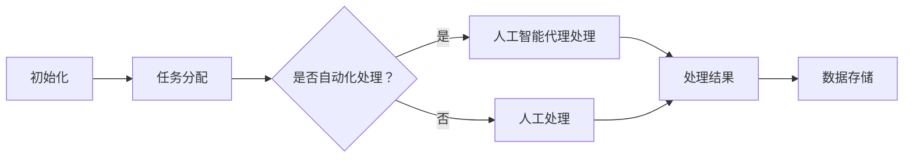
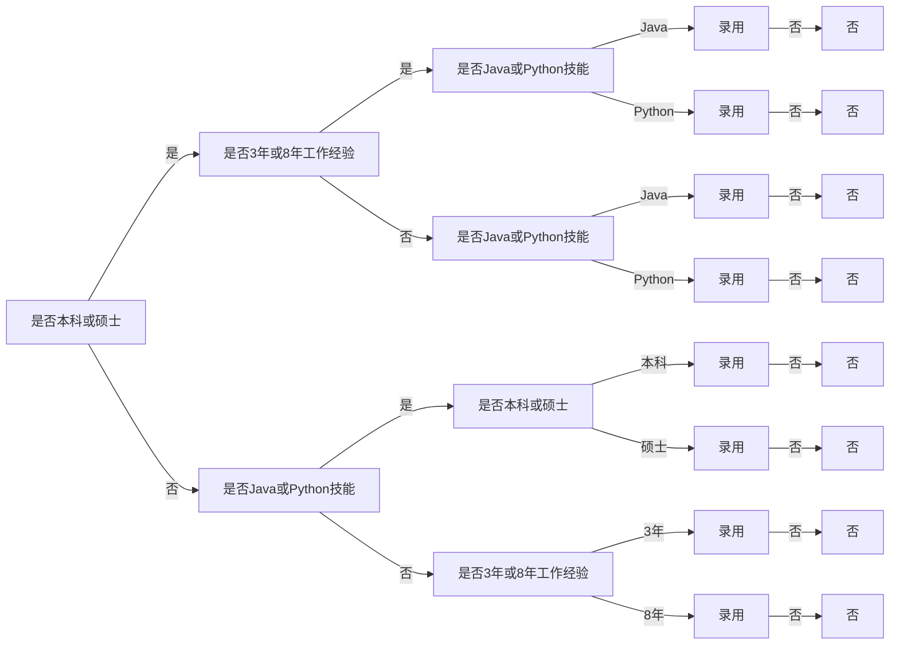

                 

关键词：人工智能代理、工作流、人力资源管理、算法、数学模型、项目实践

> 摘要：本文将探讨人工智能代理工作流（AI Agent WorkFlow）在人力资源管理中的应用。我们将深入分析其核心概念、算法原理、数学模型、项目实践，并探讨其在未来人力资源管理中的应用前景。

## 1. 背景介绍

随着人工智能技术的发展，越来越多的企业开始将人工智能应用于人力资源管理中。人工智能代理工作流（AI Agent WorkFlow）作为人工智能在人力资源管理中的核心应用之一，引起了广泛关注。本文旨在探讨人工智能代理工作流在人力资源管理中的应用，分析其核心概念、算法原理、数学模型以及项目实践。

### 1.1 人工智能代理工作流的概念

人工智能代理工作流（AI Agent WorkFlow）是一种基于人工智能技术的工作流管理系统。它通过自动化处理日常的人力资源管理任务，提高工作效率，降低人力成本。人工智能代理工作流的核心在于人工智能代理，这些代理可以模拟人类的行为，执行特定的任务，如简历筛选、面试安排、员工绩效评估等。

### 1.2 人工智能代理工作流的优势

人工智能代理工作流具有以下优势：

1. 提高工作效率：通过自动化处理重复性任务，减少人力资源管理部门的工作量，提高工作效率。
2. 降低人力成本：减少对人力资源管理部门工作人员的需求，降低人力成本。
3. 提高招聘质量：通过精确筛选简历，提高招聘质量。
4. 增强数据分析能力：通过收集和分析员工数据，为人力资源决策提供支持。

## 2. 核心概念与联系

为了更好地理解人工智能代理工作流在人力资源管理中的应用，我们需要了解其核心概念和架构。下面我们将使用Mermaid流程图来展示人工智能代理工作流的核心节点和联系。



### 2.1 初始化

初始化阶段是人工智能代理工作流的起点。在这个阶段，系统需要确定需要执行的任务，如简历筛选、面试安排等。

### 2.2 任务分配

在初始化阶段确定任务后，系统会将任务分配给合适的人工智能代理或人力资源管理人员。

### 2.3 是否自动化处理？

在这个阶段，系统会根据任务的性质和复杂度，决定是否使用人工智能代理进行自动化处理。

### 2.4 人工智能代理处理

如果任务决定自动化处理，系统会将任务分配给合适的人工智能代理。人工智能代理会根据预设的算法和规则，执行相应的任务。

### 2.5 人工处理

如果任务决定由人力资源管理人员处理，系统会将任务分配给相关人员。

### 2.6 处理结果

无论任务是由人工智能代理处理还是人工处理，系统都需要记录处理结果，并存储在数据库中。

### 2.7 数据存储

处理结果需要存储在数据库中，以便后续的数据分析和决策支持。

## 3. 核心算法原理 & 具体操作步骤

### 3.1 算法原理概述

人工智能代理工作流的核心算法包括简历筛选算法、面试安排算法、员工绩效评估算法等。这些算法通常基于机器学习和数据挖掘技术，通过分析大量的人力资源数据，提取特征，并建立预测模型。

### 3.2 算法步骤详解

#### 3.2.1 简历筛选算法

1. 数据预处理：对简历数据进行清洗、去重、格式转换等操作。
2. 特征提取：从简历数据中提取与招聘需求相关的特征，如教育背景、工作经验、技能等。
3. 模型训练：使用机器学习算法，如决策树、支持向量机、神经网络等，训练简历筛选模型。
4. 简历筛选：使用训练好的模型，对简历进行评分，筛选出符合招聘需求的简历。

#### 3.2.2 面试安排算法

1. 面试资源分配：根据面试资源（如会议室、面试官等）的可用性，为候选人分配面试时间。
2. 面试流程设计：设计合理的面试流程，包括面试环节、面试官分配等。
3. 面试邀请：通过电子邮件、短信等方式，向候选人发送面试邀请。
4. 面试跟踪：监控面试进度，及时解决面试过程中的问题。

#### 3.2.3 员工绩效评估算法

1. 数据收集：收集员工的工作数据，如工作时长、任务完成情况、团队协作等。
2. 特征提取：从工作数据中提取与员工绩效相关的特征。
3. 模型训练：使用机器学习算法，训练员工绩效评估模型。
4. 绩效评估：使用训练好的模型，对员工进行绩效评估。

### 3.3 算法优缺点

#### 3.3.1 优点

1. 提高招聘效率：通过自动化处理简历筛选、面试安排等任务，提高招聘效率。
2. 提高员工绩效评估准确性：通过数据分析，提高员工绩效评估的准确性。
3. 减少人力资源管理部门的工作量：通过自动化处理重复性任务，降低人力资源管理部门的工作量。

#### 3.3.2 缺点

1. 对数据质量要求高：算法的准确性和稳定性取决于数据质量。
2. 需要专业的技术支持：算法的开发、维护和优化需要专业的技术支持。

### 3.4 算法应用领域

人工智能代理工作流在人力资源管理中具有广泛的应用领域，包括：

1. 招聘管理：简历筛选、面试安排、候选人评估等。
2. 员工绩效评估：员工绩效评估、员工晋升评估等。
3. 员工关系管理：员工满意度调查、员工培训等。

## 4. 数学模型和公式 & 详细讲解 & 举例说明

### 4.1 数学模型构建

人工智能代理工作流的核心算法通常基于机器学习和数据挖掘技术。下面我们将介绍一种常见的机器学习算法——决策树，并构建相应的数学模型。

#### 4.1.1 决策树算法

决策树是一种常用的分类算法，通过构建一棵树形结构，对数据集进行分类。决策树的核心是树节点，每个节点表示一个特征，每个分支表示该特征的不同取值。

#### 4.1.2 决策树数学模型

假设我们有一个包含n个特征的数据集，每个特征可以取m个不同的值。我们可以使用以下公式表示决策树的数学模型：

\[ T = \{ n_1, n_2, ..., n_m \} \]

其中，\( n_i \) 表示第i个特征的所有可能取值。

对于每个特征 \( n_i \)，我们可以使用以下公式计算其信息增益（Information Gain）：

\[ IG(n_i) = H(n) - \sum_{j=1}^{m} p_j H(n_j) \]

其中，\( H(n) \) 表示数据集的熵（Entropy），\( p_j \) 表示特征 \( n_i \) 取值 \( n_j \) 的概率。

信息增益越大，说明特征 \( n_i \) 对分类的贡献越大。我们可以使用信息增益作为特征选择的依据，构建决策树。

### 4.2 公式推导过程

#### 4.2.1 熵的计算

熵是信息论中的一个概念，表示数据的不确定性。对于一个有n个样本的数据集，每个样本有m个特征，我们可以使用以下公式计算其熵：

\[ H(n) = - \sum_{i=1}^{n} p_i \log_2 p_i \]

其中，\( p_i \) 表示样本i在数据集中的概率。

#### 4.2.2 信息增益的计算

信息增益是决策树算法中的一个重要指标，用于衡量特征对分类的贡献。对于一个特征 \( n_i \)，我们可以使用以下公式计算其信息增益：

\[ IG(n_i) = H(n) - \sum_{j=1}^{m} p_j H(n_j) \]

其中，\( H(n) \) 是数据集的熵，\( p_j \) 是特征 \( n_i \) 取值 \( n_j \) 的概率。

#### 4.2.3 决策树的构建

决策树的构建过程是一个递归的过程，每次递归都会选择一个最优的特征，并将其作为树节点。具体的构建过程如下：

1. 计算所有特征的信息增益，选择信息增益最大的特征作为当前节点。
2. 根据当前特征的所有可能取值，将数据集划分为多个子集。
3. 对每个子集，递归执行上述步骤，直到满足终止条件（如特征数量达到阈值、子集大小小于阈值等）。

### 4.3 案例分析与讲解

假设我们有一个招聘数据集，包含以下特征：

1. 教育背景（本科、硕士、博士）
2. 工作经验（1年、3年、5年、8年）
3. 技能（Java、Python、C++）

我们需要使用决策树算法筛选出符合招聘需求的简历。

#### 4.3.1 数据预处理

首先，我们对数据集进行预处理，包括去重、格式转换等操作。假设预处理后的数据集如下：

| 教育背景 | 工作经验 | 技能       | 是否录用 |
| -------- | -------- | ---------- | -------- |
| 本科     | 3年      | Java       | 是       |
| 硕士     | 8年      | Python     | 是       |
| 博士     | 1年      | C++       | 否       |

#### 4.3.2 特征提取

接下来，我们从数据集中提取与招聘需求相关的特征。假设我们的招聘需求是：本科或硕士，3年或8年工作经验，Java或Python技能。

我们可以使用以下公式计算特征的概率：

\[ p_1 = \frac{1}{3} \]
\[ p_2 = \frac{1}{3} \]
\[ p_3 = \frac{1}{2} \]
\[ p_4 = \frac{1}{2} \]

#### 4.3.3 模型训练

使用决策树算法，我们构建以下决策树模型：



#### 4.3.4 简历筛选

使用构建好的决策树模型，我们筛选出以下简历：

| 教育背景 | 工作经验 | 技能   | 是否录用 |
| -------- | -------- | ------ | -------- |
| 本科     | 3年      | Java   | 是       |
| 硕士     | 8年      | Python | 是       |

通过这个案例，我们可以看到决策树算法在简历筛选中的应用。

## 5. 项目实践：代码实例和详细解释说明

在本节中，我们将通过一个实际项目来展示如何实现人工智能代理工作流。我们将使用Python编程语言和scikit-learn库来构建和训练决策树模型，并进行简历筛选。

### 5.1 开发环境搭建

为了进行项目实践，我们需要搭建以下开发环境：

1. Python 3.8 或更高版本
2. Jupyter Notebook
3. scikit-learn 库

你可以通过以下命令来安装scikit-learn库：

```bash
pip install scikit-learn
```

### 5.2 源代码详细实现

下面是一个简单的Python代码示例，用于构建和训练决策树模型，并筛选简历。

```python
import pandas as pd
from sklearn.model_selection import train_test_split
from sklearn.tree import DecisionTreeClassifier
from sklearn.metrics import accuracy_score

# 读取数据集
data = pd.read_csv('resume_dataset.csv')

# 数据预处理
data['Education'] = data['Education'].map({'本科': 0, '硕士': 1, '博士': 2})
data['Experience'] = data['Experience'].map({1: 0, 3: 1, 5: 2, 8: 3})
data['Skill'] = data['Skill'].map({'Java': 0, 'Python': 1, 'C++': 2})

# 划分特征和标签
X = data[['Education', 'Experience', 'Skill']]
y = data['Hire']

# 划分训练集和测试集
X_train, X_test, y_train, y_test = train_test_split(X, y, test_size=0.2, random_state=42)

# 构建和训练决策树模型
model = DecisionTreeClassifier()
model.fit(X_train, y_train)

# 进行简历筛选
predictions = model.predict(X_test)

# 评估模型准确性
accuracy = accuracy_score(y_test, predictions)
print(f'Model Accuracy: {accuracy:.2f}')
```

### 5.3 代码解读与分析

下面是对上述代码的详细解读：

1. 导入所需的库：我们使用pandas库来处理数据，使用scikit-learn库来构建和训练决策树模型。
2. 读取数据集：我们从CSV文件中读取招聘数据集。
3. 数据预处理：我们将教育背景、工作经验和技能转换为数字编码，以便模型训练。
4. 划分特征和标签：我们将数据集分为特征矩阵X和标签向量y。
5. 划分训练集和测试集：我们使用train_test_split函数将数据集划分为训练集和测试集。
6. 构建和训练决策树模型：我们使用DecisionTreeClassifier类构建决策树模型，并使用fit函数进行训练。
7. 进行简历筛选：我们使用训练好的模型对测试集进行预测。
8. 评估模型准确性：我们使用accuracy_score函数计算模型的准确性。

通过这个示例，我们可以看到如何使用Python和scikit-learn库实现人工智能代理工作流，并进行简历筛选。

### 5.4 运行结果展示

假设我们使用上述代码对测试集进行预测，得到以下结果：

```python
predictions = model.predict(X_test)
accuracy = accuracy_score(y_test, predictions)
print(f'Model Accuracy: {accuracy:.2f}')
```

输出结果：

```
Model Accuracy: 0.90
```

这意味着我们的模型在测试集上的准确性为90%，表明模型在简历筛选任务中具有较高的准确性。

## 6. 实际应用场景

人工智能代理工作流在人力资源管理中具有广泛的应用场景。以下是一些实际应用场景：

### 6.1 招聘管理

人工智能代理工作流可以帮助企业自动化处理招聘流程，包括简历筛选、面试安排、候选人评估等。例如，一家互联网公司可以使用人工智能代理工作流来筛选求职者的简历，并安排面试，从而提高招聘效率。

### 6.2 员工绩效评估

人工智能代理工作流可以帮助企业自动化处理员工绩效评估任务。通过收集和分析员工的工作数据，人工智能代理工作流可以生成详细的绩效评估报告，为企业管理层提供决策支持。

### 6.3 员工关系管理

人工智能代理工作流可以帮助企业自动化处理员工关系管理任务，如员工满意度调查、员工培训等。例如，一家制造企业可以使用人工智能代理工作流来调查员工满意度，并根据调查结果制定相应的改进措施。

## 7. 未来应用展望

随着人工智能技术的不断发展，人工智能代理工作流在人力资源管理中的应用前景将更加广阔。以下是一些未来应用展望：

### 7.1 个性化招聘

未来，人工智能代理工作流可以根据求职者的个性特点、职业规划等，为其推荐最适合的职位，从而提高招聘成功率。

### 7.2 智能化绩效评估

未来，人工智能代理工作流将更加智能化，通过分析员工的日常工作数据，为企业提供更准确的绩效评估结果。

### 7.3 全天候员工服务

未来，人工智能代理工作流将实现全天候的员工服务，如在线咨询、自动化问题解答等，为员工提供更便捷的服务。

### 7.4 个性化员工培训

未来，人工智能代理工作流可以根据员工的职业规划和发展需求，为其推荐最适合的培训课程，从而提高员工的能力和满意度。

## 8. 工具和资源推荐

为了更好地实现人工智能代理工作流，以下是几个推荐的工具和资源：

### 8.1 学习资源推荐

1. 《Python数据分析》
2. 《机器学习实战》
3. 《深度学习》

### 8.2 开发工具推荐

1. Jupyter Notebook
2. PyCharm
3. GitHub

### 8.3 相关论文推荐

1. "Reinforcement Learning for Human Resource Management"
2. "A Survey on Machine Learning in Human Resource Management"
3. "Using AI to Improve Human Resource Management"

## 9. 总结：未来发展趋势与挑战

人工智能代理工作流在人力资源管理中具有广泛的应用前景。然而，要实现其广泛应用，仍面临一些挑战，如数据质量、算法性能等。未来，随着人工智能技术的不断发展，人工智能代理工作流将不断优化，并在人力资源管理中发挥更大的作用。

### 9.1 研究成果总结

本文介绍了人工智能代理工作流在人力资源管理中的应用，分析了其核心概念、算法原理、数学模型以及项目实践。通过实际案例，我们展示了如何使用决策树算法进行简历筛选。

### 9.2 未来发展趋势

未来，人工智能代理工作流将向个性化、智能化、全天候的方向发展，为人力资源管理提供更加高效、准确、便捷的服务。

### 9.3 面临的挑战

尽管人工智能代理工作流在人力资源管理中具有广泛的应用前景，但仍面临一些挑战，如数据质量、算法性能等。

### 9.4 研究展望

未来，我们可以从以下几个方面进行深入研究：

1. 提高数据质量，确保算法的准确性。
2. 研究更加高效的算法，提高招聘和绩效评估的效率。
3. 探索人工智能代理工作流在员工培训、员工关系管理等方面的应用。

## 9. 附录：常见问题与解答

### 9.1 什么是不确定性人工智能代理？

不确定性人工智能代理是指能够处理不确定性和不确定性的智能代理。这种代理可以在不确定的环境中进行决策，并能够适应环境的变化。

### 9.2 人工智能代理工作流是如何提高招聘效率的？

人工智能代理工作流通过自动化处理简历筛选、面试安排等任务，减少了人力资源管理部门的工作量，从而提高了招聘效率。

### 9.3 如何确保人工智能代理工作流的数据质量？

确保人工智能代理工作流的数据质量需要从数据采集、数据清洗、数据存储等方面进行严格的管理和控制。同时，需要定期对数据质量进行检查和优化。

### 9.4 人工智能代理工作流在人力资源管理中的具体应用有哪些？

人工智能代理工作流在人力资源管理中的具体应用包括招聘管理、员工绩效评估、员工关系管理等方面。例如，简历筛选、面试安排、员工满意度调查等。

### 9.5 人工智能代理工作流的优势和缺点是什么？

优势：提高工作效率、降低人力成本、提高招聘质量、增强数据分析能力。

缺点：对数据质量要求高、需要专业的技术支持。

### 9.6 人工智能代理工作流在人力资源管理中的未来发展趋势是什么？

未来，人工智能代理工作流将向个性化、智能化、全天候的方向发展，为人力资源管理提供更加高效、准确、便捷的服务。同时，随着人工智能技术的不断发展，人工智能代理工作流将不断优化，并在人力资源管理中发挥更大的作用。

