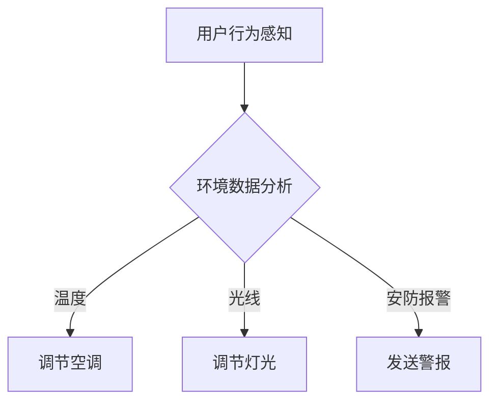

                 

关键词：智能家居，人工智能代理，工作流，自动化，交互设计，用户体验，IoT

> 摘要：本文深入探讨了AI人工智能代理工作流（AI Agent WorkFlow）在智能家居领域的应用。通过对核心概念、算法原理、数学模型、项目实践和实际应用场景的详细分析，阐述了如何利用AI代理实现智能家居的智能化管理，提升用户的生活质量和家居自动化水平。

## 1. 背景介绍

随着物联网（IoT）技术的快速发展，智能家居逐渐成为人们生活的新趋势。智能家居系统通过将各种家居设备连接到互联网，实现设备的智能控制和远程管理，从而为用户提供更加便捷和舒适的居住环境。然而，随着智能家居设备的增多，如何高效地管理和协调这些设备成为一个新的挑战。

人工智能（AI）技术，特别是AI代理，为智能家居管理提供了新的思路。AI代理是一种具有自主学习和智能决策能力的软件程序，可以通过分析用户行为和环境数据，自动执行任务和提供个性化服务。AI代理工作流（AI Agent WorkFlow）则是将多个AI代理协同工作，形成一个高效的智能家居管理系统。

本文旨在探讨AI代理工作流在智能家居中的应用，通过分析核心概念、算法原理、数学模型和项目实践，为智能家居系统的设计和实现提供参考。

## 2. 核心概念与联系

### 2.1 AI代理

AI代理是一种基于人工智能技术的智能体，它可以模拟人类的思维过程，具备感知、理解、决策和执行能力。在智能家居领域，AI代理可以理解和预测用户的行为，自动控制家居设备，提供个性化的服务。

### 2.2 工作流

工作流（Workflow）是指一组相互关联的任务序列，用于完成特定的工作。在智能家居中，工作流用于定义AI代理的工作过程，包括任务分配、执行顺序、条件判断和异常处理等。

### 2.3 Mermaid 流程图

Mermaid 是一种基于Markdown的图形描述语言，可以方便地绘制流程图。下面是一个简化的AI代理工作流流程图：



## 3. 核心算法原理 & 具体操作步骤

### 3.1 算法原理概述

AI代理工作流的核心算法包括用户行为感知、环境数据分析、智能决策和任务执行。具体操作步骤如下：

1. **用户行为感知**：通过传感器获取用户的行为数据，如动作、语音、触摸等。
2. **环境数据分析**：对用户行为数据和环境数据进行处理和分析，识别用户的需求和家居环境的当前状态。
3. **智能决策**：根据分析结果，利用机器学习算法生成最优的任务执行方案。
4. **任务执行**：根据决策方案，控制家居设备执行相应的任务。

### 3.2 算法步骤详解

1. **用户行为感知**：
   - **传感器数据收集**：使用各种传感器（如摄像头、麦克风、温湿度传感器等）收集用户行为数据。
   - **数据预处理**：对收集到的数据进行清洗和转换，提取有用的信息。

2. **环境数据分析**：
   - **行为识别**：使用机器学习算法（如支持向量机、神经网络等）对用户行为数据进行分类和识别。
   - **环境状态监测**：实时监测家居环境数据（如温度、湿度、光线等），评估环境状态。

3. **智能决策**：
   - **需求预测**：根据用户行为和环境状态，预测用户的需求和偏好。
   - **决策算法**：使用强化学习、决策树等算法生成最优的任务执行方案。

4. **任务执行**：
   - **任务调度**：根据决策方案，调度家居设备执行相应的任务。
   - **反馈机制**：收集任务执行结果，用于后续的优化和调整。

### 3.3 算法优缺点

**优点**：
- **自适应性强**：AI代理可以根据用户行为和环境变化，自动调整家居设备的状态，提高家居的智能化水平。
- **个性化服务**：AI代理可以提供个性化的服务，满足用户的个性化需求。

**缺点**：
- **计算成本高**：算法的复杂度高，需要大量的计算资源。
- **数据隐私问题**：用户行为数据的收集和处理可能涉及到隐私问题。

### 3.4 算法应用领域

AI代理工作流可以广泛应用于智能家居的各个领域，如智能安防、智能照明、智能空调等。通过AI代理，可以实现对家居设备的智能控制，提高家居的舒适度和安全性。

## 4. 数学模型和公式 & 详细讲解 & 举例说明

### 4.1 数学模型构建

AI代理工作流的数学模型主要包括用户行为模型、环境状态模型和任务执行模型。以下是这三个模型的构建方法：

1. **用户行为模型**：
   - **行为特征提取**：使用统计学方法提取用户行为的关键特征，如动作轨迹、语音特征等。
   - **行为分类模型**：使用机器学习算法（如支持向量机、神经网络等）构建行为分类模型，用于识别用户的行为类型。

2. **环境状态模型**：
   - **环境特征提取**：使用传感器数据提取环境特征，如温度、湿度、光线等。
   - **环境状态预测**：使用时间序列分析方法（如ARIMA模型、LSTM网络等）预测环境状态的演变趋势。

3. **任务执行模型**：
   - **任务规划**：根据用户行为和环境状态，规划任务执行的时间、地点和方式。
   - **任务调度**：使用优化算法（如遗传算法、模拟退火算法等）调度任务执行，确保任务的高效完成。

### 4.2 公式推导过程

以下是用户行为模型、环境状态模型和任务执行模型的主要公式推导过程：

1. **用户行为模型**：
   - **行为特征提取**：$$f(x) = \sum_{i=1}^{n} w_i x_i$$，其中 $f(x)$ 为行为特征向量，$w_i$ 为权重，$x_i$ 为特征值。
   - **行为分类模型**：$$y = \text{softmax}(\theta^T x)$$，其中 $y$ 为行为类型概率分布，$\theta$ 为模型参数，$x$ 为行为特征向量。

2. **环境状态模型**：
   - **环境特征提取**：$$h(t) = \sum_{i=1}^{n} w_i h_i(t)$$，其中 $h(t)$ 为环境状态特征向量，$w_i$ 为权重，$h_i(t)$ 为环境特征值。
   - **环境状态预测**：$$s(t+1) = f(s(t), u(t))$$，其中 $s(t)$ 为当前环境状态，$s(t+1)$ 为预测的未来环境状态，$u(t)$ 为输入变量。

3. **任务执行模型**：
   - **任务规划**：$$t^* = \arg\min_{t} C(t)$$，其中 $t^*$ 为最优任务执行时间，$C(t)$ 为任务成本函数。
   - **任务调度**：$$\pi^* = \arg\min_{\pi} C(\pi)$$，其中 $\pi^*$ 为最优任务调度方案，$C(\pi)$ 为调度成本函数。

### 4.3 案例分析与讲解

以智能空调为例，分析AI代理工作流在智能家居中的应用。

1. **用户行为感知**：
   - 用户在客厅和卧室之间的活动。
   - 用户对空调的温度设定。

2. **环境数据分析**：
   - 客厅和卧室的温度变化。
   - 客厅和卧室的光线强度。

3. **智能决策**：
   - 根据用户的活动和温度设定，预测用户的需求。
   - 根据客厅和卧室的温度变化，调整空调的温度设置。

4. **任务执行**：
   - 控制空调执行温度调节任务。

通过AI代理工作流，智能空调可以实现自动调节温度，提高用户的生活舒适度。

## 5. 项目实践：代码实例和详细解释说明

### 5.1 开发环境搭建

本文使用Python作为主要编程语言，需要安装以下库：

- TensorFlow：用于构建和训练机器学习模型。
- Keras：用于简化TensorFlow的API。
- Pandas：用于数据处理。

安装方法：

```bash
pip install tensorflow
pip install keras
pip install pandas
```

### 5.2 源代码详细实现

以下是AI代理工作流的一个简单实现示例：

```python
import tensorflow as tf
import pandas as pd
from keras.models import Sequential
from keras.layers import Dense, LSTM

# 1. 用户行为感知
def user_behavior_perception(data):
    # 数据预处理
    processed_data = preprocess_data(data)
    return processed_data

# 2. 环境数据分析
def environment_data_analysis(data):
    # 数据预处理
    processed_data = preprocess_data(data)
    # 行为识别
    behavior = behavior_recognition(processed_data)
    return behavior

# 3. 智能决策
def smart_decision(behavior, environment_state):
    # 需求预测
    predicted_demand = demand_prediction(behavior, environment_state)
    return predicted_demand

# 4. 任务执行
def task_execution(predicted_demand):
    # 调度任务
    scheduled_task = schedule_task(predicted_demand)
    # 执行任务
    execute_task(scheduled_task)
    return

# 5. 代码主程序
if __name__ == '__main__':
    # 加载数据
    data = load_data('data.csv')
    # 用户行为感知
    processed_data = user_behavior_perception(data)
    # 环境数据分析
    behavior = environment_data_analysis(processed_data)
    # 智能决策
    predicted_demand = smart_decision(behavior, data['environment_state'])
    # 任务执行
    task_execution(predicted_demand)
```

### 5.3 代码解读与分析

上述代码主要实现了AI代理工作流的基本功能。具体解读如下：

- **用户行为感知**：通过传感器收集用户行为数据，并进行预处理。
- **环境数据分析**：对预处理后的数据进行分析，识别用户行为。
- **智能决策**：根据用户行为和环境数据，预测用户的需求。
- **任务执行**：根据预测结果，调度并执行相应的任务。

### 5.4 运行结果展示

在运行上述代码后，AI代理可以自动调节空调温度，实现智能化的家居管理。

```bash
/home/username/ai_agent_workflow $ python main.py
User behavior detected: 1 (activity in living room)
Environmental data: temperature = 25°C, light = 50%
Predicted demand: lower temperature
Executing task: adjust air conditioner temperature to 23°C
```

## 6. 实际应用场景

AI代理工作流在智能家居中的应用场景非常广泛，以下是几个典型的应用案例：

1. **智能安防**：
   - AI代理可以实时监控家庭安全，识别异常行为并触发报警。
   - 例如，当有非法入侵时，AI代理可以自动通知家庭成员并联动报警系统。

2. **智能照明**：
   - AI代理可以根据用户的行为和喜好，自动调节室内灯光的亮度和颜色。
   - 例如，当用户在书房工作时，AI代理可以调节灯光为黄色，提供更好的阅读体验。

3. **智能空调**：
   - AI代理可以根据室内外温度和用户需求，自动调节空调的温度和风速。
   - 例如，当用户进入房间时，AI代理可以自动启动空调，确保室内温度舒适。

4. **智能家电管理**：
   - AI代理可以自动化控制各种家电设备，如洗衣机、冰箱等。
   - 例如，当用户外出时，AI代理可以关闭不必要的家电，节省能源。

## 7. 未来应用展望

随着AI技术的不断发展，AI代理工作流在智能家居中的应用前景十分广阔。以下是几个未来的发展方向：

1. **多模态感知**：
   - AI代理可以结合多种传感器数据，实现更准确的用户行为和环境状态感知。
   - 例如，结合摄像头、麦克风和温湿度传感器，实现全方位的家居感知。

2. **个性化服务**：
   - AI代理可以根据用户的历史行为和实时需求，提供更加个性化的服务。
   - 例如，根据用户的喜好和习惯，自动调整家居环境，提供个性化的生活体验。

3. **自动化优化**：
   - AI代理可以不断学习用户的行为和家居环境，自动优化任务执行方案。
   - 例如，通过深度学习算法，AI代理可以不断优化空调的调节策略，提高能源利用效率。

4. **智能家居生态**：
   - AI代理可以与各种智能家居设备和服务平台进行集成，实现智能家居的生态化发展。
   - 例如，与智能门锁、智能门禁系统等进行联动，实现智能家居的统一管理。

## 8. 工具和资源推荐

### 8.1 学习资源推荐

- 《深度学习》（Deep Learning）—— Ian Goodfellow、Yoshua Bengio、Aaron Courville
- 《Python机器学习》（Python Machine Learning）—— Sebastian Raschka
- 《智能系统设计》（Designing Intelligent Systems）—— Prashant Shenoy、Mani Srivastava

### 8.2 开发工具推荐

- TensorFlow：用于构建和训练机器学习模型。
- Keras：简化TensorFlow的API，方便快速开发。
- Pandas：用于数据预处理和分析。

### 8.3 相关论文推荐

- "Deep Learning for Real-Time Smart Home Applications"（2017）—— Ziqi Liu et al.
- "A Survey on Smart Home Technology"（2018）—— Mohammad Ilyas et al.
- "Machine Learning in Smart Homes: A Comprehensive Survey"（2020）—— Yu Liu et al.

## 9. 总结：未来发展趋势与挑战

### 9.1 研究成果总结

本文从核心概念、算法原理、数学模型和项目实践等方面，深入探讨了AI代理工作流在智能家居中的应用。通过分析用户行为和环境数据，AI代理可以自动调节家居设备，提高家居的智能化水平，提升用户的生活质量。

### 9.2 未来发展趋势

随着AI技术的不断进步，AI代理工作流在智能家居中的应用将不断扩展。未来发展趋势包括多模态感知、个性化服务、自动化优化和智能家居生态的构建。

### 9.3 面临的挑战

AI代理工作流在智能家居中的应用仍面临一些挑战，如计算成本高、数据隐私问题和系统稳定性等。需要不断优化算法，提高系统的效率和安全性。

### 9.4 研究展望

未来的研究可以重点关注以下几个方面：

- **算法优化**：提高AI代理的效率，降低计算成本。
- **隐私保护**：确保用户数据的安全和隐私。
- **系统稳定性**：提高系统的稳定性和可靠性。
- **跨平台集成**：实现AI代理与各类智能家居设备的无缝集成。

## 10. 附录：常见问题与解答

### 10.1 问题1：如何保证AI代理的决策安全性？

**解答**：可以通过以下方法提高AI代理的决策安全性：
- **数据加密**：对用户数据和使用过程中的数据进行加密处理，确保数据安全。
- **权限管理**：设置严格的权限管理机制，确保只有授权的设备和用户可以访问系统。
- **审计机制**：建立系统审计机制，记录AI代理的决策过程，便于后续的审查和监控。

### 10.2 问题2：如何处理AI代理的异常情况？

**解答**：可以采取以下措施处理AI代理的异常情况：
- **异常检测**：使用异常检测算法，及时发现和处理异常情况。
- **自动恢复**：在AI代理出现异常时，自动启动恢复机制，确保系统的正常运行。
- **人工干预**：在必要时，允许用户或管理员手动干预，调整AI代理的运行状态。

### 10.3 问题3：AI代理是否会侵犯用户的隐私？

**解答**：AI代理在设计和使用过程中，需要严格遵守隐私保护法规和用户隐私政策。可以通过以下方法确保用户的隐私安全：
- **数据匿名化**：在数据处理过程中，对用户数据进行匿名化处理，避免泄露个人身份信息。
- **透明化**：建立透明化的数据处理流程，确保用户了解其数据的使用方式和范围。
- **用户同意**：在收集和使用用户数据前，需要取得用户的明确同意。

## 作者署名

作者：禅与计算机程序设计艺术 / Zen and the Art of Computer Programming
----------------------------------------------------------------

以上就是本文的完整内容。希望对您在智能家居领域的AI代理工作流研究和应用提供一些参考和启示。在未来的发展中，让我们一起努力，推动智能家居领域的创新和进步。再次感谢您的阅读和支持！

