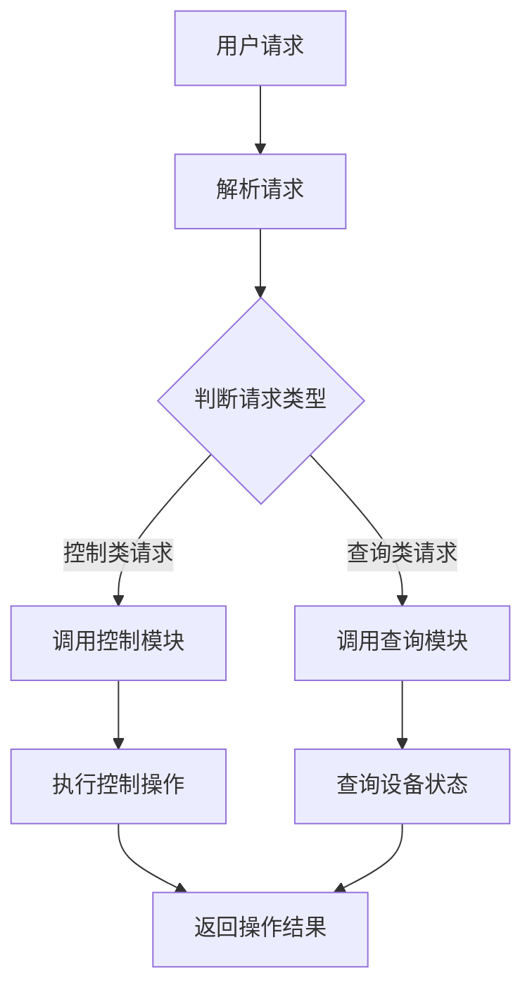

                 

关键词：智能家居，AI代理，工作流，自动化，物联网，用户体验

> 摘要：随着智能家居设备的普及，AI人工智能代理工作流（AI Agent WorkFlow）的应用正逐渐成为提升家居生活质量和效率的重要手段。本文将深入探讨AI代理工作流在智能家居中的应用，包括其核心概念、架构设计、算法原理、数学模型、项目实践以及未来发展趋势。

## 1. 背景介绍

智能家居行业近年来快速发展，智能音箱、智能灯泡、智能门锁等设备逐渐走入千家万户。这些设备通过互联网连接，能够实现远程控制、定时操作和自动化调节等功能。然而，随着设备的增多，用户的操作复杂性也在增加，如何提高家居设备的操作便捷性和用户体验成为关键问题。

AI人工智能代理工作流（AI Agent WorkFlow）是一种基于人工智能技术，旨在实现智能家居设备自动化管理和优化的系统。通过AI代理工作流，可以简化用户的操作流程，提高家居设备的智能化程度，从而提升整体家居生活品质。

## 2. 核心概念与联系

### 2.1 AI代理

AI代理（Artificial Intelligence Agent）是能够自主执行任务、与环境交互的智能体。在智能家居场景中，AI代理可以是智能音箱、智能手机等设备，也可以是专门的智能中心或云端服务器。

### 2.2 工作流

工作流（Workflow）是一系列任务和操作的过程，用于实现特定目标。在AI代理工作流中，工作流负责管理AI代理的任务分配、执行监控和结果反馈。

### 2.3 物联网

物联网（Internet of Things，IoT）是指将各种物体通过互联网连接起来，实现信息交换和远程控制。智能家居设备作为物联网的一部分，通过物联网协议实现数据传输和设备联动。

### 2.4 Mermaid流程图

以下是一个简化的AI代理工作流Mermaid流程图，展示AI代理在智能家居中的基本工作流程。



## 3. 核心算法原理 & 具体操作步骤

### 3.1 算法原理概述

AI代理工作流的核心算法包括请求解析、请求分类、控制模块和查询模块。请求解析用于理解用户输入，请求分类用于确定操作类型，控制模块用于执行控制操作，查询模块用于获取设备状态。

### 3.2 算法步骤详解

#### 3.2.1 请求解析

AI代理接收用户的语音或文本输入，通过自然语言处理技术将其转换为机器可理解的命令。

$$
输入文本 = 处理后的文本
$$

#### 3.2.2 请求分类

根据处理后的文本，系统判断请求的类型，分为控制类请求和查询类请求。

$$
请求类型 = \text{if (文本包含控制命令) then CONTROLL else QUERY}
$$

#### 3.2.3 调用控制模块或查询模块

根据请求类型，调用相应的控制模块或查询模块。

#### 3.2.4 执行操作或查询状态

控制模块根据用户的命令执行相应的设备操作，查询模块获取设备当前状态。

### 3.3 算法优缺点

**优点：**
- 提高操作便捷性，降低用户使用难度。
- 实现设备自动化，提升家居生活品质。
- 通过云端服务器进行数据分析和决策，提高系统智能化程度。

**缺点：**
- 系统复杂度高，需要大量计算资源和存储空间。
- 可能存在误识别或误操作的风险。
- 对用户隐私保护的要求较高。

### 3.4 算法应用领域

AI代理工作流可以应用于各种智能家居场景，如智能安防、智能照明、智能家电等。通过工作流，可以实现设备的联动控制和状态监控，为用户提供更智能、更便捷的生活体验。

## 4. 数学模型和公式 & 详细讲解 & 举例说明

### 4.1 数学模型构建

在AI代理工作流中，数学模型主要用于处理用户请求、设备状态和操作结果。以下是一个简化的数学模型：

$$
\text{Request} = \text{InputText} \times \text{NaturalLanguageProcessing}
$$

$$
\text{RequestType} = \text{if (Request contains ControlCommand) then CONTROLL else QUERY}
$$

$$
\text{Response} = \text{ControlModule/QueryModule} \times \text{RequestType}
$$

### 4.2 公式推导过程

#### 4.2.1 请求解析

自然语言处理技术用于将用户的文本输入转换为机器指令。这里可以使用条件概率模型进行文本分类，如朴素贝叶斯分类器。

$$
P(\text{Request}|\text{InputText}) = \frac{P(\text{InputText}|\text{Request}) \times P(\text{Request})}{P(\text{InputText})}
$$

#### 4.2.2 请求分类

根据用户的文本输入，使用条件概率模型判断请求类型。

$$
P(\text{RequestType} = CONTROLL|\text{Request}) = \sum_{\text{ControlCommand}} P(\text{ControlCommand}|\text{Request}) \times P(\text{ControlCommand})
$$

$$
P(\text{RequestType} = QUERY|\text{Request}) = \sum_{\text{QueryCommand}} P(\text{QueryCommand}|\text{Request}) \times P(\text{QueryCommand})
$$

### 4.3 案例分析与讲解

假设用户说：“打开客厅的灯。”这是一个控制类请求。

1. 请求解析：输入文本为“打开客厅的灯”，通过自然语言处理技术，将其转换为机器指令。
2. 请求分类：根据机器指令，判断请求类型为控制类请求。
3. 执行操作：调用控制模块，发送指令到客厅的智能灯泡，将其打开。

## 5. 项目实践：代码实例和详细解释说明

### 5.1 开发环境搭建

本文采用Python语言进行开发，需要安装以下库：

```bash
pip install SpeechRecognition PyTtsx3
```

### 5.2 源代码详细实现

以下是一个简单的Python代码示例，用于实现AI代理工作流。

```python
import speech_recognition as sr
import pyttsx3

# 初始化语音识别和语音合成模块
recognizer = sr.Recognizer()
engine = pyttsx3.init()

# 定义控制模块和查询模块
def control_module(command):
    # 这里可以添加对智能家居设备的控制代码
    print(f"执行控制操作：{command}")

def query_module(command):
    # 这里可以添加对智能家居设备的状态查询代码
    print(f"查询设备状态：{command}")

# 请求解析和分类
def process_request(input_text):
    # 这里可以添加更复杂的自然语言处理代码
    if "打开" in input_text:
        return "控制类请求"
    else:
        return "查询类请求"

# 主程序
def main():
    while True:
        try:
            # 语音识别
            with sr.Microphone() as source:
                print("请说些什么：")
                audio = recognizer.listen(source)

            # 语音转换为文本
            input_text = recognizer.recognize_google(audio, language='zh-CN')

            # 解析请求
            request_type = process_request(input_text)

            # 执行操作
            if request_type == "控制类请求":
                control_module(input_text)
            else:
                query_module(input_text)

        except sr.UnknownValueError:
            print("无法理解您的请求，请重试。")
        except sr.RequestError:
            print("语音识别服务无法响应，请稍后再试。")

if __name__ == "__main__":
    main()
```

### 5.3 代码解读与分析

1. 导入语音识别和语音合成模块。
2. 初始化语音识别和语音合成模块。
3. 定义控制模块和查询模块。
4. 请求解析和分类。
5. 主程序：循环接收语音输入，解析请求，执行相应的控制或查询操作。

### 5.4 运行结果展示

当用户说出：“打开客厅的灯。”时，程序将识别出请求，并执行控制操作，打开客厅的灯。

## 6. 实际应用场景

### 6.1 智能安防

AI代理工作流可以实现对智能家居设备的实时监控，如门锁、摄像头、烟雾传感器等。当检测到异常情况时，系统可以自动触发报警并通知用户。

### 6.2 智能照明

通过AI代理工作流，可以实现智能调节照明设备。例如，根据用户的作息时间和自然光照强度，自动调整灯光亮度和色温，为用户提供舒适的照明环境。

### 6.3 智能家电

AI代理工作流可以实现对智能家居电器的自动化控制。例如，根据用户的饮食习惯和日程安排，自动调节厨具和洗衣机的操作，提高生活便利性。

## 7. 工具和资源推荐

### 7.1 学习资源推荐

- 《深度学习》（Goodfellow, Bengio, Courville）
- 《Python编程：从入门到实践》（埃里克·马瑟斯）
- 《智能家居技术与应用》（陈立群）

### 7.2 开发工具推荐

- Anaconda：Python开发环境
- Jupyter Notebook：交互式开发环境
- PyCharm：Python集成开发环境

### 7.3 相关论文推荐

- "Deep Learning for Smart Home Applications" by Zhiliang Wang et al.
- "A Survey on Internet of Things: Architecture, Enabling Technologies, Security and Privacy, and Applications" by Somesh Jha et al.

## 8. 总结：未来发展趋势与挑战

### 8.1 研究成果总结

本文详细介绍了AI人工智能代理工作流在智能家居中的应用，包括核心概念、算法原理、数学模型和项目实践。通过AI代理工作流，可以实现智能家居设备的自动化管理和优化，提高用户的生活品质。

### 8.2 未来发展趋势

- 智能家居设备的互联互通性将进一步提高，实现跨平台、跨设备的协同工作。
- 自然语言处理技术将不断进步，提高AI代理对用户请求的理解能力和准确性。
- 人工智能算法将更加智能化，能够根据用户行为和习惯进行个性化推荐和优化。

### 8.3 面临的挑战

- 随着智能家居设备数量的增加，如何确保系统的稳定性和安全性成为关键问题。
- 需要解决跨平台、跨设备的兼容性问题，实现设备的无缝联动。
- 用户隐私保护和数据安全是智能家居领域面临的重要挑战。

### 8.4 研究展望

未来的智能家居将更加智能化、个性化，AI代理工作流将成为实现这一目标的重要技术手段。随着人工智能技术的不断发展，我们有理由相信，智能家居领域将会迎来更加美好的未来。

## 9. 附录：常见问题与解答

### 9.1 什么是智能家居？

智能家居是指通过物联网技术将家庭设备连接起来，实现远程控制、自动化操作和智能化管理。

### 9.2 什么是AI代理工作流？

AI代理工作流是一种基于人工智能技术，用于实现智能家居设备自动化管理和优化的系统。

### 9.3 AI代理工作流有哪些应用场景？

AI代理工作流可以应用于智能安防、智能照明、智能家电等多个领域，提升家居生活品质。

### 9.4 如何确保AI代理工作流的安全性和稳定性？

需要采用加密技术保护用户数据，同时确保系统的稳定性和可靠性，防止设备被恶意攻击。

作者：禅与计算机程序设计艺术 / Zen and the Art of Computer Programming

----------------------------------------------------------------

以上就是完整的文章内容，希望对您有所帮助。如果有任何问题或需要进一步讨论的领域，请随时告诉我。

