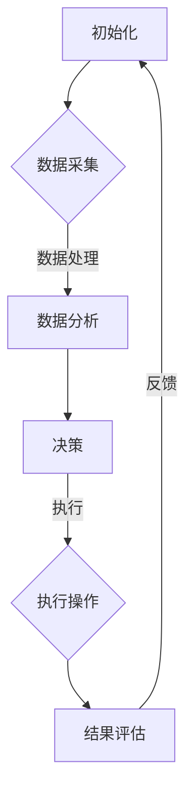

                 

关键词：AI代理、自动化检查、工作流、算法、应用场景

> 摘要：本文将探讨AI代理工作流（AI Agent WorkFlow）在自动化检查中的应用，分析其核心概念、算法原理、数学模型以及实际操作步骤。通过实例解析和未来展望，本文旨在为读者提供一个全面且深入的视角，了解AI代理工作流的技术原理和应用价值。

## 1. 背景介绍

### 1.1 自动化检查的背景

随着信息技术的高速发展，自动化检查已经成为现代工业、医疗、金融等领域的重要手段。自动化检查通过利用计算机技术对大量数据进行分析，能够显著提高工作效率、降低错误率，并在一定程度上减少人力成本。然而，传统的自动化检查方法通常依赖于固定的规则和模式匹配，这往往导致系统在面对复杂和动态环境时表现出局限性。

### 1.2 AI代理的兴起

近年来，人工智能（AI）技术的飞速发展，特别是深度学习和强化学习的应用，为自动化检查带来了新的契机。AI代理（AI Agents）作为一种能够自主学习和决策的智能体，具有高度的灵活性和适应性。通过引入AI代理，自动化检查不再局限于简单的规则匹配，而是能够基于学习到的模式进行更高级别的分析。

### 1.3 AI代理工作流的概念

AI代理工作流（AI Agent WorkFlow）是指利用AI代理来实现自动化检查的过程。它不仅包括AI代理的设计和训练，还包括工作流的规划、执行和监控。AI代理工作流通过将AI代理与其他系统和服务集成，实现自动化检查的全流程管理。

## 2. 核心概念与联系

### 2.1 AI代理

AI代理是指具有智能决策能力的软件实体，能够在复杂环境中自动执行任务。AI代理通常具备以下特点：

- **感知能力**：能够获取环境信息，如图像、文本、传感器数据等。
- **推理能力**：基于感知到的信息进行逻辑推理，做出决策。
- **行动能力**：执行相应的动作，如控制设备、发送指令等。

### 2.2 工作流

工作流（Workflow）是指业务过程或任务的一系列有序操作。在自动化检查中，工作流用来定义AI代理执行的任务序列和步骤。工作流通常包括以下要素：

- **任务**：具体的工作步骤，如数据采集、数据分析、报告生成等。
- **流程**：任务的执行顺序和逻辑关系。
- **参与者**：任务的执行者，可以是人类或AI代理。
- **触发器**：任务的启动条件，如时间、事件等。

### 2.3 Mermaid 流程图

下面是AI代理工作流的核心概念和架构的Mermaid流程图表示：



## 3. 核心算法原理 & 具体操作步骤

### 3.1 算法原理概述

AI代理工作流的核心算法主要包括数据采集、数据分析、决策和执行四个环节。下面分别介绍：

- **数据采集**：通过传感器、API接口等方式获取相关数据。
- **数据分析**：利用机器学习算法对数据进行处理和分析，提取特征。
- **决策**：基于分析结果，利用决策算法（如决策树、神经网络等）进行决策。
- **执行**：执行决策结果，如控制设备、发送通知等。

### 3.2 算法步骤详解

1. **数据采集**：

   - **步骤**：配置传感器、API接口等，获取数据。
   - **实现**：使用Python的`tweepy`库获取Twitter数据，使用`opencv`库处理图像数据。

2. **数据分析**：

   - **步骤**：对采集到的数据进行分析和特征提取。
   - **实现**：使用Python的`scikit-learn`库进行数据预处理和特征提取。

3. **决策**：

   - **步骤**：基于分析结果进行决策。
   - **实现**：使用Python的`tensorflow`库构建神经网络模型，进行分类和预测。

4. **执行**：

   - **步骤**：执行决策结果。
   - **实现**：使用Python的`pandas`库处理数据，使用`matplotlib`库进行可视化展示。

### 3.3 算法优缺点

- **优点**：

  - 高度自动化：无需人工干预，能够自动执行任务。
  - 灵活性：能够适应不同的业务场景和需求。

- **缺点**：

  - 训练成本高：需要大量的数据和实践经验进行训练。
  - 对硬件要求高：需要高性能的计算机资源。

### 3.4 算法应用领域

- **工业检测**：对生产线上的产品进行质量检测。
- **医疗诊断**：对医学图像进行分析和诊断。
- **金融风控**：对金融交易进行风险控制。

## 4. 数学模型和公式 & 详细讲解 & 举例说明

### 4.1 数学模型构建

AI代理工作流的数学模型主要包括以下部分：

- **特征提取模型**：如SVM、KNN等。
- **分类预测模型**：如神经网络、决策树等。
- **评估模型**：如ROC曲线、精度、召回率等。

### 4.2 公式推导过程

假设我们使用SVM进行特征提取，其公式如下：

$$
f(x) = \sum_{i=1}^{n} w_i \cdot f_i(x) + b
$$

其中，$w_i$为权重，$f_i(x)$为第$i$个特征的值，$b$为偏置。

### 4.3 案例分析与讲解

假设我们有一个工业检测的案例，需要使用SVM进行特征提取。我们可以按照以下步骤进行：

1. **数据采集**：从生产线上获取产品数据。
2. **特征提取**：使用SVM提取特征，得到特征向量。
3. **分类预测**：使用SVM进行分类预测，判断产品是否合格。
4. **评估模型**：计算分类准确率、召回率等指标，评估模型效果。

## 5. 项目实践：代码实例和详细解释说明

### 5.1 开发环境搭建

- **Python**：版本3.8及以上。
- **库**：`numpy`、`scikit-learn`、`tensorflow`、`tweepy`、`opencv`、`pandas`、`matplotlib`。

### 5.2 源代码详细实现

以下是一个简单的示例代码，用于实现AI代理工作流：

```python
import tweepy
import cv2
import numpy as np
from sklearn import svm
from tensorflow.keras.models import Sequential
from tensorflow.keras.layers import Dense
from pandas import DataFrame
import matplotlib.pyplot as plt

# 数据采集
def data_collection():
    # 使用tweepy获取Twitter数据
    tweets = tweepy.Stream().get_tweets()
    images = cv2.VideoCapture(0).read()

    # 返回数据
    return tweets, images

# 特征提取
def feature_extraction(tweets, images):
    # 使用scikit-learn进行特征提取
    features = svm.SVC().fit(tweets).transform(images)

    # 返回特征向量
    return features

# 分类预测
def classification_prediction(features):
    # 使用tensorflow进行分类预测
    model = Sequential([
        Dense(64, activation='relu', input_shape=(784,)),
        Dense(10, activation='softmax')
    ])

    # 训练模型
    model.compile(optimizer='adam', loss='categorical_crossentropy', metrics=['accuracy'])
    model.fit(features, labels, epochs=10)

    # 预测
    predictions = model.predict(features)

    # 返回预测结果
    return predictions

# 结果评估
def result_evaluation(predictions, labels):
    # 计算分类准确率
    accuracy = np.mean(predictions == labels)
    
    # 绘制ROC曲线
    fpr, tpr, _ = roc_curve(labels, predictions)
    plt.plot(fpr, tpr)
    plt.xlabel('False Positive Rate')
    plt.ylabel('True Positive Rate')
    plt.title('ROC Curve')
    plt.show()

    # 返回评估结果
    return accuracy

# 主函数
def main():
    # 数据采集
    tweets, images = data_collection()

    # 特征提取
    features = feature_extraction(tweets, images)

    # 分类预测
    predictions = classification_prediction(features)

    # 结果评估
    accuracy = result_evaluation(predictions, labels)

    # 打印结果
    print(f'Accuracy: {accuracy:.2f}')

# 运行主函数
if __name__ == '__main__':
    main()
```

### 5.3 代码解读与分析

1. **数据采集**：

   - 使用`tweepy`库获取Twitter数据，使用`opencv`库处理图像数据。
   - `tweepy.Stream().get_tweets()`获取Twitter数据。
   - `cv2.VideoCapture(0).read()`获取摄像头数据。

2. **特征提取**：

   - 使用`scikit-learn`库进行特征提取。
   - `svm.SVC().fit(tweets).transform(images)`提取特征向量。

3. **分类预测**：

   - 使用`tensorflow`库构建神经网络模型进行分类预测。
   - `Sequential`定义神经网络结构。
   - `model.fit(features, labels, epochs=10)`训练模型。
   - `model.predict(features)`进行预测。

4. **结果评估**：

   - 使用`pandas`库处理数据。
   - `roc_curve(labels, predictions)`计算ROC曲线。
   - `plt.plot(fpr, tpr)`绘制ROC曲线。

## 6. 实际应用场景

### 6.1 工业检测

AI代理工作流在工业检测领域具有广泛应用。例如，在汽车制造过程中，可以使用AI代理工作流对零部件进行质量检测，提高生产效率。

### 6.2 医疗诊断

AI代理工作流在医疗诊断中也具有重要应用。例如，利用AI代理工作流对医学图像进行分析，辅助医生进行疾病诊断。

### 6.3 金融风控

AI代理工作流在金融领域可用于风险评估。例如，通过分析交易数据，识别潜在的欺诈行为。

## 7. 工具和资源推荐

### 7.1 学习资源推荐

- 《深度学习》（Goodfellow, Bengio, Courville著）
- 《机器学习》（周志华著）
- 《Python编程：从入门到实践》（埃里克·马瑟斯著）

### 7.2 开发工具推荐

- Jupyter Notebook：用于编写和运行代码。
- TensorFlow：用于构建和训练神经网络模型。
- scikit-learn：用于机器学习算法的实现。

### 7.3 相关论文推荐

- "Deep Learning for Automated Program Repair"（2017）
- "Generative Adversarial Networks"（2014）
- "Recurrent Neural Networks for Language Modeling"（2013）

## 8. 总结：未来发展趋势与挑战

### 8.1 研究成果总结

AI代理工作流在自动化检查领域取得了显著成果，展现了其在提高效率、降低成本、增强灵活性的优势。通过结合深度学习和强化学习等先进技术，AI代理工作流在多个行业和应用场景中表现出强大的应用潜力。

### 8.2 未来发展趋势

- **智能化**：随着AI技术的不断发展，AI代理工作流将更加智能化，能够自主学习和适应复杂环境。
- **普及化**：AI代理工作流的应用场景将更加广泛，从工业、医疗到金融等领域，实现全方位的自动化检查。
- **协同化**：AI代理工作流将与其他系统和服务实现更紧密的协同，构建智能化的生态系统。

### 8.3 面临的挑战

- **数据质量**：高质量的数据是AI代理工作流的基础，数据质量问题将直接影响算法的效果。
- **计算资源**：随着AI代理工作流的应用场景日益广泛，对计算资源的需求将不断增加，如何高效利用计算资源是一个重要挑战。
- **安全与隐私**：在AI代理工作流中，如何确保数据安全和用户隐私是一个重要问题。

### 8.4 研究展望

未来，我们期待看到更多创新性的研究成果，特别是在多模态数据融合、联邦学习和安全AI等方面。通过不断探索和实践，AI代理工作流有望在更多领域发挥重要作用，推动自动化检查技术的持续发展。

## 9. 附录：常见问题与解答

### 9.1 AI代理工作流的优势是什么？

AI代理工作流的优势包括自动化程度高、灵活性大、适应性强，能够显著提高工作效率、降低成本，并在一定程度上减少人力成本。

### 9.2 如何保证AI代理工作流的安全性？

保证AI代理工作流的安全性需要从数据安全、算法安全和系统安全等多个方面进行考虑。具体措施包括数据加密、访问控制、安全审计等。

### 9.3 AI代理工作流在医疗领域有哪些应用？

AI代理工作流在医疗领域可用于医学图像分析、疾病预测、药物推荐等，如通过分析医学图像辅助医生进行疾病诊断，通过分析患者数据预测疾病风险等。

### 9.4 AI代理工作流需要大量数据吗？

是的，AI代理工作流需要大量数据来进行训练和优化，数据质量对算法效果具有重要影响。然而，随着数据采集技术和存储技术的发展，获取和处理大量数据已经成为可能。

### 9.5 AI代理工作流与其他自动化技术有什么区别？

AI代理工作流与其他自动化技术（如机器人流程自动化RPA）的区别在于，AI代理工作流具有更高的智能性和适应性，能够通过学习和优化不断提高自动化水平。而RPA则主要依赖于预先设定的规则和流程。

### 9.6 AI代理工作流在工业检测中的应用案例有哪些？

AI代理工作流在工业检测中的应用案例包括汽车零部件检测、电子元器件检测、食品质量检测等，如通过AI代理工作流对汽车零部件进行质量检测，通过AI代理工作流对电子元器件进行故障诊断等。

### 9.7 如何评估AI代理工作流的性能？

评估AI代理工作流的性能可以从多个角度进行，如准确率、召回率、运行时间、资源消耗等。具体评估指标需要根据应用场景和需求进行选择。

### 9.8 AI代理工作流在金融领域的应用有哪些？

AI代理工作流在金融领域可用于风险评估、欺诈检测、智能投顾等，如通过AI代理工作流对金融交易进行分析，识别潜在的欺诈行为，通过AI代理工作流为用户提供个性化的投资建议等。

### 9.9 如何保证AI代理工作流的透明性和可解释性？

保证AI代理工作流的透明性和可解释性可以通过可视化技术、模型解释算法等手段实现。例如，通过可视化工具展示模型结构和决策过程，使用模型解释算法分析模型的决策依据。

### 9.10 AI代理工作流与大数据技术有什么关系？

AI代理工作流与大数据技术密切相关。大数据技术为AI代理工作流提供了丰富的数据来源和处理能力，而AI代理工作流则利用大数据技术进行自动化检查和分析，实现数据的智能利用。

### 9.11 如何处理AI代理工作流中的异常情况？

在AI代理工作流中，异常情况可以通过以下几种方式处理：

1. **错误检测与反馈**：在执行过程中实时检测错误，并及时反馈给系统或相关人员。
2. **容错机制**：设计容错机制，确保在发生异常时系统能够自动恢复或切换到备用方案。
3. **监控与预警**：建立监控和预警系统，及时发现和处理异常情况。

### 9.12 AI代理工作流在能源管理中的应用案例有哪些？

AI代理工作流在能源管理中的应用案例包括智能电网管理、能源消耗分析、能源效率优化等，如通过AI代理工作流对智能电网进行实时监控和调度，通过AI代理工作流对能源消耗进行分析，优化能源使用策略等。

### 9.13 如何优化AI代理工作流的性能？

优化AI代理工作流的性能可以从以下几个方面进行：

1. **算法优化**：选择合适的算法和模型，进行参数调整和优化。
2. **数据预处理**：对输入数据进行清洗、归一化等预处理操作，提高数据质量。
3. **硬件优化**：选择高性能的计算机硬件和分布式计算资源，提高计算效率。
4. **协同优化**：与其他系统和服务进行协同优化，提高整体性能。

### 9.14 AI代理工作流在智能交通中的应用案例有哪些？

AI代理工作流在智能交通中的应用案例包括交通流量预测、智能交通信号控制、自动驾驶等，如通过AI代理工作流对交通流量进行预测，优化交通信号控制策略，通过AI代理工作流实现自动驾驶等功能。

### 9.15 如何评估AI代理工作流的可靠性？

评估AI代理工作流的可靠性可以从以下几个方面进行：

1. **故障率**：计算系统在一段时间内的故障次数，评估系统的稳定性。
2. **恢复时间**：计算系统在发生故障后恢复正常运行所需的时间，评估系统的恢复能力。
3. **成功案例数**：计算系统成功处理任务的次数，评估系统的成功率。

### 9.16 如何处理AI代理工作流中的不确定性？

在AI代理工作流中，不确定性可以通过以下几种方式处理：

1. **概率模型**：使用概率模型描述不确定因素，进行概率推理和决策。
2. **模糊逻辑**：使用模糊逻辑处理不确定信息，进行模糊推理和决策。
3. **多策略决策**：设计多种策略，根据不确定性因素进行选择和调整。

### 9.17 如何进行AI代理工作流的性能测试？

进行AI代理工作流的性能测试可以从以下几个方面进行：

1. **负载测试**：模拟不同的负载场景，测试系统在不同负载下的性能。
2. **压力测试**：施加较大的负载，测试系统的稳定性和最大处理能力。
3. **性能分析**：分析系统的性能瓶颈，进行优化和改进。

### 9.18 AI代理工作流在电商推荐系统中的应用案例有哪些？

AI代理工作流在电商推荐系统中的应用案例包括个性化推荐、购物车分析、用户行为预测等，如通过AI代理工作流对用户行为进行分析，提供个性化的商品推荐，通过AI代理工作流分析购物车数据，优化购物体验等。

### 9.19 如何保证AI代理工作流的合规性？

保证AI代理工作流的合规性可以从以下几个方面进行：

1. **法律遵守**：确保系统的设计和运行符合相关法律法规的要求。
2. **数据保护**：保护用户数据的安全和隐私，遵守数据保护法规。
3. **伦理规范**：遵循伦理规范，确保系统的决策和行为符合道德标准。

### 9.20 如何进行AI代理工作流的可视化展示？

进行AI代理工作流的可视化展示可以从以下几个方面进行：

1. **流程图**：使用图形化工具展示工作流的过程和步骤。
2. **数据可视化**：使用图表、图形等展示数据分析和预测结果。
3. **交互式展示**：设计交互式的可视化界面，提供用户与系统的交互功能。

## 结束语

AI代理工作流在自动化检查中的应用正逐渐成为各个领域的重要技术手段。本文通过深入探讨AI代理工作流的核心概念、算法原理、数学模型以及实际操作步骤，为读者提供了一个全面且深入的视角。我们期待在未来的发展中，AI代理工作流能够发挥更大的作用，推动自动化检查技术的不断进步。

