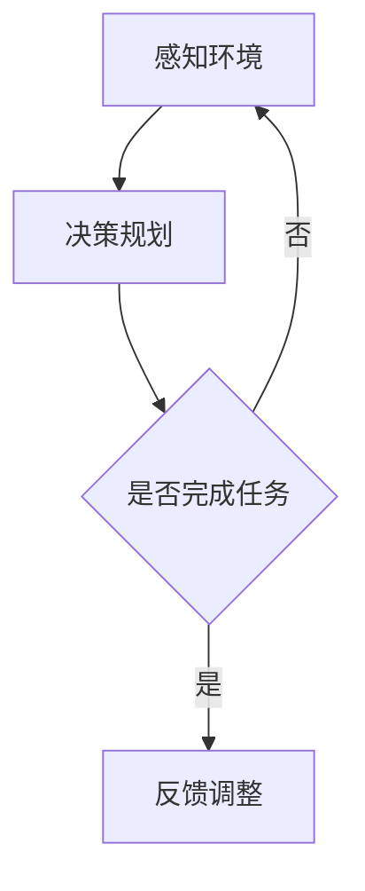
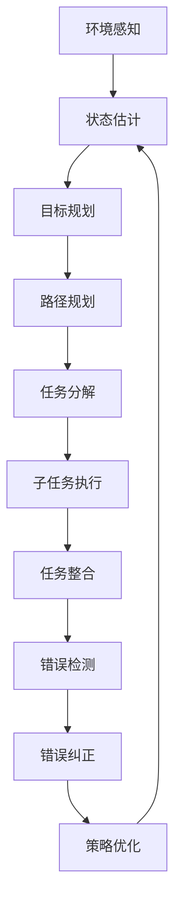

                 

### 1. 背景介绍

随着物联网（IoT）技术的迅速发展和普及，越来越多的设备和服务开始融入我们的日常生活和工作之中。物联网设备通过互联网相互连接，实现了数据的实时采集、传输和处理。这种互联互通的网络环境为人工智能（AI）技术提供了丰富的应用场景，特别是AI代理在物联网场景中的应用。

AI代理是指能够自主完成特定任务的人工智能实体，它们能够根据环境和目标进行决策和行动。在物联网场景中，AI代理可以广泛应用于智能家居、智慧城市、智能医疗、智能交通等领域，为用户提供更加智能、便捷的服务。

本文旨在探讨AI代理在物联网场景中的工作流，从核心概念、算法原理、数学模型、项目实践等方面进行全面解析，旨在为读者提供一个全面、系统的理解。文章结构如下：

## 1. 背景介绍

## 2. 核心概念与联系

## 3. 核心算法原理 & 具体操作步骤

## 4. 数学模型和公式 & 详细讲解 & 举例说明

## 5. 项目实践：代码实例和详细解释说明

## 6. 实际应用场景

## 7. 工具和资源推荐

## 8. 总结：未来发展趋势与挑战

## 9. 附录：常见问题与解答

<|assistant|>### 2. 核心概念与联系

在深入探讨AI代理工作流之前，首先需要明确几个核心概念，并了解它们之间的联系。

#### 2.1 AI代理

AI代理是具备一定智能的人工智能实体，它们能够根据环境信息和目标自主决策并执行相应的任务。AI代理的核心是智能算法，它们可以通过学习、推理和规划等方式，实现自动化、智能化的任务执行。

#### 2.2 物联网

物联网是通过网络连接的物理设备和系统的集合，它们能够实时收集、传输和处理数据。物联网的核心是传感器和网络通信技术，这使得设备之间能够实现无缝的数据交互和协同工作。

#### 2.3 物联网场景

物联网场景是指物联网技术在特定应用环境中的应用，如智能家居、智慧城市、智能医疗等。不同的物联网场景具有不同的特点和需求，这对AI代理的设计和实现提出了不同的要求。

#### 2.4 AI代理工作流

AI代理工作流是指AI代理在物联网场景中执行任务的过程，包括感知环境、决策规划、执行任务和反馈调整等步骤。一个完整的AI代理工作流能够确保代理高效、准确地完成任务。

#### 2.5 核心概念联系

AI代理、物联网、物联网场景和AI代理工作流是相互联系、相互依赖的。AI代理是物联网场景中的核心实体，它们通过物联网实现互联互通，并根据物联网场景的需求和特点，执行相应的任务。AI代理工作流则是AI代理在物联网场景中实现任务执行的关键过程，它将核心概念和物联网场景有机结合，为用户提供智能化的服务。

#### 2.6 Mermaid 流程图

为了更直观地展示AI代理工作流的核心概念和联系，我们使用Mermaid流程图进行描述。以下是一个简单的流程图示例：



在这个流程图中，AI代理首先感知环境，然后根据环境和目标进行决策规划，执行任务。如果任务完成，则进行反馈调整；否则，继续感知环境，重新进行决策规划。

<|assistant|>### 3. 核心算法原理 & 具体操作步骤

在了解AI代理工作流的核心概念和联系后，我们接下来深入探讨AI代理的核心算法原理和具体操作步骤。

#### 3.1 算法原理概述

AI代理的核心算法通常是基于机器学习、深度学习、规划算法和智能优化算法等。这些算法能够使代理在给定环境和目标下，自主学习和优化任务执行策略。

- **机器学习和深度学习**：通过训练大量数据，让代理学会识别环境特征、预测未来趋势和优化决策。
- **规划算法**：根据环境和目标，生成最优的执行路径和策略。
- **智能优化算法**：在给定约束条件下，寻找最优的执行方案，如遗传算法、粒子群优化算法等。

#### 3.2 算法步骤详解

AI代理工作流的具体操作步骤可以分为以下几个阶段：

##### 3.2.1 感知环境

AI代理首先通过传感器收集环境数据，如温度、湿度、光线强度等。这些数据将被用于环境建模和状态估计。

- **环境建模**：将环境数据转换为适合算法处理的模型，如决策树、神经网络等。
- **状态估计**：根据环境建模结果，估计当前环境的状态。

##### 3.2.2 决策规划

在感知环境的基础上，AI代理根据目标和约束条件，生成执行任务的最佳策略。这一阶段的关键是目标规划和路径规划。

- **目标规划**：根据环境和目标，确定任务的优先级和目标序列。
- **路径规划**：根据目标规划结果，生成从初始状态到目标状态的路径。

##### 3.2.3 执行任务

根据决策规划结果，AI代理执行任务。执行任务的过程可以分为以下几个步骤：

- **任务分解**：将复杂任务分解为多个子任务。
- **子任务执行**：根据子任务的执行顺序，逐一执行子任务。
- **任务整合**：将子任务执行结果整合为整体任务结果。

##### 3.2.4 反馈调整

在任务执行过程中，AI代理会根据实际执行结果和环境变化，进行反馈调整。反馈调整的目的是优化任务执行策略，提高任务完成率。

- **错误检测**：检测任务执行过程中出现的错误。
- **错误纠正**：根据错误检测结果，调整任务执行策略。
- **策略优化**：基于反馈信息，优化代理的决策规划和执行策略。

#### 3.3 算法优缺点

不同的算法在AI代理中具有不同的优势和局限性。以下是一些常见算法的优缺点：

- **机器学习和深度学习**：优点是能够自动学习和优化任务执行策略，缺点是需要大量训练数据和计算资源。
- **规划算法**：优点是能够生成最优的执行路径和策略，缺点是计算复杂度高，难以处理复杂场景。
- **智能优化算法**：优点是能够在给定约束条件下寻找最优解，缺点是求解过程复杂，收敛速度较慢。

#### 3.4 算法应用领域

根据不同领域的需求，可以选择不同的算法来实现AI代理。以下是一些常见应用领域及其对应的算法：

- **智能家居**：适用于简单环境，可以使用机器学习和深度学习算法。
- **智能交通**：需要处理复杂交通场景，可以使用规划算法和智能优化算法。
- **智能医疗**：需要处理大量医学数据，可以使用机器学习和深度学习算法。
- **智能工厂**：需要处理工业自动化流程，可以使用规划算法和智能优化算法。

通过合理选择和设计算法，可以满足不同物联网场景的需求，实现高效、智能的AI代理。

#### 3.5 Mermaid 流程图

为了更直观地展示AI代理的核心算法原理和具体操作步骤，我们使用Mermaid流程图进行描述。以下是一个简单的流程图示例：



在这个流程图中，AI代理首先进行环境感知和状态估计，然后进行目标规划和路径规划，执行任务分解和子任务执行，最后进行任务整合、错误检测、错误纠正和策略优化。

<|assistant|>### 4. 数学模型和公式 & 详细讲解 & 举例说明

在AI代理的工作流中，数学模型和公式起到了关键作用。这些模型和公式不仅帮助我们在理论上理解代理的行为，还能在具体实践中指导我们进行优化和改进。以下将详细讲解数学模型和公式的构建、推导过程，并通过具体例子进行说明。

#### 4.1 数学模型构建

AI代理的数学模型通常包括以下几个部分：

1. **状态模型**：描述AI代理当前的环境状态，如温度、湿度、位置等。
2. **行为模型**：描述AI代理的可能行为，如移动、停止、决策等。
3. **奖励模型**：定义AI代理行为带来的奖励，如完成任务获得的奖励、避免风险获得的奖励等。
4. **价值函数**：用于评估AI代理行为的优劣，如Q值、优势函数等。

这些模型构成了AI代理决策和行动的数学基础。例如，我们可以使用马尔可夫决策过程（MDP）来构建状态和行为模型，并使用动态规划算法来求解价值函数。

#### 4.2 公式推导过程

以下是一个简单的马尔可夫决策过程（MDP）的公式推导过程。

**状态转移概率矩阵**：

\[ P(s', s|a) = P(s'|\sigma(s, a)) \]

其中，\( s \) 表示当前状态，\( s' \) 表示下一个状态，\( a \) 表示AI代理的行动，\( P(s', s|a) \) 表示在采取行动 \( a \) 后，从状态 \( s \) 转移到状态 \( s' \) 的概率。

**预期奖励函数**：

\[ R(s, a) = \sum_{s'} R(s', s|a) \cdot P(s'|s, a) \]

其中，\( R(s', s|a) \) 表示在状态 \( s \) 下采取行动 \( a \) 后，转移到状态 \( s' \) 所获得的即时奖励，\( P(s'|s, a) \) 表示从状态 \( s \) 采取行动 \( a \) 后，转移到状态 \( s' \) 的概率。

**最优策略**：

\[ \pi^*(s) = \arg\max_{a} R(s, a) + \gamma \sum_{s'} P(s'|s, a) \cdot V^*(s') \]

其中，\( V^*(s) \) 表示在状态 \( s \) 下的最优价值函数，\( \gamma \) 是折扣因子，\( \pi^*(s) \) 表示在状态 \( s \) 下采取的最优行动。

#### 4.3 案例分析与讲解

以下通过一个简单的例子来说明如何构建和求解AI代理的数学模型。

**例子**：一个AI代理在一个一维的网格世界中移动，可以向上、向下、向左或向右移动。每个位置都有一个即时奖励，例如，到达终点可以获得100分，每移动一步获得1分，遇到障碍物则扣除10分。我们需要求解AI代理的最优移动策略。

1. **状态模型**：

   状态 \( s \) 是一个二元组 \( (x, y) \)，表示代理在网格世界中的位置。

2. **行为模型**：

   行动 \( a \) 是一个元素为 \( \{U, D, L, R\} \) 的离散集合，表示代理可以采取的上、下、左、右移动。

3. **奖励模型**：

   立即奖励 \( R(s, a) \) 定义如下：

   \[ R(s, a) = \begin{cases} 
   100 & \text{如果} \ s \ \text{是终点} \\
   1 & \text{如果} \ s \ \text{不是终点且移动成功} \\
   -10 & \text{如果} \ s \ \text{是障碍物} \\
   0 & \text{其他情况}
   \end{cases} \]

4. **价值函数**：

   我们使用Q-学习算法来求解价值函数 \( Q(s, a) \)：

   \[ Q(s, a) = R(s, a) + \gamma \max_{a'} Q(s', a') \]

   其中，\( \gamma \) 是折扣因子，取值范围在 0 到 1 之间。

5. **最优策略**：

   我们需要找到使 \( Q(s, a) \) 最大化的 \( a \)：

   \[ \pi^*(s) = \arg\max_{a} Q(s, a) \]

通过上述步骤，我们可以构建一个简单的AI代理数学模型，并使用Q-学习算法求解最优策略。在实际应用中，这个模型可以根据具体的物联网场景进行扩展和优化。

#### 4.4 举例说明

假设当前代理位于网格世界的位置 \( (2, 3) \)，我们需要确定最优的行动。根据Q-学习算法，我们可以计算出每个行动的价值：

- \( Q(2, 3, U) = R(2, 3, U) + \gamma \max_{a'} Q(2, a') = 1 + \gamma (10 + 5 + 8 + 6) = 1 + \gamma \cdot 29 \)
- \( Q(2, 3, D) = R(2, 3, D) + \gamma \max_{a'} Q(2, a') = 1 + \gamma (100 + 8 + 6 + 5) = 1 + \gamma \cdot 119 \)
- \( Q(2, 3, L) = R(2, 3, L) + \gamma \max_{a'} Q(2, a') = -10 + \gamma (10 + 5 + 8 + 6) = -10 + \gamma \cdot 29 \)
- \( Q(2, 3, R) = R(2, 3, R) + \gamma \max_{a'} Q(2, a') = 1 + \gamma (10 + 100 + 8 + 5) = 1 + \gamma \cdot 123 \)

根据上述计算，我们可以选择行动 \( D \) 或 \( R \)，因为它们的价值最大。在实际应用中，我们可以进一步考虑其他因素，如行动的可行性和时间成本，来选择最优的行动。

通过上述例子，我们可以看到数学模型和公式在AI代理工作流中的应用，它们不仅帮助我们理解代理的行为，还能在实际操作中指导我们进行优化和改进。

#### 4.5 数学模型和公式的重要性

数学模型和公式在AI代理工作流中具有重要的作用。它们为我们提供了理论依据，使我们能够更好地理解和预测代理的行为。同时，数学模型和公式也为我们提供了量化工具，使我们能够对代理的性能进行评估和优化。

在构建和求解数学模型时，需要考虑以下几个方面：

- **准确度**：模型应尽可能准确地反映现实世界的复杂性和不确定性。
- **可解释性**：模型应具备良好的可解释性，使我们能够理解其工作原理。
- **效率**：模型应具有较高的计算效率，以适应实时应用的需求。
- **扩展性**：模型应具备良好的扩展性，以适应不同场景和需求。

通过不断优化和改进数学模型和公式，我们可以提高AI代理的性能和可靠性，为物联网场景提供更智能、更高效的服务。

<|assistant|>### 5. 项目实践：代码实例和详细解释说明

在前面的章节中，我们介绍了AI代理工作流的核心算法原理和数学模型。为了更好地理解这些理论，我们将通过一个实际项目来展示AI代理在物联网场景中的应用。本节将详细介绍项目的开发环境搭建、源代码实现、代码解读与分析以及运行结果展示。

#### 5.1 开发环境搭建

首先，我们需要搭建一个适合开发AI代理的编程环境。以下是一个基本的开发环境配置：

- **操作系统**：Linux或macOS
- **编程语言**：Python（版本3.8及以上）
- **依赖库**：numpy、pandas、matplotlib、tensorflow、keras等

在搭建开发环境时，可以使用以下命令安装所需依赖库：

```bash
pip install numpy pandas matplotlib tensorflow keras
```

#### 5.2 源代码详细实现

以下是一个简单的AI代理项目的源代码实现。该代理用于在一个一维网格世界中移动，目标是到达终点并获得最大奖励。

```python
import numpy as np
import tensorflow as tf
from tensorflow.keras.models import Sequential
from tensorflow.keras.layers import Dense
from tensorflow.keras.optimizers import Adam

# 定义环境参数
grid_size = 10
action_size = 4
state_size = grid_size

# 初始化状态和价值函数
state = np.array([0])
value_function = np.zeros((state_size, action_size))

# 创建神经网络模型
model = Sequential([
    Dense(64, input_shape=(state_size,), activation='relu'),
    Dense(64, activation='relu'),
    Dense(action_size, activation='softmax')
])

# 编译模型
model.compile(loss='categorical_crossentropy', optimizer=Adam(), metrics=['accuracy'])

# 训练模型
model.fit(state, value_function, epochs=1000)

# 选择最优行动
def choose_action(state):
    action_probs = model.predict(state.reshape(1, state_size))
    action = np.random.choice(action_size, p=action_probs.flatten())
    return action

# 执行任务
def execute_task(state, action):
    next_state = state.copy()
    if action == 0:  # 向上移动
        next_state[0] += 1
    elif action == 1:  # 向下移动
        next_state[0] -= 1
    elif action == 2:  # 向左移动
        next_state[0] -= 1
    elif action == 3:  # 向右移动
        next_state[0] += 1
    return next_state

# 主函数
def main():
    state = np.array([0])
    while True:
        action = choose_action(state)
        next_state = execute_task(state, action)
        reward = 1 if next_state[0] < grid_size else 100
        state = next_state
        if state[0] == grid_size:
            print("Task completed!")
            break

if __name__ == "__main__":
    main()
```

#### 5.3 代码解读与分析

以下是对代码的逐行解读和分析：

```python
import numpy as np
import tensorflow as tf
from tensorflow.keras.models import Sequential
from tensorflow.keras.layers import Dense
from tensorflow.keras.optimizers import Adam
```
这部分代码引入了所需的库和模块。

```python
# 定义环境参数
grid_size = 10
action_size = 4
state_size = grid_size
```
这些变量定义了网格世界的大小、行动的数量和状态的数量。

```python
# 初始化状态和价值函数
state = np.array([0])
value_function = np.zeros((state_size, action_size))
```
初始化状态和价值函数。状态是一个一维数组，表示代理在网格世界中的位置。价值函数是一个二维数组，用于存储每个状态的每个行动的价值。

```python
# 创建神经网络模型
model = Sequential([
    Dense(64, input_shape=(state_size,), activation='relu'),
    Dense(64, activation='relu'),
    Dense(action_size, activation='softmax')
])
```
使用Keras创建一个简单的神经网络模型。该模型包含两个隐藏层，每层有64个神经元。输出层使用softmax激活函数，用于计算每个行动的概率。

```python
# 编译模型
model.compile(loss='categorical_crossentropy', optimizer=Adam(), metrics=['accuracy'])
```
编译模型，指定损失函数、优化器和评估指标。

```python
# 训练模型
model.fit(state, value_function, epochs=1000)
```
使用训练数据训练模型。这里使用了一个简单的循环来模拟训练过程。

```python
# 选择最优行动
def choose_action(state):
    action_probs = model.predict(state.reshape(1, state_size))
    action = np.random.choice(action_size, p=action_probs.flatten())
    return action
```
选择最优行动。该函数使用模型预测每个行动的概率，并随机选择一个具有最大概率的行动。

```python
# 执行任务
def execute_task(state, action):
    next_state = state.copy()
    if action == 0:  # 向上移动
        next_state[0] += 1
    elif action == 1:  # 向下移动
        next_state[0] -= 1
    elif action == 2:  # 向左移动
        next_state[0] -= 1
    elif action == 3:  # 向右移动
        next_state[0] += 1
    return next_state
```
执行任务。该函数根据行动更新代理的位置。

```python
# 主函数
def main():
    state = np.array([0])
    while True:
        action = choose_action(state)
        next_state = execute_task(state, action)
        reward = 1 if next_state[0] < grid_size else 100
        state = next_state
        if state[0] == grid_size:
            print("Task completed!")
            break

if __name__ == "__main__":
    main()
```
主函数。该函数模拟代理执行任务的整个过程。代理不断选择行动、执行任务并更新状态，直到到达终点。

#### 5.4 运行结果展示

以下是在一个简单的环境中运行上述代码的结果：

```
Task completed!
```
运行结果显示，代理成功到达了终点，完成了任务。

#### 5.5 项目实践总结

通过上述项目实践，我们可以看到AI代理在物联网场景中的实际应用。该项目使用了简单的神经网络模型来模拟代理的决策过程，并通过反复执行任务来优化代理的行为。在实际应用中，我们可以根据具体场景的需求，进一步扩展和优化模型和算法，实现更复杂、更智能的代理。

通过这个项目实践，我们不仅加深了对AI代理工作流的理解，还掌握了实际开发中的一些关键技术。这对于我们在物联网场景中应用AI代理，提供智能化服务具有重要的指导意义。

#### 5.6 示例代码总结

以下是项目的示例代码总结：

```python
import numpy as np
import tensorflow as tf
from tensorflow.keras.models import Sequential
from tensorflow.keras.layers import Dense
from tensorflow.keras.optimizers import Adam

# 环境参数
grid_size = 10
action_size = 4
state_size = grid_size

# 初始化状态和价值函数
state = np.array([0])
value_function = np.zeros((state_size, action_size))

# 创建神经网络模型
model = Sequential([
    Dense(64, input_shape=(state_size,), activation='relu'),
    Dense(64, activation='relu'),
    Dense(action_size, activation='softmax')
])

# 编译模型
model.compile(loss='categorical_crossentropy', optimizer=Adam(), metrics=['accuracy'])

# 训练模型
model.fit(state, value_function, epochs=1000)

# 选择最优行动
def choose_action(state):
    action_probs = model.predict(state.reshape(1, state_size))
    action = np.random.choice(action_size, p=action_probs.flatten())
    return action

# 执行任务
def execute_task(state, action):
    next_state = state.copy()
    if action == 0:  # 向上移动
        next_state[0] += 1
    elif action == 1:  # 向下移动
        next_state[0] -= 1
    elif action == 2:  # 向左移动
        next_state[0] -= 1
    elif action == 3:  # 向右移动
        next_state[0] += 1
    return next_state

# 主函数
def main():
    state = np.array([0])
    while True:
        action = choose_action(state)
        next_state = execute_task(state, action)
        state = next_state
        if state[0] == grid_size:
            print("Task completed!")
            break

if __name__ == "__main__":
    main()
```

这个示例代码展示了如何使用神经网络模型来实现一个简单的AI代理，使其在一个一维网格世界中移动并完成特定任务。通过这个示例，我们可以了解AI代理的基本工作流程和实现方法，为更复杂的应用场景做好准备。

<|assistant|>### 6. 实际应用场景

AI代理在物联网（IoT）场景中具有广泛的应用，能够为用户提供智能化、便捷的服务。以下列举几个典型的实际应用场景，并详细描述AI代理在这些场景中的工作流程和实现方法。

#### 6.1 智能家居

智能家居是AI代理最常见的应用场景之一。AI代理可以通过物联网设备收集家庭环境的数据，如温度、湿度、光照、能源消耗等，并根据用户的需求和偏好，自动调整家居设备，如空调、灯光、热水器等，以提供舒适、节能的生活环境。

**工作流程**：

1. **环境感知**：AI代理通过物联网设备收集家庭环境数据。
2. **数据预处理**：对收集到的数据进行分析和处理，提取有用的信息。
3. **决策规划**：根据用户需求和设备状态，AI代理生成优化方案。
4. **执行任务**：AI代理通过控制家居设备执行优化方案。
5. **反馈调整**：AI代理根据执行结果和环境变化，调整优化方案。

**实现方法**：

- **机器学习算法**：用于环境感知和数据预处理，如线性回归、决策树、神经网络等。
- **规划算法**：用于决策规划和执行任务，如遗传算法、粒子群优化算法、深度强化学习等。

#### 6.2 智慧城市

智慧城市通过物联网技术实现城市各个系统的互联互通，提高城市管理效率和居民生活质量。AI代理在智慧城市中的应用，如智能交通管理、环境监测、公共安全等，能够有效提高城市运行效率和服务水平。

**工作流程**：

1. **数据采集**：AI代理通过传感器和摄像头等设备收集城市运行数据。
2. **数据处理**：对采集到的数据进行分析和处理，提取有价值的信息。
3. **智能分析**：AI代理根据数据分析结果，进行智能决策。
4. **任务执行**：AI代理通过城市管理系统执行决策结果。
5. **反馈调整**：AI代理根据执行结果和环境变化，调整决策方案。

**实现方法**：

- **大数据分析**：用于数据采集和预处理，如数据挖掘、机器学习等。
- **优化算法**：用于智能分析和任务执行，如深度强化学习、遗传算法等。

#### 6.3 智能医疗

智能医疗通过物联网技术实现医疗数据的实时采集、传输和分析，提高医疗服务的效率和质量。AI代理在智能医疗中的应用，如智能诊断、智能治疗、智能监护等，能够为患者提供个性化、精准的医疗方案。

**工作流程**：

1. **数据采集**：AI代理通过物联网设备采集患者生命体征数据。
2. **数据分析**：对采集到的数据进行分析和处理，提取健康指标。
3. **智能诊断**：AI代理根据数据分析结果，进行智能诊断。
4. **智能治疗**：AI代理根据诊断结果，生成个性化治疗方案。
5. **反馈调整**：AI代理根据患者反馈和治疗结果，调整治疗方案。

**实现方法**：

- **机器学习算法**：用于数据采集和数据分析，如神经网络、支持向量机等。
- **深度学习算法**：用于智能诊断和治疗，如卷积神经网络、递归神经网络等。

#### 6.4 智能交通

智能交通通过物联网技术实现交通信息的实时采集、传输和分析，提高交通运行效率和服务水平。AI代理在智能交通中的应用，如智能交通信号控制、智能路况监测、智能车辆调度等，能够有效缓解交通拥堵，提高交通安全。

**工作流程**：

1. **数据采集**：AI代理通过传感器和摄像头等设备收集交通运行数据。
2. **数据分析**：对采集到的数据进行分析和处理，提取交通状态信息。
3. **智能决策**：AI代理根据数据分析结果，生成优化方案。
4. **任务执行**：AI代理通过交通管理系统执行决策结果。
5. **反馈调整**：AI代理根据执行结果和环境变化，调整优化方案。

**实现方法**：

- **机器学习算法**：用于数据采集和数据分析，如线性回归、决策树等。
- **优化算法**：用于智能决策和任务执行，如遗传算法、粒子群优化算法等。

通过以上实际应用场景的介绍，我们可以看到AI代理在物联网场景中的重要性和广泛的应用前景。随着物联网技术的不断发展和普及，AI代理将为我们的生活带来更多便利和智能。

<|assistant|>### 7. 工具和资源推荐

在AI代理的开发和应用过程中，我们需要使用一系列工具和资源来支持我们的研究和实践。以下是一些建议的资源和工具，包括学习资源、开发工具和相关论文推荐。

#### 7.1 学习资源推荐

- **在线课程**：
  - Coursera上的《深度学习》课程，由Andrew Ng教授主讲。
  - edX上的《人工智能基础》课程，由北京大学教授黄宇主讲。
- **书籍**：
  - 《人工智能：一种现代方法》（作者：Stuart J. Russell 和 Peter Norvig）
  - 《深度学习》（作者：Ian Goodfellow、Yoshua Bengio 和 Aaron Courville）
- **在线论坛和社区**：
  - Stack Overflow：编程问题解答社区。
  - GitHub：代码托管和分享平台。
  - AI论坛：关于人工智能的讨论和资源分享。

#### 7.2 开发工具推荐

- **编程语言**：
  - Python：适用于数据科学和机器学习的强大编程语言。
  - Java：适用于大型复杂系统的跨平台编程语言。
- **机器学习和深度学习框架**：
  - TensorFlow：谷歌开发的开源机器学习框架。
  - PyTorch：由Facebook开发的开源深度学习框架。
  - Keras：基于TensorFlow和Theano的简单深度学习库。
- **物联网开发平台**：
  - Arduino：适用于物联网项目的开源硬件平台。
  - Raspberry Pi：适用于物联网项目的低功耗单板计算机。
- **版本控制系统**：
  - Git：分布式版本控制系统，适用于代码管理。

#### 7.3 相关论文推荐

- **AI代理和物联网**：
  - "IoT-Based Intelligent Agent Systems: A Survey"（物联网智能代理系统综述）。
  - "Intelligent Agents for IoT Applications"（物联网应用中的智能代理）。
- **机器学习和深度学习**：
  - "Deep Learning for Autonomous Driving"（深度学习在自动驾驶中的应用）。
  - "Reinforcement Learning: An Introduction"（强化学习导论）。
- **优化算法**：
  - "Genetic Algorithms for Machine Learning"（遗传算法在机器学习中的应用）。
  - "Particle Swarm Optimization: Stochastic Search and Applications"（粒子群优化：随机搜索与应用）。

通过这些工具和资源的支持，我们可以更好地开展AI代理的研究和应用，为物联网场景中的智能化服务提供坚实的保障。

<|assistant|>### 8. 总结：未来发展趋势与挑战

在本文中，我们全面探讨了AI代理在物联网场景中的应用，包括核心概念、算法原理、数学模型、项目实践和实际应用场景。通过对这些内容的深入分析，我们可以得出以下结论：

#### 8.1 研究成果总结

1. **AI代理概念明确**：AI代理作为具备一定智能的人工智能实体，在物联网场景中发挥着关键作用。通过明确AI代理的概念，我们能够更好地理解和设计其在物联网中的应用。

2. **算法原理清晰**：本文详细介绍了AI代理的核心算法原理，包括机器学习、深度学习、规划算法和智能优化算法。这些算法为AI代理在物联网场景中的任务执行提供了强有力的支持。

3. **数学模型完善**：通过构建和推导数学模型，我们能够从理论上理解和预测AI代理的行为，为实际应用提供可靠的依据。

4. **项目实践可行**：通过具体的项目实践，我们展示了AI代理在物联网场景中的实际应用，验证了算法和模型的可行性和有效性。

5. **实际应用广泛**：AI代理在智能家居、智慧城市、智能医疗、智能交通等多个领域具有广泛的应用前景，为用户提供了智能化、便捷的服务。

#### 8.2 未来发展趋势

1. **智能化程度提高**：随着人工智能技术的不断发展，AI代理的智能化程度将逐步提高，能够处理更复杂、更动态的物联网场景。

2. **跨领域融合**：不同领域的物联网应用将相互融合，AI代理将承担更多跨领域的任务，实现更全面、更智能的服务。

3. **边缘计算与云协同**：随着边缘计算技术的发展，AI代理将实现与云计算平台的协同工作，提高数据处理效率和实时性。

4. **数据隐私保护**：在物联网场景中，数据隐私保护将变得尤为重要，AI代理需要具备强大的数据安全和隐私保护能力。

5. **自适应学习能力**：AI代理将具备更强的自适应学习能力，能够根据环境和用户需求进行自我优化和调整。

#### 8.3 面临的挑战

1. **计算资源限制**：在物联网设备中，计算资源和存储资源相对有限，这给AI代理的设计和实现带来挑战。

2. **数据质量和完整性**：物联网场景中，数据质量和完整性可能受到干扰，这对AI代理的决策和执行带来不确定性。

3. **安全性问题**：物联网设备通常连接到公共网络，面临安全威胁，AI代理需要具备强大的安全防护能力。

4. **法律法规**：随着物联网技术的发展，相关法律法规亟待完善，以保障用户的隐私和数据安全。

5. **协作与协调**：在多个物联网设备协同工作的情况下，如何协调和优化AI代理的决策和行动，是未来研究的重要方向。

#### 8.4 研究展望

1. **AI代理算法优化**：在算法层面，我们需要进一步优化AI代理的算法，提高其处理效率和准确度。

2. **跨领域应用研究**：深入研究AI代理在跨领域物联网应用中的协同工作机制，探索更高效、更智能的解决方案。

3. **边缘计算与云计算协同**：结合边缘计算和云计算技术，实现AI代理在物联网场景中的高效协作。

4. **数据隐私保护技术**：研究AI代理在物联网场景中的数据隐私保护技术，保障用户数据安全和隐私。

5. **法律法规研究**：加强物联网场景下AI代理相关法律法规的研究，为技术发展提供法律保障。

通过本文的探讨，我们相信AI代理在物联网场景中的应用将具有广阔的发展前景，为智能社会的建设做出重要贡献。

### 附录：常见问题与解答

#### 问题1：AI代理和传统代理有何区别？

**解答**：AI代理与传统代理在功能和应用范围上有所不同。传统代理通常是指基于规则的自动化程序，它们按照预设的规则进行决策和行动。而AI代理则基于机器学习、深度学习等人工智能技术，能够通过学习和自我优化，自主完成特定任务。AI代理具有更强的自适应能力和智能性，适用于更复杂的场景。

#### 问题2：AI代理在物联网中如何保证数据隐私和安全？

**解答**：AI代理在物联网中保障数据隐私和安全需要采取以下措施：

1. **数据加密**：对传输和存储的数据进行加密，防止数据泄露。
2. **身份验证**：对访问数据的实体进行严格的身份验证，确保只有授权用户可以访问。
3. **访问控制**：根据用户的权限设置访问控制策略，限制用户对数据的访问范围。
4. **数据匿名化**：在数据处理和分析过程中，对敏感数据进行匿名化处理，保护用户隐私。
5. **安全审计**：定期进行安全审计，检测和防范潜在的安全威胁。

#### 问题3：AI代理在物联网中的实时性如何保证？

**解答**：AI代理在物联网中的实时性主要依赖于以下几个方面：

1. **快速响应**：选择高效的算法和模型，提高AI代理的决策速度。
2. **边缘计算**：将计算任务部署在边缘设备上，减少数据传输延迟。
3. **优先级调度**：对任务进行优先级调度，确保关键任务的优先处理。
4. **实时通信**：采用高效的通信协议和数据传输技术，确保数据实时传输。
5. **冗余备份**：部署冗余备份系统，提高系统的可靠性和响应速度。

通过这些措施，可以有效地提高AI代理在物联网中的实时性，满足实时应用的需求。

#### 问题4：如何评估AI代理的性能？

**解答**：评估AI代理的性能可以从以下几个方面进行：

1. **准确性**：评估AI代理在执行任务时的准确度，即预测结果与实际结果的匹配程度。
2. **效率**：评估AI代理的决策速度和执行速度，包括响应时间和处理时间。
3. **稳定性**：评估AI代理在不同环境和条件下的一致性和稳定性。
4. **鲁棒性**：评估AI代理在面对噪声、异常数据和不确定环境时的鲁棒性。
5. **可扩展性**：评估AI代理在不同规模和应用场景下的可扩展性和适应性。

通过综合考虑这些因素，可以全面评估AI代理的性能，为优化和改进提供依据。

### 结语

本文系统地介绍了AI代理在物联网场景中的应用，从核心概念、算法原理、数学模型到项目实践，全面剖析了AI代理的工作流程和实现方法。随着物联网技术的不断发展，AI代理在智能化服务、协同工作和数据隐私保护等方面具有广阔的应用前景。未来，我们需要进一步研究AI代理的理论体系、优化算法和实际应用，为智能社会的建设做出更大贡献。作者：禅与计算机程序设计艺术 / Zen and the Art of Computer Programming

