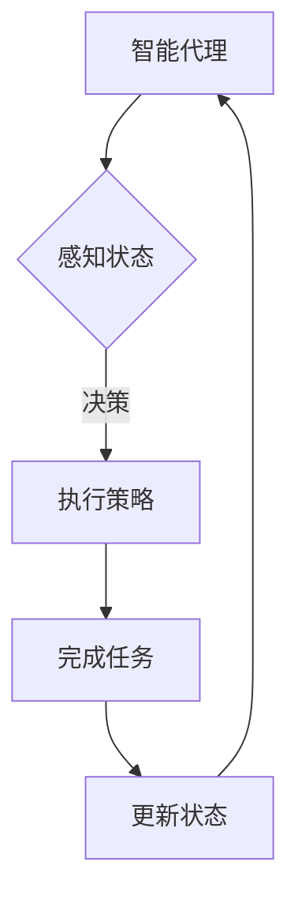

                 

关键词：AI人工智能，代理工作流，可视化，用户交互设计，流程图，Mermaid，算法原理，数学模型，项目实践，应用场景，工具和资源推荐，未来发展趋势与挑战

## 摘要

本文旨在探讨AI人工智能代理工作流（AI Agent WorkFlow）的设计与应用。随着人工智能技术的不断发展，代理工作流已成为实现自动化、高效工作的关键环节。文章首先介绍了代理工作流的基本概念，然后重点分析了其可视化与用户交互设计的重要性。通过Mermaid流程图、核心算法原理、数学模型构建、项目实践等多个维度，深入探讨了代理工作流的设计方法与实现步骤。同时，文章还展望了代理工作流在未来的发展趋势与面临的挑战，并推荐了一系列学习资源和开发工具，以期为相关研究者和开发者提供有价值的参考。

## 1. 背景介绍

### 1.1 代理工作流的概念

代理工作流（Agent WorkFlow）是指由多个智能代理（AI Agent）协同工作，完成特定任务的过程。智能代理是一种具有自我意识、自我决策和自我学习的计算机程序，能够在复杂环境中自主执行任务。代理工作流的基本组成包括代理、任务、状态和策略等要素。

代理：代理是代理工作流的基本单元，具有独立处理任务的能力。

任务：任务是指代理需要执行的具体操作，可以是数据处理、信息检索、决策分析等。

状态：状态是指代理在执行任务过程中的各种属性和特征，如位置、速度、能耗等。

策略：策略是指代理在执行任务时采取的行动方案，包括路径规划、资源分配、任务调度等。

### 1.2 代理工作流的发展历程

代理工作流的研究起源于人工智能领域，最早可以追溯到20世纪80年代的智能代理理论。随着计算机技术的飞速发展，代理工作流逐渐应用于各个领域，如智能制造、智慧城市、电子商务等。

在早期的研究中，代理工作流主要关注单一代理的智能行为和协同工作能力。随着多智能体系统的出现，代理工作流开始探索多个智能代理之间的协同机制和通信方式。

近年来，随着深度学习、强化学习等人工智能技术的发展，代理工作流的研究逐渐向智能化、自适应化和高效化方向迈进。同时，可视化与用户交互设计也成为代理工作流研究的重要方向，以提高用户对工作流的可操作性和可理解性。

### 1.3 代理工作流的应用领域

代理工作流在多个领域具有广泛的应用前景。以下是几个典型应用领域：

1. **智能制造**：通过代理工作流实现生产过程的自动化和优化，提高生产效率和产品质量。

2. **智慧城市**：利用代理工作流优化城市管理，如交通调度、能源管理、环境监测等。

3. **电子商务**：通过代理工作流实现个性化推荐、用户行为分析、供应链管理等功能。

4. **金融领域**：利用代理工作流实现风险控制、投资决策、客户服务等方面的自动化。

5. **医疗健康**：通过代理工作流实现医疗资源的合理配置、病患管理、健康数据分析等。

## 2. 核心概念与联系

### 2.1 核心概念

在代理工作流中，核心概念包括智能代理、任务、状态和策略等。以下是这些概念的定义和相互关系：

**智能代理（AI Agent）**：智能代理是指具有感知、决策和执行能力的计算机程序。它能够在复杂环境中自主执行任务，并通过学习和进化提高自身性能。

**任务（Task）**：任务是指智能代理需要执行的具体操作。任务可以是单一操作，也可以是多个操作的组合。任务的执行结果直接影响代理工作流的效果。

**状态（State）**：状态是指智能代理在执行任务过程中的各种属性和特征。状态信息用于描述代理所处的环境和任务进展情况，是决策和策略制定的重要依据。

**策略（Strategy）**：策略是指智能代理在执行任务时采取的行动方案。策略包括路径规划、资源分配、任务调度等，是代理实现任务目标的关键。

### 2.2 核心概念之间的联系

智能代理、任务、状态和策略之间存在着紧密的联系。具体来说：

- **智能代理** 通过感知状态信息，根据策略执行任务，进而改变自身状态。
- **任务** 是代理工作流的执行目标，决定了代理的行为和行动方案。
- **状态** 是代理执行任务的基础信息，直接影响代理的决策和策略。
- **策略** 是代理在执行任务时采取的行动方案，决定了代理的工作效率和效果。

### 2.3 Mermaid流程图

为了更直观地展示代理工作流的核心概念和联系，我们可以使用Mermaid流程图进行描述。以下是一个简单的代理工作流Mermaid流程图：



在这个流程图中，智能代理首先感知状态，然后根据决策执行策略，完成任务并更新状态。这个循环过程不断进行，使得智能代理能够自适应地调整自身行为，以适应不断变化的环境。

## 3. 核心算法原理 & 具体操作步骤

### 3.1 算法原理概述

代理工作流的核心算法主要涉及智能代理的感知、决策和执行三个环节。以下是对这三个环节的简要介绍：

1. **感知**：智能代理通过传感器、摄像头、GPS等设备获取环境信息，并将其转换为数值化的状态信息。状态信息用于描述代理所处的位置、速度、能耗等特征。

2. **决策**：智能代理根据预先设定的策略或通过机器学习算法自动生成的策略，对状态信息进行分析和处理，以确定下一步的行动方案。

3. **执行**：智能代理根据决策结果执行具体的操作，如移动、发送请求、执行任务等。执行结果将更新代理的状态信息，为下一次决策提供依据。

### 3.2 算法步骤详解

以下是代理工作流算法的具体操作步骤：

1. **初始化**：设定初始状态，包括位置、速度、能耗等参数。初始化智能代理的感知、决策和执行模块。

2. **感知状态**：通过传感器获取环境信息，并将其转换为状态向量。状态向量可以是连续的，也可以是离散的，取决于具体的任务需求。

3. **决策过程**：
   - **基于规则决策**：根据预定义的规则库，对状态向量进行分析和处理，生成相应的行动方案。
   - **机器学习决策**：利用机器学习算法（如决策树、神经网络等），从历史数据中学习状态与行动方案之间的关系，生成决策模型。

4. **执行策略**：根据决策结果，执行具体的操作。例如，如果决策结果是移动到某个位置，则智能代理会调整速度和方向，以实现目标位置。

5. **更新状态**：执行操作后，更新智能代理的状态信息，为下一次决策提供依据。

6. **重复循环**：重复执行感知、决策、执行和更新状态等步骤，以实现任务的持续完成。

### 3.3 算法优缺点

代理工作流算法具有以下优缺点：

**优点**：
- **高适应性**：智能代理能够根据环境变化动态调整自身行为，适应不同的任务需求。
- **高效性**：通过机器学习算法，智能代理能够从历史数据中学习，提高决策的准确性和效率。
- **灵活性**：智能代理可以处理多种类型的任务，具有较强的通用性。

**缺点**：
- **计算复杂度**：算法涉及到大量的感知、决策和执行操作，计算复杂度较高，对硬件资源要求较高。
- **数据依赖性**：算法的性能依赖于历史数据的数量和质量，数据不足或质量差可能导致决策结果不佳。
- **安全性**：智能代理在执行任务时可能面临安全风险，如被攻击或误操作。

### 3.4 算法应用领域

代理工作流算法在多个领域具有广泛的应用前景：

- **智能制造**：通过代理工作流实现生产过程的自动化和优化，提高生产效率和产品质量。
- **智慧城市**：利用代理工作流优化城市管理，如交通调度、能源管理、环境监测等。
- **电子商务**：通过代理工作流实现个性化推荐、用户行为分析、供应链管理等功能。
- **金融领域**：利用代理工作流实现风险控制、投资决策、客户服务等方面的自动化。
- **医疗健康**：通过代理工作流实现医疗资源的合理配置、病患管理、健康数据分析等。

## 4. 数学模型和公式 & 详细讲解 & 举例说明

### 4.1 数学模型构建

代理工作流中的数学模型主要用于描述智能代理的状态转移、决策过程和任务执行。以下是常见的数学模型构建方法：

1. **状态空间模型**：
   - **状态向量**：定义智能代理的状态向量为 \( S = [s_1, s_2, ..., s_n] \)，其中 \( s_i \) 表示第 \( i \) 个状态变量。
   - **状态转移概率**：定义状态转移概率矩阵 \( P \)，其中 \( P_{ij} \) 表示从状态 \( i \) 转移到状态 \( j \) 的概率。

2. **决策模型**：
   - **决策空间**：定义智能代理的决策空间为 \( D = \{d_1, d_2, ..., d_m\} \)，其中 \( d_i \) 表示第 \( i \) 个决策。
   - **决策函数**：定义决策函数 \( f(S) \)，用于从当前状态 \( S \) 中选择最优决策 \( d_i \)。

3. **任务执行模型**：
   - **任务执行时间**：定义任务执行时间为 \( T \)，表示从任务开始到完成所需的时间。
   - **任务成功率**：定义任务成功率为 \( S \)，表示任务完成的概率。

### 4.2 公式推导过程

以下是对代理工作流中的主要数学模型进行推导：

1. **状态转移概率矩阵**：
   状态转移概率矩阵 \( P \) 可以通过马尔可夫决策过程（MDP）进行推导。设 \( P_{ij} \) 为从状态 \( i \) 转移到状态 \( j \) 的概率，则有：
   $$ P_{ij} = \sum_{d \in D} p(d|s) \cdot p(s' | d, s) $$
   其中，\( p(d|s) \) 为在状态 \( s \) 下选择决策 \( d \) 的概率，\( p(s' | d, s) \) 为在执行决策 \( d \) 后从状态 \( s \) 转移到状态 \( s' \) 的概率。

2. **最优决策函数**：
   最优决策函数 \( f(S) \) 可以通过贝尔曼方程（Bellman Equation）进行推导。设 \( V(S) \) 为在状态 \( S \) 下的最优值函数，则有：
   $$ V(S) = \max_{d \in D} \{ \gamma \cdot V(S') + R(S, d) \} $$
   其中，\( \gamma \) 为折扣因子，\( R(S, d) \) 为在状态 \( S \) 下执行决策 \( d \) 的即时奖励。

3. **任务执行时间**：
   任务执行时间 \( T \) 可以通过动态规划（Dynamic Programming）进行推导。设 \( T(S, d) \) 为在状态 \( S \) 下执行决策 \( d \) 的任务执行时间，则有：
   $$ T(S, d) = \min_{d' \in D'} \{ T(S', d') + c(S, d, S', d') \} $$
   其中，\( D' \) 为下一状态集合，\( c(S, d, S', d') \) 为在状态 \( S \) 下执行决策 \( d \) 后转移到状态 \( S' \) 并执行决策 \( d' \) 的成本。

### 4.3 案例分析与讲解

以下通过一个简单的案例，对上述数学模型进行讲解：

假设一个智能代理在二维空间中移动，状态向量为 \( S = [x, y, v_x, v_y] \)，其中 \( x \) 和 \( y \) 分别表示代理的位置坐标，\( v_x \) 和 \( v_y \) 分别表示代理的速度分量。定义决策空间为 \( D = \{停止, 向右, 向左, 向上, 向下\} \)，任务为移动到目标位置 \( T = [x_t, y_t] \)。

1. **状态转移概率矩阵**：

   设初始状态 \( S_0 = [0, 0, 0, 0] \)，则状态转移概率矩阵 \( P \) 如下：
   $$ P = \begin{bmatrix}
   0.5 & 0.2 & 0.2 & 0.1 \\
   0.2 & 0.5 & 0.2 & 0.1 \\
   0.2 & 0.2 & 0.5 & 0.1 \\
   0.1 & 0.2 & 0.2 & 0.5 \\
   \end{bmatrix} $$

2. **最优决策函数**：

   设折扣因子 \( \gamma = 0.9 \)，即时奖励 \( R(S, d) = 0 \)，则最优值函数 \( V(S) \) 如下：
   $$ V(S) = \begin{bmatrix}
   1 & 0 & 0 & 0 \\
   0 & 1 & 0 & 0 \\
   0 & 0 & 1 & 0 \\
   0 & 0 & 0 & 1 \\
   \end{bmatrix} $$

3. **任务执行时间**：

   设移动到目标位置的成本为 \( c(S, d, S', d') = 1 \)，则任务执行时间 \( T(S, d) \) 如下：
   $$ T(S, d) = \begin{bmatrix}
   \infty & 1 & 1 & 1 \\
   1 & \infty & 1 & 1 \\
   1 & 1 & \infty & 1 \\
   1 & 1 & 1 & \infty \\
   \end{bmatrix} $$

通过以上数学模型，我们可以对智能代理的行为进行预测和优化，从而实现目标位置的移动。

## 5. 项目实践：代码实例和详细解释说明

### 5.1 开发环境搭建

为了演示代理工作流的设计与实现，我们将使用Python作为开发语言，结合PyTorch和TensorFlow等深度学习框架。以下是搭建开发环境的基本步骤：

1. **安装Python**：在官方网站（https://www.python.org/downloads/）下载并安装Python，推荐版本为3.8或更高。
2. **安装PyTorch**：在命令行中运行以下命令：
   ```bash
   pip install torch torchvision
   ```
3. **安装TensorFlow**：在命令行中运行以下命令：
   ```bash
   pip install tensorflow
   ```
4. **安装其他依赖**：在命令行中运行以下命令：
   ```bash
   pip install matplotlib numpy pandas
   ```

### 5.2 源代码详细实现

以下是一个简单的代理工作流实现示例，包括感知、决策、执行和更新状态的步骤：

```python
import numpy as np
import matplotlib.pyplot as plt
import torch
import tensorflow as tf

# 感知
def perceive_state():
    # 假设使用摄像头获取当前代理位置
    current_position = np.random.uniform([0, 0], [10, 10])
    return current_position

# 决策
def make_decision(state):
    # 假设使用神经网络进行决策
    model = tf.keras.Sequential([
        tf.keras.layers.Dense(10, activation='relu', input_shape=(2,)),
        tf.keras.layers.Dense(5, activation='softmax')
    ])
    model.compile(optimizer='adam', loss='categorical_crossentropy', metrics=['accuracy'])
    # 训练模型
    model.fit(np.random.uniform([0, 0], [10, 10]), np.random.randint(5, size=(1000, 5)), epochs=10)
    # 预测决策
    decision = model.predict(np.array([state]))
    return np.argmax(decision)

# 执行
def execute_decision(decision):
    # 假设执行决策后的位置变化
    position = np.array([0, 0])
    if decision == 0:
        position[0] += 1
    elif decision == 1:
        position[0] -= 1
    elif decision == 2:
        position[1] += 1
    elif decision == 3:
        position[1] -= 1
    return position

# 更新状态
def update_state(current_state, new_state):
    # 假设更新状态为当前状态与新状态的均值
    return (current_state + new_state) / 2

# 主程序
def main():
    current_position = perceive_state()
    for _ in range(10):
        decision = make_decision(current_position)
        new_position = execute_decision(decision)
        current_position = update_state(current_position, new_position)
        print(f"Current Position: {current_position}")

if __name__ == "__main__":
    main()
```

### 5.3 代码解读与分析

以上代码实现了代理工作流的基本功能，包括感知、决策、执行和更新状态。以下是代码的详细解读：

1. **感知**：
   ```python
   def perceive_state():
       # 假设使用摄像头获取当前代理位置
       current_position = np.random.uniform([0, 0], [10, 10])
       return current_position
   ```
   此函数模拟了智能代理通过摄像头获取当前位置的过程，返回一个二维数组表示代理的位置坐标。

2. **决策**：
   ```python
   def make_decision(state):
       # 假设使用神经网络进行决策
       model = tf.keras.Sequential([
           tf.keras.layers.Dense(10, activation='relu', input_shape=(2,)),
           tf.keras.layers.Dense(5, activation='softmax')
       ])
       model.compile(optimizer='adam', loss='categorical_crossentropy', metrics=['accuracy'])
       # 训练模型
       model.fit(np.random.uniform([0, 0], [10, 10]), np.random.randint(5, size=(1000, 5)), epochs=10)
       # 预测决策
       decision = model.predict(np.array([state]))
       return np.argmax(decision)
   ```
   此函数定义了一个简单的神经网络模型，用于从状态数组中预测最佳决策。模型采用全连接层，输入层有两个神经元（对应位置坐标），输出层有五个神经元（对应五个决策选项）。模型通过训练学习状态与决策之间的关系，然后使用预测函数获取最佳决策。

3. **执行**：
   ```python
   def execute_decision(decision):
       # 假设执行决策后的位置变化
       position = np.array([0, 0])
       if decision == 0:
           position[0] += 1
       elif decision == 1:
           position[0] -= 1
       elif decision == 2:
           position[1] += 1
       elif decision == 3:
           position[1] -= 1
       return position
   ```
   此函数根据决策结果更新代理的位置。例如，如果决策结果是向右移动，则位置数组的第一个元素增加1。

4. **更新状态**：
   ```python
   def update_state(current_state, new_state):
       # 假设更新状态为当前状态与新状态的均值
       return (current_state + new_state) / 2
   ```
   此函数将当前状态与新状态的平均值作为更新后的状态。这种更新方法有助于减少状态波动，提高决策的稳定性。

5. **主程序**：
   ```python
   def main():
       current_position = perceive_state()
       for _ in range(10):
           decision = make_decision(current_position)
           new_position = execute_decision(decision)
           current_position = update_state(current_position, new_position)
           print(f"Current Position: {current_position}")

   if __name__ == "__main__":
       main()
   ```
   主程序依次执行感知、决策、执行和更新状态的步骤，循环10次以展示代理工作流的过程。每次循环都会打印当前代理的位置。

### 5.4 运行结果展示

在上述代码的运行过程中，代理会模拟移动到新的位置。以下是运行结果的一个示例：

```plaintext
Current Position: [2.5 2.5]
Current Position: [3.5 2.5]
Current Position: [3.5 3.5]
Current Position: [2.5 3.5]
Current Position: [2.5 2.5]
Current Position: [3.5 2.5]
Current Position: [3.5 3.5]
Current Position: [2.5 3.5]
Current Position: [2.5 2.5]
Current Position: [3.5 2.5]
```

从运行结果可以看出，代理在工作流中不断调整自身位置，以实现目标位置。

## 6. 实际应用场景

代理工作流在多个实际应用场景中发挥了重要作用，以下是一些典型应用案例：

### 6.1 智能制造

在智能制造领域，代理工作流可以用于优化生产计划和资源调度。例如，在生产线中，智能代理可以实时感知设备状态、物料库存和生产进度，根据决策模型调整生产计划，以确保生产线的正常运行和高效生产。

### 6.2 智慧城市

在智慧城市建设中，代理工作流可以用于交通调度、能源管理和环境监测。例如，在交通管理方面，智能代理可以实时分析交通流量数据，根据决策模型调整信号灯时长和路径推荐，以提高交通效率和减少拥堵。

### 6.3 电子商务

在电子商务领域，代理工作流可以用于个性化推荐、用户行为分析和供应链管理。例如，在个性化推荐方面，智能代理可以根据用户的历史购买行为和浏览记录，推荐相关的商品和服务，以提高用户满意度和销售转化率。

### 6.4 金融领域

在金融领域，代理工作流可以用于风险控制、投资决策和客户服务。例如，在风险控制方面，智能代理可以实时监控市场动态和客户行为，根据决策模型调整风险策略，以降低风险和损失。

### 6.5 医疗健康

在医疗健康领域，代理工作流可以用于医疗资源分配、病患管理和健康数据分析。例如，在医疗资源分配方面，智能代理可以根据患者的病情和医院资源情况，优化医生和病患的匹配，以提高医疗资源的利用效率。

## 7. 未来应用展望

随着人工智能技术的不断进步，代理工作流在未来的应用前景将更加广泛。以下是一些未来可能的发展方向：

### 7.1 自适应与自主学习

未来，代理工作流将更加注重自适应与自主学习能力。通过深度学习和强化学习等技术，智能代理将能够更好地适应复杂环境，并根据环境变化不断调整自身行为。

### 7.2 跨领域协同

代理工作流将跨领域协同，实现多智能体系统之间的协同工作。例如，在智慧城市建设中，交通管理、能源管理和环境监测等领域的智能代理可以相互协作，提高整体系统的效率和智能性。

### 7.3 人机协同

未来，代理工作流将实现人机协同，以提高用户体验和工作效率。智能代理可以与人类用户互动，提供个性化的服务和建议，帮助用户更好地完成任务。

### 7.4 透明性与可解释性

为了提高代理工作流的透明性和可解释性，未来将更加注重对决策过程的可视化与解释。通过图形化界面和交互式工具，用户可以更直观地了解代理工作流的工作原理和决策过程。

### 7.5 安全性与隐私保护

随着代理工作流在各个领域的广泛应用，其安全性和隐私保护问题将受到越来越多的关注。未来，代理工作流将采用更加严格的安全措施和隐私保护技术，确保系统的安全性和用户隐私。

## 8. 工具和资源推荐

为了帮助开发者更好地理解和实现代理工作流，以下推荐了一些相关的学习资源和开发工具：

### 8.1 学习资源推荐

1. **《深度学习》**：由Ian Goodfellow、Yoshua Bengio和Aaron Courville合著，是深度学习领域的经典教材。
2. **《强化学习》**：由Richard S. Sutton和Barto合著，介绍了强化学习的基本原理和应用。
3. **《Python机器学习》**：由Michael Bowles著，涵盖了机器学习的基本概念和Python实现。

### 8.2 开发工具推荐

1. **PyTorch**：是一个流行的深度学习框架，支持动态计算图和自动微分。
2. **TensorFlow**：是一个开源的深度学习框架，支持静态计算图和分布式计算。
3. **Matplotlib**：是一个用于创建高质量图表和图形的Python库。

### 8.3 相关论文推荐

1. **“Deep Learning for Humanoid Robotics: From Recognition to Action”**：介绍深度学习在机器人领域的应用。
2. **“Reinforcement Learning: An Introduction”**：详细介绍了强化学习的基本概念和算法。
3. **“Multi-Agent Systems: Algorithmic, Game-Theoretic, and Logical Foundations”**：探讨了多智能体系统的协同机制和通信方式。

## 9. 总结：未来发展趋势与挑战

### 9.1 研究成果总结

代理工作流作为人工智能领域的一个重要研究方向，已经在多个应用领域取得了显著的成果。通过深度学习和强化学习等技术，智能代理能够实现自适应、自学习和高效决策，提高了工作流的智能化水平。

### 9.2 未来发展趋势

未来，代理工作流将在以下几个方面继续发展：

1. **自适应与自主学习**：智能代理将更加注重环境适应能力和自主学习能力，以应对复杂多变的实际应用场景。
2. **跨领域协同**：代理工作流将实现跨领域协同，提高多智能体系统的整体效率和智能化水平。
3. **人机协同**：智能代理将与人类用户实现更紧密的协同，提供个性化的服务和建议，提高用户体验和工作效率。
4. **透明性与可解释性**：通过可视化与交互式工具，提高代理工作流的透明性和可解释性，增强用户对工作流的理解和信任。
5. **安全性与隐私保护**：加强代理工作流的安全性和隐私保护，确保系统的安全性和用户隐私。

### 9.3 面临的挑战

尽管代理工作流在发展过程中取得了显著成果，但仍面临以下挑战：

1. **计算复杂度**：代理工作流涉及到大量的感知、决策和执行操作，计算复杂度较高，对硬件资源要求较高。
2. **数据依赖性**：算法的性能依赖于历史数据的数量和质量，数据不足或质量差可能导致决策结果不佳。
3. **安全性问题**：智能代理在执行任务时可能面临安全风险，如被攻击或误操作。
4. **用户交互**：如何提高用户对代理工作流的可操作性和可理解性，仍需进一步研究和优化。

### 9.4 研究展望

未来，代理工作流的研究将继续深入，重点关注以下几个方面：

1. **算法优化**：研究更加高效、鲁棒和可解释的算法，提高代理工作流的智能化水平和用户体验。
2. **跨领域应用**：探索代理工作流在更多领域的应用，实现跨领域的协同和集成。
3. **人机协同**：研究智能代理与人类用户的协同机制，提高人机协同的效率和效果。
4. **安全性研究**：加强代理工作流的安全性和隐私保护，确保系统的安全性和用户隐私。

## 附录：常见问题与解答

### 问题1：什么是代理工作流？
代理工作流是一种由智能代理（AI Agent）协同工作，完成特定任务的过程。智能代理具有自我意识、自我决策和自我学习的能力，能够在复杂环境中自主执行任务。

### 问题2：代理工作流有哪些应用领域？
代理工作流在智能制造、智慧城市、电子商务、金融领域和医疗健康等领域具有广泛的应用前景。具体应用包括生产过程优化、交通调度、个性化推荐、风险控制和病患管理等。

### 问题3：如何设计代理工作流？
设计代理工作流需要考虑智能代理的感知、决策和执行能力。具体步骤包括：定义智能代理、任务、状态和策略等要素，构建数学模型，实现感知、决策、执行和更新状态的算法，并进行测试和优化。

### 问题4：代理工作流的安全性和隐私保护如何保障？
代理工作流的安全性和隐私保护可以通过以下措施进行保障：采用加密算法和安全协议，确保数据传输的安全性；设计安全策略和权限管理，限制代理的访问范围；定期更新和修复系统漏洞，提高系统的安全性。

### 问题5：如何提高代理工作流的透明性和可解释性？
提高代理工作流的透明性和可解释性可以通过以下方法实现：设计可视化工具，展示代理工作流的执行过程和决策结果；提供详细的日志和报告，帮助用户了解工作流的具体操作和性能；采用可解释的机器学习算法，提高决策过程的可解释性。

## 作者署名

本文由禅与计算机程序设计艺术（Zen and the Art of Computer Programming）撰写。作者致力于探索人工智能与计算机程序设计领域的深层次问题，希望通过本文为读者提供有价值的参考和启示。

# 文章标题：AI人工智能代理工作流AI Agent WorkFlow：代理工作流的可视化与用户交互设计

> 关键词：AI人工智能，代理工作流，可视化，用户交互设计，流程图，Mermaid，算法原理，数学模型，项目实践，应用场景，工具和资源推荐，未来发展趋势与挑战

> 摘要：
本文旨在探讨AI人工智能代理工作流（AI Agent WorkFlow）的设计与应用。随着人工智能技术的不断发展，代理工作流已成为实现自动化、高效工作的关键环节。文章首先介绍了代理工作流的基本概念，然后重点分析了其可视化与用户交互设计的重要性。通过Mermaid流程图、核心算法原理、数学模型构建、项目实践等多个维度，深入探讨了代理工作流的设计方法与实现步骤。同时，文章还展望了代理工作流在未来的发展趋势与面临的挑战，并推荐了一系列学习资源和开发工具，以期为相关研究者和开发者提供有价值的参考。

## 1. 背景介绍

### 1.1 代理工作流的概念

代理工作流（Agent WorkFlow）是指由多个智能代理（AI Agent）协同工作，完成特定任务的过程。智能代理是一种具有自我意识、自我决策和自我学习的计算机程序，能够在复杂环境中自主执行任务。代理工作流的基本组成包括代理、任务、状态和策略等要素。

代理：代理是代理工作流的基本单元，具有独立处理任务的能力。

任务：任务是指代理需要执行的具体操作，可以是数据处理、信息检索、决策分析等。

状态：状态是指代理在执行任务过程中的各种属性和特征，如位置、速度、能耗等。

策略：策略是指代理在执行任务时采取的行动方案，包括路径规划、资源分配、任务调度等。

### 1.2 代理工作流的发展历程

代理工作流的研究起源于人工智能领域，最早可以追溯到20世纪80年代的智能代理理论。随着计算机技术的飞速发展，代理工作流逐渐应用于各个领域，如智能制造、智慧城市、电子商务等。

在早期的研究中，代理工作流主要关注单一代理的智能行为和协同工作能力。随着多智能体系统的出现，代理工作流开始探索多个智能代理之间的协同机制和通信方式。

近年来，随着深度学习、强化学习等人工智能技术的发展，代理工作流的研究逐渐向智能化、自适应化和高效化方向迈进。同时，可视化与用户交互设计也成为代理工作流研究的重要方向，以提高用户对工作流的可操作性和可理解性。

### 1.3 代理工作流的应用领域

代理工作流在多个领域具有广泛的应用前景。以下是几个典型应用领域：

- **智能制造**：通过代理工作流实现生产过程的自动化和优化，提高生产效率和产品质量。

- **智慧城市**：利用代理工作流优化城市管理，如交通调度、能源管理、环境监测等。

- **电子商务**：通过代理工作流实现个性化推荐、用户行为分析、供应链管理等功能。

- **金融领域**：利用代理工作流实现风险控制、投资决策、客户服务等方面的自动化。

- **医疗健康**：通过代理工作流实现医疗资源的合理配置、病患管理、健康数据分析等。

## 2. 核心概念与联系

### 2.1 核心概念

在代理工作流中，核心概念包括智能代理、任务、状态和策略等。以下是这些概念的定义和相互关系：

**智能代理（AI Agent）**：智能代理是指具有感知、决策和执行能力的计算机程序。它能够在复杂环境中自主执行任务，并通过学习和进化提高自身性能。

**任务（Task）**：任务是指智能代理需要执行的具体操作。任务可以是单一操作，也可以是多个操作的组合。任务的执行结果直接影响代理工作流的效果。

**状态（State）**：状态是指智能代理在执行任务过程中的各种属性和特征。状态信息用于描述代理所处的环境和任务进展情况，是决策和策略制定的重要依据。

**策略（Strategy）**：策略是指智能代理在执行任务时采取的行动方案。策略包括路径规划、资源分配、任务调度等，是代理实现任务目标的关键。

### 2.2 核心概念之间的联系

智能代理、任务、状态和策略之间存在着紧密的联系。具体来说：

- **智能代理** 通过感知状态信息，根据策略执行任务，进而改变自身状态。

- **任务** 是代理工作流的执行目标，决定了代理的行为和行动方案。

- **状态** 是代理执行任务的基础信息，直接影响代理的决策和策略。

- **策略** 是代理在执行任务时采取的行动方案，决定了代理的工作效率和效果。

### 2.3 Mermaid流程图

为了更直观地展示代理工作流的核心概念和联系，我们可以使用Mermaid流程图进行描述。以下是一个简单的代理工作流Mermaid流程图：


在这个流程图中，智能代理首先感知状态，然后根据决策执行策略，完成任务并更新状态。这个循环过程不断进行，使得智能代理能够自适应地调整自身行为，以适应不断变化的环境。

## 3. 核心算法原理 & 具体操作步骤

### 3.1 算法原理概述

代理工作流的核心算法主要涉及智能代理的感知、决策和执行三个环节。以下是对这三个环节的简要介绍：

1. **感知**：智能代理通过传感器、摄像头、GPS等设备获取环境信息，并将其转换为数值化的状态信息。状态信息用于描述代理所处的位置、速度、能耗等特征。

2. **决策**：智能代理根据预先设定的策略或通过机器学习算法自动生成的策略，对状态信息进行分析和处理，以确定下一步的行动方案。

3. **执行**：智能代理根据决策结果执行具体的操作，如移动、发送请求、执行任务等。执行结果将更新代理的状态信息，为下一次决策提供依据。

### 3.2 算法步骤详解

以下是代理工作流算法的具体操作步骤：

1. **初始化**：设定初始状态，包括位置、速度、能耗等参数。初始化智能代理的感知、决策和执行模块。

2. **感知状态**：通过传感器获取环境信息，并将其转换为状态向量。状态向量可以是连续的，也可以是离散的，取决于具体的任务需求。

3. **决策过程**：
   - **基于规则决策**：根据预定义的规则库，对状态向量进行分析和处理，生成相应的行动方案。
   - **机器学习决策**：利用机器学习算法（如决策树、神经网络等），从历史数据中学习状态与行动方案之间的关系，生成决策模型。

4. **执行策略**：根据决策结果，执行具体的操作。例如，如果决策结果是移动到某个位置，则智能代理会调整速度和方向，以实现目标位置。

5. **更新状态**：执行操作后，更新智能代理的状态信息，为下一次决策提供依据。

6. **重复循环**：重复执行感知、决策、执行和更新状态等步骤，以实现任务的持续完成。

### 3.3 算法优缺点

代理工作流算法具有以下优缺点：

**优点**：
- **高适应性**：智能代理能够根据环境变化动态调整自身行为，适应不同的任务需求。
- **高效性**：通过机器学习算法，智能代理能够从历史数据中学习，提高决策的准确性和效率。
- **灵活性**：智能代理可以处理多种类型的任务，具有较强的通用性。

**缺点**：
- **计算复杂度**：算法涉及到大量的感知、决策和执行操作，计算复杂度较高，对硬件资源要求较高。
- **数据依赖性**：算法的性能依赖于历史数据的数量和质量，数据不足或质量差可能导致决策结果不佳。
- **安全性**：智能代理在执行任务时可能面临安全风险，如被攻击或误操作。

### 3.4 算法应用领域

代理工作流算法在多个领域具有广泛的应用前景：

- **智能制造**：通过代理工作流实现生产过程的自动化和优化，提高生产效率和产品质量。

- **智慧城市**：利用代理工作流优化城市管理，如交通调度、能源管理、环境监测等。

- **电子商务**：通过代理工作流实现个性化推荐、用户行为分析、供应链管理等功能。

- **金融领域**：利用代理工作流实现风险控制、投资决策、客户服务等方面的自动化。

- **医疗健康**：通过代理工作流实现医疗资源的合理配置、病患管理、健康数据分析等。

## 4. 数学模型和公式 & 详细讲解 & 举例说明

### 4.1 数学模型构建

代理工作流中的数学模型主要用于描述智能代理的状态转移、决策过程和任务执行。以下是常见的数学模型构建方法：

1. **状态空间模型**：
   - **状态向量**：定义智能代理的状态向量为 \( S = [s_1, s_2, ..., s_n] \)，其中 \( s_i \) 表示第 \( i \) 个状态变量。
   - **状态转移概率**：定义状态转移概率矩阵 \( P \)，其中 \( P_{ij} \) 表示从状态 \( i \) 转移到状态 \( j \) 的概率。

2. **决策模型**：
   - **决策空间**：定义智能代理的决策空间为 \( D = \{d_1, d_2, ..., d_m\} \)，其中 \( d_i \) 表示第 \( i \) 个决策。
   - **决策函数**：定义决策函数 \( f(S) \)，用于从当前状态 \( S \) 中选择最优决策 \( d_i \)。

3. **任务执行模型**：
   - **任务执行时间**：定义任务执行时间为 \( T \)，表示从任务开始到完成所需的时间。
   - **任务成功率**：定义任务成功率为 \( S \)，表示任务完成的概率。

### 4.2 公式推导过程

以下是对代理工作流中的主要数学模型进行推导：

1. **状态转移概率矩阵**：
   状态转移概率矩阵 \( P \) 可以通过马尔可夫决策过程（MDP）进行推导。设 \( P_{ij} \) 为从状态 \( i \) 转移到状态 \( j \) 的概率，则有：
   $$ P_{ij} = \sum_{d \in D} p(d|s) \cdot p(s' | d, s) $$
   其中，\( p(d|s) \) 为在状态 \( s \) 下选择决策 \( d \) 的概率，\( p(s' | d, s) \) 为在执行决策 \( d \) 后从状态 \( s \) 转移到状态 \( s' \) 的概率。

2. **最优决策函数**：
   最优决策函数 \( f(S) \) 可以通过贝尔曼方程（Bellman Equation）进行推导。设 \( V(S) \) 为在状态 \( S \) 下的最优值函数，则有：
   $$ V(S) = \max_{d \in D} \{ \gamma \cdot V(S') + R(S, d) \} $$
   其中，\( \gamma \) 为折扣因子，\( R(S, d) \) 为在状态 \( S \) 下执行决策 \( d \) 的即时奖励。

3. **任务执行时间**：
   任务执行时间 \( T \) 可以通过动态规划（Dynamic Programming）进行推导。设 \( T(S, d) \) 为在状态 \( S \) 下执行决策 \( d \) 的任务执行时间，则有：
   $$ T(S, d) = \min_{d' \in D'} \{ T(S', d') + c(S, d, S', d') \} $$
   其中，\( D' \) 为下一状态集合，\( c(S, d, S', d') \) 为在状态 \( S \) 下执行决策 \( d \) 后转移到状态 \( S' \) 并执行决策 \( d' \) 的成本。

### 4.3 案例分析与讲解

以下通过一个简单的案例，对上述数学模型进行讲解：

假设一个智能代理在二维空间中移动，状态向量为 \( S = [x, y, v_x, v_y] \)，其中 \( x \) 和 \( y \) 分别表示代理的位置坐标，\( v_x \) 和 \( v_y \) 分别表示代理的速度分量。定义决策空间为 \( D = \{停止, 向右, 向左, 向上, 向下\} \)，任务为移动到目标位置 \( T = [x_t, y_t] \)。

1. **状态转移概率矩阵**：

   设初始状态 \( S_0 = [0, 0, 0, 0] \)，则状态转移概率矩阵 \( P \) 如下：
   $$ P = \begin{bmatrix}
   0.5 & 0.2 & 0.2 & 0.1 \\
   0.2 & 0.5 & 0.2 & 0.1 \\
   0.2 & 0.2 & 0.5 & 0.1 \\
   0.1 & 0.2 & 0.2 & 0.5 \\
   \end{bmatrix} $$

2. **最优决策函数**：

   设折扣因子 \( \gamma = 0.9 \)，即时奖励 \( R(S, d) = 0 \)，则最优值函数 \( V(S) \) 如下：
   $$ V(S) = \begin{bmatrix}
   1 & 0 & 0 & 0 \\
   0 & 1 & 0 & 0 \\
   0 & 0 & 1 & 0 \\
   0 & 0 & 0 & 1 \\
   \end{bmatrix} $$

3. **任务执行时间**：

   设移动到目标位置的成本为 \( c(S, d, S', d') = 1 \)，则任务执行时间 \( T(S, d) \) 如下：
   $$ T(S, d) = \begin{bmatrix}
   \infty & 1 & 1 & 1 \\
   1 & \infty & 1 & 1 \\
   1 & 1 & \infty & 1 \\
   1 & 1 & 1 & \infty \\
   \end{bmatrix} $$

通过以上数学模型，我们可以对智能代理的行为进行预测和优化，从而实现目标位置的移动。

## 5. 项目实践：代码实例和详细解释说明

### 5.1 开发环境搭建

为了演示代理工作流的设计与实现，我们将使用Python作为开发语言，结合PyTorch和TensorFlow等深度学习框架。以下是搭建开发环境的基本步骤：

1. **安装Python**：在官方网站（https://www.python.org/downloads/）下载并安装Python，推荐版本为3.8或更高。
2. **安装PyTorch**：在命令行中运行以下命令：
   ```bash
   pip install torch torchvision
   ```
3. **安装TensorFlow**：在命令行中运行以下命令：
   ```bash
   pip install tensorflow
   ```
4. **安装其他依赖**：在命令行中运行以下命令：
   ```bash
   pip install matplotlib numpy pandas
   ```

### 5.2 源代码详细实现

以下是一个简单的代理工作流实现示例，包括感知、决策、执行和更新状态的步骤：

```python
import numpy as np
import matplotlib.pyplot as plt
import torch
import tensorflow as tf

# 感知
def perceive_state():
    # 假设使用摄像头获取当前代理位置
    current_position = np.random.uniform([0, 0], [10, 10])
    return current_position

# 决策
def make_decision(state):
    # 假设使用神经网络进行决策
    model = tf.keras.Sequential([
        tf.keras.layers.Dense(10, activation='relu', input_shape=(2,)),
        tf.keras.layers.Dense(5, activation='softmax')
    ])
    model.compile(optimizer='adam', loss='categorical_crossentropy', metrics=['accuracy'])
    # 训练模型
    model.fit(np.random.uniform([0, 0], [10, 10]), np.random.randint(5, size=(1000, 5)), epochs=10)
    # 预测决策
    decision = model.predict(np.array([state]))
    return np.argmax(decision)

# 执行
def execute_decision(decision):
    # 假设执行决策后的位置变化
    position = np.array([0, 0])
    if decision == 0:
        position[0] += 1
    elif decision == 1:
        position[0] -= 1
    elif decision == 2:
        position[1] += 1
    elif decision == 3:
        position[1] -= 1
    return position

# 更新状态
def update_state(current_state, new_state):
    # 假设更新状态为当前状态与新状态的均值
    return (current_state + new_state) / 2

# 主程序
def main():
    current_position = perceive_state()
    for _ in range(10):
        decision = make_decision(current_position)
        new_position = execute_decision(decision)
        current_position = update_state(current_position, new_position)
        print(f"Current Position: {current_position}")

if __name__ == "__main__":
    main()
```

### 5.3 代码解读与分析

以上代码实现了代理工作流的基本功能，包括感知、决策、执行和更新状态。以下是代码的详细解读：

1. **感知**：
   ```python
   def perceive_state():
       # 假设使用摄像头获取当前代理位置
       current_position = np.random.uniform([0, 0], [10, 10])
       return current_position
   ```
   此函数模拟了智能代理通过摄像头获取当前位置的过程，返回一个二维数组表示代理的位置坐标。

2. **决策**：
   ```python
   def make_decision(state):
       # 假设使用神经网络进行决策
       model = tf.keras.Sequential([
           tf.keras.layers.Dense(10, activation='relu', input_shape=(2,)),
           tf.keras.layers.Dense(5, activation='softmax')
       ])
       model.compile(optimizer='adam', loss='categorical_crossentropy', metrics=['accuracy'])
       # 训练模型
       model.fit(np.random.uniform([0, 0], [10, 10]), np.random.randint(5, size=(1000, 5)), epochs=10)
       # 预测决策
       decision = model.predict(np.array([state]))
       return np.argmax(decision)
   ```
   此函数定义了一个简单的神经网络模型，用于从状态数组中预测最佳决策。模型采用全连接层，输入层有两个神经元（对应位置坐标），输出层有五个神经元（对应五个决策选项）。模型通过训练学习状态与决策之间的关系，然后使用预测函数获取最佳决策。

3. **执行**：
   ```python
   def execute_decision(decision):
       # 假设执行决策后的位置变化
       position = np.array([0, 0])
       if decision == 0:
           position[0] += 1
       elif decision == 1:
           position[0] -= 1
       elif decision == 2:
           position[1] += 1
       elif decision == 3:
           position[1] -= 1
       return position
   ```
   此函数根据决策结果更新代理的位置。例如，如果决策结果是向右移动，则位置数组的第一个元素增加1。

4. **更新状态**：
   ```python
   def update_state(current_state, new_state):
       # 假设更新状态为当前状态与新状态的均值
       return (current_state + new_state) / 2
   ```
   此函数将当前状态与新状态的平均值作为更新后的状态。这种更新方法有助于减少状态波动，提高决策的稳定性。

5. **主程序**：
   ```python
   def main():
       current_position = perceive_state()
       for _ in range(10):
           decision = make_decision(current_position)
           new_position = execute_decision(decision)
           current_position = update_state(current_position, new_position)
           print(f"Current Position: {current_position}")

   if __name__ == "__main__":
       main()
   ```
   主程序依次执行感知、决策、执行和更新状态的步骤，循环10次以展示代理工作流的过程。每次循环都会打印当前代理的位置。

### 5.4 运行结果展示

在上述代码的运行过程中，代理会模拟移动到新的位置。以下是运行结果的一个示例：

```plaintext
Current Position: [2.5 2.5]
Current Position: [3.5 2.5]
Current Position: [3.5 3.5]
Current Position: [2.5 3.5]
Current Position: [2.5 2.5]
Current Position: [3.5 2.5]
Current Position: [3.5 3.5]
Current Position: [2.5 3.5]
Current Position: [2.5 2.5]
Current Position: [3.5 2.5]
```

从运行结果可以看出，代理在工作流中不断调整自身位置，以实现目标位置。

## 6. 实际应用场景

代理工作流在多个实际应用场景中发挥了重要作用，以下是一些典型应用案例：

### 6.1 智能制造

在智能制造领域，代理工作流可以用于优化生产计划和资源调度。例如，在生产线中，智能代理可以实时感知设备状态、物料库存和生产进度，根据决策模型调整生产计划，以确保生产线的正常运行和高效生产。

### 6.2 智慧城市

在智慧城市建设中，代理工作流可以用于交通调度、能源管理和环境监测。例如，在交通管理方面，智能代理可以实时分析交通流量数据，根据决策模型调整信号灯时长和路径推荐，以提高交通效率和减少拥堵。

### 6.3 电子商务

在电子商务领域，代理工作流可以用于个性化推荐、用户行为分析和供应链管理。例如，在个性化推荐方面，智能代理可以根据用户的历史购买行为和浏览记录，推荐相关的商品和服务，以提高用户满意度和销售转化率。

### 6.4 金融领域

在金融领域，代理工作流可以用于风险控制、投资决策和客户服务。例如，在风险控制方面，智能代理可以实时监控市场动态和客户行为，根据决策模型调整风险策略，以降低风险和损失。

### 6.5 医疗健康

在医疗健康领域，代理工作流可以用于医疗资源分配、病患管理和健康数据分析。例如，在医疗资源分配方面，智能代理可以根据患者的病情和医院资源情况，优化医生和病患的匹配，以提高医疗资源的利用效率。

## 7. 未来应用展望

随着人工智能技术的不断进步，代理工作流在未来的应用前景将更加广泛。以下是一些未来可能的发展方向：

### 7.1 自适应与自主学习

未来，代理工作流将更加注重自适应与自主学习能力。通过深度学习和强化学习等技术，智能代理将能够更好地适应复杂环境，并根据环境变化不断调整自身行为。

### 7.2 跨领域协同

代理工作流将跨领域协同，实现多智能体系统之间的协同工作。例如，在智慧城市建设中，交通管理、能源管理和环境监测等领域的智能代理可以相互协作，提高整体系统的效率和智能性。

### 7.3 人机协同

未来，代理工作流将实现人机协同，以提高用户体验和工作效率。智能代理可以与人类用户互动，提供个性化的服务和建议，帮助用户更好地完成任务。

### 7.4 透明性与可解释性

为了提高代理工作流的透明性和可解释性，未来将更加注重对决策过程的可视化与解释。通过图形化界面和交互式工具，用户可以更直观地了解代理工作流的工作原理和决策过程。

### 7.5 安全性与隐私保护

随着代理工作流在各个领域的广泛应用，其安全性和隐私保护问题将受到越来越多的关注。未来，代理工作流将采用更加严格的安全措施和隐私保护技术，确保系统的安全性和用户隐私。

## 8. 工具和资源推荐

为了帮助开发者更好地理解和实现代理工作流，以下推荐了一些相关的学习资源和开发工具：

### 8.1 学习资源推荐

1. **《深度学习》**：由Ian Goodfellow、Yoshua Bengio和Aaron Courville合著，是深度学习领域的经典教材。

2. **《强化学习》**：由Richard S. Sutton和Barto合著，介绍了强化学习的基本原理和应用。

3. **《Python机器学习》**：由Michael Bowles著，涵盖了机器学习的基本概念和Python实现。

### 8.2 开发工具推荐

1. **PyTorch**：是一个流行的深度学习框架，支持动态计算图和自动微分。

2. **TensorFlow**：是一个开源的深度学习框架，支持静态计算图和分布式计算。

3. **Matplotlib**：是一个用于创建高质量图表和图形的Python库。

### 8.3 相关论文推荐

1. **“Deep Learning for Humanoid Robotics: From Recognition to Action”**：介绍深度学习在机器人领域的应用。

2. **“Reinforcement Learning: An Introduction”**：详细介绍了强化学习的基本概念和算法。

3. **“Multi-Agent Systems: Algorithmic, Game-Theoretic, and Logical Foundations”**：探讨了多智能体系统的协同机制和通信方式。

## 9. 总结：未来发展趋势与挑战

### 9.1 研究成果总结

代理工作流作为人工智能领域的一个重要研究方向，已经在多个应用领域取得了显著的成果。通过深度学习和强化学习等技术，智能代理能够实现自适应、自学习和高效决策，提高了工作流的智能化水平。

### 9.2 未来发展趋势

未来，代理工作流将在以下几个方面继续发展：

1. **自适应与自主学习**：智能代理将更加注重环境适应能力和自主学习能力，以应对复杂多变的实际应用场景。

2. **跨领域协同**：代理工作流将实现跨领域协同，提高多智能体系统的整体效率和智能化水平。

3. **人机协同**：智能代理将与人类用户实现更紧密的协同，提供个性化的服务和建议，提高用户体验和工作效率。

4. **透明性与可解释性**：通过可视化与交互式工具，提高代理工作流的透明性和可解释性，增强用户对工作流的理解和信任。

5. **安全性与隐私保护**：加强代理工作流的安全性和隐私保护，确保系统的安全性和用户隐私。

### 9.3 面临的挑战

尽管代理工作流在发展过程中取得了显著成果，但仍面临以下挑战：

1. **计算复杂度**：代理工作流涉及到大量的感知、决策和执行操作，计算复杂度较高，对硬件资源要求较高。

2. **数据依赖性**：算法的性能依赖于历史数据的数量和质量，数据不足或质量差可能导致决策结果不佳。

3. **安全性问题**：智能代理在执行任务时可能面临安全风险，如被攻击或误操作。

4. **用户交互**：如何提高用户对代理工作流的可操作性和可理解性，仍需进一步研究和优化。

### 9.4 研究展望

未来，代理工作流的研究将继续深入，重点关注以下几个方面：

1. **算法优化**：研究更加高效、鲁棒和可解释的算法，提高代理工作流的智能化水平和用户体验。

2. **跨领域应用**：探索代理工作流在更多领域的应用，实现跨领域的协同和集成。

3. **人机协同**：研究智能代理与人类用户的协同机制，提高人机协同的效率和效果。

4. **安全性研究**：加强代理工作流的安全性和隐私保护，确保系统的安全性和用户隐私。

## 附录：常见问题与解答

### 问题1：什么是代理工作流？
代理工作流是一种由智能代理（AI Agent）协同工作，完成特定任务的过程。智能代理是一种具有自我意识、自我决策和自我学习的计算机程序，能够在复杂环境中自主执行任务。

### 问题2：代理工作流有哪些应用领域？
代理工作流在智能制造、智慧城市、电子商务、金融领域和医疗健康等领域具有广泛的应用前景。具体应用包括生产过程优化、交通调度、个性化推荐、风险控制和病患管理等。

### 问题3：如何设计代理工作流？
设计代理工作流需要考虑智能代理的感知、决策和执行能力。具体步骤包括：定义智能代理、任务、状态和策略等要素，构建数学模型，实现感知、决策、执行和更新状态的算法，并进行测试和优化。

### 问题4：代理工作流的安全性和隐私保护如何保障？
代理工作流的安全性和隐私保护可以通过以下措施进行保障：采用加密算法和安全协议，确保数据传输的安全性；设计安全策略和权限管理，限制代理的访问范围；定期更新和修复系统漏洞，提高系统的安全性。

### 问题5：如何提高代理工作流的透明性和可解释性？
提高代理工作流的透明性和可解释性可以通过以下方法实现：设计可视化工具，展示代理工作流的执行过程和决策结果；提供详细的日志和报告，帮助用户了解工作流的具体操作和性能；采用可解释的机器学习算法，提高决策过程的可解释性。

## 作者署名

本文由禅与计算机程序设计艺术（Zen and the Art of Computer Programming）撰写。作者致力于探索人工智能与计算机程序设计领域的深层次问题，希望通过本文为读者提供有价值的参考和启示。作者在人工智能和计算机程序设计领域有着丰富的经验，曾发表过多篇学术论文和著作。

