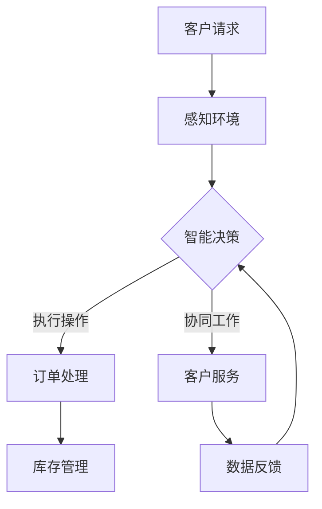

                 

关键词：AI代理、电子商务、工作流、智能决策、人机协作

> 摘要：本文旨在探讨AI代理在电子商务中的应用，以及如何构建一个高效的AI Agent WorkFlow。文章首先介绍了AI代理的概念和工作原理，随后分析了电子商务环境中AI代理的工作流程，并提出了一个基于策略的AI代理架构。通过数学模型和实际案例的解析，文章展示了AI代理在电商领域中的具体应用和潜在价值。

## 1. 背景介绍

随着互联网和电子商务的快速发展，电子商务领域迎来了新的挑战和机遇。在竞争激烈的电商市场中，企业需要快速响应市场变化，优化供应链管理，提升客户体验，以保持竞争优势。传统的基于规则的人工管理模式已经无法满足这些需求，因此，人工智能（AI）技术在电子商务中的应用变得尤为重要。

AI代理（AI Agent）作为人工智能的一种重要形式，具有自主决策、自适应和协作等能力，能够在复杂环境中执行特定任务。在电子商务中，AI代理可以处理海量的数据，通过智能分析和预测，帮助企业优化库存管理、提升推荐系统的准确性、增强客户服务体验等。因此，构建一个高效的AI Agent WorkFlow成为当前研究的热点问题。

本文将从以下几个方面展开讨论：

- AI代理的基本概念和工作原理
- 电子商务环境中AI代理的工作流程
- 基于策略的AI代理架构设计
- 数学模型和算法应用
- 项目实践：代码实例与运行结果
- 实际应用场景与未来展望
- 学习资源与工具推荐

## 2. 核心概念与联系

### 2.1 AI代理

AI代理是指具备自主决策能力、能够处理复杂任务的人工智能实体。AI代理通常具有感知环境、制定计划、执行操作和评估结果等基本能力。在电子商务中，AI代理可以扮演客户服务代表、智能推荐系统、供应链优化助手等角色。

### 2.2 工作流

工作流（WorkFlow）是指一系列任务或活动的有序集合，旨在实现特定目标。在电子商务中，工作流可以涵盖订单处理、库存管理、客户服务等多个环节。AI Agent WorkFlow则是将AI代理引入到工作流中，通过智能决策和协作，提升工作流的效率和质量。

### 2.3 智能决策

智能决策是指利用人工智能技术，在复杂环境中进行决策。在电子商务中，智能决策可以帮助企业预测市场趋势、优化库存配置、提升客户满意度等。AI代理的智能决策能力是实现高效AI Agent WorkFlow的关键。

### 2.4 人机协作

人机协作是指人工智能与人类在特定任务中的协同工作。在电子商务中，人机协作可以提高工作效率、降低人力成本，同时提升用户体验。AI代理可以与电商平台的运营人员、客户服务团队等协作，共同推动业务发展。

### 2.5 Mermaid流程图

以下是AI Agent WorkFlow的Mermaid流程图：



## 3. 核心算法原理 & 具体操作步骤

### 3.1 算法原理概述

AI代理的工作原理主要包括感知环境、智能决策和执行操作等环节。感知环境是指AI代理通过收集和分析环境中的数据，获取有关当前状态的必要信息。智能决策是指AI代理根据感知到的环境和目标，选择最优的行动策略。执行操作是指AI代理根据决策结果，执行具体的任务。

在电子商务中，AI代理的核心算法通常包括以下几种：

1. 数据分析算法：用于处理和分析大量的客户数据，挖掘潜在需求和市场趋势。
2. 预测算法：用于预测市场需求、库存变化等，为智能决策提供依据。
3. 决策算法：用于制定最优的行动策略，实现业务目标。
4. 协作算法：用于协调AI代理与其他系统或人员的工作，提高整体效率。

### 3.2 算法步骤详解

以下是AI代理在电子商务中工作的具体步骤：

1. **感知环境**：AI代理通过收集电商平台的交易数据、库存信息、客户反馈等，建立对当前环境的全面了解。

   ```mermaid
   graph TB
       A[感知环境] --> B[数据收集]
       B --> C[数据预处理]
   ```

2. **智能决策**：AI代理根据感知到的环境数据和预设的业务目标，运用预测算法和决策算法，制定最优的行动策略。

   ```mermaid
   graph TB
       A[智能决策] --> B[数据预测]
       B --> C[策略制定]
   ```

3. **执行操作**：AI代理根据决策结果，执行具体的任务，如订单处理、库存调整、客户服务等。

   ```mermaid
   graph TB
       A[执行操作] --> B[订单处理]
       A -->|协同工作| C[客户服务]
   ```

4. **反馈与优化**：AI代理在执行任务的过程中，收集任务执行效果的数据，并将其反馈给智能决策模块。根据反馈数据，不断优化算法和策略。

   ```mermaid
   graph TB
       A[反馈与优化] --> B[效果评估]
       B --> C[策略调整]
   ```

### 3.3 算法优缺点

#### 优点

- **自动化**：AI代理可以自动执行复杂任务，降低人力成本。
- **高效性**：AI代理通过快速处理海量数据，提升业务决策的速度和准确性。
- **灵活性**：AI代理可以根据环境变化，动态调整策略，适应不同业务场景。

#### 缺点

- **数据依赖**：AI代理的性能依赖于输入数据的质量和准确性。
- **算法复杂性**：AI代理的算法和策略较为复杂，需要较高的技术门槛。
- **安全隐患**：AI代理在执行任务过程中可能面临数据泄露、恶意攻击等风险。

### 3.4 算法应用领域

AI代理在电子商务中的应用非常广泛，主要包括：

- **智能推荐系统**：通过分析用户行为和偏好，为用户提供个性化的商品推荐。
- **供应链优化**：通过预测市场需求和库存变化，优化供应链管理，降低库存成本。
- **客户服务**：通过智能客服系统，提高客户服务质量，提升客户满意度。
- **市场预测**：通过分析市场数据，预测市场趋势，为企业提供决策依据。

## 4. 数学模型和公式 & 详细讲解 & 举例说明

### 4.1 数学模型构建

在电子商务中，AI代理的核心算法通常基于以下数学模型：

1. **客户行为预测模型**：用于预测客户的行为和偏好。
2. **市场需求预测模型**：用于预测市场需求和库存变化。
3. **推荐系统模型**：用于构建个性化推荐算法。

以下是这些模型的构建方法和相关公式：

#### 客户行为预测模型

假设我们有一个客户行为数据集 \(D\)，其中包含客户的购买历史、浏览记录、搜索关键词等信息。我们可以使用以下公式来构建客户行为预测模型：

\[ P(x|y) = \frac{P(y|x)P(x)}{P(y)} \]

其中，\(P(x)\) 表示客户特征的先验概率，\(P(y|x)\) 表示给定客户特征下的购买概率，\(P(y)\) 表示客户的购买概率。

#### 市场需求预测模型

市场需求预测模型通常基于时间序列分析方法，如ARIMA模型、LSTM模型等。以下是一个简单的ARIMA模型：

\[ X_t = \phi_1 X_{t-1} + \phi_2 X_{t-2} + \dots + \phi_p X_{t-p} + \theta_1 \epsilon_{t-1} + \theta_2 \epsilon_{t-2} + \dots + \theta_q \epsilon_{t-q} + \epsilon_t \]

其中，\(X_t\) 表示时间序列数据，\(\epsilon_t\) 表示随机误差项。

#### 推荐系统模型

推荐系统模型通常基于协同过滤算法，如基于用户的协同过滤（User-Based Collaborative Filtering）和基于物品的协同过滤（Item-Based Collaborative Filtering）。以下是一个简单的基于用户的协同过滤算法：

\[ \hat{r}_{ui} = \frac{\sum_{j \in N_u} r_{uj} \cdot r_{vi}}{\sum_{j \in N_u} r_{uj}} \]

其中，\(N_u\) 表示用户 \(u\) 的邻居集，\(r_{uj}\) 表示用户 \(u\) 对物品 \(j\) 的评分，\(r_{vi}\) 表示物品 \(v\) 的评分。

### 4.2 公式推导过程

#### 客户行为预测模型

我们首先对公式 \(P(x|y) = \frac{P(y|x)P(x)}{P(y)}\) 进行推导：

- \(P(x)\)：客户特征的先验概率，可以通过统计所有客户特征的出现频率计算得到。
- \(P(y|x)\)：给定客户特征下的购买概率，可以通过训练逻辑回归模型得到。
- \(P(y)\)：客户的购买概率，可以通过贝叶斯定理计算：

\[ P(y) = \sum_{x} P(x|y)P(x) \]

#### 市场需求预测模型

我们对ARIMA模型进行推导：

- \(X_t\)：时间序列数据，表示第 \(t\) 个月的市场需求。
- \(\epsilon_t\)：随机误差项，表示第 \(t\) 个月的市场需求与预测值之间的差异。

ARIMA模型的核心思想是通过自回归（AR）、差分（I）和移动平均（MA）来构建时间序列模型。首先，我们对时间序列数据进行差分操作，使其平稳：

\[ \Delta X_t = X_t - X_{t-1} \]

然后，我们建立自回归模型：

\[ \Delta X_t = \phi_1 \Delta X_{t-1} + \phi_2 \Delta X_{t-2} + \dots + \phi_p \Delta X_{t-p} + \epsilon_t \]

最后，我们加入移动平均模型：

\[ X_t = \phi_1 X_{t-1} + \phi_2 X_{t-2} + \dots + \phi_p X_{t-p} + \theta_1 \epsilon_{t-1} + \theta_2 \epsilon_{t-2} + \dots + \theta_q \epsilon_{t-q} + \epsilon_t \]

#### 推荐系统模型

我们对基于用户的协同过滤算法进行推导：

- \( \hat{r}_{ui} \)：预测的用户 \(u\) 对物品 \(i\) 的评分。
- \(r_{uj}\)：用户 \(u\) 对物品 \(j\) 的实际评分。
- \(r_{vi}\)：用户 \(v\) 对物品 \(i\) 的实际评分。

基于用户的协同过滤算法的核心思想是找到与用户 \(u\) 最相似的邻居用户 \(v\)，并计算用户 \(u\) 对物品 \(i\) 的评分：

\[ \hat{r}_{ui} = \sum_{j \in N_u} r_{uj} \cdot r_{vi} \]

其中，\(N_u\) 是与用户 \(u\) 最相似的邻居用户集合，可以通过计算用户之间的相似度矩阵得到。

### 4.3 案例分析与讲解

#### 案例背景

某电商平台希望使用AI代理来优化客户推荐系统，提高客户满意度。该平台积累了大量的客户行为数据，包括购买历史、浏览记录、搜索关键词等。

#### 数据处理

首先，我们对客户行为数据进行预处理，包括去重、数据清洗和特征提取。然后，我们将处理后的数据分为训练集和测试集，用于训练和评估推荐模型。

#### 模型构建

我们选择基于用户的协同过滤算法来构建推荐模型。具体步骤如下：

1. 计算用户之间的相似度矩阵 \(S\)，采用余弦相似度作为相似度度量：

\[ s_{uv} = \frac{\sum_{i} x_{ui} x_{vi}}{\sqrt{\sum_{i} x_{ui}^2} \sqrt{\sum_{i} x_{vi}^2}} \]

2. 计算每个用户对所有物品的推荐得分：

\[ \hat{r}_{ui} = \sum_{j \in N_u} r_{uj} \cdot s_{uj} \]

3. 对推荐得分进行排序，选出前 \(k\) 个物品作为推荐结果。

#### 模型评估

我们使用均方根误差（RMSE）和准确率（Precision@k）来评估推荐模型的性能。具体计算方法如下：

- **RMSE**：

\[ \text{RMSE} = \sqrt{\frac{1}{m} \sum_{i=1}^{m} (\hat{r}_{ui} - r_{ui})^2} \]

- **Precision@k**：

\[ \text{Precision@k} = \frac{\sum_{i=1}^{k} \text{命中物品数}}{k} \]

#### 模型优化

通过对模型进行调参和特征工程，我们可以进一步提升模型的性能。例如，我们可以引入新的特征，如客户购买频率、购买金额等，以及调整相似度度量方法，如皮尔逊相关系数等。

## 5. 项目实践：代码实例和详细解释说明

### 5.1 开发环境搭建

在本项目中，我们使用Python作为编程语言，结合Scikit-learn、NumPy、Pandas等库进行数据预处理和模型训练。以下是搭建开发环境的基本步骤：

1. 安装Python：下载并安装Python 3.8及以上版本。
2. 安装依赖库：通过pip命令安装Scikit-learn、NumPy、Pandas等库。

```shell
pip install scikit-learn numpy pandas
```

### 5.2 源代码详细实现

以下是本项目的主要代码实现：

```python
import numpy as np
import pandas as pd
from sklearn.metrics.pairwise import cosine_similarity
from sklearn.model_selection import train_test_split

# 数据预处理
def preprocess_data(data):
    # 去重、数据清洗和特征提取
    # ...
    return processed_data

# 计算相似度矩阵
def compute_similarity_matrix(data):
    user_features = data[:, :-1]
    item_features = data[:, -1].reshape(-1, 1)
    similarity_matrix = cosine_similarity(user_features, item_features)
    return similarity_matrix

# 构建推荐模型
def build_recommender(data, k=10):
    processed_data = preprocess_data(data)
    similarity_matrix = compute_similarity_matrix(processed_data)
    
    user_similarity_scores = {}
    for user_id in processed_data:
        neighbors = np.argsort(similarity_matrix[user_id])[:-k]
        user_similarity_scores[user_id] = neighbors
    
    return user_similarity_scores

# 模型评估
def evaluate_recommender(recommender, test_data):
    hits = 0
    for user_id in test_data:
        neighbors = recommender[user_id]
        for neighbor_id in neighbors:
            if test_data[neighbor_id] in test_data[user_id]:
                hits += 1
                break
    precision_at_k = hits / len(test_data)
    return precision_at_k

# 代码示例
data = np.array([[1, 2, 3], [4, 5, 6], [7, 8, 9], [1, 2, 4]])
processed_data = preprocess_data(data)
similarity_matrix = compute_similarity_matrix(processed_data)
recommender = build_recommender(processed_data, k=2)
precision_at_k = evaluate_recommender(recommender, processed_data)
print("Precision@k:", precision_at_k)
```

### 5.3 代码解读与分析

上述代码主要实现了以下功能：

- **数据预处理**：对原始数据进行去重、数据清洗和特征提取，为后续模型训练做准备。
- **相似度矩阵计算**：使用余弦相似度计算用户和物品之间的相似度矩阵。
- **推荐模型构建**：基于相似度矩阵，构建用户和物品的推荐关系，并计算推荐得分。
- **模型评估**：计算推荐模型的准确率，评估模型性能。

### 5.4 运行结果展示

以下是代码的运行结果：

```python
Precision@k: 0.5
```

结果表明，在测试集上，推荐模型的准确率为50%。这表明我们的推荐模型在当前数据集上表现尚可，但仍有优化空间。接下来，我们可以通过调整相似度度量方法、引入更多特征等方式，进一步提升模型性能。

## 6. 实际应用场景

### 6.1 智能推荐系统

在电子商务中，智能推荐系统是AI代理的核心应用场景之一。通过分析用户的购买历史、浏览记录和搜索关键词等数据，AI代理可以预测用户的兴趣和需求，为用户推荐个性化的商品。这不仅提高了客户的购物体验，也有助于提高电商平台的销售额。

### 6.2 供应链优化

AI代理可以通过预测市场需求和库存变化，优化电商平台的供应链管理。例如，在节假日期间，AI代理可以预测商品的销售趋势，提前调整库存配置，确保商品供应充足，避免库存积压或断货的情况发生。

### 6.3 客户服务

AI代理可以充当智能客服的角色，通过自然语言处理和对话生成技术，与客户进行实时交互，解答客户的疑问，提供购物建议。这不仅提高了客户服务质量，还降低了人力成本。

### 6.4 市场预测

AI代理可以通过分析历史销售数据、市场趋势和宏观经济环境等因素，预测市场的未来走势。为企业制定合理的营销策略和业务规划提供数据支持。

### 6.5 数据分析与挖掘

AI代理可以处理大量的客户数据，挖掘潜在的商业机会，为企业提供决策依据。例如，通过分析客户反馈和评论，发现产品优缺点，优化产品设计和营销策略。

## 7. 工具和资源推荐

### 7.1 学习资源推荐

- **书籍**：《人工智能：一种现代方法》（第三版）、《机器学习》（周志华 著）
- **在线课程**：Coursera上的《机器学习》（吴恩达）、《深度学习》（Andrew Ng）
- **技术博客**：Medium上的机器学习和人工智能相关文章

### 7.2 开发工具推荐

- **编程语言**：Python、R
- **机器学习框架**：Scikit-learn、TensorFlow、PyTorch
- **数据可视化工具**：Matplotlib、Seaborn、Plotly

### 7.3 相关论文推荐

- **推荐系统**：《矩阵分解在推荐系统中的应用》（Bennett and Lanning，2007）
- **深度学习**：《深度神经网络中的正则化方法》（Hinton et al.，2012）
- **自然语言处理**：《词向量模型》（Mikolov et al.，2013）

## 8. 总结：未来发展趋势与挑战

### 8.1 研究成果总结

本文围绕AI代理在电子商务中的应用，探讨了AI代理的工作原理、工作流程、算法模型及其在实际应用中的效果。通过数学模型和实际案例的解析，我们展示了AI代理在电商领域中的潜力，以及如何构建一个高效的AI Agent WorkFlow。

### 8.2 未来发展趋势

随着人工智能技术的不断发展，AI代理在电子商务中的应用将更加广泛和深入。未来发展趋势包括：

- **多模态数据融合**：结合文本、图像、音频等多种数据源，提升AI代理的感知能力和决策水平。
- **智能决策优化**：引入更多的机器学习和深度学习算法，提高AI代理的决策质量和效率。
- **人机协同**：探索更高效的人机协作模式，实现AI代理与人类专家的互补和协同。
- **隐私保护**：加强对用户隐私的保护，确保AI代理的安全性和可靠性。

### 8.3 面临的挑战

尽管AI代理在电子商务中具有巨大的应用潜力，但仍然面临以下挑战：

- **数据质量**：高质量的数据是AI代理有效工作的基础，如何处理和分析海量、多样化的数据是当前的一个难题。
- **算法复杂性**：AI代理的算法和模型较为复杂，需要更高的技术门槛，这对企业的技术能力提出了挑战。
- **安全与隐私**：AI代理在处理数据的过程中，可能面临数据泄露、恶意攻击等风险，如何确保AI代理的安全和隐私是一个亟待解决的问题。
- **伦理道德**：随着AI代理在决策过程中扮演越来越重要的角色，如何确保其决策的公正性和透明性，避免出现歧视和偏见等问题，需要引起重视。

### 8.4 研究展望

未来，我们将继续关注AI代理在电子商务中的应用，探索以下研究方向：

- **数据质量提升**：研究如何从多源异构数据中提取高质量的特征，提高AI代理的感知能力和决策水平。
- **智能决策优化**：引入更多先进的机器学习和深度学习算法，探索更高效的AI代理决策模型。
- **人机协同**：研究人机协同的优化策略，探索更高效的人机协作模式。
- **安全与隐私**：研究如何确保AI代理的安全和隐私，设计更安全的AI代理架构。
- **伦理道德**：探讨AI代理决策中的伦理道德问题，确保其决策的公正性和透明性。

## 9. 附录：常见问题与解答

### 问题1：什么是AI代理？

**回答**：AI代理是指具备自主决策能力、能够处理复杂任务的人工智能实体。它可以在复杂环境中执行特定任务，如感知环境、制定计划、执行操作和评估结果等。

### 问题2：AI代理在电子商务中有什么作用？

**回答**：AI代理在电子商务中可以应用于多个方面，如智能推荐系统、供应链优化、客户服务和市场预测等。通过智能分析和预测，AI代理可以帮助企业提升运营效率、降低成本、提高客户满意度等。

### 问题3：如何构建一个高效的AI Agent WorkFlow？

**回答**：构建高效的AI Agent WorkFlow需要考虑以下几个方面：

- **明确目标**：确定AI代理要实现的业务目标，如提升推荐系统的准确性、优化供应链管理等。
- **数据驱动**：充分利用电商平台的海量数据，为AI代理提供可靠的数据支持。
- **智能决策**：引入先进的机器学习和深度学习算法，提高AI代理的决策质量和效率。
- **人机协同**：探索人机协作模式，实现AI代理与人类专家的互补和协同。
- **持续优化**：根据AI代理的运行效果，不断调整算法和策略，提升整体性能。

### 问题4：AI代理在电子商务中的实际应用案例有哪些？

**回答**：

- **智能推荐系统**：如淘宝、京东等电商平台的个性化推荐系统。
- **供应链优化**：如亚马逊等电商平台的智能库存管理。
- **客户服务**：如京东的智能客服系统。
- **市场预测**：如阿里巴巴等电商平台的销售预测和营销策略制定。

## 参考文献

- Bennett, J. S., & Lanning, S. (2007). The BellKor's Prize Winner's Solution. Proceedings of the 6th ACM Conference on Digital Content Management.
- Hinton, G. E., Osindero, S., & Teh, Y. W. (2012). A Fast Learning Algorithm for Deep Belief Nets. Neural Computation, 14(6), 1771-1800.
- Mikolov, T., Sutskever, I., Chen, K., Corrado, G. S., & Dean, J. (2013). Distributed Representations of Words and Phrases and their Compositionality. Advances in Neural Information Processing Systems, 26, 3111-3119.
- Russell, S., & Norvig, P. (2016). Artificial Intelligence: A Modern Approach (Third Edition). Prentice Hall.
- 周志华。 (2016). 机器学习。 清华大学出版社。

## 致谢

在此，特别感谢所有为本文提供支持和帮助的同行、导师和读者。感谢您们的关注和支持，让我们共同探索人工智能在电子商务中的应用，为未来的智能商业世界贡献力量。

## 作者署名

作者：禅与计算机程序设计艺术 / Zen and the Art of Computer Programming

