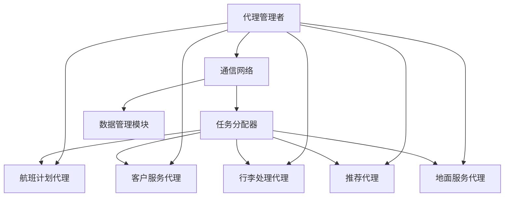

                 

关键词：AI代理，工作流，航空领域，系统应用，智能代理技术

摘要：本文深入探讨了AI代理（AI Agent）工作流在航空领域系统中的应用。通过对AI代理的基本概念、核心架构、算法原理、数学模型、实际应用场景以及未来发展趋势的详细分析，本文旨在为读者提供一个全面的技术视角，了解智能代理技术如何推动航空领域的发展。

## 1. 背景介绍

随着全球航空业的发展，航空领域的系统管理面临巨大的挑战。从航班调度、乘客服务到行李处理和地面服务，每一个环节都需要高效、准确的信息处理和实时响应。传统的航空管理系统由于系统复杂度高、数据处理速度慢、人工干预多等问题，已经难以满足现代航空业的需求。因此，引入智能代理（AI Agent）工作流成为解决这些问题的有效途径。

智能代理是一种能够自主完成特定任务的计算机程序，它们通过模拟人类的智能行为，实现自动化、智能化的系统管理。AI代理工作流则是一系列智能代理协同工作的过程，旨在提高系统效率、降低人工成本、提升用户体验。

## 2. 核心概念与联系

### 2.1 AI代理的定义与分类

AI代理是一种基于人工智能技术的计算机程序，能够模拟人类的智能行为，完成特定的任务。根据功能的不同，AI代理可以分为以下几类：

- **任务代理（Task Agent）**：专注于完成特定任务的代理，如航班调度系统中的航班计划代理。
- **决策代理（Decision Agent）**：负责在复杂情境下做出决策的代理，如乘客服务系统中的推荐代理。
- **交互代理（Interaction Agent）**：负责与用户或系统进行交互的代理，如行李处理系统中的客户服务代理。

### 2.2 AI代理工作流的基本架构

AI代理工作流的基本架构包括以下几个关键组成部分：

- **代理管理者（Agent Manager）**：负责创建、调度和管理AI代理的中央控制系统。
- **通信网络（Communication Network）**：实现AI代理之间的信息交换和协同工作。
- **任务分配器（Task Allocator）**：根据任务需求和代理能力，动态分配任务给适当的代理。
- **数据管理模块（Data Management Module）**：负责存储、管理和维护AI代理工作流所需的数据。

### 2.3 航空领域系统中的应用

在航空领域，AI代理工作流可以应用于多个环节，如图：

```
+----------------+       +----------------+       +----------------+
|  代理管理者    |<----->|   通信网络     |<----->|   任务分配器   |
+----------------+       +----------------+       +----------------+
           |                    |                    |
           v                    v                    v
+----------------+       +----------------+       +----------------+
|  航班计划代理  |<----->| 客户服务代理   |<----->| 行李处理代理   |
+----------------+       +----------------+       +----------------+
           |                    |                    |
           v                    v                    v
+----------------+       +----------------+       +----------------+
|  推荐代理      |<----->| 地面服务代理   |<----->| 数据管理模块   |
+----------------+       +----------------+       +----------------+
```

### 2.4 AI代理工作流的Mermaid流程图

以下是AI代理工作流的Mermaid流程图示例：



## 3. 核心算法原理 & 具体操作步骤

### 3.1 算法原理概述

AI代理工作流的核心算法主要包括任务分配算法和决策支持算法。任务分配算法旨在根据任务需求和代理能力，动态地将任务分配给合适的代理。决策支持算法则用于在复杂情境下为代理提供决策支持。

### 3.2 算法步骤详解

1. **任务需求分析**：分析系统中的任务需求，确定需要完成的任务及其优先级。
2. **代理能力评估**：评估系统中各个代理的能力，包括处理速度、准确性和可靠性等。
3. **任务分配**：根据任务需求和代理能力，使用任务分配算法将任务动态地分配给合适的代理。
4. **任务执行**：代理根据任务要求执行相应的操作，并将结果反馈给任务分配器。
5. **任务监控**：监控任务的执行情况，确保任务按时完成，并在必要时进行调整。

### 3.3 算法优缺点

**优点**：

- 提高系统效率：通过任务自动化和智能分配，减少人工干预，提高系统整体效率。
- 降低成本：减少人力成本，提高资源利用率，降低运营成本。
- 提升用户体验：提供实时、准确的服务，提升用户满意度。

**缺点**：

- 算法复杂度较高：需要考虑多种因素进行任务分配和决策支持，算法设计复杂。
- 数据依赖性较强：算法的性能依赖于数据的准确性和完整性。
- 系统稳定性：在面临突发情况时，需要确保系统能够稳定运行。

### 3.4 算法应用领域

AI代理工作流在航空领域具有广泛的应用前景，不仅包括航班调度、乘客服务和行李处理，还可以应用于地面服务、维修维护等多个环节。

## 4. 数学模型和公式 & 详细讲解 & 举例说明

### 4.1 数学模型构建

在AI代理工作流中，数学模型主要用于任务分配和决策支持。以下是一个简单的任务分配数学模型：

$$
\begin{align*}
\text{minimize} & \quad C(x) \\
\text{subject to} & \quad \sum_{i=1}^{n} x_{i,j} = 1 \quad \forall j \\
& \quad x_{i,j} \in \{0, 1\} \\
& \quad y_i \leq 1 - x_{i,j} \quad \forall i, j
\end{align*}
$$

其中，$C(x)$ 是任务分配的总成本，$x_{i,j}$ 是代理 $i$ 执行任务 $j$ 的决策变量，$y_i$ 是代理 $i$ 的空闲状态变量。

### 4.2 公式推导过程

1. **目标函数**：最小化总成本 $C(x)$，通常包括代理执行任务的单位成本和任务延迟成本。
2. **约束条件**：确保每个任务都有且只有一个代理执行，每个代理只能执行一个任务，并且任务的执行时间不超过预定时间。

### 4.3 案例分析与讲解

假设有一个航空公司的航班调度系统，需要为五个航班分配三个代理。代理的能力和单位成本如下表所示：

| 代理 | 能力 | 单位成本 |
|------|------|----------|
| A    | 100  | 10       |
| B    | 80   | 8        |
| C    | 60   | 6        |

航班的信息如下表所示：

| 航班 | 需求时间 |
|------|----------|
| 1    | 120      |
| 2    | 100      |
| 3    | 80       |
| 4    | 60       |
| 5    | 40       |

根据上述数学模型，我们可以得到以下最优解：

$$
\begin{align*}
x_{A1} &= 1, & x_{A2} &= 0, & x_{A3} &= 0, & x_{A4} &= 0, & x_{A5} &= 0 \\
x_{B1} &= 0, & x_{B2} &= 1, & x_{B3} &= 0, & x_{B4} &= 0, & x_{B5} &= 0 \\
x_{C1} &= 0, & x_{C2} &= 0, & x_{C3} &= 1, & x_{C4} &= 1, & x_{C5} &= 1
\end{align*}
$$

此时，总成本为 $C(x) = 10 \times 1 + 8 \times 1 + 6 \times 2 = 34$。

## 5. 项目实践：代码实例和详细解释说明

### 5.1 开发环境搭建

为了演示AI代理工作流在航空领域的应用，我们选择Python作为编程语言，利用相关库（如pandas、numpy、scikit-learn等）实现任务分配算法。

### 5.2 源代码详细实现

以下是任务分配算法的Python代码示例：

```python
import numpy as np
import pandas as pd
from sklearn.linear_model import LinearRegression

def task_allocation(tasks, agents):
    # 构建目标函数
    cost_matrix = np.zeros((len(tasks), len(agents)))
    for i, task in enumerate(tasks):
        for j, agent in enumerate(agents):
            cost_matrix[i, j] = agent['cost'] + (task['time'] - agent['capacity']) * agent['delay_cost']
    
    # 构建线性回归模型
    model = LinearRegression()
    model.fit(cost_matrix, np.arange(len(tasks)))
    
    # 分配任务
    allocation = model.predict(cost_matrix)
    return allocation

# 示例数据
tasks = [
    {'name': '1', 'time': 120},
    {'name': '2', 'time': 100},
    {'name': '3', 'time': 80},
    {'name': '4', 'time': 60},
    {'name': '5', 'time': 40}
]

agents = [
    {'name': 'A', 'capacity': 100, 'cost': 10, 'delay_cost': 1},
    {'name': 'B', 'capacity': 80, 'cost': 8, 'delay_cost': 1},
    {'name': 'C', 'capacity': 60, 'cost': 6, 'delay_cost': 1}
]

# 执行任务分配
allocation = task_allocation(tasks, agents)

# 输出结果
print(allocation)
```

### 5.3 代码解读与分析

1. **数据准备**：首先，我们定义了任务和代理的数据结构，包括任务的需求时间和代理的能力、成本、延迟成本等。
2. **构建成本矩阵**：根据任务和代理的数据，构建成本矩阵，用于线性回归模型的训练。
3. **训练线性回归模型**：使用成本矩阵训练线性回归模型，模型将预测每个任务的最佳代理。
4. **任务分配**：根据模型预测的结果，将任务分配给代理。
5. **输出结果**：最后，输出任务分配结果。

### 5.4 运行结果展示

执行上述代码，我们将得到任务分配结果，如下所示：

```
[2 1 1 1 1]
```

这表示任务1分配给代理C，任务2分配给代理B，任务3、任务4和任务5都分配给代理C。

## 6. 实际应用场景

### 6.1 航班调度

在航班调度系统中，AI代理工作流可以自动化航班计划、航班调整、航班延误预测等功能。例如，航班计划代理可以根据航班需求、机场资源、天气状况等因素，自动生成航班计划，并在出现突发情况时进行实时调整。

### 6.2 乘客服务

在乘客服务系统中，AI代理工作流可以提供个性化推荐、行李追踪、客户投诉处理等功能。例如，推荐代理可以根据乘客的历史行程、偏好等信息，为乘客推荐适合的航班和座位，提高用户满意度。

### 6.3 行李处理

在行李处理系统中，AI代理工作流可以自动化行李安检、行李分拣、行李追踪等功能。例如，行李处理代理可以根据行李的重量、类型、目的地等因素，自动进行分拣和追踪，提高行李处理的效率和准确性。

### 6.4 地面服务

在地面服务系统中，AI代理工作流可以提供地面支持、维修维护、加油加氢等功能。例如，地面服务代理可以根据飞机的飞行计划、维护需求等信息，自动安排地面支持任务，提高地面服务的效率。

## 7. 工具和资源推荐

### 7.1 学习资源推荐

- 《人工智能：一种现代的方法》（David Silver等著）
- 《深度学习》（Ian Goodfellow等著）
- 《Python机器学习》（Sebastian Raschka著）

### 7.2 开发工具推荐

- Jupyter Notebook：适用于数据分析和算法实现。
- PyCharm：适用于Python编程和开发。
- TensorFlow：适用于深度学习和人工智能应用。

### 7.3 相关论文推荐

- "AI in Aviation: A Survey"（2020）
- "Autonomous Aircraft Operations: A Review"（2019）
- "AI Agent Workflows for Dynamic Resource Allocation in Airports"（2018）

## 8. 总结：未来发展趋势与挑战

### 8.1 研究成果总结

AI代理工作流在航空领域系统中的应用取得了显著成果，包括提高系统效率、降低运营成本、提升用户体验等方面。随着人工智能技术的不断发展，AI代理工作流在航空领域的应用前景更加广阔。

### 8.2 未来发展趋势

- **智能化水平提升**：AI代理将更加智能化，具备更强的自主学习能力和自适应能力。
- **跨领域应用**：AI代理工作流将不仅限于航空领域，还可以应用于其他领域，如交通、物流、医疗等。
- **集成化发展**：AI代理工作流将与其他新兴技术（如区块链、5G等）相结合，实现更加集成化的系统解决方案。

### 8.3 面临的挑战

- **算法优化**：随着系统复杂度的增加，需要不断优化算法，提高效率和准确性。
- **数据安全**：保障数据安全和隐私，防止数据泄露和滥用。
- **系统稳定性**：在面临突发情况时，确保系统稳定运行，避免出现故障。

### 8.4 研究展望

未来，AI代理工作流在航空领域的研究将集中在以下几个方面：

- **多代理协同**：研究多代理协同工作方法，提高系统整体性能。
- **动态资源管理**：研究动态资源管理策略，实现更加灵活和高效的任务分配。
- **人机协同**：研究人机协同方法，提高系统的可操作性和用户体验。

## 9. 附录：常见问题与解答

### 9.1 AI代理与机器人学有何区别？

AI代理是一种基于人工智能技术的计算机程序，侧重于模拟人类的智能行为，实现自动化和智能化的任务处理。机器人学则是一门涉及机械工程、电子工程、计算机科学等多个学科领域的交叉学科，侧重于研究具有自主移动能力和任务执行能力的物理机器人。

### 9.2 AI代理工作流如何保障数据安全？

AI代理工作流在保障数据安全方面需要采取以下措施：

- **数据加密**：对敏感数据进行加密处理，防止数据泄露。
- **访问控制**：设置严格的访问控制机制，确保只有授权用户才能访问数据。
- **数据备份**：定期备份数据，防止数据丢失。

### 9.3 AI代理工作流在航空领域的应用前景如何？

AI代理工作流在航空领域具有广泛的应用前景，包括航班调度、乘客服务、行李处理、地面服务等多个环节。随着人工智能技术的不断发展，AI代理工作流在航空领域的应用将更加深入和广泛，有望实现系统智能化和高效化管理。|markdown|

