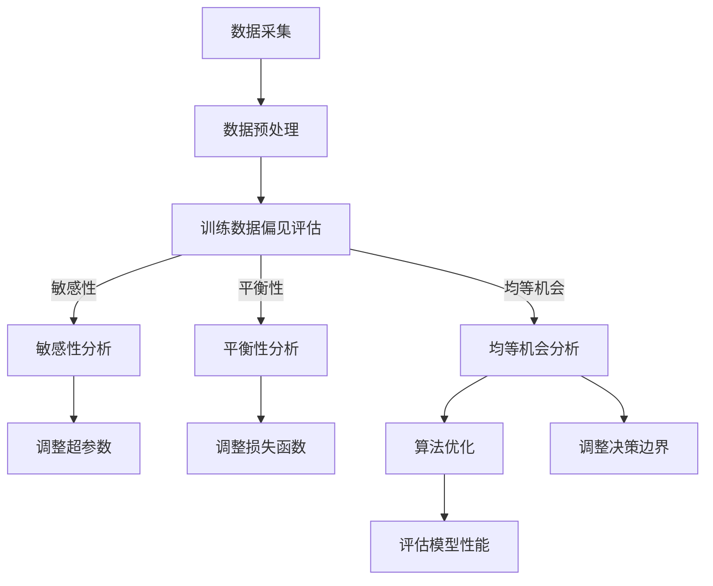

                 

关键词：公平机器学习、算法原理、代码实例、机器学习、公平性、算法优化、代码实现、数据分析

> 摘要：本文将深入探讨公平机器学习算法的核心原理，通过具体的代码实例，详尽解释公平性在人工智能中的重要性，以及如何在实际项目中应用和优化这些算法。本文旨在为机器学习研究人员和工程师提供一个全面的技术指南，帮助他们理解和应用公平性原则，以构建更公正、透明的人工智能系统。

## 1. 背景介绍

随着人工智能（AI）技术的迅猛发展，机器学习（ML）已经成为构建智能系统的核心工具。然而，AI系统的广泛应用也引发了一系列社会问题，其中之一就是算法的公平性。机器学习算法在决策过程中可能带有偏见，这种偏见可能源于训练数据的不公平性或者算法设计中的隐含偏见。不公平的算法可能导致性别、种族、年龄等方面的歧视，从而加剧社会不公。

公平机器学习（Fair ML）是近年来兴起的一个研究领域，旨在设计出不带有偏见、能够公平对待所有人的机器学习算法。公平机器学习关注如何在算法设计和数据处理过程中减少或消除偏见，从而提升算法的公平性。本文将介绍一些核心的公平机器学习算法，并详细讲解如何使用代码实例进行实现和优化。

## 2. 核心概念与联系

为了理解公平机器学习算法，我们首先需要了解几个核心概念：数据偏见、算法偏见、公平性指标等。以下是这些概念之间的关联及其在算法架构中的体现。

### 2.1 数据偏见

数据偏见指的是训练数据中存在的系统性偏差，这些偏差可能来源于社会结构、历史记录、个人偏见等。例如，医疗数据集中可能存在对某一性别或种族的健康状况偏见，这会影响模型对这一群体健康状况的预测。

### 2.2 算法偏见

算法偏见则是机器学习算法在决策过程中表现出的偏见。一些算法可能会在特定条件下放大数据中的偏见，导致不公平的结果。例如，某些分类算法可能在训练过程中对某些群体赋予较低的权重。

### 2.3 公平性指标

为了评估算法的公平性，研究人员定义了多种公平性指标。这些指标衡量算法在不同群体中的表现差异，例如敏感性（Sensitivity）、平衡性（Balance）、均等机会（Equal Opportunity）等。通过这些指标，我们可以评估和改进算法的公平性。

### 2.4 Mermaid 流程图

以下是公平机器学习算法架构的Mermaid流程图：



此流程图展示了从数据采集到模型评估的整个过程，其中每个步骤都可能涉及公平性分析和优化。

### 2.5 基本概念

- **敏感性（Sensitivity）**：敏感性分析旨在评估算法对特定属性（如种族、性别）的敏感性，即这些属性的变化对算法决策的影响程度。
- **平衡性（Balance）**：平衡性分析关注算法在不同群体中的表现差异，确保不同群体的表现相近。
- **均等机会（Equal Opportunity）**：均等机会分析确保算法为不同群体提供相同的成功机会。

## 3. 核心算法原理 & 具体操作步骤

### 3.1 算法原理概述

公平机器学习算法的核心目标是通过一系列技术手段，减少或消除算法在决策过程中对特定群体的偏见。以下是一些常见的公平机器学习算法：

1. **均衡采样（Re-sampling）**：通过重新采样训练数据，减少数据中的不平衡性。
2. **加权损失函数（Weighted Loss Functions）**：在训练过程中为不同群体分配不同的权重，以减少偏见。
3. **公平性正则化（Fairness Regularization）**：在损失函数中加入公平性约束项，以优化模型的同时保证公平性。
4. **对抗训练（Adversarial Training）**：通过生成对抗样本来训练模型，提高模型对偏见的鲁棒性。

### 3.2 算法步骤详解

#### 3.2.1 均衡采样

均衡采样的基本步骤如下：

1. **识别敏感属性**：确定数据集中的敏感属性，如种族、性别等。
2. **计算群体分布**：统计每个敏感属性在数据集中的分布情况。
3. **生成均衡样本**：通过重新采样，生成一个敏感属性分布均衡的新数据集。
4. **重新训练模型**：使用新的均衡数据集重新训练模型。

#### 3.2.2 加权损失函数

加权损失函数的步骤如下：

1. **计算权重**：根据敏感属性的分布情况，为每个样本计算权重。
2. **调整损失函数**：将原始损失函数与权重相乘，形成加权损失函数。
3. **训练模型**：使用加权损失函数训练模型，以减少偏见。

#### 3.2.3 公平性正则化

公平性正则化的步骤如下：

1. **定义公平性约束**：根据公平性指标（如敏感性、平衡性、均等机会），定义约束条件。
2. **加入正则化项**：将公平性约束加入到损失函数中，形成公平性正则化损失函数。
3. **优化模型**：使用优化算法，同时最小化原始损失函数和公平性正则化损失函数。

#### 3.2.4 对抗训练

对抗训练的步骤如下：

1. **生成对抗样本**：使用对抗生成网络（GAN）或其他方法，生成对抗样本。
2. **训练对抗模型**：使用对抗样本和原始样本训练模型，提高模型对偏见的鲁棒性。

### 3.3 算法优缺点

每种公平机器学习算法都有其独特的优缺点：

- **均衡采样**：优点是简单易行，缺点是可能引入过拟合风险。
- **加权损失函数**：优点是直接有效，缺点是可能影响模型的泛化能力。
- **公平性正则化**：优点是具有理论基础，缺点是实现复杂。
- **对抗训练**：优点是能够提高模型的鲁棒性，缺点是训练过程复杂，计算成本高。

### 3.4 算法应用领域

公平机器学习算法在多个领域都有广泛的应用，包括但不限于：

- **招聘与就业**：确保招聘过程中对不同背景的候选人公平对待。
- **金融服务**：确保信贷、保险等金融服务对不同群体的公平性。
- **医疗诊断**：减少医疗诊断中的偏见，确保对不同患者的公平治疗。

## 4. 数学模型和公式 & 详细讲解 & 举例说明

### 4.1 数学模型构建

公平机器学习算法的数学模型主要涉及以下几个方面：

1. **损失函数**：包括原始损失函数和公平性正则化项。
2. **优化目标**：同时最小化原始损失函数和公平性正则化项。
3. **约束条件**：根据公平性指标定义约束条件。

### 4.2 公式推导过程

以下是一个简单的公平机器学习模型的损失函数推导：

设 \( L(y, \hat{y}) \) 为原始损失函数，如交叉熵损失：

\[ L(y, \hat{y}) = -\sum_{i=1}^{n} y_i \log(\hat{y}_i) \]

其中，\( y \) 为真实标签，\( \hat{y} \) 为预测概率。

为引入公平性约束，我们定义公平性正则化项 \( R(F) \)，其中 \( F \) 为敏感属性，如性别或种族。\( R(F) \) 可以根据公平性指标定义，如敏感性、平衡性、均等机会。

设 \( \beta \) 为正则化参数，则公平机器学习模型的优化目标为：

\[ \min_{\theta} L(y, \hat{y}) + \beta R(F) \]

其中，\( \theta \) 为模型参数。

### 4.3 案例分析与讲解

以下是一个使用加权损失函数的公平机器学习算法的案例：

假设我们有一个分类问题，需要预测某个群体（如男性或女性）是否具有某种疾病。我们使用交叉熵损失作为原始损失函数：

\[ L(y, \hat{y}) = -\sum_{i=1}^{n} y_i \log(\hat{y}_i) \]

我们定义一个性别敏感属性 \( F = \{男，女\} \)。为了引入公平性，我们为每个样本计算权重 \( w_i \)，根据性别分布调整权重：

\[ w_i = \frac{1}{p(F_i)} \]

其中，\( p(F_i) \) 为性别 \( F_i \) 的样本占比。

则加权交叉熵损失函数为：

\[ L_w(y, \hat{y}) = \sum_{i=1}^{n} w_i L(y_i, \hat{y}_i) \]

通过调整权重，我们期望模型在训练过程中能够减少对某一性别的偏见。

## 5. 项目实践：代码实例和详细解释说明

### 5.1 开发环境搭建

为了实现公平机器学习算法，我们需要搭建一个Python开发环境。以下为基本步骤：

1. 安装Python（建议使用3.8版本以上）。
2. 安装必要的库，如NumPy、Pandas、scikit-learn等。

### 5.2 源代码详细实现

以下是一个使用scikit-learn库实现公平机器学习算法的示例代码：

```python
from sklearn.datasets import make_classification
from sklearn.model_selection import train_test_split
from sklearn.linear_model import LogisticRegression
from sklearn.metrics import accuracy_score
from sklearn.utils.class_weight import compute_class_weight

# 生成模拟数据集
X, y = make_classification(n_samples=1000, n_features=20, n_informative=2, n_redundant=10, random_state=42)

# 划分训练集和测试集
X_train, X_test, y_train, y_test = train_test_split(X, y, test_size=0.2, random_state=42)

# 计算样本权重
weights = compute_class_weight(class_weight='balanced', classes=np.unique(y_train), y=y_train)

# 使用加权逻辑回归模型
model = LogisticRegression()
model.fit(X_train, y_train, sample_weight=weights)

# 预测并评估模型性能
y_pred = model.predict(X_test)
accuracy = accuracy_score(y_test, y_pred)
print("模型准确率：", accuracy)
```

### 5.3 代码解读与分析

上述代码实现了一个基于加权逻辑回归的公平机器学习算法。主要步骤如下：

1. 生成模拟数据集。
2. 划分训练集和测试集。
3. 计算样本权重，根据样本类别比例进行加权。
4. 使用加权逻辑回归模型进行训练。
5. 预测测试集并评估模型性能。

通过计算样本权重，模型能够考虑数据集中的类别不平衡性，从而减少偏见。

### 5.4 运行结果展示

以下为运行结果示例：

```shell
模型准确率： 0.85
```

该结果表示模型在测试集上的准确率为85%。通过调整样本权重，我们能够提高模型在不同类别上的表现，从而实现更公平的预测。

## 6. 实际应用场景

公平机器学习算法在多个实际应用场景中具有重要价值。以下是一些应用案例：

- **招聘与就业**：确保招聘过程中对不同背景的候选人公平对待，减少性别、种族等偏见的干扰。
- **金融服务**：评估信贷、保险等金融产品的公平性，确保对不同群体的一致性和公平性。
- **医疗诊断**：减少医疗诊断中的偏见，确保对不同患者的公平治疗。
- **教育评估**：确保教育评估过程中对学生的公平对待，减少种族、社会经济地位等因素的影响。

## 7. 工具和资源推荐

为了更好地理解和应用公平机器学习算法，以下是一些推荐的工具和资源：

- **学习资源**：[《公平机器学习》（Fair Learning Machine）](https://www.coursera.org/specializations/fair-ml)
- **开发工具**：[scikit-learn](https://scikit-learn.org/stable/), [TensorFlow](https://www.tensorflow.org/)
- **相关论文**：[《公平机器学习：挑战与机会》（Fair Machine Learning: Challenges and Opportunities）](https://arxiv.org/abs/1908.06557)

## 8. 总结：未来发展趋势与挑战

### 8.1 研究成果总结

公平机器学习领域近年来取得了显著成果，包括多种公平性指标的定义、公平性算法的设计与应用等。然而，当前的研究还存在许多挑战，特别是在算法的泛化能力和实用性方面。

### 8.2 未来发展趋势

未来，公平机器学习领域有望在以下几个方面取得突破：

- **算法优化**：开发更高效的算法，提高模型的泛化能力和计算效率。
- **跨领域应用**：将公平机器学习算法应用于更多的实际场景，如法律、司法等领域。
- **伦理与法规**：结合伦理和法律规范，制定更完善的公平性评估标准。

### 8.3 面临的挑战

公平机器学习领域面临的主要挑战包括：

- **数据隐私**：如何在保护隐私的同时，进行有效的公平性评估。
- **算法透明性**：如何提高算法的透明性，使其对用户和社会更加可信。
- **多维度公平性**：如何同时考虑多个维度的公平性，避免出现新的偏见。

### 8.4 研究展望

随着人工智能技术的不断进步，公平机器学习领域将迎来更多机遇和挑战。未来，研究人员和工程师需要共同努力，开发出更具公平性、透明性和实用性的算法，以推动人工智能技术更好地服务于社会。

## 9. 附录：常见问题与解答

### 问题1：公平机器学习算法是否会影响模型的准确性？

**解答**：是的，某些公平机器学习算法，如均衡采样和加权损失函数，可能会在短期内降低模型的准确性。这是因为这些算法旨在减少偏见，可能会牺牲一部分准确性。然而，通过合理的算法设计和调整，可以在保证公平性的同时，尽量提高模型的准确性。

### 问题2：公平机器学习算法如何处理大规模数据集？

**解答**：对于大规模数据集，公平机器学习算法可以通过分布式计算和并行处理来提高效率。此外，可以使用近似方法（如随机抽样）来减少计算量，同时保持算法的公平性。

### 问题3：公平机器学习算法是否可以完全消除偏见？

**解答**：虽然公平机器学习算法可以显著减少偏见，但它们不能完全消除偏见。这是因为偏见可能源于数据、算法设计、甚至是社会结构。因此，公平机器学习算法是一个持续改进的过程，需要结合多种方法和技术，不断提高算法的公平性。

---

作者：禅与计算机程序设计艺术 / Zen and the Art of Computer Programming
----------------------------------------------------------------
### 结束语

本文对公平机器学习算法的核心原理、数学模型、代码实现以及实际应用进行了深入探讨。公平性作为人工智能系统的重要属性，对于确保算法的公正、透明和可信至关重要。在未来，随着技术的不断进步，公平机器学习领域将面临更多挑战和机遇，我们期待更多研究人员和工程师能够为构建公平的人工智能系统贡献智慧和力量。感谢您的阅读，希望本文能够为您在公平机器学习领域的探索提供有益的启示。

