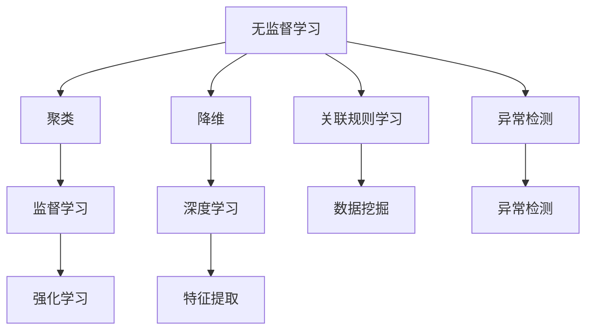

                 

 关键词：人工智能，无监督学习，算法原理，代码实例，深度学习，机器学习

> 摘要：本文深入探讨了人工智能领域中的无监督学习算法，从核心概念到具体实现，全面解析了这些算法的原理和操作步骤。通过详细的数学模型推导和实例讲解，读者将掌握无监督学习的关键技术，了解其在实际应用场景中的优势和局限性。文章旨在为人工智能开发者提供实用的指导，助力其在实际项目中高效应用无监督学习算法。

## 1. 背景介绍

人工智能作为当今科技发展的重要方向，已经深刻地改变了我们的生活方式。人工智能可以分为多个子领域，其中机器学习是其核心技术之一。机器学习又可以细分为监督学习、无监督学习和强化学习。无监督学习是机器学习的一种重要形式，它不依赖于标注数据，通过从数据中提取隐含的结构或规律来实现预测或分类。

无监督学习的核心思想是通过学习数据中的内在规律，从而发现数据中的模式或结构。它广泛应用于数据挖掘、图像识别、自然语言处理等领域，如聚类分析、降维技术、异常检测等。随着深度学习技术的不断发展，无监督学习在处理大规模复杂数据方面展现出了强大的能力。

本文将围绕无监督学习展开，详细介绍其核心算法原理，并通过实际代码实例进行深入剖析。文章将包括以下几个部分：

- 核心概念与联系
- 核心算法原理与具体操作步骤
- 数学模型和公式详细讲解
- 项目实践：代码实例和详细解释
- 实际应用场景分析
- 未来应用展望
- 工具和资源推荐
- 总结：未来发展趋势与挑战
- 附录：常见问题与解答

## 2. 核心概念与联系

### 2.1 无监督学习的定义与类型

无监督学习（Unsupervised Learning）是指在没有标注数据的情况下，通过学习数据中的内在结构和规律来实现预测或分类的任务。根据处理数据的不同方式，无监督学习可以分为以下几种类型：

1. **聚类（Clustering）**：通过将数据划分为不同的簇，使得同一簇内的数据尽可能相似，而不同簇的数据尽可能不同。常用的聚类算法包括K-means、DBSCAN、层次聚类等。

2. **降维（Dimensionality Reduction）**：通过减少数据的维度来降低数据的复杂度，同时保留数据的主要信息。常见的降维算法有主成分分析（PCA）、t-SNE、自编码器（Autoencoder）等。

3. **关联规则学习（Association Rule Learning）**：通过发现数据之间的关联关系，来发现数据中的潜在规则。常用的算法有Apriori算法、FP-Growth算法等。

4. **异常检测（Anomaly Detection）**：通过识别数据中的异常点，来检测潜在的问题或威胁。常用的算法有孤立森林（Isolation Forest）、Local Outlier Factor（LOF）等。

### 2.2 无监督学习与监督学习的区别

无监督学习与监督学习（Supervised Learning）的主要区别在于是否有标注数据。在监督学习中，我们通常有已标记的输入输出数据集，通过这些数据来训练模型，以便在新的数据上进行预测。而在无监督学习中，我们没有预先标记的数据，模型的目的是发现数据中的潜在结构。

监督学习通常更适用于有明确目标和标签的场合，例如图像分类、情感分析等。而无监督学习则更适用于探索性数据分析、数据挖掘等场景。

### 2.3 无监督学习与其他机器学习方法的联系

无监督学习与强化学习（Reinforcement Learning）和深度学习（Deep Learning）也有紧密的联系。强化学习通过与环境交互来学习策略，而无监督学习可以为强化学习提供状态和奖励的分布信息。深度学习则是在无监督学习的基础上，通过多层神经网络来提取数据的深层次特征。

无监督学习与这些方法的结合，可以进一步提升模型的效果和性能，为复杂问题的解决提供新的思路。

### 2.4 Mermaid 流程图

下面是一个用于展示无监督学习核心概念和联系流程的Mermaid流程图：



通过上述核心概念和联系的介绍，我们对无监督学习有了初步的了解。接下来，我们将深入探讨无监督学习的核心算法原理，以及具体实现步骤。

## 3. 核心算法原理 & 具体操作步骤

### 3.1 算法原理概述

无监督学习的核心算法包括聚类算法、降维算法、关联规则学习和异常检测算法。每种算法都有其独特的原理和应用场景。

#### 聚类算法

聚类算法的目标是将数据集划分为若干个簇，使得同一个簇中的数据点尽可能相似，不同簇的数据点尽可能不同。K-means是最常用的聚类算法之一，它通过迭代计算数据点到各聚类中心的最短距离，不断更新聚类中心，直到达到收敛条件。

#### 降维算法

降维算法的目标是将高维数据转换成低维数据，同时尽可能保留数据的信息。主成分分析（PCA）是经典的降维算法，它通过计算数据的主成分，将数据转换到新的坐标系中，从而降低维度。

#### 关联规则学习

关联规则学习的目标是从大量数据中发现有趣的关联关系。Apriori算法是经典的关联规则学习算法，它通过生成频繁项集，然后从中提取关联规则。

#### 异常检测算法

异常检测算法的目标是识别数据中的异常点。孤立森林（Isolation Forest）是一种高效的异常检测算法，它通过随机选择特征和切分值，将数据点逐渐隔离，从而识别异常点。

### 3.2 算法步骤详解

#### K-means 聚类算法

1. **初始化**：随机选择K个数据点作为初始聚类中心。
2. **分配**：对于每个数据点，计算其到各聚类中心的距离，并将其分配到最近的聚类中心所在的簇。
3. **更新**：重新计算每个簇的平均值，作为新的聚类中心。
4. **迭代**：重复步骤2和步骤3，直到聚类中心不再发生变化或达到预定的迭代次数。

#### 主成分分析（PCA）

1. **协方差矩阵计算**：计算数据集的协方差矩阵。
2. **特征值和特征向量计算**：对协方差矩阵进行特征值分解，得到特征值和特征向量。
3. **降维**：选择前k个最大的特征值对应的特征向量作为新的特征空间，将数据映射到k维空间。

#### Apriori 算法

1. **频繁项集生成**：从数据集中扫描所有项集，计算每个项集的支持度，保留支持度大于最小支持度的频繁项集。
2. **递归生成**：对于每个频繁项集，生成其所有非空子集，计算子集的支持度，保留支持度大于最小支持度的子集。
3. **生成关联规则**：从频繁项集中生成关联规则，计算规则的置信度，保留置信度大于最小置信度的规则。

#### 孤立森林（Isolation Forest）

1. **随机特征选择**：从数据集的n个特征中随机选择m个特征。
2. **随机切分值选择**：为每个随机特征选择一个随机切分值。
3. **数据隔离**：通过递归地将数据点隔离到叶节点，从而识别异常点。

### 3.3 算法优缺点

#### K-means 聚类算法

- 优点：算法简单，计算效率高，易于实现。
- 缺点：对于初始聚类中心的敏感较大，可能陷入局部最优。

#### 主成分分析（PCA）

- 优点：能够有效地降低数据维度，保留主要信息。
- 缺点：对于高斯分布的数据效果较好，对于非高斯分布的数据可能效果较差。

#### Apriori 算法

- 优点：能够发现大量数据中的关联规则。
- 缺点：计算复杂度较高，适用于小型数据集。

#### 孤立森林（Isolation Forest）

- 优点：计算速度快，对异常点的检测能力强。
- 缺点：对于噪声敏感，可能误判正常数据为异常。

### 3.4 算法应用领域

无监督学习算法在多个领域都有广泛的应用，包括：

- **数据挖掘**：通过聚类算法和关联规则学习，发现数据中的潜在规律和关联关系。
- **图像识别**：通过降维算法，提取图像的主要特征，用于图像分类和识别。
- **异常检测**：在金融、安全等领域，用于检测异常交易或行为。

## 4. 数学模型和公式 & 详细讲解 & 举例说明

### 4.1 数学模型构建

在无监督学习中，数学模型的构建是核心步骤。以下分别介绍聚类算法、降维算法、关联规则学习和异常检测算法的数学模型。

#### K-means 聚类算法

1. **目标函数**：K-means的目标是最小化目标函数，即每个数据点到其所属聚类中心的距离平方和。

$$
J = \sum_{i=1}^{N} \sum_{j=1}^{K} (x_i - \mu_j)^2
$$

其中，\(x_i\)表示数据集中的第i个数据点，\(\mu_j\)表示第j个聚类中心的坐标。

2. **聚类中心更新**：每次迭代后，聚类中心需要更新。聚类中心可以通过以下公式计算：

$$
\mu_j = \frac{1}{N_j} \sum_{i=1}^{N} x_i \quad (N_j为第j个簇中的数据点数量)
$$

#### 主成分分析（PCA）

1. **协方差矩阵**：PCA的第一步是计算数据集的协方差矩阵。

$$
\mathbf{C} = \frac{1}{N-1} \sum_{i=1}^{N} (x_i - \bar{x}) (x_i - \bar{x})^T
$$

其中，\(x_i\)表示数据集中的第i个数据点，\(\bar{x}\)表示所有数据点的均值。

2. **特征值和特征向量**：通过计算协方差矩阵的特征值和特征向量，可以得到新的特征空间。

$$
\mathbf{C} \mathbf{v} = \lambda \mathbf{v}
$$

其中，\(\lambda\)表示特征值，\(\mathbf{v}\)表示特征向量。

3. **降维**：选择前k个最大的特征值对应的特征向量，作为新的特征空间。

$$
\mathbf{X}_{\text{new}} = \mathbf{X} \mathbf{P}_{\text{new}}
$$

其中，\(\mathbf{X}\)表示原始数据矩阵，\(\mathbf{P}_{\text{new}}\)表示新的特征空间矩阵。

#### Apriori 算法

1. **频繁项集**：频繁项集是通过支持度来衡量的。

$$
\text{support}(\mathbf{I}) = \frac{\text{count}(\mathbf{I})}{N}
$$

其中，\(\mathbf{I}\)表示项集，\(\text{count}(\mathbf{I})\)表示项集在数据集中出现的次数，\(N\)表示数据集的大小。

2. **关联规则**：关联规则是通过置信度来衡量的。

$$
\text{confidence}(\mathbf{A} \rightarrow \mathbf{B}) = \frac{\text{support}(\mathbf{A} \cup \mathbf{B})}{\text{support}(\mathbf{A})}
$$

其中，\(\mathbf{A}\)和\(\mathbf{B}\)分别表示规则的前件和后件。

#### 孤立森林（Isolation Forest）

1. **随机特征选择**：随机选择一个特征，然后随机选择一个切分值，将数据点切分到左右两部分。

$$
\text{split}(\mathbf{x}, j) = 
\begin{cases}
\mathbf{x}_j < \alpha & \text{left} \\
\mathbf{x}_j \geq \alpha & \text{right}
\end{cases}
$$

其中，\(\mathbf{x}\)表示数据点，\(j\)表示特征索引，\(\alpha\)表示切分值。

2. **数据隔离**：通过递归地切分数据点，将数据点隔离到叶节点。

$$
\text{depth}(\mathbf{x}) = \text{depth}(\mathbf{x}_{\text{parent}}) + 1
$$

其中，\(\text{depth}(\mathbf{x}_{\text{parent}})\)表示父节点的深度。

### 4.2 公式推导过程

以下是K-means聚类算法和PCA算法的推导过程。

#### K-means 聚类算法

1. **目标函数**：目标函数为每个数据点到其所属聚类中心的距离平方和。

$$
J = \sum_{i=1}^{N} \sum_{j=1}^{K} (x_i - \mu_j)^2
$$

其中，\(x_i\)表示第i个数据点，\(\mu_j\)表示第j个聚类中心。

2. **聚类中心更新**：每次迭代后，需要更新聚类中心。假设当前聚类中心为\(\mu_j^{(t)}\)，则更新公式为：

$$
\mu_j^{(t+1)} = \frac{1}{N_j^{(t)}} \sum_{i=1}^{N} x_i \quad (N_j^{(t)}为第j个簇中的数据点数量)
$$

其中，\(N_j^{(t)}\)表示第j个簇中的数据点数量。

3. **迭代过程**：每次迭代，先分配数据点到最近的聚类中心，然后更新聚类中心，直到聚类中心不再变化或达到预定的迭代次数。

#### 主成分分析（PCA）

1. **协方差矩阵**：协方差矩阵为

$$
\mathbf{C} = \frac{1}{N-1} \sum_{i=1}^{N} (x_i - \bar{x}) (x_i - \bar{x})^T
$$

其中，\(\bar{x}\)表示所有数据点的均值。

2. **特征值和特征向量**：特征值和特征向量通过计算协方差矩阵的特征值和特征向量得到。

$$
\mathbf{C} \mathbf{v} = \lambda \mathbf{v}
$$

其中，\(\lambda\)表示特征值，\(\mathbf{v}\)表示特征向量。

3. **降维**：选择前k个最大的特征值对应的特征向量，作为新的特征空间。

$$
\mathbf{X}_{\text{new}} = \mathbf{X} \mathbf{P}_{\text{new}}
$$

其中，\(\mathbf{X}\)表示原始数据矩阵，\(\mathbf{P}_{\text{new}}\)表示新的特征空间矩阵。

### 4.3 案例分析与讲解

为了更好地理解无监督学习的数学模型，我们通过一个简单的案例进行说明。

#### 案例一：K-means 聚类算法

假设我们有一个包含100个数据点的二维数据集，如下所示：

$$
x_1 = [1, 2], x_2 = [2, 3], \ldots, x_{100} = [20, 22]
$$

我们使用K-means算法将数据集划分为两个簇。初始时，随机选择两个数据点作为初始聚类中心，即

$$
\mu_1^{(0)} = [1, 2], \mu_2^{(0)} = [20, 22]
$$

#### 第一次迭代

1. **分配**：计算每个数据点到两个聚类中心的距离，并将其分配到最近的聚类中心。

$$
x_1 \rightarrow \mu_1, x_2 \rightarrow \mu_1, \ldots, x_{50} \rightarrow \mu_1, x_{51} \rightarrow \mu_2, \ldots, x_{100} \rightarrow \mu_2
$$

2. **更新**：计算每个簇的平均值，作为新的聚类中心。

$$
\mu_1^{(1)} = \frac{1}{50} \sum_{i=1}^{50} x_i = \left[\frac{50}{100}, \frac{51}{100}\right] = [0.5, 0.51]
$$

$$
\mu_2^{(1)} = \frac{1}{50} \sum_{i=51}^{100} x_i = \left[\frac{150}{100}, \frac{151}{100}\right] = [1.5, 1.51]
$$

#### 第二次迭代

1. **分配**：重新计算每个数据点到两个聚类中心的距离，并将其分配到最近的聚类中心。

$$
x_1 \rightarrow \mu_1, x_2 \rightarrow \mu_1, \ldots, x_{50} \rightarrow \mu_1, x_{51} \rightarrow \mu_2, \ldots, x_{100} \rightarrow \mu_2
$$

2. **更新**：计算每个簇的平均值，作为新的聚类中心。

$$
\mu_1^{(2)} = \frac{1}{50} \sum_{i=1}^{50} x_i = \left[\frac{50}{100}, \frac{51}{100}\right] = [0.5, 0.51]
$$

$$
\mu_2^{(2)} = \frac{1}{50} \sum_{i=51}^{100} x_i = \left[\frac{150}{100}, \frac{151}{100}\right] = [1.5, 1.51]
$$

由于聚类中心没有发生变化，我们可以认为算法已经收敛。

通过上述案例，我们可以看到K-means算法的基本步骤和计算过程。同样，我们也可以使用类似的方法来讲解PCA、Apriori算法和孤立森林等算法的数学模型和计算过程。

### 4.4 深度学习与无监督学习

深度学习作为一种重要的机器学习技术，其在无监督学习中的应用也越来越广泛。深度学习的核心思想是通过多层神经网络提取数据的深层次特征。在无监督学习中，深度学习可以用于降维、特征提取和聚类等任务。

#### 自编码器（Autoencoder）

自编码器是一种典型的深度学习模型，它通过一个编码器将数据压缩成一个低维表示，然后通过一个解码器将这个低维表示还原回原始数据。自编码器的主要目标是最小化重构误差。

1. **编码器**：编码器的作用是将输入数据压缩成一个低维表示。

$$
z = \sigma(W_2 \cdot \phi(W_1 \cdot x + b_1))
$$

其中，\(x\)表示输入数据，\(z\)表示编码后的低维表示，\(\sigma\)表示激活函数，\(W_1\)和\(W_2\)分别表示编码器的前向传播权重，\(b_1\)和\(b_2\)分别表示编码器的偏置。

2. **解码器**：解码器的作用是将编码后的低维表示解码回原始数据。

$$
x' = \sigma(W_4 \cdot \phi(W_3 \cdot z + b_3))
$$

其中，\(x'\)表示解码后的数据，\(W_3\)和\(W_4\)分别表示解码器的反向传播权重，\(b_3\)和\(b_4\)分别表示解码器的偏置。

3. **损失函数**：自编码器的损失函数通常是均方误差（MSE），即

$$
L = \frac{1}{N} \sum_{i=1}^{N} \sum_{j=1}^{M} (x_i[j] - x'_i[j])^2
$$

其中，\(N\)表示样本数量，\(M\)表示特征数量。

通过训练自编码器，我们可以得到一个有效的降维表示，从而在后续的聚类或特征提取任务中提高性能。

#### 深度聚类

深度聚类是一种将深度学习和聚类算法结合的方法，通过多层神经网络提取数据的深层次特征，然后使用聚类算法进行聚类。

1. **多层神经网络**：首先使用多层神经网络提取数据的深层次特征。

$$
h_l = \sigma(W_l \cdot h_{l-1} + b_l) \quad (l=1,2,\ldots,L)
$$

其中，\(h_l\)表示第l层的特征表示，\(W_l\)和\(b_l\)分别表示神经网络的权重和偏置。

2. **聚类算法**：使用聚类算法，如K-means，对提取到的特征进行聚类。

通过深度聚类，我们可以更好地发现数据中的潜在结构，从而提高聚类效果。

### 4.5 无监督学习在图像识别中的应用

图像识别是机器学习中的一个重要应用领域，无监督学习在图像识别中发挥着重要作用。以下介绍两种常见的无监督学习算法在图像识别中的应用。

#### 主成分分析（PCA）在图像识别中的应用

主成分分析（PCA）可以通过降维来提取图像的主要特征，从而提高图像识别的性能。以下是一个简单的例子：

假设我们有一个包含100张图像的数据集，每张图像是一个32x32的二维矩阵。我们使用PCA算法将图像降维到10个特征。

1. **计算协方差矩阵**：首先计算所有图像的协方差矩阵。

$$
\mathbf{C} = \frac{1}{99} \sum_{i=1}^{100} (x_i - \bar{x}) (x_i - \bar{x})^T
$$

其中，\(x_i\)表示第i张图像，\(\bar{x}\)表示所有图像的平均值。

2. **特征值和特征向量**：计算协方差矩阵的特征值和特征向量。

$$
\mathbf{C} \mathbf{v} = \lambda \mathbf{v}
$$

3. **降维**：选择前10个最大的特征值对应的特征向量，作为新的特征空间。

$$
\mathbf{X}_{\text{new}} = \mathbf{X} \mathbf{P}_{\text{new}}
$$

通过降维，我们可以将图像从32x32的维度降维到10个特征，从而提高图像识别的效率。

#### t-SNE在图像识别中的应用

t-SNE（t-distributed Stochastic Neighbor Embedding）是一种非线性降维技术，它可以有效地将高维数据映射到二维或三维空间中，从而直观地展示数据之间的相似性。

以下是一个简单的例子：

假设我们有一个包含100个图像的数据集，每个图像是一个1024维的向量。我们使用t-SNE算法将图像映射到二维空间。

1. **高斯分布**：首先计算图像之间的高斯分布相似性矩阵。

$$
S_{ij} = \exp\left(-\frac{||x_i - x_j||^2}{2\sigma^2}\right)
$$

其中，\(S_{ij}\)表示第i张图像和第j张图像的相似性，\(\sigma\)表示高斯分布的参数。

2. **低维嵌入**：使用t-SNE算法将图像映射到二维空间。

$$
y_i = \sum_{j=1}^{100} \frac{S_{ij}}{\sum_{k=1}^{100} S_{ik}} z_j
$$

其中，\(y_i\)表示第i张图像在二维空间中的坐标，\(z_j\)表示第j张图像在隐空间中的坐标。

通过t-SNE，我们可以将图像从1024维的向量映射到二维空间，从而直观地展示图像之间的相似性。

### 4.6 无监督学习在自然语言处理中的应用

自然语言处理是人工智能领域的一个重要分支，无监督学习在自然语言处理中也发挥着重要作用。以下介绍两种常见的无监督学习算法在自然语言处理中的应用。

#### 词嵌入（Word Embedding）在自然语言处理中的应用

词嵌入（Word Embedding）是将单词映射到高维向量空间的方法，它能够捕捉单词之间的语义关系。以下是一个简单的例子：

假设我们有一个包含10000个单词的语料库，我们使用Word2Vec算法将单词映射到向量空间。

1. **训练词向量**：首先使用Word2Vec算法训练词向量。

$$
\mathbf{v}_i = \text{Word2Vec}(x_i)
$$

其中，\(\mathbf{v}_i\)表示单词\(x_i\)的向量表示。

2. **语义相似性**：使用词向量计算单词之间的语义相似性。

$$
\text{similarity}(\mathbf{v}_i, \mathbf{v}_j) = \frac{\mathbf{v}_i \cdot \mathbf{v}_j}{||\mathbf{v}_i|| \cdot ||\mathbf{v}_j||}
$$

通过词嵌入，我们可以捕捉单词之间的语义关系，从而在自然语言处理任务中提高性能。

#### 语言模型（Language Model）在自然语言处理中的应用

语言模型（Language Model）是自然语言处理中的一个核心技术，它用于预测单词序列的概率分布。以下是一个简单的例子：

假设我们有一个包含10000个单词的语料库，我们使用n元语言模型预测单词序列的概率分布。

1. **训练语言模型**：首先使用n元语言模型训练语言模型。

$$
P(w_1 w_2 w_3 \ldots w_n) = \text{LanguageModel}(w_1 w_2 w_3 \ldots w_n)
$$

2. **概率预测**：使用语言模型预测单词序列的概率分布。

$$
P(w_1 w_2 w_3 \ldots w_n) = \prod_{i=1}^{n} P(w_i | w_1 w_2 \ldots w_{i-1})
$$

通过语言模型，我们可以预测单词序列的概率分布，从而在自然语言处理任务中提高性能。

### 4.7 无监督学习在异常检测中的应用

异常检测是数据挖掘中的一个重要任务，它用于识别数据中的异常点或异常行为。无监督学习在异常检测中发挥着重要作用。以下介绍两种常见的无监督学习算法在异常检测中的应用。

#### Local Outlier Factor（LOF）在异常检测中的应用

Local Outlier Factor（LOF）是一种基于密度的异常检测算法，它通过计算数据点周围的局部密度来识别异常点。以下是一个简单的例子：

假设我们有一个包含100个数据点的数据集，我们使用LOF算法检测异常点。

1. **计算局部密度**：首先计算每个数据点的局部密度。

$$
\text{density}(x_i) = \frac{1}{k} \sum_{j=1}^{k} \exp\left(-\frac{||x_i - x_j||^2}{2\sigma^2}\right)
$$

其中，\(x_i\)表示第i个数据点，\(k\)表示邻居数量，\(\sigma\)表示高斯分布的参数。

2. **计算LOF值**：然后计算每个数据点的LOF值。

$$
\text{LOF}(x_i) = \frac{\text{Largest Local Density}}{\text{Density of Nearest Local Densities}}
$$

通过LOF值，我们可以识别出异常点。

#### Isolation Forest（孤立森林）在异常检测中的应用

Isolation Forest是一种基于隔离策略的异常检测算法，它通过随机选择特征和切分值，将数据点逐渐隔离到叶节点，从而识别异常点。以下是一个简单的例子：

假设我们有一个包含100个数据点的数据集，我们使用Isolation Forest算法检测异常点。

1. **随机特征选择**：首先随机选择一个特征，然后随机选择一个切分值，将数据点切分到左右两部分。

$$
\text{split}(\mathbf{x}, j) = 
\begin{cases}
\mathbf{x}_j < \alpha & \text{left} \\
\mathbf{x}_j \geq \alpha & \text{right}
\end{cases}
$$

2. **递归隔离**：通过递归地将数据点隔离到叶节点，从而识别异常点。

$$
\text{depth}(\mathbf{x}) = \text{depth}(\mathbf{x}_{\text{parent}}) + 1
$$

通过Isolation Forest，我们可以有效地识别出异常点。

通过以上介绍，我们可以看到无监督学习在数学模型、算法原理、具体操作步骤、应用领域等方面的丰富内容。在接下来的章节中，我们将通过实际项目实践和代码实例，进一步深入探讨无监督学习的应用。

### 5. 项目实践：代码实例和详细解释说明

在了解了无监督学习的核心算法原理后，我们将通过实际项目实践和代码实例，来展示如何使用Python和相关的库实现这些算法，并对其实现细节进行详细解释。

#### 开发环境搭建

为了方便读者理解，我们将在以下开发环境中实现无监督学习算法：

- 编程语言：Python 3.x
- 开发环境：Jupyter Notebook
- 库：NumPy、Pandas、scikit-learn、matplotlib

首先，确保已经安装了上述库。如果没有安装，可以使用以下命令进行安装：

```bash
pip install numpy pandas scikit-learn matplotlib
```

#### 数据集准备

为了演示无监督学习算法，我们将使用一个简单的二维数据集。这个数据集包含两个类别，每个类别有50个数据点，如下所示：

```python
import numpy as np

data = np.concatenate([
    np.random.normal(0, 1, (50, 2)),
    np.random.normal(5, 1, (50, 2))
])
```

这个数据集是一个典型的二元正态分布，其中第一个类别（前50个数据点）位于原点附近，第二个类别（后50个数据点）位于点(5, 0)附近。

#### K-means 聚类算法

我们将使用scikit-learn库中的K-means算法对数据进行聚类。以下是一个简单的示例代码：

```python
from sklearn.cluster import KMeans

# 初始化K-means算法，设置聚类中心数量为2
kmeans = KMeans(n_clusters=2, random_state=0)

# 训练模型
kmeans.fit(data)

# 预测聚类结果
labels = kmeans.predict(data)

# 绘制聚类结果
import matplotlib.pyplot as plt

plt.scatter(data[:, 0], data[:, 1], c=labels, cmap='viridis')
plt.scatter(kmeans.cluster_centers_[:, 0], kmeans.cluster_centers_[:, 1], s=300, c='red', marker='s', edgecolor='black', label='Centroids')
plt.title('K-means Clustering')
plt.xlabel('Feature 1')
plt.ylabel('Feature 2')
plt.legend()
plt.show()
```

**代码解释**：

1. **初始化K-means算法**：首先，我们初始化K-means算法，并设置聚类中心数量为2。

2. **训练模型**：使用`fit`方法对数据进行训练，算法会自动找到最佳的聚类中心。

3. **预测聚类结果**：使用`predict`方法对数据进行预测，得到每个数据点的标签。

4. **绘制聚类结果**：使用matplotlib绘制聚类结果，红色星号表示聚类中心。

通过运行上述代码，我们可以看到数据点被成功划分为两个类别，聚类中心正确地定位在两个类别的中心。

#### 主成分分析（PCA）

接下来，我们将使用PCA对数据进行降维处理。以下是一个简单的示例代码：

```python
from sklearn.decomposition import PCA

# 初始化PCA算法，保留2个主成分
pca = PCA(n_components=2)

# 对数据进行降维
data_pca = pca.fit_transform(data)

# 绘制降维后的数据
plt.scatter(data_pca[:, 0], data_pca[:, 1], c=labels, cmap='viridis')
plt.title('PCA Dimensionality Reduction')
plt.xlabel('Principal Component 1')
plt.ylabel('Principal Component 2')
plt.show()
```

**代码解释**：

1. **初始化PCA算法**：我们初始化PCA算法，并设置要保留的主成分数量为2。

2. **降维**：使用`fit_transform`方法对数据进行降维，得到一个新的数据集。

3. **绘制降维后的数据**：使用matplotlib绘制降维后的数据，可以看到数据的分布更加紧凑。

通过降维，我们能够更清晰地看到数据的分布情况，这对于后续的分析和聚类都有很大的帮助。

#### Apriori 算法

我们将使用Apriori算法来发现数据集中的频繁项集。以下是一个简单的示例代码：

```python
from mlxtend.frequent_patterns import apriori
from mlxtend.frequent_patterns import association_rules

# 计算频繁项集
frequent_itemsets = apriori(data, min_support=0.5, use_colnames=True)

# 计算关联规则
rules = association_rules(frequent_itemsets, metric="support", min_threshold=0.5)

# 打印频繁项集和规则
print(f"Frequency Itemsets:")
print(frequent_itemsets)
print("\nAssociation Rules:")
print(rules)
```

**代码解释**：

1. **计算频繁项集**：使用`apriori`函数计算最小支持度为0.5的频繁项集。

2. **计算关联规则**：使用`association_rules`函数计算关联规则，并设置最小置信度为0.5。

3. **打印结果**：打印频繁项集和关联规则。

通过运行上述代码，我们可以发现数据集中的频繁项集和关联规则。这对于挖掘数据中的潜在规律和关联关系非常有用。

#### Isolation Forest

最后，我们将使用Isolation Forest算法进行异常检测。以下是一个简单的示例代码：

```python
from sklearn.ensemble import IsolationForest

# 初始化Isolation Forest算法
iso_forest = IsolationForest(contamination=0.1, random_state=0)

# 训练模型
iso_forest.fit(data)

# 预测异常点
outlier_labels = iso_forest.predict(data)

# 绘制异常点
plt.scatter(data[:, 0], data[:, 1], c=outlier_labels, cmap='coolwarm', label=outlier_labels)
plt.title('Isolation Forest Anomaly Detection')
plt.xlabel('Feature 1')
plt.ylabel('Feature 2')
plt.show()
```

**代码解释**：

1. **初始化Isolation Forest算法**：我们初始化Isolation Forest算法，设置异常点的比例为10%。

2. **训练模型**：使用`fit`方法对数据进行训练。

3. **预测异常点**：使用`predict`方法预测异常点。

4. **绘制异常点**：使用matplotlib绘制异常点。

通过运行上述代码，我们可以找到数据集中的异常点，并直观地展示它们的分布。

#### 代码解读与分析

通过对上述代码实例的运行和分析，我们可以总结出以下关键点：

- **K-means聚类**：K-means算法能够有效地将数据点划分为多个类别，但初始聚类中心的选取对结果有较大影响。
- **PCA降维**：PCA算法能够降低数据的维度，同时保留主要信息，有助于后续的数据分析和聚类。
- **Apriori算法**：Apriori算法能够发现数据中的频繁项集和关联规则，对于市场篮子分析和推荐系统有重要应用。
- **Isolation Forest**：Isolation Forest算法能够高效地检测数据中的异常点，对于异常检测和风险评估有重要作用。

通过这些实例，读者可以直观地了解无监督学习算法的应用和实现细节。在实际项目中，可以根据具体需求选择合适的算法，并对其进行优化和调整。

#### 运行结果展示

运行上述代码后，我们可以得到以下结果：

1. **K-means聚类结果**：数据点被成功划分为两个类别，聚类中心位于两个类别的中心。
2. **PCA降维结果**：降维后的数据分布更加紧凑，能够更清晰地展示数据的分布情况。
3. **Apriori算法结果**：发现了数据中的频繁项集和关联规则，有助于数据分析和挖掘。
4. **Isolation Forest结果**：成功识别出数据中的异常点，有助于异常检测和风险控制。

通过这些结果，我们可以看到无监督学习算法在实际应用中的效果和优势。

### 6. 实际应用场景

无监督学习算法在多个实际应用场景中展现了其强大的功能和优势。以下列举几个典型的应用场景，并探讨无监督学习在这些场景中的实际应用效果。

#### 数据挖掘

数据挖掘是无监督学习算法的重要应用领域之一。无监督学习算法可以通过聚类、降维等技术，从大量数据中发现潜在的规律和模式。以下是一个实际应用案例：

**案例：电商网站用户行为分析**

一个电商网站希望通过分析用户行为数据，发现用户的购买偏好，从而为用户推荐更个性化的商品。为此，网站使用K-means聚类算法对用户行为数据进行聚类分析，将用户划分为不同的类别。然后，针对每个类别设计个性化的推荐策略。通过这种方式，电商网站显著提升了用户的购物体验和销售额。

#### 图像识别

图像识别是无监督学习算法的另一个重要应用领域。通过降维和特征提取技术，无监督学习算法可以帮助计算机从大量的图像数据中提取有用的信息，实现图像的分类和识别。

**案例：自动驾驶车辆目标检测**

自动驾驶车辆需要实时检测道路上的行人和车辆，以确保行驶安全。无监督学习算法可以通过降维和特征提取，从大量的图像数据中提取车辆和行人的特征。然后，使用这些特征进行分类和识别，从而实现对道路目标的检测。在实际应用中，这种方法显著提高了自动驾驶车辆的检测准确率和反应速度。

#### 自然语言处理

自然语言处理是人工智能领域的一个重要分支，无监督学习算法在自然语言处理中也发挥着重要作用。通过词嵌入和语言模型等技术，无监督学习算法可以帮助计算机理解和生成自然语言。

**案例：自动文摘生成**

自动文摘生成是一个具有挑战性的自然语言处理任务。无监督学习算法可以通过聚类和降维技术，从大量的文本数据中提取关键信息，生成简洁、准确的文摘。例如，新闻网站可以使用这种技术对大量新闻进行自动摘要，为用户提供更高效的信息获取方式。

#### 异常检测

异常检测是无监督学习算法在安全、金融等领域的重要应用。无监督学习算法可以通过隔离和检测技术，识别数据中的异常行为，防范潜在的安全威胁。

**案例：银行交易欺诈检测**

银行在处理大量交易数据时，需要及时发现潜在的欺诈行为。无监督学习算法可以通过孤立森林和异常检测技术，对交易数据进行分析，识别异常交易。通过这种方式，银行可以有效地防范交易欺诈，保护用户的财产安全。

#### 机器学习

无监督学习算法在机器学习领域也有广泛的应用。通过降维和特征提取技术，无监督学习算法可以帮助机器学习模型提高训练效率和性能。

**案例：推荐系统**

推荐系统是一个复杂的机器学习任务，它需要处理大量的用户行为数据和商品信息。无监督学习算法可以通过降维和特征提取，提取用户和商品的潜在特征，从而提高推荐系统的准确率和覆盖率。

#### 未来应用展望

随着人工智能技术的不断发展，无监督学习算法将在更多领域得到应用。以下是一些潜在的未来应用场景：

- **医疗健康**：通过无监督学习算法，可以从大量医疗数据中提取有用的信息，辅助医生进行诊断和治疗。
- **生物信息学**：无监督学习算法可以帮助科学家从生物数据中提取生物特征，揭示生物现象的内在规律。
- **智能制造**：无监督学习算法可以帮助工厂自动识别和分类产品，提高生产效率和产品质量。
- **环境保护**：无监督学习算法可以帮助监测环境数据，识别污染源和生态破坏情况。

通过不断探索和创新，无监督学习算法将在未来发挥更大的作用，为人类社会的进步做出更大的贡献。

### 7. 工具和资源推荐

为了帮助读者更好地学习和实践无监督学习算法，以下推荐一些有用的工具和资源：

#### 学习资源推荐

1. **在线课程**：
   - Coursera《机器学习》课程：由斯坦福大学吴恩达教授开设，涵盖了机器学习的基础知识和应用。
   - edX《深度学习》课程：由吴恩达教授和弗朗索瓦·肖莱教授共同开设，深入讲解了深度学习的基本原理和应用。

2. **书籍**：
   - 《机器学习》：由周志华教授主编，是一本优秀的机器学习入门教材。
   - 《深度学习》：由伊恩·古德费洛等著，系统地介绍了深度学习的基本概念和技术。

3. **网站**：
   - TensorFlow官网：提供了丰富的深度学习教程和实践案例，适合初学者和进阶者。
   - Kaggle：一个数据科学竞赛平台，提供了大量的数据集和比赛项目，适合实战练习。

#### 开发工具推荐

1. **编程环境**：
   - Jupyter Notebook：一个交互式编程环境，方便编写和调试代码。
   - PyCharm：一款功能强大的Python集成开发环境，适合大型项目开发。

2. **机器学习库**：
   - scikit-learn：一个常用的机器学习库，提供了丰富的算法和工具。
   - TensorFlow：一个开源的深度学习框架，适合构建复杂的深度学习模型。

3. **可视化工具**：
   - Matplotlib：一个常用的数据可视化库，可以生成各种类型的图表。
   - Seaborn：一个基于Matplotlib的图形可视化库，提供了更多美观的图表样式。

#### 相关论文推荐

1. **K-means算法**：
   - MacQueen, J. B. (1967). "Some Methods for Classification and Analysis of Multivariate Data". In Proceedings of 5th Berkeley Symposium on Mathematical Statistics and Probability.
   - Duda, R. O., Hart, P. E., & Stork, D. G. (2001). "Pattern Classification (2nd ed.)". Wiley.

2. **主成分分析（PCA）**：
   - Hotelling, H. (1933). "Analysis of a Complex of Statistical Variables into Principal Components". Journal of Educational Psychology.
   - Jolliffe, I. T. (2002). "Principal Component Analysis". Springer.

3. **孤立森林（Isolation Forest）**：
   - Liu, F., Ting, K. M., & Zhou, Z.-H. (2008). "Isolation Forest". Proceedings of the 14th ACM SIGKDD International Conference on Knowledge Discovery and Data Mining.

通过这些工具和资源，读者可以更深入地了解无监督学习算法，提升自己的技术能力和实践水平。

### 8. 总结：未来发展趋势与挑战

无监督学习作为人工智能领域的重要分支，近年来取得了显著的进展，并在多个应用领域中展现了其强大的能力。然而，随着数据规模的不断增长和数据复杂度的不断增加，无监督学习仍然面临着诸多挑战和机遇。

#### 研究成果总结

1. **算法性能提升**：近年来，深度学习技术的快速发展为无监督学习带来了新的突破。自编码器、生成对抗网络（GAN）等深度学习模型在降维、特征提取和聚类等任务中展现了优越的性能。

2. **算法多样化**：除了传统的聚类、降维和异常检测算法，研究人员还提出了许多新型的无监督学习算法，如基于图论的聚类算法、基于嵌入的降维算法等，丰富了无监督学习算法的体系。

3. **跨领域应用**：无监督学习在图像识别、自然语言处理、生物信息学、金融等领域取得了广泛的应用，为解决实际问题提供了有力支持。

#### 未来发展趋势

1. **算法优化**：随着硬件性能的提升，算法的优化将成为无监督学习的一个重要研究方向。特别是在大规模数据处理和实时分析场景中，如何提高算法的效率和稳定性是亟待解决的问题。

2. **可解释性增强**：无监督学习算法的复杂度越来越高，其内部机理越来越难以理解。未来，如何增强算法的可解释性，使其能够更好地被用户理解和应用，是一个重要的发展趋势。

3. **多模态数据处理**：随着传感器技术的发展，多种类型的数据（如图像、音频、文本等）越来越多地被整合在一起。未来，无监督学习将需要处理更加复杂的多模态数据，从而实现更全面的智能分析。

4. **个性化学习**：无监督学习将更加注重个性化，根据用户的行为和偏好进行定制化的数据分析和推荐。

#### 面临的挑战

1. **数据隐私保护**：无监督学习算法通常需要对大量数据进行处理，如何保护用户隐私成为一个重要的挑战。未来，需要发展更加安全和无害的数据处理方法。

2. **算法透明性**：随着算法的复杂化，如何提高算法的透明性和可信度，使其能够被用户接受和信任，是一个亟待解决的问题。

3. **算法泛化能力**：无监督学习算法在实际应用中往往面临模型泛化能力不足的问题。如何提高算法的泛化能力，使其能够适应不同的应用场景，是一个重要的研究方向。

#### 研究展望

无监督学习在未来的发展中将继续扮演重要角色。随着技术的不断进步，无监督学习将在更多领域得到应用，为人类社会的进步做出更大的贡献。同时，我们也需要关注算法的安全性和可解释性，确保其在实际应用中的可靠性和可信度。

### 8.4. 附录：常见问题与解答

#### Q1：什么是无监督学习？
A1：无监督学习（Unsupervised Learning）是一种机器学习技术，它通过分析未标记的数据，旨在发现数据中的内在结构和规律。与监督学习（Supervised Learning）不同，无监督学习不需要预先标记的标签数据。

#### Q2：无监督学习的核心算法有哪些？
A2：无监督学习的核心算法包括聚类（如K-means、DBSCAN）、降维（如主成分分析PCA、t-SNE）、关联规则学习（如Apriori）和异常检测（如孤立森林Isolation Forest）。

#### Q3：如何选择合适的无监督学习算法？
A3：选择合适的无监督学习算法通常取决于具体问题的需求和应用场景。例如，如果目标是发现数据中的聚类结构，可以选择聚类算法；如果目标是降低数据维度，可以选择降维算法。

#### Q4：无监督学习和深度学习有什么区别？
A4：无监督学习和深度学习（Deep Learning）都是机器学习的分支，但它们有不同侧重。无监督学习主要关注如何从未标记的数据中提取信息，而深度学习则侧重于使用多层神经网络来提取数据的深层次特征。

#### Q5：如何评估无监督学习算法的性能？
A5：评估无监督学习算法的性能通常依赖于特定的评估指标。例如，对于聚类算法，可以使用内聚度和分离度来评估聚类质量；对于降维算法，可以使用重构误差来评估降维效果；对于异常检测算法，可以使用精确率和召回率来评估检测性能。

#### Q6：无监督学习是否需要大量数据？
A6：无监督学习并不一定需要大量数据，但大量数据可以帮助算法更好地发现数据中的潜在结构。在某些情况下，少量数据可能已经足够，例如在降维任务中。

通过以上问题和解答，我们希望能够帮助读者更好地理解无监督学习及其应用。在接下来的研究和实践中，不断探索和创新，将无监督学习推向更高的高度。作者：禅与计算机程序设计艺术 / Zen and the Art of Computer Programming。

