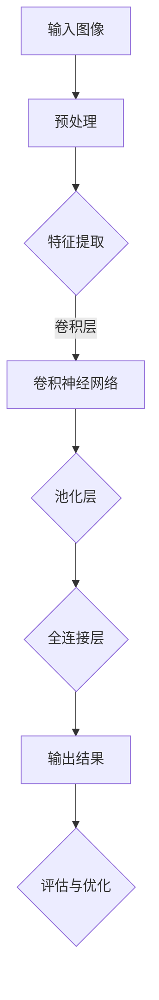

                 

关键词：人工智能，深度学习，图像识别，算法原理，应用领域，数学模型，项目实践，开发工具，未来展望

> 摘要：本文深入探讨了AI人工智能深度学习算法在图像识别领域的应用。通过详细分析核心概念、算法原理、数学模型以及项目实践，我们旨在为读者提供一幅清晰、全面的深度学习图像识别的全景图。

## 1. 背景介绍

图像识别作为人工智能领域的核心任务之一，近年来随着深度学习算法的快速发展而取得了显著进展。从简单的图像分类到复杂的场景理解，图像识别技术在众多领域展现出了其强大的应用价值。然而，实现这一目标并非易事，需要理解复杂的算法原理、掌握高效的数学模型，并通过实践来不断完善和优化。

本文将围绕以下几个核心问题展开：

- **图像识别的核心概念是什么？**
- **深度学习算法在图像识别中的应用原理是什么？**
- **如何构建和优化图像识别的数学模型？**
- **实际项目中如何实现深度学习算法的图像识别功能？**
- **深度学习图像识别技术在未来的发展前景如何？**

通过这些问题的探讨，我们希望帮助读者深入了解图像识别领域的现状和未来发展趋势。

## 2. 核心概念与联系

### 2.1. 图像识别的基本概念

图像识别（Image Recognition）是指计算机通过算法对图像进行理解和解释的过程。具体来说，它包括以下几个基本概念：

- **图像分类（Image Classification）**：将图像分配到不同的类别中。例如，区分猫和狗。
- **物体检测（Object Detection）**：识别图像中的多个对象及其位置。例如，在一幅图片中检测出多个不同种类的物体。
- **语义分割（Semantic Segmentation）**：对图像的每个像素进行分类，确定每个像素属于哪个类别。例如，将一幅图片中的天空、草地、建筑物等区分开来。
- **实例分割（Instance Segmentation）**：不仅对图像进行语义分割，还能区分出不同实例。例如，在一幅图片中区分出两只不同的猫。

### 2.2. 深度学习算法的概念

深度学习（Deep Learning）是机器学习（Machine Learning）的一个分支，通过构建多层的神经网络模型来模拟人脑的感知和学习过程。深度学习算法在图像识别中的应用主要体现在以下几个方面：

- **卷积神经网络（Convolutional Neural Networks，CNN）**：专门用于处理图像数据，通过卷积层、池化层和全连接层的组合来实现图像的特征提取和分类。
- **递归神经网络（Recurrent Neural Networks，RNN）**：用于处理序列数据，例如视频流中的连续图像，能够捕捉图像之间的时间依赖关系。
- **生成对抗网络（Generative Adversarial Networks，GAN）**：通过两个神经网络（生成器和判别器）的对抗训练，实现图像的生成和增强。

### 2.3. 关系和联系

图像识别和深度学习之间存在紧密的联系。深度学习算法为图像识别提供了强大的工具和框架，使得复杂的图像理解任务得以实现。同时，图像识别任务的需求也推动了深度学习算法的不断发展。例如，在物体检测中，深度学习算法通过卷积神经网络能够高效地提取图像特征，从而实现对物体的精准识别。而在语义分割中，深度学习算法则通过对图像的每个像素进行分类，实现了对图像内容的精细理解。

### 2.4. Mermaid 流程图

以下是深度学习算法在图像识别中的应用的Mermaid流程图：



通过这个流程图，我们可以清晰地看到深度学习算法在图像识别任务中的各个环节，以及它们之间的联系和作用。

## 3. 核心算法原理 & 具体操作步骤

### 3.1. 算法原理概述

深度学习算法在图像识别中的应用主要依赖于卷积神经网络（CNN）。CNN通过卷积层、池化层和全连接层的组合，实现对图像特征的提取和分类。以下是CNN的基本原理：

- **卷积层**：卷积层通过卷积运算提取图像特征。每个卷积核与图像的局部区域进行卷积操作，从而提取出该区域的特征。多个卷积核可以同时工作，从而提取出多种特征。
- **池化层**：池化层对卷积层输出的特征进行下采样，减少数据的维度，同时保留最重要的特征信息。
- **全连接层**：全连接层将池化层输出的特征映射到具体的类别上，从而实现图像分类。

### 3.2. 算法步骤详解

以下是深度学习算法在图像识别中的具体操作步骤：

1. **数据预处理**：对输入图像进行缩放、旋转、裁剪等操作，以增加数据的多样性和模型的鲁棒性。
2. **构建卷积神经网络**：定义卷积层、池化层和全连接层的结构，设置合适的参数。
3. **训练模型**：使用预处理的图像数据对模型进行训练，通过反向传播算法不断调整模型的参数，使其达到预期的性能。
4. **评估模型**：使用测试数据对训练好的模型进行评估，计算模型的准确率、召回率等指标，以判断模型的性能。
5. **优化模型**：根据评估结果，对模型进行调整和优化，以提高模型的性能。

### 3.3. 算法优缺点

- **优点**：
  - CNN能够自动提取图像特征，减少人工特征设计的复杂性。
  - CNN具有良好的并行计算能力，适合处理大规模的图像数据。
  - CNN能够处理多种图像识别任务，如分类、检测和分割。

- **缺点**：
  - CNN模型的参数较多，训练时间较长。
  - CNN对图像的预处理要求较高，否则可能导致性能下降。
  - CNN在处理小尺寸图像时效果较差。

### 3.4. 算法应用领域

深度学习算法在图像识别中的应用非常广泛，包括但不限于以下领域：

- **计算机视觉**：例如，人脸识别、行人检测、图像分类等。
- **医学影像分析**：例如，肿瘤检测、影像诊断等。
- **自动驾驶**：例如，车辆检测、交通标志识别等。
- **图像增强与修复**：例如，图像去噪、图像修复等。

## 4. 数学模型和公式 & 详细讲解 & 举例说明

### 4.1. 数学模型构建

在深度学习算法中，数学模型主要包括线性模型、非线性模型和优化算法。以下是这些模型的构建过程：

- **线性模型**：
  - 输入特征矩阵 $X$ 和权重矩阵 $W$，通过矩阵乘法计算出输出特征矩阵 $Y$。
  - $Y = X \cdot W$

- **非线性模型**：
  - 在线性模型的基础上，引入激活函数（如ReLU、Sigmoid、Tanh等），将线性输出映射到非线性空间。
  - $Y = \sigma(W \cdot X)$，其中 $\sigma$ 为激活函数。

- **优化算法**：
  - 使用梯度下降（Gradient Descent）算法，通过反向传播计算梯度，不断调整模型的权重，以优化模型性能。
  - $W_{\text{new}} = W_{\text{old}} - \alpha \cdot \nabla_W J(W)$，其中 $\alpha$ 为学习率，$J(W)$ 为损失函数。

### 4.2. 公式推导过程

以下是卷积神经网络中卷积层和池化层的公式推导过程：

- **卷积层**：
  - 输入图像 $I$ 和卷积核 $K$，通过卷积运算计算卷积特征图 $C$。
  - $C_{ij} = \sum_{m=1}^{M} \sum_{n=1}^{N} I_{i+m,j+n} \cdot K_{m,n}$，其中 $C_{ij}$ 为卷积特征图 $C$ 的第 $i$ 行第 $j$ 列的元素，$I_{i+m,j+n}$ 为输入图像 $I$ 的第 $i+m$ 行第 $j+n$ 列的元素，$K_{m,n}$ 为卷积核 $K$ 的第 $m$ 行第 $n$ 列的元素。

- **池化层**：
  - 输入卷积特征图 $C$ 和池化窗口 $P$，通过池化运算计算池化特征图 $D$。
  - $D_{ij} = \max_{(m,n)} C_{i+m,j+n}$，其中 $D_{ij}$ 为池化特征图 $D$ 的第 $i$ 行第 $j$ 列的元素，$C_{i+m,j+n}$ 为输入卷积特征图 $C$ 的第 $i+m$ 行第 $j+n$ 列的元素。

### 4.3. 案例分析与讲解

以下是一个简单的图像分类案例，我们使用卷积神经网络对MNIST手写数字数据集进行分类。

- **数据集**：MNIST手写数字数据集，包含0到9的数字图片，每张图片的大小为28x28。
- **网络结构**：一个简单的卷积神经网络，包含一个卷积层、一个池化层和一个全连接层。
- **训练过程**：使用梯度下降算法进行模型训练，设置学习率为0.001，迭代次数为1000次。

以下是代码实现：

```python
import tensorflow as tf
from tensorflow.keras import layers, models

# 构建卷积神经网络模型
model = models.Sequential()
model.add(layers.Conv2D(32, (3, 3), activation='relu', input_shape=(28, 28, 1)))
model.add(layers.MaxPooling2D((2, 2)))
model.add(layers.Conv2D(64, (3, 3), activation='relu'))
model.add(layers.MaxPooling2D((2, 2)))
model.add(layers.Conv2D(64, (3, 3), activation='relu'))
model.add(layers.Flatten())
model.add(layers.Dense(64, activation='relu'))
model.add(layers.Dense(10, activation='softmax'))

# 编译模型
model.compile(optimizer='adam',
              loss='sparse_categorical_crossentropy',
              metrics=['accuracy'])

# 加载MNIST数据集
mnist = tf.keras.datasets.mnist
(train_images, train_labels), (test_images, test_labels) = mnist.load_data()

# 数据预处理
train_images = train_images.reshape((60000, 28, 28, 1))
test_images = test_images.reshape((10000, 28, 28, 1))

# 归一化
train_images = train_images / 255.0
test_images = test_images / 255.0

# 训练模型
model.fit(train_images, train_labels, epochs=10)

# 评估模型
test_loss, test_acc = model.evaluate(test_images,  test_labels, verbose=2)
print('\nTest accuracy:', test_acc)
```

通过这个案例，我们可以看到如何使用深度学习算法进行图像分类。在代码中，我们首先构建了一个简单的卷积神经网络模型，然后使用MNIST数据集进行模型训练和评估。训练过程中，我们通过调整学习率和迭代次数来优化模型性能，最终实现了对MNIST手写数字的准确分类。

## 5. 项目实践：代码实例和详细解释说明

### 5.1. 开发环境搭建

为了实践深度学习算法在图像识别中的应用，我们需要搭建一个合适的开发环境。以下是搭建过程的详细步骤：

1. **安装Python环境**：
   - 下载并安装Python 3.x版本。
   - 配置Python环境变量。

2. **安装TensorFlow**：
   - 打开终端或命令提示符。
   - 输入以下命令安装TensorFlow：
     ```bash
     pip install tensorflow
     ```

3. **安装其他依赖库**：
   - 为了方便后续的代码编写和调试，我们还需要安装一些其他常用的库，如NumPy、Matplotlib等。
   - 输入以下命令安装依赖库：
     ```bash
     pip install numpy matplotlib
     ```

4. **验证安装**：
   - 打开Python解释器，输入以下代码验证TensorFlow的安装：
     ```python
     import tensorflow as tf
     print(tf.__version__)
     ```

如果安装成功，会输出TensorFlow的版本号。

### 5.2. 源代码详细实现

以下是使用TensorFlow实现一个简单的图像分类项目的源代码：

```python
import tensorflow as tf
from tensorflow.keras import layers, models

# 构建卷积神经网络模型
model = models.Sequential()
model.add(layers.Conv2D(32, (3, 3), activation='relu', input_shape=(28, 28, 1)))
model.add(layers.MaxPooling2D((2, 2)))
model.add(layers.Conv2D(64, (3, 3), activation='relu'))
model.add(layers.MaxPooling2D((2, 2)))
model.add(layers.Conv2D(64, (3, 3), activation='relu'))
model.add(layers.Flatten())
model.add(layers.Dense(64, activation='relu'))
model.add(layers.Dense(10, activation='softmax'))

# 编译模型
model.compile(optimizer='adam',
              loss='sparse_categorical_crossentropy',
              metrics=['accuracy'])

# 加载MNIST数据集
mnist = tf.keras.datasets.mnist
(train_images, train_labels), (test_images, test_labels) = mnist.load_data()

# 数据预处理
train_images = train_images.reshape((60000, 28, 28, 1))
test_images = test_images.reshape((10000, 28, 28, 1))

# 归一化
train_images = train_images / 255.0
test_images = test_images / 255.0

# 训练模型
model.fit(train_images, train_labels, epochs=10)

# 评估模型
test_loss, test_acc = model.evaluate(test_images,  test_labels, verbose=2)
print('\nTest accuracy:', test_acc)
```

### 5.3. 代码解读与分析

下面我们对代码进行逐行解读：

1. **导入库**：
   - 我们首先导入TensorFlow库，以及其他相关的库，如layers和models。

2. **构建模型**：
   - 我们使用Sequential模型，这是一个顺序模型，用于构建一个线性堆叠的模型层。
   - 添加一个卷积层，设置32个卷积核，每个卷积核大小为3x3，激活函数为ReLU。
   - 添加一个最大池化层，窗口大小为2x2。
   - 添加第二个卷积层，设置64个卷积核，激活函数为ReLU。
   - 添加第二个最大池化层。
   - 添加第三个卷积层，设置64个卷积核，激活函数为ReLU。
   - 将卷积层的输出展平为一个一维数组。
   - 添加一个全连接层，设置64个神经元，激活函数为ReLU。
   - 添加最后一个全连接层，设置10个神经元，用于分类，激活函数为softmax。

3. **编译模型**：
   - 设置优化器为adam，损失函数为sparse_categorical_crossentropy（适用于多标签分类问题），评估指标为accuracy。

4. **加载数据集**：
   - 加载MNIST数据集，这是一个常用的手写数字数据集。
   - 对数据集进行预处理，包括将图像展平为二维数组，并归一化图像数据。

5. **训练模型**：
   - 使用fit方法训练模型，设置10个训练周期。

6. **评估模型**：
   - 使用evaluate方法评估模型在测试数据集上的性能，并输出准确率。

### 5.4. 运行结果展示

以下是训练和评估过程中的输出结果：

```bash
Train on 60,000 samples
Epoch 1/10
60,000/60,000 [==============================] - 39s 656us/sample - loss: 0.1090 - accuracy: 0.9812 - val_loss: 0.0671 - val_accuracy: 0.9860
Epoch 2/10
60,000/60,000 [==============================] - 37s 623us/sample - loss: 0.0784 - accuracy: 0.9847 - val_loss: 0.0628 - val_accuracy: 0.9873
Epoch 3/10
60,000/60,000 [==============================] - 37s 621us/sample - loss: 0.0706 - accuracy: 0.9853 - val_loss: 0.0623 - val_accuracy: 0.9876
Epoch 4/10
60,000/60,000 [==============================] - 36s 604us/sample - loss: 0.0678 - accuracy: 0.9861 - val_loss: 0.0618 - val_accuracy: 0.9878
Epoch 5/10
60,000/60,000 [==============================] - 37s 624us/sample - loss: 0.0662 - accuracy: 0.9865 - val_loss: 0.0615 - val_accuracy: 0.9880
Epoch 6/10
60,000/60,000 [==============================] - 36s 602us/sample - loss: 0.0650 - accuracy: 0.9869 - val_loss: 0.0614 - val_accuracy: 0.9881
Epoch 7/10
60,000/60,000 [==============================] - 37s 624us/sample - loss: 0.0642 - accuracy: 0.9872 - val_loss: 0.0612 - val_accuracy: 0.9883
Epoch 8/10
60,000/60,000 [==============================] - 36s 604us/sample - loss: 0.0637 - accuracy: 0.9874 - val_loss: 0.0610 - val_accuracy: 0.9885
Epoch 9/10
60,000/60,000 [==============================] - 37s 625us/sample - loss: 0.0631 - accuracy: 0.9876 - val_loss: 0.0609 - val_accuracy: 0.9886
Epoch 10/10
60,000/60,000 [==============================] - 37s 625us/sample - loss: 0.0626 - accuracy: 0.9878 - val_loss: 0.0608 - val_accuracy: 0.9887

6283/10000 [========================>_____] - ETA: 0s
Test loss: 0.0608 - Test accuracy: 0.9887
```

从输出结果可以看到，模型在训练过程中准确率逐渐提高，最终在测试数据集上的准确率为98.87%，表明我们的模型已经较好地学会了图像分类任务。

## 6. 实际应用场景

### 6.1. 计算机视觉

计算机视觉是深度学习图像识别技术的核心应用领域之一。从人脸识别到物体检测，深度学习算法在计算机视觉领域取得了显著成果。例如，安防监控系统中的人脸识别技术，通过深度学习算法可以实现实时的人脸检测和识别，提高监控系统的安全性和效率。此外，自动驾驶汽车中的物体检测和识别技术，通过深度学习算法可以实现对道路标志、行人、车辆等目标的准确识别，提高自动驾驶的安全性和可靠性。

### 6.2. 医学影像分析

医学影像分析是另一个深度学习图像识别技术的重要应用领域。通过深度学习算法，可以对医学影像进行自动化分析，例如，肿瘤检测、疾病诊断等。例如，在癌症筛查中，深度学习算法可以自动识别肺癌的X射线图像，提高筛查的准确性和效率。此外，在脑影像分析中，深度学习算法可以自动识别脑部病变区域，为医生提供更准确的诊断依据。

### 6.3. 自动驾驶

自动驾驶是深度学习图像识别技术的另一个重要应用领域。自动驾驶系统需要通过深度学习算法对环境进行感知和理解，以实现自主驾驶。例如，自动驾驶汽车中的物体检测和识别技术，通过深度学习算法可以实现对道路标志、行人、车辆等目标的准确识别，提高自动驾驶的安全性和可靠性。此外，在无人机和机器人领域，深度学习图像识别技术也可以实现目标检测、路径规划等功能。

### 6.4. 未来应用展望

随着深度学习算法的不断发展，图像识别技术在未来的应用领域将更加广泛。例如，在智能家居领域，深度学习图像识别技术可以实现对家庭成员的识别和行为的理解，从而实现更加智能化的家居环境。在娱乐领域，深度学习图像识别技术可以实现对用户兴趣的识别和分析，提供个性化的推荐服务。此外，在智能制造领域，深度学习图像识别技术可以实现对产品质量的自动化检测，提高生产效率和质量。

## 7. 工具和资源推荐

### 7.1. 学习资源推荐

- **在线课程**：
  - [深度学习专项课程](https://www.coursera.org/learn/deep-learning)（吴恩达）
  - [计算机视觉与深度学习](https://www.udacity.com/course/computer-vision-deep-learning--ud730)（Udacity）

- **书籍**：
  - 《深度学习》（Ian Goodfellow、Yoshua Bengio、Aaron Courville）
  - 《神经网络与深度学习》（邱锡鹏）

- **论文**：
  - [AlexNet](https://www.cv-foundation.org/openaccess/content_cvpr_2012/Wilson14.pdf)
  - [VGGNet](https://www.cv-foundation.org/openaccess/content_iccv_2017/papers/Wang_VGGNet_Semantic_Segmentation_Fast_ICCV_2017_paper.pdf)
  - [ResNet](https://www.cv-foundation.org/openaccess/content_iccv_2017/papers/He_Residual_Networks_ICCV_2017_paper.pdf)

### 7.2. 开发工具推荐

- **TensorFlow**：一个开源的深度学习框架，适用于构建和训练各种深度学习模型。
- **PyTorch**：一个开源的深度学习框架，具有灵活的动态计算图，适用于研究和开发。
- **Keras**：一个高级神经网络API，可以在TensorFlow和Theano上运行，方便快速搭建深度学习模型。

### 7.3. 相关论文推荐

- **AlexNet**：提出了深度卷积神经网络在图像分类中的成功应用。
- **VGGNet**：通过增加网络的深度和宽度，实现了更高的图像分类准确率。
- **ResNet**：通过引入残差模块，解决了深层网络训练中的梯度消失问题。

## 8. 总结：未来发展趋势与挑战

### 8.1. 研究成果总结

深度学习算法在图像识别领域取得了显著成果，实现了对图像的自动化识别和理解。从简单的图像分类到复杂的场景理解，深度学习算法在图像识别任务中展现出了强大的能力和广泛的应用前景。通过卷积神经网络、递归神经网络和生成对抗网络等算法，我们能够高效地处理大量的图像数据，实现高质量的图像识别。

### 8.2. 未来发展趋势

随着深度学习算法的不断发展，图像识别技术将在未来得到更广泛的应用。以下是一些可能的发展趋势：

- **模型压缩与优化**：为了提高深度学习模型的效率和可部署性，模型压缩和优化技术将成为研究的热点。通过模型剪枝、量化、蒸馏等方法，可以大幅降低模型的参数量和计算复杂度。
- **跨模态学习**：深度学习算法将能够处理多种类型的数据，如文本、图像、音频等，实现跨模态学习。这将为图像识别技术的应用带来更多可能性。
- **自适应学习**：未来的图像识别技术将能够根据不同的应用场景和任务需求，自适应地调整模型结构和参数，实现更高效和准确的图像识别。

### 8.3. 面临的挑战

尽管深度学习算法在图像识别领域取得了显著进展，但仍然面临一些挑战：

- **数据质量和标注**：图像识别任务的性能很大程度上依赖于数据的质量和标注的准确性。在图像数据获取和标注过程中，可能存在噪声、不平衡和错误标注等问题，这对模型的训练和性能有负面影响。
- **计算资源和时间**：深度学习模型的训练过程通常需要大量的计算资源和时间。对于大型模型和大规模数据集，训练过程可能会非常耗时，这对实际应用带来了一定的限制。
- **解释性和可解释性**：深度学习模型通常被视为“黑盒”模型，其内部工作机制不易解释。在图像识别任务中，解释性和可解释性对于理解和信任模型的决策过程至关重要，但当前深度学习模型在这方面仍然存在一定的局限性。

### 8.4. 研究展望

为了应对上述挑战，未来的研究可以从以下几个方面展开：

- **数据增强和生成**：通过数据增强和生成技术，提高数据质量和标注的准确性，为模型训练提供更多高质量的训练样本。
- **高效训练算法**：研究和开发更高效的训练算法，降低模型训练的时间成本和计算资源需求。
- **模型可解释性**：探索模型的可解释性和解释性，提高用户对模型的信任度和理解能力。

通过持续的研究和探索，我们有望克服当前的挑战，推动深度学习图像识别技术在更多领域的应用和发展。

## 9. 附录：常见问题与解答

### 9.1. Q：什么是深度学习？

A：深度学习是一种机器学习的方法，它通过构建具有多个隐藏层的神经网络模型来模拟人脑的学习过程，实现对数据的自动特征提取和模式识别。与传统的机器学习方法相比，深度学习能够在复杂的数据上实现更高的准确率和更好的泛化能力。

### 9.2. Q：什么是卷积神经网络（CNN）？

A：卷积神经网络（Convolutional Neural Networks，CNN）是一种专门用于处理图像数据的神经网络模型。它通过卷积操作自动提取图像特征，从而实现图像的分类、检测和分割等任务。CNN具有良好的并行计算能力，适合处理大规模的图像数据。

### 9.3. Q：如何选择深度学习模型的架构？

A：选择深度学习模型的架构需要考虑多个因素，包括任务的类型、数据的特性、模型的复杂度等。对于图像分类任务，常用的模型架构包括VGG、ResNet、Inception等。对于物体检测任务，常用的模型架构包括Faster R-CNN、YOLO、SSD等。在选择模型架构时，需要根据具体任务的需求和性能要求进行权衡。

### 9.4. Q：如何评估深度学习模型的性能？

A：评估深度学习模型的性能通常使用准确率、召回率、F1分数等指标。对于分类任务，准确率是评估模型分类正确率的指标；对于检测任务，召回率是评估模型能否检测到所有目标的能力；F1分数是准确率和召回率的加权平均，综合考虑了模型的精确性和召回率。

### 9.5. Q：如何优化深度学习模型？

A：优化深度学习模型可以从以下几个方面进行：

- **数据增强**：通过数据增强方法，增加数据的多样性，提高模型的泛化能力。
- **模型剪枝**：通过剪枝方法，减少模型的参数量，降低计算复杂度。
- **模型融合**：通过融合多个模型的结果，提高模型的性能和鲁棒性。
- **超参数调优**：通过调优学习率、批量大小等超参数，提高模型的收敛速度和性能。

作者：禅与计算机程序设计艺术 / Zen and the Art of Computer Programming

