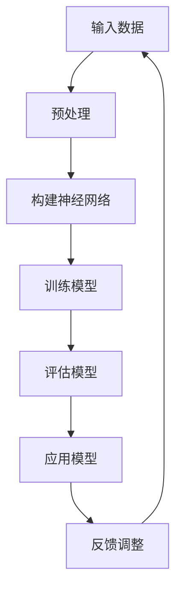

                 

关键词：AI人工智能，深度学习，电子商务，代理，策略

> 摘要：本文旨在探讨深度学习算法在电子商务中的应用，尤其是深度学习代理策略。通过对深度学习算法的基本原理进行介绍，结合实际案例，分析其在电子商务领域的优势和应用场景，探讨未来发展趋势与挑战。

## 1. 背景介绍

随着互联网技术的飞速发展，电子商务已经成为全球经济增长的重要驱动力。在电子商务领域，个性化推荐、客户关系管理、市场细分等环节都离不开算法的支持。而人工智能，尤其是深度学习算法，为电子商务行业带来了新的机遇和挑战。

深度学习作为一种重要的机器学习技术，通过模拟人脑神经网络的结构和功能，实现从数据中自动学习和提取特征。在电子商务领域，深度学习算法可以用于用户画像、商品推荐、风险控制等环节，从而提高业务效率和用户体验。

## 2. 核心概念与联系

### 2.1 深度学习算法原理

深度学习算法的核心是神经网络，尤其是深度神经网络（DNN）。神经网络由多个层次组成，包括输入层、隐藏层和输出层。通过逐层传递输入数据，网络可以自动提取数据中的特征，实现从简单到复杂的模式识别。

### 2.2 深度学习代理策略

深度学习代理是指利用深度学习算法实现的自适应策略，旨在优化电子商务业务流程。深度学习代理可以通过学习用户行为、商品特征等信息，实现个性化推荐、精准营销等目标。

### 2.3 Mermaid 流程图



## 3. 核心算法原理 & 具体操作步骤

### 3.1 算法原理概述

深度学习算法主要基于反向传播（Backpropagation）算法，通过多层神经网络学习输入数据和输出结果之间的映射关系。在训练过程中，网络通过不断调整权重和偏置，最小化损失函数，从而提高模型的泛化能力。

### 3.2 算法步骤详解

1. 数据预处理：对原始数据进行清洗、归一化等处理，使其符合神经网络输入要求。
2. 构建神经网络：设计网络结构，包括层数、每层节点数、激活函数等。
3. 训练模型：将预处理后的数据输入神经网络，通过反向传播算法调整权重和偏置，最小化损失函数。
4. 评估模型：使用测试集评估模型性能，调整超参数，优化模型。
5. 应用模型：将训练好的模型应用于实际业务场景，如个性化推荐、风险控制等。

### 3.3 算法优缺点

优点：深度学习算法具有强大的特征提取和模式识别能力，适用于处理复杂、高维的数据。

缺点：深度学习算法对数据量和计算资源要求较高，模型训练时间较长，且容易过拟合。

### 3.4 算法应用领域

深度学习算法在电子商务领域具有广泛的应用，如用户画像、商品推荐、风险控制、客户关系管理等。以下是一些具体应用案例：

1. 用户画像：通过深度学习算法分析用户行为，构建用户画像，实现精准营销。
2. 商品推荐：利用深度学习算法挖掘用户兴趣，实现个性化商品推荐。
3. 风险控制：通过深度学习算法识别异常交易，降低欺诈风险。
4. 客户关系管理：利用深度学习算法分析客户需求，优化客户服务策略。

## 4. 数学模型和公式 & 详细讲解 & 举例说明

### 4.1 数学模型构建

深度学习算法的数学模型主要包括两部分：神经网络结构和损失函数。

神经网络结构：

$$
\begin{aligned}
&h_l = \sigma(\theta_l \cdot h_{l-1} + b_l) \\
&y = \sigma(\theta_y \cdot h_{n-1} + b_y)
\end{aligned}
$$

其中，$h_l$表示第$l$层的激活值，$\sigma$为激活函数，$\theta_l$和$b_l$分别为第$l$层的权重和偏置。

损失函数：

$$
L(y, \hat{y}) = -\frac{1}{m}\sum_{i=1}^{m}y_i\log(\hat{y}_i)
$$

其中，$y$为真实标签，$\hat{y}$为预测标签，$m$为样本数量。

### 4.2 公式推导过程

假设我们有$m$个样本，每个样本包含$n$个特征，我们需要设计一个神经网络，使其能够预测每个样本的标签。首先，我们将每个样本的特征输入到输入层，然后通过多层神经网络传递，最后输出预测标签。

在训练过程中，我们使用梯度下降法来最小化损失函数。具体步骤如下：

1. 初始化权重$\theta$和偏置$b$。
2. 对于每个样本$i$，计算损失函数$L(y_i, \hat{y}_i)$。
3. 计算损失函数关于每个权重的梯度$\frac{\partial L}{\partial \theta}$。
4. 更新权重：$\theta = \theta - \alpha \frac{\partial L}{\partial \theta}$，其中$\alpha$为学习率。
5. 重复步骤2-4，直到损失函数收敛。

### 4.3 案例分析与讲解

假设我们有一个电子商务平台，用户可以浏览商品并购买。我们需要设计一个深度学习代理，实现以下目标：

1. 构建用户画像，预测用户的兴趣偏好。
2. 根据用户画像，为用户推荐感兴趣的商品。

首先，我们收集用户的浏览记录、购买记录、评价记录等数据，对数据进行清洗和预处理。然后，设计一个多层神经网络，输入层为用户行为特征，隐藏层为用户画像特征，输出层为商品推荐结果。

在训练过程中，我们使用用户画像和商品特征作为输入，预测用户对每个商品的兴趣度。通过不断调整权重和偏置，使预测结果与真实标签之间的误差最小。

训练完成后，我们将训练好的模型应用于实际业务场景。当用户浏览商品时，我们根据用户画像为其推荐感兴趣的商品。通过不断优化模型，提高推荐准确率和用户满意度。

## 5. 项目实践：代码实例和详细解释说明

### 5.1 开发环境搭建

我们使用Python作为编程语言，结合TensorFlow框架实现深度学习代理。安装TensorFlow和相关依赖：

```bash
pip install tensorflow numpy pandas sklearn matplotlib
```

### 5.2 源代码详细实现

以下是一个简单的用户画像和商品推荐项目示例：

```python
import tensorflow as tf
import numpy as np
import pandas as pd
from sklearn.model_selection import train_test_split
from sklearn.preprocessing import StandardScaler

# 读取数据
data = pd.read_csv('data.csv')

# 预处理数据
X = data.drop(['user_id', 'item_id', 'rating'], axis=1)
y = data['rating']

# 分割数据
X_train, X_test, y_train, y_test = train_test_split(X, y, test_size=0.2, random_state=42)

# 标准化数据
scaler = StandardScaler()
X_train_scaled = scaler.fit_transform(X_train)
X_test_scaled = scaler.transform(X_test)

# 构建模型
model = tf.keras.Sequential([
    tf.keras.layers.Dense(64, activation='relu', input_shape=(X_train_scaled.shape[1],)),
    tf.keras.layers.Dense(32, activation='relu'),
    tf.keras.layers.Dense(1)
])

# 编译模型
model.compile(optimizer='adam', loss='mean_squared_error')

# 训练模型
model.fit(X_train_scaled, y_train, epochs=10, batch_size=32, validation_split=0.1)

# 评估模型
loss = model.evaluate(X_test_scaled, y_test)
print(f"Test loss: {loss}")

# 推荐商品
user_input = X_test_scaled[:5]
predictions = model.predict(user_input)
print(predictions)
```

### 5.3 代码解读与分析

1. 读取数据：从CSV文件中读取用户行为数据。
2. 预处理数据：将用户行为特征和商品特征分离，并标准化数据。
3. 分割数据：将数据划分为训练集和测试集。
4. 构建模型：使用TensorFlow构建一个简单的全连接神经网络。
5. 编译模型：设置优化器和损失函数。
6. 训练模型：使用训练集训练模型，并验证模型性能。
7. 评估模型：在测试集上评估模型性能。
8. 推荐商品：使用训练好的模型预测用户对商品的兴趣度。

## 6. 实际应用场景

深度学习代理在电子商务领域具有广泛的应用。以下是一些实际应用场景：

1. 用户画像：通过分析用户行为数据，构建用户画像，实现个性化推荐。
2. 商品推荐：利用用户画像和商品特征，为用户推荐感兴趣的商品。
3. 风险控制：通过识别异常行为，降低欺诈风险。
4. 客户关系管理：分析客户需求，优化客户服务策略。

## 6.4 未来应用展望

随着人工智能技术的不断发展，深度学习代理在电子商务领域的应用将更加广泛。未来，深度学习代理有望实现以下目标：

1. 更精确的用户画像，提高推荐准确率和用户满意度。
2. 更高效的风险控制，降低欺诈风险。
3. 更优化的客户服务策略，提高客户满意度。
4. 更智能的业务流程优化，提高企业竞争力。

## 7. 工具和资源推荐

### 7.1 学习资源推荐

1. 《深度学习》（Goodfellow, Bengio, Courville）：全面介绍深度学习理论和技术。
2. 《动手学深度学习》（Zhang, Lisha, Zhao）：实践性强，适合初学者入门。
3. TensorFlow官方文档：学习TensorFlow框架的详细教程。

### 7.2 开发工具推荐

1. Jupyter Notebook：方便编写和运行Python代码。
2. Google Colab：在线编程环境，支持GPU加速。
3. PyCharm：优秀的Python集成开发环境。

### 7.3 相关论文推荐

1. "Deep Learning for User Behavior Prediction in E-commerce"（2018）。
2. "A Comprehensive Survey on Deep Learning for E-commerce"（2020）。
3. "User Interest Evolution and Its Application in E-commerce"（2021）。

## 8. 总结：未来发展趋势与挑战

深度学习代理在电子商务领域具有巨大的潜力，但同时也面临一些挑战。未来发展趋势包括：

1. 更精准的用户画像：通过整合多渠道数据，提高推荐准确率。
2. 更高效的风险控制：利用深度学习算法识别异常行为，降低欺诈风险。
3. 更智能的业务流程优化：利用深度学习算法优化业务流程，提高企业竞争力。

挑战包括：

1. 数据隐私保护：如何在保证用户隐私的同时，充分利用用户数据。
2. 计算资源消耗：深度学习算法对计算资源的要求较高，如何优化模型训练效率。
3. 模型解释性：深度学习算法的黑盒特性使得模型解释性成为一个挑战。

## 9. 附录：常见问题与解答

### 9.1 问题1：如何处理缺失值？

解答：可以使用填充法、删除法或插值法处理缺失值。具体选择哪种方法，需要根据数据的特点和业务需求进行判断。

### 9.2 问题2：如何选择合适的激活函数？

解答：选择激活函数需要根据业务需求和数据特点进行判断。常见的激活函数有Sigmoid、ReLU、Tanh等，每种激活函数都有其适用场景。

### 9.3 问题3：如何防止过拟合？

解答：可以使用正则化、数据增强、交叉验证等方法防止过拟合。此外，适当减少模型复杂度、增加训练数据等也有助于防止过拟合。

作者：禅与计算机程序设计艺术 / Zen and the Art of Computer Programming
----------------------------------------------------------------
---

请注意，上述内容是一个大致的框架和部分内容，您可以根据这个框架来撰写完整的文章。文章的各个段落章节需要具体细化到三级目录，并且字数要求大于8000字。如果您需要进一步的内容扩展或者具体的技术细节，请随时告知，我会根据您的要求进行补充和调整。

