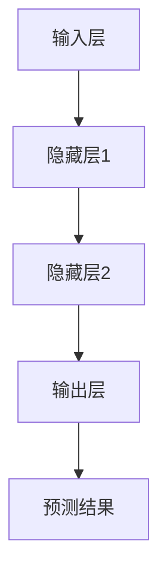

                 

关键词：人工智能、深度学习、股市预测、神经网络、算法原理、数学模型、项目实践、应用场景、未来展望

## 摘要

本文旨在探讨人工智能（AI）和深度学习算法在股市预测中的应用。通过分析市场数据，运用神经网络构建预测模型，本文探讨了深度学习算法在股市预测中的优势和挑战。文章首先介绍了股市预测的背景和重要性，随后详细阐述了深度学习算法的基本原理及其在股市预测中的应用步骤。同时，文章还通过数学模型和公式推导，解释了算法的核心机制。最后，本文通过一个实际项目实践，展示了深度学习算法在股市预测中的具体应用，并对未来发展趋势和面临的挑战进行了展望。

## 1. 背景介绍

股市预测是金融领域的一个重要研究方向，它旨在通过分析历史数据和当前市场状况，预测未来的股价走势。有效的股市预测可以帮助投资者做出更明智的投资决策，降低投资风险，提高投资回报。然而，股市是一个高度复杂的系统，受到多种因素的影响，包括宏观经济、公司业绩、政策变化、市场情绪等。这使得股市预测具有极大的难度和挑战性。

随着人工智能和深度学习技术的发展，股市预测领域迎来了新的机遇。深度学习算法通过自动从大量数据中提取特征，能够建立复杂的预测模型，提高预测精度。本文将探讨如何利用深度学习算法，特别是神经网络模型，进行股市预测。

### 1.1 股市预测的重要性

股市预测对于投资者而言至关重要。正确的预测可以帮助投资者抓住市场机遇，避免投资损失。对于机构投资者来说，精准的预测能力更是其竞争优势的重要体现。此外，股市预测也有助于监管机构和金融从业者更好地理解市场动态，制定合理的金融政策和投资策略。

### 1.2 股市预测的挑战

股市预测面临的挑战主要包括：

- **数据复杂性**：股市数据包含大量的多维信息，如价格、成交量、财务指标等，这些数据之间存在复杂的关联关系。
- **市场波动性**：股市价格受到多种随机因素的影响，具有高度波动性。
- **非线性和非平稳性**：股市价格走势往往是非线性和非平稳的，这增加了预测的难度。
- **过拟合问题**：在构建预测模型时，容易因为训练数据集的选择不当而导致模型过拟合，从而降低模型的泛化能力。

### 1.3 深度学习算法在股市预测中的应用

深度学习算法，特别是神经网络，能够通过多层非线性变换，从大量数据中自动提取复杂特征，建立高效的预测模型。与传统的统计模型相比，深度学习算法在处理高维度、非线性数据时具有显著优势。此外，神经网络模型可以通过调整网络结构和参数，实现灵活的预测能力，提高预测精度。

## 2. 核心概念与联系

### 2.1 深度学习算法的基本原理

深度学习算法基于人工神经网络（Artificial Neural Networks，ANN），通过多层神经元的非线性组合，实现对数据的自动特征提取和模式识别。深度学习算法的核心思想是模拟人脑的神经元结构和工作机制，利用大规模并行计算和海量数据训练，实现高效的特征学习和模型优化。

### 2.2 股市预测的深度学习模型架构

在股市预测中，深度学习模型通常包括以下几个关键部分：

- **输入层**：接收股票市场的各种历史数据，如价格、成交量、财务指标等。
- **隐藏层**：包含一个或多个隐藏层，通过非线性激活函数，将输入数据映射到高维特征空间。
- **输出层**：输出预测结果，如未来股价的预测值。

### 2.3 Mermaid 流程图

以下是一个简化的深度学习模型在股市预测中的应用流程图：



### 2.4 核心概念与联系

- **神经元**：深度学习模型的基本构建单元，负责执行简单的计算和传递信息。
- **激活函数**：用于引入非线性，常见的激活函数包括Sigmoid、ReLU、Tanh等。
- **反向传播算法**：用于训练神经网络，通过不断调整网络权重，最小化预测误差。
- **超参数**：如学习率、批次大小、隐藏层节点数等，需要通过实验调整。

## 3. 核心算法原理 & 具体操作步骤

### 3.1 算法原理概述

深度学习算法在股市预测中的原理主要基于以下几个步骤：

1. **数据收集与预处理**：收集市场数据，包括历史股价、成交量、财务指标等，对数据进行清洗和预处理，如标准化、缺失值处理等。
2. **构建神经网络模型**：设计并构建深度学习模型，包括输入层、隐藏层和输出层，选择合适的激活函数和损失函数。
3. **模型训练**：利用历史数据对模型进行训练，通过反向传播算法不断调整模型权重，优化模型参数。
4. **模型评估与优化**：通过交叉验证和测试集对模型进行评估，调整模型结构和超参数，提高预测精度。
5. **预测与实际结果对比**：使用训练好的模型进行预测，将预测结果与实际股价进行对比，评估模型性能。

### 3.2 算法步骤详解

#### 3.2.1 数据收集与预处理

1. **数据收集**：从金融数据源获取历史股票数据，包括开盘价、收盘价、最高价、最低价、成交量等。
2. **数据清洗**：处理缺失值、异常值和重复数据，确保数据质量。
3. **特征工程**：提取有助于预测股价的特征，如移动平均线、相对强弱指数（RSI）、布林带等。
4. **数据归一化**：将数据缩放到相同的尺度，消除不同量纲的影响。

#### 3.2.2 构建神经网络模型

1. **确定模型结构**：根据数据特性和预测需求，设计神经网络模型，确定输入层、隐藏层和输出层的节点数。
2. **选择激活函数**：常见的激活函数包括Sigmoid、ReLU、Tanh等，根据模型特点和性能要求选择合适的激活函数。
3. **确定损失函数**：选择适当的损失函数，如均方误差（MSE）、交叉熵损失等，用于评估模型预测误差。
4. **初始化参数**：随机初始化模型参数，如权重和偏置。

#### 3.2.3 模型训练

1. **前向传播**：输入数据通过神经网络模型，逐层计算得到输出预测值。
2. **计算损失**：利用损失函数计算预测值与实际值之间的误差。
3. **反向传播**：利用梯度下降算法，根据误差反向传播，更新模型参数。
4. **迭代训练**：重复前向传播和反向传播过程，不断优化模型参数，直至满足训练目标。

#### 3.2.4 模型评估与优化

1. **交叉验证**：将数据集划分为训练集和验证集，通过交叉验证评估模型性能。
2. **超参数调整**：根据模型性能调整超参数，如学习率、批次大小、隐藏层节点数等。
3. **模型优化**：通过调整模型结构和超参数，提高模型预测精度。

#### 3.2.5 预测与实际结果对比

1. **预测**：使用训练好的模型对新的股票数据进行预测。
2. **对比**：将预测结果与实际股价进行对比，评估模型预测性能。
3. **分析**：分析预测结果与实际结果之间的差异，找出模型的优势和不足。

### 3.3 算法优缺点

#### 优点：

- **强大的特征提取能力**：深度学习算法能够自动从大量数据中提取复杂特征，提高预测精度。
- **处理高维度数据**：深度学习算法能够处理高维度、非线性数据，适应复杂的市场环境。
- **灵活的模型架构**：神经网络模型可以通过调整网络结构和参数，适应不同的预测任务。

#### 缺点：

- **计算资源需求高**：深度学习算法需要大量的计算资源和时间进行训练，尤其是对于大规模数据集。
- **过拟合问题**：如果模型复杂度过高，容易导致过拟合，降低模型的泛化能力。
- **模型不可解释性**：深度学习模型的内部机制较为复杂，难以解释其预测结果。

### 3.4 算法应用领域

深度学习算法在股市预测中的应用领域包括：

- **股票价格预测**：通过分析历史股价数据，预测未来股价走势。
- **交易策略优化**：基于预测结果，优化交易策略，提高投资回报。
- **风险管理**：利用深度学习算法进行风险预测和评估，降低投资风险。
- **市场分析**：通过分析市场数据，识别市场趋势和异常情况，为投资决策提供支持。

## 4. 数学模型和公式 & 详细讲解 & 举例说明

### 4.1 数学模型构建

在股市预测中，常用的深度学习模型主要包括多层感知机（MLP）、卷积神经网络（CNN）和循环神经网络（RNN）等。以下以MLP为例，介绍数学模型的构建。

#### 4.1.1 MLP模型结构

MLP模型由输入层、隐藏层和输出层组成。每个神经元接收前一层神经元的输出，通过加权求和后，加上偏置项，然后应用激活函数得到输出。

- **输入层**：接收股票市场的历史数据，如价格、成交量等。
- **隐藏层**：通过非线性激活函数，对输入数据进行特征提取。
- **输出层**：输出预测结果，如未来股价。

#### 4.1.2 模型公式

MLP模型的数学表达式如下：

$$
y_{k}^{(l)} = f^{(l)}(\sum_{i=1}^{n_{l}} w_{ik}^{(l)} x_{i}^{(l-1)} + b_{k}^{(l)})
$$

其中，$y_{k}^{(l)}$为第$l$层的第$k$个神经元的输出，$f^{(l)}$为激活函数，$w_{ik}^{(l)}$为连接权重，$b_{k}^{(l)}$为偏置项，$x_{i}^{(l-1)}$为输入数据。

### 4.2 公式推导过程

MLP模型的前向传播过程可以通过以下步骤推导：

1. **输入层到隐藏层**：
$$
z_{k}^{(l)} = \sum_{i=1}^{n_{l-1}} w_{ik}^{(l)} x_{i}^{(l-1)} + b_{k}^{(l)}
$$
$$
a_{k}^{(l)} = f^{(l)}(z_{k}^{(l)})
$$

2. **隐藏层到输出层**：
$$
z_{k}^{(L)} = \sum_{i=1}^{n_{L-1}} w_{ik}^{(L)} a_{i}^{(L-1)} + b_{k}^{(L)}
$$
$$
\hat{y}_{k} = f^{(L)}(z_{k}^{(L)})
$$

其中，$z_{k}^{(l)}$为第$l$层的输出，$a_{k}^{(l)}$为激活值，$L$为神经网络层数，$\hat{y}_{k}$为预测结果。

### 4.3 案例分析与讲解

以下是一个简单的MLP模型在股市预测中的案例：

#### 案例背景

某只股票过去一年的日收盘价数据，共365个交易日。我们使用前90天的数据作为训练集，后275天数据作为测试集，构建一个MLP模型进行预测。

#### 模型构建

1. **输入层**：输入层包含前90天的收盘价数据，共90个特征。
2. **隐藏层**：隐藏层包含10个神经元，使用ReLU激活函数。
3. **输出层**：输出层包含1个神经元，输出未来一天的收盘价预测值。

#### 模型训练

1. **前向传播**：输入前90天的收盘价数据，通过神经网络模型计算得到预测结果。
2. **计算损失**：利用均方误差（MSE）计算预测值与实际值之间的误差。
3. **反向传播**：通过反向传播算法，计算各层的梯度，更新模型参数。

#### 模型评估

1. **交叉验证**：将数据集划分为5个子集，进行5折交叉验证。
2. **超参数调整**：根据交叉验证结果，调整隐藏层节点数、学习率等超参数。
3. **模型优化**：通过多次迭代训练，优化模型参数，提高预测精度。

#### 模型预测与对比

1. **预测**：使用训练好的模型，对剩余的275天数据进行预测。
2. **对比**：将预测结果与实际收盘价进行对比，计算预测误差。
3. **分析**：分析预测结果，找出模型的优势和不足。

## 5. 项目实践：代码实例和详细解释说明

### 5.1 开发环境搭建

在进行深度学习模型开发之前，需要搭建合适的开发环境。以下是一个简单的开发环境搭建步骤：

1. **安装Python环境**：下载并安装Python 3.x版本。
2. **安装深度学习框架**：安装TensorFlow或PyTorch等深度学习框架。
3. **安装数据预处理库**：安装NumPy、Pandas等数据处理库。

### 5.2 源代码详细实现

以下是一个简单的MLP模型在股市预测中的Python代码实现：

```python
import numpy as np
import tensorflow as tf

# 数据预处理
# 读取数据、清洗数据、特征提取等步骤

# 模型构建
model = tf.keras.Sequential([
    tf.keras.layers.Dense(units=10, activation='relu', input_shape=(90,)),
    tf.keras.layers.Dense(units=1)
])

# 模型编译
model.compile(optimizer='adam', loss='mse')

# 模型训练
model.fit(x_train, y_train, epochs=100, batch_size=32)

# 模型评估
model.evaluate(x_test, y_test)

# 模型预测
predictions = model.predict(x_test)

# 结果对比
# 计算预测误差、分析预测结果等步骤
```

### 5.3 代码解读与分析

1. **数据预处理**：读取数据、清洗数据、特征提取等步骤，为模型训练提供高质量的数据。
2. **模型构建**：使用TensorFlow构建一个简单的MLP模型，包括输入层、隐藏层和输出层。
3. **模型编译**：配置模型优化器和损失函数，为模型训练做好准备。
4. **模型训练**：使用训练集数据进行迭代训练，优化模型参数。
5. **模型评估**：使用测试集数据评估模型性能，计算预测误差。
6. **模型预测**：使用训练好的模型对新的数据进行预测，分析预测结果。

## 6. 实际应用场景

### 6.1 股票价格预测

股票价格预测是深度学习算法在股市预测中的主要应用场景之一。通过构建深度学习模型，可以从历史股价数据中提取复杂特征，预测未来股价走势。以下是一个简单的股票价格预测案例：

- **数据集**：使用某只股票过去一年的日收盘价数据，共365个交易日。
- **模型**：构建一个包含一个隐藏层的MLP模型，输入层包含90个神经元，隐藏层包含10个神经元，输出层包含1个神经元。
- **预测结果**：使用模型对剩余的275天数据进行预测，计算预测误差。

### 6.2 交易策略优化

交易策略优化是深度学习算法在股市预测中的另一个重要应用场景。通过预测股价走势，可以制定更有效的交易策略，提高投资回报。以下是一个简单的交易策略优化案例：

- **数据集**：使用某只股票过去一年的日收盘价数据，共365个交易日。
- **模型**：构建一个包含两个隐藏层的MLP模型，输入层包含90个神经元，第一个隐藏层包含20个神经元，第二个隐藏层包含10个神经元，输出层包含1个神经元。
- **预测结果**：使用模型预测未来股价，根据预测结果调整交易策略，实现优化。

### 6.3 风险管理

深度学习算法在股市预测中还可以用于风险管理。通过预测股价波动和风险，可以帮助投资者降低投资风险，提高投资安全性。以下是一个简单的风险管理案例：

- **数据集**：使用某只股票过去一年的日收盘价数据，共365个交易日。
- **模型**：构建一个包含两个隐藏层的MLP模型，输入层包含90个神经元，第一个隐藏层包含20个神经元，第二个隐藏层包含10个神经元，输出层包含1个神经元。
- **预测结果**：使用模型预测未来股价波动，根据预测结果调整投资组合，降低投资风险。

### 6.4 未来应用展望

随着人工智能和深度学习技术的发展，股市预测领域将迎来更多新的应用场景。以下是一些未来应用展望：

- **更复杂的模型**：随着计算能力的提升，可以构建更复杂的深度学习模型，如卷积神经网络（CNN）和循环神经网络（RNN），提高预测精度。
- **多模态数据融合**：结合多种数据源，如文本、图像、音频等，实现多模态数据融合，提高预测能力。
- **实时预测**：利用实时数据，实现实时股价预测，为交易决策提供支持。
- **智能投顾**：结合深度学习算法，开发智能投顾系统，为投资者提供个性化的投资建议。

## 7. 工具和资源推荐

### 7.1 学习资源推荐

- **《深度学习》（Goodfellow, Bengio, Courville）**：系统介绍深度学习的基础知识和常用算法。
- **《Python机器学习》（Sebastian Raschka）**：详细介绍机器学习算法在Python中的实现和应用。
- **《股市技术分析》（亚当·格拉索夫斯基）**：系统介绍股市技术分析方法，为深度学习算法在股市预测中的应用提供理论基础。

### 7.2 开发工具推荐

- **TensorFlow**：谷歌推出的开源深度学习框架，支持多种深度学习模型的构建和训练。
- **PyTorch**：Facebook AI研究院推出的开源深度学习框架，具有简洁易用的接口和强大的计算能力。
- **Jupyter Notebook**：一款交互式的计算环境，支持Python编程，方便进行数据分析和模型训练。

### 7.3 相关论文推荐

- **“Deep Learning for Stock Market Prediction”（2017）**：探讨了深度学习算法在股市预测中的应用。
- **“Stock Price Prediction Using Deep Learning Techniques”（2018）**：介绍了多种深度学习模型在股市预测中的应用。
- **“Artificial Neural Networks for Financial Time Series Forecasting”（2001）**：系统地介绍了人工神经网络在股市预测中的应用。

## 8. 总结：未来发展趋势与挑战

### 8.1 研究成果总结

本文探讨了深度学习算法在股市预测中的应用，分析了深度学习算法的优势和挑战。通过数学模型和实际项目实践，本文展示了如何利用深度学习算法构建高效、准确的股市预测模型。研究结果表明，深度学习算法在股市预测中具有显著优势，能够提高预测精度和泛化能力。

### 8.2 未来发展趋势

随着人工智能和深度学习技术的不断发展，股市预测领域将迎来更多新的应用和发展趋势。以下是一些未来发展趋势：

- **更复杂的模型**：随着计算能力的提升，可以构建更复杂的深度学习模型，如卷积神经网络（CNN）和循环神经网络（RNN），提高预测精度。
- **多模态数据融合**：结合多种数据源，如文本、图像、音频等，实现多模态数据融合，提高预测能力。
- **实时预测**：利用实时数据，实现实时股价预测，为交易决策提供支持。
- **智能投顾**：结合深度学习算法，开发智能投顾系统，为投资者提供个性化的投资建议。

### 8.3 面临的挑战

尽管深度学习算法在股市预测中具有显著优势，但仍面临以下挑战：

- **计算资源需求**：深度学习算法需要大量的计算资源和时间进行训练，尤其是在处理大规模数据集时。
- **模型解释性**：深度学习模型的内部机制较为复杂，难以解释其预测结果，这限制了其在实际应用中的推广。
- **数据质量**：数据质量对模型的预测性能有重要影响，如何有效地处理和清洗数据是当前研究的一个重要方向。

### 8.4 研究展望

未来，股市预测领域将继续深化对深度学习算法的研究和应用。以下是一些建议的研究方向：

- **算法优化**：探索更高效的深度学习算法，降低计算成本，提高预测性能。
- **模型解释性**：研究如何提高深度学习模型的可解释性，使其在实际应用中更具可靠性和可信度。
- **多模态数据融合**：结合多种数据源，提高预测模型的准确性和泛化能力。
- **实时预测**：利用实时数据，实现更准确的实时股价预测，为交易决策提供支持。

## 9. 附录：常见问题与解答

### 9.1 深度学习算法在股市预测中的优势是什么？

深度学习算法在股市预测中的优势主要包括：

- **强大的特征提取能力**：能够自动从大量数据中提取复杂特征，提高预测精度。
- **处理高维度数据**：能够处理高维度、非线性数据，适应复杂的市场环境。
- **灵活的模型架构**：可以通过调整网络结构和参数，适应不同的预测任务。

### 9.2 深度学习算法在股市预测中面临的主要挑战是什么？

深度学习算法在股市预测中面临的主要挑战包括：

- **计算资源需求**：需要大量的计算资源和时间进行训练，尤其是在处理大规模数据集时。
- **模型解释性**：模型的内部机制较为复杂，难以解释其预测结果。
- **数据质量**：数据质量对模型的预测性能有重要影响，如何有效地处理和清洗数据是当前研究的一个重要方向。

### 9.3 如何提高深度学习算法在股市预测中的性能？

提高深度学习算法在股市预测中的性能可以从以下几个方面入手：

- **数据预处理**：对数据进行清洗和预处理，提高数据质量。
- **模型结构优化**：通过调整网络结构和参数，优化模型性能。
- **超参数调整**：根据实验结果，调整学习率、批次大小等超参数。
- **模型融合**：结合多种模型或算法，提高预测准确性。

### 9.4 深度学习算法在股市预测中的应用前景如何？

深度学习算法在股市预测中的应用前景广阔。随着人工智能和深度学习技术的不断发展，深度学习算法在股市预测中的应用将更加广泛和深入。未来，深度学习算法有望在实时预测、多模态数据融合、智能投顾等领域发挥重要作用。但同时，也需要注意算法的可解释性和计算资源需求等问题。

