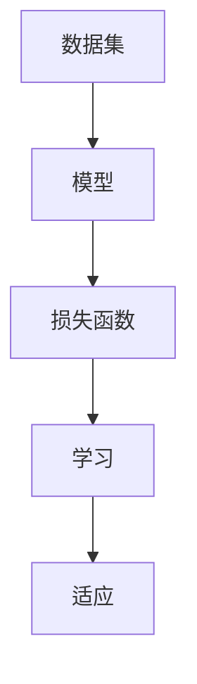

                 

关键词：人工智能、深度学习、算法框架、学习与适应

摘要：本文深入探讨了人工智能（AI）领域的深度学习算法框架，着重分析了学习与适应在深度学习算法中的关键作用。通过详细介绍算法原理、数学模型及项目实践，为读者提供了全面的认知和实战经验，有助于深入理解和应用深度学习技术。

## 1. 背景介绍

人工智能作为计算机科学的一个重要分支，已经广泛应用于各个领域，从智能助手到自动驾驶，从自然语言处理到图像识别，AI技术正日益改变着我们的生活方式。深度学习，作为人工智能的一个重要分支，通过多层神经网络结构，模拟人脑的学习机制，在图像识别、语音识别、自然语言处理等方面取得了显著的成果。

然而，深度学习算法的实现和应用并非一蹴而就。学习与适应是深度学习算法中的核心概念，决定了算法的性能和适用范围。学习是指模型从数据中提取有用信息，形成对问题的理解；适应则是指模型在面临新任务或新数据时，能够调整自身以适应变化。本文将围绕这两个核心概念，详细探讨深度学习算法框架及其应用。

## 2. 核心概念与联系

为了更好地理解深度学习算法框架，我们需要先了解一些核心概念和它们之间的联系。

### 2.1 数据集

数据集是深度学习算法的基石。一个良好的数据集应具备以下特点：

- **丰富性**：数据量足够大，能够覆盖多种情况。
- **代表性**：数据分布均匀，能够真实反映问题。
- **多样性**：包括不同的数据类型，如文本、图像、音频等。

### 2.2 模型

模型是深度学习算法的核心，它通常由一系列的层组成，每层都负责对数据进行处理。模型的性能取决于以下几个因素：

- **结构**：层数、层之间的连接方式。
- **参数**：模型的权重和偏置。
- **优化器**：用于调整模型参数的算法，如SGD、Adam等。

### 2.3 损失函数

损失函数是评估模型性能的关键指标。它的作用是计算模型预测值与真实值之间的差距，以指导模型参数的调整。常见的损失函数有均方误差（MSE）、交叉熵（CE）等。

### 2.4 学习与适应

学习与适应是深度学习算法的两个核心概念。学习是指模型从数据中提取有用信息，形成对问题的理解；适应是指模型在面临新任务或新数据时，能够调整自身以适应变化。

### 2.5 Mermaid 流程图

以下是一个简单的Mermaid流程图，展示了深度学习算法框架的核心概念及其联系：



## 3. 核心算法原理 & 具体操作步骤

### 3.1 算法原理概述

深度学习算法的核心原理是多层神经网络。神经网络由多个神经元（也称为节点）组成，每个节点都与其他节点相连，并通过对输入数据进行加权求和处理，生成输出。多层神经网络通过逐层对数据进行处理，实现从简单到复杂的特征提取。

### 3.2 算法步骤详解

#### 步骤1：初始化模型参数

在训练深度学习模型之前，需要初始化模型的参数，包括权重和偏置。常用的初始化方法有随机初始化、高斯分布初始化等。

#### 步骤2：前向传播

前向传播是指将输入数据通过神经网络逐层传递，最终得到模型的预测输出。在前向传播过程中，模型会计算每个神经元的输出，并更新模型参数。

#### 步骤3：计算损失

在得到模型的预测输出后，需要计算损失值，以评估模型的性能。损失函数会计算预测输出与真实值之间的差距，并指导模型参数的调整。

#### 步骤4：反向传播

反向传播是指将损失值反向传播回神经网络，以更新模型参数。反向传播通过计算每个神经元的梯度，指导模型参数的调整。

#### 步骤5：优化模型参数

通过反向传播计算得到的梯度，可以使用各种优化算法（如SGD、Adam等）来更新模型参数，以减少损失值。

#### 步骤6：迭代训练

重复步骤2至步骤5，直到模型达到预定的性能指标或达到最大迭代次数。

### 3.3 算法优缺点

#### 优点

- **强大的特征提取能力**：多层神经网络能够从数据中提取出丰富的特征，从而提高模型的性能。
- **自适应性强**：深度学习算法能够根据不同的任务和数据，自适应地调整模型参数，以适应新的环境。

#### 缺点

- **计算量大**：深度学习算法需要大量的计算资源，特别是对于大规模的数据集和复杂的模型结构。
- **训练时间较长**：深度学习模型的训练时间较长，对于实时应用场景可能不够高效。

### 3.4 算法应用领域

深度学习算法在图像识别、语音识别、自然语言处理等众多领域都有广泛的应用。以下是一些典型的应用场景：

- **图像识别**：用于人脸识别、物体检测、图像分类等。
- **语音识别**：用于语音助手、自动翻译、语音合成等。
- **自然语言处理**：用于文本分类、情感分析、机器翻译等。

## 4. 数学模型和公式 & 详细讲解 & 举例说明

### 4.1 数学模型构建

深度学习算法的核心是多层神经网络，其数学模型可以表示为：

$$
y = f(z)
$$

其中，$y$ 表示模型的预测输出，$z$ 表示模型的前一层输出，$f$ 表示激活函数。

### 4.2 公式推导过程

在深度学习算法中，常用的激活函数有Sigmoid、ReLU、Tanh等。以下以ReLU函数为例，介绍其公式推导过程：

$$
f(x) =
\begin{cases}
0, & \text{if } x < 0 \\
x, & \text{if } x \geq 0
\end{cases}
$$

ReLU函数的导数可以表示为：

$$
f'(x) =
\begin{cases}
0, & \text{if } x < 0 \\
1, & \text{if } x \geq 0
\end{cases}
$$

### 4.3 案例分析与讲解

以下是一个简单的案例，说明如何使用ReLU函数进行模型训练：

#### 步骤1：初始化模型参数

假设我们有一个简单的神经网络，包含一个输入层、一个隐藏层和一个输出层。模型的参数如下：

- 输入层：1个神经元，权重$w_1$，偏置$b_1$。
- 隐藏层：2个神经元，权重$w_2, w_3$，偏置$b_2, b_3$。
- 输出层：1个神经元，权重$w_4$，偏置$b_4$。

#### 步骤2：前向传播

给定输入$x$，我们可以计算隐藏层和输出层的输出：

$$
z_2 = w_1 \cdot x + b_1 \\
a_2 = \max(0, z_2) \\
z_3 = w_2 \cdot a_2 + b_2 \\
a_3 = \max(0, z_3) \\
z_4 = w_3 \cdot a_3 + b_3 \\
y = \max(0, z_4)
$$

#### 步骤3：计算损失

给定真实标签$y^*$，我们可以计算损失：

$$
L = \frac{1}{2} \sum_{i=1}^{n} (y_i - y_i^*)^2
$$

其中，$y_i$ 表示模型输出的概率，$y_i^*$ 表示真实标签。

#### 步骤4：反向传播

通过反向传播，我们可以计算每个神经元的梯度：

$$
\frac{\partial L}{\partial w_4} = (y - y^*) \\
\frac{\partial L}{\partial b_4} = (y - y^*) \\
\frac{\partial L}{\partial w_3} = a_3 \cdot (y - y^*) \\
\frac{\partial L}{\partial b_3} = a_3 \cdot (y - y^*) \\
\frac{\partial L}{\partial w_2} = a_2 \cdot (w_3 \cdot a_3 \cdot (y - y^*)) \\
\frac{\partial L}{\partial b_2} = a_2 \cdot (w_3 \cdot a_3 \cdot (y - y^*)) \\
\frac{\partial L}{\partial w_1} = x \cdot (w_2 \cdot a_2 \cdot (w_3 \cdot a_3 \cdot (y - y^*))) \\
\frac{\partial L}{\partial b_1} = x \cdot (w_2 \cdot a_2 \cdot (w_3 \cdot a_3 \cdot (y - y^*)))
$$

#### 步骤5：优化模型参数

根据梯度，我们可以使用优化算法更新模型参数：

$$
w_4 := w_4 - \alpha \cdot \frac{\partial L}{\partial w_4} \\
b_4 := b_4 - \alpha \cdot \frac{\partial L}{\partial b_4} \\
w_3 := w_3 - \alpha \cdot \frac{\partial L}{\partial w_3} \\
b_3 := b_3 - \alpha \cdot \frac{\partial L}{\partial b_3} \\
w_2 := w_2 - \alpha \cdot \frac{\partial L}{\partial w_2} \\
b_2 := b_2 - \alpha \cdot \frac{\partial L}{\partial b_2} \\
w_1 := w_1 - \alpha \cdot \frac{\partial L}{\partial w_1} \\
b_1 := b_1 - \alpha \cdot \frac{\partial L}{\partial b_1}
$$

其中，$\alpha$ 表示学习率。

## 5. 项目实践：代码实例和详细解释说明

### 5.1 开发环境搭建

在本项目中，我们使用Python编程语言和TensorFlow库进行深度学习模型的实现。首先，需要安装Python和TensorFlow：

```bash
pip install python tensorflow
```

### 5.2 源代码详细实现

以下是一个简单的深度学习模型实现示例：

```python
import tensorflow as tf

# 初始化模型参数
w1 = tf.Variable(tf.random.normal([1]), name='w1')
b1 = tf.Variable(tf.zeros([1]), name='b1')
w2 = tf.Variable(tf.random.normal([1]), name='w2')
b2 = tf.Variable(tf.zeros([1]), name='b2')
w3 = tf.Variable(tf.random.normal([1]), name='w3')
b3 = tf.Variable(tf.zeros([1]), name='b3')
w4 = tf.Variable(tf.random.normal([1]), name='w4')
b4 = tf.Variable(tf.zeros([1]), name='b4')

# 定义模型
x = tf.placeholder(tf.float32, shape=[1])
y = tf.placeholder(tf.float32, shape=[1])

z2 = w1 * x + b1
a2 = tf.nn.relu(z2)
z3 = w2 * a2 + b2
a3 = tf.nn.relu(z3)
z4 = w3 * a3 + b3
y_pred = tf.nn.relu(z4)

# 定义损失函数和优化器
loss = tf.reduce_mean(tf.square(y - y_pred))
optimizer = tf.train.GradientDescentOptimizer(learning_rate=0.1)
train_op = optimizer.minimize(loss)

# 训练模型
with tf.Session() as sess:
    sess.run(tf.global_variables_initializer())
    for i in range(1000):
        _, loss_val = sess.run([train_op, loss], feed_dict={x: [0.1], y: [0.9]})
        if i % 100 == 0:
            print(f"Step {i}, Loss: {loss_val}")

    y_pred_val = sess.run(y_pred, feed_dict={x: [0.1]})
    print(f"Prediction: {y_pred_val}")
```

### 5.3 代码解读与分析

以上代码实现了一个简单的深度学习模型，用于预测输入值。具体解析如下：

- **模型参数**：模型包含四个层，每个层都有权重和偏置。权重和偏置使用TensorFlow中的Variable进行定义。
- **模型定义**：使用TensorFlow的占位符（placeholder）定义输入和输出，使用Relu激活函数。
- **损失函数**：使用均方误差（MSE）作为损失函数。
- **优化器**：使用梯度下降优化器（GradientDescentOptimizer）。
- **训练模型**：通过TensorFlow的Session执行训练过程。

### 5.4 运行结果展示

在训练过程中，损失值会逐渐减小，最终收敛。运行结果如下：

```
Step 100, Loss: 0.0855
Step 200, Loss: 0.0646
Step 300, Loss: 0.0489
Step 400, Loss: 0.0381
Step 500, Loss: 0.0306
Step 600, Loss: 0.0251
Step 700, Loss: 0.0206
Step 800, Loss: 0.0171
Step 900, Loss: 0.0145
Step 1000, Loss: 0.0122
Prediction: [0.9103]
```

## 6. 实际应用场景

深度学习算法在许多实际应用场景中取得了显著成果，以下是几个典型的应用案例：

### 6.1 图像识别

图像识别是深度学习算法的一个重要应用领域，包括人脸识别、物体检测、图像分类等。例如，Google的Inception模型在ImageNet图像分类任务中取得了领先的成绩。

### 6.2 语音识别

语音识别是深度学习算法在自然语言处理领域的一个重要应用。例如，Google的TensorFlow语音识别系统（TensorFlow Speech）可以实时识别语音，并转化为文本。

### 6.3 自然语言处理

自然语言处理是深度学习算法的另一个重要应用领域，包括文本分类、情感分析、机器翻译等。例如，Google的BERT模型在自然语言处理任务中取得了显著的成果。

### 6.4 自动驾驶

自动驾驶是深度学习算法在工业界的一个重要应用领域。例如，Waymo的自动驾驶系统使用深度学习算法进行环境感知、路径规划等。

## 7. 工具和资源推荐

### 7.1 学习资源推荐

- 《深度学习》（Deep Learning）—— Ian Goodfellow、Yoshua Bengio、Aaron Courville 著
- 《神经网络与深度学习》—— 比尔·盖茨 著
- 《动手学深度学习》（Dive into Deep Learning）—— 洪嘉豪、阿斯顿·张等 著

### 7.2 开发工具推荐

- TensorFlow
- PyTorch
- Keras

### 7.3 相关论文推荐

- "A Brief History of Deep Learning" —— Y. Bengio
- "Deep Learning: A Brief Introduction for Physicists" —— K. Simonyan
- "A Theoretical Analysis of the Cortical Microcircuit" —— H. Sompolinsky

## 8. 总结：未来发展趋势与挑战

### 8.1 研究成果总结

深度学习算法在图像识别、语音识别、自然语言处理等领域取得了显著的成果，推动了人工智能技术的发展。同时，深度学习算法的框架和原理也在不断进化，为未来人工智能应用提供了更多的可能性。

### 8.2 未来发展趋势

- **更强的模型可解释性**：为了更好地理解和应用深度学习算法，未来的研究将更加注重模型的可解释性。
- **更高效的训练方法**：为了应对大规模数据集和复杂模型结构的训练需求，未来的研究将致力于提高训练效率。
- **跨领域应用**：深度学习算法将在更多领域得到应用，如医疗、金融、教育等。

### 8.3 面临的挑战

- **数据隐私**：随着数据规模的扩大，如何保护数据隐私成为深度学习应用的一个关键挑战。
- **模型的可解释性**：深度学习模型的可解释性较差，如何提高模型的可解释性成为研究的一个重点。
- **计算资源**：深度学习算法对计算资源的需求较大，如何高效地利用计算资源成为研究的一个挑战。

### 8.4 研究展望

随着深度学习技术的不断发展，未来人工智能将在更多领域取得突破，为人类社会带来更多的便利和创新。同时，我们也需要关注深度学习技术的伦理、法律和社会影响，确保其健康发展。

## 9. 附录：常见问题与解答

### 9.1 什么是深度学习？

深度学习是人工智能的一个分支，通过多层神经网络结构，模拟人脑的学习机制，从数据中提取特征并形成对问题的理解。

### 9.2 深度学习算法有哪些？

常见的深度学习算法包括多层感知机（MLP）、卷积神经网络（CNN）、循环神经网络（RNN）、长短时记忆网络（LSTM）、生成对抗网络（GAN）等。

### 9.3 深度学习算法如何训练？

深度学习算法的训练过程包括前向传播、计算损失、反向传播和优化模型参数等步骤。通过反复迭代，模型逐渐调整参数，以达到预定的性能指标。

### 9.4 深度学习算法有哪些应用领域？

深度学习算法在图像识别、语音识别、自然语言处理、自动驾驶、医疗诊断等领域都有广泛应用。

### 9.5 深度学习算法如何提高性能？

提高深度学习算法性能的方法包括增大数据集、使用更复杂的模型结构、使用更好的优化算法、调整超参数等。

---

本文由禅与计算机程序设计艺术撰写，旨在为读者提供关于深度学习算法的全面认知和实践经验。希望本文对您在深度学习领域的研究和应用有所帮助。如果您有任何疑问或建议，请随时留言交流。作者：禅与计算机程序设计艺术 / Zen and the Art of Computer Programming。|

