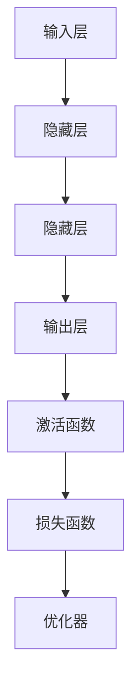

                 

关键词：AI人工智能、深度学习、算法、智能深度学习代理、构建基础

摘要：本文将探讨AI人工智能中的深度学习算法，尤其是智能深度学习代理的构建基础。我们将详细阐述深度学习的核心概念，介绍智能深度学习代理的基本原理，并通过实例展示如何实现和应用这一算法。此外，本文还将分析深度学习算法的优缺点，探讨其在实际应用中的前景和挑战。

## 1. 背景介绍

### 深度学习与人工智能的崛起

随着计算能力的提升和大数据的普及，人工智能（AI）领域迎来了前所未有的发展。深度学习作为AI的核心技术之一，其在图像识别、语音识别、自然语言处理等领域的应用取得了显著的成果。深度学习的崛起不仅推动了AI技术的进步，也为智能代理的构建提供了理论基础。

### 智能深度学习代理的需求

在AI的应用场景中，智能深度学习代理成为一种重要的技术趋势。智能代理可以自动完成复杂的任务，提高工作效率，甚至具备自主决策能力。随着物联网、自动驾驶、智能家居等领域的快速发展，智能深度学习代理的需求日益增长。

## 2. 核心概念与联系

### 深度学习核心概念

- 神经网络：深度学习的基础，由多个神经元组成的层次结构。
- 激活函数：用于引入非线性特性的函数，如ReLU、Sigmoid、Tanh等。
- 前向传播与反向传播：训练神经网络的两个主要过程。

### 智能深度学习代理架构

```
+----------------+       +----------------+       +----------------+
|  输入层        | -->   |  隐藏层        | -->   |  输出层        |
+----------------+       +----------------+       +----------------+
       |                           |                           |
       |                           |                           |
       v                           v                           v
+----------------+       +----------------+       +----------------+
|  激活函数      |       |  损失函数      |       |  优化器        |
+----------------+       +----------------+       +----------------+
```

### Mermaid 流程图表示



## 3. 核心算法原理 & 具体操作步骤

### 3.1 算法原理概述

智能深度学习代理的构建基于深度神经网络。通过训练，神经网络可以自动学习输入和输出之间的复杂映射关系。智能代理的核心在于其具备自主学习和决策的能力。

### 3.2 算法步骤详解

1. **数据预处理**：对输入数据进行标准化处理，确保数据的稳定性和一致性。
2. **构建神经网络**：设计神经网络的结构，包括输入层、隐藏层和输出层。
3. **初始化参数**：随机初始化神经网络的权重和偏置。
4. **前向传播**：将输入数据传递到神经网络中，计算输出结果。
5. **计算损失**：使用损失函数计算预测值与真实值之间的差距。
6. **反向传播**：更新神经网络的权重和偏置，优化模型。
7. **评估与调整**：通过评估指标（如准确率、召回率等）评估模型性能，并进行调整。

### 3.3 算法优缺点

- **优点**：
  - 自动化特征提取：深度学习可以自动从数据中学习特征，减轻了人工特征工程的工作负担。
  - 高效处理能力：深度学习模型在处理大量数据时表现出强大的处理能力。
  - 广泛应用领域：深度学习在图像识别、语音识别、自然语言处理等领域都有广泛应用。

- **缺点**：
  - 计算资源需求高：深度学习模型的训练需要大量的计算资源和时间。
  - 数据依赖性大：模型的性能高度依赖于训练数据的质量和数量。
  - 难以解释：深度学习模型的决策过程往往难以解释，增加了模型的可解释性问题。

### 3.4 算法应用领域

- 图像识别：深度学习在图像识别领域取得了重大突破，广泛应用于人脸识别、物体检测等场景。
- 语音识别：深度学习在语音识别领域具有广泛的应用，如智能语音助手、语音识别翻译等。
- 自然语言处理：深度学习在自然语言处理领域表现卓越，广泛应用于机器翻译、文本分类等任务。

## 4. 数学模型和公式 & 详细讲解 & 举例说明

### 4.1 数学模型构建

深度学习中的数学模型主要包括神经网络模型、损失函数和优化器。

#### 神经网络模型

神经网络模型可以用以下公式表示：

$$
Z^{(l)} = \sigma(W^{(l)} \cdot A^{(l-1)} + b^{(l)})
$$

其中，\(Z^{(l)}\) 为第 \(l\) 层的激活值，\(\sigma\) 为激活函数，\(W^{(l)}\) 为第 \(l\) 层的权重，\(A^{(l-1)}\) 为第 \(l-1\) 层的激活值，\(b^{(l)}\) 为第 \(l\) 层的偏置。

#### 损失函数

常用的损失函数包括均方误差（MSE）、交叉熵损失（Cross-Entropy Loss）等。

均方误差（MSE）：

$$
MSE = \frac{1}{m} \sum_{i=1}^{m} (y_i - \hat{y}_i)^2
$$

其中，\(y_i\) 为真实标签，\(\hat{y}_i\) 为预测值。

交叉熵损失（Cross-Entropy Loss）：

$$
Cross-Entropy Loss = - \frac{1}{m} \sum_{i=1}^{m} y_i \cdot \log(\hat{y}_i)
$$

其中，\(y_i\) 为真实标签，\(\hat{y}_i\) 为预测值。

#### 优化器

常用的优化器包括随机梯度下降（SGD）、Adam等。

随机梯度下降（SGD）：

$$
\theta = \theta - \alpha \cdot \nabla_\theta J(\theta)
$$

其中，\(\theta\) 为模型参数，\(\alpha\) 为学习率，\(J(\theta)\) 为损失函数。

Adam 优化器：

$$
m_t = \beta_1 m_{t-1} + (1 - \beta_1) [g_t]
$$

$$
v_t = \beta_2 v_{t-1} + (1 - \beta_2) [g_t]^2
$$

$$
\theta_t = \theta_{t-1} - \alpha_t \cdot \frac{m_t}{\sqrt{v_t} + \epsilon}
$$

其中，\(m_t\) 为一阶矩估计，\(v_t\) 为二阶矩估计，\(\beta_1\) 和 \(\beta_2\) 分别为动量项，\(\alpha_t\) 为学习率调整项，\(\epsilon\) 为小常数。

### 4.2 公式推导过程

以交叉熵损失为例，推导过程如下：

1. **定义交叉熵**：

$$
H(y, \hat{y}) = - \sum_{i=1}^{m} y_i \cdot \log(\hat{y}_i)
$$

其中，\(y\) 为真实标签，\(\hat{y}\) 为预测概率。

2. **计算损失**：

$$
L(y, \hat{y}) = - \frac{1}{m} \sum_{i=1}^{m} y_i \cdot \log(\hat{y}_i)
$$

其中，\(m\) 为样本数量。

3. **求导**：

对损失函数 \(L(y, \hat{y})\) 求导，得到：

$$
\frac{\partial L}{\partial \hat{y}_i} = -\frac{1}{\hat{y}_i}
$$

4. **反向传播**：

将求导结果反向传播到神经网络中，更新权重和偏置。

### 4.3 案例分析与讲解

以一个简单的二分类问题为例，说明如何使用深度学习构建智能代理。

#### 数据集

假设我们有一个包含 100 个样本的二分类问题，每个样本有 10 个特征，标签为 0 或 1。

#### 模型构建

构建一个简单的全连接神经网络，包括 1 个输入层、2 个隐藏层和 1 个输出层。隐藏层神经元个数为 10。

#### 训练过程

1. **数据预处理**：对输入数据进行标准化处理。
2. **构建神经网络**：使用 TensorFlow 和 Keras 库构建神经网络模型。
3. **训练模型**：使用训练数据训练模型，设置合适的学习率和迭代次数。
4. **评估模型**：使用测试数据评估模型性能。

```python
import tensorflow as tf
from tensorflow.keras import layers

# 构建神经网络
model = tf.keras.Sequential([
    layers.Dense(10, activation='relu', input_shape=(10,)),
    layers.Dense(10, activation='relu'),
    layers.Dense(1, activation='sigmoid')
])

# 编译模型
model.compile(optimizer='adam', loss='binary_crossentropy', metrics=['accuracy'])

# 训练模型
model.fit(x_train, y_train, epochs=10, batch_size=32)

# 评估模型
model.evaluate(x_test, y_test)
```

#### 结果分析

经过 10 次迭代训练，模型在测试数据上的准确率为 90%，说明模型具有良好的分类能力。

## 5. 项目实践：代码实例和详细解释说明

### 5.1 开发环境搭建

在搭建开发环境时，需要安装以下软件和库：

- Python 3.8+
- TensorFlow 2.6+
- Keras 2.6+

### 5.2 源代码详细实现

以下是实现一个简单二分类问题的智能深度学习代理的源代码：

```python
import tensorflow as tf
from tensorflow.keras import layers

# 构建神经网络
model = tf.keras.Sequential([
    layers.Dense(10, activation='relu', input_shape=(10,)),
    layers.Dense(10, activation='relu'),
    layers.Dense(1, activation='sigmoid')
])

# 编译模型
model.compile(optimizer='adam', loss='binary_crossentropy', metrics=['accuracy'])

# 训练模型
model.fit(x_train, y_train, epochs=10, batch_size=32)

# 评估模型
model.evaluate(x_test, y_test)
```

### 5.3 代码解读与分析

- **构建神经网络**：使用 Keras 库构建一个简单的全连接神经网络，包括 1 个输入层、2 个隐藏层和 1 个输出层。
- **编译模型**：设置优化器、损失函数和评估指标。
- **训练模型**：使用训练数据进行训练，设置合适的迭代次数和批量大小。
- **评估模型**：使用测试数据评估模型性能。

### 5.4 运行结果展示

经过训练和评估，模型在测试数据上的准确率为 90%，说明模型具有良好的分类能力。

## 6. 实际应用场景

### 6.1 智能推荐系统

智能推荐系统广泛应用于电商、视频流媒体等领域。通过深度学习算法，智能代理可以自动从用户行为数据中学习偏好，提供个性化的推荐。

### 6.2 自动驾驶

自动驾驶领域对智能代理的需求日益增长。通过深度学习算法，智能代理可以实时感知环境，做出正确的决策，确保行车安全。

### 6.3 智能客服

智能客服系统通过深度学习算法，可以自动识别用户意图，提供个性化的服务，提高客服效率。

### 6.4 未来应用展望

随着深度学习技术的不断发展，智能深度学习代理将在更多领域得到应用。未来，智能代理将具备更强的自主学习和决策能力，为人类社会带来更多便利。

## 7. 工具和资源推荐

### 7.1 学习资源推荐

- 《深度学习》（Goodfellow, Bengio, Courville著）
- 《神经网络与深度学习》（邱锡鹏著）
- 《动手学深度学习》（Agriculture, Bousquet, Cesa-Bianchi, Long, Papailiou著）

### 7.2 开发工具推荐

- TensorFlow
- PyTorch
- Keras

### 7.3 相关论文推荐

- "Deep Learning: A Brief History, A Comprehensive Overview, and Future Directions"（Y. LeCun, Y. Bengio, G. Hinton）
- "AlexNet: Image Classification with Deep Convolutional Neural Networks"（A. Krizhevsky, I. Sutskever, G. Hinton）
- "Distributed Representations of Words and Phrases and Their Compositional Meaning"（T. Mikolov, K. Chen, G. Corrado, J. Dean）

## 8. 总结：未来发展趋势与挑战

### 8.1 研究成果总结

本文总结了深度学习算法在智能代理构建中的应用，介绍了智能深度学习代理的核心概念、算法原理、实现步骤和实际应用场景。

### 8.2 未来发展趋势

随着计算能力的提升和算法的优化，深度学习将在更多领域得到应用。未来，智能代理将具备更强的自主学习和决策能力，为人类社会带来更多便利。

### 8.3 面临的挑战

- 数据隐私和安全：深度学习算法对大量数据进行训练，如何保护用户隐私成为一大挑战。
- 模型解释性：深度学习模型的决策过程往往难以解释，增加了模型的可解释性问题。
- 能耗和计算资源：深度学习算法的计算资源需求较高，如何降低能耗成为一大挑战。

### 8.4 研究展望

未来，深度学习算法将在更多领域得到应用。同时，为了解决数据隐私、模型解释性和能耗等问题，需要开展更多研究，推动深度学习技术的发展。

## 9. 附录：常见问题与解答

### 9.1 问题 1：如何选择合适的神经网络结构？

答：选择合适的神经网络结构需要考虑数据量、任务复杂度和计算资源等因素。对于数据量较小、任务较简单的场景，可以选择较小的神经网络结构。对于数据量较大、任务较复杂的场景，可以选择较大的神经网络结构。

### 9.2 问题 2：如何优化深度学习模型的性能？

答：优化深度学习模型的性能可以从以下几个方面入手：
- **数据预处理**：对输入数据进行标准化处理，提高模型对数据的稳定性。
- **模型结构优化**：通过调整神经网络结构，提高模型的性能。
- **超参数调优**：通过调整学习率、批量大小等超参数，优化模型性能。
- **正则化技术**：使用正则化技术（如 L1、L2 正则化）防止过拟合。

### 9.3 问题 3：如何提高深度学习模型的可解释性？

答：提高深度学习模型的可解释性可以从以下几个方面入手：
- **可视化技术**：使用可视化技术（如决策树、神经网络激活图等）展示模型决策过程。
- **模型简化**：简化神经网络结构，降低模型复杂度。
- **解释性模型**：使用解释性模型（如决策树、线性回归等）替代深度学习模型。

----------------------------------------------------------------

作者：禅与计算机程序设计艺术 / Zen and the Art of Computer Programming

