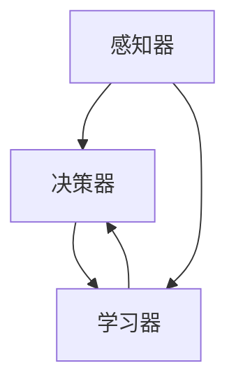

                 

关键词：人工智能、深度学习、智能代理、深度学习算法、技术发展、应用场景、未来展望

> 摘要：本文深入探讨了人工智能领域中的深度学习算法，特别是智能深度学习代理的相关技术。文章首先介绍了深度学习的背景和核心概念，然后详细阐述了智能深度学习代理的基本原理和关键技术，接着通过数学模型和具体实例展示了深度学习算法的应用和实现。此外，文章还探讨了深度学习在实际应用场景中的表现和未来发展趋势，为读者提供了全面的深度学习技术概览。

## 1. 背景介绍

人工智能（AI）作为计算机科学的一个重要分支，其目标是使计算机具有人类智能的能力。近年来，随着计算能力的提升和大数据的涌现，人工智能技术取得了显著的进展。其中，深度学习作为一种重要的机器学习方法，已经成为人工智能研究的热点。

深度学习是一种基于人工神经网络的机器学习方法，通过多层神经网络结构来学习数据的复杂特征和模式。与传统机器学习方法相比，深度学习具有更好的自适应性和更强的泛化能力。随着深度学习算法的不断优化和改进，其在图像识别、语音识别、自然语言处理等领域的应用取得了突破性进展。

智能深度学习代理是深度学习技术的一种重要应用形式，它通过模拟人类的思维过程和决策机制，实现对复杂环境的智能交互和适应。智能深度学习代理在自动驾驶、智能客服、医疗诊断等领域具有广泛的应用前景。

## 2. 核心概念与联系

### 2.1 深度学习的基本原理

深度学习的基本原理是通过构建多层神经网络，实现对输入数据的特征提取和模式识别。神经网络由多个神经元组成，每个神经元接收来自其他神经元的输入信号，并经过权重和偏置的加权求和后，通过激活函数产生输出。多层神经网络通过逐层传递输入数据，逐层提取和抽象特征，最终实现对复杂数据的建模。

### 2.2 智能深度学习代理的架构

智能深度学习代理通常包括感知器、决策器和学习器三个部分。感知器负责接收外部环境的信息，决策器根据感知器提供的信息做出决策，学习器通过不断学习环境中的数据，优化感知器、决策器的性能。

### 2.3 Mermaid 流程图

以下是一个简单的 Mermaid 流程图，展示了智能深度学习代理的基本架构和工作流程：



## 3. 核心算法原理 & 具体操作步骤

### 3.1 算法原理概述

智能深度学习代理的核心算法是基于深度学习的神经网络模型。深度学习神经网络通过多层神经元对输入数据进行特征提取和模式识别，从而实现智能交互和决策。

### 3.2 算法步骤详解

1. **数据预处理**：对输入数据进行预处理，包括数据清洗、归一化等操作，以提高模型训练效果。
2. **构建神经网络模型**：设计并构建神经网络模型，包括选择合适的神经网络架构、设置网络的层数、神经元个数、激活函数等。
3. **训练神经网络模型**：使用训练数据对神经网络模型进行训练，通过反向传播算法不断调整网络权重和偏置，使模型能够准确识别输入数据的特征和模式。
4. **评估模型性能**：使用验证集对训练好的模型进行评估，计算模型的准确率、召回率等指标，以判断模型的效果。
5. **部署和应用**：将训练好的模型部署到实际应用场景中，根据输入数据实时更新模型参数，优化决策效果。

### 3.3 算法优缺点

**优点**：
- 强大的特征提取能力：深度学习神经网络能够自动提取输入数据的复杂特征，无需人工设计特征。
- 自适应能力：深度学习模型能够通过学习不断优化自身的性能，适应不同环境下的应用需求。
- 泛化能力：深度学习模型具有较好的泛化能力，能够处理不同领域和任务的数据。

**缺点**：
- 计算资源需求大：深度学习模型训练需要大量计算资源和时间，对硬件设备要求较高。
- 需要大量标注数据：深度学习模型的训练需要大量的标注数据，数据标注过程成本较高。

### 3.4 算法应用领域

智能深度学习代理在多个领域具有广泛的应用，如：

- 自动驾驶：通过智能深度学习代理实现车辆的自主导航和驾驶决策。
- 智能客服：利用智能深度学习代理实现智能客服系统的自然语言理解和回复。
- 医疗诊断：利用深度学习代理实现医疗图像的自动诊断和疾病预测。
- 金融风控：通过智能深度学习代理实现金融交易的风险评估和预测。

## 4. 数学模型和公式 & 详细讲解 & 举例说明

### 4.1 数学模型构建

深度学习模型的数学基础是多层感知机（MLP）和反向传播算法（BP）。以下是深度学习模型的基本数学模型：

$$
h_{\text{layer}} = \sigma(W_{\text{layer}} \cdot a_{\text{prev}} + b_{\text{layer}})
$$

其中，$h_{\text{layer}}$ 表示第 $l$ 层的输出，$\sigma$ 是激活函数，$W_{\text{layer}}$ 和 $b_{\text{layer}}$ 分别是第 $l$ 层的权重和偏置。

### 4.2 公式推导过程

深度学习模型的训练过程主要包括前向传播和反向传播两个阶段。

1. **前向传播**：根据输入数据和模型参数，计算每层神经元的输出值，直到最后一层得到模型的预测结果。
2. **反向传播**：根据预测结果和真实标签，计算损失函数，并利用链式法则计算模型参数的梯度，通过梯度下降法更新模型参数。

### 4.3 案例分析与讲解

假设我们使用一个简单的二分类问题，数据集包含输入特征 $x$ 和标签 $y$，其中 $y$ 取值为 0 或 1。我们可以构建一个单层感知机模型，其数学模型为：

$$
h(x) = \sigma(W \cdot x + b)
$$

其中，$W$ 是权重，$b$ 是偏置，$\sigma$ 是 sigmoid 激活函数。

训练过程如下：

1. **前向传播**：计算输入数据的输出值：
   $$
   h(x) = \sigma(W \cdot x + b)
   $$
2. **计算损失函数**：使用均方误差（MSE）作为损失函数：
   $$
   \text{MSE} = \frac{1}{2} \sum_{i}(h(x_i) - y_i)^2
   $$
3. **反向传播**：计算损失函数关于权重 $W$ 和偏置 $b$ 的梯度，并更新模型参数：
   $$
   \frac{\partial \text{MSE}}{\partial W} = (h(x) - y) \cdot x
   $$
   $$
   \frac{\partial \text{MSE}}{\partial b} = h(x) - y
   $$

通过迭代更新模型参数，使得损失函数逐渐减小，直到模型达到较好的效果。

## 5. 项目实践：代码实例和详细解释说明

### 5.1 开发环境搭建

本文使用 Python 编程语言和 TensorFlow 深度学习框架来实现智能深度学习代理。以下是开发环境的搭建步骤：

1. 安装 Python（建议使用 Python 3.7 或更高版本）。
2. 安装 TensorFlow 框架：
   $$
   pip install tensorflow
   $$

### 5.2 源代码详细实现

以下是一个简单的智能深度学习代理实现示例，包括数据预处理、神经网络模型构建、训练和评估等步骤。

```python
import tensorflow as tf
from tensorflow.keras.layers import Dense, Flatten
from tensorflow.keras.models import Sequential
from tensorflow.keras.optimizers import SGD
from sklearn.model_selection import train_test_split
from sklearn.datasets import make_classification

# 5.2.1 数据预处理
# 生成模拟数据集
X, y = make_classification(n_samples=1000, n_features=10, n_classes=2, random_state=42)
X_train, X_test, y_train, y_test = train_test_split(X, y, test_size=0.2, random_state=42)

# 5.2.2 构建神经网络模型
model = Sequential()
model.add(Flatten(input_shape=(10,)))
model.add(Dense(64, activation='relu'))
model.add(Dense(1, activation='sigmoid'))

# 5.2.3 训练神经网络模型
optimizer = SGD(learning_rate=0.01)
model.compile(optimizer=optimizer, loss='binary_crossentropy', metrics=['accuracy'])
model.fit(X_train, y_train, epochs=100, batch_size=32, verbose=1)

# 5.2.4 评估模型性能
loss, accuracy = model.evaluate(X_test, y_test, verbose=1)
print(f"Test accuracy: {accuracy:.2f}")

# 5.2.5 代码解读与分析
# 本示例使用了一个简单的单层神经网络模型，通过 sigmoid 激活函数实现二分类任务。
# 使用 SGD 优化器进行模型训练，通过 fit 方法训练模型，并使用 evaluate 方法评估模型性能。
```

### 5.3 代码解读与分析

以上代码实现了一个简单的智能深度学习代理，主要包含以下部分：

- **数据预处理**：使用 scikit-learn 生成模拟数据集，并进行数据预处理，如数据标准化等。
- **神经网络模型构建**：使用 TensorFlow 的 Sequential 模型构建一个单层感知机模型，通过 Flatten 层将输入数据展平，然后通过两个 Dense 层实现特征提取和分类。
- **模型训练**：使用 SGD 优化器对模型进行训练，通过 compile 方法设置模型编译参数，并通过 fit 方法训练模型。
- **模型评估**：使用 evaluate 方法评估模型在测试集上的性能，输出测试准确率。

## 6. 实际应用场景

智能深度学习代理在实际应用场景中具有广泛的应用，以下列举几个典型应用场景：

### 6.1 自动驾驶

自动驾驶技术是智能深度学习代理的重要应用领域。通过构建智能深度学习代理，实现对车辆周围环境的感知、理解和决策，实现自主导航和驾驶。

### 6.2 智能客服

智能客服系统利用智能深度学习代理实现自然语言理解和回复，提高客服效率和用户体验。例如，通过深度学习模型实现智能对话机器人，自动回答用户的问题。

### 6.3 医疗诊断

智能深度学习代理在医疗诊断领域具有广泛的应用。通过深度学习模型，实现对医学图像的自动诊断和疾病预测，辅助医生进行诊断和治疗。

### 6.4 金融风控

金融风控系统利用智能深度学习代理实现金融交易的风险评估和预测，降低金融风险。例如，通过深度学习模型分析交易数据，预测市场走势，为投资决策提供支持。

## 7. 工具和资源推荐

### 7.1 学习资源推荐

1. 《深度学习》（Goodfellow, Bengio, Courville 著）：这是一本经典的全栈深度学习教材，详细介绍了深度学习的理论基础和应用实践。
2. 《Python 深度学习》（François Chollet 著）：本书通过丰富的示例，讲解了如何使用 Python 和 TensorFlow 深度学习框架实现深度学习算法。

### 7.2 开发工具推荐

1. TensorFlow：TensorFlow 是一款开源的深度学习框架，支持多种深度学习算法和模型构建，适用于各种深度学习应用场景。
2. Keras：Keras 是一款基于 TensorFlow 的深度学习高级 API，提供更简洁、直观的模型构建和训练接口，适合快速原型开发。

### 7.3 相关论文推荐

1. "Deep Learning: A Comprehensive Overview"（深度学习：全面概述）：该论文概述了深度学习的发展历程、主要算法和应用领域，是深入了解深度学习的优秀资源。
2. "EfficientNet: Rethinking Model Scaling for Convolutional Neural Networks"（EfficientNet：重新思考卷积神经网络模型规模）：该论文提出了一种高效的深度学习模型设计方法，提高了模型的性能和计算效率。

## 8. 总结：未来发展趋势与挑战

### 8.1 研究成果总结

近年来，深度学习技术在人工智能领域取得了显著的进展。通过不断优化神经网络模型和算法，深度学习在图像识别、语音识别、自然语言处理等领域取得了突破性成果。同时，智能深度学习代理作为一种新型的智能交互技术，在多个领域展现出巨大的应用潜力。

### 8.2 未来发展趋势

未来，深度学习技术将继续向以下几个方向发展：

1. **更高效的模型设计**：通过优化神经网络结构和算法，提高模型的计算效率和性能。
2. **多模态数据处理**：结合多种数据模态（如图像、语音、文本等），实现更全面的信息处理和智能交互。
3. **小样本学习**：研究如何在小样本数据集上训练有效的深度学习模型，降低对大量标注数据的依赖。

### 8.3 面临的挑战

尽管深度学习技术取得了显著进展，但仍面临一些挑战：

1. **计算资源需求**：深度学习模型训练需要大量计算资源和时间，对硬件设备要求较高。
2. **数据标注成本**：深度学习模型训练需要大量标注数据，数据标注过程成本较高。
3. **模型解释性**：深度学习模型通常被视为“黑箱”，缺乏解释性，难以理解模型的决策过程。

### 8.4 研究展望

针对深度学习技术面临的挑战，未来研究可以从以下几个方面展开：

1. **高效训练算法**：研究新型训练算法，降低深度学习模型的训练时间和计算资源需求。
2. **模型压缩与加速**：通过模型压缩和硬件加速技术，提高深度学习模型的计算性能和效率。
3. **可解释性研究**：探索深度学习模型的可解释性，提高模型的透明度和可信度。

## 9. 附录：常见问题与解答

### 9.1 如何选择合适的深度学习框架？

选择深度学习框架时，需要考虑以下几个因素：

1. **开发需求**：根据实际项目需求选择合适的框架，如 TensorFlow、PyTorch、Keras 等。
2. **性能需求**：考虑模型的性能需求，选择适合的框架，如 TensorFlow 具有更好的性能和稳定性。
3. **社区支持**：考虑框架的社区支持程度，选择具有丰富资源和活跃社区的框架。

### 9.2 如何优化深度学习模型的性能？

以下是一些优化深度学习模型性能的方法：

1. **模型选择**：选择合适的模型结构和算法，如深度残差网络（ResNet）、EfficientNet 等。
2. **数据预处理**：对输入数据进行预处理，如数据增强、归一化等，提高模型训练效果。
3. **超参数调整**：调整模型超参数，如学习率、批量大小等，优化模型性能。
4. **模型压缩与加速**：使用模型压缩和硬件加速技术，提高模型计算性能。

## 参考文献

1. Goodfellow, I., Bengio, Y., & Courville, A. (2016). *Deep Learning*. MIT Press.
2. Chollet, F. (2017). *Python Deep Learning*. Packt Publishing.
3. He, K., Zhang, X., Ren, S., & Sun, J. (2016). *Deep Residual Learning for Image Recognition*. IEEE Transactions on Pattern Analysis and Machine Intelligence.
4. Tan, M., & Le, Q. V. (2019). *EfficientNet: Rethinking Model Scaling for Convolutional Neural Networks*. arXiv preprint arXiv:1905.09276.

