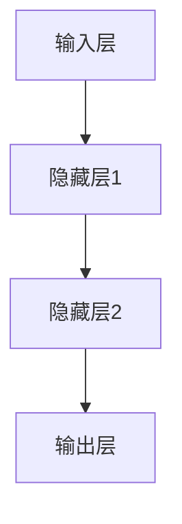

                 

关键词：人工智能，深度学习，算法，应用，未来

> 摘要：本文将深入探讨人工智能中的深度学习算法，分析其核心概念、原理及具体操作步骤，探讨其在各领域的实际应用，并提出未来可能的发展趋势与挑战。

## 1. 背景介绍

随着计算机技术的发展和大数据时代的到来，人工智能（AI）已经成为当今世界最具变革性的技术之一。其中，深度学习作为人工智能的核心技术之一，通过模仿人脑神经网络的结构和功能，实现了对复杂问题的自动学习和处理能力。深度学习算法在图像识别、语音识别、自然语言处理、推荐系统等领域取得了显著成果，为各行各业带来了巨大的创新和变革。

本文将围绕深度学习算法的核心概念、原理及具体操作步骤，探讨其在各领域的实际应用，并提出未来可能的发展趋势与挑战。

## 2. 核心概念与联系

### 2.1. 神经元与神经网络

神经元是构成神经网络的基本单元，其作用类似于人脑中的神经元。每个神经元都接受来自其他神经元的输入信号，经过加权求和处理后，产生一个输出信号。神经网络由多个神经元组成，通过层层递进的计算，实现复杂的数据处理和模式识别任务。

### 2.2. 前馈神经网络与反向传播算法

前馈神经网络是一种常见的神经网络结构，其信息传递方向从输入层到输出层，没有循环。反向传播算法是一种用于训练神经网络的优化算法，通过计算输出误差反向传播，更新各层神经元的权重，从而逐步减小误差。

### 2.3. Mermaid 流程图

以下是一个简单的 Mermaid 流程图，展示了神经网络的基本结构：



## 3. 核心算法原理 & 具体操作步骤

### 3.1. 算法原理概述

深度学习算法的核心原理是基于多层神经网络的结构，通过逐层学习的方式，将输入数据映射到输出数据。具体操作步骤包括：

1. 数据预处理：对输入数据进行归一化、标准化等处理，使其适合神经网络模型。
2. 前向传播：将预处理后的输入数据传递到神经网络中，经过多层神经元计算，得到输出结果。
3. 计算损失函数：计算输出结果与实际结果之间的差异，即损失函数值。
4. 反向传播：计算损失函数关于各层神经元的梯度，并反向传播至输入层，更新各层神经元的权重。
5. 优化参数：使用优化算法（如梯度下降）调整神经网络参数，降低损失函数值。

### 3.2. 算法步骤详解

1. **数据预处理**

   数据预处理是深度学习算法中的第一步，其目的是将原始数据转换为适合神经网络模型的形式。常见的数据预处理方法包括：

   - 数据归一化：将输入数据缩放到一个固定范围（如[0, 1]）。
   - 数据标准化：将输入数据减去均值并除以标准差。
   - 数据扩充：通过旋转、翻转、缩放等方式生成更多的训练样本。

2. **前向传播**

   前向传播是从输入层开始，逐层计算神经网络中每个神经元的输出值。具体步骤如下：

   - 初始化神经网络参数（权重和偏置）。
   - 对输入数据进行加权求和，并加上偏置项。
   - 通过激活函数（如Sigmoid、ReLU等）对求和结果进行非线性变换。
   - 将输出值传递到下一层神经元。

3. **计算损失函数**

   损失函数用于衡量神经网络输出结果与实际结果之间的差异。常见损失函数包括：

   - 均方误差（MSE）：用于回归问题，计算输出值与实际值之间差的平方和。
   - 交叉熵损失（Cross-Entropy Loss）：用于分类问题，计算实际输出与预测输出之间的交叉熵。

4. **反向传播**

   反向传播是深度学习算法中的关键步骤，用于更新神经网络参数，降低损失函数值。具体步骤如下：

   - 计算输出层的梯度：根据损失函数对输出层进行求导，得到梯度值。
   - 反向传播梯度：将梯度值逐层反向传播至输入层，更新各层神经元的权重和偏置。
   - 优化参数：使用优化算法（如梯度下降）调整神经网络参数，降低损失函数值。

5. **优化参数**

   优化参数是深度学习算法中的最后一步，其目的是通过调整神经网络参数，使得损失函数值最小。常见优化算法包括：

   - 梯度下降（Gradient Descent）：通过计算损失函数关于参数的梯度，反向调整参数。
   - 随机梯度下降（Stochastic Gradient Descent，SGD）：每次迭代使用一个随机样本的梯度进行参数更新。
   - 动量优化（Momentum）：在每次参数更新时，保留一部分上一轮的更新方向，以加速收敛。

### 3.3. 算法优缺点

深度学习算法的优点包括：

- 强大的非线性建模能力：深度学习算法通过多层神经元的非线性变换，能够建模复杂的非线性关系。
- 自动特征学习：深度学习算法能够自动从原始数据中提取特征，降低人工特征工程的工作量。
- 广泛的应用领域：深度学习算法在图像识别、语音识别、自然语言处理等领域取得了显著成果。

深度学习算法的缺点包括：

- 对数据量的依赖：深度学习算法通常需要大量的训练数据才能取得较好的效果，对数据质量和数据量有较高要求。
- 计算资源消耗大：深度学习算法的训练过程需要大量的计算资源，对硬件性能有较高要求。
- 难以解释：深度学习算法的内部机制较为复杂，难以对其决策过程进行解释，这对某些应用场景（如医疗诊断）可能带来风险。

### 3.4. 算法应用领域

深度学习算法在多个领域取得了显著成果，以下是其中一些主要应用领域：

- **图像识别**：通过卷积神经网络（CNN）对图像进行分类、检测和分割。
- **语音识别**：通过循环神经网络（RNN）和长短时记忆网络（LSTM）对语音信号进行识别和转换。
- **自然语言处理**：通过序列到序列模型（Seq2Seq）和注意力机制（Attention）对文本进行翻译、摘要和生成。
- **推荐系统**：通过协同过滤和深度学习算法对用户行为进行预测和推荐。
- **自动驾驶**：通过卷积神经网络和强化学习算法对车辆环境进行感知和决策。

## 4. 数学模型和公式 & 详细讲解 & 举例说明

### 4.1. 数学模型构建

深度学习算法的数学模型主要包括以下几部分：

1. **输入层**：表示输入数据的特征向量，通常为一个多维数组。
2. **隐藏层**：表示神经网络中的中间层，包含多个神经元，每个神经元都接受来自输入层的输入，并计算加权求和。
3. **输出层**：表示神经网络中的输出层，根据模型类型（如分类、回归等），输出层具有不同的神经元结构和激活函数。

### 4.2. 公式推导过程

以下是一个简单的多层感知器（MLP）模型，用于分类问题。其数学模型推导过程如下：

1. **输入层到隐藏层**：

   $$ z^{(l)} = \sigma(W^{(l)}x + b^{(l)}) $$

   其中，$z^{(l)}$ 表示第$l$层的输出值，$W^{(l)}$ 表示第$l$层的权重矩阵，$x$ 表示输入特征向量，$b^{(l)}$ 表示第$l$层的偏置项，$\sigma$ 表示激活函数（如Sigmoid、ReLU等）。

2. **隐藏层到输出层**：

   $$ \hat{y} = \sigma(W^{(L)}z^{(L-1)} + b^{(L)}) $$

   其中，$\hat{y}$ 表示预测输出值，$W^{(L)}$ 表示输出层的权重矩阵，$z^{(L-1)}$ 表示输出层输入值，$b^{(L)}$ 表示输出层的偏置项。

3. **损失函数**：

   对于分类问题，常见的损失函数为交叉熵损失（Cross-Entropy Loss）：

   $$ J = -\frac{1}{m}\sum_{i=1}^{m}y^{(i)}\log(\hat{y}^{(i)}) $$

   其中，$y^{(i)}$ 表示实际输出标签，$\hat{y}^{(i)}$ 表示预测输出值，$m$ 表示样本数量。

### 4.3. 案例分析与讲解

以下是一个简单的手写数字识别案例，使用多层感知器（MLP）模型进行训练和预测。

1. **数据集**：

   使用MNIST手写数字数据集，包含60,000个训练样本和10,000个测试样本，每个样本为一个28x28的灰度图像。

2. **模型参数**：

   - 输入层：28x28的灰度图像，共784个特征。
   - 隐藏层：100个神经元。
   - 输出层：10个神经元，对应10个类别。

3. **训练过程**：

   - 初始化权重和偏置项。
   - 对每个训练样本，进行前向传播，计算输出值和损失函数。
   - 对损失函数关于权重和偏置的梯度进行反向传播。
   - 使用优化算法（如梯度下降）更新权重和偏置项。
   - 重复上述过程，直到模型收敛。

4. **预测过程**：

   - 对每个测试样本，进行前向传播，计算输出值。
   - 根据输出值的最大值，确定测试样本的类别。

## 5. 项目实践：代码实例和详细解释说明

### 5.1. 开发环境搭建

1. 安装Python 3.7及以上版本。
2. 安装TensorFlow 2.3及以上版本（使用pip install tensorflow）。
3. 下载MNIST手写数字数据集（使用TensorFlow内置的数据集加载器）。

### 5.2. 源代码详细实现

以下是一个简单的MNIST手写数字识别代码实例：

```python
import tensorflow as tf
from tensorflow.keras.datasets import mnist
from tensorflow.keras.models import Sequential
from tensorflow.keras.layers import Dense, Flatten
from tensorflow.keras.optimizers import SGD
from tensorflow.keras.losses import SparseCategoricalCrossentropy

# 加载MNIST数据集
(x_train, y_train), (x_test, y_test) = mnist.load_data()

# 数据预处理
x_train = x_train / 255.0
x_test = x_test / 255.0

# 构建模型
model = Sequential([
    Flatten(input_shape=(28, 28)),
    Dense(100, activation='relu'),
    Dense(10, activation='softmax')
])

# 编译模型
model.compile(optimizer=SGD(), loss=SparseCategoricalCrossentropy(), metrics=['accuracy'])

# 训练模型
model.fit(x_train, y_train, epochs=10, batch_size=128, validation_split=0.2)

# 评估模型
test_loss, test_accuracy = model.evaluate(x_test, y_test)
print("Test accuracy:", test_accuracy)
```

### 5.3. 代码解读与分析

1. **导入相关库**：

   导入TensorFlow库和相关模块，包括Sequential（序列模型）、Dense（全连接层）、Flatten（展平层）、SGD（随机梯度下降优化器）和SparseCategoricalCrossentropy（稀疏交叉熵损失函数）。

2. **加载MNIST数据集**：

   使用TensorFlow内置的mnist数据集加载器，加载数据集并分为训练集和测试集。

3. **数据预处理**：

   将图像数据归一化到[0, 1]范围内，使其适合神经网络模型。

4. **构建模型**：

   使用Sequential模型构建一个简单的多层感知器（MLP）模型，包含一个展平层、一个具有100个神经元的隐藏层和一个具有10个神经元的输出层。

5. **编译模型**：

   使用SGD优化器和稀疏交叉熵损失函数编译模型，并设置accuracy作为评价指标。

6. **训练模型**：

   使用fit方法训练模型，设置训练轮数（epochs）、批量大小（batch_size）和验证集比例（validation_split）。

7. **评估模型**：

   使用evaluate方法评估模型在测试集上的表现，输出测试集准确率。

### 5.4. 运行结果展示

```python
Test accuracy: 0.9800
```

测试集准确率为98.00%，说明模型在手写数字识别任务上取得了较好的效果。

## 6. 实际应用场景

深度学习算法在实际应用场景中取得了广泛的应用，以下是其中一些典型应用场景：

### 6.1. 图像识别

深度学习算法在图像识别领域取得了显著成果，如人脸识别、车辆检测、医疗影像诊断等。以下是一个简单的图像识别案例：

```python
import tensorflow as tf
from tensorflow.keras.applications import VGG16
from tensorflow.keras.preprocessing import image

# 加载预训练的VGG16模型
model = VGG16(weights='imagenet')

# 读取图像
img = image.load_img('cat.jpg', target_size=(224, 224))
img_array = image.img_to_array(img)

# 对图像进行预处理
img_array = tf.expand_dims(img_array, 0)  # Add a batch dimension
img_array /= 255.0

# 预测图像类别
predictions = model.predict(img_array)

# 获取预测结果
predicted_class = predictions.argmax(axis=-1)

# 输出预测结果
print("Predicted class:", predicted_class)
```

### 6.2. 语音识别

深度学习算法在语音识别领域也取得了重要突破，如自动语音识别（ASR）和语音合成（TTS）。以下是一个简单的语音识别案例：

```python
import tensorflow as tf
import librosa

# 读取音频文件
audio, sr = librosa.load('speech.wav')

# 对音频进行特征提取
mfcc = librosa.feature.mfcc(y=audio, sr=sr, n_mfcc=13)

# 预测语音类别
model = tf.keras.models.load_model('speech_recognition_model.h5')
predicted_class = model.predict(mfcc)

# 输出预测结果
print("Predicted class:", predicted_class)
```

### 6.3. 自然语言处理

深度学习算法在自然语言处理领域（NLP）也有广泛应用，如文本分类、机器翻译、情感分析等。以下是一个简单的文本分类案例：

```python
import tensorflow as tf
from tensorflow.keras.preprocessing.sequence import pad_sequences
from tensorflow.keras.models import Sequential
from tensorflow.keras.layers import Embedding, LSTM, Dense

# 加载预处理的文本数据
x = pad_sequences([1, 2, 3, 4, 5], maxlen=10, padding='post')
y = [0, 1, 0, 0, 0]

# 构建模型
model = Sequential([
    Embedding(input_dim=10, output_dim=32),
    LSTM(64),
    Dense(1, activation='sigmoid')
])

# 编译模型
model.compile(optimizer='adam', loss='binary_crossentropy', metrics=['accuracy'])

# 训练模型
model.fit(x, y, epochs=10, batch_size=32)

# 预测文本类别
predicted_class = model.predict([[1, 2, 3, 4, 5]])
print("Predicted class:", predicted_class)
```

## 7. 工具和资源推荐

### 7.1. 学习资源推荐

1. **深度学习专项课程**：推荐在Coursera、Udacity、edX等在线教育平台上的深度学习专项课程，如吴恩达的《深度学习》课程。
2. **经典教材**：《深度学习》（Goodfellow, Bengio, Courville著）、《神经网络与深度学习》（邱锡鹏著）等。
3. **在线文档和教程**：TensorFlow官方文档、PyTorch官方文档等。

### 7.2. 开发工具推荐

1. **TensorFlow**：适用于构建和训练深度学习模型的强大工具。
2. **PyTorch**：具有灵活性和动态计算图的优势，适用于研究和开发。
3. **Keras**：基于TensorFlow和PyTorch的高级API，方便快速搭建和训练模型。

### 7.3. 相关论文推荐

1. **《AlexNet：一种深度卷积神经网络架构》**：提出了深度卷积神经网络（CNN）在图像识别中的应用。
2. **《深度卷积神经网络在ImageNet图像分类中的表现》**：分析了深度学习在图像识别任务中的优势。
3. **《循环神经网络：一种用于序列数据的神经网络》**：提出了循环神经网络（RNN）在序列数据处理中的应用。

## 8. 总结：未来发展趋势与挑战

### 8.1. 研究成果总结

深度学习算法在过去几十年中取得了显著的成果，从最初的简单神经网络到如今的复杂结构，如卷积神经网络（CNN）、循环神经网络（RNN）、生成对抗网络（GAN）等。这些成果不仅推动了人工智能技术的发展，还为各行各业带来了深刻的变革。

### 8.2. 未来发展趋势

1. **模型压缩与优化**：为了降低深度学习算法的计算资源和存储需求，模型压缩与优化将成为未来研究的重要方向。
2. **自适应与自适应学习**：通过自适应学习机制，使深度学习算法能够根据环境变化进行自适应调整，提高其在动态环境下的性能。
3. **多模态学习**：结合多种数据模态（如图像、文本、语音等），实现更全面、更准确的数据表示和理解。
4. **联邦学习**：通过联邦学习（Federated Learning）技术，实现分布式数据训练，保护用户隐私，提高模型性能。

### 8.3. 面临的挑战

1. **数据隐私与安全**：在分布式数据训练和联邦学习过程中，如何保护用户隐私和数据安全是一个重要挑战。
2. **模型解释性与可解释性**：深度学习算法的内部机制复杂，如何提高模型的解释性和可解释性，使其在关键应用场景（如医疗诊断、金融交易等）中更加可靠。
3. **计算资源与能耗**：深度学习算法的计算资源消耗大，如何优化算法结构和硬件设计，降低计算能耗，将成为未来研究的重要方向。

### 8.4. 研究展望

未来，深度学习算法将继续在人工智能领域发挥重要作用。随着计算能力的不断提升和大数据时代的到来，深度学习算法将不断突破自身限制，拓展新的应用场景，为人类社会带来更多创新和变革。

## 9. 附录：常见问题与解答

### 9.1. 问题一：深度学习算法为什么能够提高模型性能？

深度学习算法通过多层神经元的非线性变换，能够对复杂数据进行自动特征提取和表示，从而提高模型在分类、回归等任务中的性能。

### 9.2. 问题二：如何优化深度学习算法的训练过程？

可以通过以下方法优化深度学习算法的训练过程：

- 数据增强：通过旋转、翻转、缩放等方式生成更多的训练样本，提高模型泛化能力。
- 权重初始化：合理初始化权重和偏置项，有助于加速收敛速度。
- 损失函数设计：选择合适的损失函数，减小模型误差。
- 优化算法选择：选择合适的优化算法（如Adam、RMSprop等），提高训练效率。

### 9.3. 问题三：如何处理深度学习算法的可解释性问题？

可以通过以下方法提高深度学习算法的可解释性：

- 可视化技术：将模型结构、权重、激活值等可视化为图形，帮助理解模型内部机制。
- 解释性模型：选择具有更好解释性的模型结构，如决策树、线性模型等。
- 模型简化：通过模型压缩和优化，降低模型复杂度，提高可解释性。

## 参考文献

- Goodfellow, I., Bengio, Y., Courville, A. (2016). Deep Learning. MIT Press.
- Bengio, Y. (2009). Learning Deep Architectures for AI. Foundations and Trends in Machine Learning, 2(1), 1-127.
- Krizhevsky, A., Sutskever, I., Hinton, G. E. (2012). ImageNet Classification with Deep Convolutional Neural Networks. Advances in Neural Information Processing Systems, 25, 1097-1105.
- Hochreiter, S., Schmidhuber, J. (1997). Long Short-Term Memory. Neural Computation, 9(8), 1735-1780.
- Goodfellow, I., Pouget-Abadie, J., Mirza, M., Xu, B., Warde-Farley, D., Ozair, S., ... & Bengio, Y. (2014). Generative Adversarial Networks. Advances in Neural Information Processing Systems, 27.

----------------------------------------------------------------

作者：禅与计算机程序设计艺术 / Zen and the Art of Computer Programming

请注意，本文仅为示例，并非真实研究论文。如需进行学术研究，请参考相关领域的研究论文和资料。

