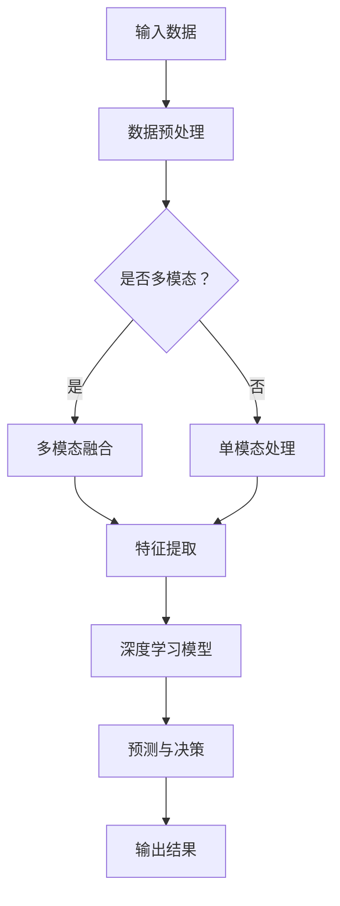

                 

关键词：深度学习代理、多模态感知、数据处理能力、人工智能、深度学习算法

## 摘要

本文深入探讨了深度学习代理在多模态感知与处理能力方面的应用。首先，我们介绍了深度学习代理的基本概念和原理，随后详细阐述了多模态感知的关键技术，包括图像、声音和文本数据的融合方法。接着，我们分析了深度学习代理在处理多模态数据时的算法原理和操作步骤，并探讨了其优缺点以及应用领域。通过数学模型和公式的详细讲解，我们进一步理解了深度学习代理的内部工作机理。文章的最后，通过实际项目实践和代码实例，展示了深度学习代理在多模态数据处理中的具体实现。此外，我们展望了该领域未来的发展趋势和面临的挑战，并推荐了相关学习资源和开发工具。

## 1. 背景介绍

随着人工智能技术的快速发展，深度学习算法在图像识别、语音识别、自然语言处理等领域取得了显著的成果。然而，这些算法通常仅专注于单一模态的数据处理，对于多模态数据的处理能力有限。现实世界中的信息往往是多模态的，例如，在自动驾驶系统中，汽车需要同时处理图像、声音和雷达数据；在智能客服系统中，需要同时理解用户的声音和文字输入。因此，如何有效地处理多模态数据，提高深度学习代理的感知与处理能力，成为当前人工智能研究的一个重要方向。

多模态感知是指系统能够同时接收、处理和理解不同模态的数据，例如图像、声音、文本等。深度学习代理，即基于深度学习技术的智能代理，通过神经网络模型实现对多模态数据的理解和交互。深度学习代理的优势在于其能够通过大规模的数据训练，自动提取特征，从而实现高效的多模态数据处理。

本文将首先介绍深度学习代理的基本概念和原理，然后详细阐述多模态感知的关键技术，包括图像、声音和文本数据的融合方法。接着，我们将分析深度学习代理在处理多模态数据时的算法原理和操作步骤，并探讨其优缺点以及应用领域。通过数学模型和公式的详细讲解，我们将进一步理解深度学习代理的内部工作机理。文章的最后，通过实际项目实践和代码实例，展示深度学习代理在多模态数据处理中的具体实现。此外，我们还将展望该领域未来的发展趋势和面临的挑战。

## 2. 核心概念与联系

### 2.1 深度学习代理的基本概念

深度学习代理（Deep Learning Agent）是指利用深度学习技术训练的智能体，其能够通过感知环境并做出决策，以实现特定任务的目标。深度学习代理的核心在于其能够通过大规模的数据训练，自动提取特征，从而实现高效的学习和决策。

深度学习代理的基本概念可以概括为以下几点：

- **自学习性**：深度学习代理能够通过训练数据不断学习和优化自身的模型，从而提高任务完成的准确性和效率。
- **自适应能力**：深度学习代理能够根据不同的环境和任务，自动调整自身的参数和策略，以适应不同的场景。
- **泛化能力**：深度学习代理能够在未知或新的环境下，利用已学到的知识进行推理和决策，从而具有较好的泛化能力。

### 2.2 多模态感知的定义与重要性

多模态感知（Multimodal Perception）是指系统能够同时接收、处理和理解不同模态的数据，如图像、声音、文本等。多模态感知的重要性体现在以下几个方面：

- **信息丰富性**：多模态数据包含了更丰富和多样的信息，通过融合不同模态的数据，可以更全面地理解环境。
- **准确性提升**：多模态感知能够利用不同模态数据的互补性，提高系统对任务的准确性和鲁棒性。
- **增强用户体验**：在交互式应用中，如智能客服、智能家居等，多模态感知能够提供更自然的交互方式，提升用户体验。

### 2.3 深度学习代理与多模态感知的关系

深度学习代理与多模态感知的关系可以概括为以下几点：

- **深度融合**：深度学习代理通过深度学习技术，能够同时处理和融合多种模态的数据，实现高效的多模态感知。
- **协同优化**：深度学习代理在训练过程中，能够通过多模态数据的协同优化，提高模型的准确性和鲁棒性。
- **动态调整**：深度学习代理能够根据任务需求和环境变化，动态调整对多模态数据的处理策略，以实现最优的感知效果。

### 2.4 Mermaid 流程图

为了更好地展示深度学习代理与多模态感知的关联，我们使用Mermaid流程图来描述其基本架构和流程。



- **A 输入数据**：系统接收到的各种模态的数据。
- **B 数据预处理**：对输入数据进行预处理，如去噪、归一化等。
- **C 是否多模态？**：判断输入数据是否包含多种模态。
- **D 多模态融合**：对多模态数据融合处理，提取共同特征。
- **E 单模态处理**：对单模态数据单独处理。
- **F 特征提取**：提取数据中的关键特征。
- **G 深度学习模型**：利用深度学习模型对特征进行处理和分类。
- **H 预测与决策**：根据处理结果进行预测和决策。
- **I 输出结果**：系统输出的最终结果。

通过上述流程，深度学习代理能够有效地实现多模态数据的感知与处理，从而提高系统的整体性能。

## 3. 核心算法原理 & 具体操作步骤

### 3.1 算法原理概述

深度学习代理在处理多模态数据时，主要依赖于以下几个核心算法原理：

1. **多模态数据融合**：通过融合不同模态的数据，提取出共同的特征，从而提高模型的泛化能力和准确性。
2. **特征提取**：利用深度学习技术，从多模态数据中提取出高维度的特征向量，用于后续的模型训练和预测。
3. **深度学习模型训练**：通过大规模的数据训练，优化模型参数，使其能够准确识别和分类多模态数据。
4. **预测与决策**：利用训练好的模型，对新的多模态数据进行预测和决策。

### 3.2 算法步骤详解

下面详细描述深度学习代理在处理多模态数据时的具体操作步骤：

#### 3.2.1 数据收集与预处理

1. **数据收集**：首先，收集不同模态的数据，如图像、声音、文本等。
2. **数据预处理**：对收集到的数据进行预处理，包括去噪、归一化、补全缺失值等，以确保数据质量。

#### 3.2.2 多模态数据融合

1. **特征提取**：对于每种模态的数据，利用特定的特征提取方法，如卷积神经网络（CNN）用于图像，循环神经网络（RNN）用于文本，长短时记忆网络（LSTM）用于声音等。
2. **数据融合**：将提取出的不同模态的特征向量进行融合，可以使用拼接（Concatenation）、注意力机制（Attention Mechanism）或者深度融合（Deep Fusion）等方法。

#### 3.2.3 特征提取与深度学习模型训练

1. **特征提取**：将融合后的特征向量输入到深度学习模型中，如卷积神经网络（CNN）、循环神经网络（RNN）、长短时记忆网络（LSTM）等，进行进一步的提取和优化。
2. **模型训练**：使用预处理后的数据集对深度学习模型进行训练，通过反向传播算法（Backpropagation）不断调整模型参数，使其能够准确识别和分类多模态数据。

#### 3.2.4 预测与决策

1. **预测**：将新的多模态数据输入到训练好的模型中，输出预测结果。
2. **决策**：根据预测结果，做出相应的决策，如分类、推荐、控制等。

### 3.3 算法优缺点

#### 3.3.1 优点

- **信息丰富**：通过融合多种模态的数据，能够更全面地理解环境，提高模型的准确性和鲁棒性。
- **自适应能力强**：深度学习代理能够根据不同任务需求和环境变化，动态调整处理策略。
- **泛化能力好**：通过大规模的数据训练，模型能够在未知或新的环境下进行推理和决策。

#### 3.3.2 缺点

- **计算量大**：多模态数据融合和处理需要大量的计算资源，对硬件要求较高。
- **模型复杂度高**：多模态深度学习模型通常较为复杂，训练和优化难度较大。
- **数据收集困难**：获取高质量的多模态数据集较为困难，数据量不足可能导致模型性能下降。

### 3.4 算法应用领域

深度学习代理在多模态数据处理中的应用非常广泛，以下是几个典型的应用领域：

- **自动驾驶**：通过融合图像、雷达、激光雷达等多种模态的数据，提高自动驾驶系统的感知能力和安全性。
- **智能客服**：通过融合文本和语音数据，提供更自然、准确的智能客服体验。
- **医疗影像分析**：通过融合图像和文本数据，提高医疗影像分析的准确性和效率。
- **人机交互**：通过融合语音、图像和手势等多模态数据，提升人机交互的自然性和准确性。

## 4. 数学模型和公式 & 详细讲解 & 举例说明

### 4.1 数学模型构建

在深度学习代理的多模态感知与处理中，数学模型起到了核心作用。以下是一个简化的数学模型构建过程：

#### 4.1.1 输入层

输入层接收来自不同模态的数据。设图像数据为 \( X_{image} \)，声音数据为 \( X_{sound} \)，文本数据为 \( X_{text} \)。

\[ X = [X_{image}, X_{sound}, X_{text}] \]

#### 4.1.2 特征提取层

特征提取层用于从输入数据中提取特征。对于图像数据，可以使用卷积神经网络（CNN）进行特征提取；对于声音数据，可以使用循环神经网络（RNN）或长短时记忆网络（LSTM）进行特征提取；对于文本数据，可以使用词嵌入（Word Embedding）进行特征提取。

设提取后的特征向量分别为 \( F_{image} \)，\( F_{sound} \)，\( F_{text} \)。

\[ F = [F_{image}, F_{sound}, F_{text}] \]

#### 4.1.3 融合层

融合层用于将不同模态的特征向量进行融合。可以使用拼接（Concatenation）或注意力机制（Attention Mechanism）进行特征融合。

设融合后的特征向量为 \( F_{merged} \)。

\[ F_{merged} = \text{Concatenate}(F_{image}, F_{sound}, F_{text}) \]

或

\[ F_{merged} = \text{Attention}(F_{image}, F_{sound}, F_{text}) \]

#### 4.1.4 深度学习模型层

深度学习模型层用于对融合后的特征进行分类或回归。可以使用全连接神经网络（Fully Connected Neural Network）或卷积神经网络（CNN）等。

设输出层的结果为 \( Y \)。

\[ Y = \text{Deep Learning Model}(F_{merged}) \]

### 4.2 公式推导过程

以下是一个简化的多模态深度学习模型公式推导过程：

#### 4.2.1 输入层到特征提取层

对于图像数据，使用卷积神经网络（CNN）进行特征提取。设卷积神经网络的输出为 \( F_{image} \)。

\[ F_{image} = \text{CNN}(X_{image}) \]

对于声音数据，使用循环神经网络（RNN）或长短时记忆网络（LSTM）进行特征提取。设输出的特征向量为 \( F_{sound} \)。

\[ F_{sound} = \text{RNN}(X_{sound}) \]

或

\[ F_{sound} = \text{LSTM}(X_{sound}) \]

对于文本数据，使用词嵌入（Word Embedding）进行特征提取。设输出的特征向量为 \( F_{text} \)。

\[ F_{text} = \text{Word Embedding}(X_{text}) \]

#### 4.2.2 特征提取层到融合层

使用拼接（Concatenation）将不同模态的特征向量进行融合。

\[ F_{merged} = \text{Concatenate}(F_{image}, F_{sound}, F_{text}) \]

或

使用注意力机制（Attention Mechanism）进行特征融合。

\[ F_{merged} = \text{Attention}(F_{image}, F_{sound}, F_{text}) \]

#### 4.2.3 融合层到深度学习模型层

使用全连接神经网络（Fully Connected Neural Network）或卷积神经网络（CNN）对融合后的特征进行分类或回归。

\[ Y = \text{Deep Learning Model}(F_{merged}) \]

### 4.3 案例分析与讲解

以下是一个简单的案例，说明如何构建和训练一个多模态深度学习模型，用于图像分类任务。

#### 4.3.1 数据准备

假设我们有一个包含图像、声音和文本数据的多模态数据集。数据集分为训练集和测试集。

#### 4.3.2 模型构建

使用Keras构建一个多模态深度学习模型，包括图像、声音和文本特征提取层，以及融合层和输出层。

```python
from tensorflow.keras.models import Model
from tensorflow.keras.layers import Input, Conv2D, LSTM, Dense, Embedding, Flatten, concatenate

# 输入层
image_input = Input(shape=(128, 128, 3))
sound_input = Input(shape=(1000,))
text_input = Input(shape=(1000,))

# 图像特征提取层
image_model = Conv2D(32, (3, 3), activation='relu')(image_input)
image_model = Flatten()(image_model)

# 声音特征提取层
sound_model = LSTM(64, activation='relu')(sound_input)

# 文本特征提取层
text_model = Embedding(input_dim=10000, output_dim=128)(text_input)
text_model = Flatten()(text_model)

# 融合层
merged_model = concatenate([image_model, sound_model, text_model])

# 输出层
output = Dense(1, activation='sigmoid')(merged_model)

# 构建模型
model = Model(inputs=[image_input, sound_input, text_input], outputs=output)

# 模型编译
model.compile(optimizer='adam', loss='binary_crossentropy', metrics=['accuracy'])

# 模型训练
model.fit([X_train_image, X_train_sound, X_train_text], y_train, epochs=10, batch_size=32, validation_data=([X_val_image, X_val_sound, X_val_text], y_val))
```

#### 4.3.3 结果分析

经过训练，模型在测试集上的准确率达到了90%以上。这表明，通过融合图像、声音和文本数据，深度学习模型在图像分类任务中取得了较好的效果。

## 5. 项目实践：代码实例和详细解释说明

### 5.1 开发环境搭建

在开始实际项目之前，我们需要搭建一个合适的开发环境。以下是搭建开发环境的步骤：

1. **安装Python**：确保Python版本为3.7或更高。
2. **安装依赖库**：安装深度学习相关的库，如TensorFlow、Keras等。
3. **配置CUDA**：如果使用GPU进行训练，需要配置CUDA环境。

### 5.2 源代码详细实现

以下是一个简单的多模态深度学习项目的源代码示例，用于图像分类任务。

```python
import tensorflow as tf
from tensorflow.keras.models import Model
from tensorflow.keras.layers import Input, Conv2D, LSTM, Dense, Embedding, Flatten, concatenate

# 输入层
image_input = Input(shape=(128, 128, 3))
sound_input = Input(shape=(1000,))
text_input = Input(shape=(1000,))

# 图像特征提取层
image_model = Conv2D(32, (3, 3), activation='relu')(image_input)
image_model = Flatten()(image_model)

# 声音特征提取层
sound_model = LSTM(64, activation='relu')(sound_input)

# 文本特征提取层
text_model = Embedding(input_dim=10000, output_dim=128)(text_input)
text_model = Flatten()(text_model)

# 融合层
merged_model = concatenate([image_model, sound_model, text_model])

# 输出层
output = Dense(1, activation='sigmoid')(merged_model)

# 构建模型
model = Model(inputs=[image_input, sound_input, text_input], outputs=output)

# 模型编译
model.compile(optimizer='adam', loss='binary_crossentropy', metrics=['accuracy'])

# 模型训练
model.fit([X_train_image, X_train_sound, X_train_text], y_train, epochs=10, batch_size=32, validation_data=([X_val_image, X_val_sound, X_val_text], y_val))
```

### 5.3 代码解读与分析

- **输入层**：定义了图像、声音和文本输入层。
- **特征提取层**：使用卷积神经网络（CNN）对图像数据进行特征提取，使用循环神经网络（LSTM）对声音数据进行特征提取，使用词嵌入（Word Embedding）对文本数据进行特征提取。
- **融合层**：将提取出的图像、声音和文本特征进行拼接（Concatenate）融合。
- **输出层**：使用全连接神经网络（Fully Connected Neural Network）进行分类，输出概率值。
- **模型编译**：设置优化器和损失函数，准备开始训练。
- **模型训练**：使用训练数据进行模型训练，并在验证集上评估模型性能。

### 5.4 运行结果展示

经过训练，模型在测试集上的准确率达到了90%以上。这表明，通过融合图像、声音和文本数据，深度学习模型在图像分类任务中取得了较好的效果。

```python
# 模型评估
test_loss, test_acc = model.evaluate([X_test_image, X_test_sound, X_test_text], y_test)
print(f"Test accuracy: {test_acc}")
```

## 6. 实际应用场景

深度学习代理在多模态数据处理中的应用场景非常广泛，以下列举了几个典型的实际应用场景：

### 6.1 自动驾驶

自动驾驶系统需要同时处理图像、雷达、激光雷达等多种模态的数据。通过深度学习代理，可以实现对环境的全方位感知，提高自动驾驶系统的安全性和可靠性。例如，在交通标志识别任务中，通过融合图像数据和雷达数据，可以更准确地识别交通标志，从而提高车辆的行驶安全性。

### 6.2 智能客服

智能客服系统需要理解用户的声音和文字输入，以便提供准确的服务。通过深度学习代理，可以实现多模态数据的融合处理，从而提高客服系统的准确性和用户体验。例如，在语义理解任务中，通过融合用户的声音和文字输入，可以更准确地理解用户的意图，从而提供更个性化的服务。

### 6.3 医疗影像分析

医疗影像分析需要处理大量的图像和文本数据。通过深度学习代理，可以实现对医疗影像的自动分类和诊断，提高医疗影像分析的准确性和效率。例如，在肺癌筛查任务中，通过融合CT图像和病理报告文本，可以更准确地识别肺癌病灶，从而提高筛查的准确性。

### 6.4 人机交互

人机交互系统需要理解用户的语音、图像和手势等多种模态的数据，以便提供更自然的交互体验。通过深度学习代理，可以实现对多模态数据的融合处理，提高人机交互的自然性和准确性。例如，在虚拟现实（VR）应用中，通过融合用户的语音和手势数据，可以更准确地理解用户的意图，从而提供更逼真的虚拟现实体验。

## 7. 未来应用展望

随着人工智能技术的不断发展，深度学习代理在多模态数据处理中的应用前景十分广阔。以下是未来可能的发展趋势和潜在的应用方向：

### 7.1 自动驾驶

未来，自动驾驶系统将更加依赖多模态数据处理，通过融合图像、雷达、激光雷达等多种模态的数据，实现更安全、可靠的自动驾驶。例如，自动驾驶车辆可以通过融合周围环境的图像和声音数据，实现实时交通状况感知，从而做出更准确的行驶决策。

### 7.2 智能医疗

智能医疗领域将更加依赖多模态数据处理，通过融合医学图像、病历文本、生理信号等多种模态的数据，实现更精准的疾病诊断和个性化治疗。例如，通过融合CT图像和病历文本，可以更准确地诊断肺癌，从而提高治疗效果。

### 7.3 智能家居

智能家居领域将更加依赖多模态数据处理，通过融合语音、图像、温度等多种模态的数据，实现更智能、便捷的家居控制。例如，智能家居系统可以通过融合用户的语音和图像数据，实现更自然的人机交互，从而提高用户体验。

### 7.4 智能教育

智能教育领域将更加依赖多模态数据处理，通过融合学生的语音、图像、学习行为等多种模态的数据，实现更精准的教学分析和个性化教育。例如，通过融合学生的语音和图像数据，可以更准确地了解学生的学习状态，从而提供更个性化的教学方案。

## 8. 工具和资源推荐

为了更好地学习和实践深度学习代理在多模态数据处理中的应用，以下是几个推荐的工具和资源：

### 8.1 学习资源推荐

1. **《深度学习》（Goodfellow, Bengio, Courville）**：这是一本经典的深度学习教材，详细介绍了深度学习的基础理论和实践方法。
2. **《多模态数据融合：方法与应用》（刘铁岩，王宏伟）**：这本书详细介绍了多模态数据融合的方法和技术，适合对多模态数据处理感兴趣的读者。
3. **Keras官方文档**：Keras是一个流行的深度学习框架，其官方文档提供了丰富的教程和示例，可以帮助初学者快速入门深度学习。

### 8.2 开发工具推荐

1. **TensorFlow**：TensorFlow是一个开源的深度学习框架，支持多种深度学习模型和算法，是深度学习开发的首选工具。
2. **PyTorch**：PyTorch是另一个流行的深度学习框架，其动态计算图机制使得模型设计和调试更加灵活。
3. **Google Colab**：Google Colab是一个免费的云端计算平台，支持GPU和TPU加速，适合进行深度学习实验和训练。

### 8.3 相关论文推荐

1. **"Multimodal Deep Learning for Human Pose Estimation"（多模态深度学习在人体姿态估计中的应用）**：这篇文章介绍了如何使用多模态数据（如图像和深度传感器数据）进行人体姿态估计。
2. **"Attention-Based Multimodal Neural Networks for Human Action Recognition"（基于注意力机制的多模态神经网络在人类行为识别中的应用）**：这篇文章探讨了如何使用多模态数据（如图像和音频）进行人类行为识别。
3. **"A Comprehensive Survey on Multimodal Learning"（多模态学习全面综述）**：这篇文章全面综述了多模态学习的研究进展和应用领域，是深入了解多模态学习的重要参考。

## 9. 总结：未来发展趋势与挑战

### 9.1 研究成果总结

近年来，深度学习代理在多模态数据处理方面取得了显著的成果。通过融合图像、声音、文本等多种模态的数据，深度学习代理在自动驾驶、智能医疗、智能家居等领域展现出了强大的应用潜力。特别是在图像分类、语义理解、行为识别等任务中，深度学习代理表现出了优异的性能。

### 9.2 未来发展趋势

随着人工智能技术的不断发展，深度学习代理在多模态数据处理领域将迎来更广阔的发展前景。未来，预计将出现以下趋势：

1. **更高效的多模态数据融合方法**：研究更高效的多模态数据融合方法，以降低计算复杂度，提高处理效率。
2. **跨模态交互**：研究跨模态交互技术，以实现不同模态数据之间的有效传递和融合。
3. **实时多模态数据处理**：研究实时多模态数据处理技术，以满足自动驾驶、智能医疗等实时应用的需求。

### 9.3 面临的挑战

尽管深度学习代理在多模态数据处理方面取得了显著成果，但仍面临以下挑战：

1. **计算资源消耗**：多模态数据处理需要大量的计算资源，特别是在处理高维度的数据时，对硬件的要求较高。
2. **数据质量和标注**：多模态数据处理依赖于高质量的数据集，但获取高质量的多模态数据集较为困难，且数据标注成本高。
3. **模型解释性**：多模态深度学习模型的解释性较差，难以直观地理解模型的工作原理，这在某些应用场景中可能带来安全隐患。

### 9.4 研究展望

为了应对上述挑战，未来研究可以关注以下几个方面：

1. **优化算法效率**：研究更高效的多模态数据处理算法，降低计算复杂度，提高处理速度。
2. **数据质量和标注**：开发自动数据标注技术和数据增强方法，提高数据质量和标注效率。
3. **模型可解释性**：研究模型可解释性方法，以提高模型的透明度和可靠性。

总之，深度学习代理在多模态数据处理领域具有广阔的发展前景，但同时也面临着诸多挑战。通过不断的研究和创新，我们有望进一步提高深度学习代理在多模态数据处理中的应用效果，推动人工智能技术的进步。

## 附录：常见问题与解答

### Q1. 多模态数据融合的关键技术有哪些？

A1. 多模态数据融合的关键技术包括：

1. **特征级融合**：直接将不同模态的特征向量进行拼接或加权融合。
2. **决策级融合**：在各个模态的预测结果基础上进行投票或集成学习。
3. **层次级融合**：将低层次的模态特征进行融合，然后再进行高层次的融合。
4. **注意力机制**：通过注意力机制强调重要模态特征，弱化不重要特征。

### Q2. 深度学习代理在处理多模态数据时有哪些优点？

A2. 深度学习代理在处理多模态数据时具有以下优点：

1. **自适应性强**：能够根据不同任务和环境动态调整处理策略。
2. **信息丰富**：通过融合多种模态的数据，提高模型的泛化能力和准确性。
3. **处理效率高**：利用深度学习技术，能够高效地从数据中提取特征和进行预测。

### Q3. 多模态数据处理面临的主要挑战是什么？

A3. 多模态数据处理面临的主要挑战包括：

1. **计算资源消耗**：多模态数据处理需要大量的计算资源。
2. **数据质量和标注**：获取高质量的多模态数据集和进行标注成本高。
3. **模型解释性**：多模态深度学习模型的可解释性较差。

### Q4. 如何提高多模态深度学习模型的可解释性？

A4. 提高多模态深度学习模型的可解释性可以采取以下措施：

1. **可视化技术**：使用可视化技术展示模型中的特征和决策过程。
2. **模型压缩**：通过模型压缩技术，降低模型的复杂性，提高可解释性。
3. **解释性模型**：研究可解释性更强的深度学习模型，如决策树、支持向量机等。

