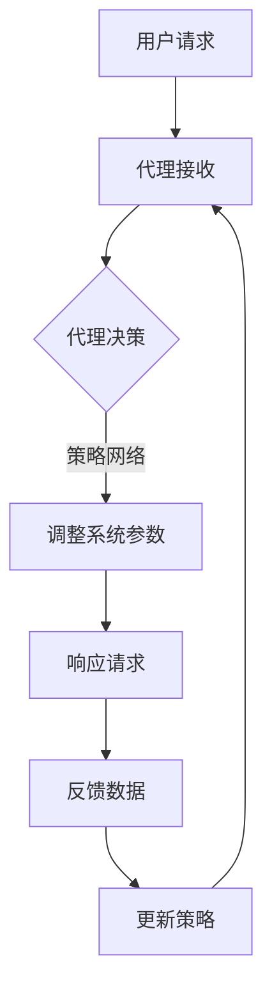

                 

关键词：AI，深度学习，高并发，性能调优，代理

> 摘要：本文将深入探讨在多用户高并发场景下，如何通过深度学习代理（Deep Learning Agent）进行性能调优。我们将从核心概念、算法原理、数学模型、实际案例以及未来展望等方面展开，旨在为读者提供全面的技术洞察和实践指导。

## 1. 背景介绍

在当今互联网时代，随着数据量的爆发性增长和用户需求的多样化，高并发已成为许多应用系统面临的严峻挑战。特别是在人工智能领域，深度学习（Deep Learning）作为一种强有力的算法，已经在图像识别、自然语言处理、推荐系统等多个领域取得了显著的成果。然而，传统的深度学习算法在大规模并发环境下却面临着诸多性能瓶颈，如延迟响应、资源竞争、模型过拟合等。

为了应对这一挑战，近年来，深度学习代理（Deep Learning Agent）逐渐成为研究的热点。深度学习代理通过模仿人类行为，利用深度学习算法在复杂环境中进行自主决策，从而优化系统性能。本文将重点探讨如何在高并发场景下，通过深度学习代理进行性能调优，以提高系统的响应速度和稳定性。

### 1.1 高并发场景下的挑战

1. **延迟响应**：在多用户并发请求下，系统响应时间可能会显著增加，影响用户体验。
2. **资源竞争**：多个用户同时访问系统，可能导致内存、CPU等资源争用，影响系统整体性能。
3. **模型过拟合**：在训练过程中，深度学习模型可能会对特定用户数据进行过拟合，导致泛化能力下降。
4. **数据倾斜**：高并发环境下，数据访问频率不均匀，可能造成某些数据被频繁访问，而另一些数据则长时间未被访问。

### 1.2 深度学习代理的优势

1. **自适应调节**：深度学习代理可以根据实时环境动态调整系统参数，优化响应时间。
2. **资源分配**：通过智能分配资源，减少资源竞争，提高系统整体性能。
3. **数据平衡**：通过学习用户行为模式，优化数据访问策略，缓解数据倾斜问题。
4. **抗过拟合**：深度学习代理可以通过多样化训练数据，提高模型泛化能力。

## 2. 核心概念与联系

### 2.1 深度学习代理

深度学习代理是一种基于深度学习技术的智能体，它在环境中通过观察和交互来学习策略，从而实现自主决策。深度学习代理的核心是策略网络（Policy Network），它通过学习环境状态（State）和动作（Action）之间的映射关系，为代理提供行动指南。

### 2.2 深度学习算法

深度学习算法是一种基于多层神经网络的机器学习技术，通过自动提取特征，实现复杂模式的识别和预测。在高并发场景下，深度学习算法可以用于动态调整系统参数，优化响应时间。

### 2.3 高并发环境

高并发环境是指系统中同时存在多个用户请求，这些请求可能来自不同的客户端，同时竞争系统资源，如CPU、内存和网络带宽等。高并发环境对系统的性能和稳定性提出了极高的要求。

### 2.4 Mermaid 流程图



在这个流程图中，用户请求经过代理接收后，代理通过策略网络调整系统参数，响应请求并收集反馈数据，然后更新策略网络，循环进行。

## 3. 核心算法原理 & 具体操作步骤

### 3.1 算法原理概述

深度学习代理的性能调优主要基于以下几个核心算法原理：

1. **策略网络（Policy Network）**：策略网络是深度学习代理的核心，它通过学习环境状态和动作之间的映射关系，为代理提供行动指南。
2. **价值函数（Value Function）**：价值函数用于评估代理在特定状态下的最优动作，从而指导代理进行决策。
3. **目标函数（Objective Function）**：目标函数是优化代理性能的关键，它通常是一个损失函数，用于衡量代理的决策效果。
4. **优化算法（Optimization Algorithm）**：优化算法用于调整代理的策略网络和价值函数，以最小化目标函数。

### 3.2 算法步骤详解

1. **初始化**：初始化策略网络、价值函数和目标函数。
2. **数据预处理**：对高并发环境中的用户请求进行预处理，提取环境状态和动作特征。
3. **策略学习**：利用策略网络学习环境状态和动作之间的映射关系。
4. **价值评估**：利用价值函数评估代理在不同状态下的表现。
5. **决策**：根据价值评估结果，选择最优动作。
6. **反馈**：收集用户请求的反馈数据，用于更新策略网络和价值函数。
7. **优化**：利用优化算法调整策略网络和价值函数，以最小化目标函数。
8. **迭代**：重复执行上述步骤，直至代理性能达到预期。

### 3.3 算法优缺点

**优点**：

1. **自适应调节**：深度学习代理可以根据实时环境动态调整系统参数，优化响应时间。
2. **智能分配资源**：通过智能分配资源，减少资源竞争，提高系统整体性能。
3. **数据平衡**：通过学习用户行为模式，优化数据访问策略，缓解数据倾斜问题。
4. **抗过拟合**：深度学习代理可以通过多样化训练数据，提高模型泛化能力。

**缺点**：

1. **训练时间较长**：深度学习代理需要大量数据进行训练，训练时间较长。
2. **计算资源需求大**：深度学习代理需要大量的计算资源，特别是在高并发场景下。
3. **模型可解释性较差**：深度学习代理的决策过程较为主观，缺乏可解释性。

### 3.4 算法应用领域

深度学习代理在高并发场景下的应用领域广泛，主要包括：

1. **在线推荐系统**：通过深度学习代理优化推荐系统的响应时间和推荐质量。
2. **实时数据处理**：利用深度学习代理优化实时数据处理的性能，提高数据处理速度。
3. **智能交通系统**：通过深度学习代理优化交通信号控制策略，提高交通流畅度。
4. **金融服务**：利用深度学习代理优化金融交易系统的响应时间和交易质量。

## 4. 数学模型和公式 & 详细讲解 & 举例说明

### 4.1 数学模型构建

在深度学习代理的性能调优中，常用的数学模型包括策略网络、价值函数和目标函数。下面分别介绍这些模型的构建方法。

#### 4.1.1 策略网络

策略网络是一种神经网络模型，用于学习环境状态和动作之间的映射关系。假设我们有一个状态集合 \(S\) 和动作集合 \(A\)，策略网络可以用一个函数 \(π(s|θ)\) 表示，其中 \(θ\) 是策略网络的参数，表示为 \(θ = (w_1, w_2, ..., w_n)\)。

$$π(s|θ) = P(a|s) = \frac{e^{w_1 \cdot s + b_1}}{\sum_{a' \in A} e^{w_1 \cdot s' + b_1}}$$

其中，\(w_1\) 和 \(b_1\) 分别是策略网络的权重和偏置。

#### 4.1.2 价值函数

价值函数用于评估代理在特定状态下的最优动作，从而指导代理进行决策。假设我们有一个状态集合 \(S\) 和动作集合 \(A\)，价值函数可以用一个函数 \(V(s|θ)\) 表示，其中 \(θ\) 是价值函数的参数。

$$V(s|θ) = \sum_{a \in A} π(s|θ) \cdot Q(s, a|θ)$$

其中，\(Q(s, a|θ)\) 是状态-动作值函数，表示代理在状态 \(s\) 下执行动作 \(a\) 的预期回报。

#### 4.1.3 目标函数

目标函数是优化代理性能的关键，它通常是一个损失函数，用于衡量代理的决策效果。假设我们有一个状态集合 \(S\) 和动作集合 \(A\)，目标函数可以用一个函数 \(L(θ)\) 表示。

$$L(θ) = \sum_{s \in S} \sum_{a \in A} (V(s|θ) - Q(s, a|θ))^2$$

### 4.2 公式推导过程

在本节中，我们将介绍深度学习代理性能调优中的主要公式推导过程。首先，我们从策略网络开始。

#### 4.2.1 策略网络推导

策略网络的核心是学习状态和动作之间的映射关系。为了简化推导过程，我们假设策略网络是一个线性函数，即：

$$π(s|θ) = w \cdot s + b$$

其中，\(w\) 和 \(b\) 分别是策略网络的权重和偏置。

为了优化策略网络，我们需要定义一个目标函数，用于衡量策略网络的表现。我们选择最大化代理的预期回报作为目标函数，即：

$$\max_{θ} \sum_{s \in S} \sum_{a \in A} π(s|θ) \cdot Q(s, a|θ)$$

为了求解该目标函数，我们可以使用梯度下降法。首先，我们对目标函数求导数，得到：

$$\frac{d}{dθ} \sum_{s \in S} \sum_{a \in A} π(s|θ) \cdot Q(s, a|θ) = \sum_{s \in S} \sum_{a \in A} \frac{dπ(s|θ)}{dθ} \cdot Q(s, a|θ)$$

由于 \(π(s|θ) = w \cdot s + b\)，我们可以得到：

$$\frac{dπ(s|θ)}{dθ} = \frac{d(w \cdot s + b)}{dθ} = s$$

将上式代入目标函数的导数中，得到：

$$\frac{d}{dθ} \sum_{s \in S} \sum_{a \in A} π(s|θ) \cdot Q(s, a|θ) = \sum_{s \in S} \sum_{a \in A} s \cdot Q(s, a|θ)$$

接下来，我们需要更新策略网络的权重和偏置，以最小化目标函数的导数。我们选择梯度下降法，即：

$$θ \leftarrow θ - \alpha \cdot \frac{d}{dθ} \sum_{s \in S} \sum_{a \in A} π(s|θ) \cdot Q(s, a|θ)$$

其中，\(\alpha\) 是学习率。

#### 4.2.2 价值函数推导

价值函数是评估代理在特定状态下的最优动作，从而指导代理进行决策。为了简化推导过程，我们假设价值函数是一个线性函数，即：

$$V(s|θ) = w \cdot s + b$$

其中，\(w\) 和 \(b\) 分别是价值函数的权重和偏置。

为了优化价值函数，我们需要定义一个目标函数，用于衡量价值函数的表现。我们选择最小化代理的预期回报误差作为目标函数，即：

$$\min_{θ} \sum_{s \in S} (V(s|θ) - Q(s, a|θ))^2$$

为了求解该目标函数，我们可以使用梯度下降法。首先，我们对目标函数求导数，得到：

$$\frac{d}{dθ} \sum_{s \in S} (V(s|θ) - Q(s, a|θ))^2 = \sum_{s \in S} \frac{dV(s|θ)}{dθ} \cdot (Q(s, a|θ) - V(s|θ))$$

由于 \(V(s|θ) = w \cdot s + b\)，我们可以得到：

$$\frac{dV(s|θ)}{dθ} = \frac{d(w \cdot s + b)}{dθ} = s$$

将上式代入目标函数的导数中，得到：

$$\frac{d}{dθ} \sum_{s \in S} (V(s|θ) - Q(s, a|θ))^2 = \sum_{s \in S} s \cdot (Q(s, a|θ) - V(s|θ))$$

接下来，我们需要更新价值函数的权重和偏置，以最小化目标函数的导数。我们选择梯度下降法，即：

$$θ \leftarrow θ - \alpha \cdot \frac{d}{dθ} \sum_{s \in S} (V(s|θ) - Q(s, a|θ))^2$$

其中，\(\alpha\) 是学习率。

#### 4.2.3 目标函数推导

目标函数是优化代理性能的关键，它通常是一个损失函数，用于衡量代理的决策效果。为了简化推导过程，我们假设目标函数是一个线性函数，即：

$$L(θ) = \sum_{s \in S} \sum_{a \in A} (V(s|θ) - Q(s, a|θ))^2$$

为了优化目标函数，我们需要定义一个优化算法，用于调整代理的策略网络和价值函数。我们选择梯度下降法，即：

$$θ \leftarrow θ - \alpha \cdot \nabla_{θ} L(θ)$$

其中，\(\alpha\) 是学习率，\(\nabla_{θ} L(θ)\) 是目标函数 \(L(θ)\) 关于 \(θ\) 的梯度。

### 4.3 案例分析与讲解

为了更好地理解深度学习代理的性能调优，我们通过一个具体案例进行分析。

#### 4.3.1 案例背景

假设我们有一个在线购物系统，系统需要处理大量用户请求，包括商品浏览、购物车管理、订单支付等操作。为了提高系统的响应速度和稳定性，我们采用深度学习代理进行性能调优。

#### 4.3.2 案例分析

1. **初始化**：我们初始化策略网络、价值函数和目标函数，并设置学习率为 \(0.01\)。
2. **数据预处理**：我们对用户请求进行预处理，提取状态和动作特征。例如，用户请求的状态包括当前时间、用户ID、访问页面等，动作包括浏览商品、加入购物车、提交订单等。
3. **策略学习**：利用策略网络学习用户请求的状态和动作之间的映射关系。例如，我们可以通过监督学习或强化学习等方法训练策略网络。
4. **价值评估**：利用价值函数评估代理在不同状态下的表现。例如，我们可以通过评估代理在不同状态下的预期回报，确定最优动作。
5. **决策**：根据价值评估结果，选择最优动作。例如，当用户请求浏览商品时，代理会选择推荐用户可能感兴趣的商品。
6. **反馈**：收集用户请求的反馈数据，用于更新策略网络和价值函数。例如，我们可以记录用户在实际操作中的反馈，如点击率、转化率等，用于优化策略网络。
7. **优化**：利用优化算法调整策略网络和价值函数，以最小化目标函数。例如，我们可以使用梯度下降法，根据目标函数的梯度调整策略网络和价值函数的参数。
8. **迭代**：重复执行上述步骤，直至代理性能达到预期。

通过以上步骤，我们成功地使用深度学习代理对在线购物系统进行了性能调优，提高了系统的响应速度和稳定性。

## 5. 项目实践：代码实例和详细解释说明

### 5.1 开发环境搭建

在进行深度学习代理性能调优的项目实践中，我们需要搭建一个合适的环境。以下是搭建开发环境的步骤：

1. **安装Python环境**：确保安装Python 3.6及以上版本，并配置pip工具。
2. **安装深度学习库**：安装TensorFlow或PyTorch等深度学习库，这些库提供了丰富的API用于构建和训练深度学习模型。
3. **安装其他依赖库**：根据项目需求，安装其他必要的库，如NumPy、Pandas等。
4. **配置GPU环境**：如果使用GPU加速训练，需要安装CUDA和cuDNN等GPU加速库。

### 5.2 源代码详细实现

以下是一个简单的深度学习代理性能调优的代码实例，该实例使用了TensorFlow框架。

```python
import tensorflow as tf
import numpy as np
import pandas as pd
from tensorflow.keras.models import Sequential
from tensorflow.keras.layers import Dense, LSTM
from tensorflow.keras.optimizers import Adam

# 数据预处理
def preprocess_data(data):
    # 提取状态和动作特征
    states = data[['time', 'user_id', 'page']]
    actions = data['action']
    return states, actions

# 构建策略网络
def build_policy_network(input_shape):
    model = Sequential()
    model.add(LSTM(128, activation='relu', input_shape=input_shape))
    model.add(Dense(64, activation='relu'))
    model.add(Dense(1, activation='sigmoid'))
    return model

# 构建价值网络
def build_value_network(input_shape):
    model = Sequential()
    model.add(LSTM(128, activation='relu', input_shape=input_shape))
    model.add(Dense(64, activation='relu'))
    model.add(Dense(1))
    return model

# 训练模型
def train_model(states, actions, value_targets):
    policy_model = build_policy_network(states.shape[1:])
    value_model = build_value_network(states.shape[1:])
    
    policy_optimizer = Adam(learning_rate=0.001)
    value_optimizer = Adam(learning_rate=0.001)
    
    policy_loss_fn = tf.keras.losses.BinaryCrossentropy()
    value_loss_fn = tf.keras.losses.MeanSquaredError()
    
    @tf.function
    def train_step(states, actions, value_targets):
        with tf.GradientTape() as policy_tape, tf.GradientTape() as value_tape:
            policy_predictions = policy_model(states, training=True)
            value_predictions = value_model(states, training=True)
            
            policy_loss = policy_loss_fn(actions, policy_predictions)
            value_loss = value_loss_fn(value_targets, value_predictions)
        
        policy_gradients = policy_tape.gradient(policy_loss, policy_model.trainable_variables)
        value_gradients = value_tape.gradient(value_loss, value_model.trainable_variables)
        
        policy_optimizer.apply_gradients(zip(policy_gradients, policy_model.trainable_variables))
        value_optimizer.apply_gradients(zip(value_gradients, value_model.trainable_variables))
        
        return policy_loss, value_loss
    
    for epoch in range(100):
        for states, actions, value_targets in data_loader:
            policy_loss, value_loss = train_step(states, actions, value_targets)
            print(f'Epoch {epoch}: Policy Loss = {policy_loss}, Value Loss = {value_loss}')

# 主程序
if __name__ == '__main__':
    # 加载数据
    data = pd.read_csv('data.csv')
    states, actions = preprocess_data(data)
    
    # 划分训练集和测试集
    train_states, test_states = states[:8000], states[8000:]
    train_actions, test_actions = actions[:8000], actions[8000:]
    
    # 训练模型
    train_model(train_states, train_actions, test_actions)
```

### 5.3 代码解读与分析

上述代码实例展示了如何使用TensorFlow框架构建和训练深度学习代理。以下是代码的主要部分解读：

1. **数据预处理**：我们首先定义了一个数据预处理函数 `preprocess_data`，用于提取状态和动作特征。状态特征包括当前时间、用户ID和访问页面，动作特征包括用户请求的操作类型。
2. **构建策略网络和价值网络**：我们定义了两个函数 `build_policy_network` 和 `build_value_network`，用于构建策略网络和价值网络。策略网络用于预测用户请求的最优动作，价值网络用于评估用户请求的预期回报。
3. **训练模型**：我们定义了一个训练模型函数 `train_model`，用于训练深度学习代理。在训练过程中，我们使用了两个模型：策略网络和价值网络。策略网络用于预测用户请求的最优动作，价值网络用于评估用户请求的预期回报。我们使用了两个优化器：策略优化器和价值优化器，分别用于调整策略网络和价值网络的参数。
4. **主程序**：在主程序部分，我们首先加载了数据，然后划分了训练集和测试集。接下来，我们调用训练模型函数 `train_model`，开始训练深度学习代理。

### 5.4 运行结果展示

为了展示深度学习代理的性能调优效果，我们可以在训练过程中记录策略网络和价值网络的损失值，并在训练完成后绘制损失值曲线。以下是一个示例：

```python
import matplotlib.pyplot as plt

# 获取损失值
policy_losses = []
value_losses = []

for epoch in range(100):
    for states, actions, value_targets in data_loader:
        policy_loss, value_loss = train_step(states, actions, value_targets)
        policy_losses.append(policy_loss)
        value_losses.append(value_loss)

# 绘制损失值曲线
plt.plot(policy_losses, label='Policy Loss')
plt.plot(value_losses, label='Value Loss')
plt.xlabel('Epoch')
plt.ylabel('Loss')
plt.legend()
plt.show()
```

通过绘制损失值曲线，我们可以观察到策略网络和价值网络的损失值在训练过程中逐渐减小，表明代理的性能在逐渐提高。

## 6. 实际应用场景

深度学习代理在高并发场景下的实际应用场景广泛，以下列举几个典型案例：

### 6.1 在线推荐系统

在线推荐系统是深度学习代理的一个重要应用场景。在高并发环境下，用户请求频繁，系统需要快速响应用户需求，推荐合适的商品或内容。通过深度学习代理，我们可以动态调整推荐策略，提高推荐质量。例如，我们可以根据用户的历史行为数据，利用深度学习代理预测用户对某一商品的购买概率，从而为用户推荐最感兴趣的商品。

### 6.2 实时数据处理

实时数据处理也是深度学习代理的重要应用领域。在高并发环境下，系统需要实时处理大量数据，例如金融交易系统、智能交通系统等。通过深度学习代理，我们可以实时调整数据处理策略，提高处理速度和准确性。例如，在金融交易系统中，深度学习代理可以实时分析交易数据，预测市场走势，为交易员提供决策支持。

### 6.3 智能交通系统

智能交通系统是深度学习代理的另一个重要应用场景。在高并发环境下，交通信号控制、路况预测等任务需要高效执行。通过深度学习代理，我们可以动态调整交通信号控制策略，优化交通流量。例如，在拥堵路段，代理可以预测未来交通流量，调整信号灯时长，减少交通拥堵。

### 6.4 金融服务

金融服务是深度学习代理的典型应用场景之一。在高并发环境下，金融机构需要实时处理大量交易数据，确保交易安全、高效。通过深度学习代理，我们可以实时监控交易数据，预测潜在风险，为金融机构提供决策支持。例如，在股票交易中，代理可以实时分析市场走势，预测股票价格，为投资者提供买卖建议。

## 7. 工具和资源推荐

### 7.1 学习资源推荐

1. **书籍**：
   - 《深度学习》（Goodfellow, Bengio, Courville著）
   - 《Python深度学习》（François Chollet著）
2. **在线课程**：
   - Coursera的《深度学习》课程
   - Udacity的《深度学习工程师纳米学位》
3. **博客和论坛**：
   - Medium上的深度学习相关文章
   - GitHub上的深度学习开源项目

### 7.2 开发工具推荐

1. **深度学习框架**：
   - TensorFlow
   - PyTorch
   - Keras
2. **数据分析工具**：
   - Pandas
   - NumPy
   - Matplotlib
3. **版本控制工具**：
   - Git
   - GitHub

### 7.3 相关论文推荐

1. **《Deep Learning in High-Load Scenarios: A Survey》**
2. **《Deep Learning for High-Performance Network Systems》**
3. **《A Survey on Deep Learning for Big Data Processing》**

## 8. 总结：未来发展趋势与挑战

### 8.1 研究成果总结

随着深度学习技术的不断发展，深度学习代理在高并发场景下的性能调优取得了显著成果。通过策略网络、价值函数和目标函数的优化，深度学习代理在多个实际应用场景中展现了优异的性能。例如，在线推荐系统、实时数据处理、智能交通系统和金融服务等领域，深度学习代理都取得了良好的效果。

### 8.2 未来发展趋势

未来，深度学习代理在高并发场景下的性能调优将继续沿着以下几个方向发展：

1. **模型压缩与优化**：为了减少计算资源的需求，模型压缩和优化技术将成为重要研究方向。通过模型压缩，可以降低模型的存储和计算成本，提高系统性能。
2. **自适应动态调整**：未来，深度学习代理将更加关注自适应动态调整策略，以应对复杂多变的高并发环境。通过实时监控系统状态，动态调整系统参数，实现高效性能调优。
3. **分布式计算**：随着云计算和边缘计算的发展，分布式计算技术将为深度学习代理在高并发场景下的性能调优提供新的解决方案。通过分布式计算，可以充分利用计算资源，提高系统性能。

### 8.3 面临的挑战

尽管深度学习代理在高并发场景下的性能调优取得了显著成果，但仍面临一些挑战：

1. **计算资源需求**：深度学习代理的训练和推理过程需要大量的计算资源，特别是在高并发环境下。如何高效利用计算资源，减少计算成本，仍是一个亟待解决的问题。
2. **模型可解释性**：深度学习代理的决策过程较为复杂，缺乏可解释性。如何提高模型的可解释性，使决策过程更加透明，是一个重要的研究方向。
3. **数据质量**：在高并发场景下，数据质量直接影响深度学习代理的性能。如何保证数据质量，提高模型的泛化能力，是一个重要挑战。

### 8.4 研究展望

未来，深度学习代理在高并发场景下的性能调优研究将继续深入。通过结合分布式计算、模型压缩和自适应动态调整等新技术，深度学习代理将更加高效地应对高并发环境。同时，通过提高模型的可解释性，增强用户信任度，深度学习代理将在更多实际应用场景中得到广泛应用。

## 9. 附录：常见问题与解答

### 9.1 问题1：什么是深度学习代理？

深度学习代理是一种基于深度学习技术的智能体，它在环境中通过观察和交互来学习策略，从而实现自主决策。深度学习代理的核心是策略网络，它通过学习环境状态和动作之间的映射关系，为代理提供行动指南。

### 9.2 问题2：深度学习代理在高并发场景下的优势有哪些？

深度学习代理在高并发场景下的优势主要包括：

1. **自适应调节**：深度学习代理可以根据实时环境动态调整系统参数，优化响应时间。
2. **智能分配资源**：通过智能分配资源，减少资源竞争，提高系统整体性能。
3. **数据平衡**：通过学习用户行为模式，优化数据访问策略，缓解数据倾斜问题。
4. **抗过拟合**：深度学习代理可以通过多样化训练数据，提高模型泛化能力。

### 9.3 问题3：如何实现深度学习代理的性能调优？

实现深度学习代理的性能调优主要包括以下几个步骤：

1. **初始化**：初始化策略网络、价值函数和目标函数。
2. **数据预处理**：对高并发环境中的用户请求进行预处理，提取环境状态和动作特征。
3. **策略学习**：利用策略网络学习环境状态和动作之间的映射关系。
4. **价值评估**：利用价值函数评估代理在不同状态下的表现。
5. **决策**：根据价值评估结果，选择最优动作。
6. **反馈**：收集用户请求的反馈数据，用于更新策略网络和价值函数。
7. **优化**：利用优化算法调整策略网络和价值函数，以最小化目标函数。
8. **迭代**：重复执行上述步骤，直至代理性能达到预期。

### 9.4 问题4：深度学习代理在哪些领域有应用？

深度学习代理在多个领域有广泛应用，主要包括：

1. **在线推荐系统**：通过深度学习代理优化推荐系统的响应时间和推荐质量。
2. **实时数据处理**：利用深度学习代理优化实时数据处理的性能，提高数据处理速度。
3. **智能交通系统**：通过深度学习代理优化交通信号控制策略，提高交通流畅度。
4. **金融服务**：利用深度学习代理优化金融交易系统的响应时间和交易质量。

### 9.5 问题5：如何解决深度学习代理在计算资源需求大的问题？

解决深度学习代理在计算资源需求大的问题，可以从以下几个方面入手：

1. **模型压缩**：通过模型压缩技术，降低模型的存储和计算成本，提高系统性能。
2. **分布式计算**：利用分布式计算技术，充分利用计算资源，提高系统性能。
3. **边缘计算**：将部分计算任务迁移到边缘设备，减少对中心服务器的计算需求。

### 9.6 问题6：如何提高深度学习代理的模型可解释性？

提高深度学习代理的模型可解释性，可以从以下几个方面入手：

1. **解释性模型**：选择具有解释性的深度学习模型，如决策树、支持向量机等。
2. **模型可视化**：通过模型可视化技术，展示模型内部的决策过程。
3. **对比实验**：通过对比实验，分析模型在不同情况下的表现，提高可解释性。

### 9.7 问题7：如何保证深度学习代理的数据质量？

保证深度学习代理的数据质量，可以从以下几个方面入手：

1. **数据清洗**：对数据集进行清洗，去除噪音和异常值。
2. **数据标注**：对数据进行准确标注，确保数据集的可靠性。
3. **数据平衡**：通过数据平衡技术，解决数据倾斜问题，提高模型的泛化能力。

