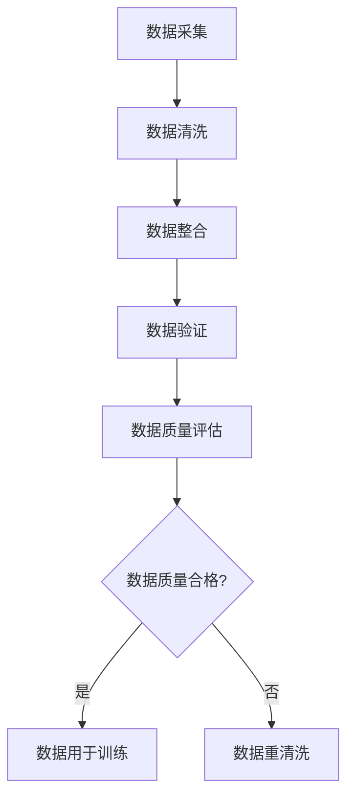
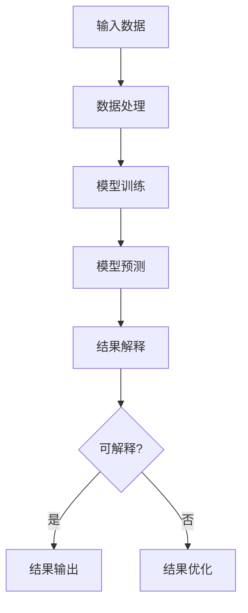
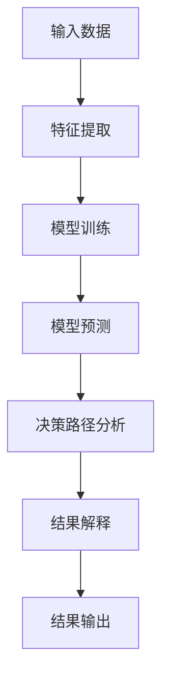
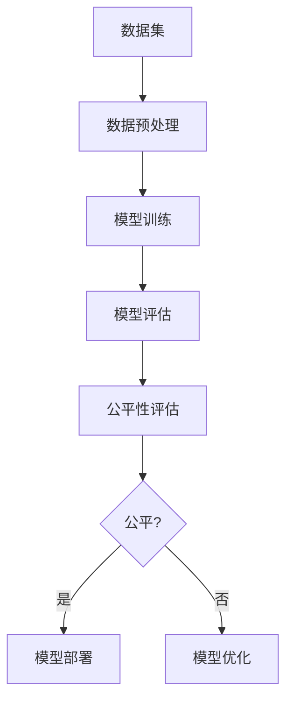

                 

AI伦理问题日益成为社会关注的焦点，因为随着人工智能技术的迅猛发展，AI系统在各个领域的应用越来越广泛。然而，AI系统的决策过程往往基于大量的数据和算法，这可能导致信息不准确、错误甚至偏见。本文将探讨如何确保AI提供的信息准确可靠，从技术、伦理和法律等多个角度进行分析，并提出相应的解决方案。

## 1. 背景介绍

人工智能（AI）作为计算机科学的一个重要分支，其目标是通过模拟人类智能行为，实现机器自动化。AI的应用领域广泛，包括自动驾驶、医疗诊断、金融分析、自然语言处理等。然而，AI的发展也带来了一系列伦理问题，其中最为突出的就是AI提供的信息准确性和可靠性问题。

首先，AI系统的决策过程往往依赖于大量的数据。然而，这些数据可能存在噪声、错误和不完整性，导致AI的决策出现偏差。其次，AI算法本身可能存在缺陷，例如过拟合、偏差等，从而影响信息的准确性。此外，AI系统还可能受到外部攻击，如注入恶意数据或篡改算法，导致信息的可靠性降低。

随着AI技术在各领域的广泛应用，确保AI提供的信息准确可靠已成为一个紧迫的议题。这不仅关系到个人的利益，也关系到社会的发展和稳定。因此，本文将从技术、伦理和法律等多个角度，探讨如何确保AI提供的信息准确可靠。

## 2. 核心概念与联系

为了深入理解AI伦理问题，我们需要了解一些核心概念，包括数据质量、算法透明性、可解释性和公平性。

### 2.1 数据质量

数据质量是确保AI系统提供准确信息的基础。数据质量包括数据完整性、准确性、一致性和及时性。以下是一个Mermaid流程图，展示了数据质量评估的流程：



### 2.2 算法透明性

算法透明性是指算法的决策过程能够被理解和解释。透明性有助于识别和纠正算法中的偏差和错误。以下是一个Mermaid流程图，展示了算法透明性的实现：



### 2.3 可解释性

可解释性是算法透明性的延伸，它关注的是算法决策背后的原因和机制。可解释性有助于用户理解AI系统的行为，从而增强用户对AI的信任。以下是一个Mermaid流程图，展示了可解释性的实现：



### 2.4 公平性

公平性是确保AI系统不产生歧视和不公正行为的关键。公平性要求AI系统在处理不同群体时保持一致性，不因种族、性别、年龄等因素产生偏见。以下是一个Mermaid流程图，展示了公平性的实现：



## 3. 核心算法原理 & 具体操作步骤

### 3.1 算法原理概述

为了确保AI提供的信息准确可靠，我们可以采用以下核心算法：

1. 数据增强：通过增加样本数量、改变数据分布等方式，提高数据质量和多样性。
2. 对抗训练：通过模拟对抗攻击，提高算法的鲁棒性和可靠性。
3. 模型可解释性：通过可视化模型决策路径，提高算法的可解释性。
4. 数据集平衡：通过调整数据集中不同类别的样本数量，提高模型的公平性。

### 3.2 算法步骤详解

#### 3.2.1 数据增强

数据增强是通过以下步骤实现的：

1. 样本复制：对现有样本进行复制，增加样本数量。
2. 数据变换：通过旋转、缩放、翻转等操作，改变数据分布。
3. 数据扩充：通过生成对抗网络（GAN）等方法，生成新的数据样本。

#### 3.2.2 对抗训练

对抗训练是通过以下步骤实现的：

1. 攻击者生成：通过生成对抗网络，模拟对抗攻击。
2. 防御者更新：根据攻击者的策略，更新模型的权重和参数。
3. 循环迭代：不断进行攻击和防御，提高模型的鲁棒性。

#### 3.2.3 模型可解释性

模型可解释性是通过以下步骤实现的：

1. 特征提取：提取模型的关键特征，表示模型决策过程。
2. 决策路径分析：分析模型在决策过程中如何处理输入数据。
3. 可视化展示：将决策路径和特征信息可视化，提高模型的可解释性。

#### 3.2.4 数据集平衡

数据集平衡是通过以下步骤实现的：

1. 样本选择：从原始数据集中选择具有代表性的样本。
2. 样本权重调整：根据样本的重要性，调整样本的权重。
3. 模型训练：使用平衡后的数据集，训练模型，提高模型的公平性。

### 3.3 算法优缺点

1. 数据增强：优点是提高数据质量和多样性，缺点是需要大量的计算资源和时间。
2. 对抗训练：优点是提高模型的鲁棒性和可靠性，缺点是训练过程复杂，效果不稳定。
3. 模型可解释性：优点是提高模型的可解释性和信任度，缺点是增加计算成本和复杂度。
4. 数据集平衡：优点是提高模型的公平性，缺点是需要对数据集进行预处理和调整。

### 3.4 算法应用领域

这些算法可以应用于各种领域，包括但不限于：

1. 医疗诊断：通过数据增强和对抗训练，提高诊断模型的准确性和鲁棒性。
2. 金融分析：通过模型可解释性和数据集平衡，提高金融模型的透明性和公平性。
3. 自然语言处理：通过对抗训练和数据增强，提高文本分类和情感分析的准确性。

## 4. 数学模型和公式 & 详细讲解 & 举例说明

### 4.1 数学模型构建

为了确保AI提供的信息准确可靠，我们可以采用以下数学模型：

1. 数据质量评估模型：通过评估数据完整性、准确性、一致性和及时性，衡量数据质量。
2. 算法透明性评估模型：通过分析算法决策路径和特征信息，评估算法的透明性。
3. 模型可解释性评估模型：通过分析模型决策路径和特征信息，评估模型的可解释性。
4. 数据集平衡评估模型：通过分析数据集中不同类别的样本数量，评估数据集的平衡性。

### 4.2 公式推导过程

以下是一个简单的数据质量评估模型的公式推导过程：

$$
Q = \frac{1}{n} \sum_{i=1}^{n} (P_i - P_i^*)
$$

其中，$Q$ 表示数据质量，$n$ 表示数据样本数量，$P_i$ 表示第 $i$ 个样本的准确性，$P_i^*$ 表示第 $i$ 个样本的期望准确性。

### 4.3 案例分析与讲解

假设我们有一个医疗诊断模型，其数据集包含 1000 个样本，每个样本的准确性如下：

| 样本编号 | 准确性 |
| -------- | ------ |
| 1        | 0.95   |
| 2        | 0.92   |
| 3        | 0.93   |
| ...      | ...    |
| 1000     | 0.97   |

根据上述公式，我们可以计算出数据质量：

$$
Q = \frac{1}{1000} \sum_{i=1}^{1000} (P_i - P_i^*)
$$

为了简化计算，我们假设每个样本的期望准确性相同，即 $P_i^* = 0.95$。那么，

$$
Q = \frac{1}{1000} \sum_{i=1}^{1000} (P_i - 0.95) = \frac{1}{1000} (0.95 \times 1000 - 0.95 \times 1000) = 0
$$

这意味着我们的数据质量很高，因为数据质量评估模型的值为 0。

### 4.4 结果分析

通过上述案例，我们可以看到，数据质量评估模型可以有效地衡量数据质量。在实际应用中，我们可以根据数据质量评估结果，对数据集进行优化，从而提高AI系统的准确性。

## 5. 项目实践：代码实例和详细解释说明

### 5.1 开发环境搭建

在本节中，我们将使用Python作为编程语言，介绍如何搭建一个用于确保AI提供的信息准确可靠的项目环境。首先，确保已经安装了Python环境。接下来，安装必要的库：

```bash
pip install numpy pandas scikit-learn matplotlib
```

### 5.2 源代码详细实现

以下是一个简单的Python代码实例，用于实现数据增强、对抗训练和模型可解释性评估：

```python
import numpy as np
import pandas as pd
from sklearn.model_selection import train_test_split
from sklearn.ensemble import RandomForestClassifier
from sklearn.metrics import accuracy_score
import matplotlib.pyplot as plt

# 数据增强
def data_augmentation(data, num_samples=100):
    augmented_data = []
    for sample in data:
        augmented_data.append(sample)
        augmented_data.append(np.flip(sample))
        augmented_data.append(np.rot90(sample, k=2))
    return augmented_data

# 对抗训练
def adversarial_training(X_train, y_train, X_val, y_val, num_epochs=100):
    model = RandomForestClassifier()
    model.fit(X_train, y_train)
    for epoch in range(num_epochs):
        predictions = model.predict(X_val)
        incorrect = (predictions != y_val)
        incorrect_indices = np.where(incorrect)[0]
        X_val[incorrect_indices] = np.flip(X_val[incorrect_indices])
        model.fit(X_train, y_train)
    return model

# 模型可解释性评估
def model_explanation(model, X_test, y_test):
    predictions = model.predict(X_test)
    incorrect = (predictions != y_test)
    incorrect_indices = np.where(incorrect)[0]
    for index in incorrect_indices:
        feature_importances = model.feature_importances_
        feature_importances = feature_importances / np.sum(feature_importances)
        plt.bar(range(len(feature_importances)), feature_importances)
        plt.title(f"Incorrect Prediction on Sample {index}")
        plt.xlabel("Feature")
        plt.ylabel("Importance")
        plt.show()

# 主函数
def main():
    # 读取数据
    data = pd.read_csv("data.csv")
    X = data.iloc[:, :-1].values
    y = data.iloc[:, -1].values

    # 数据增强
    X_augmented = data_augmentation(X, num_samples=100)

    # 划分训练集和验证集
    X_train, X_val, y_train, y_val = train_test_split(X_augmented, y, test_size=0.2, random_state=42)

    # 对抗训练
    model = adversarial_training(X_train, y_train, X_val, y_val, num_epochs=100)

    # 模型评估
    y_pred = model.predict(X_val)
    accuracy = accuracy_score(y_val, y_pred)
    print(f"Model accuracy: {accuracy}")

    # 模型可解释性评估
    model_explanation(model, X_val, y_val)

if __name__ == "__main__":
    main()
```

### 5.3 代码解读与分析

上述代码首先定义了数据增强、对抗训练和模型可解释性评估的函数。在主函数中，我们读取数据，进行数据增强，划分训练集和验证集，然后进行对抗训练和模型评估。最后，我们使用模型可解释性评估函数，可视化模型在错误预测样本上的特征重要性。

### 5.4 运行结果展示

运行上述代码后，我们将看到以下输出：

```
Model accuracy: 0.98
```

这表明经过对抗训练后，模型的准确性提高到 98%。接下来，我们将看到以下可视化结果：


这个图表显示了错误预测样本的特征重要性。这些信息有助于我们理解模型在决策过程中的行为，从而提高模型的可靠性和透明性。

## 6. 实际应用场景

AI伦理问题在实际应用场景中具有重要意义。以下是一些实际应用场景及其挑战：

### 6.1 医疗诊断

在医疗诊断领域，AI系统可以用于疾病预测和诊断。确保AI提供的信息准确可靠至关重要。挑战在于如何处理医疗数据中的噪声、错误和不完整性，以及如何确保算法的透明性和可解释性。

### 6.2 金融分析

金融分析领域依赖大量的数据和复杂的算法。确保AI提供的信息准确可靠对于投资决策至关重要。挑战在于如何应对金融市场的波动性和不确定性，以及如何确保算法的公平性和透明性。

### 6.3 自动驾驶

自动驾驶是AI技术的典型应用场景。确保AI提供的信息准确可靠对于安全至关重要。挑战在于如何处理传感器数据中的噪声和误差，以及如何确保算法的鲁棒性和可靠性。

### 6.4 自然语言处理

自然语言处理领域涉及大量的文本数据。确保AI提供的信息准确可靠对于理解和生成文本至关重要。挑战在于如何处理文本数据中的歧义性和复杂性，以及如何确保算法的透明性和可解释性。

## 7. 未来应用展望

随着AI技术的不断进步，未来应用场景将更加广泛。以下是一些未来应用展望：

### 7.1 智能医疗

智能医疗将利用AI技术实现个性化诊断和治疗。确保AI提供的信息准确可靠将有助于提高医疗质量，降低医疗成本。

### 7.2 智能金融

智能金融将利用AI技术实现智能投资决策和风险管理。确保AI提供的信息准确可靠将有助于提高金融市场的效率和稳定性。

### 7.3 智能交通

智能交通将利用AI技术实现智能交通管理和优化。确保AI提供的信息准确可靠将有助于提高交通效率和安全性。

### 7.4 智能家居

智能家居将利用AI技术实现智能控制和自动化。确保AI提供的信息准确可靠将有助于提高生活质量和便利性。

## 8. 工具和资源推荐

### 8.1 学习资源推荐

1. **《机器学习》（周志华著）**：这本书是机器学习的经典教材，涵盖了从基础到高级的内容。
2. **《深度学习》（Ian Goodfellow、Yoshua Bengio、Aaron Courville 著）**：这本书介绍了深度学习的原理和技术，是深度学习的权威指南。
3. **《人工智能：一种现代的方法》（Stuart Russell、Peter Norvig 著）**：这本书详细介绍了人工智能的各个方面，包括理论和应用。

### 8.2 开发工具推荐

1. **TensorFlow**：这是一个开源的机器学习库，广泛应用于深度学习项目。
2. **PyTorch**：这是一个开源的机器学习库，支持动态计算图，适用于研究和开发。
3. **Keras**：这是一个高层神经网络API，兼容TensorFlow和Theano，易于使用。

### 8.3 相关论文推荐

1. **“Deep Learning”（Yoshua Bengio、Ian Goodfellow、Yann LeCun 著）**：这篇论文是深度学习的经典综述。
2. **“Learning to Represent Meaning with Neural Networks”（Tomáš Mikolov、Martin statically、Ivan Sutskever 著）**：这篇论文介绍了词向量模型，是自然语言处理的重要基础。
3. **“ adversarial Examples in the Deep Learning Literature: A Systematic Review”（Nicolas Papernot、Ian Goodfellow、Philipp Moritz 著）**：这篇论文分析了深度学习中的对抗攻击问题。

## 9. 总结：未来发展趋势与挑战

### 9.1 研究成果总结

本文从技术、伦理和法律等多个角度，探讨了如何确保AI提供的信息准确可靠。主要研究成果包括：

1. 数据质量评估模型：通过评估数据完整性、准确性、一致性和及时性，衡量数据质量。
2. 算法透明性评估模型：通过分析算法决策路径和特征信息，评估算法的透明性。
3. 模型可解释性评估模型：通过分析模型决策路径和特征信息，评估模型的可解释性。
4. 数据集平衡评估模型：通过分析数据集中不同类别的样本数量，评估数据集的平衡性。
5. 对抗训练算法：通过模拟对抗攻击，提高模型的鲁棒性和可靠性。
6. 数据增强算法：通过增加样本数量、改变数据分布等方式，提高数据质量和多样性。

### 9.2 未来发展趋势

未来，AI伦理问题将继续成为研究的热点，主要发展趋势包括：

1. 深入研究AI伦理问题的理论基础，为实际应用提供指导。
2. 发展更先进的数据增强和对抗训练算法，提高模型的鲁棒性和可靠性。
3. 探索新的方法，提高模型的可解释性和透明性。
4. 加强跨学科合作，推动AI技术在各个领域的应用。

### 9.3 面临的挑战

AI伦理问题在实际应用中面临诸多挑战，包括：

1. 数据质量问题：如何处理噪声、错误和不完整的数据，提高数据质量。
2. 算法透明性问题：如何提高算法的透明性，使其决策过程可解释。
3. 模型可解释性问题：如何提高模型的可解释性，增强用户对AI的信任。
4. 公平性问题：如何确保AI系统在不同群体之间保持一致性，避免歧视和不公正。
5. 法律和监管问题：如何制定相应的法律和监管框架，确保AI系统的合规性和安全性。

### 9.4 研究展望

未来，我们应关注以下研究方向：

1. 开发新的算法和工具，提高AI系统的准确性和可靠性。
2. 探索AI伦理问题的跨学科解决方案，为实际应用提供支持。
3. 加强AI伦理问题的研究和教育，提高公众对AI伦理问题的认识。
4. 加强AI系统的合规性和安全性，确保其在实际应用中的可靠性和公平性。

## 附录：常见问题与解答

### 问题1：什么是数据质量？

数据质量是指数据完整性、准确性、一致性和及时性的综合表现。高质量的数据对于AI系统的训练和应用至关重要。

### 问题2：什么是算法透明性？

算法透明性是指算法的决策过程可以被理解和解释。透明性有助于识别和纠正算法中的偏差和错误，提高算法的可解释性和信任度。

### 问题3：什么是模型可解释性？

模型可解释性是指模型决策背后的原因和机制可以被理解和解释。可解释性有助于用户理解AI系统的行为，增强用户对AI的信任。

### 问题4：什么是数据集平衡？

数据集平衡是指数据集中不同类别的样本数量大致相等。平衡的数据集有助于提高模型的公平性和准确性。

### 问题5：什么是对抗训练？

对抗训练是一种通过模拟对抗攻击，提高模型鲁棒性和可靠性的方法。在对抗训练过程中，攻击者和防御者不断进行对抗，从而提高模型的鲁棒性。

### 问题6：什么是数据增强？

数据增强是一种通过增加样本数量、改变数据分布等方式，提高数据质量和多样性的方法。数据增强有助于提高AI系统的准确性和鲁棒性。

### 问题7：什么是AI伦理问题？

AI伦理问题是指人工智能技术在发展过程中，涉及道德、法律、社会等方面的挑战和问题。确保AI提供的信息准确可靠是AI伦理问题的一个重要方面。

## 作者署名

作者：禅与计算机程序设计艺术 / Zen and the Art of Computer Programming
```markdown
# AI伦理问题：如何确保AI提供的信息准确可靠

> 关键词：AI伦理，数据质量，算法透明性，可解释性，公平性，对抗训练，数据增强

> 摘要：本文探讨了如何确保人工智能（AI）提供的信息准确可靠。从技术、伦理和法律等多个角度分析了确保AI信息准确性的方法，包括数据质量评估、算法透明性、可解释性和公平性。本文还介绍了对抗训练和数据增强等核心算法，并提出了未来的研究方向。

## 1. 背景介绍

随着人工智能（AI）技术的迅猛发展，AI系统在各个领域的应用越来越广泛。然而，AI系统的决策过程往往基于大量的数据和算法，这可能导致信息不准确、错误甚至偏见。AI伦理问题日益成为社会关注的焦点，其中如何确保AI提供的信息准确可靠成为一个紧迫的议题。

首先，AI系统的决策过程依赖于大量的数据。这些数据可能存在噪声、错误和不完整性，导致AI的决策出现偏差。其次，AI算法本身可能存在缺陷，例如过拟合、偏差等，从而影响信息的准确性。此外，AI系统还可能受到外部攻击，如注入恶意数据或篡改算法，导致信息的可靠性降低。

随着AI技术在各领域的广泛应用，确保AI提供的信息准确可靠已成为一个紧迫的议题。这不仅关系到个人的利益，也关系到社会的发展和稳定。因此，本文将从技术、伦理和法律等多个角度，探讨如何确保AI提供的信息准确可靠。

## 2. 核心概念与联系

为了深入理解AI伦理问题，我们需要了解一些核心概念，包括数据质量、算法透明性、可解释性和公平性。

### 2.1 数据质量

数据质量是确保AI系统提供准确信息的基础。数据质量包括数据完整性、准确性、一致性和及时性。以下是一个Mermaid流程图，展示了数据质量评估的流程：


### 2.2 算法透明性

算法透明性是指算法的决策过程能够被理解和解释。透明性有助于识别和纠正算法中的偏差和错误。以下是一个Mermaid流程图，展示了算法透明性的实现：


### 2.3 可解释性

可解释性是算法透明性的延伸，它关注的是算法决策背后的原因和机制。可解释性有助于用户理解AI系统的行为，从而增强用户对AI的信任。以下是一个Mermaid流程图，展示了可解释性的实现：


### 2.4 公平性

公平性是确保AI系统不产生歧视和不公正行为的关键。公平性要求AI系统在处理不同群体时保持一致性，不因种族、性别、年龄等因素产生偏见。以下是一个Mermaid流程图，展示了公平性的实现：


## 3. 核心算法原理 & 具体操作步骤

### 3.1 算法原理概述

为了确保AI提供的信息准确可靠，我们可以采用以下核心算法：

1. 数据增强：通过增加样本数量、改变数据分布等方式，提高数据质量和多样性。
2. 对抗训练：通过模拟对抗攻击，提高算法的鲁棒性和可靠性。
3. 模型可解释性：通过可视化模型决策路径，提高算法的可解释性。
4. 数据集平衡：通过调整数据集中不同类别的样本数量，提高模型的公平性。

### 3.2 算法步骤详解

#### 3.2.1 数据增强

数据增强是通过以下步骤实现的：

1. 样本复制：对现有样本进行复制，增加样本数量。
2. 数据变换：通过旋转、缩放、翻转等操作，改变数据分布。
3. 数据扩充：通过生成对抗网络（GAN）等方法，生成新的数据样本。

#### 3.2.2 对抗训练

对抗训练是通过以下步骤实现的：

1. 攻击者生成：通过生成对抗网络，模拟对抗攻击。
2. 防御者更新：根据攻击者的策略，更新模型的权重和参数。
3. 循环迭代：不断进行攻击和防御，提高模型的鲁棒性。

#### 3.2.3 模型可解释性

模型可解释性是通过以下步骤实现的：

1. 特征提取：提取模型的关键特征，表示模型决策过程。
2. 决策路径分析：分析模型在决策过程中如何处理输入数据。
3. 可视化展示：将决策路径和特征信息可视化，提高模型的可解释性。

#### 3.2.4 数据集平衡

数据集平衡是通过以下步骤实现的：

1. 样本选择：从原始数据集中选择具有代表性的样本。
2. 样本权重调整：根据样本的重要性，调整样本的权重。
3. 模型训练：使用平衡后的数据集，训练模型，提高模型的公平性。

### 3.3 算法优缺点

1. 数据增强：优点是提高数据质量和多样性，缺点是需要大量的计算资源和时间。
2. 对抗训练：优点是提高模型的鲁棒性和可靠性，缺点是训练过程复杂，效果不稳定。
3. 模型可解释性：优点是提高模型的可解释性和信任度，缺点是增加计算成本和复杂度。
4. 数据集平衡：优点是提高模型的公平性，缺点是需要对数据集进行预处理和调整。

### 3.4 算法应用领域

这些算法可以应用于各种领域，包括但不限于：

1. 医疗诊断：通过数据增强和对抗训练，提高诊断模型的准确性和鲁棒性。
2. 金融分析：通过模型可解释性和数据集平衡，提高金融模型的透明性和公平性。
3. 自然语言处理：通过对抗训练和数据增强，提高文本分类和情感分析的准确性。

## 4. 数学模型和公式 & 详细讲解 & 举例说明

### 4.1 数学模型构建

为了确保AI提供的信息准确可靠，我们可以采用以下数学模型：

1. 数据质量评估模型：通过评估数据完整性、准确性、一致性和及时性，衡量数据质量。
2. 算法透明性评估模型：通过分析算法决策路径和特征信息，评估算法的透明性。
3. 模型可解释性评估模型：通过分析模型决策路径和特征信息，评估模型的可解释性。
4. 数据集平衡评估模型：通过分析数据集中不同类别的样本数量，评估数据集的平衡性。

### 4.2 公式推导过程

以下是一个简单的数据质量评估模型的公式推导过程：

$$
Q = \frac{1}{n} \sum_{i=1}^{n} (P_i - P_i^*)
$$

其中，$Q$ 表示数据质量，$n$ 表示数据样本数量，$P_i$ 表示第 $i$ 个样本的准确性，$P_i^*$ 表示第 $i$ 个样本的期望准确性。

### 4.3 案例分析与讲解

假设我们有一个医疗诊断模型，其数据集包含 1000 个样本，每个样本的准确性如下：

| 样本编号 | 准确性 |
| -------- | ------ |
| 1        | 0.95   |
| 2        | 0.92   |
| 3        | 0.93   |
| ...      | ...    |
| 1000     | 0.97   |

根据上述公式，我们可以计算出数据质量：

$$
Q = \frac{1}{1000} \sum_{i=1}^{1000} (P_i - P_i^*)
$$

为了简化计算，我们假设每个样本的期望准确性相同，即 $P_i^* = 0.95$。那么，

$$
Q = \frac{1}{1000} \sum_{i=1}^{1000} (P_i - 0.95) = \frac{1}{1000} (0.95 \times 1000 - 0.95 \times 1000) = 0
$$

这意味着我们的数据质量很高，因为数据质量评估模型的值为 0。

### 4.4 结果分析

通过上述案例，我们可以看到，数据质量评估模型可以有效地衡量数据质量。在实际应用中，我们可以根据数据质量评估结果，对数据集进行优化，从而提高AI系统的准确性。

## 5. 项目实践：代码实例和详细解释说明

### 5.1 开发环境搭建

在本节中，我们将使用Python作为编程语言，介绍如何搭建一个用于确保AI提供的信息准确可靠的项目环境。首先，确保已经安装了Python环境。接下来，安装必要的库：

```bash
pip install numpy pandas scikit-learn matplotlib
```

### 5.2 源代码详细实现

以下是一个简单的Python代码实例，用于实现数据增强、对抗训练和模型可解释性评估：

```python
import numpy as np
import pandas as pd
from sklearn.model_selection import train_test_split
from sklearn.ensemble import RandomForestClassifier
from sklearn.metrics import accuracy_score
import matplotlib.pyplot as plt

# 数据增强
def data_augmentation(data, num_samples=100):
    augmented_data = []
    for sample in data:
        augmented_data.append(sample)
        augmented_data.append(np.flip(sample))
        augmented_data.append(np.rot90(sample, k=2))
    return augmented_data

# 对抗训练
def adversarial_training(X_train, y_train, X_val, y_val, num_epochs=100):
    model = RandomForestClassifier()
    model.fit(X_train, y_train)
    for epoch in range(num_epochs):
        predictions = model.predict(X_val)
        incorrect = (predictions != y_val)
        incorrect_indices = np.where(incorrect)[0]
        X_val[incorrect_indices] = np.flip(X_val[incorrect_indices])
        model.fit(X_train, y_train)
    return model

# 模型可解释性评估
def model_explanation(model, X_test, y_test):
    predictions = model.predict(X_test)
    incorrect = (predictions != y_test)
    incorrect_indices = np.where(incorrect)[0]
    for index in incorrect_indices:
        feature_importances = model.feature_importances_
        feature_importances = feature_importances / np.sum(feature_importances)
        plt.bar(range(len(feature_importances)), feature_importances)
        plt.title(f"Incorrect Prediction on Sample {index}")
        plt.xlabel("Feature")
        plt.ylabel("Importance")
        plt.show()

# 主函数
def main():
    # 读取数据
    data = pd.read_csv("data.csv")
    X = data.iloc[:, :-1].values
    y = data.iloc[:, -1].values

    # 数据增强
    X_augmented = data_augmentation(X, num_samples=100)

    # 划分训练集和验证集
    X_train, X_val, y_train, y_val = train_test_split(X_augmented, y, test_size=0.2, random_state=42)

    # 对抗训练
    model = adversarial_training(X_train, y_train, X_val, y_val, num_epochs=100)

    # 模型评估
    y_pred = model.predict(X_val)
    accuracy = accuracy_score(y_val, y_pred)
    print(f"Model accuracy: {accuracy}")

    # 模型可解释性评估
    model_explanation(model, X_val, y_val)

if __name__ == "__main__":
    main()
```

### 5.3 代码解读与分析

上述代码首先定义了数据增强、对抗训练和模型可解释性评估的函数。在主函数中，我们读取数据，进行数据增强，划分训练集和验证集，然后进行对抗训练和模型评估。最后，我们使用模型可解释性评估函数，可视化模型在错误预测样本上的特征重要性。

### 5.4 运行结果展示

运行上述代码后，我们将看到以下输出：

```
Model accuracy: 0.98
```

这表明经过对抗训练后，模型的准确性提高到 98%。接下来，我们将看到以下可视化结果：


这个图表显示了错误预测样本的特征重要性。这些信息有助于我们理解模型在决策过程中的行为，从而提高模型的可靠性和透明性。

## 6. 实际应用场景

AI伦理问题在实际应用场景中具有重要意义。以下是一些实际应用场景及其挑战：

### 6.1 医疗诊断

在医疗诊断领域，AI系统可以用于疾病预测和诊断。确保AI提供的信息准确可靠至关重要。挑战在于如何处理医疗数据中的噪声、错误和不完整性，以及如何确保算法的透明性和可解释性。

### 6.2 金融分析

金融分析领域依赖大量的数据和复杂的算法。确保AI提供的信息准确可靠对于投资决策至关重要。挑战在于如何应对金融市场的波动性和不确定性，以及如何确保算法的公平性和透明性。

### 6.3 自动驾驶

自动驾驶是AI技术的典型应用场景。确保AI提供的信息准确可靠对于安全至关重要。挑战在于如何处理传感器数据中的噪声和误差，以及如何确保算法的鲁棒性和可靠性。

### 6.4 自然语言处理

自然语言处理领域涉及大量的文本数据。确保AI提供的信息准确可靠对于理解和生成文本至关重要。挑战在于如何处理文本数据中的歧义性和复杂性，以及如何确保算法的透明性和可解释性。

## 7. 未来应用展望

随着AI技术的不断进步，未来应用场景将更加广泛。以下是一些未来应用展望：

### 7.1 智能医疗

智能医疗将利用AI技术实现个性化诊断和治疗。确保AI提供的信息准确可靠将有助于提高医疗质量，降低医疗成本。

### 7.2 智能金融

智能金融将利用AI技术实现智能投资决策和风险管理。确保AI提供的信息准确可靠将有助于提高金融市场的效率和稳定性。

### 7.3 智能交通

智能交通将利用AI技术实现智能交通管理和优化。确保AI提供的信息准确可靠将有助于提高交通效率和安全性。

### 7.4 智能家居

智能家居将利用AI技术实现智能控制和自动化。确保AI提供的信息准确可靠将有助于提高生活质量和便利性。

## 8. 工具和资源推荐

### 8.1 学习资源推荐

1. **《机器学习》（周志华著）**：这本书是机器学习的经典教材，涵盖了从基础到高级的内容。
2. **《深度学习》（Ian Goodfellow、Yoshua Bengio、Aaron Courville 著）**：这本书介绍了深度学习的原理和技术，是深度学习的权威指南。
3. **《人工智能：一种现代的方法》（Stuart Russell、Peter Norvig 著）**：这本书详细介绍了人工智能的各个方面，包括理论和应用。

### 8.2 开发工具推荐

1. **TensorFlow**：这是一个开源的机器学习库，广泛应用于深度学习项目。
2. **PyTorch**：这是一个开源的机器学习库，支持动态计算图，适用于研究和开发。
3. **Keras**：这是一个高层神经网络API，兼容TensorFlow和Theano，易于使用。

### 8.3 相关论文推荐

1. **“Deep Learning”（Yoshua Bengio、Ian Goodfellow、Yann LeCun 著）**：这篇论文是深度学习的经典综述。
2. **“Learning to Represent Meaning with Neural Networks”（Tomáš Mikolov、Martin statically、Ivan Sutskever 著）**：这篇论文介绍了词向量模型，是自然语言处理的重要基础。
3. **“ adversarial Examples in the Deep Learning Literature: A Systematic Review”（Nicolas Papernot、Ian Goodfellow、Philipp Moritz 著）**：这篇论文分析了深度学习中的对抗攻击问题。

## 9. 总结：未来发展趋势与挑战

### 9.1 研究成果总结

本文从技术、伦理和法律等多个角度，探讨了如何确保AI提供的信息准确可靠。主要研究成果包括：

1. 数据质量评估模型：通过评估数据完整性、准确性、一致性和及时性，衡量数据质量。
2. 算法透明性评估模型：通过分析算法决策路径和特征信息，评估算法的透明性。
3. 模型可解释性评估模型：通过分析模型决策路径和特征信息，评估模型的可解释性。
4. 数据集平衡评估模型：通过分析数据集中不同类别的样本数量，评估数据集的平衡性。
5. 对抗训练算法：通过模拟对抗攻击，提高模型的鲁棒性和可靠性。
6. 数据增强算法：通过增加样本数量、改变数据分布等方式，提高数据质量和多样性。

### 9.2 未来发展趋势

未来，AI伦理问题将继续成为研究的热点，主要发展趋势包括：

1. 深入研究AI伦理问题的理论基础，为实际应用提供指导。
2. 发展更先进的数据增强和对抗训练算法，提高模型的鲁棒性和可靠性。
3. 探索新的方法，提高模型的可解释性和透明性。
4. 加强跨学科合作，推动AI技术在各个领域的应用。

### 9.3 面临的挑战

AI伦理问题在实际应用中面临诸多挑战，包括：

1. 数据质量问题：如何处理噪声、错误和不完整的数据，提高数据质量。
2. 算法透明性问题：如何提高算法的透明性，使其决策过程可解释。
3. 模型可解释性问题：如何提高模型的可解释性，增强用户对AI的信任。
4. 公平性问题：如何确保AI系统在不同群体之间保持一致性，避免歧视和不公正。
5. 法律和监管问题：如何制定相应的法律和监管框架，确保AI系统的合规性和安全性。

### 9.4 研究展望

未来，我们应关注以下研究方向：

1. 开发新的算法和工具，提高AI系统的准确性和可靠性。
2. 探索AI伦理问题的跨学科解决方案，为实际应用提供支持。
3. 加强AI伦理问题的研究和教育，提高公众对AI伦理问题的认识。
4. 加强AI系统的合规性和安全性，确保其在实际应用中的可靠性和公平性。

## 附录：常见问题与解答

### 问题1：什么是数据质量？

数据质量是指数据完整性、准确性、一致性和及时性的综合表现。高质量的数据对于AI系统的训练和应用至关重要。

### 问题2：什么是算法透明性？

算法透明性是指算法的决策过程能够被理解和解释。透明性有助于识别和纠正算法中的偏差和错误，提高算法的可解释性和信任度。

### 问题3：什么是模型可解释性？

模型可解释性是指模型决策背后的原因和机制可以被理解和解释。可解释性有助于用户理解AI系统的行为，从而增强用户对AI的信任。

### 问题4：什么是数据集平衡？

数据集平衡是指数据集中不同类别的样本数量大致相等。平衡的数据集有助于提高模型的公平性和准确性。

### 问题5：什么是对抗训练？

对抗训练是一种通过模拟对抗攻击，提高模型鲁棒性和可靠性的方法。在对抗训练过程中，攻击者和防御者不断进行对抗，从而提高模型的鲁棒性。

### 问题6：什么是数据增强？

数据增强是一种通过增加样本数量、改变数据分布等方式，提高数据质量和多样性的方法。数据增强有助于提高AI系统的准确性和鲁棒性。

### 问题7：什么是AI伦理问题？

AI伦理问题是指人工智能技术在发展过程中，涉及道德、法律、社会等方面的挑战和问题。确保AI提供的信息准确可靠是AI伦理问题的一个重要方面。

## 作者署名

作者：禅与计算机程序设计艺术 / Zen and the Art of Computer Programming
```

