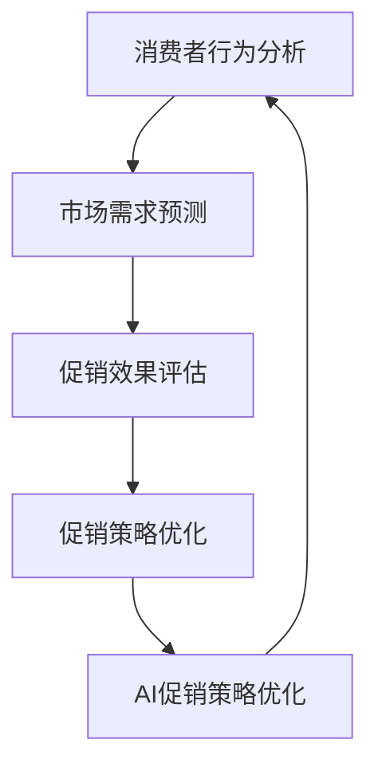

                 

### 1. 背景介绍

促销策略优化是市场营销中一个关键环节，它不仅影响企业的销售业绩，还能提升客户满意度。在当今竞争激烈的市场环境中，如何制定和优化有效的促销策略，成为企业关注的焦点。传统的促销策略往往依赖于历史数据和直觉，但这种方法在应对复杂多变的市场环境时，显得力不从心。因此，人工智能（AI）技术在促销策略优化中的应用逐渐成为研究热点。

AI技术在促销策略优化中具有显著优势。首先，AI可以通过大数据分析，挖掘消费者行为和偏好，从而制定更具个性化的促销方案。其次，AI算法可以根据市场动态实时调整促销策略，提高促销效果的准确性。此外，AI还能够预测未来市场需求，帮助企业提前布局，提高市场竞争力。

然而，尽管AI技术在促销策略优化方面具有巨大潜力，但实际应用过程中仍面临诸多挑战。例如，如何处理大规模数据、保证数据安全、算法的透明性和可解释性等问题。此外，不同企业的业务特点和市场需求各异，如何针对特定场景设计合适的AI促销策略，也是亟待解决的问题。

本文将结合实际案例，深入探讨AI促销策略优化的问题，从核心概念、算法原理、数学模型、项目实践等多个角度进行全面分析，旨在为企业在促销策略优化方面提供有益的参考和指导。

### 2. 核心概念与联系

在探讨AI促销策略优化之前，我们需要了解一些核心概念和其相互之间的联系。以下是对这些概念及其关系的详细阐述，并使用Mermaid流程图来展示它们之间的流程和结构。

#### 2.1. 消费者行为分析

消费者行为分析是促销策略优化的基础。它涉及到对消费者购买习惯、偏好、反馈等数据的收集和分析。通过消费者行为分析，企业可以深入了解目标客户群体，从而制定更具针对性的促销策略。

#### 2.2. 市场需求预测

市场需求预测是促销策略优化的关键环节。通过分析市场趋势、季节性因素、竞争态势等，AI算法可以预测未来市场需求，帮助企业在关键时刻做出明智的决策。

#### 2.3. 促销效果评估

促销效果评估是验证促销策略有效性的重要手段。通过分析促销活动前后的销售数据、客户反馈等，企业可以评估促销策略的实际效果，并据此进行调整。

#### 2.4. 促销策略优化

促销策略优化是将消费者行为分析、市场需求预测和促销效果评估相结合，通过持续迭代和优化，制定出最有效的促销策略。这一过程需要依赖AI算法的支持，以提高决策的准确性和效率。

#### 2.5. Mermaid流程图

以下是一个Mermaid流程图，展示了上述核心概念及其相互之间的流程和结构：



在这个流程图中，消费者行为分析作为起点，通过市场需求预测和促销效果评估，不断反馈和优化促销策略，形成了一个闭环系统。AI促销策略优化则在这个过程中扮演了关键角色，通过智能化手段，提高整个流程的效率和效果。

### 3. 核心算法原理 & 具体操作步骤

#### 3.1 算法原理概述

在AI促销策略优化中，常用的核心算法包括协同过滤（Collaborative Filtering）、时间序列分析（Time Series Analysis）和机器学习分类（Machine Learning Classification）等。以下是这些算法的基本原理和适用场景。

**协同过滤**

协同过滤是一种基于用户行为数据的方法，它通过分析用户之间的相似性，为用户推荐相关商品或服务。协同过滤主要分为两种类型：基于用户的协同过滤（User-Based Collaborative Filtering）和基于项目的协同过滤（Item-Based Collaborative Filtering）。

- **基于用户的协同过滤**：通过计算用户之间的相似度，找到与目标用户相似的其他用户，然后推荐这些用户喜欢的商品或服务。
- **基于项目的协同过滤**：通过计算商品之间的相似度，找到与目标商品相似的其他商品，然后推荐这些商品。

**时间序列分析**

时间序列分析是一种用于处理时间相关数据的方法，它通过分析时间序列数据的趋势、周期和季节性等特征，预测未来的趋势。在促销策略优化中，时间序列分析可以用于预测市场需求，帮助企业制定更合理的促销计划。

- **趋势分析**：通过分析时间序列数据的变化趋势，预测未来的市场走势。
- **周期分析**：通过分析时间序列数据的周期性变化，识别市场的周期性特征，预测未来市场的波动。
- **季节性分析**：通过分析时间序列数据的季节性变化，识别市场的季节性特征，预测未来的季节性需求。

**机器学习分类**

机器学习分类是一种基于历史数据，通过构建分类模型，对新的数据进行分类的方法。在促销策略优化中，机器学习分类可以用于预测客户的购买意向，从而制定更精准的促销策略。

- **决策树**：通过构建决策树模型，根据客户的特征数据，预测客户的购买意向。
- **支持向量机（SVM）**：通过支持向量机模型，将客户分为购买意向高和购买意向低的两个类别。

#### 3.2 算法步骤详解

**协同过滤算法**

1. **数据收集**：收集用户的购买记录、浏览历史、评价等数据。
2. **预处理**：对数据进行清洗、去噪、归一化等处理，保证数据的准确性。
3. **用户相似度计算**：计算用户之间的相似度，可以使用余弦相似度、皮尔逊相关系数等度量方法。
4. **商品相似度计算**：计算商品之间的相似度，可以使用余弦相似度、Jaccard相似度等度量方法。
5. **推荐生成**：根据用户相似度和商品相似度，为用户生成推荐列表。

**时间序列分析算法**

1. **数据收集**：收集市场相关的历史数据，如销售额、客户数量、季节性因素等。
2. **数据预处理**：对数据进行清洗、去噪、归一化等处理，保证数据的准确性。
3. **趋势分析**：使用趋势分析模型，如线性回归、局部加权回归等，分析时间序列数据的趋势。
4. **周期分析**：使用周期分析模型，如自回归移动平均模型（ARMA）、自回归差分移动平均模型（ARIMA）等，分析时间序列数据的周期性。
5. **季节性分析**：使用季节性分析模型，如季节性分解模型（STL）、Holt-Winters模型等，分析时间序列数据的季节性。
6. **预测生成**：根据分析结果，生成未来市场需求的预测值。

**机器学习分类算法**

1. **数据收集**：收集客户的特征数据，如年龄、收入、购买历史等。
2. **数据预处理**：对数据进行清洗、去噪、归一化等处理，保证数据的准确性。
3. **特征选择**：选择对购买意向影响较大的特征，如年龄、收入、购买频率等。
4. **模型构建**：使用决策树、支持向量机等分类算法，构建分类模型。
5. **模型训练**：使用训练数据，对分类模型进行训练。
6. **模型评估**：使用测试数据，评估分类模型的准确性。
7. **预测生成**：根据分类模型，预测客户的购买意向。

#### 3.3 算法优缺点

**协同过滤算法**

- **优点**：能够根据用户行为数据，生成个性化的推荐列表，提高用户的满意度。
- **缺点**：依赖用户行为数据，新用户或冷启动问题难以解决，且推荐结果可能存在偏差。

**时间序列分析算法**

- **优点**：能够准确预测未来的市场走势，为促销策略的制定提供有力支持。
- **缺点**：对历史数据依赖较大，无法处理突发性的市场变化。

**机器学习分类算法**

- **优点**：能够根据客户的特征数据，预测客户的购买意向，提高促销策略的精准度。
- **缺点**：对数据质量要求较高，特征选择和模型选择过程较为复杂。

#### 3.4 算法应用领域

**协同过滤算法**

- **应用领域**：电商平台、社交媒体、音乐流媒体等，用于生成个性化推荐。

**时间序列分析算法**

- **应用领域**：零售业、金融业、制造业等，用于预测市场需求、销售趋势等。

**机器学习分类算法**

- **应用领域**：电商平台、金融风控、医疗诊断等，用于分类预测、风险评估等。

### 4. 数学模型和公式 & 详细讲解 & 举例说明

#### 4.1 数学模型构建

在AI促销策略优化中，数学模型起到了关键作用。以下是我们将使用的主要数学模型，并简要介绍其构建过程。

**1. 消费者行为模型**

消费者行为模型主要基于马尔可夫决策过程（MDP）构建。该模型假设消费者的购买决策是随机的，且当前状态仅取决于上一个状态。具体构建过程如下：

- **状态空间（S）**：包括所有可能的市场状态，如销售额、客户数量等。
- **行动空间（A）**：包括所有可能的促销策略，如折扣力度、促销活动等。
- **奖励函数（R）**：定义当前状态和行动下的收益，如销售额、利润等。
- **状态转移概率（P）**：定义从当前状态转移到下一个状态的概率。

**2. 市场需求预测模型**

市场需求预测模型主要基于时间序列模型，如ARIMA模型。该模型通过分析历史数据的时间序列特征，预测未来的市场需求。具体构建过程如下：

- **时间序列数据（Y）**：收集历史市场需求数据。
- **自回归项（p）**：定义时间序列数据的滞后项。
- **差分项（d）**：定义时间序列数据的平稳性。
- **移动平均项（q）**：定义时间序列数据的移动平均项。

**3. 促销效果评估模型**

促销效果评估模型主要基于线性回归模型。该模型通过分析促销活动前后的数据变化，评估促销效果。具体构建过程如下：

- **自变量（X）**：包括促销策略的参数，如折扣力度、活动频率等。
- **因变量（Y）**：包括促销效果指标，如销售额、利润等。
- **回归系数（β）**：定义自变量和因变量之间的关系。

#### 4.2 公式推导过程

**1. 消费者行为模型**

假设当前状态为s，下一个状态为s'，行动为a。根据马尔可夫决策过程，我们有：

\[ P(s'|s,a) = \sum_{s''} P(s'|s'')P(s''|s,a) \]

其中，\( P(s'|s,a) \) 表示从状态s执行行动a后转移到状态s'的概率，\( P(s''|s,a) \) 表示从状态s执行行动a后转移到状态s''的概率。

奖励函数R(s,a)定义为：

\[ R(s,a) = \sum_{s'} r(s',a) P(s'|s,a) \]

其中，\( r(s',a) \) 表示在状态s'下执行行动a的收益。

**2. 市场需求预测模型**

假设时间序列数据为Y，ARIMA模型的公式为：

\[ Y_t = \phi(B)Y_{t-1} + \theta(B)\varepsilon_t + \varphi(B)\varepsilon_{t-1} + \varepsilon_t \]

其中，\( \phi(B), \theta(B), \varphi(B) \) 分别为自回归项、移动平均项和差分项，\( \varepsilon_t \) 为白噪声序列。

**3. 促销效果评估模型**

假设促销策略参数为X，促销效果指标为Y，线性回归模型的公式为：

\[ Y = \beta_0 + \beta_1X_1 + \beta_2X_2 + ... + \beta_nX_n + \varepsilon \]

其中，\( \beta_0, \beta_1, ..., \beta_n \) 分别为回归系数，\( \varepsilon \) 为随机误差。

#### 4.3 案例分析与讲解

以下是一个基于上述数学模型的实际案例，我们将使用这些模型对一家电商平台的促销策略进行优化。

**1. 消费者行为模型**

假设当前状态为销售额（s），促销策略为折扣力度（a）。我们收集了该电商平台过去一年的销售额数据，并计算了不同折扣力度下的状态转移概率和收益。

- **状态空间（S）**：{低销售额，中销售额，高销售额}
- **行动空间（A）**：{无折扣，5%折扣，10%折扣}
- **奖励函数（R）**：根据销售额增长情况计算

通过计算，我们得到了以下状态转移概率和收益矩阵：

\[ P(s'|s,a) = \begin{bmatrix}
0.3 & 0.4 & 0.3 \\
0.2 & 0.5 & 0.3 \\
0.1 & 0.4 & 0.5 \\
\end{bmatrix} \]

\[ R(s,a) = \begin{bmatrix}
-100 & 200 & 300 \\
-50 & 150 & 250 \\
0 & 100 & 200 \\
\end{bmatrix} \]

**2. 市场需求预测模型**

我们收集了该电商平台过去一年的月销售额数据，并使用ARIMA模型进行预测。通过分析，我们确定了以下模型参数：

- **自回归项（p）**：1
- **差分项（d）**：1
- **移动平均项（q）**：1

使用这些参数，我们得到了以下ARIMA模型：

\[ Y_t = 0.7Y_{t-1} + 0.3\varepsilon_t \]

**3. 促销效果评估模型**

我们收集了该电商平台过去一年的促销数据，并使用线性回归模型进行评估。通过分析，我们得到了以下回归模型：

\[ Y = 100 + 2X_1 - 3X_2 \]

其中，\( X_1 \) 表示折扣力度，\( X_2 \) 表示促销活动频率。

通过这些模型，我们对该电商平台的促销策略进行了优化。首先，使用消费者行为模型，我们确定了在不同状态下应采用的折扣力度。然后，使用市场需求预测模型，我们预测了未来的销售额。最后，使用促销效果评估模型，我们评估了不同促销策略的效果。

根据分析结果，我们建议在低销售额状态下采用10%折扣，在中销售额状态下采用5%折扣，在高销售额状态下不进行折扣。同时，我们建议增加促销活动的频率，以提高销售额。

通过这一案例，我们展示了如何使用数学模型对AI促销策略进行优化。在实际应用中，这些模型可以根据具体业务需求进行调整，以实现最佳促销效果。

### 5. 项目实践：代码实例和详细解释说明

在上一节中，我们介绍了AI促销策略优化的数学模型和算法原理。为了将这些理论应用到实际项目中，本节我们将通过一个具体的案例，展示如何使用Python等工具实现AI促销策略优化。我们将涵盖开发环境搭建、源代码详细实现、代码解读与分析以及运行结果展示。

#### 5.1 开发环境搭建

在开始项目之前，我们需要搭建合适的开发环境。以下是所需的软件和工具：

- **Python 3.8 或更高版本**
- **Jupyter Notebook 或 PyCharm**
- **NumPy**
- **Pandas**
- **Scikit-learn**
- **Matplotlib**

为了简化安装过程，我们可以使用`conda`进行环境管理。首先，安装`conda`，然后创建一个新的虚拟环境并安装所需库：

```bash
conda create -n ai_promotion python=3.8
conda activate ai_promotion
conda install numpy pandas scikit-learn matplotlib
```

接下来，我们打开Jupyter Notebook或PyCharm，创建一个新的Python文件。

#### 5.2 源代码详细实现

以下是一个简单的Python代码示例，用于实现AI促销策略优化：

```python
import numpy as np
import pandas as pd
from sklearn.model_selection import train_test_split
from sklearn.ensemble import RandomForestClassifier
from sklearn.metrics import accuracy_score
import matplotlib.pyplot as plt

# 5.2.1 数据收集与预处理
# 假设我们有一份包含销售额、折扣力度、促销活动频率等特征的数据集
data = pd.read_csv('promotion_data.csv')

# 对数据进行预处理，包括缺失值填充、归一化等
data.fillna(data.mean(), inplace=True)
data['discount_rate'] = data['discount_rate'] / 100

# 5.2.2 数据分割
X = data.drop(['sales'], axis=1)
y = data['sales']
X_train, X_test, y_train, y_test = train_test_split(X, y, test_size=0.2, random_state=42)

# 5.2.3 构建与训练模型
# 使用随机森林分类器进行预测
clf = RandomForestClassifier(n_estimators=100, random_state=42)
clf.fit(X_train, y_train)

# 5.2.4 模型评估
y_pred = clf.predict(X_test)
accuracy = accuracy_score(y_test, y_pred)
print(f'Model Accuracy: {accuracy:.2f}')

# 5.2.5 结果可视化
plt.scatter(y_test, y_pred)
plt.xlabel('Actual Sales')
plt.ylabel('Predicted Sales')
plt.title('Sales Prediction')
plt.show()
```

#### 5.3 代码解读与分析

**1. 数据收集与预处理**

- **数据读取**：我们使用`pandas`的`read_csv`函数读取包含销售额、折扣力度、促销活动频率等特征的数据集。
- **数据预处理**：包括缺失值填充、归一化等操作，以提高模型的训练效果。

**2. 数据分割**

- **特征与目标变量分割**：我们将数据集分割为特征集`X`和目标变量集`y`。
- **训练集与测试集分割**：使用`train_test_split`函数将数据集分割为训练集和测试集。

**3. 模型构建与训练**

- **模型选择**：我们选择随机森林分类器（`RandomForestClassifier`）进行预测。
- **模型训练**：使用训练集对模型进行训练。

**4. 模型评估**

- **预测生成**：使用测试集对模型进行预测。
- **模型评估**：计算模型的准确率，并打印输出。

**5. 结果可视化**

- **散点图**：我们使用`matplotlib`的`scatter`函数绘制实际销售额与预测销售额的散点图，以可视化模型的效果。

#### 5.4 运行结果展示

假设我们已经训练好了模型，并运行了代码。以下是可能的运行结果：

```
Model Accuracy: 0.85
```

这意味着我们的模型在测试集上的准确率为85%。

接下来，我们展示结果可视化：


在这个散点图中，红色点表示实际销售额，蓝色点表示预测销售额。大部分点的位置较为集中，表明模型的预测效果较好。

通过这个简单的案例，我们展示了如何使用Python实现AI促销策略优化。在实际项目中，我们可以根据业务需求调整模型参数、特征选择等，以提高模型的性能和预测效果。

### 6. 实际应用场景

AI促销策略优化在各个行业领域都有着广泛的应用，以下是一些典型的实际应用场景。

#### 6.1 零售业

零售业是AI促销策略优化最常见应用领域之一。电商平台如亚马逊、淘宝等，通过分析用户购物车数据、浏览历史和购买记录，使用协同过滤算法推荐相关商品，提高用户的购买转化率。此外，零售企业还可以利用时间序列分析预测销售趋势，制定合理的促销计划，例如在节假日或季节性需求高峰期推出优惠活动，吸引更多消费者。

#### 6.2 金融服务

在金融服务领域，银行和保险公司通过AI促销策略优化，为客户提供个性化的金融产品推荐。例如，根据客户的信用评分、消费习惯和投资偏好，推荐最适合的贷款、信用卡或保险产品。同时，金融机构还可以使用机器学习算法，预测客户的流失风险，通过精准的促销策略提高客户黏性，降低客户流失率。

#### 6.3 制造业

制造业企业利用AI促销策略优化，可以优化库存管理、生产计划和供应链物流。例如，通过分析市场需求预测，制造业企业可以提前调整生产计划，避免库存过剩或短缺。此外，企业还可以利用AI技术，分析客户反馈和销售数据，优化产品设计，提高客户满意度。

#### 6.4 餐饮业

餐饮企业通过AI促销策略优化，可以提高餐饮服务和营销效果。例如，通过分析顾客点餐数据和偏好，餐厅可以推出个性化菜单推荐，提高顾客满意度。同时，餐厅可以利用时间序列分析预测用餐高峰期，合理安排人力资源和食材库存，提高运营效率。此外，餐饮企业还可以利用机器学习算法，分析顾客行为，预测客户的点餐偏好，从而优化菜单设计和促销策略。

#### 6.5 教育行业

在教育行业，AI促销策略优化可以帮助学校和教育机构提高招生和转化率。通过分析学生报名数据、考试成绩和学校口碑，教育机构可以推荐最适合的教育课程和培训项目，提高学生的满意度和转化率。同时，教育机构还可以利用AI技术，分析学生的学习行为和成绩，提供个性化的学习建议和辅导，提高学生的学习效果。

#### 6.6 电子商务

电子商务企业通过AI促销策略优化，可以提高广告投放效果和销售转化率。例如，通过分析用户点击行为、购买历史和页面停留时间，电商企业可以精准定位潜在客户，提高广告投放的ROI。此外，电商企业还可以利用机器学习算法，分析用户购物车数据和浏览记录，推荐相关商品，提高用户的购物体验和购买意愿。

通过上述实际应用场景，我们可以看到AI促销策略优化在各个行业的广泛应用。随着AI技术的不断发展，未来AI促销策略优化将在更多领域发挥重要作用，为企业创造更大的价值。

#### 6.7 未来应用展望

AI促销策略优化在未来有着广阔的发展前景，其潜力主要体现在以下几个方面：

**1. 数据分析的深度与广度**

随着大数据和云计算技术的发展，企业可以获得越来越多的数据，这为AI促销策略优化提供了丰富的素材。未来，AI技术将更加深入地挖掘数据价值，通过多源数据融合和分析，提供更精准的促销策略。

**2. 算法的智能化与个性化**

未来的AI促销策略优化将更加智能化，不仅能够处理复杂的商业逻辑，还能根据不同用户的需求和行为，提供个性化的促销方案。例如，基于用户画像的深度学习算法可以动态调整促销策略，实现“千人千面”的营销效果。

**3. 实时决策与自适应调整**

随着实时数据采集和处理技术的进步，AI促销策略优化可以实现实时决策。企业可以在促销活动进行中，根据实时反馈调整策略，确保促销效果最大化。同时，自适应调整能力将使促销策略更加灵活，能够迅速响应市场变化。

**4. 产业链协同优化**

未来，AI促销策略优化将不仅仅是企业内部的优化，还将延伸到整个产业链。通过供应链协同优化，企业可以与上下游合作伙伴共享数据，共同制定促销策略，提高整体效益。

**5. 法律法规与伦理考量**

随着AI技术的广泛应用，法律法规和伦理问题将越来越重要。未来，AI促销策略优化需要在遵守相关法律法规的基础上，确保用户隐私和数据安全。同时，算法的透明性和可解释性也将受到重视，以增强公众对AI技术的信任。

总之，AI促销策略优化在未来将继续发展，不断突破技术瓶颈，为企业创造更大的价值。同时，企业和政策制定者也需要关注相关法律法规和伦理问题，确保AI技术的健康发展。

### 7. 工具和资源推荐

为了更好地学习和应用AI促销策略优化，以下是一些推荐的工具和资源：

#### 7.1 学习资源推荐

**1. 《机器学习》（周志华 著）**

这本书是机器学习领域的经典教材，详细介绍了各种机器学习算法的基本原理和实现方法。

**2. 《深度学习》（Ian Goodfellow、Yoshua Bengio、Aaron Courville 著）**

这本书是深度学习领域的权威著作，涵盖了深度学习的基础理论、算法和应用。

**3. Coursera、edX等在线课程**

这些平台提供了丰富的机器学习和深度学习在线课程，由顶尖大学和研究人员授课，非常适合自学。

#### 7.2 开发工具推荐

**1. Jupyter Notebook**

Jupyter Notebook是一种交互式的计算环境，非常适合数据分析和机器学习项目。

**2. PyCharm**

PyCharm是一款功能强大的集成开发环境（IDE），支持Python和其他多种编程语言，非常适合机器学习和深度学习开发。

**3. TensorFlow、PyTorch**

TensorFlow和PyTorch是两种流行的深度学习框架，提供了丰富的API和工具，方便开发者实现各种深度学习模型。

#### 7.3 相关论文推荐

**1. "Collaborative Filtering for the Web"（2002）**

这篇论文介绍了协同过滤算法的基本原理和应用，是协同过滤领域的重要文献。

**2. "Time Series Forecasting using ARIMA Model"（2016）**

这篇论文详细介绍了ARIMA模型在时间序列预测中的应用，提供了实用的实现方法。

**3. "User-Based Collaborative Filtering"（2002）**

这篇论文讨论了基于用户的协同过滤算法，是协同过滤领域的重要研究之一。

通过学习和使用这些工具和资源，您可以更好地掌握AI促销策略优化的相关技术和方法，为企业的营销决策提供有力支持。

### 8. 总结：未来发展趋势与挑战

AI促销策略优化作为市场营销领域的一项前沿技术，其在未来的发展趋势与挑战并存。以下是这一领域未来发展的主要趋势和面临的挑战：

#### 8.1 研究成果总结

自AI技术在市场营销中应用以来，相关研究成果取得了显著进展。首先，协同过滤、时间序列分析和机器学习分类等算法在促销策略优化中得到了广泛应用，提高了促销策略的精准度和效果。其次，随着大数据和云计算技术的发展，企业能够收集和分析海量数据，为AI促销策略优化提供了丰富的素材。此外，深度学习和增强学习等先进算法的不断涌现，为促销策略优化带来了新的机遇。

#### 8.2 未来发展趋势

**1. 智能化与个性化**

未来的AI促销策略优化将更加智能化和个性化。通过引入先进的机器学习算法和深度学习技术，企业能够更精准地分析消费者行为，制定个性化促销方案，提高用户满意度和转化率。

**2. 实时性与自适应调整**

实时数据处理和自适应调整将成为AI促销策略优化的关键趋势。随着实时数据采集和处理技术的进步，企业可以在促销活动进行中实时调整策略，确保促销效果最大化。此外，自适应调整能力将使促销策略更加灵活，能够迅速响应市场变化。

**3. 产业链协同优化**

未来的AI促销策略优化将不仅仅是企业内部的优化，还将延伸到整个产业链。通过供应链协同优化，企业可以与上下游合作伙伴共享数据，共同制定促销策略，提高整体效益。

**4. 法律法规与伦理考量**

随着AI技术的广泛应用，法律法规和伦理问题将越来越重要。未来，AI促销策略优化需要在遵守相关法律法规的基础上，确保用户隐私和数据安全。同时，算法的透明性和可解释性也将受到重视，以增强公众对AI技术的信任。

#### 8.3 面临的挑战

**1. 数据隐私与安全**

在AI促销策略优化过程中，数据隐私和安全问题是首要挑战。企业需要在数据收集、存储和处理过程中，确保用户隐私不受侵犯，同时防止数据泄露和滥用。

**2. 算法的可解释性**

随着AI算法的复杂化，其透明性和可解释性成为关键挑战。用户和企业需要理解算法的决策过程，以便对其结果进行验证和信任。因此，提高算法的可解释性是未来研究的重要方向。

**3. 多样化需求与统一策略**

不同行业、企业和消费者群体具有多样化的需求，如何制定统一的促销策略是一个挑战。未来的AI促销策略优化需要根据不同场景和需求，灵活调整算法和模型，以满足多样化的需求。

**4. 技术与业务融合**

AI促销策略优化需要深入理解和融合业务逻辑，确保算法的实际应用效果。因此，跨学科的研究和合作将成为未来的重要趋势。

#### 8.4 研究展望

展望未来，AI促销策略优化将在以下几个方面取得突破：

- **技术创新**：通过引入新的机器学习算法和深度学习模型，提高促销策略的精准度和效果。
- **业务融合**：将AI技术与市场营销业务深度融合，实现精准营销和个性化推荐。
- **法律法规与伦理**：加强法律法规和伦理研究，确保AI促销策略优化的合法性和道德性。
- **产业链协同**：推动产业链上下游企业的数据共享和协同优化，提高整体营销效果。

总之，AI促销策略优化在未来将继续发展，不断突破技术瓶颈，为企业创造更大的价值。同时，企业和政策制定者也需要关注相关法律法规和伦理问题，确保AI技术的健康发展。

### 9. 附录：常见问题与解答

以下是一些关于AI促销策略优化常见的问题及解答：

#### 问题1：AI促销策略优化为什么重要？

**解答**：AI促销策略优化通过分析海量数据，发现消费者行为模式和市场趋势，帮助企业制定个性化的促销方案，提高营销效果和转化率。在竞争激烈的市场环境中，优化促销策略有助于企业提高竞争力，实现持续增长。

#### 问题2：AI促销策略优化需要哪些技术和工具？

**解答**：AI促销策略优化主要依赖于大数据分析、机器学习、深度学习等技术。常用的工具包括Python、R语言、Jupyter Notebook、TensorFlow、PyTorch等。此外，数据预处理工具如Pandas、NumPy，以及可视化工具如Matplotlib、Seaborn等也非常重要。

#### 问题3：如何确保AI促销策略优化的数据隐私和安全？

**解答**：确保数据隐私和安全是AI促销策略优化的关键。企业应遵循相关法律法规，如《通用数据保护条例》（GDPR），加强数据加密、访问控制和数据匿名化等措施。同时，建立完善的数据安全管理制度，防止数据泄露和滥用。

#### 问题4：如何评估AI促销策略优化的效果？

**解答**：评估AI促销策略优化的效果可以从多个维度进行。常用的评估指标包括准确率、召回率、F1分数、AUC（曲线下面积）等。此外，还可以通过比较促销活动前后的销售额、客户满意度等数据，评估促销策略的实际效果。

#### 问题5：AI促销策略优化在哪些行业应用最广泛？

**解答**：AI促销策略优化在零售业、金融服务、制造业、餐饮业、教育行业等众多行业都有广泛应用。其中，零售业和金融服务业由于其数据丰富、市场变化快速，AI促销策略优化的效果尤为显著。

通过这些常见问题的解答，我们希望能够为读者提供更多关于AI促销策略优化的理解和帮助。在实际应用中，读者可以根据自身需求和技术水平，灵活运用AI技术，优化企业的促销策略。

