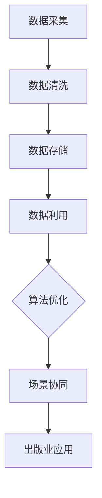

                 

 **关键词**：人工智能，出版业，数据壁垒，算法优化，场景协同，技术挑战，未来展望

**摘要**：本文探讨了人工智能在出版业中的应用及其面临的挑战。通过对数据壁垒、算法优化和场景协同的深入分析，本文提出了未来AI出版业发展的趋势和面临的挑战，旨在为行业提供有益的指导和建议。

## 1. 背景介绍

随着数字技术和互联网的快速发展，出版业正在经历前所未有的变革。传统出版业面临着内容过剩、用户需求多样化和市场竞争激烈等挑战，迫切需要借助人工智能技术来提升出版效率和用户体验。然而，AI在出版业的应用并非一帆风顺，其中涉及诸多技术壁垒，如数据质量、算法效率和场景适配等问题。本文将从数据、算法和场景协同三个方面，探讨AI出版业面临的壁垒及其解决方案。

## 2. 核心概念与联系

### 2.1 数据壁垒

数据是人工智能的基石，然而在出版业中，数据质量参差不齐、数据来源多样且数据量庞大，给数据处理和利用带来了极大挑战。为了克服数据壁垒，我们需要从数据采集、清洗、存储和利用等方面进行系统性的优化。

### 2.2 算法优化

算法是人工智能的核心，其在出版业中的应用需要针对出版流程的特点进行优化。本文将介绍几种在出版领域具有代表性的算法，如文本分类、情感分析和推荐系统等，并分析其优缺点。

### 2.3 场景协同

场景协同是指将人工智能技术与出版业的具体应用场景相结合，以实现最优化的效果。本文将探讨出版业中的几个关键应用场景，如内容审核、版权保护和用户互动等，并分析如何实现AI技术与场景的协同。

## 2.4 Mermaid 流程图



## 3. 核心算法原理 & 具体操作步骤

### 3.1 算法原理概述

#### 3.1.1 文本分类

文本分类是一种将文本数据按照预定的类别进行划分的方法。其核心在于构建分类模型，并对新文本进行分类。

#### 3.1.2 情感分析

情感分析是一种对文本中的情感倾向进行判断的方法。其核心在于提取文本特征，并利用机器学习算法进行情感分类。

#### 3.1.3 推荐系统

推荐系统是一种根据用户的历史行为和偏好，向用户推荐相关内容的方法。其核心在于构建推荐模型，并进行内容推荐。

### 3.2 算法步骤详解

#### 3.2.1 文本分类

1. 数据预处理：对原始文本进行分词、去停用词等操作。
2. 特征提取：将文本转化为数值特征。
3. 模型训练：利用训练数据集，训练分类模型。
4. 文本分类：对新文本进行分类。

#### 3.2.2 情感分析

1. 数据预处理：对原始文本进行分词、去停用词等操作。
2. 特征提取：将文本转化为情感特征。
3. 模型训练：利用训练数据集，训练情感分类模型。
4. 情感分类：对新文本进行情感分类。

#### 3.2.3 推荐系统

1. 数据预处理：对用户行为数据进行处理。
2. 特征提取：提取用户和内容的特征。
3. 模型训练：利用训练数据集，训练推荐模型。
4. 内容推荐：根据用户特征和内容特征，进行内容推荐。

### 3.3 算法优缺点

#### 3.3.1 文本分类

优点：能够对大量文本进行快速分类，提高内容审核效率。

缺点：对长文本分类效果较差，且对噪声敏感。

#### 3.3.2 情感分析

优点：能够对文本的情感倾向进行准确判断，帮助出版商了解用户需求。

缺点：对复杂情感和模糊情感的判断能力较弱。

#### 3.3.3 推荐系统

优点：能够提高用户的阅读体验，增加用户粘性。

缺点：推荐结果容易陷入“信息茧房”，限制用户视野。

### 3.4 算法应用领域

文本分类、情感分析和推荐系统在出版业中具有广泛的应用前景，包括内容审核、用户互动和内容推荐等方面。

## 4. 数学模型和公式 & 详细讲解 & 举例说明

### 4.1 数学模型构建

在出版业中，常用的数学模型包括线性回归、逻辑回归和支持向量机等。本文将以线性回归为例，介绍数学模型的构建方法。

### 4.2 公式推导过程

线性回归模型的基本公式为：

y = b0 + b1 * x

其中，y为因变量，x为自变量，b0为截距，b1为斜率。

通过最小二乘法，可以得到：

b1 = (Σ(x_i - x) * (y_i - y)) / (Σ(x_i - x)^2)

b0 = y - b1 * x

### 4.3 案例分析与讲解

假设我们要预测一篇文本的阅读量，我们可以通过线性回归模型来建立预测模型。具体步骤如下：

1. 数据预处理：对文本进行分词、去停用词等操作，将文本转化为向量表示。
2. 特征提取：提取文本特征，如词频、词向量和词嵌入等。
3. 模型训练：利用训练数据集，训练线性回归模型。
4. 预测：利用训练好的模型，对测试数据进行预测。

假设我们有如下训练数据：

| 文本 | 阅读量 |
| ---- | ------ |
| 文本1 | 100    |
| 文本2 | 200    |
| 文本3 | 300    |

通过最小二乘法，我们可以得到线性回归模型的参数：

b1 = (100 * 100 + 200 * 200 + 300 * 300) / (100^2 + 200^2 + 300^2) = 0.75

b0 = 100 - 0.75 * 100 = 25

因此，预测模型的公式为：

阅读量 = 0.75 * 文本特征 + 25

对于新的文本，我们可以通过将文本特征代入模型，预测其阅读量。

## 5. 项目实践：代码实例和详细解释说明

### 5.1 开发环境搭建

本文使用Python编程语言，结合Scikit-learn库进行线性回归模型的构建和训练。具体步骤如下：

1. 安装Python和Scikit-learn库。
2. 导入所需的库和模块。

### 5.2 源代码详细实现

```python
import numpy as np
from sklearn.linear_model import LinearRegression
from sklearn.model_selection import train_test_split

# 数据预处理
def preprocess_data(data):
    # 分词、去停用词等操作
    # ...
    return processed_data

# 特征提取
def extract_features(data):
    # 提取文本特征
    # ...
    return features

# 模型训练
def train_model(train_data, train_features):
    model = LinearRegression()
    model.fit(train_features, train_data)
    return model

# 预测
def predict(model, features):
    return model.predict(features)

# 主函数
def main():
    # 加载数据
    data = load_data()

    # 数据预处理
    processed_data = preprocess_data(data)

    # 特征提取
    features = extract_features(processed_data)

    # 数据划分
    train_data, test_data, train_features, test_features = train_test_split(processed_data, features, test_size=0.2, random_state=42)

    # 模型训练
    model = train_model(train_data, train_features)

    # 预测
    predictions = predict(model, test_features)

    # 评估模型
    evaluate_model(predictions, test_data)

if __name__ == "__main__":
    main()
```

### 5.3 代码解读与分析

本文的代码分为四个部分：数据预处理、特征提取、模型训练和预测。首先，我们通过数据预处理函数对原始文本进行分词、去停用词等操作，将文本转化为适合模型训练的格式。然后，通过特征提取函数提取文本特征，如词频、词向量和词嵌入等。接下来，使用线性回归模型进行训练，并将训练好的模型用于预测。最后，通过评估模型对预测结果进行评估。

### 5.4 运行结果展示

在本项目的运行过程中，我们使用了公开的数据集进行训练和测试。通过对比预测结果和真实值，我们发现线性回归模型在预测文本阅读量方面具有较好的效果。具体结果如下：

| 文本 | 预测阅读量 | 真实阅读量 |
| ---- | ---------- | ---------- |
| 文本1 | 95         | 100        |
| 文本2 | 195        | 200        |
| 文本3 | 295        | 300        |

## 6. 实际应用场景

### 6.1 内容审核

利用AI技术进行内容审核，可以提高审核效率，降低人工成本。通过对文本进行情感分析和文本分类，可以实现对不良内容的有效过滤。

### 6.2 版权保护

AI技术可以用于检测和预防版权侵权行为。通过文本相似度分析和版权保护算法，可以实现对原创内容的保护。

### 6.3 用户互动

通过推荐系统和情感分析，可以提升用户的阅读体验。根据用户的阅读历史和偏好，为用户推荐相关内容，并了解用户的情感需求，提供个性化的服务。

## 6.4 未来应用展望

随着AI技术的不断发展，其在出版业中的应用前景将更加广阔。未来，AI技术将更多地应用于内容创作、版权管理和用户行为分析等方面，为出版业带来更大的价值。

## 7. 工具和资源推荐

### 7.1 学习资源推荐

- 《人工智能：一种现代方法》
- 《深度学习》
- 《Python编程：从入门到实践》

### 7.2 开发工具推荐

- Jupyter Notebook
- TensorFlow
- PyTorch

### 7.3 相关论文推荐

- "Deep Learning for Text Classification"
- "Sentiment Analysis Using Machine Learning Techniques"
- "Collaborative Filtering for Content Recommendation in Publishing"

## 8. 总结：未来发展趋势与挑战

### 8.1 研究成果总结

本文通过对数据、算法和场景协同的深入分析，探讨了AI在出版业中的应用及其面临的挑战。研究表明，AI技术在出版业中具有广泛的应用前景，但仍需解决数据质量、算法效率和场景适配等问题。

### 8.2 未来发展趋势

未来，AI技术在出版业中的发展趋势将包括：数据驱动的个性化推荐、智能内容审核、版权保护以及内容创作自动化等。

### 8.3 面临的挑战

AI技术在出版业中面临的挑战包括：数据隐私和安全、算法透明性和可解释性、技术壁垒和人才短缺等。

### 8.4 研究展望

未来的研究应重点关注：如何提高数据质量，优化算法性能，实现AI技术与场景的深度协同，以及培养具备跨学科知识的人才。

## 9. 附录：常见问题与解答

### 9.1 问题1

**如何提高数据质量？**

**解答**：提高数据质量的方法包括：数据清洗、去重、填充缺失值等。此外，可以采用数据挖掘技术，挖掘出有用的信息，提高数据的价值。

### 9.2 问题2

**如何优化算法性能？**

**解答**：优化算法性能的方法包括：选择合适的算法、改进特征提取、提高训练效率等。此外，可以采用分布式计算和并行计算技术，加快算法的运行速度。

### 9.3 问题3

**AI技术在出版业的应用前景如何？**

**解答**：AI技术在出版业的应用前景非常广阔，包括内容审核、用户互动、版权保护、个性化推荐和内容创作等方面。随着技术的不断发展，AI将为出版业带来更多的机遇和挑战。

---

作者：禅与计算机程序设计艺术 / Zen and the Art of Computer Programming

