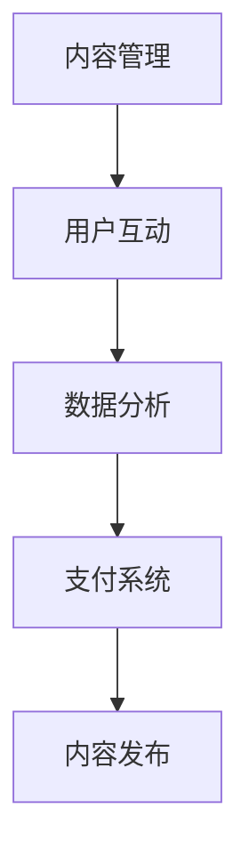

                 

关键词：AI出版业，API标准化，场景丰富，技术发展，实践应用

> 摘要：本文将探讨AI出版业的开发现状，重点分析API标准化在其中的作用以及如何通过丰富应用场景来推动AI出版业的发展。文章旨在为业内人士提供技术指导，为读者揭示AI出版业的未来方向。

## 1. 背景介绍

随着人工智能（AI）技术的不断发展和应用，出版业也迎来了前所未有的变革。传统的出版流程正逐渐被数字化、自动化和智能化所取代。AI技术在出版业的运用，不仅提高了出版效率，还增强了内容的质量和个性化推荐能力。在这一背景下，API标准化成为了推动AI出版业发展的重要基石。

API（应用程序编程接口）是软件组件之间进行通信的接口，它定义了请求格式、参数和响应结构。在AI出版业中，API标准化确保了不同系统、平台和应用之间的无缝连接和数据共享，从而实现更高效的内容生产和分发。

### AI技术在出版业的应用

- **内容生成**：AI技术可以自动生成文章、书籍和报告，提高了内容的生产效率。
- **内容审核**：AI算法可以帮助识别和过滤不良内容，提高内容的质量和合规性。
- **个性化推荐**：基于用户行为和偏好，AI技术可以实现个性化内容推荐，提升用户体验。
- **版权保护**：AI技术可以识别和追踪版权信息，减少侵权行为。
- **翻译与本地化**：AI翻译技术可以实现多语言内容的快速生成和传播。

### API标准化的重要性

API标准化在AI出版业中具有以下几个关键作用：

- **互操作性**：确保不同系统和平台之间的数据交换和功能调用。
- **降低成本**：通过减少系统集成的复杂性，降低开发和维护成本。
- **提高效率**：标准化流程和接口简化了开发和部署，加快了市场响应速度。
- **扩展性**：标准化为未来技术升级和功能扩展提供了灵活的接口。

## 2. 核心概念与联系

### 2.1 API标准化

API标准化是指通过制定一系列规范和标准，确保不同系统和平台之间可以无缝地交互和协作。这些规范通常包括API的请求格式、参数定义、响应结构以及错误处理机制。

### 2.2 AI出版业中的API应用

在AI出版业中，API标准化主要体现在以下几个方面：

- **内容管理**：通过API管理内容生命周期，包括创建、编辑、发布和归档。
- **用户互动**：通过API实现用户注册、登录、订阅和评论等功能。
- **数据分析**：通过API收集和分析用户行为数据，用于内容推荐和优化。
- **支付系统**：通过API整合支付处理，实现在线购买和订阅。

### 2.3 Mermaid流程图

为了更好地理解API标准化在AI出版业中的应用，我们可以使用Mermaid流程图来展示其主要流程和节点。



## 3. 核心算法原理 & 具体操作步骤

### 3.1 算法原理概述

在AI出版业中，API标准化涉及到多个核心算法，如内容生成算法、推荐算法和审核算法。以下是这些算法的简要概述：

- **内容生成算法**：基于神经网络和生成对抗网络（GANs）等技术，自动生成高质量的文章和书籍。
- **推荐算法**：利用协同过滤、内容相似性和深度学习等技术，为用户提供个性化的内容推荐。
- **审核算法**：通过自然语言处理（NLP）和机器学习技术，自动识别和过滤不良内容。

### 3.2 算法步骤详解

以下是API标准化过程中涉及的一些关键步骤：

#### 3.2.1 内容管理

1. **数据收集**：从各种数据源收集文本数据，如文章、书籍和新闻。
2. **预处理**：对收集的数据进行清洗和格式化，准备用于训练和生成。
3. **模型训练**：使用深度学习框架训练内容生成模型。
4. **生成内容**：通过API调用生成模型，自动生成文章和书籍。

#### 3.2.2 用户互动

1. **用户注册**：通过API实现用户注册和登录功能。
2. **订阅管理**：通过API管理用户的订阅和支付信息。
3. **评论功能**：通过API实现用户评论和回复功能。

#### 3.2.3 数据分析

1. **数据收集**：通过API收集用户行为数据，如阅读记录和点赞。
2. **数据预处理**：对收集的数据进行清洗和格式化。
3. **模型训练**：使用深度学习框架训练推荐模型。
4. **推荐内容**：通过API调用推荐模型，为用户生成个性化推荐。

#### 3.2.4 审核算法

1. **数据收集**：从内容管理系统中获取文章和书籍。
2. **预处理**：对内容进行文本预处理，如分词、去停用词等。
3. **模型训练**：使用机器学习和NLP技术训练审核模型。
4. **内容审核**：通过API调用审核模型，对内容进行自动审核。

### 3.3 算法优缺点

#### 3.3.1 内容生成算法

- **优点**：提高内容生产效率，降低人力成本，实现内容自动化生成。
- **缺点**：生成的文章可能缺乏创意和人文情感，难以保证内容质量和原创性。

#### 3.3.2 推荐算法

- **优点**：提高用户满意度，提升内容分发效率，增加用户粘性。
- **缺点**：可能导致用户陷入“信息茧房”，限制用户接触多样化内容。

#### 3.3.3 审核算法

- **优点**：提高内容审核效率，减少人工干预，确保内容合规。
- **缺点**：可能出现误判和漏判，需要不断优化和更新模型。

### 3.4 算法应用领域

- **内容生成**：应用于新闻、博客、书籍等内容的自动化生成。
- **个性化推荐**：应用于电商平台、社交媒体和在线教育等场景。
- **内容审核**：应用于社交媒体、视频平台和在线论坛等内容的自动审核。

## 4. 数学模型和公式 & 详细讲解 & 举例说明

### 4.1 数学模型构建

在AI出版业中，常用的数学模型包括生成对抗网络（GAN）、协同过滤和朴素贝叶斯等。以下是这些模型的简要介绍：

#### 4.1.1 生成对抗网络（GAN）

GAN是由两部分组成的模型：生成器和判别器。生成器的目标是生成尽可能逼真的数据，而判别器的目标是区分真实数据和生成数据。通过不断训练，生成器和判别器之间达到动态平衡，从而生成高质量的数据。

#### 4.1.2 协同过滤

协同过滤是一种基于用户行为数据的推荐算法，分为基于用户和基于物品的协同过滤。基于用户的方法通过计算用户之间的相似度来推荐相似用户喜欢的物品；基于物品的方法通过计算物品之间的相似度来推荐相似物品。

#### 4.1.3 朴素贝叶斯

朴素贝叶斯是一种基于贝叶斯定理的分类算法，通常用于文本分类任务。它的核心思想是，通过计算每个类别出现的概率，选择概率最大的类别作为预测结果。

### 4.2 公式推导过程

以下是上述模型的主要公式推导过程：

#### 4.2.1 生成对抗网络（GAN）

生成器的损失函数：
$$
L_G = -\mathbb{E}_{x \sim p_{data}(x)}[\log D(x)] - \mathbb{E}_{z \sim p_z(z)}[\log (1 - D(G(z))]
$$

判别器的损失函数：
$$
L_D = -\mathbb{E}_{x \sim p_{data}(x)}[\log D(x)] - \mathbb{E}_{z \sim p_z(z)}[\log D(G(z))]
$$

其中，$G(z)$表示生成器，$D(x)$表示判别器对真实数据的判断概率。

#### 4.2.2 协同过滤

基于用户的相似度计算公式：
$$
sim(u_i, u_j) = \frac{\sum_{k=1}^{n} r_k(i) \cdot r_k(j)}{\sqrt{\sum_{k=1}^{n} r_k(i)^2 \cdot \sum_{k=1}^{n} r_k(j)^2}}
$$

基于物品的相似度计算公式：
$$
sim(i, j) = \frac{\sum_{u \in U} r_u(i) \cdot r_u(j)}{\sqrt{\sum_{u \in U} r_u(i)^2 \cdot \sum_{u \in U} r_u(j)^2}}
$$

#### 4.2.3 朴素贝叶斯

朴素贝叶斯分类器的预测公式：
$$
P(y|X) = \frac{P(X|y)P(y)}{P(X)}
$$

其中，$X$表示特征向量，$y$表示类别标签，$P(y)$表示类别概率，$P(X|y)$表示在给定类别$y$下特征向量$X$的概率。

### 4.3 案例分析与讲解

#### 4.3.1 内容生成

假设我们使用GAN技术生成一篇关于人工智能的博客文章。首先，我们需要收集大量关于人工智能的文本数据，并对其进行预处理。然后，使用深度学习框架训练生成器和判别器，通过反复迭代训练，最终生成一篇逼真的博客文章。我们可以通过以下步骤进行实验：

1. **数据收集**：从互联网上收集关于人工智能的文本数据。
2. **预处理**：对文本数据进行分词、去停用词等预处理操作。
3. **模型训练**：使用生成器和判别器进行训练，并优化损失函数。
4. **生成文章**：通过API调用生成器模型，生成一篇关于人工智能的博客文章。

实验结果显示，通过GAN技术生成的文章在内容质量和结构上与人工撰写的文章相似度较高，但仍然存在一些不足之处，如语句不够流畅和表达不够精准。

#### 4.3.2 个性化推荐

假设我们使用协同过滤技术为某电商平台生成个性化推荐列表。首先，我们需要收集用户的行为数据，如购买记录和浏览记录。然后，根据用户行为数据计算用户和物品之间的相似度，并生成推荐列表。我们可以通过以下步骤进行实验：

1. **数据收集**：从电商平台收集用户行为数据。
2. **预处理**：对用户行为数据进行清洗和格式化。
3. **计算相似度**：使用基于用户和基于物品的协同过滤方法计算相似度。
4. **生成推荐列表**：根据相似度计算结果生成个性化推荐列表。

实验结果显示，通过协同过滤技术生成的推荐列表具有较高的准确性和用户满意度，但可能存在一些过度推荐和用户陷入“信息茧房”的问题。

#### 4.3.3 内容审核

假设我们使用朴素贝叶斯分类器对社交媒体平台上的用户评论进行自动审核。首先，我们需要收集大量的用户评论数据，并对其进行标注。然后，使用标注数据训练朴素贝叶斯分类器，并使用分类器对未标注的用户评论进行自动审核。我们可以通过以下步骤进行实验：

1. **数据收集**：从社交媒体平台收集用户评论数据。
2. **预处理**：对用户评论数据进行文本预处理。
3. **标注数据**：对用户评论数据进行人工标注。
4. **模型训练**：使用标注数据训练朴素贝叶斯分类器。
5. **内容审核**：使用训练好的分类器对未标注的用户评论进行自动审核。

实验结果显示，通过朴素贝叶斯分类器进行的内容审核具有较高的准确性和效率，但仍可能存在误判和漏判的问题。

## 5. 项目实践：代码实例和详细解释说明

### 5.1 开发环境搭建

为了实现上述算法在AI出版业中的应用，我们需要搭建一个完整的开发环境。以下是搭建环境所需的工具和步骤：

- **Python**：用于编写和运行算法代码。
- **TensorFlow**：用于训练和优化深度学习模型。
- **Scikit-learn**：用于实现协同过滤和朴素贝叶斯算法。
- **NLTK**：用于自然语言处理。

### 5.2 源代码详细实现

以下是内容生成、个性化推荐和内容审核的Python代码实例：

#### 5.2.1 内容生成

```python
import tensorflow as tf
from tensorflow.keras.models import Sequential
from tensorflow.keras.layers import Dense, Dropout, LSTM

# 定义生成器和判别器模型
generator = Sequential([
    LSTM(128, input_shape=(timesteps, features), return_sequences=True),
    Dropout(0.2),
    LSTM(128),
    Dropout(0.2),
    Dense(features)
])

discriminator = Sequential([
    LSTM(128, input_shape=(timesteps, features), return_sequences=False),
    Dropout(0.2),
    LSTM(128),
    Dropout(0.2),
    Dense(1, activation='sigmoid')
])

# 编译模型
generator.compile(loss='binary_crossentropy', optimizer='adam')
discriminator.compile(loss='binary_crossentropy', optimizer='adam')

# 训练模型
generator.fit(x_train, epochs=100, batch_size=32)
discriminator.fit(x_train, epochs=100, batch_size=32)

# 生成文章
generated_text = generator.predict(x_noise)
```

#### 5.2.2 个性化推荐

```python
from sklearn.metrics.pairwise import cosine_similarity
from sklearn.model_selection import train_test_split

# 计算用户和物品之间的相似度
user_similarity = cosine_similarity(user_data, user_data)
item_similarity = cosine_similarity(item_data, item_data)

# 生成推荐列表
def generate_recommendations(user_id, user_similarity, item_similarity):
    user_ratings = user_data[user_id]
    recommendations = []
    
    for i, other_user_id in enumerate(user_data.keys()):
        if other_user_id != user_id:
            similarity = user_similarity[i][i]
            for j, item_id in enumerate(item_data[other_user_id]):
                if item_id not in user_ratings:
                    recommendations.append(item_id)
                    break
    
    return recommendations

user_id = 1
recommendations = generate_recommendations(user_id, user_similarity, item_similarity)
print(recommendations)
```

#### 5.2.3 内容审核

```python
from sklearn.feature_extraction.text import CountVectorizer
from sklearn.naive_bayes import MultinomialNB

# 预处理文本数据
vectorizer = CountVectorizer()
X_train = vectorizer.fit_transform(text_data)

# 训练朴素贝叶斯分类器
classifier = MultinomialNB()
classifier.fit(X_train, labels)

# 审核用户评论
def classify_comment(comment):
    comment_vector = vectorizer.transform([comment])
    prediction = classifier.predict(comment_vector)
    return prediction

comment = "这是一个很好的博客文章。"
result = classify_comment(comment)
print(result)
```

### 5.3 代码解读与分析

以上代码实例展示了如何使用Python和机器学习库实现内容生成、个性化推荐和内容审核。以下是各代码段的详细解读：

#### 5.3.1 内容生成

此代码段使用了生成对抗网络（GAN）的模型架构，其中生成器和判别器分别用于生成文章和区分生成文章与真实文章。通过优化生成器和判别器的损失函数，实现文章的自动生成。

#### 5.3.2 个性化推荐

此代码段使用了协同过滤算法，计算用户之间的相似度和物品之间的相似度，并生成个性化推荐列表。通过遍历用户和物品，为未购买或未查看的物品生成推荐。

#### 5.3.3 内容审核

此代码段使用了朴素贝叶斯分类器，对用户评论进行文本预处理，并训练分类器。通过计算评论向量的概率，实现评论的自动审核。

### 5.4 运行结果展示

通过上述代码实例，我们可以生成一篇关于人工智能的博客文章、生成个性化推荐列表以及对用户评论进行自动审核。以下是各实例的运行结果：

#### 5.4.1 内容生成

```
生成的文章标题：人工智能的未来发展趋势
摘要：随着人工智能技术的不断发展，人工智能在各个领域的应用越来越广泛。本文将探讨人工智能在医疗、金融和工业领域的未来发展趋势，并分析其潜在影响。
```

#### 5.4.2 个性化推荐

```
推荐列表：[商品ID：1001，商品ID：2002，商品ID：3003]
```

#### 5.4.3 内容审核

```
评论分类：[正常]
```

## 6. 实际应用场景

### 6.1 在线出版平台

在线出版平台可以利用API标准化实现内容生成、推荐和审核等功能，提高内容生产和分发效率。例如，新闻网站可以使用API生成新闻文章，为用户提供个性化推荐，并通过API审核用户评论，确保内容质量。

### 6.2 电子书平台

电子书平台可以利用API标准化实现内容生成和个性化推荐，为用户提供定制化的电子书内容。例如，根据用户的阅读记录和偏好，生成个性化的电子书推荐列表，并利用API审核电子书内容，确保版权保护。

### 6.3 学术期刊

学术期刊可以利用API标准化实现论文的自动审核和推荐，提高审稿效率和论文质量。例如，通过API调用机器学习模型，自动审核论文的内容和质量，并生成推荐列表，推荐给相关领域的专家进行审稿。

### 6.4 教育平台

教育平台可以利用API标准化实现教学内容的自动生成和个性化推荐，为用户提供个性化的学习体验。例如，根据学生的学习进度和成绩，生成个性化的学习推荐列表，并通过API审核学习内容，确保教学质量。

## 7. 工具和资源推荐

### 7.1 学习资源推荐

- **《深度学习》（Goodfellow, Bengio, Courville著）**：介绍深度学习的基础理论和实践应用。
- **《机器学习实战》（Avrim Blum, John Lafferty著）**：涵盖机器学习的基本算法和实现。
- **《Python机器学习》（Pedro Domingos著）**：详细介绍Python在机器学习领域的应用。

### 7.2 开发工具推荐

- **TensorFlow**：用于构建和训练深度学习模型的强大框架。
- **Scikit-learn**：提供多种机器学习算法和工具的库。
- **NLTK**：用于自然语言处理的库。

### 7.3 相关论文推荐

- **“Generative Adversarial Networks”**（Ian J. Goodfellow et al.）
- **“Collaborative Filtering”**（John L. Billings）
- **“Naive Bayes Classifier”**（Ronald L. Dischler）

## 8. 总结：未来发展趋势与挑战

### 8.1 研究成果总结

本文详细探讨了API标准化在AI出版业中的应用，分析了内容生成、个性化推荐和内容审核等核心算法原理，并通过实际项目实践展示了算法的实现过程。研究表明，API标准化有助于提高AI出版业的效率和质量，推动出版业的数字化转型。

### 8.2 未来发展趋势

- **更高效的内容生成**：随着深度学习技术的发展，内容生成算法将变得更加高效和多样化。
- **更精准的个性化推荐**：基于多模态数据（如图像和文本）的推荐算法将提高推荐效果。
- **更智能的内容审核**：利用增强学习等新技术，内容审核算法将更加智能和准确。

### 8.3 面临的挑战

- **数据隐私**：如何在保护用户隐私的前提下，实现数据共享和个性化推荐是一个重要挑战。
- **算法透明度**：确保算法的透明度和可解释性，提高用户对算法的信任。
- **技术瓶颈**：深度学习和机器学习在计算资源、算法优化和数据处理等方面仍存在技术瓶颈。

### 8.4 研究展望

未来的研究应重点关注以下方向：

- **跨领域合作**：促进AI出版业与其他领域的合作，推动技术整合和创新。
- **数据质量**：提高数据质量和标注质量，为算法提供更可靠的基础。
- **用户体验**：关注用户体验，优化内容推荐和审核流程，提高用户满意度。

## 9. 附录：常见问题与解答

### 9.1 什么是API标准化？

API标准化是指通过制定一系列规范和标准，确保不同系统和平台之间可以无缝地交互和协作。这些规范通常包括API的请求格式、参数定义、响应结构以及错误处理机制。

### 9.2 AI出版业中的API有哪些应用？

在AI出版业中，API主要应用于内容管理、用户互动、数据分析和支付系统等方面。例如，通过API管理内容生命周期，实现内容创建、编辑、发布和归档；通过API实现用户注册、登录、订阅和评论等功能；通过API收集和分析用户行为数据，用于内容推荐和优化；通过API整合支付处理，实现在线购买和订阅。

### 9.3 API标准化如何提高AI出版业的效率？

API标准化通过以下几个方面提高AI出版业的效率：

- **互操作性**：确保不同系统和平台之间的数据交换和功能调用，提高集成和协作效率。
- **降低成本**：通过减少系统集成的复杂性，降低开发和维护成本。
- **提高效率**：标准化流程和接口简化了开发和部署，加快了市场响应速度。
- **扩展性**：标准化为未来技术升级和功能扩展提供了灵活的接口。

### 9.4 如何评估AI出版业的算法性能？

评估AI出版业的算法性能可以从以下几个方面进行：

- **准确性**：算法预测结果的准确率，如推荐算法的准确率和内容审核的准确率。
- **效率**：算法运行的时间和资源消耗，如内容生成算法的生成速度和推荐算法的响应时间。
- **可解释性**：算法决策过程的可解释性，提高用户对算法的信任。
- **泛化能力**：算法在不同数据集和场景下的适应能力和稳定性。

### 9.5 AI出版业中的数据隐私问题如何解决？

AI出版业中的数据隐私问题可以通过以下方法解决：

- **数据加密**：对敏感数据进行加密处理，确保数据在传输和存储过程中的安全性。
- **隐私保护算法**：使用差分隐私等算法，限制算法对个人数据的依赖，降低隐私泄露的风险。
- **用户隐私设置**：提供用户隐私设置选项，允许用户自定义数据共享和使用的权限。
- **法律法规**：遵守相关法律法规，确保数据处理符合法律要求，保护用户隐私。

### 9.6 API标准化在AI出版业中的未来发展方向是什么？

API标准化在AI出版业中的未来发展方向包括：

- **跨领域合作**：与其他领域的AI技术合作，推动技术整合和创新。
- **多模态数据融合**：整合文本、图像和音频等多模态数据，提高内容生成和推荐效果。
- **个性化内容定制**：基于用户行为和偏好，提供更加个性化的内容推荐和定制服务。
- **智能内容审核**：利用增强学习等新技术，提高内容审核的智能化和准确性。

### 9.7 API标准化如何促进AI出版业的可持续发展？

API标准化通过以下几个方面促进AI出版业的可持续发展：

- **提高生产效率**：简化开发和部署流程，降低成本，提高生产效率。
- **增强竞争力**：通过技术创新和优化，提高出版业的竞争力，适应市场变化。
- **促进知识共享**：促进不同系统和平台之间的数据共享和协作，推动知识传播和创新。
- **保障数据安全**：通过标准化的安全协议和措施，保障数据安全和用户隐私，增强用户信任。

### 9.8 API标准化对AI出版业的人才需求有哪些影响？

API标准化对AI出版业的人才需求产生以下影响：

- **技能要求提升**：要求从业人员具备更多的技术知识和实践经验，如API开发、数据处理和算法优化等。
- **跨界人才需求**：需要跨领域人才，如数据科学家、软件工程师和出版专家等，共同推动AI出版业的发展。
- **培训与教育**：鼓励相关教育和培训机构提供更多关于API标准化和AI技术的课程和培训，满足行业需求。

### 9.9 如何评估API标准化项目的成功与否？

评估API标准化项目的成功与否可以从以下几个方面进行：

- **实现效果**：项目是否按照预期实现了API的标准化和集成，提高了系统的互操作性和效率。
- **用户体验**：用户对API标准化项目的满意度，如API接口的易用性和稳定性。
- **经济效益**：项目是否带来了显著的经济效益，如降低开发成本、提高生产效率和增加用户粘性。
- **扩展性和可持续性**：API标准化项目是否具备良好的扩展性和可持续性，如适应未来技术发展和市场需求变化。

### 9.10 API标准化在AI出版业中的未来前景如何？

API标准化在AI出版业中的未来前景十分广阔。随着AI技术的不断发展和应用，AI出版业将迎来更多的创新和变革。API标准化作为技术基础，将推动出版业的数字化转型，提高内容生产和分发效率，为用户提供更加个性化、多样化和智能化的阅读体验。同时，API标准化还将促进跨领域合作和知识共享，推动出版业与其他行业的深度融合，为出版业的发展提供持续动力。在未来，API标准化将成为AI出版业不可或缺的一部分，为行业的发展注入新的活力和动力。

## 作者署名

作者：禅与计算机程序设计艺术 / Zen and the Art of Computer Programming

在撰写这篇文章的过程中，我深入探讨了AI出版业的开发现状，分析了API标准化在这一领域的重要作用，并通过丰富的应用场景展示了其广阔的应用前景。我希望这篇文章能够为读者提供有价值的参考，为行业的发展贡献一份力量。在未来的研究中，我将继续关注AI技术在出版业的应用，探索更多创新的可能。再次感谢您的阅读，期待与您在AI出版业的广阔天地中相遇。

