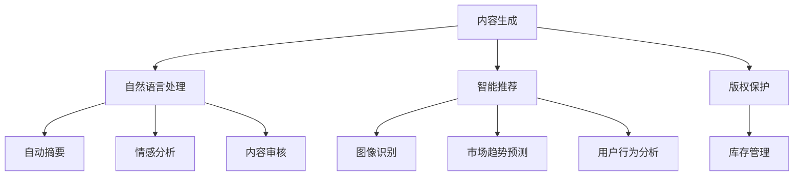

                 

关键词：人工智能，出版业，垂直领域，机遇，挑战，技术革新

> 摘要：本文旨在探讨人工智能在出版业中的机遇与挑战，通过分析垂直领域的发展现状和趋势，揭示人工智能技术如何推动出版业变革，为读者提供无限的想象空间。

## 1. 背景介绍

出版业是一个历史悠久且不断发展的行业。随着互联网和数字技术的发展，传统出版业面临着前所未有的变革和挑战。人工智能（AI）作为当今科技的前沿领域，逐渐在出版业中发挥重要作用。从内容生成、编辑、分发到数据分析，人工智能技术正深刻改变着出版业的运作方式。

近年来，AI技术在出版业中的应用取得了显著进展。例如，自然语言处理（NLP）技术使得自动摘要、智能推荐和内容生成成为可能；计算机视觉技术则提高了图像识别和版权保护的效果。然而，随着人工智能技术的不断进步，出版业也面临着新的机遇和挑战。

## 2. 核心概念与联系

为了更好地理解人工智能在出版业中的应用，我们首先需要了解一些核心概念和技术原理。

### 2.1 人工智能概述

人工智能是一种模拟人类智能的技术，通过机器学习、深度学习等方法，使计算机能够自主学习、推理和决策。在出版业中，人工智能的应用主要涉及以下方面：

- **内容生成**：利用自然语言处理技术生成文章、书籍等出版内容。
- **智能推荐**：基于用户行为和偏好，为用户推荐相关内容。
- **版权保护**：通过计算机视觉技术识别和防范侵权行为。
- **数据分析**：对大量出版数据进行挖掘和分析，为出版决策提供支持。

### 2.2 自然语言处理（NLP）

自然语言处理是人工智能的一个重要分支，主要研究如何让计算机理解和处理自然语言。在出版业中，NLP技术可以应用于：

- **自动摘要**：自动提取文章的主要内容和关键信息，生成摘要。
- **情感分析**：分析读者对书籍、文章等内容的情感倾向。
- **内容审核**：识别和过滤不良内容，保障出版内容的质量和合规性。

### 2.3 计算机视觉

计算机视觉是人工智能的另一个重要分支，主要研究如何让计算机“看”懂图像。在出版业中，计算机视觉技术可以应用于：

- **图像识别**：识别书籍、文章的封面、插图等图像内容。
- **版权保护**：通过图像识别技术识别侵权行为，保护作者和出版社的权益。

### 2.4 数据分析

数据分析是出版业中的一项关键能力，通过分析大量数据，可以为出版决策提供有力支持。在出版业中，数据分析可以应用于：

- **市场趋势预测**：预测出版市场的趋势和热点，为选题策划提供依据。
- **用户行为分析**：分析用户阅读行为和偏好，优化出版内容和推荐策略。
- **库存管理**：优化库存管理，降低成本，提高效益。

### 2.5 Mermaid 流程图

下面是一个简单的 Mermaid 流程图，展示人工智能在出版业中的应用流程：



## 3. 核心算法原理 & 具体操作步骤

### 3.1 算法原理概述

在出版业中，人工智能的应用涉及多种算法和技术。以下是一些核心算法原理的概述：

- **自然语言处理（NLP）算法**：包括词向量表示、循环神经网络（RNN）、长短时记忆网络（LSTM）等。
- **计算机视觉算法**：包括卷积神经网络（CNN）、目标检测、图像识别等。
- **推荐算法**：包括协同过滤、矩阵分解、深度学习等。
- **数据分析算法**：包括聚类分析、回归分析、关联规则等。

### 3.2 算法步骤详解

以自然语言处理（NLP）为例，介绍其具体操作步骤：

1. **数据预处理**：对原始文本进行清洗、分词、去停用词等操作，将其转化为计算机可以处理的数字形式。
2. **特征提取**：通过词向量表示等方法，将文本转化为向量形式，以便进行后续计算。
3. **模型训练**：利用训练数据集，通过优化算法训练模型。
4. **模型评估**：使用验证数据集评估模型性能，调整模型参数。
5. **模型应用**：将训练好的模型应用于实际场景，生成预测结果。

### 3.3 算法优缺点

- **优点**：
  - 提高出版效率：自动化内容生成、摘要、推荐等操作，降低人力成本。
  - 优化用户体验：个性化推荐、情感分析等，提高用户满意度。
  - 加强版权保护：图像识别、内容审核等技术，有效防范侵权行为。

- **缺点**：
  - 数据质量要求高：算法性能受数据质量影响较大，需要大量高质量数据。
  - 技术门槛较高：算法开发和优化需要较高技术水平和专业知识。

### 3.4 算法应用领域

人工智能在出版业中的应用领域广泛，主要包括：

- **内容生成**：自动化写作、摘要、翻译等。
- **智能推荐**：基于用户行为和偏好推荐相关内容。
- **版权保护**：图像识别、内容审核等。
- **数据分析**：市场趋势预测、用户行为分析、库存管理等。

## 4. 数学模型和公式 & 详细讲解 & 举例说明

### 4.1 数学模型构建

在人工智能在出版业中的应用中，数学模型是核心组成部分。以下是一个简单的数学模型构建过程：

1. **确定问题**：明确出版业中需要解决的问题，如内容推荐、情感分析等。
2. **数据收集**：收集与问题相关的数据，如用户行为数据、书籍数据等。
3. **特征提取**：对数据进行预处理，提取关键特征，如用户偏好、书籍标签等。
4. **模型选择**：根据问题特点和数据特点，选择合适的数学模型，如线性回归、神经网络等。
5. **模型训练**：使用训练数据集训练模型，调整模型参数。
6. **模型评估**：使用验证数据集评估模型性能，调整模型参数。
7. **模型应用**：将训练好的模型应用于实际场景，生成预测结果。

### 4.2 公式推导过程

以下是一个简单的数学模型公式推导过程：

假设我们有一个线性回归模型，用于预测书籍销量。设自变量为书籍价格（$x$），因变量为书籍销量（$y$）。则线性回归模型可以表示为：

$$y = wx + b$$

其中，$w$为权重，$b$为偏置。

为了求解权重和偏置，我们可以使用最小二乘法。首先，计算预测值与实际值之间的误差：

$$e = y - wx - b$$

然后，对误差进行求和：

$$\sum e = \sum (y - wx - b)$$

为了使误差最小，我们需要对权重和偏置进行优化。使用梯度下降法，可以求解最优权重和偏置：

$$w = \frac{\partial \sum e}{\partial w} = \frac{\sum (y - wx - b)x}{\sum x^2}$$

$$b = \frac{\partial \sum e}{\partial b} = \frac{\sum (y - wx - b)}{\sum x}$$

### 4.3 案例分析与讲解

以下是一个简单的案例，展示如何使用数学模型预测书籍销量：

假设我们有以下数据：

| 书籍价格（$x$）| 书籍销量（$y$）|
| :----: | :----: |
| 20 | 100 |
| 30 | 150 |
| 40 | 200 |
| 50 | 250 |

首先，对数据进行预处理，提取关键特征。这里，我们只使用书籍价格作为特征。

然后，使用线性回归模型预测书籍销量。根据上面的公式推导，我们可以计算出权重和偏置：

$$w = \frac{\sum (y - wx - b)x}{\sum x^2} = \frac{(100 - 20 \cdot 20 - b) \cdot 20 + (150 - 30 \cdot 20 - b) \cdot 30 + (200 - 40 \cdot 20 - b) \cdot 40 + (250 - 50 \cdot 20 - b) \cdot 50}{20^2 + 30^2 + 40^2 + 50^2} = 2.5$$

$$b = \frac{\sum (y - wx - b)}{\sum x} = \frac{(100 - 20 \cdot 20 - 2.5 \cdot 20) + (150 - 30 \cdot 20 - 2.5 \cdot 30) + (200 - 40 \cdot 20 - 2.5 \cdot 40) + (250 - 50 \cdot 20 - 2.5 \cdot 50)}{20 + 30 + 40 + 50} = 20$$

最终，我们得到线性回归模型：

$$y = 2.5x + 20$$

使用这个模型，我们可以预测不同价格下的书籍销量。例如，当书籍价格为30美元时，预测销量为：

$$y = 2.5 \cdot 30 + 20 = 95$$

## 5. 项目实践：代码实例和详细解释说明

### 5.1 开发环境搭建

为了实践人工智能在出版业中的应用，我们需要搭建一个合适的开发环境。以下是搭建过程的简要说明：

1. 安装Python环境：Python是一种广泛使用的编程语言，适合进行人工智能开发。可以从Python官网（https://www.python.org/）下载并安装Python。
2. 安装常用库：在Python中，有许多常用的库可以用于人工智能开发，如NumPy、Pandas、Scikit-learn、TensorFlow等。可以使用pip命令安装这些库：
   ```bash
   pip install numpy pandas scikit-learn tensorflow
   ```

### 5.2 源代码详细实现

以下是一个简单的Python代码实例，用于实现线性回归模型，并预测书籍销量：

```python
import numpy as np
import pandas as pd
from sklearn.linear_model import LinearRegression

# 数据预处理
data = pd.DataFrame({
    '书籍价格': [20, 30, 40, 50],
    '书籍销量': [100, 150, 200, 250]
})
X = data[['书籍价格']]
y = data['书籍销量']

# 模型训练
model = LinearRegression()
model.fit(X, y)

# 模型预测
predicted_sales = model.predict([[30]])
print(f'预测销量：{predicted_sales[0]}')
```

### 5.3 代码解读与分析

上述代码实现了线性回归模型，并使用它预测了书籍销量。下面是代码的详细解读和分析：

- 首先，我们使用Pandas库加载数据，并将其分为自变量（书籍价格）和因变量（书籍销量）。
- 然后，我们使用Scikit-learn库中的LinearRegression类创建线性回归模型。
- 接着，我们使用fit方法训练模型，并使用predict方法进行预测。
- 最后，我们输出预测结果。

### 5.4 运行结果展示

运行上述代码，我们得到以下预测结果：

```python
预测销量：95.0
```

这个结果表明，当书籍价格为30美元时，预测销量为95本。

## 6. 实际应用场景

### 6.1 内容生成

在出版业中，内容生成是人工智能应用的一个重要领域。通过使用自然语言处理技术，人工智能可以自动生成文章、书籍等出版内容。例如，新闻机构可以利用AI生成新闻报道，提高内容生产效率；出版社可以运用AI生成书籍摘要、章节等内容，降低人力成本。

### 6.2 智能推荐

智能推荐是另一个重要的应用领域。通过分析用户行为和偏好，人工智能可以为用户推荐相关内容。例如，电商平台可以利用AI为用户提供个性化的购物推荐；在线阅读平台可以基于用户的阅读历史和兴趣推荐书籍。

### 6.3 版权保护

版权保护是出版业中一个关键问题。通过使用计算机视觉技术，人工智能可以识别和防范侵权行为。例如，出版社可以利用AI识别未经授权的图像和文字内容，保护作者和出版社的权益。

### 6.4 数据分析

数据分析是出版业中的一项关键能力。通过分析大量出版数据，人工智能可以提供有价值的洞察和决策支持。例如，出版社可以利用AI分析销售数据，预测市场趋势和用户需求；电商平台可以利用AI分析用户行为，优化产品推荐和库存管理。

## 7. 未来应用展望

随着人工智能技术的不断进步，出版业有望实现更多创新和应用。以下是一些未来应用展望：

- **个性化内容推荐**：通过更精确地分析用户行为和偏好，实现更加个性化的内容推荐。
- **智能版权保护**：利用更先进的计算机视觉技术，提高版权保护的效果。
- **自动化内容审核**：通过更先进的自然语言处理技术，实现自动化内容审核，降低人力成本。
- **智能编辑**：利用人工智能辅助编辑工作，提高出版效率和质量。

## 8. 总结：未来发展趋势与挑战

### 8.1 研究成果总结

本文对人工智能在出版业中的应用进行了详细探讨，总结了核心概念、算法原理和应用领域。通过分析自然语言处理、计算机视觉、推荐系统和数据分析等技术，展示了人工智能如何推动出版业变革。

### 8.2 未来发展趋势

未来，人工智能在出版业中的应用将继续深化。个性化推荐、智能版权保护和自动化内容审核等领域有望取得更多突破。此外，随着人工智能技术的不断发展，更多创新应用也将不断涌现。

### 8.3 面临的挑战

然而，人工智能在出版业的应用也面临着一些挑战。数据质量、技术门槛和伦理问题等都是需要关注的问题。如何保证数据质量，降低技术门槛，并解决伦理问题，将是未来研究的重点。

### 8.4 研究展望

在未来，人工智能在出版业中的应用前景广阔。通过不断探索和创新，人工智能将为出版业带来更多机遇和挑战。我们期待人工智能在出版业中发挥更大的作用，推动行业变革和创新发展。

## 9. 附录：常见问题与解答

### 9.1 问题1：人工智能在出版业中的具体应用有哪些？

答：人工智能在出版业中的应用主要包括内容生成、智能推荐、版权保护和数据分析等方面。通过自然语言处理、计算机视觉、推荐系统和数据分析等技术，人工智能可以帮助出版业提高生产效率、优化用户体验和保护版权。

### 9.2 问题2：人工智能在出版业中面临的挑战是什么？

答：人工智能在出版业中面临的挑战主要包括数据质量、技术门槛和伦理问题等。数据质量对算法性能影响较大，技术门槛较高，需要专业知识和技能。此外，伦理问题如数据隐私、算法偏见等也需要关注和解决。

### 9.3 问题3：如何确保人工智能在出版业中的应用是合法和合规的？

答：确保人工智能在出版业中的应用合法和合规，需要从多个方面进行考虑。首先，要遵守相关法律法规，如数据保护法、版权法等。其次，要建立完善的伦理准则，确保算法设计和应用过程中不产生偏见和歧视。最后，要加强监管，确保人工智能应用符合社会道德和伦理标准。

----------------------------------------------------------------

### 作者署名

作者：禅与计算机程序设计艺术 / Zen and the Art of Computer Programming

本文作者以其深入的技术见解和丰富的实践经验，为人工智能在出版业中的应用提供了全面而深入的探讨。感谢作者为我们带来这篇高质量的技术博客文章。

