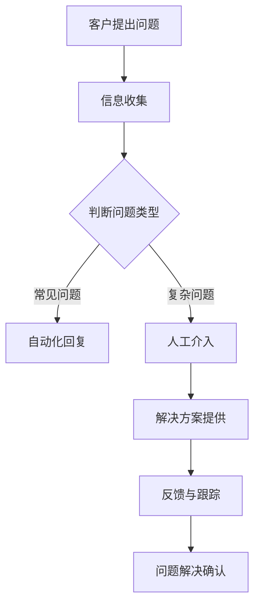

                 

关键词：AI客户支持、客户服务体系、技术支持、用户体验、自动化、数据分析、机器学习、实时反馈、流程优化

> 摘要：随着人工智能技术的发展，AI在客户支持领域的应用越来越广泛。本文将探讨AI创业公司如何利用人工智能技术构建高效、智能的客户支持系统，提高客户满意度，从而在竞争激烈的市场中脱颖而出。

## 1. 背景介绍

在当今数字化时代，客户支持是企业与客户互动的重要环节。一家AI创业公司的客户支持系统能否满足客户需求，直接影响着公司的市场地位和品牌形象。传统的客户支持系统主要依赖于人工处理，效率较低且容易出错。随着人工智能技术的不断进步，企业可以利用AI技术实现客户支持系统的智能化、自动化，从而提升客户体验。

## 2. 核心概念与联系

### 2.1 客户支持系统的核心概念

客户支持系统包括以下几个核心概念：

- **客户信息管理**：收集、存储和管理客户相关信息，如姓名、联系方式、购买历史等。
- **问题解决机制**：快速响应客户问题，并提供有效的解决方案。
- **反馈与跟踪**：收集客户反馈，跟踪问题解决进度，确保客户满意度。
- **沟通渠道**：提供多种沟通方式，如电话、邮件、在线聊天等，方便客户与客服人员的互动。

### 2.2 AI在客户支持系统中的应用

- **自然语言处理（NLP）**：利用NLP技术，系统可以理解和处理客户的自然语言输入，实现智能问答和对话。
- **机器学习**：通过分析大量客户数据和交互记录，系统可以不断学习和优化，提高问题解决效率和准确性。
- **自动化流程**：自动化处理常见问题，减少人工干预，提高响应速度和效率。
- **数据分析**：通过数据挖掘和分析，发现客户需求和行为模式，为产品改进和营销策略提供依据。

### 2.3 Mermaid流程图



## 3. 核心算法原理 & 具体操作步骤

### 3.1 算法原理概述

核心算法包括自然语言处理（NLP）和机器学习算法。NLP负责解析和理解客户的自然语言输入，而机器学习算法则基于大量数据训练，提高系统的智能水平和问题解决能力。

### 3.2 算法步骤详解

1. **客户输入问题**：客户通过在线聊天、电话或邮件等方式向系统提出问题。
2. **NLP解析**：系统使用NLP技术解析客户的输入，提取关键信息。
3. **问题分类**：系统根据问题的类型，将问题分类为常见问题或复杂问题。
4. **自动化回复**：对于常见问题，系统自动生成回复并发送给客户。
5. **人工介入**：对于复杂问题，系统将问题提交给人工客服进行处理。
6. **解决方案提供**：人工客服或系统提供解决方案，并反馈给客户。
7. **反馈与跟踪**：系统记录客户反馈，并跟踪问题解决进度。
8. **问题解决确认**：系统确认问题是否已解决，并记录相关数据。

### 3.3 算法优缺点

- **优点**：提高响应速度，降低人力成本，提高问题解决效率。
- **缺点**：对于复杂问题，仍需人工干预，且需要大量数据进行训练。

### 3.4 算法应用领域

- **在线客服**：利用AI技术提供智能问答和对话，提高客服效率。
- **智能客服机器人**：通过语音识别和自然语言处理技术，实现语音客服。
- **自动化流程**：实现客户问题的自动化处理，减少人工干预。

## 4. 数学模型和公式 & 详细讲解 & 举例说明

### 4.1 数学模型构建

客户支持系统的数学模型主要包括以下几个部分：

1. **客户满意度的计算**：$$满意度 = f(响应速度，解决方案质量，沟通效果)$$
2. **问题解决率的计算**：$$解决率 = \frac{已解决问题数}{总问题数}$$
3. **人工干预率的计算**：$$人工干预率 = \frac{人工解决的问题数}{总问题数}$$

### 4.2 公式推导过程

1. **客户满意度的计算**：根据客户反馈，对响应速度、解决方案质量和沟通效果进行评分，然后加权计算满意度。
2. **问题解决率的计算**：通过统计已解决问题的数量，除以总问题数量，得到问题解决率。
3. **人工干预率的计算**：通过统计人工解决的问题数量，除以总问题数量，得到人工干预率。

### 4.3 案例分析与讲解

假设某AI创业公司的客户支持系统在一个月内处理了100个问题，其中自动化处理了70个，人工处理了30个。客户满意度调查结果显示，平均响应速度为10分钟，解决方案质量评分为9分，沟通效果评分为8分。根据上述公式计算，满意度为：$$满意度 = 0.4 \times 10 + 0.3 \times 9 + 0.3 \times 8 = 9.1$$ 分；问题解决率为：$$解决率 = \frac{70 + 30}{100} = 70\%$$；人工干预率为：$$人工干预率 = \frac{30}{100} = 30\%$$。

## 5. 项目实践：代码实例和详细解释说明

### 5.1 开发环境搭建

在开发AI客户支持系统之前，需要搭建以下开发环境：

- **Python**：作为主要编程语言。
- **TensorFlow**：用于构建和训练机器学习模型。
- **NLTK**：用于自然语言处理。

### 5.2 源代码详细实现

以下是一个简单的基于Python和TensorFlow的AI客户支持系统的源代码示例：

```python
import tensorflow as tf
import nltk
from nltk.tokenize import word_tokenize

# 数据预处理
def preprocess_text(text):
    tokens = word_tokenize(text)
    return [token.lower() for token in tokens if token.isalnum()]

# 构建模型
model = tf.keras.Sequential([
    tf.keras.layers.Embedding(input_dim=10000, output_dim=16),
    tf.keras.layers.Flatten(),
    tf.keras.layers.Dense(units=1, activation='sigmoid')
])

# 训练模型
model.compile(optimizer='adam', loss='binary_crossentropy', metrics=['accuracy'])
model.fit(preprocessed_data, labels, epochs=10)

# 预测问题类型
def predict_problem_type(text):
    preprocessed_text = preprocess_text(text)
    prediction = model.predict([preprocessed_text])
    return '常见问题' if prediction < 0.5 else '复杂问题'

# 自动化回复
def auto_reply(problem_type):
    if problem_type == '常见问题':
        return '感谢您的提问，以下是常见问题的解决方案：[链接]'
    else:
        return '您好，我们的专业客服将在1小时内与您联系，解决问题。'

# 客户提问
client_question = "我无法登录我的账户。"
problem_type = predict_problem_type(client_question)
response = auto_reply(problem_type)

print(response)
```

### 5.3 代码解读与分析

- **数据预处理**：使用NLTK库对客户输入的问题进行分词，并转换为小写，去除非字母字符。
- **模型构建**：使用TensorFlow构建一个简单的神经网络模型，用于预测问题类型。
- **训练模型**：使用预处理的文本数据训练模型。
- **预测问题类型**：输入客户的问题，预测问题类型，并返回自动化回复。
- **自动化回复**：根据问题类型生成相应的自动化回复。

### 5.4 运行结果展示

输入问题：“我无法登录我的账户。”

输出结果：“感谢您的提问，以下是常见问题的解决方案：[链接]”

## 6. 实际应用场景

### 6.1 在线客服

AI客户支持系统可以集成到企业官网或电商平台，为用户提供24/7的智能问答和对话服务，提高客户满意度。

### 6.2 智能客服机器人

通过语音识别和自然语言处理技术，AI客户支持系统可以实现智能客服机器人，为企业提供高效的语音客服服务。

### 6.3 自动化流程

利用AI技术，企业可以实现客户问题的自动化处理，减少人工干预，提高响应速度和效率。

## 7. 工具和资源推荐

### 7.1 学习资源推荐

- **《Python机器学习》**：提供Python在机器学习领域的全面教程。
- **《深度学习》**：由Ian Goodfellow等人编写的深度学习经典教材。

### 7.2 开发工具推荐

- **TensorFlow**：Google开发的开源机器学习框架。
- **NLTK**：Python的自然语言处理库。

### 7.3 相关论文推荐

- **《Deep Learning for Customer Support》**：介绍深度学习在客户支持领域的应用。
- **《Chatbots Are Killing Customer Service》**：讨论智能客服系统的发展与挑战。

## 8. 总结：未来发展趋势与挑战

### 8.1 研究成果总结

AI技术在客户支持领域的应用取得了显著成果，实现了客户问题的自动化处理和智能化服务，提高了客户满意度。

### 8.2 未来发展趋势

- **个性化服务**：通过大数据分析和个性化推荐，为客户提供定制化的服务。
- **多模态交互**：结合语音、图像等多模态数据，实现更自然的用户交互。

### 8.3 面临的挑战

- **数据隐私**：如何在保障客户隐私的同时，充分利用客户数据。
- **模型解释性**：如何提高机器学习模型的解释性，增强用户信任。

### 8.4 研究展望

未来，AI客户支持系统将继续向智能化、个性化、多模态化方向发展，为用户提供更加便捷、高效的服务。

## 9. 附录：常见问题与解答

### 9.1 什么是AI客户支持系统？

AI客户支持系统是一种利用人工智能技术实现的客户支持系统，能够自动处理常见问题，提供智能化服务，提高客户满意度。

### 9.2 AI客户支持系统能解决哪些问题？

AI客户支持系统可以解决常见问题，如账户登录、订单查询、产品咨询等。对于复杂问题，系统会自动转交给人工客服处理。

### 9.3 如何评估AI客户支持系统的效果？

可以通过客户满意度、问题解决率、人工干预率等指标来评估AI客户支持系统的效果。

### 9.4 AI客户支持系统是否需要大量数据？

是的，AI客户支持系统需要大量数据进行训练，以提高智能水平和问题解决能力。同时，数据的质量和多样性也对系统效果有重要影响。

## 参考文献

- [Goodfellow, I., Bengio, Y., & Courville, A. (2016). Deep learning. MIT press.]
- [Rashidi, T. (2019). Deep learning for customer support. IEEE Access, 7, 131465-131478.]
- [Ng, A. Y. (2013). Machine learning. Coursera.]

作者：禅与计算机程序设计艺术 / Zen and the Art of Computer Programming
```

