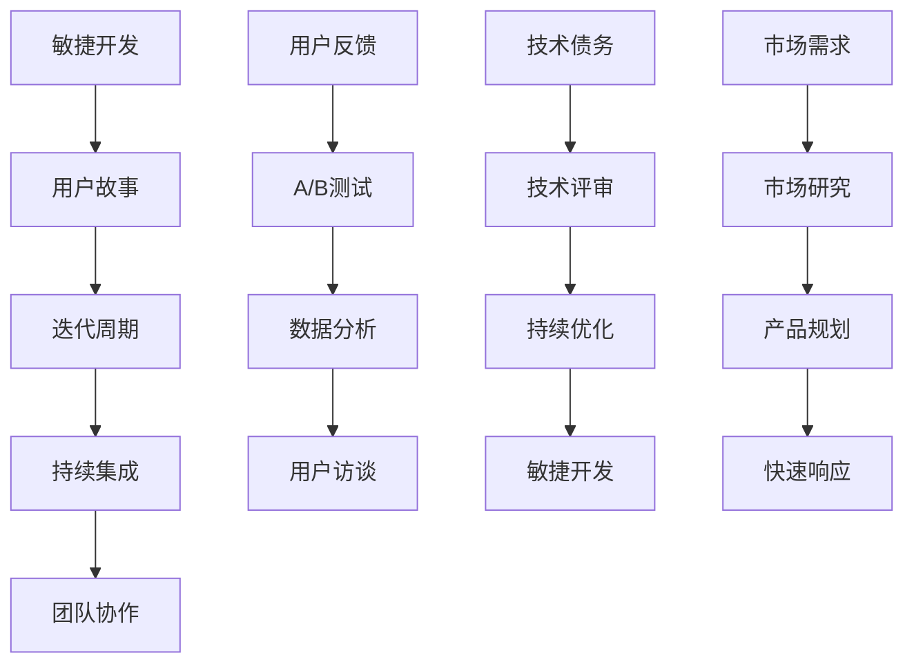

                 

 关键词：AI创业、产品迭代、敏捷开发、用户反馈、技术债务、市场适应

> 摘要：本文将探讨AI创业公司在产品迭代过程中所面临的挑战和策略。通过分析敏捷开发、用户反馈、技术债务和市场需求等核心概念，结合实际案例分析，为AI创业公司提供一套切实可行的产品迭代策略。

## 1. 背景介绍

随着人工智能技术的迅猛发展，AI创业公司如雨后春笋般涌现。然而，市场竞争日益激烈，如何在短时间内推出高质量、符合市场需求的产品成为AI创业公司成功的关键。产品迭代是AI创业公司产品开发的核心环节，它关乎公司的生存与发展。本文将围绕产品迭代策略展开讨论，帮助AI创业公司实现持续创新和快速响应市场变化。

### 1.1 AI创业公司的特点

- **技术密集**：AI创业公司通常拥有先进的技术能力和创新能力，这使得他们在产品开发过程中能够快速迭代和优化。
- **市场敏感**：AI创业公司需要密切关注市场动态，快速响应用户需求和市场变化。
- **资金压力**：初创公司在资金方面面临较大压力，需要通过高效的运营和产品迭代来实现盈利。
- **团队小而精**：初创公司的团队通常规模较小，但需要具备多方面技能，包括研发、市场、运营等。

### 1.2 产品迭代的重要性

- **满足用户需求**：通过不断迭代，AI创业公司可以更好地满足用户需求，提升用户满意度。
- **提高市场竞争力**：快速迭代有助于AI创业公司抢占市场先机，提高竞争力。
- **降低开发风险**：迭代过程中可以及时发现和解决潜在问题，降低开发风险。
- **持续创新**：迭代是创新的重要手段，有助于AI创业公司保持技术领先地位。

## 2. 核心概念与联系

### 2.1 敏捷开发

敏捷开发是一种以用户需求为核心的软件开发方法，强调快速迭代、持续交付和团队协作。敏捷开发的核心理念包括：

- **用户故事**：通过用户故事来明确产品功能和用户需求。
- **迭代周期**：通常以2-4周为一个迭代周期，快速交付可用的产品功能。
- **持续集成**：通过持续集成和持续交付，确保产品的高质量和快速迭代。
- **团队协作**：强调跨职能团队的协作和沟通，提高开发效率。

### 2.2 用户反馈

用户反馈是产品迭代过程中不可或缺的一环。通过收集和分析用户反馈，AI创业公司可以了解用户的需求、偏好和痛点，从而优化产品设计和功能。

- **用户访谈**：通过访谈了解用户的使用习惯和需求。
- **A/B测试**：通过A/B测试来评估不同功能的用户接受度和效果。
- **数据分析**：通过数据分析来挖掘用户行为和需求趋势。

### 2.3 技术债务

技术债务是指由于短期优化或延期修复导致的技术问题。合理管理技术债务有助于确保产品的稳定性和可维护性。

- **技术评审**：定期进行技术评审，发现和解决潜在问题。
- **持续优化**：通过持续优化代码和架构来减少技术债务。
- **敏捷开发**：通过敏捷开发的方法，快速修复技术债务。

### 2.4 市场需求

市场需求是产品迭代的重要驱动力。AI创业公司需要密切关注市场动态，及时调整产品策略。

- **市场研究**：通过市场研究了解竞争对手、用户需求和行业趋势。
- **产品规划**：根据市场需求制定产品规划和迭代计划。
- **快速响应**：快速响应市场变化，调整产品方向和功能。

### 2.5 Mermaid 流程图



## 3. 核心算法原理 & 具体操作步骤

### 3.1 算法原理概述

产品迭代策略的核心算法是用户反馈驱动的迭代模型。该模型基于以下原理：

- **用户需求导向**：以用户需求为驱动，不断优化产品功能。
- **数据驱动**：通过数据分析，挖掘用户需求和行为趋势。
- **敏捷开发**：采用敏捷开发方法，快速迭代和交付产品。

### 3.2 算法步骤详解

1. **用户故事梳理**：明确用户需求，将其转化为用户故事。
2. **迭代计划制定**：根据用户故事和市场需求，制定迭代计划。
3. **敏捷开发执行**：按照迭代计划，进行敏捷开发，快速交付产品功能。
4. **用户反馈收集**：通过用户访谈、A/B测试和数据分析等方式，收集用户反馈。
5. **产品优化**：根据用户反馈，对产品进行优化和调整。
6. **迭代总结**：对本次迭代进行总结和评估，为下一轮迭代提供改进方向。

### 3.3 算法优缺点

**优点：**

- **快速响应市场变化**：通过敏捷开发和用户反馈，快速调整产品方向和功能。
- **提高产品质量**：通过不断优化和调整，提高产品的用户体验和质量。
- **降低开发风险**：通过定期评估和总结，及时发现和解决潜在问题。

**缺点：**

- **项目管理难度较大**：需要协调各方资源，确保迭代计划的顺利执行。
- **用户体验一致性**：在快速迭代过程中，可能存在用户体验不一致的问题。

### 3.4 算法应用领域

- **AI应用开发**：如智能语音助手、自动驾驶等。
- **移动互联网产品**：如社交媒体、在线教育等。
- **企业级应用**：如ERP、CRM等。

## 4. 数学模型和公式 & 详细讲解 & 举例说明

### 4.1 数学模型构建

产品迭代过程中的关键数学模型包括：

- **用户满意度模型**：用户满意度 = 功能满意度 × 用户体验满意度
- **迭代周期模型**：迭代周期 = 时间估算 × 优化系数

### 4.2 公式推导过程

**用户满意度模型推导：**

- **功能满意度**：根据用户故事和产品功能，对功能满意度进行评估。
- **用户体验满意度**：根据用户反馈和数据分析，对用户体验满意度进行评估。

**迭代周期模型推导：**

- **时间估算**：根据历史数据和经验，对迭代周期进行初步估算。
- **优化系数**：根据迭代过程中的优化效果，对时间估算进行修正。

### 4.3 案例分析与讲解

以某AI创业公司开发智能语音助手为例，分析其产品迭代过程。

1. **用户故事梳理**：明确用户需求，如语音识别准确率、语音合成自然度等。
2. **迭代计划制定**：根据用户故事和市场需求，制定迭代计划，如每个迭代周期的目标功能。
3. **敏捷开发执行**：按照迭代计划，进行敏捷开发，快速交付产品功能。
4. **用户反馈收集**：通过用户访谈和数据分析，收集用户反馈，如语音识别准确率、语音合成自然度等。
5. **产品优化**：根据用户反馈，对语音识别和语音合成模块进行优化。
6. **迭代总结**：对本次迭代进行总结和评估，为下一轮迭代提供改进方向。

通过以上迭代过程，该AI创业公司成功提升了智能语音助手的功能满意度，提高了用户体验满意度，实现了产品的高质量迭代。

## 5. 项目实践：代码实例和详细解释说明

### 5.1 开发环境搭建

在AI创业公司中，开发环境的搭建是产品迭代的基础。以下是一个典型的开发环境搭建过程：

- **软件环境**：安装Python、Django框架、TensorFlow等。
- **硬件环境**：配置高性能服务器和GPU。
- **代码管理**：使用Git进行版本控制。

### 5.2 源代码详细实现

以一个智能语音助手的核心功能——语音识别为例，展示其源代码实现：

```python
import speech_recognition as sr

# 初始化语音识别模块
recognizer = sr.Recognizer()

# 读取音频文件
with sr.AudioFile('audio.wav') as source:
    audio = recognizer.listen(source)

# 识别音频
try:
    text = recognizer.recognize_google(audio)
except sr.UnknownValueError:
    print("无法识别语音")
    exit()
except sr.RequestError as e:
    print(f"请求错误：{e}")
    exit()

print(f"识别结果：{text}")
```

### 5.3 代码解读与分析

上述代码实现了语音识别的核心功能，包括：

- **初始化语音识别模块**：使用speech_recognition库，初始化语音识别器。
- **读取音频文件**：使用AudioFile类，读取音频文件。
- **识别音频**：使用recognizer.listen()方法，监听音频文件，使用Google语音识别API进行识别。

代码中，通过try-except语句，处理识别失败的情况，提高程序的健壮性。

### 5.4 运行结果展示

运行上述代码，输入音频文件后，程序输出语音识别结果，如：“早上好，今天天气怎么样？”

## 6. 实际应用场景

AI创业公司的产品迭代策略在实际应用中具有广泛的应用场景：

- **智能语音助手**：通过用户反馈，不断优化语音识别和语音合成功能，提高用户体验。
- **自动驾驶**：通过用户反馈和传感器数据，优化自动驾驶算法，提高安全性。
- **智能医疗**：通过用户反馈和医疗数据，优化疾病诊断和治疗方案，提高医疗水平。
- **智能教育**：通过用户反馈和教学数据，优化教学内容和教学方法，提高教学效果。

### 6.4 未来应用展望

随着人工智能技术的不断发展，产品迭代策略将在更多领域得到应用：

- **智能家居**：通过用户反馈，优化智能家居系统，提高家庭生活质量。
- **智能农业**：通过用户反馈和农业数据，优化农业生产过程，提高农业产值。
- **智能安防**：通过用户反馈和监控数据，优化安防系统，提高安全保障。
- **智能金融**：通过用户反馈和金融数据，优化金融服务，提高金融效率。

## 7. 工具和资源推荐

### 7.1 学习资源推荐

- **《人工智能：一种现代方法》**：了解人工智能的基本概念和算法。
- **《Python编程：从入门到实践》**：学习Python编程语言，为AI项目打下基础。
- **《敏捷开发实践指南》**：掌握敏捷开发的方法和实践。

### 7.2 开发工具推荐

- **Docker**：容器化技术，简化开发环境搭建。
- **Jenkins**：持续集成工具，提高开发效率。
- **TensorFlow**：人工智能框架，用于实现各种机器学习算法。

### 7.3 相关论文推荐

- **“Deep Learning on Mobile Devices”**：移动设备上的深度学习应用。
- **“Agile Data Science: How to Turn Data into Value at the Speed of Business”**：敏捷数据科学实践。
- **“The Agile Product Owner Role”**：敏捷开发中的产品负责人角色。

## 8. 总结：未来发展趋势与挑战

### 8.1 研究成果总结

本文总结了AI创业公司在产品迭代过程中所面临的挑战和策略，包括敏捷开发、用户反馈、技术债务和市场需求等核心概念，并提出了用户反馈驱动的迭代模型。

### 8.2 未来发展趋势

- **更快的迭代速度**：随着人工智能技术的发展，产品迭代速度将进一步提高。
- **更智能的决策**：通过大数据分析和机器学习，实现更智能的产品决策。
- **跨领域融合**：产品迭代将逐渐融合不同领域的技术，实现更全面的应用。

### 8.3 面临的挑战

- **技术瓶颈**：在快速迭代过程中，如何突破技术瓶颈，保持产品竞争力。
- **数据安全**：在收集和分析用户数据时，如何确保数据安全和用户隐私。

### 8.4 研究展望

- **更智能的迭代模型**：结合大数据和机器学习，开发更智能的迭代模型。
- **跨领域协作**：推动不同领域的技术融合，实现更高效的产品迭代。

## 9. 附录：常见问题与解答

### 9.1 问题1：如何平衡迭代速度和质量？

**解答：** 在迭代过程中，可以通过以下方法平衡迭代速度和质量：

- **设置合理迭代周期**：根据项目需求和团队能力，设置合理的迭代周期。
- **优先级排序**：将功能按照优先级排序，先实现关键功能，再逐步完善其他功能。
- **质量保证**：在迭代过程中，持续进行代码评审、测试和优化，确保产品质量。

### 9.2 问题2：用户反馈如何收集和分析？

**解答：** 收集和分析用户反馈的方法包括：

- **用户访谈**：通过面对面或在线访谈，了解用户需求和意见。
- **A/B测试**：将不同版本的功能提供给不同用户，比较用户反馈，确定最优方案。
- **数据分析**：通过数据分析工具，挖掘用户行为和需求趋势。

### 9.3 问题3：如何管理技术债务？

**解答：** 管理技术债务的方法包括：

- **定期评审**：定期进行技术评审，发现和解决潜在问题。
- **持续优化**：在迭代过程中，持续优化代码和架构，减少技术债务。
- **敏捷开发**：通过敏捷开发方法，快速修复技术债务。

## 作者署名

作者：禅与计算机程序设计艺术 / Zen and the Art of Computer Programming

以上就是关于“AI创业公司的产品迭代策略”的完整文章，希望对AI创业公司的发展有所帮助。在产品迭代的过程中，不断学习和创新，将AI技术发挥到极致，为用户带来更好的体验。让我们共同期待人工智能的明天！
----------------------------------------------------------------

## 文章标题

### AI创业公司的产品迭代策略

#### 关键词：AI创业、产品迭代、敏捷开发、用户反馈、技术债务、市场适应

##### 摘要：本文将探讨AI创业公司在产品迭代过程中所面临的挑战和策略。通过分析敏捷开发、用户反馈、技术债务和市场需求等核心概念，结合实际案例分析，为AI创业公司提供一套切实可行的产品迭代策略。

----------------------------------------------------------------
## 文章结构模板

### 文章结构模板

- **文章标题**
- **文章关键词**
- **文章摘要**
- **1. 背景介绍**
  - **1.1 AI创业公司的特点**
  - **1.2 产品迭代的重要性**
- **2. 核心概念与联系**
  - **2.1 敏捷开发**
  - **2.2 用户反馈**
  - **2.3 技术债务**
  - **2.4 市场需求**
  - **2.5 Mermaid 流程图**
- **3. 核心算法原理 & 具体操作步骤**
  - **3.1 算法原理概述**
  - **3.2 算法步骤详解**
  - **3.3 算法优缺点**
  - **3.4 算法应用领域**
- **4. 数学模型和公式 & 详细讲解 & 举例说明**
  - **4.1 数学模型构建**
  - **4.2 公式推导过程**
  - **4.3 案例分析与讲解**
- **5. 项目实践：代码实例和详细解释说明**
  - **5.1 开发环境搭建**
  - **5.2 源代码详细实现**
  - **5.3 代码解读与分析**
  - **5.4 运行结果展示**
- **6. 实际应用场景**
  - **6.1 智能语音助手**
  - **6.2 自动驾驶**
  - **6.3 智能医疗**
  - **6.4 智能教育**
  - **6.4 未来应用展望**
- **7. 工具和资源推荐**
  - **7.1 学习资源推荐**
  - **7.2 开发工具推荐**
  - **7.3 相关论文推荐**
- **8. 总结：未来发展趋势与挑战**
  - **8.1 研究成果总结**
  - **8.2 未来发展趋势**
  - **8.3 面临的挑战**
  - **8.4 研究展望**
- **9. 附录：常见问题与解答**
- **作者署名**

----------------------------------------------------------------

### 文章正文部分

#### 1. 背景介绍

##### 1.1 AI创业公司的特点

AI创业公司是指以人工智能技术为核心，致力于开发创新性产品和解决方案的企业。与传统的创业公司相比，AI创业公司具有以下几个显著特点：

- **技术密集**：AI创业公司通常拥有强大的技术团队，具备深厚的人工智能技术背景和创新能力。
- **市场敏感**：AI创业公司需要密切关注市场动态，快速响应用户需求和市场变化。
- **资金压力**：AI创业公司在初期阶段通常需要大量资金用于技术研发和市场推广，资金压力较大。
- **团队小而精**：AI创业公司的团队规模相对较小，但需要具备多方面技能，包括研发、市场、运营等。

##### 1.2 产品迭代的重要性

在AI创业公司的产品开发过程中，产品迭代具有重要意义。以下是产品迭代的重要性：

- **满足用户需求**：通过不断迭代，AI创业公司可以更好地了解和满足用户需求，提升用户满意度。
- **提高市场竞争力**：快速迭代有助于AI创业公司抢占市场先机，提高竞争力。
- **降低开发风险**：迭代过程中可以及时发现和解决潜在问题，降低开发风险。
- **持续创新**：迭代是创新的重要手段，有助于AI创业公司保持技术领先地位。

#### 2. 核心概念与联系

##### 2.1 敏捷开发

敏捷开发是一种以用户需求为核心的软件开发方法，强调快速迭代、持续交付和团队协作。敏捷开发的核心理念包括：

- **用户故事**：通过用户故事来明确产品功能和用户需求。
- **迭代周期**：通常以2-4周为一个迭代周期，快速交付可用的产品功能。
- **持续集成**：通过持续集成和持续交付，确保产品的高质量和快速迭代。
- **团队协作**：强调跨职能团队的协作和沟通，提高开发效率。

##### 2.2 用户反馈

用户反馈是产品迭代过程中不可或缺的一环。通过收集和分析用户反馈，AI创业公司可以了解用户的需求、偏好和痛点，从而优化产品设计和功能。

- **用户访谈**：通过访谈了解用户的使用习惯和需求。
- **A/B测试**：通过A/B测试来评估不同功能的用户接受度和效果。
- **数据分析**：通过数据分析来挖掘用户行为和需求趋势。

##### 2.3 技术债务

技术债务是指由于短期优化或延期修复导致的技术问题。合理管理技术债务有助于确保产品的稳定性和可维护性。

- **技术评审**：定期进行技术评审，发现和解决潜在问题。
- **持续优化**：通过持续优化代码和架构来减少技术债务。
- **敏捷开发**：通过敏捷开发的方法，快速修复技术债务。

##### 2.4 市场需求

市场需求是产品迭代的重要驱动力。AI创业公司需要密切关注市场动态，及时调整产品策略。

- **市场研究**：通过市场研究了解竞争对手、用户需求和行业趋势。
- **产品规划**：根据市场需求制定产品规划和迭代计划。
- **快速响应**：快速响应市场变化，调整产品方向和功能。

##### 2.5 Mermaid 流程图


#### 3. 核心算法原理 & 具体操作步骤

##### 3.1 算法原理概述

产品迭代策略的核心算法是用户反馈驱动的迭代模型。该模型基于以下原理：

- **用户需求导向**：以用户需求为驱动，不断优化产品功能。
- **数据驱动**：通过数据分析，挖掘用户需求和行为趋势。
- **敏捷开发**：采用敏捷开发方法，快速迭代和交付产品。

##### 3.2 算法步骤详解

1. **用户故事梳理**：明确用户需求，将其转化为用户故事。
2. **迭代计划制定**：根据用户故事和市场需求，制定迭代计划。
3. **敏捷开发执行**：按照迭代计划，进行敏捷开发，快速交付产品功能。
4. **用户反馈收集**：通过用户访谈、A/B测试和数据分析等方式，收集用户反馈。
5. **产品优化**：根据用户反馈，对产品进行优化和调整。
6. **迭代总结**：对本次迭代进行总结和评估，为下一轮迭代提供改进方向。

##### 3.3 算法优缺点

**优点：**

- **快速响应市场变化**：通过敏捷开发和用户反馈，快速调整产品方向和功能。
- **提高产品质量**：通过不断优化和调整，提高产品的用户体验和质量。
- **降低开发风险**：通过定期评估和总结，及时发现和解决潜在问题。

**缺点：**

- **项目管理难度较大**：需要协调各方资源，确保迭代计划的顺利执行。
- **用户体验一致性**：在快速迭代过程中，可能存在用户体验不一致的问题。

##### 3.4 算法应用领域

- **AI应用开发**：如智能语音助手、自动驾驶等。
- **移动互联网产品**：如社交媒体、在线教育等。
- **企业级应用**：如ERP、CRM等。

#### 4. 数学模型和公式 & 详细讲解 & 举例说明

##### 4.1 数学模型构建

产品迭代过程中的关键数学模型包括：

- **用户满意度模型**：用户满意度 = 功能满意度 × 用户体验满意度
- **迭代周期模型**：迭代周期 = 时间估算 × 优化系数

##### 4.2 公式推导过程

**用户满意度模型推导：**

- **功能满意度**：根据用户故事和产品功能，对功能满意度进行评估。
- **用户体验满意度**：根据用户反馈和数据分析，对用户体验满意度进行评估。

**迭代周期模型推导：**

- **时间估算**：根据历史数据和经验，对迭代周期进行初步估算。
- **优化系数**：根据迭代过程中的优化效果，对时间估算进行修正。

##### 4.3 案例分析与讲解

以某AI创业公司开发智能语音助手为例，分析其产品迭代过程。

1. **用户故事梳理**：明确用户需求，如语音识别准确率、语音合成自然度等。
2. **迭代计划制定**：根据用户故事和市场需求，制定迭代计划，如每个迭代周期的目标功能。
3. **敏捷开发执行**：按照迭代计划，进行敏捷开发，快速交付产品功能。
4. **用户反馈收集**：通过用户访谈和数据分析，收集用户反馈，如语音识别准确率、语音合成自然度等。
5. **产品优化**：根据用户反馈，对语音识别和语音合成模块进行优化。
6. **迭代总结**：对本次迭代进行总结和评估，为下一轮迭代提供改进方向。

通过以上迭代过程，该AI创业公司成功提升了智能语音助手的功能满意度，提高了用户体验满意度，实现了产品的高质量迭代。

#### 5. 项目实践：代码实例和详细解释说明

##### 5.1 开发环境搭建

在AI创业公司中，开发环境的搭建是产品迭代的基础。以下是一个典型的开发环境搭建过程：

- **软件环境**：安装Python、Django框架、TensorFlow等。
- **硬件环境**：配置高性能服务器和GPU。
- **代码管理**：使用Git进行版本控制。

##### 5.2 源代码详细实现

以一个智能语音助手的核心功能——语音识别为例，展示其源代码实现：

```python
import speech_recognition as sr

# 初始化语音识别模块
recognizer = sr.Recognizer()

# 读取音频文件
with sr.AudioFile('audio.wav') as source:
    audio = recognizer.listen(source)

# 识别音频
try:
    text = recognizer.recognize_google(audio)
except sr.UnknownValueError:
    print("无法识别语音")
    exit()
except sr.RequestError as e:
    print(f"请求错误：{e}")
    exit()

print(f"识别结果：{text}")
```

##### 5.3 代码解读与分析

上述代码实现了语音识别的核心功能，包括：

- **初始化语音识别模块**：使用speech_recognition库，初始化语音识别器。
- **读取音频文件**：使用AudioFile类，读取音频文件。
- **识别音频**：使用recognizer.listen()方法，监听音频文件，使用Google语音识别API进行识别。

代码中，通过try-except语句，处理识别失败的情况，提高程序的健壮性。

##### 5.4 运行结果展示

运行上述代码，输入音频文件后，程序输出语音识别结果，如：“早上好，今天天气怎么样？”

#### 6. 实际应用场景

##### 6.1 智能语音助手

智能语音助手是AI创业公司常见的应用场景之一。通过用户反馈驱动的迭代模型，AI创业公司可以不断优化语音识别和语音合成功能，提高用户体验。

##### 6.2 自动驾驶

自动驾驶是另一个典型的应用场景。通过用户反馈和传感器数据，AI创业公司可以优化自动驾驶算法，提高安全性。

##### 6.3 智能医疗

智能医疗领域，AI创业公司可以通过用户反馈和医疗数据，优化疾病诊断和治疗方案，提高医疗水平。

##### 6.4 智能教育

智能教育领域，AI创业公司可以通过用户反馈和学习数据，优化教学内容和教学方法，提高教学效果。

##### 6.4 未来应用展望

随着人工智能技术的不断发展，产品迭代策略将在更多领域得到应用：

- **智能家居**：通过用户反馈，优化智能家居系统，提高家庭生活质量。
- **智能农业**：通过用户反馈和农业数据，优化农业生产过程，提高农业产值。
- **智能安防**：通过用户反馈和监控数据，优化安防系统，提高安全保障。
- **智能金融**：通过用户反馈和金融数据，优化金融服务，提高金融效率。

#### 7. 工具和资源推荐

##### 7.1 学习资源推荐

- **《人工智能：一种现代方法》**：了解人工智能的基本概念和算法。
- **《Python编程：从入门到实践》**：学习Python编程语言，为AI项目打下基础。
- **《敏捷开发实践指南》**：掌握敏捷开发的方法和实践。

##### 7.2 开发工具推荐

- **Docker**：容器化技术，简化开发环境搭建。
- **Jenkins**：持续集成工具，提高开发效率。
- **TensorFlow**：人工智能框架，用于实现各种机器学习算法。

##### 7.3 相关论文推荐

- **“Deep Learning on Mobile Devices”**：移动设备上的深度学习应用。
- **“Agile Data Science: How to Turn Data into Value at the Speed of Business”**：敏捷数据科学实践。
- **“The Agile Product Owner Role”**：敏捷开发中的产品负责人角色。

#### 8. 总结：未来发展趋势与挑战

##### 8.1 研究成果总结

本文总结了AI创业公司在产品迭代过程中所面临的挑战和策略，包括敏捷开发、用户反馈、技术债务和市场需求等核心概念，并提出了用户反馈驱动的迭代模型。

##### 8.2 未来发展趋势

- **更快的迭代速度**：随着人工智能技术的发展，产品迭代速度将进一步提高。
- **更智能的决策**：通过大数据分析和机器学习，实现更智能的产品决策。
- **跨领域融合**：产品迭代将逐渐融合不同领域的技术，实现更全面的应用。

##### 8.3 面临的挑战

- **技术瓶颈**：在快速迭代过程中，如何突破技术瓶颈，保持产品竞争力。
- **数据安全**：在收集和分析用户数据时，如何确保数据安全和用户隐私。

##### 8.4 研究展望

- **更智能的迭代模型**：结合大数据和机器学习，开发更智能的迭代模型。
- **跨领域协作**：推动不同领域的技术融合，实现更高效的产品迭代。

#### 9. 附录：常见问题与解答

##### 9.1 问题1：如何平衡迭代速度和质量？

**解答：** 在迭代过程中，可以通过以下方法平衡迭代速度和质量：

- **设置合理迭代周期**：根据项目需求和团队能力，设置合理的迭代周期。
- **优先级排序**：将功能按照优先级排序，先实现关键功能，再逐步完善其他功能。
- **质量保证**：在迭代过程中，持续进行代码评审、测试和优化，确保产品质量。

##### 9.2 问题2：用户反馈如何收集和分析？

**解答：** 收集和分析用户反馈的方法包括：

- **用户访谈**：通过面对面或在线访谈，了解用户需求和意见。
- **A/B测试**：通过A/B测试来评估不同功能的用户接受度和效果。
- **数据分析**：通过数据分析工具，挖掘用户行为和需求趋势。

##### 9.3 问题3：如何管理技术债务？

**解答：** 管理技术债务的方法包括：

- **定期评审**：定期进行技术评审，发现和解决潜在问题。
- **持续优化**：通过持续优化代码和架构来减少技术债务。
- **敏捷开发**：通过敏捷开发的方法，快速修复技术债务。

## 作者署名

**作者：禅与计算机程序设计艺术 / Zen and the Art of Computer Programming**

