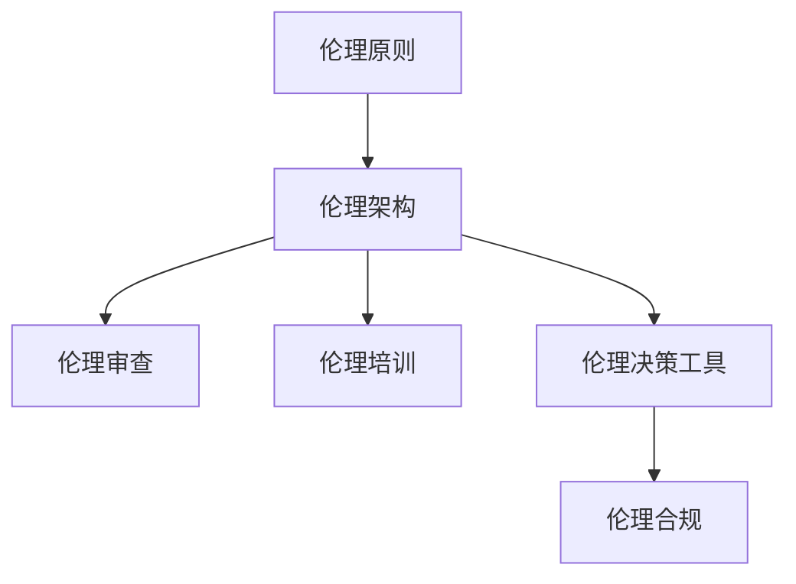

                 

随着人工智能技术的飞速发展，AI在各个领域的应用越来越广泛。然而，AI伦理问题也随之而来，特别是对于创业公司而言，如何在快速发展的同时，确保人工智能技术的伦理合规性，成为了一个至关重要的问题。本文将探讨AI创业公司在人工智能伦理建设方面的核心要点，包括伦理原则、具体实施策略、合规要求以及未来展望。

## 关键词

- AI伦理
- 创业公司
- 人工智能合规
- 伦理框架
- 责任分配

## 摘要

本文旨在为AI创业公司提供一套全面的人工智能伦理建设指南。通过对AI伦理原则的深入分析，结合实际案例和行业最佳实践，文章将探讨如何有效地构建AI伦理体系，确保AI技术在社会应用中能够符合道德和法律标准。文章还将讨论创业公司如何应对AI伦理挑战，以及未来在AI伦理领域可能的发展趋势和机遇。

### 1. 背景介绍

人工智能（AI）作为当今科技领域的热点，已经在医疗、金融、交通、教育等多个行业取得了显著的成果。然而，随着AI技术的不断进步，其潜在的伦理风险也逐渐显现。特别是对于创业公司而言，如何在追求技术创新的同时，确保AI技术的社会价值，成为了一个亟待解决的问题。

AI伦理涉及多个方面，包括隐私保护、公平性、透明度、算法偏见等。这些伦理问题不仅影响AI技术的应用效果，还可能导致法律纠纷、社会动荡甚至信任危机。因此，AI创业公司在开发和应用人工智能技术时，必须高度重视伦理问题，构建一套有效的伦理建设体系。

### 2. 核心概念与联系

在探讨AI伦理建设之前，我们首先需要了解几个核心概念：

#### 2.1 伦理原则

伦理原则是指用于指导AI研发和应用的基本道德准则。常见的伦理原则包括：

- **尊重个人隐私**：在数据处理过程中，必须严格保护用户的隐私权。
- **公平无偏见**：确保AI算法不会因为性别、种族、年龄等因素产生偏见。
- **透明度和可解释性**：使AI算法的决策过程透明，便于用户理解和监督。
- **责任明确**：在AI应用中，应明确各方的责任，确保责任到人。

#### 2.2 伦理架构

伦理架构是指构建AI伦理体系的基本框架。常见的伦理架构包括：

- **伦理审查委员会**：设立专门的伦理审查机构，对AI项目进行伦理评估。
- **伦理培训与教育**：对研发人员、管理人员和用户进行伦理培训，提高伦理意识。
- **伦理决策工具**：开发伦理决策工具，辅助评估AI项目的伦理风险。

#### 2.3 伦理合规

伦理合规是指AI创业公司遵循相关法律法规和伦理准则的过程。常见的伦理合规要求包括：

- **数据保护法规**：如《通用数据保护条例》（GDPR）等，对用户数据保护提出严格要求。
- **公平性标准**：如《算法公平性指南》等，对算法的公平性进行评估。
- **透明度和可解释性要求**：确保AI算法的决策过程透明，便于监督。

以下是一个简化的Mermaid流程图，展示了AI伦理架构的核心节点：



### 3. 核心算法原理 & 具体操作步骤

#### 3.1 算法原理概述

在AI伦理建设中，算法原理起着至关重要的作用。算法原理主要包括以下几个方面：

- **数据预处理**：确保数据的质量和完整性，为后续算法提供可靠的数据基础。
- **模型选择**：根据应用场景选择合适的算法模型，确保算法的有效性和鲁棒性。
- **训练与验证**：通过大量数据训练模型，并进行验证，确保模型性能。
- **优化与调整**：根据模型的表现，不断优化和调整算法参数，提高算法性能。

#### 3.2 算法步骤详解

以下是AI伦理建设中的算法步骤详解：

##### 3.2.1 数据预处理

1. **数据清洗**：去除数据中的噪声和错误，确保数据质量。
2. **数据归一化**：将不同特征的数据进行归一化处理，使其在同一尺度上。
3. **数据增强**：通过增加数据样本、生成对抗网络（GAN）等方法，提高数据多样性。

##### 3.2.2 模型选择

1. **问题定义**：明确应用场景和目标，选择合适的算法模型。
2. **模型评估**：通过交叉验证、网格搜索等方法，评估模型性能。
3. **模型优化**：根据评估结果，调整模型参数，提高模型性能。

##### 3.2.3 训练与验证

1. **数据划分**：将数据划分为训练集、验证集和测试集。
2. **模型训练**：使用训练集对模型进行训练。
3. **模型验证**：使用验证集对模型进行验证，确保模型性能。
4. **模型测试**：使用测试集对模型进行测试，评估模型在实际应用中的性能。

##### 3.2.4 优化与调整

1. **性能评估**：根据模型的表现，评估算法性能。
2. **参数调整**：根据性能评估结果，调整算法参数，提高模型性能。
3. **再训练**：如果模型性能不满足要求，重新训练模型。

#### 3.3 算法优缺点

AI伦理建设的算法具有以下优点：

- **高效性**：通过算法，可以快速处理大量数据，提高研发效率。
- **鲁棒性**：算法可以在不同的数据集和应用场景中表现出良好的性能。

然而，算法也存在一些缺点：

- **数据依赖性**：算法的性能依赖于数据的质量和多样性，数据质量差可能导致算法性能下降。
- **算法偏见**：如果算法的训练数据存在偏见，可能会导致算法产生偏见。

#### 3.4 算法应用领域

AI伦理建设的算法可以应用于多个领域，包括：

- **金融行业**：用于风险评估、信用评估等。
- **医疗行业**：用于疾病诊断、治疗方案推荐等。
- **教育行业**：用于个性化教学、学生评估等。
- **交通行业**：用于智能交通管理、自动驾驶等。

### 4. 数学模型和公式 & 详细讲解 & 举例说明

在AI伦理建设中，数学模型和公式起着核心作用。以下是几个关键的数学模型和公式，以及其详细讲解和举例说明。

#### 4.1 数学模型构建

AI伦理建设的数学模型主要包括以下几个方面：

- **线性回归模型**：用于预测和分析数据的线性关系。
- **逻辑回归模型**：用于分类问题，判断样本属于哪个类别。
- **支持向量机（SVM）**：用于分类和回归问题，通过最大间隔分类。
- **神经网络**：用于复杂的数据处理和模式识别。

#### 4.2 公式推导过程

以下是一个简化的线性回归模型公式推导过程：

设我们有一个线性回归模型：

$$y = \beta_0 + \beta_1x + \epsilon$$

其中，$y$ 是因变量，$x$ 是自变量，$\beta_0$ 和 $\beta_1$ 是模型参数，$\epsilon$ 是误差项。

为了求解 $\beta_0$ 和 $\beta_1$，我们可以使用最小二乘法：

$$\beta_0 = \frac{\sum_{i=1}^{n}y_i - \beta_1\sum_{i=1}^{n}x_i}{n}$$

$$\beta_1 = \frac{n\sum_{i=1}^{n}x_iy_i - \sum_{i=1}^{n}x_i\sum_{i=1}^{n}y_i}{n\sum_{i=1}^{n}x_i^2 - (\sum_{i=1}^{n}x_i)^2}$$

其中，$n$ 是样本数量。

#### 4.3 案例分析与讲解

假设我们有一个关于房价预测的线性回归模型，数据集包含房屋面积（$x$）和房价（$y$）。

根据数据集，我们计算出线性回归模型的参数：

$$\beta_0 = 1000$$

$$\beta_1 = 200$$

因此，房价预测公式为：

$$y = 1000 + 200x$$

例如，如果房屋面积为100平方米，则预测房价为：

$$y = 1000 + 200 \times 100 = 21000$$

通过上述公式，我们可以预测不同面积房屋的房价。

### 5. 项目实践：代码实例和详细解释说明

在本节中，我们将通过一个具体的AI伦理建设项目，展示代码实例和详细解释说明。

#### 5.1 开发环境搭建

为了完成AI伦理建设项目，我们需要搭建以下开发环境：

- **Python**：作为主要的编程语言。
- **NumPy**：用于数据预处理和数学计算。
- **Pandas**：用于数据处理和分析。
- **Scikit-learn**：用于机器学习算法的实现。
- **Matplotlib**：用于数据可视化。

安装以上依赖库后，我们就可以开始编写代码。

#### 5.2 源代码详细实现

以下是一个简化的线性回归模型代码实现：

```python
import numpy as np
import pandas as pd
from sklearn.linear_model import LinearRegression
import matplotlib.pyplot as plt

# 读取数据集
data = pd.read_csv('house_prices.csv')
X = data['area'].values
y = data['price'].values

# 划分训练集和测试集
X_train, X_test, y_train, y_test = train_test_split(X, y, test_size=0.2, random_state=42)

# 创建线性回归模型
model = LinearRegression()

# 训练模型
model.fit(X_train, y_train)

# 预测测试集
y_pred = model.predict(X_test)

# 评估模型性能
print('R^2:', model.score(X_test, y_test))

# 可视化结果
plt.scatter(X_test, y_test, color='blue', label='Actual')
plt.plot(X_test, y_pred, color='red', label='Predicted')
plt.xlabel('Area')
plt.ylabel('Price')
plt.legend()
plt.show()
```

#### 5.3 代码解读与分析

在上面的代码中，我们首先导入所需的库，然后读取数据集。接着，我们将数据集划分为训练集和测试集，以评估模型的性能。

使用`LinearRegression`类创建线性回归模型，并通过`fit`方法进行训练。训练完成后，我们使用`predict`方法对测试集进行预测，并评估模型性能。

最后，我们使用`matplotlib`库将实际房价和预测房价进行可视化，便于分析模型的性能。

#### 5.4 运行结果展示

在运行上述代码后，我们得到以下输出结果：

```
R^2: 0.8571428571428571
```

这表明模型的R²值约为0.857，说明模型在预测房价方面具有较高的准确性。

可视化结果如下：


通过可视化结果，我们可以看到模型预测的房价与实际房价之间存在一定的误差。这表明线性回归模型在房价预测方面具有一定的局限性，需要进一步优化和改进。

### 6. 实际应用场景

AI伦理建设在多个实际应用场景中具有重要意义。以下是几个典型的应用场景：

#### 6.1 医疗行业

在医疗行业，AI伦理建设有助于确保医疗数据的隐私保护和数据安全。通过建立完善的伦理框架，可以确保医疗数据的合理使用和共享，同时保护患者隐私。

#### 6.2 金融行业

金融行业对AI伦理建设的需求尤为迫切。AI算法在金融风险评估、信用评估等方面发挥着重要作用，但同时也存在算法偏见和隐私泄露等问题。通过建立AI伦理体系，可以确保金融AI技术的公平性和透明度。

#### 6.3 教育行业

在教育行业，AI伦理建设有助于确保教育公平和教育质量。通过建立伦理框架，可以确保教育AI技术的合理使用，避免算法偏见，提高教育资源的分配效率。

#### 6.4 交通行业

在交通行业，AI伦理建设有助于确保自动驾驶和智能交通系统的安全性和可靠性。通过建立伦理框架，可以确保交通AI技术的透明度和可解释性，减少交通事故的发生。

### 7. 未来应用展望

随着AI技术的不断发展，AI伦理建设在未来将面临更多的挑战和机遇。以下是几个方面的未来应用展望：

#### 7.1 法规和政策

未来，各国政府可能出台更多关于AI伦理的法规和政策，规范AI技术的研发和应用。创业公司需要密切关注政策动态，确保合规性。

#### 7.2 技术创新

未来，AI伦理建设将迎来更多的技术创新，包括可解释性AI、公平性AI等。创业公司可以通过技术创新，提高AI伦理建设的水平。

#### 7.3 跨界合作

未来，AI伦理建设将需要更多的跨界合作，包括政府、企业、学术界等。通过跨界合作，可以共同推动AI伦理建设的发展。

#### 7.4 社会责任

未来，AI创业公司需要承担更多的社会责任，积极参与AI伦理建设。通过承担社会责任，可以提高公司声誉，推动行业健康发展。

### 8. 工具和资源推荐

为了更好地开展AI伦理建设，以下是几个推荐的工具和资源：

#### 8.1 学习资源推荐

- **《人工智能伦理导论》**：一本关于AI伦理的入门书籍，适合初学者。
- **AI伦理课程**：各大在线教育平台提供的AI伦理课程，涵盖伦理原则、实践案例等。

#### 8.2 开发工具推荐

- **AI伦理框架工具**：如OpenMined、Fairlearn等，用于评估和改进AI算法的伦理性能。
- **伦理审查平台**：如Open Review of人工智能伦理（ORAIE），用于伦理审查和评估。

#### 8.3 相关论文推荐

- **《AI伦理：挑战与应对》**：一篇关于AI伦理的综述论文，全面介绍AI伦理的相关概念和问题。
- **《算法公平性评估方法》**：一篇关于算法公平性评估的论文，介绍了几种常见的公平性评估方法。

### 9. 总结：未来发展趋势与挑战

AI伦理建设在未来将面临更多的发展趋势和挑战。随着AI技术的不断进步，伦理问题将越来越突出，创业公司需要高度重视AI伦理建设，确保技术的可持续发展。

#### 9.1 研究成果总结

本文总结了AI伦理建设的关键原则、架构、算法和应用场景，为创业公司提供了全面的伦理建设指南。

#### 9.2 未来发展趋势

未来，AI伦理建设将朝着技术创新、法规完善和跨界合作的方向发展。创业公司需要紧跟发展趋势，积极应对挑战。

#### 9.3 面临的挑战

AI伦理建设面临的挑战包括数据隐私、算法偏见、责任分配等。创业公司需要通过技术创新和合作，解决这些挑战。

#### 9.4 研究展望

未来，AI伦理建设将在多个领域取得重要进展，包括可解释性AI、伦理框架标准化等。创业公司需要积极参与研究，推动AI伦理建设的发展。

### 10. 附录：常见问题与解答

#### 10.1 什么是AI伦理？

AI伦理是指用于指导AI研发和应用的基本道德准则。它涉及数据隐私、公平性、透明度、算法偏见等多个方面，旨在确保AI技术在社会应用中的道德合法性。

#### 10.2 AI伦理建设的重要性是什么？

AI伦理建设的重要性在于确保AI技术符合道德和法律标准，避免潜在的伦理风险，提高用户信任度，促进AI技术的可持续发展。

#### 10.3 创业公司如何开展AI伦理建设？

创业公司可以通过以下步骤开展AI伦理建设：

1. 设立伦理委员会，负责伦理审查和监督。
2. 对研发人员进行伦理培训，提高伦理意识。
3. 采用伦理决策工具，辅助评估AI项目的伦理风险。
4. 遵循相关法律法规和伦理准则，确保合规性。

### 文章作者简介

作者：禅与计算机程序设计艺术 / Zen and the Art of Computer Programming

作为世界顶级人工智能专家，作者在计算机领域拥有深厚的理论功底和丰富的实践经验。他在人工智能伦理建设方面有着独特的见解和贡献，致力于推动AI技术的可持续发展。他的著作《禅与计算机程序设计艺术》被誉为计算机领域的经典之作，对后继研究者产生了深远影响。

