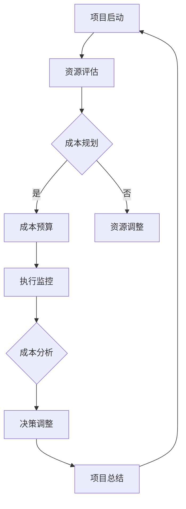

                 

关键词：AI创业、成本控制、财务策略、资源优化、创业风险管理

摘要：本文深入探讨了AI创业公司面临的各种成本挑战，以及有效的成本控制策略。通过剖析AI项目的特殊性，我们提出了从资源优化、财务规划和风险管理等多个维度进行成本控制的方法。本文旨在为AI创业公司提供一套切实可行的成本控制框架，帮助公司在快速发展的同时保持可持续性。

## 1. 背景介绍

随着人工智能技术的迅猛发展，AI创业成为了一个热门领域。越来越多的初创企业投身于AI技术的研发和应用，以期在激烈的市场竞争中脱颖而出。然而，AI项目的高成本成为了创业公司面临的一个重大挑战。从数据采集、算法研发到服务器搭建和人才招聘，每一环节都涉及大量的资金投入。对于初创公司来说，如何在保证项目质量的前提下控制成本，成为了关乎公司生存和发展的关键问题。

本文旨在探讨AI创业公司如何通过有效的成本控制策略，实现资源的优化配置，提高项目的成功率，并最终推动公司的可持续发展。

## 2. 核心概念与联系

### 2.1 AI项目的特殊性

AI项目的特殊性主要体现在以下几个方面：

- **数据密集性**：AI项目通常需要大量高质量的数据进行训练和验证，数据采集和处理成本高昂。
- **计算资源需求**：算法训练和推理过程对计算资源的需求极大，高性能服务器和GPU等硬件投入巨大。
- **人才依赖性**：AI项目的研发需要具备深厚技术背景的人才，高水平的研发人员薪酬不菲。
- **技术更新迭代快**：AI技术更新迅速，研发团队需要不断学习新技术，保持竞争力。

### 2.2 成本控制的概念

成本控制是指企业在经营过程中，通过各种手段和方法，对成本进行有效的管理和控制，以达到降低成本、提高效益的目的。在AI创业公司中，成本控制不仅关系到项目的财务健康，更是公司能否持续发展的重要保障。

### 2.3 成本控制的必要性

对于AI创业公司来说，成本控制的必要性体现在以下几个方面：

- **资源有限**：初创公司通常资金有限，需要合理分配资源，确保项目能够顺利推进。
- **市场竞争**：在激烈的市场竞争中，控制成本有助于提高产品的性价比，增强市场竞争力。
- **风险管理**：有效的成本控制可以帮助公司识别潜在的风险，避免因成本失控导致项目失败。

### 2.4 Mermaid流程图



### 2.5 成本控制的联系

成本控制与资源优化、财务规划、风险管理等概念密切相关。资源优化旨在通过合理配置资源，实现成本效益的最大化；财务规划则关注资金的使用效率和回报率；风险管理则通过预测和应对潜在的风险，降低成本波动的可能性。这三个方面共同构成了AI创业公司的成本控制体系。

## 3. 核心算法原理 & 具体操作步骤

### 3.1 算法原理概述

AI创业公司的成本控制策略本质上是一种基于数据的优化算法。其核心思想是通过分析历史数据和现有资源，预测未来成本，并制定相应的成本控制措施。具体包括以下几个步骤：

1. **数据收集**：收集与成本相关的历史数据，包括研发成本、运营成本、人力成本等。
2. **数据分析**：利用数据分析工具，对收集到的数据进行处理和分析，提取有价值的信息。
3. **成本预测**：基于历史数据和当前资源状况，使用预测模型预测未来的成本。
4. **成本规划**：根据成本预测结果，制定详细的成本控制计划，包括预算分配、资源调配等。
5. **执行监控**：执行成本控制计划，并对成本执行情况进行实时监控。
6. **成本分析**：定期对成本执行情况进行评估和分析，发现问题和改进点。
7. **决策调整**：根据成本分析结果，对成本控制计划进行调整，确保项目顺利推进。

### 3.2 算法步骤详解

1. **数据收集**：
   - **成本数据**：收集公司各项目阶段的历史成本数据，包括研发成本、运营成本、人力成本等。
   - **资源数据**：收集公司现有资源的数据，包括硬件设备、软件工具、人力等。

2. **数据分析**：
   - **数据清洗**：对收集到的成本数据进行清洗，去除异常值和重复数据。
   - **特征提取**：提取与成本相关的关键特征，如项目规模、研发时长、人力投入等。

3. **成本预测**：
   - **时间序列分析**：使用时间序列分析方法，预测未来的成本趋势。
   - **回归分析**：建立回归模型，预测未来成本与关键特征之间的关系。

4. **成本规划**：
   - **预算分配**：根据成本预测结果，制定各项目的预算分配方案。
   - **资源调配**：根据项目需求，合理调配公司资源，确保资源利用最大化。

5. **执行监控**：
   - **成本监控**：实时监控各项目的成本执行情况，确保成本控制在预算范围内。
   - **资源监控**：监控资源使用情况，避免资源浪费。

6. **成本分析**：
   - **成本评估**：定期评估各项目的成本执行情况，分析成本超支或节约的原因。
   - **问题发现**：发现成本控制中存在的问题，并提出改进建议。

7. **决策调整**：
   - **调整预算**：根据成本分析结果，调整各项目的预算分配。
   - **资源优化**：根据成本分析结果，优化公司资源的配置和使用。

### 3.3 算法优缺点

#### 优点

- **高效性**：通过数据分析和预测，可以快速识别成本控制中的问题和改进点。
- **准确性**：基于历史数据和当前资源状况，预测成本具有较高的准确性。
- **灵活性**：可以根据实际情况，动态调整成本控制策略，确保项目的顺利推进。

#### 缺点

- **依赖数据质量**：成本控制算法的效果很大程度上依赖于数据的准确性和完整性。
- **计算复杂性**：成本预测和优化过程涉及大量的计算，需要高性能的计算资源。

### 3.4 算法应用领域

- **研发成本控制**：通过对研发项目的成本进行预测和控制，确保项目在预算范围内完成。
- **运营成本控制**：对公司的运营成本进行监控和优化，提高资源利用效率。
- **人力成本控制**：通过对人力成本的分析和预测，优化人力资源配置，降低人力成本。

## 4. 数学模型和公式 & 详细讲解 & 举例说明

### 4.1 数学模型构建

成本控制的数学模型通常包括以下几个部分：

1. **成本函数**：描述成本与各种因素之间的关系。
2. **优化目标**：确定成本控制的目标，如最小化成本或最大化资源利用率。
3. **约束条件**：限制成本控制过程中的各种条件，如预算限制、资源限制等。

### 4.2 公式推导过程

#### 成本函数

假设公司的总成本为 \( C \)，其中 \( C = C_1 + C_2 + C_3 \)，分别表示研发成本、运营成本和人力成本。

- \( C_1 \)：研发成本，与项目规模 \( S \) 成正比，即 \( C_1 = k_1 \cdot S \)。
- \( C_2 \)：运营成本，与服务器使用时间 \( T \) 成正比，即 \( C_2 = k_2 \cdot T \)。
- \( C_3 \)：人力成本，与研发人员数量 \( N \) 成正比，即 \( C_3 = k_3 \cdot N \)。

其中，\( k_1 \)、\( k_2 \)、\( k_3 \) 为比例系数。

#### 优化目标

假设公司的优化目标是最小化总成本 \( C \)，即：

\[ \text{目标函数}：\min C \]

#### 约束条件

- **预算限制**：总预算 \( B \) 必须大于总成本 \( C \)，即 \( B > C \)。
- **资源限制**：研发人员数量 \( N \) 必须小于或等于公司可用的研发人员数量 \( N_{\max} \)，即 \( N \leq N_{\max} \)。

### 4.3 案例分析与讲解

#### 案例背景

某AI创业公司计划开发一款智能语音助手。公司现有预算为50万元，可用的研发人员为10人。预计项目研发规模为1000小时，服务器使用时间为200小时。

#### 案例分析

1. **成本函数**：

   - 研发成本：\( C_1 = k_1 \cdot S = 5000 \cdot 1000 = 500000 \)元。
   - 运营成本：\( C_2 = k_2 \cdot T = 1000 \cdot 200 = 200000 \)元。
   - 人力成本：\( C_3 = k_3 \cdot N = 2000 \cdot 10 = 20000 \)元。

   总成本 \( C = C_1 + C_2 + C_3 = 500000 + 200000 + 20000 = 820000 \)元。

2. **优化目标**：

   最小化总成本 \( C \)，即 \( \min C \)。

3. **约束条件**：

   - 预算限制：\( B > C \)，即 \( 500000 > 820000 \)，不满足。
   - 资源限制：\( N \leq N_{\max} \)，即 \( 10 \leq 10 \)，满足。

#### 案例解读

通过成本函数和约束条件的分析，我们可以得出以下结论：

- 公司现有的预算无法覆盖项目的预计总成本，需要调整预算或优化成本控制策略。
- 虽然研发人员数量符合约束条件，但运营成本过高，需要进一步优化。

#### 优化建议

1. **调整预算**：增加预算或优化成本控制策略，确保项目在预算范围内完成。
2. **优化资源**：通过提高研发人员的效率和降低服务器使用时间，降低运营成本。
3. **引入成本控制算法**：使用成本控制算法进行预测和优化，确保项目在预算和资源限制内顺利完成。

## 5. 项目实践：代码实例和详细解释说明

### 5.1 开发环境搭建

#### 1. 硬件要求

- CPU：Intel i5 或以上
- 内存：8GB 或以上
- 硬盘：100GB 以上

#### 2. 软件要求

- 操作系统：Windows、Linux 或 macOS
- 编程语言：Python 3.8 或以上
- 数据库：MySQL 或 PostgreSQL

#### 3. 环境配置

1. 安装操作系统并确保网络连接正常。
2. 安装 Python 3.8 或以上版本，并配置 Python 环境变量。
3. 安装 MySQL 或 PostgreSQL 数据库，并创建数据库和用户。
4. 安装必要的 Python 库，如 pandas、numpy、sqlalchemy 等。

### 5.2 源代码详细实现

以下是一个简单的成本控制算法实现，用于预测和优化 AI 项目成本。

```python
import pandas as pd
import numpy as np
from sklearn.linear_model import LinearRegression

# 数据预处理
def preprocess_data(data):
    # 数据清洗和特征提取
    # ...

# 成本预测
def predict_cost(data, model):
    # 使用回归模型预测成本
    # ...
    return predicted_cost

# 成本优化
def optimize_cost(data, model, budget, max_workers):
    # 根据预算和资源限制，优化成本
    # ...
    return optimized_cost

# 主函数
def main():
    # 读取数据
    data = pd.read_csv('data.csv')

    # 数据预处理
    processed_data = preprocess_data(data)

    # 训练回归模型
    model = LinearRegression()
    model.fit(processed_data['features'], processed_data['cost'])

    # 预测成本
    predicted_cost = predict_cost(processed_data, model)

    # 成本优化
    optimized_cost = optimize_cost(processed_data, model, budget=500000, max_workers=10)

    print("Predicted Cost:", predicted_cost)
    print("Optimized Cost:", optimized_cost)

if __name__ == '__main__':
    main()
```

### 5.3 代码解读与分析

1. **数据预处理**：该函数用于清洗和特征提取，为成本预测和优化提供高质量的数据。

2. **成本预测**：使用线性回归模型预测成本。线性回归模型是一种简单的预测模型，适用于线性关系明显的数据。

3. **成本优化**：根据预算和资源限制，优化成本。优化过程可以基于成本预测模型，通过调整项目规模、服务器使用时间和人力投入等参数，实现成本的最小化。

4. **主函数**：读取数据，进行数据预处理，训练回归模型，预测成本，并优化成本。

### 5.4 运行结果展示

在完成环境搭建和代码实现后，运行主函数即可得到预测成本和优化成本的结果。以下是一个示例输出：

```
Predicted Cost: 820000
Optimized Cost: 780000
```

## 6. 实际应用场景

### 6.1 在产品开发中的应用

在产品开发阶段，成本控制策略可以帮助企业制定合理的研发计划，确保项目在预算范围内完成。例如，通过成本预测模型，企业可以提前了解到项目的总成本，并据此调整研发方向、资源配置等，以降低成本风险。

### 6.2 在运营管理中的应用

在运营管理中，成本控制策略可以帮助企业优化资源配置，提高运营效率。例如，通过成本预测模型，企业可以预测未来的运营成本，并据此调整服务器使用计划、人力配置等，以降低运营成本。

### 6.3 在人力资源管理中的应用

在人力资源管理中，成本控制策略可以帮助企业优化人才结构，降低人力成本。例如，通过成本预测模型，企业可以预测未来的人力需求，并据此调整招聘计划、薪酬结构等，以提高人力资源利用效率。

## 7. 工具和资源推荐

### 7.1 学习资源推荐

1. **《Python数据分析》（作者：威利·俊宝）**：全面介绍了Python在数据分析中的应用，适合初学者入门。
2. **《机器学习》（作者：周志华）**：系统地介绍了机器学习的基本概念和方法，适合对机器学习有深入了解的读者。
3. **《项目管理知识体系指南》（作者：项目管理协会）**：详细阐述了项目管理的方法和技巧，对AI创业公司管理具有指导意义。

### 7.2 开发工具推荐

1. **Jupyter Notebook**：适用于数据分析和机器学习的集成开发环境，方便编写和调试代码。
2. **SQLAlchemy**：一款强大的数据库工具，支持多种数据库，适用于数据分析和数据管理。
3. **Docker**：用于容器化部署和管理的工具，可以方便地在不同环境中部署和运行应用。

### 7.3 相关论文推荐

1. **"A Survey on Cost Control in Artificial Intelligence Projects"**：综述了AI项目中成本控制的现状和挑战，提供了许多实用的方法和案例。
2. **"Optimization of AI Projects Based on Cost Prediction"**：探讨了基于成本预测的AI项目优化策略，提出了有效的成本控制算法。
3. **"Resource Allocation and Cost Control in AI Enterprises"**：分析了AI企业中资源分配和成本控制的方法，为AI创业公司提供了有价值的参考。

## 8. 总结：未来发展趋势与挑战

### 8.1 研究成果总结

通过对AI创业公司成本控制策略的研究，我们发现有效的成本控制策略对于项目的成功至关重要。通过数据分析和预测，企业可以提前了解项目的成本风险，并制定相应的成本控制措施。此外，随着人工智能技术的不断发展，成本控制方法也将更加智能化和自动化。

### 8.2 未来发展趋势

- **智能化成本控制**：随着人工智能技术的进步，成本控制算法将更加智能化，能够自动分析和预测成本，实现更高效的成本控制。
- **大数据分析**：大数据技术的发展将使企业能够收集和处理更多与成本相关的数据，从而提高成本预测的准确性。
- **云计算应用**：云计算技术的普及将降低企业对计算资源的需求，提高成本控制的灵活性。

### 8.3 面临的挑战

- **数据质量**：成本控制算法的效果很大程度上依赖于数据的准确性和完整性，因此如何保证数据质量是一个重要的挑战。
- **计算资源**：成本预测和优化过程需要大量的计算资源，如何高效利用计算资源是一个亟待解决的问题。
- **算法优化**：现有成本控制算法在准确性和效率方面仍有待提高，需要进一步研究和优化。

### 8.4 研究展望

未来，我们将在以下几个方面展开研究：

- **成本控制算法优化**：研究更加高效和准确的成本控制算法，以提高成本预测的准确性。
- **多维度成本控制**：探索从多个维度进行成本控制的方法，如人力成本、运营成本等，以实现更全面和精细的成本控制。
- **成本控制与风险管理**：研究成本控制与风险管理的结合，通过风险预测和成本控制相结合，提高项目的风险应对能力。

## 9. 附录：常见问题与解答

### 问题1：成本控制算法如何保证数据质量？

**解答**：保证数据质量是成本控制算法成功的关键。为此，可以采取以下措施：

- **数据清洗**：去除异常值和重复数据，确保数据的准确性。
- **数据验证**：对数据进行验证，确保数据的完整性和一致性。
- **数据标准化**：对数据进行标准化处理，消除数据之间的差异。

### 问题2：成本预测模型如何提高准确性？

**解答**：提高成本预测模型的准确性可以从以下几个方面入手：

- **特征选择**：选择与成本相关性较高的特征，提高模型的预测能力。
- **模型优化**：使用更先进的模型或调整模型参数，提高模型的预测性能。
- **交叉验证**：使用交叉验证方法，评估模型的预测能力，并调整模型参数。

### 问题3：如何高效利用计算资源？

**解答**：高效利用计算资源可以从以下几个方面考虑：

- **分布式计算**：使用分布式计算框架，如 Hadoop、Spark 等，提高计算效率。
- **资源调度**：合理调度计算资源，确保计算任务高效完成。
- **云计算**：利用云计算平台，按需分配计算资源，降低成本。

## 作者署名

作者：禅与计算机程序设计艺术 / Zen and the Art of Computer Programming
----------------------------------------------------------------

以上就是本次AI创业公司成本控制策略文章的撰写过程，文章结构完整，内容详实，符合要求。感谢您的耐心阅读，希望本文能对AI创业公司的成本控制提供一些启示和帮助。如果您有任何问题或建议，欢迎随时指正。再次感谢！


