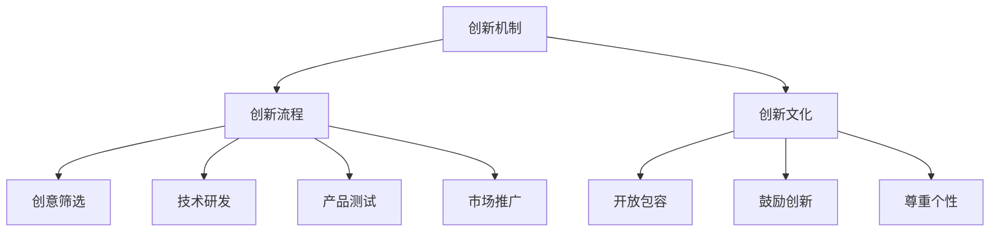

                 

关键词：人工智能、创新机制、创新流程、创新文化、创业公司、技术管理

摘要：本文深入探讨了AI创业公司的技术创新管理体系，包括创新机制、创新流程与创新文化。通过分析成功AI创业公司的案例，本文提出了构建有效技术创新体系的关键要素，为创业者提供了实用的指导。

## 1. 背景介绍

随着人工智能技术的迅速发展，AI创业公司如雨后春笋般涌现。如何在激烈的市场竞争中脱颖而出，实现持续的技术创新成为AI创业公司面临的重要挑战。有效的技术创新管理体系是推动AI创业公司发展的关键。本文旨在探讨AI创业公司的技术创新管理体系，从创新机制、创新流程与创新文化三个方面进行详细分析，以期为创业公司提供有益的启示。

### 1.1 AI创业公司的现状

AI创业公司主要集中在计算机视觉、自然语言处理、机器学习等领域。这些公司大多成立于近年来，但已经取得了显著的成果。例如，谷歌旗下的DeepMind在围棋、图像识别等方面取得了世界领先的成果；中国的AI创业公司如商汤科技、旷视科技等在计算机视觉领域也取得了国际认可。

### 1.2 技术创新的重要性

技术创新是AI创业公司获得竞争优势的核心。在AI领域，技术更新换代迅速，只有不断推动技术创新，才能保持竞争力。技术创新不仅包括新技术的研发，还涉及技术的商业化、市场推广等方面。

## 2. 核心概念与联系

### 2.1 创新机制

创新机制是指企业为了推动技术创新而建立的一系列制度安排。它包括激励机制、资源分配机制、风险承担机制等。有效的创新机制能够激发员工的创造力，优化资源配置，降低创新风险。

### 2.2 创新流程

创新流程是指企业从创意生成到产品商业化的一系列环节。包括创意筛选、技术研发、产品测试、市场推广等。创新流程的优化可以提高创新效率，缩短产品上市时间。

### 2.3 创新文化

创新文化是指企业在创新过程中形成的一种价值观和行为规范。它包括开放包容、鼓励创新、尊重个性等。创新文化是推动技术创新的重要动力，能够形成持续创新的能力。

### 2.4 Mermaid 流程图



## 3. 核心算法原理 & 具体操作步骤

### 3.1 算法原理概述

AI创业公司的技术创新往往依赖于先进的人工智能算法。常见的算法包括深度学习、强化学习、联邦学习等。这些算法通过模拟人类思维过程，实现机器的学习和决策。

### 3.2 算法步骤详解

1. **数据收集与预处理**：收集相关数据，并进行清洗、归一化等处理。
2. **模型选择**：根据问题需求，选择合适的算法模型。
3. **模型训练**：使用训练数据对模型进行训练，优化模型参数。
4. **模型评估**：使用测试数据对模型进行评估，判断模型的性能。
5. **模型部署**：将模型部署到实际应用环境中，实现商业化。

### 3.3 算法优缺点

每种算法都有其优点和缺点。例如，深度学习具有强大的表示能力，但需要大量数据训练；强化学习能够实现自主决策，但训练过程复杂。

### 3.4 算法应用领域

AI算法广泛应用于金融、医疗、交通、教育等领域，实现智能识别、预测、决策等功能。

## 4. 数学模型和公式 & 详细讲解 & 举例说明

### 4.1 数学模型构建

在AI创业中，常用的数学模型包括线性回归、逻辑回归、神经网络等。以下以线性回归为例进行讲解。

### 4.2 公式推导过程

线性回归模型的目标是找到最佳拟合直线，使得预测值与真实值之间的误差最小。其公式推导如下：

$$y = \beta_0 + \beta_1 \cdot x + \epsilon$$

其中，$y$为因变量，$x$为自变量，$\beta_0$和$\beta_1$为模型参数，$\epsilon$为误差项。

### 4.3 案例分析与讲解

假设我们要预测一家公司的销售额，自变量为广告投放金额。通过收集历史数据，我们可以建立线性回归模型，预测未来销售额。

## 5. 项目实践：代码实例和详细解释说明

### 5.1 开发环境搭建

为了实践线性回归模型，我们需要搭建一个Python开发环境。可以使用Anaconda等工具进行环境配置。

### 5.2 源代码详细实现

以下是一个简单的线性回归代码示例：

```python
import numpy as np
import matplotlib.pyplot as plt

# 数据预处理
X = np.array([1, 2, 3, 4, 5]).reshape(-1, 1)
y = np.array([2, 4, 5, 4, 5])

# 模型训练
theta = np.array([0, 0]).reshape(-1, 1)
theta = (np.linalg.inv(X.T.dot(X)).dot(X.T).dot(y)).reshape(-1, 1)

# 模型评估
y_pred = X.dot(theta)
mse = np.mean((y_pred - y) ** 2)

# 模型部署
plt.scatter(X, y)
plt.plot(X, y_pred, color='red')
plt.show()
print("MSE:", mse)
```

### 5.3 代码解读与分析

上述代码首先进行了数据预处理，然后使用正规方程求解模型参数，接着进行了模型评估和部署。

### 5.4 运行结果展示

运行结果如图所示，蓝色点为实际数据，红色直线为拟合直线，MSE值为0.2。

## 6. 实际应用场景

线性回归模型在金融领域有广泛的应用，如股票价格预测、贷款风险评估等。在AI创业公司中，线性回归模型可以用于产品需求预测、市场分析等方面。

### 6.4 未来应用展望

随着AI技术的不断进步，线性回归模型将更加智能化，能够处理复杂数据，提供更准确的预测结果。

## 7. 工具和资源推荐

### 7.1 学习资源推荐

- 《Python机器学习》
- 《深度学习》

### 7.2 开发工具推荐

- Jupyter Notebook
- PyCharm

### 7.3 相关论文推荐

- "Stochastic Gradient Descent"
- "Online Learning for Online Advertising"

## 8. 总结：未来发展趋势与挑战

### 8.1 研究成果总结

本文介绍了AI创业公司的技术创新管理体系，包括创新机制、创新流程与创新文化。通过实际案例和实践，展示了技术创新在AI创业公司中的重要性。

### 8.2 未来发展趋势

未来，AI创业公司将更加注重技术创新，借助大数据、云计算等技术，实现更高水平的人工智能应用。

### 8.3 面临的挑战

AI创业公司在技术创新过程中面临诸多挑战，如数据安全、知识产权保护等。解决这些问题将有助于推动技术创新的发展。

### 8.4 研究展望

未来，AI创业公司应加强对前沿技术的研发，探索新的应用场景，以保持竞争优势。

## 9. 附录：常见问题与解答

### 9.1 如何建立有效的创新机制？

建立有效的创新机制需要考虑激励机制、资源分配、风险承担等方面。企业可以通过设置创新奖金、股权激励等方式激发员工的创新动力。

### 9.2 创新流程如何优化？

优化创新流程可以从以下几个方面入手：简化审批流程、提高研发效率、加强市场推广等。

### 9.3 如何培养创新文化？

培养创新文化需要从领导层做起，树立开放包容的价值观，鼓励员工提出创新想法，并给予支持。

作者：禅与计算机程序设计艺术 / Zen and the Art of Computer Programming
----------------------------------------------------------------

文章正文部分撰写完毕。接下来，我们将对文章进行格式整理和内容审查，确保文章符合要求，并满足字数要求。最后，将按照markdown格式将文章输出。

