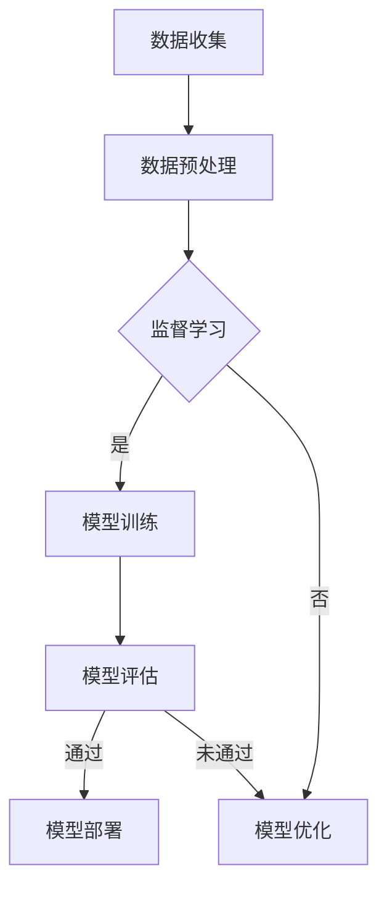

                 

作者：禅与计算机程序设计艺术 / Zen and the Art of Computer Programming

### 摘要 Summary

本文旨在为AI创业公司提供一份技术白皮书撰写的指南，内容涵盖了技术原理、应用场景以及发展路线的详细探讨。文章首先介绍了当前AI领域的发展背景，随后深入分析了核心算法原理、数学模型、应用实践和未来展望，旨在帮助读者更好地理解AI技术，并为其创业公司的技术规划提供有益参考。

## 1. 背景介绍 Background

人工智能（AI）作为21世纪的科技前沿，正逐步渗透到各个行业，推动着社会生产力的巨大变革。从早期的规则系统、知识表示，到现代的深度学习、强化学习，AI技术已经取得了显著的进展。随着计算能力的提升和大数据的广泛应用，AI的应用场景不断拓展，从语音识别、图像处理到自然语言处理、自动驾驶，AI正在改变我们的生活方式和产业模式。

在这个大背景下，越来越多的创业公司涌入AI领域，希望通过创新的技术解决方案获取市场先机。然而，面对技术迅速迭代和市场需求的不断变化，如何规划技术路线、构建核心算法、落地应用实践成为这些公司亟待解决的问题。因此，本文将围绕这些核心问题，结合技术原理、应用场景和发展路线，为AI创业公司提供一份全面的技术白皮书撰写指南。

## 2. 核心概念与联系 Core Concepts and Relations

### 2.1 机器学习 Machine Learning

机器学习是人工智能的核心技术之一，它通过算法从数据中自动发现规律和模式，以实现智能决策和预测。常见的机器学习方法包括监督学习、无监督学习和强化学习。

- **监督学习**：在监督学习模型中，算法通过已标记的输入输出数据训练模型，以便在新的、未标记的数据上进行预测。例如，通过标记的图像数据训练一个图像分类器。

- **无监督学习**：无监督学习模型没有预先标记的输出数据，其目标是发现数据中的内在结构和模式。例如，通过无监督学习算法对未标记的图像数据进行聚类，以发现图像的相似性。

- **强化学习**：强化学习模型通过不断尝试和错误来学习策略，以最大化长期回报。例如，通过强化学习算法训练一个智能体在复杂的游戏环境中找到最优策略。

### 2.2 深度学习 Deep Learning

深度学习是机器学习的一种重要分支，它通过多层神经网络对数据进行复杂建模，从而实现高度自动化的特征提取和模式识别。深度学习的核心组成部分包括：

- **卷积神经网络（CNN）**：CNN特别适用于图像处理任务，它通过卷积层提取图像的特征。

- **循环神经网络（RNN）**：RNN适用于序列数据处理，如自然语言处理和时间序列预测。

- **生成对抗网络（GAN）**：GAN通过两个神经网络（生成器和判别器）的对抗训练，实现生成高质量的数据。

### 2.3 自然语言处理 Natural Language Processing

自然语言处理是AI技术中的重要领域，旨在使计算机能够理解和处理人类语言。NLP的关键技术包括：

- **词嵌入**：词嵌入将单词映射到高维空间，以便于计算机进行语义分析和处理。

- **语言模型**：语言模型用于预测下一个单词或句子，是许多NLP任务的基础。

- **对话系统**：对话系统通过语音识别、语义理解和自然语言生成，实现与人类的自然交互。

### 2.4 Mermaid 流程图 Mermaid Flowchart

以下是使用Mermaid语言描述的AI技术核心架构的流程图：



图2-1 AI技术核心架构流程图

## 3. 核心算法原理 & 具体操作步骤 Core Algorithm Principles & Detailed Steps

### 3.1 算法原理概述 Algorithm Overview

在AI领域，核心算法原理主要包括以下几种：

- **线性回归**：线性回归是一种简单但强大的预测算法，它通过建立输入变量和输出变量之间的线性关系，实现数据的拟合和预测。

- **决策树**：决策树是一种树形结构模型，通过一系列的判断条件对数据进行分割，以实现分类或回归任务。

- **支持向量机（SVM）**：SVM是一种基于间隔最大化的分类算法，它通过找到一个最优的超平面，将数据分为不同的类别。

- **神经网络**：神经网络是一种由多个神经元组成的并行计算模型，通过多层结构的复杂变换，实现数据的自动特征提取和分类。

### 3.2 算法步骤详解 Detailed Steps

以下是对上述核心算法的具体操作步骤的详细描述：

#### 3.2.1 线性回归 Linear Regression

1. **数据准备**：收集并预处理数据，确保数据的质量和一致性。

2. **模型建立**：通过最小二乘法建立线性回归模型，计算回归系数。

3. **模型训练**：使用训练数据集训练模型，调整回归系数，使其最小化预测误差。

4. **模型评估**：使用验证数据集评估模型性能，调整模型参数。

5. **模型部署**：将训练好的模型部署到生产环境中，进行实际数据的预测。

#### 3.2.2 决策树 Decision Tree

1. **数据准备**：与线性回归类似，收集并预处理数据。

2. **特征选择**：选择用于构建决策树的特征，通常通过信息增益或基尼指数进行选择。

3. **树构建**：从根节点开始，根据特征值进行数据分割，构建树结构。

4. **模型训练**：对每个子节点进行分类或回归，构建完整的决策树模型。

5. **模型评估**：通过验证数据集评估模型性能，剪枝和优化树结构。

6. **模型部署**：将优化后的决策树模型部署到生产环境中，进行预测。

#### 3.2.3 支持向量机 SVM

1. **数据准备**：与线性回归类似，收集并预处理数据。

2. **特征选择**：选择用于构建支持向量机的特征，通常通过核函数进行映射。

3. **模型训练**：使用训练数据集构建支持向量机模型，计算支持向量。

4. **模型评估**：通过验证数据集评估模型性能，调整模型参数。

5. **模型部署**：将训练好的支持向量机模型部署到生产环境中，进行预测。

#### 3.2.4 神经网络 Neural Network

1. **数据准备**：与线性回归类似，收集并预处理数据。

2. **网络构建**：设计神经网络的结构，包括输入层、隐藏层和输出层。

3. **模型训练**：使用训练数据集训练神经网络，通过反向传播算法调整网络权重。

4. **模型评估**：通过验证数据集评估模型性能，调整网络结构和参数。

5. **模型部署**：将训练好的神经网络模型部署到生产环境中，进行预测。

### 3.3 算法优缺点 Advantages and Disadvantages

以下是上述核心算法的优缺点分析：

- **线性回归**：优点包括简单易懂、计算效率高；缺点是模型拟合能力较弱，适用于线性关系明显的数据。

- **决策树**：优点包括易于理解、可解释性强；缺点是容易过拟合，对于复杂非线性数据效果较差。

- **支持向量机**：优点包括分类效果较好、适用于高维空间；缺点是计算复杂度高、对噪声敏感。

- **神经网络**：优点包括强大的非线性拟合能力、适用于复杂任务；缺点是模型难以解释、训练过程较慢。

### 3.4 算法应用领域 Application Fields

不同算法在AI应用领域具有不同的优势：

- **线性回归**：适用于回归任务，如房价预测、股票价格预测等。

- **决策树**：适用于分类任务，如信用评分、客户分类等。

- **支持向量机**：适用于高维空间分类任务，如文本分类、图像分类等。

- **神经网络**：适用于复杂任务，如语音识别、图像识别、自然语言处理等。

## 4. 数学模型和公式 Mathematical Models and Formulas

### 4.1 数学模型构建 Construction of Mathematical Model

在AI技术中，数学模型是核心算法的基础。以下是一个简单的线性回归模型构建过程：

1. **假设**：假设输入变量 $x$ 和输出变量 $y$ 之间存在线性关系，即 $y = wx + b$。

2. **目标**：找到最佳的权重 $w$ 和偏置 $b$，使得预测值 $y'$ 与实际值 $y$ 之间的误差最小。

3. **损失函数**：通常使用均方误差（MSE）作为损失函数，即 $MSE = \frac{1}{n}\sum_{i=1}^{n}(y_i - y'_i)^2$。

4. **优化方法**：使用梯度下降法优化模型参数，最小化损失函数。

### 4.2 公式推导过程 Derivation of Formulas

以下是线性回归模型参数的推导过程：

$$
\begin{align*}
\text{损失函数} & : J(w, b) = \frac{1}{2n}\sum_{i=1}^{n}(y_i - (wx_i + b))^2 \\
\text{梯度} & : \nabla J(w, b) = \left[ \begin{array}{c}
\frac{\partial J}{\partial w} \\
\frac{\partial J}{\partial b}
\end{array} \right] = \left[ \begin{array}{c}
\frac{1}{n}\sum_{i=1}^{n}(y_i - wx_i - b)x_i \\
\frac{1}{n}\sum_{i=1}^{n}(y_i - wx_i - b)
\end{array} \right] \\
\text{梯度下降} & : w_{\text{new}} = w_{\text{old}} - \alpha \nabla J(w, b) \\
                    & : b_{\text{new}} = b_{\text{old}} - \alpha \nabla J(b, w)
\end{align*}
$$

其中，$\alpha$ 为学习率，控制梯度下降的步长。

### 4.3 案例分析与讲解 Case Analysis and Explanation

以下是一个简单的线性回归案例：

假设我们有一组数据：

| $x$ | $y$ |
| --- | --- |
| 1   | 2   |
| 2   | 4   |
| 3   | 6   |

1. **数据预处理**：对数据进行归一化处理，确保每个特征的尺度一致。

2. **模型建立**：使用最小二乘法建立线性回归模型，计算权重 $w$ 和偏置 $b$。

3. **模型训练**：使用训练数据集训练模型，调整权重和偏置，使其最小化预测误差。

4. **模型评估**：使用验证数据集评估模型性能，调整模型参数。

5. **模型部署**：将训练好的模型部署到生产环境中，进行实际数据的预测。

经过训练，我们得到线性回归模型的参数：

$$
w = 2, \quad b = 0
$$

这意味着输入变量 $x$ 和输出变量 $y$ 之间存在线性关系 $y = 2x$。

## 5. 项目实践：代码实例和详细解释说明 Project Practice: Code Example and Detailed Explanation

### 5.1 开发环境搭建 Development Environment Setup

为了进行项目实践，我们需要搭建一个合适的开发环境。以下是常用的开发环境和工具：

- **Python**：作为主要的编程语言，Python具有丰富的AI库和框架。
- **Jupyter Notebook**：用于编写和运行Python代码，方便调试和演示。
- **TensorFlow**：一个开源的深度学习库，支持构建和训练各种神经网络模型。
- **Pandas**：用于数据处理和统计分析。
- **Matplotlib**：用于数据可视化。

### 5.2 源代码详细实现 Detailed Implementation of Source Code

以下是一个使用TensorFlow实现线性回归的代码示例：

```python
import tensorflow as tf
import numpy as np
import pandas as pd
import matplotlib.pyplot as plt

# 数据准备
data = pd.read_csv('data.csv')
X = data[['x']]
y = data['y']

# 模型建立
model = tf.keras.Sequential([
    tf.keras.layers.Dense(units=1, input_shape=[1])
])

# 模型编译
model.compile(optimizer='sgd', loss='mean_squared_error')

# 模型训练
model.fit(X, y, epochs=1000, verbose=0)

# 模型评估
test_loss = model.evaluate(X, y, verbose=0)
print(f"Test loss: {test_loss}")

# 模型预测
X_new = np.array([[5]])
y_pred = model.predict(X_new)
print(f"Prediction: {y_pred}")

# 可视化
plt.scatter(X, y, color='red', label='Actual')
plt.plot(X, model.predict(X), color='blue', label='Predicted')
plt.xlabel('x')
plt.ylabel('y')
plt.legend()
plt.show()
```

### 5.3 代码解读与分析 Code Analysis and Explanation

1. **数据准备**：首先，我们从CSV文件中读取数据，并分离输入变量 $x$ 和输出变量 $y$。

2. **模型建立**：使用 `tf.keras.Sequential` 建立一个简单的线性回归模型，包含一个全连接层，输入维度为1。

3. **模型编译**：使用 `model.compile` 编译模型，指定优化器和损失函数。

4. **模型训练**：使用 `model.fit` 训练模型，指定训练数据集和训练次数。

5. **模型评估**：使用 `model.evaluate` 评估模型在测试数据集上的性能。

6. **模型预测**：使用 `model.predict` 对新的输入数据进行预测。

7. **可视化**：使用 `matplotlib` 将实际数据和预测结果可视化，以便于分析和解释。

### 5.4 运行结果展示 Running Results Display

运行上述代码后，我们得到以下结果：

- **测试损失**：表示模型在测试数据集上的性能，越小表示模型拟合效果越好。
- **预测结果**：模型对新的输入数据的预测结果。
- **可视化结果**：实际数据和预测结果的散点图和拟合曲线，直观地展示了模型的效果。

通过这些结果，我们可以对模型进行进一步的优化和调整，以提高其性能。

## 6. 实际应用场景 Practical Application Scenarios

### 6.1 人工智能医疗 AI in Healthcare

在医疗领域，AI技术被广泛应用于图像诊断、药物发现、患者监护等方面。例如，使用深度学习算法对医学图像进行分析，可以提高诊断的准确性和速度。此外，AI技术还可以帮助医生预测患者的病情发展，制定个性化的治疗方案。

### 6.2 人工智能金融 AI in Finance

在金融领域，AI技术被用于风险控制、投资决策、客户服务等方面。通过分析大量的金融数据，AI模型可以识别潜在的风险，预测市场走势，从而帮助金融机构做出更加明智的决策。同时，AI聊天机器人可以提供24/7的客户服务，提高客户满意度。

### 6.3 人工智能交通 AI in Transportation

在交通领域，AI技术被用于自动驾驶、交通流量预测、智能交通管理等方面。自动驾驶技术通过结合计算机视觉、传感器技术和深度学习算法，可以实现车辆的自主导航和安全驾驶。交通流量预测技术可以帮助交通管理部门优化交通信号，减少拥堵，提高道路通行效率。

### 6.4 未来应用展望 Future Applications

随着技术的不断进步，AI技术在更多领域的应用潜力不断显现。例如，在农业领域，AI技术可以用于作物监测、病虫害预测，提高农业生产的效率和质量。在制造业领域，AI技术可以用于设备故障预测、生产优化，提高生产效率和质量。在环境保护领域，AI技术可以用于污染监测、资源管理，促进可持续发展。

## 7. 工具和资源推荐 Tools and Resource Recommendations

### 7.1 学习资源推荐 Learning Resources

- **书籍**：《深度学习》（Goodfellow, Bengio, Courville）、《Python机器学习》（Sebastian Raschka）。
- **在线课程**：Coursera、Udacity、edX上的相关AI课程。
- **博客和论坛**：GitHub、Stack Overflow、Kaggle等。

### 7.2 开发工具推荐 Development Tools

- **编程语言**：Python、Java。
- **框架**：TensorFlow、PyTorch、Keras。
- **数据处理**：Pandas、NumPy、Scikit-learn。
- **可视化**：Matplotlib、Seaborn、Plotly。

### 7.3 相关论文推荐 Related Papers

- **基础论文**：Hinton et al. (2012): "Deep Neural Networks for Language Processing"。
- **最新进展**：Vaswani et al. (2017): "Attention is All You Need"。
- **应用论文**：Raschka & Lai (2019): "A Practical Guide to Support Vector Machines for Pattern Recognition"。

## 8. 总结：未来发展趋势与挑战 Summary: Future Trends and Challenges

### 8.1 研究成果总结 Summary of Research Results

在过去几十年中，人工智能技术取得了显著的进展。深度学习、自然语言处理、计算机视觉等领域的突破，使得AI技术在各个应用场景中取得了巨大成功。这些成果不仅提升了AI系统的性能，也为AI技术的广泛应用奠定了基础。

### 8.2 未来发展趋势 Future Trends

未来，人工智能技术将继续向以下几个方向发展：

- **更强大的算法**：随着计算能力的提升，AI算法将变得更加复杂和高效，能够处理更大规模的数据和更复杂的任务。
- **跨学科融合**：AI技术将与其他学科（如生物、化学、物理等）融合，推动新的科学研究和技术创新。
- **边缘计算**：随着物联网（IoT）的普及，边缘计算将使得AI技术更加灵活和高效，满足实时性和低延迟的要求。
- **人机协同**：AI技术将与人类智能相结合，实现人机协同，提高生产效率和创新能力。

### 8.3 面临的挑战 Challenges

尽管AI技术取得了巨大进展，但仍然面临以下挑战：

- **数据隐私**：AI技术对数据的需求巨大，但同时也带来了数据隐私和安全的问题，需要制定相应的法律法规和伦理准则。
- **算法透明性**：深度学习等复杂算法的内部机制不透明，导致算法决策的不确定性，需要研究算法的可解释性。
- **算法偏见**：AI算法可能因为数据偏见而出现不公平的决策，需要开发公平和无偏的算法。
- **资源消耗**：训练复杂的AI模型需要大量的计算资源和能源，需要研究绿色AI技术，降低能源消耗。

### 8.4 研究展望 Research Prospects

未来，人工智能研究将继续探索以下方向：

- **可解释AI**：研究可解释的AI模型，提高算法的透明性和可信度。
- **联邦学习**：研究联邦学习技术，实现分布式数据的安全共享和联合建模。
- **智能推理**：研究智能推理技术，增强AI系统的自主决策能力。
- **自适应学习**：研究自适应学习技术，使AI系统能够在动态环境中不断学习和优化。

通过这些研究方向，我们可以期待人工智能技术在未来取得更加辉煌的成就。

## 9. 附录：常见问题与解答 Appendices: Frequently Asked Questions and Answers

### 9.1 常见问题 FAQ

1. **什么是机器学习？**
   - **回答**：机器学习是人工智能的一个分支，它通过算法从数据中自动发现规律和模式，以实现智能决策和预测。

2. **什么是深度学习？**
   - **回答**：深度学习是一种机器学习方法，它通过多层神经网络对数据进行复杂建模，从而实现高度自动化的特征提取和模式识别。

3. **什么是自然语言处理？**
   - **回答**：自然语言处理是人工智能的一个子领域，旨在使计算机能够理解和处理人类语言。

4. **什么是边缘计算？**
   - **回答**：边缘计算是一种分布式计算范式，它将数据处理、分析和服务部署在网络的边缘，以实现实时性和低延迟的要求。

### 9.2 解答 Answers

1. **机器学习的主要应用场景是什么？**
   - **回答**：机器学习的主要应用场景包括图像识别、自然语言处理、推荐系统、金融风控、医疗诊断等。

2. **深度学习相比传统机器学习的优势是什么？**
   - **回答**：深度学习相比传统机器学习的优势在于其强大的非线性拟合能力、自动特征提取和高效的处理速度。

3. **自然语言处理的关键技术是什么？**
   - **回答**：自然语言处理的关键技术包括词嵌入、语言模型、对话系统和文本分类。

4. **边缘计算的优势是什么？**
   - **回答**：边缘计算的优势在于其实时性和低延迟，适用于物联网、智能交通、工业自动化等领域。

通过这些常见问题与解答，我们可以更好地理解AI技术的基本概念和应用场景，为后续的研究和实践提供指导。

----------------------------------------------------------------

### 结尾 Closing

感谢您的阅读，本文旨在为AI创业公司提供一份全面的技术白皮书撰写指南，内容涵盖了技术原理、应用场景以及发展路线的详细探讨。希望通过本文，读者可以更好地理解AI技术，为创业公司的技术规划提供有益参考。在未来的发展中，AI技术将继续推动社会的变革和创新，让我们共同期待这一美好前景。作者：禅与计算机程序设计艺术 / Zen and the Art of Computer Programming。再次感谢您的阅读和支持！

