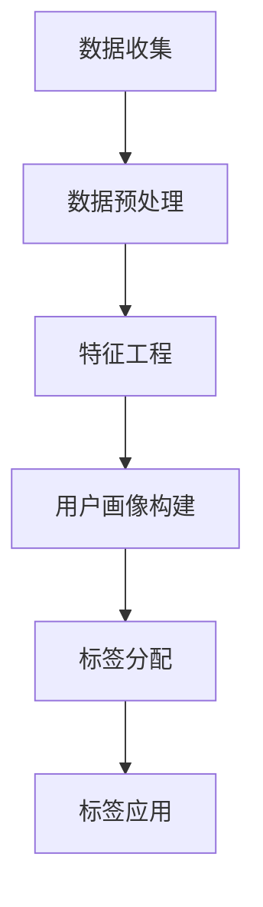

                 

关键词：用户画像、用户标签、数据挖掘、人工智能、用户特征、用户行为、用户价值、营销策略、个性化推荐

> 摘要：本文将探讨AI创业公司在构建用户画像与标签体系方面的关键要素，包括用户特征、用户行为和用户价值的挖掘与分析。通过结合实际案例和数学模型，本文旨在为AI创业公司提供一套科学、系统的用户画像与标签体系构建方法，以提升用户满意度、促进业务增长。

## 1. 背景介绍

在当今数字化时代，用户数据的收集、处理和分析已经成为企业竞争的重要手段。对于AI创业公司而言，准确、全面地了解用户特征、行为和价值，有助于制定有效的市场营销策略、优化产品设计和提高用户体验。然而，用户画像与标签体系的构建并非易事，需要综合运用数据挖掘、机器学习和人工智能等先进技术。

本文将围绕以下三个方面展开讨论：

1. 用户画像与标签体系的核心概念与联系。
2. 核心算法原理、具体操作步骤及其优缺点。
3. 数学模型和公式的构建与推导。

通过以上内容的介绍，旨在为AI创业公司提供一套科学、系统的用户画像与标签体系构建方法，以实现用户满意度和业务增长的共赢。

## 2. 核心概念与联系

在构建用户画像与标签体系之前，我们需要明确一些核心概念，包括用户特征、用户行为和用户价值。

### 2.1 用户特征

用户特征是指用户在数据中表现出来的各种属性，如年龄、性别、地理位置、职业等。这些特征是用户画像构建的基础，通过分类和聚类算法，可以将用户划分为不同的群体。

### 2.2 用户行为

用户行为是指用户在使用产品或服务过程中产生的操作，如浏览、购买、评价、分享等。这些行为数据反映了用户对产品的兴趣和需求，是分析用户价值和优化产品设计的依据。

### 2.3 用户价值

用户价值是指用户为企业带来的潜在收益，包括直接收益（如购买行为）和间接收益（如口碑传播、用户活跃度等）。评估用户价值有助于企业制定有针对性的营销策略，提高用户满意度和忠诚度。

### 2.4 用户画像与标签体系的联系

用户画像与标签体系是相互关联的。用户画像是对用户特征、行为和价值的综合描述，而标签则是用户画像的具体实现形式。通过为用户分配标签，企业可以快速、准确地识别和定位目标用户，从而实现个性化推荐、精准营销等业务目标。

### 2.5 Mermaid流程图

以下是一个简单的Mermaid流程图，展示了用户画像与标签体系的构建过程：



## 3. 核心算法原理 & 具体操作步骤

### 3.1 算法原理概述

在构建用户画像与标签体系的过程中，常用的算法包括分类算法、聚类算法和协同过滤算法。这些算法可以分别用于处理用户特征、用户行为和用户价值的分析。

- **分类算法**：用于将用户划分为不同的群体，如基于年龄、性别等特征进行分类。
- **聚类算法**：用于发现用户行为模式，如基于用户购买行为进行聚类。
- **协同过滤算法**：用于预测用户对某一产品的兴趣，如基于用户的历史行为进行推荐。

### 3.2 算法步骤详解

#### 3.2.1 数据收集

数据收集是用户画像与标签体系构建的基础。企业可以通过以下途径获取用户数据：

- **线上数据**：包括网站日志、APP 日志等。
- **线下数据**：包括问卷调查、用户访谈等。

#### 3.2.2 数据预处理

数据预处理包括数据清洗、数据整合和数据转换等步骤。具体操作如下：

- **数据清洗**：去除重复、错误和异常数据。
- **数据整合**：将不同来源的数据进行整合，形成一个统一的数据集。
- **数据转换**：将数据转换为适合算法处理的格式，如数值化、编码等。

#### 3.2.3 特征工程

特征工程是指从原始数据中提取出对用户画像构建有用的特征。具体操作如下：

- **特征选择**：选择对用户画像有显著影响的特征。
- **特征提取**：对选定的特征进行降维、转换等操作，以提高模型性能。

#### 3.2.4 用户画像构建

用户画像构建是指利用分类算法、聚类算法等，将用户划分为不同的群体，形成用户画像。具体操作如下：

- **用户特征分类**：根据用户特征进行分类，如基于年龄、性别等特征进行分类。
- **用户行为聚类**：根据用户行为数据进行聚类，如基于用户购买行为进行聚类。
- **用户价值评估**：利用协同过滤算法等，预测用户对某一产品的兴趣，评估用户价值。

#### 3.2.5 标签分配

标签分配是指将用户画像中的特征和标签进行关联，为用户分配标签。具体操作如下：

- **标签库构建**：根据业务需求构建标签库，如基于用户特征、用户行为和用户价值构建标签库。
- **标签分配规则**：制定标签分配规则，如根据用户年龄、购买行为等分配标签。

#### 3.2.6 标签应用

标签应用是指利用标签进行个性化推荐、精准营销等业务场景。具体操作如下：

- **个性化推荐**：根据用户标签，为用户推荐感兴趣的产品或内容。
- **精准营销**：根据用户标签，制定有针对性的营销策略，提高营销效果。

### 3.3 算法优缺点

- **分类算法**：优点在于可以实现精确的分类，但缺点是对于大规模数据集，训练时间较长。
- **聚类算法**：优点在于可以发现用户行为模式，但缺点是聚类结果可能存在不确定性。
- **协同过滤算法**：优点在于可以实现精准的推荐，但缺点是对于稀疏数据集，效果较差。

### 3.4 算法应用领域

用户画像与标签体系在以下领域具有广泛的应用：

- **市场营销**：通过分析用户画像和标签，制定有针对性的营销策略，提高营销效果。
- **产品设计**：通过分析用户行为和用户价值，优化产品设计，提高用户体验。
- **风险控制**：通过分析用户行为和用户价值，识别潜在风险用户，降低风险。

## 4. 数学模型和公式 & 详细讲解 & 举例说明

### 4.1 数学模型构建

在用户画像与标签体系的构建过程中，常用的数学模型包括分类模型、聚类模型和协同过滤模型。以下是一个简单的分类模型和聚类模型的构建过程。

#### 4.1.1 分类模型

分类模型用于将用户划分为不同的群体。一个简单的二分类模型可以表示为：

$$
P(y=1|X) = \sigma(\omega^T X)
$$

其中，$X$表示用户特征向量，$y$表示用户所属类别，$\sigma$表示sigmoid函数，$\omega$表示模型参数。

#### 4.1.2 聚类模型

聚类模型用于发现用户行为模式。一个简单的K-means聚类模型可以表示为：

$$
\begin{aligned}
\text{minimize} \quad & \sum_{i=1}^n \sum_{j=1}^k d(x_i, \mu_j)^2 \\
\text{subject to} \quad & x_i \in \mathbb{R}^d, \mu_j \in \mathbb{R}^d, d \in \mathbb{N} \\
& k \in \mathbb{N}
\end{aligned}
$$

其中，$x_i$表示用户特征向量，$\mu_j$表示聚类中心，$d$表示特征维度，$k$表示聚类个数。

### 4.2 公式推导过程

#### 4.2.1 分类模型公式推导

分类模型中的sigmoid函数可以表示为：

$$
\sigma(x) = \frac{1}{1 + e^{-x}}
$$

对于二分类问题，可以将sigmoid函数表示为：

$$
P(y=1|X) = \sigma(\omega^T X)
$$

其中，$\omega^T X$表示模型预测结果。

#### 4.2.2 聚类模型公式推导

K-means聚类模型的目标是最小化聚类中心与用户特征向量之间的距离平方和。具体公式为：

$$
\begin{aligned}
\text{minimize} \quad & \sum_{i=1}^n \sum_{j=1}^k d(x_i, \mu_j)^2 \\
\text{subject to} \quad & x_i \in \mathbb{R}^d, \mu_j \in \mathbb{R}^d, d \in \mathbb{N} \\
& k \in \mathbb{N}
\end{aligned}
$$

其中，$d(x_i, \mu_j)$表示用户特征向量$x_i$与聚类中心$\mu_j$之间的距离。

### 4.3 案例分析与讲解

#### 4.3.1 分类模型案例

假设我们有一个二分类问题，需要根据用户特征向量预测用户是否属于某一类别。用户特征向量可以表示为：

$$
X = [x_1, x_2, ..., x_d]
$$

模型参数可以表示为：

$$
\omega = [\omega_1, \omega_2, ..., \omega_d]
$$

我们可以使用以下公式进行预测：

$$
P(y=1|X) = \sigma(\omega^T X)
$$

如果$P(y=1|X) > 0.5$，则预测用户属于类别1；否则，预测用户属于类别2。

#### 4.3.2 聚类模型案例

假设我们需要对用户特征向量进行K-means聚类，聚类中心可以表示为：

$$
\mu_j = [\mu_{1j}, \mu_{2j}, ..., \mu_{dj}]
$$

用户特征向量可以表示为：

$$
x_i = [x_{i1}, x_{i2}, ..., x_{id}]
$$

我们可以使用以下公式进行聚类：

$$
\begin{aligned}
\text{minimize} \quad & \sum_{i=1}^n \sum_{j=1}^k d(x_i, \mu_j)^2 \\
\text{subject to} \quad & x_i \in \mathbb{R}^d, \mu_j \in \mathbb{R}^d, d \in \mathbb{N} \\
& k \in \mathbb{N}
\end{aligned}
$$

通过迭代计算，我们可以找到最佳的聚类中心，从而实现对用户特征向量的聚类。

## 5. 项目实践：代码实例和详细解释说明

### 5.1 开发环境搭建

在搭建开发环境时，我们选择Python作为主要编程语言，并使用以下工具和库：

- **Python**：3.8版本及以上
- **NumPy**：用于数据处理
- **Pandas**：用于数据预处理
- **Scikit-learn**：用于机器学习算法
- **Matplotlib**：用于数据可视化

安装以上库的方法如下：

```shell
pip install numpy pandas scikit-learn matplotlib
```

### 5.2 源代码详细实现

以下是一个简单的用户画像与标签体系构建的示例代码：

```python
import numpy as np
import pandas as pd
from sklearn.cluster import KMeans
from sklearn.preprocessing import StandardScaler
import matplotlib.pyplot as plt

# 加载数据集
data = pd.read_csv('user_data.csv')

# 数据预处理
data = data.drop_duplicates()
data = data.drop(['user_id'], axis=1)

# 特征工程
scaler = StandardScaler()
data_scaled = scaler.fit_transform(data)

# K-means聚类
kmeans = KMeans(n_clusters=3)
kmeans.fit(data_scaled)

# 聚类结果
labels = kmeans.labels_

# 用户画像
user_profile = pd.DataFrame(data_scaled, columns=data.columns)
user_profile['cluster'] = labels

# 可视化
plt.scatter(user_profile[data.columns[0]], user_profile[data.columns[1]], c=user_profile['cluster'])
plt.xlabel('Feature 1')
plt.ylabel('Feature 2')
plt.show()
```

### 5.3 代码解读与分析

以上代码实现了用户画像与标签体系的构建，具体步骤如下：

1. **加载数据集**：使用Pandas读取用户数据。
2. **数据预处理**：去除重复数据，并删除用户ID列。
3. **特征工程**：使用StandardScaler对数据进行标准化处理。
4. **K-means聚类**：使用Scikit-learn的KMeans类进行聚类，设置聚类个数为3。
5. **聚类结果**：获取聚类标签，并更新用户画像。
6. **可视化**：使用Matplotlib绘制聚类散点图，展示用户画像。

### 5.4 运行结果展示

运行以上代码，我们可以得到以下结果：

1. **聚类结果**：三个不同的聚类簇。
2. **用户画像**：基于聚类标签的用户特征向量。
3. **可视化**：聚类散点图，展示用户特征在不同维度上的分布。

## 6. 实际应用场景

用户画像与标签体系在多个实际应用场景中具有重要意义，以下列举几个典型应用：

### 6.1 个性化推荐

通过构建用户画像与标签体系，企业可以实现对用户的个性化推荐。例如，电商平台可以根据用户购买历史、浏览记录等特征，为用户推荐感兴趣的商品。

### 6.2 精准营销

企业可以根据用户画像与标签，制定有针对性的营销策略。例如，针对某一类用户群体，推送特定的广告或优惠活动，提高营销效果。

### 6.3 风险控制

金融机构可以利用用户画像与标签，识别潜在风险用户。例如，通过对用户行为进行分析，发现异常交易行为，从而采取相应的风险控制措施。

## 7. 未来应用展望

随着人工智能技术的不断发展，用户画像与标签体系在未来将发挥更加重要的作用。以下列举几个未来应用展望：

### 7.1 多模态数据融合

未来用户画像与标签体系的构建将不仅仅依赖于结构化数据，还将结合多模态数据，如图像、语音、视频等，以实现更全面、准确的用户画像。

### 7.2 智能化标签分配

通过引入深度学习等技术，可以实现智能化标签分配，提高标签的准确性和实用性。

### 7.3 跨领域应用

用户画像与标签体系在金融、电商、医疗等领域的应用前景广阔，未来将实现跨领域的数据融合与协同，为各行业提供更强大的数据支持。

## 8. 工具和资源推荐

### 8.1 学习资源推荐

- **《Python数据分析实战》**：深入讲解Python在数据分析中的应用，适合初学者入门。
- **《机器学习实战》**：详细介绍机器学习算法及其应用，适合有一定编程基础的学习者。

### 8.2 开发工具推荐

- **PyCharm**：功能强大的Python集成开发环境，支持多种编程语言。
- **Jupyter Notebook**：适合数据分析和机器学习的交互式开发环境。

### 8.3 相关论文推荐

- **“User Behavior Analysis in E-Commerce: A Survey”**：全面综述了电子商务领域用户行为分析的方法和应用。
- **“Deep User Behavior Prediction for Personalized Recommendation”**：探讨了基于深度学习的个性化推荐方法。

## 9. 总结：未来发展趋势与挑战

用户画像与标签体系作为人工智能领域的重要应用，未来将面临以下发展趋势与挑战：

### 9.1 发展趋势

1. **多模态数据融合**：结合多种数据类型，提高用户画像的准确性。
2. **智能化标签分配**：利用深度学习等技术，实现智能化标签分配。
3. **跨领域应用**：拓展用户画像与标签体系在金融、医疗等领域的应用。

### 9.2 挑战

1. **数据隐私与安全**：如何在保证用户隐私的前提下，有效利用用户数据进行画像与标签构建。
2. **数据质量与多样性**：如何处理数据质量问题，实现多样性的数据融合。
3. **算法性能与可解释性**：在提高算法性能的同时，确保算法的可解释性，以便于用户理解和接受。

未来，随着人工智能技术的不断发展，用户画像与标签体系将发挥更加重要的作用，为各行业提供强大的数据支持。

## 10. 附录：常见问题与解答

### 10.1  什么是用户画像？

用户画像是对用户特征、行为和价值进行综合描述的一种方法，旨在为企业提供关于用户的有用信息，以支持决策和业务优化。

### 10.2  用户标签有什么作用？

用户标签可以帮助企业快速识别和定位目标用户，从而实现个性化推荐、精准营销等业务目标。

### 10.3  用户画像与标签体系的构建需要哪些技术？

用户画像与标签体系的构建需要运用数据挖掘、机器学习和人工智能等技术，如分类算法、聚类算法、协同过滤算法等。

### 10.4  用户画像与标签体系在哪些领域有应用？

用户画像与标签体系在市场营销、产品设计、风险控制等多个领域有广泛应用，如电子商务、金融、医疗等。

### 10.5  如何处理数据隐私与安全问题？

在构建用户画像与标签体系时，需要严格遵守数据隐私保护法规，采取数据加密、匿名化等手段，确保用户数据的安全和隐私。

