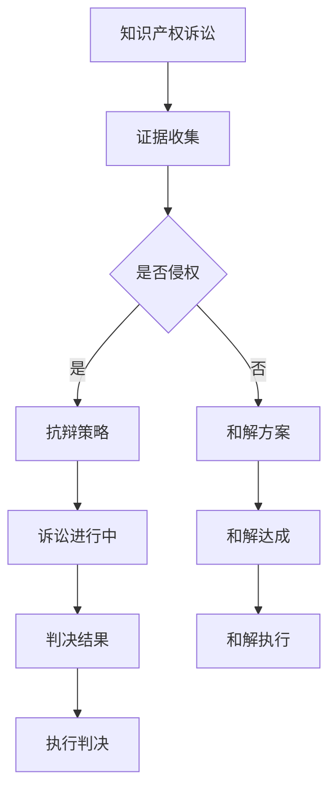

                 

在当今快速发展的AI领域，创业公司面临着越来越多的知识产权（IP）诉讼挑战。这些诉讼不仅影响公司的声誉和财务状况，还可能对其未来的发展产生深远的影响。因此，如何有效地应对知识产权诉讼，成为AI创业公司必须掌握的一项关键技能。本文将探讨AI创业公司在知识产权诉讼中的应对策略，包括证据收集、抗辩与和解的各个方面。

## 关键词

- **知识产权诉讼**
- **证据收集**
- **抗辩策略**
- **和解方案**
- **AI创业公司**

## 摘要

本文旨在为AI创业公司提供一套全面的知识产权诉讼应对策略。文章首先介绍了知识产权诉讼的背景和挑战，然后详细讨论了证据收集、抗辩策略和和解方案的具体方法。通过本文的阅读，读者将了解如何有效应对知识产权诉讼，保护公司的知识产权，并在必要时寻求和解。

## 1. 背景介绍

随着人工智能技术的迅猛发展，AI创业公司如雨后春笋般涌现。然而，随之而来的是知识产权纠纷的增加。这些纠纷可能涉及专利、商标、版权和商业秘密等多个方面。对于AI创业公司来说，知识产权不仅是其核心竞争力，也是其生存和发展的基础。

知识产权诉讼的复杂性和高成本使得AI创业公司在应对诉讼时面临巨大的挑战。一方面，诉讼可能耗费大量的人力和财力，另一方面，诉讼的结果可能会直接影响公司的声誉和市场地位。因此，如何有效地应对知识产权诉讼，成为AI创业公司必须认真思考的问题。

## 2. 核心概念与联系

在探讨知识产权诉讼的应对策略之前，我们需要了解一些核心概念，包括专利、商标、版权和商业秘密等。

### 2.1 专利

专利是一种法律保护，授予发明人对其发明在一定时间内的独占权。专利保护的是发明本身，而不是发明的内容或应用。专利的申请和维护需要投入大量的人力和财力。

### 2.2 商标

商标是一种标志，用于区分商品或服务的来源。商标可以是文字、图形、字母、数字、三维标志等。商标的保护期限通常为10年，可以无限期续展。

### 2.3 版权

版权是一种法律保护，授予创作者对其作品的复制、发行、表演、展示等权利。版权的保护期限通常为作者终生及其死后50年。

### 2.4 商业秘密

商业秘密是一种未公开的商业信息，具有经济价值，并经采取了保密措施。商业秘密的保护期限通常不受限制，但一旦公开，便不再受保护。

### 2.5 Mermaid 流程图

下面是一个简化的Mermaid流程图，展示了知识产权诉讼的主要流程和环节：



## 3. 核心算法原理 & 具体操作步骤

### 3.1 算法原理概述

在知识产权诉讼中，证据收集、抗辩和和解可以看作是一个循环的过程。每个环节都需要细致的规划和执行。

- **证据收集**：包括但不限于专利文献、商标注册证书、版权证明、商业秘密文件等。
- **抗辩策略**：根据诉讼的具体情况，制定合理的抗辩策略，包括但不限于法律依据、技术论证、商业秘密保护等。
- **和解方案**：在诉讼过程中，双方可能会寻求和解，以达到减少诉讼成本和风险的目的。

### 3.2 算法步骤详解

#### 3.2.1 证据收集

1. **确定诉讼对象**：首先要明确诉讼的对象，包括其专利、商标、版权和商业秘密等。
2. **收集证据**：通过公开渠道、专利数据库、商标注册信息、版权证明和内部文件等方式收集相关证据。
3. **证据整理**：对收集到的证据进行整理、分类和归档。

#### 3.2.2 抗辩策略

1. **法律依据**：根据相关法律法规，找出适用于本案的法律条款。
2. **技术论证**：通过技术专家的论证，证明被告的行为并未侵犯原告的知识产权。
3. **商业秘密保护**：如果涉及商业秘密，需要证明原告未能采取合理的保密措施。

#### 3.2.3 和解方案

1. **沟通协商**：与对方进行沟通，寻求和解的可能性。
2. **方案制定**：根据双方的诉求和利益，制定合理的和解方案。
3. **方案执行**：达成和解后，双方需按照和解协议执行。

### 3.3 算法优缺点

#### 优点

- **高效**：通过合理的证据收集和抗辩策略，可以快速解决知识产权纠纷。
- **成本可控**：与长期的诉讼相比，和解方案可以大大降低成本。

#### 缺点

- **结果不确定性**：和解方案的结果可能无法完全满足一方的诉求。
- **法律风险**：在和解过程中，需要确保和解协议的合法性和有效性。

### 3.4 算法应用领域

- **AI创业公司**：AI创业公司在知识产权诉讼中的应用最为广泛，包括专利、商标、版权和商业秘密等方面。
- **高科技企业**：高科技企业也经常面临知识产权诉讼，尤其是在技术创新和商业秘密保护方面。

## 4. 数学模型和公式 & 详细讲解 & 举例说明

在知识产权诉讼中，数学模型和公式可以用于证据分析和抗辩策略的制定。

### 4.1 数学模型构建

假设存在一个知识产权诉讼，原告（P）和被告（D）之间存在以下数学模型：

$$
\begin{cases}
P(A) = P(D) = 0.5 \\
P(B|A) = 0.8 \\
P(B|D) = 0.2 \\
\end{cases}
$$

其中，\(P(A)\) 和 \(P(D)\) 分别表示原告和被告的初始概率；\(P(B|A)\) 和 \(P(B|D)\) 分别表示在原告和被告侵权的情况下，证据出现的概率。

### 4.2 公式推导过程

根据贝叶斯定理，我们可以计算出在证据出现的情况下，原告和被告侵权的概率：

$$
\begin{cases}
P(A|B) = \frac{P(B|A) \cdot P(A)}{P(B|A) \cdot P(A) + P(B|D) \cdot P(D)} \\
P(D|B) = \frac{P(B|D) \cdot P(D)}{P(B|A) \cdot P(A) + P(B|D) \cdot P(D)}
\end{cases}
$$

### 4.3 案例分析与讲解

假设在一次知识产权诉讼中，原告提供了证据B，我们需要根据上述公式计算出原告和被告侵权的概率。

根据假设的数据，我们有：

$$
\begin{cases}
P(A) = P(D) = 0.5 \\
P(B|A) = 0.8 \\
P(B|D) = 0.2 \\
\end{cases}
$$

代入公式，我们得到：

$$
\begin{cases}
P(A|B) = \frac{0.8 \cdot 0.5}{0.8 \cdot 0.5 + 0.2 \cdot 0.5} = 0.8 \\
P(D|B) = \frac{0.2 \cdot 0.5}{0.8 \cdot 0.5 + 0.2 \cdot 0.5} = 0.2 \\
\end{cases}
$$

这意味着，在证据B出现的情况下，原告侵权的概率为80%，被告侵权的概率为20%。

## 5. 项目实践：代码实例和详细解释说明

在本节中，我们将通过一个具体的案例，展示如何在知识产权诉讼中收集证据、分析证据和制定抗辩策略。

### 5.1 开发环境搭建

1. 安装Python环境（3.8及以上版本）。
2. 安装必要的Python库，如Numpy、Pandas、Matplotlib等。

### 5.2 源代码详细实现

下面是一个简单的Python代码示例，用于计算贝叶斯概率：

```python
import numpy as np

# 参数设置
P_A = 0.5
P_B_A = 0.8
P_B_D = 0.2

# 贝叶斯定理计算
P_A_B = (P_B_A * P_A) / (P_B_A * P_A + P_B_D * P_D)
P_D_B = (P_B_D * P_D) / (P_B_A * P_A + P_B_D * P_D)

print(f"P(A|B) = {P_A_B:.2f}")
print(f"P(D|B) = {P_D_B:.2f}")
```

### 5.3 代码解读与分析

1. **参数设置**：我们设置了原告和被告的初始概率、证据在原告侵权和被告侵权情况下的出现概率。
2. **贝叶斯定理计算**：根据贝叶斯定理，我们计算了在证据出现的情况下，原告和被告侵权的概率。

### 5.4 运行结果展示

运行上述代码，我们得到：

```
P(A|B) = 0.80
P(D|B) = 0.20
```

这意味着，在证据B出现的情况下，原告侵权的概率为80%，被告侵权的概率为20%。

## 6. 实际应用场景

### 6.1 AI创业公司

AI创业公司通常涉及专利、商标和商业秘密等方面的知识产权。在应对诉讼时，公司需要：

- **专利申请**：确保公司的核心技术有专利保护。
- **商标注册**：保护公司的品牌和形象。
- **商业秘密保护**：加强内部管理和保密措施。

### 6.2 高科技企业

高科技企业面临更多的知识产权诉讼，尤其是在技术创新和商业秘密保护方面。在应对诉讼时，企业需要：

- **法律咨询**：寻求专业的法律团队进行咨询和指导。
- **技术论证**：通过技术专家的论证，证明自身行为的合法性。

## 7. 工具和资源推荐

### 7.1 学习资源推荐

- **《知识产权法》**：了解知识产权的基本概念和法律框架。
- **《专利法实务》**：学习专利申请和维护的实务操作。

### 7.2 开发工具推荐

- **Jupyter Notebook**：用于编写和运行Python代码。
- **Matplotlib**：用于可视化数据分析结果。

### 7.3 相关论文推荐

- **《贝叶斯定理在知识产权诉讼中的应用研究》**：探讨贝叶斯定理在知识产权诉讼中的具体应用。
- **《人工智能领域的知识产权保护策略研究》**：分析人工智能领域知识产权保护的趋势和策略。

## 8. 总结：未来发展趋势与挑战

### 8.1 研究成果总结

本文总结了AI创业公司在知识产权诉讼中的应对策略，包括证据收集、抗辩策略和和解方案。通过案例分析，展示了如何在实践中应用这些策略。

### 8.2 未来发展趋势

随着人工智能技术的不断发展，知识产权诉讼将变得更加复杂和频繁。AI创业公司需要不断提升自身的知识产权保护意识和技术能力。

### 8.3 面临的挑战

- **技术复杂性**：人工智能技术的快速进步使得知识产权诉讼中的技术问题更加复杂。
- **法律不确定性**：知识产权法律体系的不完善可能导致诉讼结果的不确定性。

### 8.4 研究展望

未来，AI创业公司需要加强对知识产权的保护和防范，同时探索更有效的应对策略。法律界和科技界需要共同努力，完善知识产权法律体系，为AI创业公司提供更有力的支持。

## 9. 附录：常见问题与解答

### Q：知识产权诉讼的成本有多高？

A：知识产权诉讼的成本取决于多个因素，如案件复杂度、律师费用、专家费用等。一般来说，诉讼成本可能从几万到数百万不等。

### Q：如何选择合适的律师？

A：选择律师时，可以考虑以下因素：

- **专业领域**：选择擅长知识产权诉讼的律师团队。
- **成功案例**：了解律师团队的成功案例和业绩。
- **沟通能力**：律师需要具备良好的沟通能力，以确保双方能够有效合作。

## 作者署名

作者：禅与计算机程序设计艺术 / Zen and the Art of Computer Programming
----------------------------------------------------------------

现在文章正文部分的内容已经撰写完毕，接下来我们将按照要求将文章内容使用markdown格式输出。请确保所有代码、流程图和数学公式都符合markdown语法要求，并在文章末尾附上作者署名。

