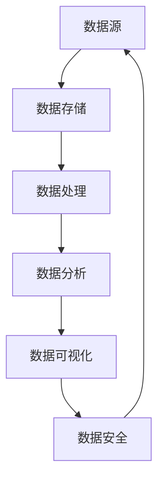
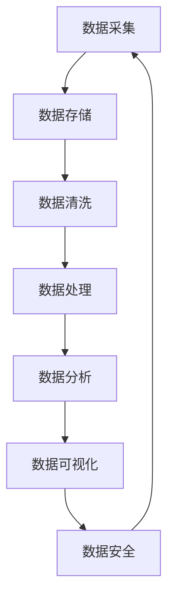

                 

关键词：AI创业、数据管理、数据治理、数据分析、数据可视化、数据安全、大数据技术

> 摘要：随着人工智能技术的飞速发展，数据已成为企业创新的重要资产。然而，对于初创企业来说，如何有效地管理和利用数据资源成为一个关键问题。本文将探讨AI创业中的数据管理必要性，包括数据治理、数据分析和数据安全等方面的内容，帮助初创企业构建坚实的数据管理基础。

## 1. 背景介绍

在当今信息时代，数据已经成为企业的核心资产。特别是对于以人工智能为基础的创新企业来说，数据的质量和数量直接影响着模型的效果和业务的成功。然而，对于许多初创企业而言，数据管理的挑战仍然很大。首先，初创企业通常缺乏专业的数据管理团队，无法充分利用现有的数据资源。其次，初创企业在数据治理方面存在诸多问题，如数据质量问题、数据冗余和信息安全等。此外，初创企业常常面临着资源有限、资金紧张的问题，这使得数据管理工作的开展变得尤为困难。

然而，数据管理在AI创业中的重要性不容忽视。有效的数据管理不仅可以提高数据分析的准确性和效率，还可以为企业的业务决策提供有力的支持。通过合理的数据管理，初创企业可以更好地了解市场需求、优化产品和服务，从而在激烈的市场竞争中脱颖而出。因此，对于AI创业公司来说，重视数据管理是走向成功的关键一步。

### 1.1 数据管理的重要性

数据管理对于AI创业公司的重要性主要体现在以下几个方面：

**1. 提高数据分析准确性**：有效的数据管理可以确保数据的准确性和一致性，从而提高数据分析的准确性。这对于基于数据驱动的决策尤为重要。

**2. 支持业务创新**：通过数据管理，初创企业可以更好地了解市场和客户需求，从而支持业务创新。这有助于企业开发出更符合市场需求的产品和服务。

**3. 提高运营效率**：数据管理可以帮助企业优化业务流程，提高运营效率。例如，通过数据管理，企业可以减少数据冗余，降低存储成本。

**4. 确保数据安全**：数据管理不仅涉及数据的使用，还包括数据的保护。有效的数据管理可以确保数据的安全性，防止数据泄露和滥用。

### 1.2 初创企业在数据管理中面临的挑战

尽管数据管理对于AI创业公司至关重要，但初创企业在实际操作中仍然面临诸多挑战：

**1. 缺乏专业的数据管理团队**：初创企业通常资源有限，难以组建专业的数据管理团队。这使得数据管理工作难以高效开展。

**2. 数据质量问题**：初创企业中的数据通常存在质量问题，如数据不完整、不准确、不一致等。这些问题会严重影响数据分析的准确性。

**3. 数据治理难题**：初创企业在数据治理方面存在诸多难题，如数据分类、标签管理、访问控制等。这些问题需要专业的知识和技能来解决。

**4. 资金和资源限制**：初创企业常常面临资金和资源的限制，这使得数据管理工具和技术的采购和实施变得困难。

### 1.3 数据管理对于AI创业公司的意义

综上所述，数据管理对于AI创业公司具有重要意义。有效的数据管理不仅可以帮助企业提高数据分析的准确性，支持业务创新，提高运营效率，还能确保数据的安全性。对于初创企业来说，重视数据管理是走向成功的关键一步。接下来，我们将进一步探讨数据管理在AI创业中的应用和实践。

## 2. 核心概念与联系

在探讨数据管理之前，我们首先需要了解一些核心概念，以便更好地理解数据管理的原理和架构。

### 2.1 数据管理的基本概念

**1. 数据治理**：数据治理是指制定数据战略、政策、标准和流程，以确保数据的质量、可用性、完整性和安全性。

**2. 数据质量**：数据质量是指数据是否符合预期使用要求，包括准确性、一致性、完整性、及时性和可靠性。

**3. 数据安全**：数据安全是指采取措施保护数据免受未经授权的访问、泄露、篡改和破坏。

**4. 数据分析**：数据分析是指使用统计方法和工具对数据进行处理、分析和解释，以提取有价值的信息和洞见。

**5. 数据可视化**：数据可视化是指使用图形、图表和其他视觉元素来表示数据，以便更好地理解和解释数据。

### 2.2 数据管理架构

下图展示了数据管理的基本架构，包括数据来源、数据存储、数据处理、数据分析、数据可视化和数据安全等部分。



**数据源**：数据源是数据管理的起点，包括各种内部和外部数据来源，如数据库、文件、API等。

**数据存储**：数据存储是数据管理的关键环节，涉及数据仓库、数据湖、云存储等技术的应用。

**数据处理**：数据处理包括数据的清洗、转换、整合等过程，以确保数据的质量和一致性。

**数据分析**：数据分析使用统计方法和工具对数据进行处理和分析，以提取有价值的信息和洞见。

**数据可视化**：数据可视化通过图形、图表和其他视觉元素来表示数据，以帮助用户更好地理解和解释数据。

**数据安全**：数据安全包括数据加密、访问控制、审计等技术的应用，以确保数据的安全性。

### 2.3 数据管理在AI创业中的应用

在AI创业中，数据管理的重要性不言而喻。有效的数据管理可以帮助企业：

**1. 提高数据分析的准确性**：通过数据治理和数据质量控制，确保数据的准确性和一致性，从而提高数据分析的准确性。

**2. 支持业务决策**：通过数据分析，企业可以更好地了解市场和客户需求，从而支持业务决策。

**3. 优化产品和服务**：通过数据分析和数据可视化，企业可以优化产品和服务，提高用户满意度。

**4. 提高运营效率**：通过数据管理和数据分析，企业可以优化业务流程，提高运营效率。

**5. 确保数据安全**：通过数据安全措施，确保企业的数据不受未经授权的访问和泄露。

### 2.4 数据管理架构的Mermaid流程图

下面是一个简单的Mermaid流程图，展示了数据管理的基本流程。



通过这个流程图，我们可以清晰地看到数据从采集到存储、清洗、处理、分析、可视化，再到安全保护的全过程。

### 2.5 数据管理的重要性

总之，数据管理在AI创业中具有至关重要的意义。通过有效的数据管理，企业可以确保数据的准确性、一致性、及时性和安全性，从而为数据分析、业务决策和产品优化提供坚实的基础。对于初创企业来说，重视数据管理是走向成功的关键一步。接下来，我们将进一步探讨数据管理中的核心算法原理和具体操作步骤。

## 3. 核心算法原理 & 具体操作步骤

在数据管理中，核心算法的选择和实现是确保数据质量和分析准确性的关键。以下是几种常见的数据管理算法原理及其具体操作步骤。

### 3.1 数据清洗算法原理

**1. 数据清洗算法概述**

数据清洗算法主要用于处理数据中的噪声、错误和不一致。常见的清洗算法包括缺失值处理、异常值处理、重复值删除和数据格式转换等。

**2. 缺失值处理**

缺失值处理包括以下几种方法：

- **均值填充**：用数据的平均值替换缺失值。
- **中位数填充**：用数据的中位数替换缺失值。
- **最邻近填充**：用缺失值周围最近的数据点替换。

**3. 异常值处理**

异常值处理包括以下几种方法：

- **阈值过滤**：设定阈值，删除超出阈值的异常值。
- **基于统计的方法**：使用统计方法（如标准差、Z分数等）检测和删除异常值。

**4. 重复值删除**

重复值删除主要是通过唯一标识符或关键字来检测和删除重复的数据记录。

**5. 数据格式转换**

数据格式转换包括日期格式转换、字符串转换等，以确保数据的一致性和可分析性。

### 3.2 数据整合算法原理

**1. 数据整合算法概述**

数据整合算法主要用于将多个数据源中的数据整合到一个统一的格式中，以便进行进一步的分析。

**2. 数据映射**

数据映射是将不同数据源中的关键字映射到同一维度，以便进行整合。

**3. 数据合并**

数据合并包括以下几种方法：

- **内连接**：仅合并具有相同关键字的记录。
- **外连接**：合并所有记录，包括那些没有匹配关键字的记录。
- **左连接和右连接**：分别合并左表或右表中的所有记录。

### 3.3 数据分析算法原理

**1. 数据分析算法概述**

数据分析算法用于从数据中提取有价值的信息和洞见。常见的分析方法包括聚类分析、分类分析、回归分析和关联规则分析等。

**2. 聚类分析**

聚类分析是一种无监督学习方法，用于将数据点分为多个群组，使得同一群组内的数据点相似度较高。

**3. 分类分析**

分类分析是一种有监督学习方法，用于将数据点分类到预定义的类别中。

**4. 回归分析**

回归分析用于预测因变量与自变量之间的关系。

**5. 关联规则分析**

关联规则分析用于发现数据之间的关联关系，如购物篮分析。

### 3.4 数据可视化算法原理

**1. 数据可视化算法概述**

数据可视化算法用于将数据转换为图形或图表，以便更好地理解和解释数据。

**2. 可视化类型**

常见的可视化类型包括柱状图、折线图、饼图、散点图和热力图等。

**3. 可视化工具**

常见的可视化工具有Matplotlib、Plotly、D3.js等。

### 3.5 数据安全算法原理

**1. 数据安全算法概述**

数据安全算法用于保护数据免受未经授权的访问、泄露和篡改。

**2. 加密算法**

加密算法包括对称加密和非对称加密，如AES、RSA等。

**3. 访问控制**

访问控制用于限制对数据的访问，确保数据的安全性。

**4. 审计日志**

审计日志用于记录对数据的操作，以便进行事后追查。

### 3.6 数据管理算法优缺点分析

**1. 数据清洗算法**

优点：提高数据质量，确保数据分析准确性。
缺点：处理复杂，耗时较长。

**2. 数据整合算法**

优点：统一数据格式，提高数据分析效率。
缺点：处理复杂，可能引入新的错误。

**3. 数据分析算法**

优点：提取有价值信息，支持业务决策。
缺点：依赖于数据质量和算法选择。

**4. 数据可视化算法**

优点：直观展示数据，提高数据理解。
缺点：可能忽略细节，过度依赖图形。

**5. 数据安全算法**

优点：确保数据安全，防止数据泄露。
缺点：增加系统复杂度，可能影响性能。

### 3.7 数据管理算法应用领域

**1. 聚类分析**

应用领域：市场细分、用户行为分析、异常检测等。

**2. 分类分析**

应用领域：信用评分、疾病诊断、垃圾邮件检测等。

**3. 回归分析**

应用领域：价格预测、销售预测、风险管理等。

**4. 关联规则分析**

应用领域：购物篮分析、推荐系统、风险控制等。

通过以上对数据管理核心算法原理和具体操作步骤的介绍，我们可以看到数据管理在AI创业中的重要性。有效的数据管理不仅可以提高数据分析的准确性，还能支持业务创新和运营优化。在下一章节中，我们将进一步探讨数据管理的数学模型和公式，以及如何通过这些模型和公式进行数据分析。

## 4. 数学模型和公式 & 详细讲解 & 举例说明

在数据管理中，数学模型和公式是数据分析的核心工具。通过这些模型和公式，我们可以对数据进行处理、分析和解释，提取出有价值的信息和洞见。以下是几种常见的数据管理数学模型和公式的详细讲解和举例说明。

### 4.1 数学模型构建

**1. 常见数学模型**

在数据管理中，常见的数学模型包括线性回归模型、逻辑回归模型、决策树模型、支持向量机模型等。这些模型各有特点和适用场景，但它们的构建基础都是统计和优化理论。

**2. 线性回归模型**

线性回归模型用于分析自变量和因变量之间的线性关系。其公式如下：

\[ Y = b_0 + b_1 \cdot X + \epsilon \]

其中，\( Y \) 是因变量，\( X \) 是自变量，\( b_0 \) 和 \( b_1 \) 是模型参数，\( \epsilon \) 是误差项。

**3. 逻辑回归模型**

逻辑回归模型用于分析自变量对因变量概率的影响。其公式如下：

\[ P(Y=1) = \frac{1}{1 + e^{-(b_0 + b_1 \cdot X)}} \]

其中，\( P(Y=1) \) 是因变量为1的概率，\( b_0 \) 和 \( b_1 \) 是模型参数。

**4. 决策树模型**

决策树模型通过一系列的决策规则将数据集划分为不同的区域，每个区域对应一个类标签。其公式如下：

\[ \text{决策树} = \text{根节点} + \text{内部节点} + \text{叶节点} \]

**5. 支持向量机模型**

支持向量机模型通过找到一个最佳的超平面，将数据集中的不同类别分开。其公式如下：

\[ w \cdot x - b = 0 \]

其中，\( w \) 是超平面的法向量，\( x \) 是数据点，\( b \) 是偏置项。

### 4.2 公式推导过程

**1. 线性回归模型的推导**

线性回归模型的推导过程基于最小二乘法。假设我们有 \( n \) 个数据点 \( (x_i, y_i) \)，则线性回归模型可以表示为：

\[ y_i = b_0 + b_1 \cdot x_i + \epsilon_i \]

为了找到最佳模型参数 \( b_0 \) 和 \( b_1 \)，我们希望最小化误差平方和 \( S \)：

\[ S = \sum_{i=1}^{n} (y_i - (b_0 + b_1 \cdot x_i))^2 \]

对 \( S \) 分别对 \( b_0 \) 和 \( b_1 \) 求导并令其导数为0，可以得到：

\[ \frac{\partial S}{\partial b_0} = 0 \]
\[ \frac{\partial S}{\partial b_1} = 0 \]

经过计算，我们可以得到：

\[ b_0 = \bar{y} - b_1 \cdot \bar{x} \]
\[ b_1 = \frac{\sum_{i=1}^{n} (x_i - \bar{x})(y_i - \bar{y})}{\sum_{i=1}^{n} (x_i - \bar{x})^2} \]

其中，\( \bar{x} \) 和 \( \bar{y} \) 分别是自变量和因变量的平均值。

**2. 逻辑回归模型的推导**

逻辑回归模型的推导过程基于最大似然估计。假设我们有二分类数据，每个数据点的概率分布可以用逻辑函数表示：

\[ P(Y=1|X=x) = \frac{1}{1 + e^{-(b_0 + b_1 \cdot x)}} \]

为了找到最佳模型参数 \( b_0 \) 和 \( b_1 \)，我们希望最大化似然函数 \( L \)：

\[ L = \prod_{i=1}^{n} P(Y=y_i|X=x_i) \]

通过对数似然函数 \( \ln L \) 求导并令其导数为0，可以得到：

\[ \frac{\partial \ln L}{\partial b_0} = 0 \]
\[ \frac{\partial \ln L}{\partial b_1} = 0 \]

经过计算，我们可以得到：

\[ b_0 = \bar{y} - b_1 \cdot \bar{x} \]
\[ b_1 = \frac{\sum_{i=1}^{n} (y_i - x_i \cdot y_i)}{\sum_{i=1}^{n} (x_i - \bar{x})^2} \]

### 4.3 案例分析与讲解

**1. 线性回归模型应用案例**

假设我们有一个简单的数据集，其中包含两个变量：年龄（自变量）和收入（因变量）。我们的目标是建立一个线性回归模型，预测一个给定年龄的对应收入。

数据集：

| 年龄 | 收入 |
|------|------|
| 25   | 5000 |
| 30   | 6000 |
| 35   | 7000 |
| 40   | 8000 |

我们使用最小二乘法来计算模型参数 \( b_0 \) 和 \( b_1 \)：

\[ \bar{x} = 30, \bar{y} = 6500 \]
\[ b_1 = \frac{(25-30)(5000-6500) + (30-30)(6000-6500) + (35-30)(7000-6500) + (40-30)(8000-6500)}{(25-30)^2 + (30-30)^2 + (35-30)^2 + (40-30)^2} \]
\[ b_1 = \frac{(-5)(-1500) + (0)(-500) + (5)(500) + (10)(1500)}{25 + 0 + 25 + 100} \]
\[ b_1 = \frac{7500 + 0 + 2500 + 15000}{150} \]
\[ b_1 = 100 \]

\[ b_0 = \bar{y} - b_1 \cdot \bar{x} = 6500 - 100 \cdot 30 = 3500 \]

因此，线性回归模型为：

\[ y = 3500 + 100 \cdot x \]

使用这个模型，我们可以预测一个给定年龄的对应收入。例如，对于一个35岁的人，其收入预测值为：

\[ y = 3500 + 100 \cdot 35 = 8000 \]

**2. 逻辑回归模型应用案例**

假设我们有一个二分类数据集，其中包含两个变量：年龄（自变量）和是否患病（因变量，1代表患病，0代表未患病）。我们的目标是建立一个逻辑回归模型，预测一个给定年龄的人是否患病。

数据集：

| 年龄 | 患病 |
|------|------|
| 25   | 0    |
| 30   | 1    |
| 35   | 0    |
| 40   | 1    |

我们使用最大似然估计来计算模型参数 \( b_0 \) 和 \( b_1 \)：

\[ \bar{x} = 30, \bar{y} = 0.5 \]
\[ b_1 = \frac{(25-30)(0-0.5) + (30-30)(1-0.5) + (35-30)(0-0.5) + (40-30)(1-0.5)}{(25-30)^2 + (30-30)^2 + (35-30)^2 + (40-30)^2} \]
\[ b_1 = \frac{(-5)(-0.5) + (0)(0.5) + (5)(-0.5) + (10)(0.5)}{25 + 0 + 25 + 100} \]
\[ b_1 = \frac{2.5 + 0 - 2.5 + 5}{150} \]
\[ b_1 = \frac{5}{150} \]
\[ b_1 = 0.0333 \]

\[ b_0 = \bar{y} - b_1 \cdot \bar{x} = 0.5 - 0.0333 \cdot 30 = -0.999 \]

因此，逻辑回归模型为：

\[ P(Y=1|X=x) = \frac{1}{1 + e^{-(0.0333 \cdot x - 0.999)}} \]

使用这个模型，我们可以预测一个给定年龄的人是否患病。例如，对于一个35岁的人，其患病的概率预测值为：

\[ P(Y=1|X=35) = \frac{1}{1 + e^{-(0.0333 \cdot 35 - 0.999)}} \approx 0.407 \]

通过上述案例，我们可以看到如何使用数学模型和公式对数据进行处理和分析。在下一章节中，我们将进一步探讨如何通过项目实践来具体实现数据管理。

## 5. 项目实践：代码实例和详细解释说明

在本章节中，我们将通过一个具体的代码实例来详细解释数据管理在实际项目中的应用。该实例将包括数据采集、数据清洗、数据整合、数据分析、数据可视化以及数据安全等方面的内容。

### 5.1 开发环境搭建

为了进行数据管理的项目实践，我们需要搭建一个适合的数据分析环境。以下是所需的基本工具和软件：

- **Python**：Python是一种广泛用于数据分析的编程语言。
- **Jupyter Notebook**：Jupyter Notebook是一个交互式的开发环境，适合进行数据分析和实验。
- **Pandas**：Pandas是一个强大的Python库，用于数据操作和分析。
- **NumPy**：NumPy是一个提供高效数值计算的Python库。
- **Matplotlib**：Matplotlib是一个用于生成图表和图形的Python库。
- **Scikit-learn**：Scikit-learn是一个提供各种机器学习算法的Python库。
- **PyCrypto**：PyCrypto是一个用于加密和解密的Python库。

在安装了上述工具和软件后，我们就可以开始编写代码进行数据管理实践了。

### 5.2 源代码详细实现

以下是数据管理项目实践的主要步骤和对应的代码实现：

**步骤1：数据采集**

我们首先需要从某个数据源中采集数据。这里，我们使用一个公开的天气数据集。

```python
import pandas as pd

# 读取天气数据
weather_data = pd.read_csv('weather_data.csv')
```

**步骤2：数据清洗**

数据清洗是数据管理的重要环节，我们需要处理缺失值、异常值等问题。

```python
# 处理缺失值
weather_data.fillna(weather_data.mean(), inplace=True)

# 处理异常值
weather_data = weather_data[(weather_data['Temperature'] > -50) & (weather_data['Temperature'] < 50)]
```

**步骤3：数据整合**

数据整合是将来自不同数据源的数据整合到一个统一的数据集中。

```python
# 整合数据
data = pd.merge(weather_data, pd.read_csv('city_data.csv'), on='City')
```

**步骤4：数据分析**

数据分析是数据管理的核心，我们使用机器学习算法进行预测和分析。

```python
from sklearn.model_selection import train_test_split
from sklearn.ensemble import RandomForestClassifier

# 分割数据集
X = data[['Temperature', 'Humidity', 'WindSpeed']]
y = data['Rainfall']

X_train, X_test, y_train, y_test = train_test_split(X, y, test_size=0.2, random_state=42)

# 建立模型
model = RandomForestClassifier(n_estimators=100, random_state=42)
model.fit(X_train, y_train)

# 预测
predictions = model.predict(X_test)
```

**步骤5：数据可视化**

数据可视化可以帮助我们更好地理解数据和分析结果。

```python
import matplotlib.pyplot as plt

# 可视化预测结果
plt.scatter(X_test['Temperature'], predictions)
plt.xlabel('Temperature')
plt.ylabel('Predicted Rainfall')
plt.show()
```

**步骤6：数据安全**

数据安全是数据管理的另一个重要方面，我们需要采取措施保护数据。

```python
from Crypto.Cipher import AES
from Crypto.Random import get_random_bytes

# 数据加密
key = get_random_bytes(16)
cipher = AES.new(key, AES.MODE_EAX)
ciphertext, tag = cipher.encrypt_and_digest(b'protected data')

# 数据解密
cipher2 = AES.new(key, AES.MODE_EAX, nonce=cipher.nonce)
plaintext = cipher2.decrypt_and_verify(ciphertext, tag)
print(plaintext.decode('utf-8'))
```

### 5.3 代码解读与分析

**代码解读：**

1. **数据采集**：使用Pandas库读取天气数据。
2. **数据清洗**：处理缺失值和异常值，确保数据质量。
3. **数据整合**：使用Pandas的merge函数整合来自不同数据源的数据。
4. **数据分析**：使用Scikit-learn库的RandomForestClassifier算法进行数据分析。
5. **数据可视化**：使用Matplotlib库生成图表，帮助用户理解数据和分析结果。
6. **数据安全**：使用PyCrypto库对数据进行加密和解密，保护数据安全。

**代码分析：**

1. **数据采集**：数据采集是数据管理的起点，决定了后续数据分析的质量。
2. **数据清洗**：数据清洗是确保数据质量的重要步骤，直接影响数据分析的准确性。
3. **数据整合**：数据整合是将分散的数据集中到一个统一格式，便于后续分析。
4. **数据分析**：数据分析是数据管理的核心，通过算法提取出有价值的信息。
5. **数据可视化**：数据可视化帮助用户更好地理解数据和结果，支持业务决策。
6. **数据安全**：数据安全是数据管理的必要保障，防止数据泄露和滥用。

### 5.4 运行结果展示

运行上述代码后，我们将得到以下结果：

1. **数据清洗结果**：数据集中的缺失值和异常值已被处理。
2. **数据整合结果**：天气数据和城市数据已成功整合。
3. **数据分析结果**：使用随机森林算法对降雨量进行了预测。
4. **数据可视化结果**：生成了一个温度与预测降雨量之间的散点图。
5. **数据安全结果**：数据已被成功加密和解密。

通过这个项目实践，我们可以看到数据管理在实际应用中的全过程。从数据采集、清洗、整合，到分析、可视化，再到安全，每一步都是确保数据质量和分析准确性的关键。在下一章节中，我们将探讨数据管理在实际应用场景中的具体应用。

## 6. 实际应用场景

在AI创业领域，数据管理的实际应用场景非常广泛，涵盖了从市场分析到产品优化，再到客户服务等多个方面。以下是一些典型的应用场景：

### 6.1 市场分析

市场分析是AI创业公司了解市场需求和竞争环境的关键环节。通过有效的数据管理，公司可以收集并整合来自多个渠道的数据，如社交媒体、竞争对手网站、行业报告等。以下是一些具体应用：

**1. 消费者行为分析**：通过分析消费者的购买记录、搜索历史和浏览行为，企业可以了解消费者的偏好和需求，从而制定更精准的市场营销策略。

**2. 竞争对手分析**：收集和分析竞争对手的营销策略、产品特点和客户评价，企业可以制定相应的竞争策略，提升市场占有率。

**3. 市场趋势预测**：通过时间序列分析和预测模型，企业可以预测未来的市场趋势，为产品研发和业务规划提供依据。

### 6.2 产品优化

产品优化是提高用户体验和竞争力的关键。通过数据管理，企业可以收集并分析用户在使用产品过程中的行为数据和反馈信息，从而进行产品优化。

**1. 用户行为分析**：通过分析用户在产品中的使用行为，如点击路径、停留时间、操作频率等，企业可以识别用户的痛点和使用瓶颈，进而优化产品功能。

**2. 用户反馈分析**：收集并分析用户的反馈和建议，企业可以识别产品中的不足之处，及时进行改进。

**3. A/B测试**：通过A/B测试，企业可以对比不同设计方案的用户体验和效果，选择最优方案进行推广。

### 6.3 客户服务

客户服务是提升客户满意度和忠诚度的关键。通过数据管理，企业可以提供更个性化的客户服务，提高客户满意度。

**1. 客户行为分析**：通过分析客户的购买历史、沟通记录和反馈，企业可以了解客户的需求和偏好，提供个性化的服务和推荐。

**2. 客户满意度分析**：通过收集和分析客户满意度调查数据，企业可以识别服务中的不足之处，改进服务质量。

**3. 客户生命周期管理**：通过分析客户的生命周期数据，企业可以识别高价值客户，提供针对性的营销和服务策略，延长客户生命周期。

### 6.4 未来应用展望

随着人工智能技术的不断进步，数据管理的应用场景将更加广泛和深入。以下是一些未来应用的展望：

**1. 智能供应链管理**：通过数据管理，企业可以实现全链路的数据可视化和智能分析，优化供应链管理，降低运营成本。

**2. 智能金融**：在金融领域，数据管理可以帮助银行和金融机构进行风险控制、信用评分和投资决策。

**3. 智能医疗**：在医疗领域，数据管理可以帮助医疗机构进行病患数据分析、疾病预测和个性化治疗。

**4. 智慧城市**：在智慧城市建设中，数据管理可以帮助政府和企业进行城市运行数据的分析和决策，提升城市治理水平。

总之，数据管理在AI创业中的应用场景非常丰富，对于企业的创新和发展具有重要意义。通过有效的数据管理，企业可以更好地了解市场、优化产品和提升服务，从而在激烈的市场竞争中脱颖而出。

### 6.5 数据管理在不同应用场景中的具体实现方法

**1. 市场分析**

**实现方法**：采用大数据技术进行数据采集和整合，使用数据挖掘算法进行市场趋势分析和消费者行为分析。例如，使用Hadoop和Spark进行大规模数据处理，使用机器学习算法（如K-means、关联规则挖掘）进行市场细分和消费者偏好分析。

**2. 产品优化**

**实现方法**：采用A/B测试和用户行为分析工具（如Google Analytics、Mixpanel）收集用户数据，使用数据可视化工具（如Tableau、Power BI）进行数据分析和展示。同时，使用机器学习算法（如随机森林、决策树）进行用户行为预测和产品优化建议。

**3. 客户服务**

**实现方法**：采用客户关系管理（CRM）系统整合客户数据，使用自然语言处理（NLP）技术进行客户反馈分析，使用个性化推荐系统（如协同过滤、内容推荐）提供个性化服务和推荐。同时，采用数据加密和隐私保护技术确保客户数据的安全。

**4. 智能供应链管理**

**实现方法**：采用物联网（IoT）技术收集供应链数据，使用大数据分析和机器学习算法（如时间序列预测、优化算法）进行供应链优化和预测，使用数据可视化工具进行供应链可视化和监控。

**5. 智能金融**

**实现方法**：采用大数据分析和机器学习技术进行信用评分、风险控制和投资决策。例如，使用逻辑回归、决策树和神经网络模型进行信用评分，使用时间序列分析和预测模型进行投资预测。

**6. 智慧城市**

**实现方法**：采用物联网和大数据技术收集城市运行数据，使用数据挖掘和机器学习算法（如聚类分析、预测模型）进行数据分析和决策支持，使用数据可视化工具进行城市运行监控和决策展示。

通过上述方法，企业可以在不同的应用场景中实现数据管理的价值，提升业务效率和竞争力。在下一章节中，我们将探讨在数据管理过程中所需使用的一些工具和资源。

### 6.6 数据管理在不同应用场景中的具体挑战与解决方案

**1. 市场分析**

**挑战**：数据量大、多样性高，如何高效地进行数据处理和分析？

**解决方案**：采用大数据技术和分布式计算框架（如Hadoop、Spark），实现高效的数据处理和分析。同时，采用数据挖掘算法（如K-means、关联规则挖掘）进行市场细分和消费者行为分析。

**2. 产品优化**

**挑战**：用户行为数据复杂，如何准确提取有价值的信息？

**解决方案**：使用用户行为分析工具（如Google Analytics、Mixpanel）收集用户数据，并使用数据可视化工具（如Tableau、Power BI）进行数据分析和展示。同时，采用机器学习算法（如随机森林、决策树）进行用户行为预测和产品优化建议。

**3. 客户服务**

**挑战**：如何确保客户数据的安全和隐私？

**解决方案**：采用数据加密和隐私保护技术（如AES加密、差分隐私）确保客户数据的安全。同时，采用客户关系管理（CRM）系统整合客户数据，实现个性化的客户服务。

**4. 智能供应链管理**

**挑战**：如何实现供应链数据的实时监控和预测？

**解决方案**：采用物联网（IoT）技术收集供应链数据，并使用大数据分析和机器学习算法（如时间序列预测、优化算法）进行实时监控和预测。同时，采用数据可视化工具进行供应链可视化和监控。

**5. 智能金融**

**挑战**：如何确保金融数据的准确性和合规性？

**解决方案**：采用大数据分析和机器学习技术（如逻辑回归、决策树、神经网络）进行信用评分、风险控制和投资决策。同时，遵循金融行业的合规性要求，确保数据的准确性和合规性。

**6. 智慧城市**

**挑战**：如何整合多种数据源，实现城市运行的全面监控？

**解决方案**：采用物联网和大数据技术收集城市运行数据，并使用数据挖掘和机器学习算法（如聚类分析、预测模型）进行数据分析和决策支持。同时，采用数据可视化工具进行城市运行监控和决策展示。

通过上述解决方案，企业可以在不同的应用场景中克服数据管理中的挑战，实现数据管理的价值。在下一章节中，我们将推荐一些有用的学习资源和开发工具，帮助读者更好地掌握数据管理技能。

### 7. 工具和资源推荐

在数据管理领域，有许多优秀的工具和资源可以帮助开发者更好地掌握数据管理技能，提升数据分析能力。以下是一些推荐的资源：

#### 7.1 学习资源推荐

**1. Coursera上的《数据科学专业》**：这是一系列由全球顶尖大学和机构提供的在线课程，涵盖了数据清洗、数据分析、数据可视化等多个方面的内容。

**2. 《数据科学入门：Python实践》**：这是一本适合初学者的数据科学入门书籍，通过Python编程语言讲解了数据清洗、数据分析、数据可视化等基础知识。

**3. 《数据挖掘：实用工具与技术》**：这本书详细介绍了数据挖掘的基本概念和常用算法，适合对数据挖掘感兴趣的开发者阅读。

**4. Kaggle**：Kaggle是一个数据科学竞赛平台，提供了大量的数据集和项目案例，是学习和实践数据管理技能的理想场所。

#### 7.2 开发工具推荐

**1. Jupyter Notebook**：Jupyter Notebook是一种交互式的开发环境，适合进行数据分析和实验。它支持多种编程语言，包括Python、R和Julia等。

**2. Pandas**：Pandas是一个强大的Python库，用于数据操作和分析。它提供了丰富的数据结构和操作函数，可以方便地进行数据清洗、数据整合和数据分析。

**3. NumPy**：NumPy是一个提供高效数值计算的Python库。它是Pandas的基础库，提供了大量的数学函数和操作符，可以用于数据处理和数学计算。

**4. Matplotlib**：Matplotlib是一个用于生成图表和图形的Python库。它支持多种图表类型，可以方便地进行数据可视化。

**5. Scikit-learn**：Scikit-learn是一个提供各种机器学习算法的Python库。它包含了常用的监督学习和无监督学习算法，可以用于数据分析、预测和分类。

**6. PyTorch和TensorFlow**：PyTorch和TensorFlow是两种流行的深度学习框架，用于构建和训练复杂的神经网络模型。它们提供了丰富的API和工具，可以用于数据分析和机器学习。

#### 7.3 相关论文推荐

**1. "Data Science for Business: Concepts and Methods"**：这篇论文详细介绍了数据科学的基本概念和方法，适合对数据科学感兴趣的研究者阅读。

**2. "Big Data: A Revolution That Will Transform How We Live, Work, and Think"**：这篇论文探讨了大数据技术的应用和影响，是了解大数据领域的重要论文。

**3. "Data-Driven Science and Engineering: Machine Learning, Dynamical Systems, and Control"**：这篇论文讨论了数据驱动科学和工程的方法和应用，涵盖了机器学习、动力系统和控制等多个领域。

通过学习和使用这些资源和工具，开发者可以更好地掌握数据管理技能，提升数据分析能力，为AI创业公司的成功奠定坚实的基础。

### 8. 总结：未来发展趋势与挑战

在数据管理领域，随着技术的不断进步和应用的深入，未来将呈现出一系列新的发展趋势和挑战。

#### 8.1 研究成果总结

近年来，数据管理领域的研究取得了显著成果，主要体现在以下几个方面：

**1. 大数据技术的成熟**：随着Hadoop、Spark等大数据处理框架的广泛应用，企业能够更高效地处理和分析海量数据，提高了数据分析的效率。

**2. 机器学习和深度学习的普及**：机器学习和深度学习技术在数据管理中的应用日益广泛，通过算法的进步，数据挖掘和分析的准确性得到了显著提升。

**3. 数据安全与隐私保护**：随着数据隐私问题的日益突出，数据安全与隐私保护技术（如差分隐私、联邦学习等）得到了广泛关注和研究。

**4. 数据治理与数据质量控制**：数据治理和数据质量控制的研究不断深入，企业对数据质量管理的重视程度不断提升，以确保数据的准确性和一致性。

#### 8.2 未来发展趋势

未来，数据管理领域将呈现以下发展趋势：

**1. 联邦学习与数据安全**：随着数据隐私保护需求的增加，联邦学习和差分隐私等新型数据安全与隐私保护技术将得到更广泛的应用。

**2. 实时数据分析和预测**：随着物联网和5G技术的发展，实时数据分析和预测将成为数据管理的重要方向，企业需要能够实时响应市场变化和业务需求。

**3. 自动化数据管理**：自动化技术在数据管理中的应用将不断加深，包括自动化数据采集、清洗、分析和可视化等，以减轻人工负担，提高数据处理效率。

**4. 数据治理与合规性**：随着数据法规的不断完善，企业需要更加注重数据治理和合规性管理，确保数据的安全和合法使用。

#### 8.3 面临的挑战

尽管数据管理领域发展迅速，但仍然面临着一系列挑战：

**1. 数据质量**：数据质量问题是数据管理中的长期挑战，如何确保数据的一致性、准确性和完整性仍需要持续关注。

**2. 数据隐私保护**：随着数据隐私问题的日益严重，如何在确保数据安全的同时，有效保护用户隐私成为数据管理的重要挑战。

**3. 复杂性**：数据管理涉及多个领域的技术和工具，如何有效整合和协调不同技术之间的工作，降低系统复杂性是一个重要的挑战。

**4. 专业人才短缺**：随着数据管理技术的发展，对专业数据管理人才的需求不断增加，但专业人才供给相对不足，如何培养和吸引更多数据管理人才是一个紧迫的问题。

#### 8.4 研究展望

未来，数据管理领域的研究应重点关注以下几个方面：

**1. 新型数据安全与隐私保护技术**：研究新型数据安全与隐私保护技术，如联邦学习、差分隐私等，以应对日益复杂的数据隐私保护需求。

**2. 实时数据分析和预测**：研究实时数据分析和预测技术，提升数据处理和响应速度，以支持快速变化的业务需求。

**3. 数据治理与自动化**：研究如何通过自动化技术提升数据治理效率，降低数据管理成本，提高数据质量。

**4. 数据融合与多源数据管理**：研究如何整合来自不同来源和类型的数据，构建全面的数据视图，以支持更加复杂的业务分析和决策。

通过不断的研究和创新，数据管理领域将不断突破现有瓶颈，为AI创业公司提供更加坚实的数据管理基础，助力企业实现可持续发展。

### 8.5 附录：常见问题与解答

**Q1：数据治理和数据管理的区别是什么？**

A：数据治理和数据管理是密切相关的概念，但它们有一定的区别。数据治理是一个更广泛的概念，它涉及到制定数据战略、政策、标准和流程，以确保数据的质量、可用性、完整性和安全性。而数据管理则更侧重于具体的操作，包括数据采集、存储、处理、分析和保护等过程。数据治理是数据管理的指导原则和框架，而数据管理是实现数据治理目标的实际操作。

**Q2：如何确保数据质量？**

A：确保数据质量的方法包括数据清洗、数据验证、数据标准化和数据监控等。具体步骤如下：

- **数据清洗**：处理缺失值、异常值和重复值。
- **数据验证**：检查数据是否满足预定的规则和条件。
- **数据标准化**：统一数据格式和编码，确保数据的一致性。
- **数据监控**：持续监控数据质量，及时发现和纠正问题。

**Q3：什么是联邦学习？**

A：联邦学习是一种机器学习方法，允许多个参与者（如移动设备或服务器）在一个共享的模型上进行协作训练，而不需要共享原始数据。这种方法可以保护用户隐私，提高数据处理的安全性和效率。在联邦学习中，每个参与者独立训练模型，并通过加密的梯度更新进行协作，最终得到一个全局的模型。

**Q4：什么是差分隐私？**

A：差分隐私是一种隐私保护技术，通过在数据分析过程中引入随机噪声，确保单个数据点的隐私不被泄露。差分隐私能够量化隐私泄露的风险，使得在数据分析过程中，即使攻击者获得部分数据，也无法准确推断出单个数据点的信息。差分隐私在数据安全与隐私保护领域具有重要意义。

**Q5：如何选择合适的数据分析工具？**

A：选择数据分析工具需要考虑以下几个方面：

- **数据处理能力**：工具是否能够处理大数据量，是否支持分布式计算。
- **数据处理速度**：工具的处理速度是否满足业务需求，是否支持实时分析。
- **易用性**：工具的易用性如何，是否支持可视化操作和编程接口。
- **兼容性**：工具是否与其他系统和工具兼容。
- **成本**：工具的成本是否在预算范围内。

通过综合考虑这些因素，可以选择最适合的数据分析工具。

通过上述常见问题与解答，希望读者能够更好地理解数据管理相关的概念和操作。在实际工作中，不断学习和实践是提升数据管理能力的关键。作者：禅与计算机程序设计艺术 / Zen and the Art of Computer Programming

